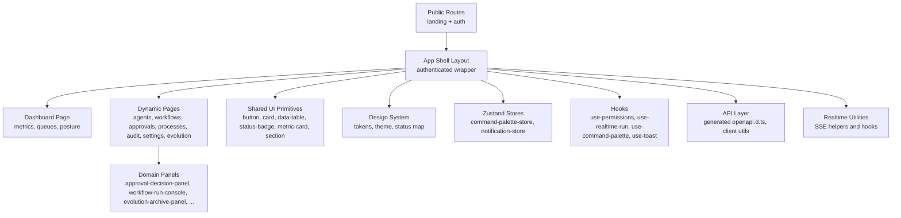
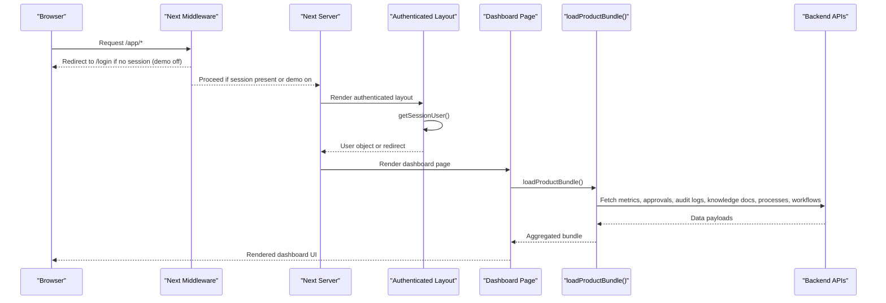
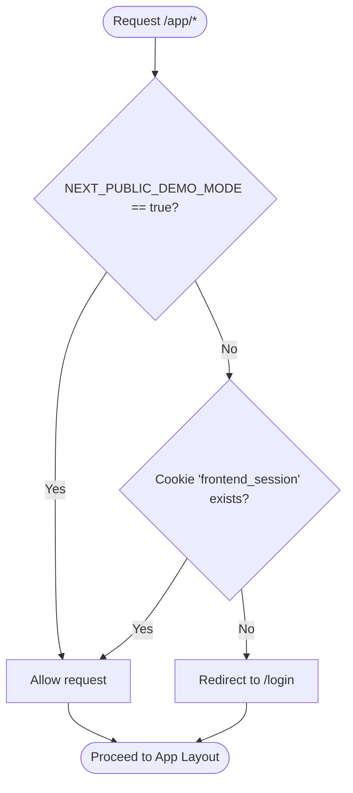
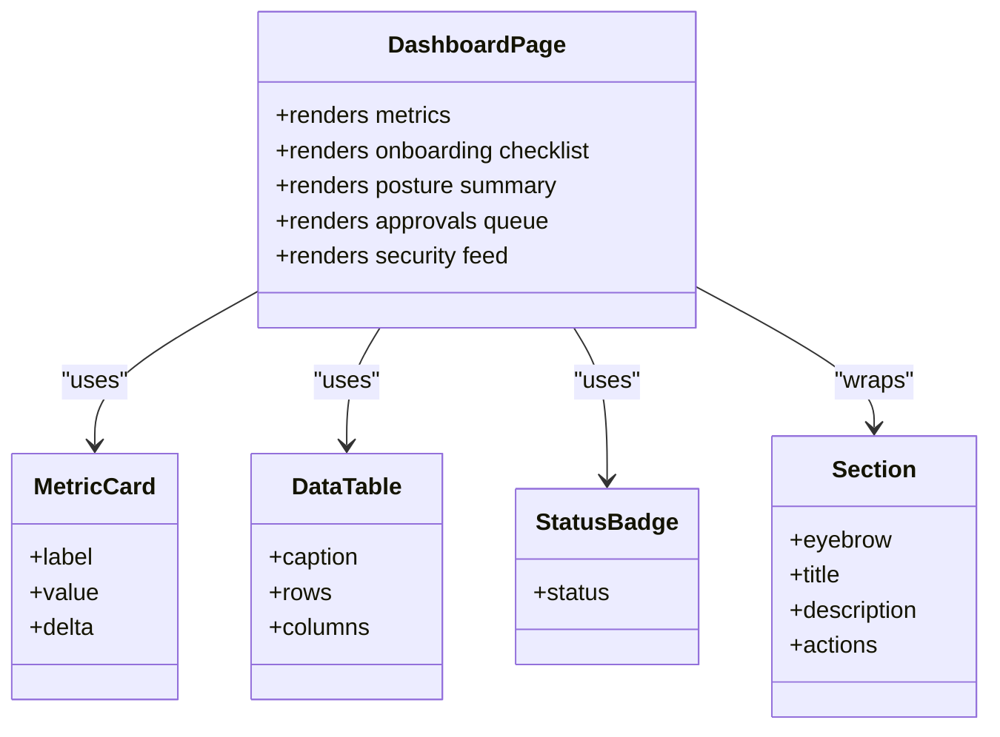
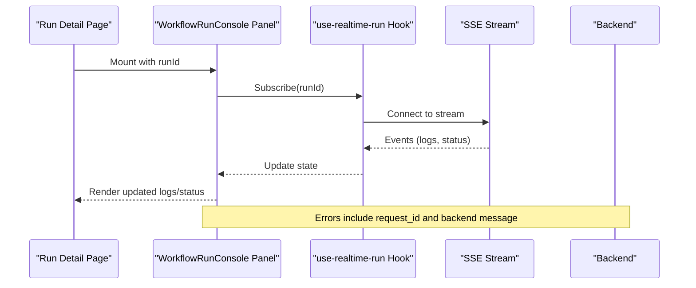
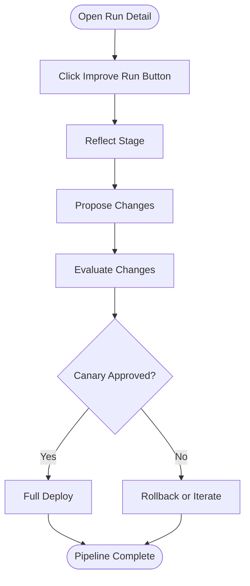
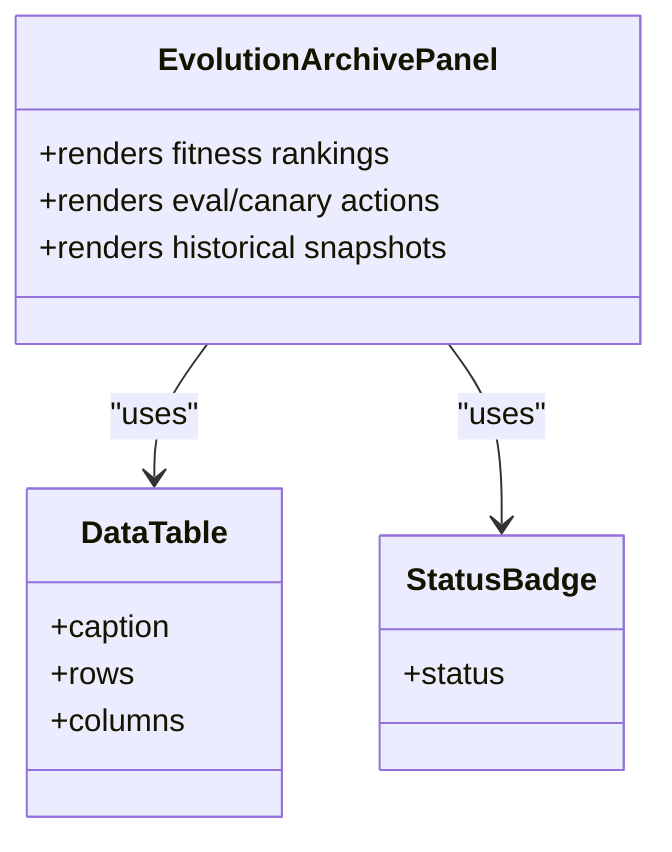
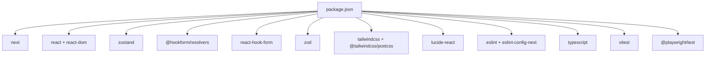

# Frontend Application

<cite>
**Referenced Files in This Document**
- [README.md](file://frontend/README.md)
- [package.json](file://frontend/package.json)
- [next.config.ts](file://frontend/next.config.ts)
- [middleware.ts](file://frontend/middleware.ts)
- [layout.tsx](file://frontend/src/app/layout.tsx)
- [page.tsx](file://frontend/src/app/page.tsx)
- [app-layout.tsx](file://frontend/src/app/app/layout.tsx)
- [dashboard-page.tsx](file://frontend/src/app/app/page.tsx)
</cite>

## Table of Contents
1. [Introduction](#introduction)
2. [Project Structure](#project-structure)
3. [Core Components](#core-components)
4. [Architecture Overview](#architecture-overview)
5. [Detailed Component Analysis](#detailed-component-analysis)
6. [Dependency Analysis](#dependency-analysis)
7. [Performance Considerations](#performance-considerations)
8. [Troubleshooting Guide](#troubleshooting-guide)
9. [Conclusion](#conclusion)
10. [Appendices](#appendices)

## Introduction
This document describes the Next.js React frontend for the governed AI business automation platform. It explains the UI architecture, component structure, state management with Zustand, real-time operations, and key dashboard surfaces including agents, workflows, approvals, process monitoring, live operations console, improve pipeline, and evolution archive viewer. It also covers responsive design patterns, accessibility considerations, theming support, and guidance for extending components, adding pages, and integrating with backend APIs.

The application targets a FastAPI backend by default and supports a demo mode for UI-only previews. It uses OpenAPI to generate typed client definitions and integrates with server-side rendering via Next.js App Router.

**Section sources**
- [README.md:1-39](file://frontend/README.md#L1-L39)
- [package.json:1-45](file://frontend/package.json#L1-L45)

## Project Structure
The frontend follows Next.js App Router conventions with a clear separation between public routes, authenticated app shell, domain-specific panels, shared UI primitives, and cross-cutting concerns (auth, API client, realtime, stores).

Key areas:
- Public routes: landing page and authentication flows
- Authenticated app shell: layout and dynamic routing for domains
- Domain panels: feature-specific UI for agents, workflows, approvals, etc.
- Shared UI: reusable primitives (buttons, cards, tables, badges, status indicators)
- Design system: tokens, theme, and status mapping
- Stores: global state using Zustand
- Hooks: command palette, permissions, realtime run, toast notifications
- API layer: generated types and client utilities
- Realtime: SSE-based hooks and utilities

[No sources needed since this diagram shows conceptual structure]

**Section sources**
- [layout.tsx:1-29](file://frontend/src/app/layout.tsx#L1-L29)
- [page.tsx:1-90](file://frontend/src/app/page.tsx#L1-L90)
- [app-layout.tsx:1-5](file://frontend/src/app/app/layout.tsx#L1-L5)
- [dashboard-page.tsx:1-154](file://frontend/src/app/app/page.tsx#L1-L154)

## Core Components
- Root layout sets fonts and base CSS variables for theming and typography.
- Landing page introduces product value and navigates to workspace or login.
- Authenticated layout enforces session checks and wraps content with AppShell.
- Dashboard aggregates metrics, onboarding checklist, posture summary, approvals queue, and security feed.

These components compose shared UI primitives and consume data from the product bundle loader and formatting utilities.

**Section sources**
- [layout.tsx:1-29](file://frontend/src/app/layout.tsx#L1-L29)
- [page.tsx:1-90](file://frontend/src/app/page.tsx#L1-L90)
- [app-layout.tsx:1-5](file://frontend/src/app/app/layout.tsx#L1-L5)
- [dashboard-page.tsx:1-154](file://frontend/src/app/app/page.tsx#L1-L154)

## Architecture Overview
The frontend is organized around Next.js App Router with middleware protecting authenticated routes. The root layout defines global styles and fonts. The app layout ensures session validity and renders the AppShell. The dashboard composes multiple domain panels and shared UI components.

**Diagram sources**
- [middleware.ts:1-13](file://frontend/middleware.ts#L1-L13)
- [app-layout.tsx:1-5](file://frontend/src/app/app/layout.tsx#L1-L5)
- [dashboard-page.tsx:1-154](file://frontend/src/app/app/page.tsx#L1-L154)

## Detailed Component Analysis

### Authentication and Session Guard
- Middleware enforces session requirements for /app routes unless demo mode is enabled.
- Authenticated layout calls a server function to retrieve the current user and redirects to login when missing.
- Demo mode allows preview without backend sessions.

**Diagram sources**
- [middleware.ts:1-13](file://frontend/middleware.ts#L1-L13)

**Section sources**
- [middleware.ts:1-13](file://frontend/middleware.ts#L1-L13)
- [app-layout.tsx:1-5](file://frontend/src/app/app/layout.tsx#L1-L5)

### Dashboard Surface
The dashboard provides:
- Metric cards summarizing operational health
- Onboarding checklist
- Posture summary with counts for pending approvals, failed knowledge docs, running processes, and active workflows
- Approvals queue table with status badges
- Security feed showing recent audit entries with timestamps

It composes shared UI primitives and uses a product bundle loader to aggregate data.

**Diagram sources**
- [dashboard-page.tsx:1-154](file://frontend/src/app/app/page.tsx#L1-L154)

**Section sources**
- [dashboard-page.tsx:1-154](file://frontend/src/app/app/page.tsx#L1-L154)

### Live Operations Console
The live operations console centers on workflow run details and real-time updates:
- Workflow run console panel displays execution logs and status transitions
- Realtime hook subscribes to run events and updates UI incrementally
- Error handling includes request-aware messages and fallback states

**Diagram sources**
- [use-realtime-run.ts](file://frontend/src/hooks/use-realtime-run.ts)
- [workflow-run-console.tsx](file://frontend/src/components/domain/workflow-run-console.tsx)

**Section sources**
- [use-realtime-run.ts](file://frontend/src/hooks/use-realtime-run.ts)
- [workflow-run-console.tsx](file://frontend/src/components/domain/workflow-run-console.tsx)

### Improve Pipeline Interface
The improve pipeline orchestrates Reflect → Propose → Evaluate → Canary stages on a run detail:
- Improve run button triggers pipeline actions
- State transitions are reflected in UI with status badges and progress indicators
- Actions integrate with backend mutation endpoints and display errors with request context

**Diagram sources**
- [improve-run-button.tsx](file://frontend/src/components/domain/improve-run-button.tsx)

**Section sources**
- [improve-run-button.tsx](file://frontend/src/components/domain/improve-run-button.tsx)

### Evolution Archive Viewer
The evolution archive viewer at /app/evolution presents:
- Fitness ranking across variants
- Evaluation results and canary actions
- Historical snapshots and lessons learned

**Diagram sources**
- [evolution-archive-panel.tsx](file://frontend/src/components/domain/evolution-archive-panel.tsx)

**Section sources**
- [evolution-archive-panel.tsx](file://frontend/src/components/domain/evolution-archive-panel.tsx)

### Responsive Design Patterns
- Grid layouts adapt across breakpoints for dashboards and panels
- Cards and sections provide consistent spacing and visual hierarchy
- Typography scales with font variables and semantic classes
- Navigation collapses into mobile-friendly menus

**Section sources**
- [dashboard-page.tsx:1-154](file://frontend/src/app/app/page.tsx#L1-L154)
- [layout.tsx:1-29](file://frontend/src/app/layout.tsx#L1-L29)

### Accessibility Compliance
- Semantic HTML elements and headings structure
- Keyboard navigation through buttons and links
- Color contrast aligned with design tokens
- Status badges and labels convey meaning beyond color

**Section sources**
- [dashboard-page.tsx:1-154](file://frontend/src/app/app/page.tsx#L1-L154)
- [layout.tsx:1-29](file://frontend/src/app/layout.tsx#L1-L29)

### Theming Support
- Global CSS variables define foreground, accent, warning, and other tokens
- Fonts are injected via Next font provider and referenced through CSS variables
- Theme configuration centralizes token values and status mappings

**Section sources**
- [layout.tsx:1-29](file://frontend/src/app/layout.tsx#L1-L29)
- [theme.ts](file://frontend/src/design/theme.ts)
- [tokens.ts](file://frontend/src/design/tokens.ts)
- [status.ts](file://frontend/src/design/status.ts)

### Extending UI Components
- Add new primitives under shared UI folder following existing patterns (props, variants, accessibility attributes)
- Compose primitives in domain panels to maintain consistency
- Use status mapping and tokens for consistent visuals

**Section sources**
- [button.tsx](file://frontend/src/components/ui/button.tsx)
- [card.tsx](file://frontend/src/components/ui/card.tsx)
- [data-table.tsx](file://frontend/src/components/ui/data-table.tsx)
- [status-badge.tsx](file://frontend/src/components/ui/status-badge.tsx)
- [metric-card.tsx](file://frontend/src/components/ui/metric-card.tsx)
- [section.tsx](file://frontend/src/components/ui/section.tsx)

### Adding New Pages
- Create a new route under app directory following Next.js conventions
- Wrap with authenticated layout if required
- Compose domain panels and shared UI primitives
- Integrate with API client and handle loading/error states

**Section sources**
- [app-layout.tsx:1-5](file://frontend/src/app/app/layout.tsx#L1-L5)
- [dashboard-page.tsx:1-154](file://frontend/src/app/app/page.tsx#L1-L154)

### Integrating with Backend APIs
- Use generated OpenAPI types for type safety
- Call API client functions with proper error handling
- Display backend messages and request IDs in mutations
- Support demo mode for offline previews

**Section sources**
- [README.md:1-39](file://frontend/README.md#L1-L39)
- [package.json:1-45](file://frontend/package.json#L1-L45)

## Dependency Analysis
The frontend depends on Next.js, React, Zustand, form libraries, and Tailwind CSS. Dev tooling includes ESLint, TypeScript, Vitest, and Playwright.

**Diagram sources**
- [package.json:1-45](file://frontend/package.json#L1-L45)

**Section sources**
- [package.json:1-45](file://frontend/package.json#L1-L45)

## Performance Considerations
- Prefer server-side data fetching where possible to reduce client payload
- Use memoization and selective re-renders for large tables and logs
- Debounce search inputs and pagination controls
- Leverage streaming and incremental updates for realtime consoles
- Keep demo mode disabled in production to avoid unnecessary mock logic

[No sources needed since this section provides general guidance]

## Troubleshooting Guide
Common issues and resolutions:
- Redirect loops on /app: Ensure session cookie is present or enable demo mode
- API generation failures: Re-run api:generate after exporting OpenAPI schema
- Realtime not updating: Verify SSE endpoint availability and network connectivity
- Form validation errors: Inspect Zod schemas and react-hook-form bindings
- Theme inconsistencies: Confirm CSS variables and token mappings are applied

**Section sources**
- [middleware.ts:1-13](file://frontend/middleware.ts#L1-L13)
- [package.json:1-45](file://frontend/package.json#L1-L45)

## Conclusion
The frontend delivers a comprehensive, governed operations interface built on Next.js with strong typing, accessible UI primitives, and real-time capabilities. It integrates tightly with the backend via OpenAPI-generated clients and supports both live and demo modes. The modular architecture enables easy extension of components, addition of new pages, and consistent theming and responsiveness.

[No sources needed since this section summarizes without analyzing specific files]

## Appendices

### Environment and Profiles
- Live ops profile: Default; requires running backend and database
- Demo profile: Set NEXT_PUBLIC_DEMO_MODE=true for UI-only preview

**Section sources**
- [README.md:1-39](file://frontend/README.md#L1-L39)

### Commands
- Development: dev, build, start
- Quality: lint, typecheck, test
- API: export OpenAPI schema and generate typed client
- E2E: Playwright smoke tests

**Section sources**
- [README.md:1-39](file://frontend/README.md#L1-L39)
- [package.json:1-45](file://frontend/package.json#L1-L45)