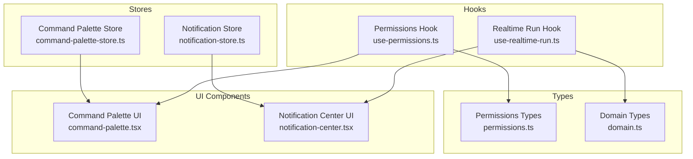
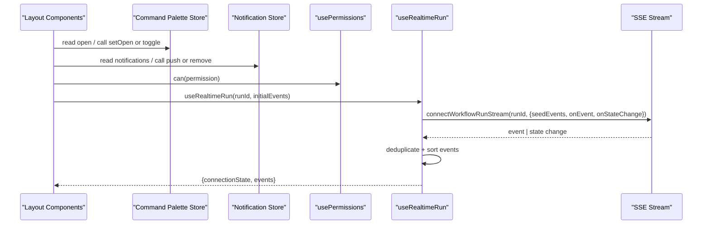
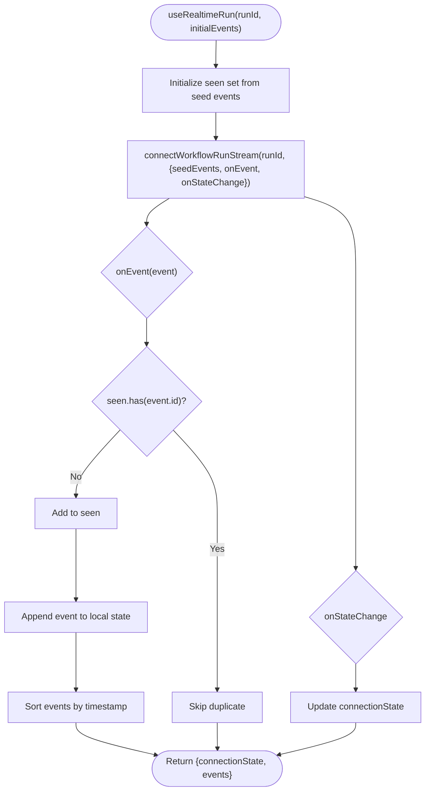
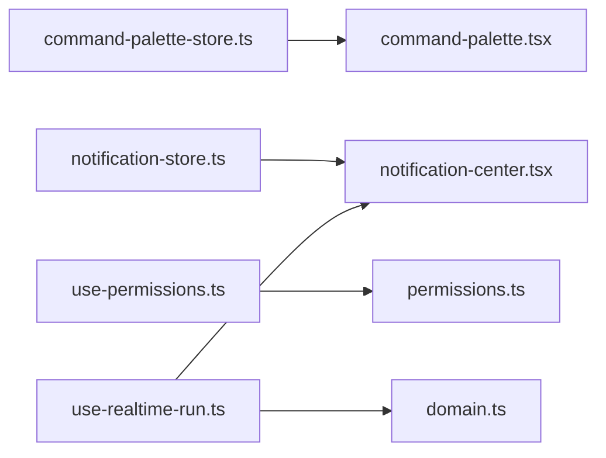

# State Management & Data Flow

<cite>
**Referenced Files in This Document**
- [command-palette-store.ts](file://frontend/src/stores/command-palette-store.ts)
- [notification-store.ts](file://frontend/src/stores/notification-store.ts)
- [use-permissions.ts](file://frontend/src/hooks/use-permissions.ts)
- [use-realtime-run.ts](file://frontend/src/hooks/use-realtime-run.ts)
- [permissions.ts](file://frontend/src/types/permissions.ts)
- [domain.ts](file://frontend/src/types/domain.ts)
- [command-palette.tsx](file://frontend/src/components/layout/command-palette.tsx)
- [notification-center.tsx](file://frontend/src/components/layout/notification-center.tsx)
</cite>

## Table of Contents
1. [Introduction](#introduction)
2. [Project Structure](#project-structure)
3. [Core Components](#core-components)
4. [Architecture Overview](#architecture-overview)
5. [Detailed Component Analysis](#detailed-component-analysis)
6. [Dependency Analysis](#dependency-analysis)
7. [Performance Considerations](#performance-considerations)
8. [Troubleshooting Guide](#troubleshooting-guide)
9. [Conclusion](#conclusion)
10. [Appendices](#appendices)

## Introduction
This document explains the frontend state management and data flow patterns with a focus on:
- Zustand stores for command palette and notifications
- Custom hooks for permissions and real-time workflow run monitoring
- API client integration patterns, data fetching strategies, and error handling
- Permission-based UI rendering
- Real-time workflow monitoring and optimistic updates
- Examples for creating new stores and custom hooks, and managing complex state interactions

The goal is to provide both high-level architecture and code-level details so that developers can extend and maintain these patterns confidently.

## Project Structure
Relevant frontend areas for this topic:
- Stores: global UI state via Zustand
- Hooks: reusable logic for permissions and real-time streaming
- Types: shared domain and permission types used by stores and hooks
- Layout components: consume stores and hooks to render UI

**Diagram sources**
- [command-palette-store.ts:1-3](file://frontend/src/stores/command-palette-store.ts#L1-L3)
- [notification-store.ts:1-4](file://frontend/src/stores/notification-store.ts#L1-L4)
- [use-permissions.ts:1-4](file://frontend/src/hooks/use-permissions.ts#L1-L4)
- [use-realtime-run.ts:1-6](file://frontend/src/hooks/use-realtime-run.ts#L1-L6)
- [permissions.ts](file://frontend/src/types/permissions.ts)
- [domain.ts](file://frontend/src/types/domain.ts)
- [command-palette.tsx](file://frontend/src/components/layout/command-palette.tsx)
- [notification-center.tsx](file://frontend/src/components/layout/notification-center.tsx)

**Section sources**
- [command-palette-store.ts:1-3](file://frontend/src/stores/command-palette-store.ts#L1-L3)
- [notification-store.ts:1-4](file://frontend/src/stores/notification-store.ts#L1-L4)
- [use-permissions.ts:1-4](file://frontend/src/hooks/use-permissions.ts#L1-L4)
- [use-realtime-run.ts:1-6](file://frontend/src/hooks/use-realtime-run.ts#L1-L6)
- [permissions.ts](file://frontend/src/types/permissions.ts)
- [domain.ts](file://frontend/src/types/domain.ts)
- [command-palette.tsx](file://frontend/src/components/layout/command-palette.tsx)
- [notification-center.tsx](file://frontend/src/components/layout/notification-center.tsx)

## Core Components
- Command Palette Store: A minimal Zustand store exposing open state and toggle/set actions. It is consumed by the command palette component to show/hide the UI.
- Notification Store: A Zustand store maintaining an array of notifications with push/remove operations. The notification center reads and dispatches actions from here.
- Permissions Hook: A lightweight hook wrapping a permission check function to derive a can(permission) helper based on the current role.
- Realtime Run Hook: A React hook that connects to a server-sent events (SSE) stream for a specific workflow run, deduplicates incoming events, maintains connection state, and returns sorted events.

These pieces form the backbone of UI state and real-time data flow.

**Section sources**
- [command-palette-store.ts:1-3](file://frontend/src/stores/command-palette-store.ts#L1-L3)
- [notification-store.ts:1-4](file://frontend/src/stores/notification-store.ts#L1-L4)
- [use-permissions.ts:1-4](file://frontend/src/hooks/use-permissions.ts#L1-L4)
- [use-realtime-run.ts:1-6](file://frontend/src/hooks/use-realtime-run.ts#L1-L6)

## Architecture Overview
The following diagram shows how UI components interact with stores and hooks, and how real-time events flow into local state.

**Diagram sources**
- [command-palette-store.ts:1-3](file://frontend/src/stores/command-palette-store.ts#L1-L3)
- [notification-store.ts:1-4](file://frontend/src/stores/notification-store.ts#L1-L4)
- [use-permissions.ts:1-4](file://frontend/src/hooks/use-permissions.ts#L1-L4)
- [use-realtime-run.ts:1-6](file://frontend/src/hooks/use-realtime-run.ts#L1-L6)

## Detailed Component Analysis

### Command Palette Store
Responsibilities:
- Maintain visibility state (open)
- Provide setters to update visibility
- Expose a toggle action for convenience

Usage pattern:
- Components subscribe to open and call setOpen/toggle to control UI.

Complexity:
- O(1) for set and toggle; memory footprint is minimal.

Optimizations:
- Keep store small and colocated with its consumer to avoid unnecessary re-renders elsewhere.

Example usage paths:
- [command-palette.tsx](file://frontend/src/components/layout/command-palette.tsx)

**Section sources**
- [command-palette-store.ts:1-3](file://frontend/src/stores/command-palette-store.ts#L1-L3)
- [command-palette.tsx](file://frontend/src/components/layout/command-palette.tsx)

### Notification Store
Responsibilities:
- Maintain a bounded list of notifications
- Provide push to prepend a new notification and remove to delete by id

Data model:
- notifications: array of objects with id, title, description

Operations:
- push(notification): adds at head and slices to keep up to 5 items
- remove(id): filters out the matching notification

Complexity:
- push: O(n) due to slice; n ≤ 5, effectively constant time
- remove: O(n)

Error handling:
- Ensure unique ids per notification to avoid accidental removals.

Example usage paths:
- [notification-center.tsx](file://frontend/src/components/layout/notification-center.tsx)

**Section sources**
- [notification-store.ts:1-4](file://frontend/src/stores/notification-store.ts#L1-L4)
- [notification-center.tsx](file://frontend/src/components/layout/notification-center.tsx)

### Permissions Hook
Responsibilities:
- Derive a can(permission) predicate based on the provided role
- Encapsulate the underlying hasPermission utility

Integration points:
- Consumed by UI to conditionally render features or actions

Type dependencies:
- AppRole and Permission types define the allowed roles and permissions

Example usage paths:
- [use-permissions.ts:1-4](file://frontend/src/hooks/use-permissions.ts#L1-L4)
- [permissions.ts](file://frontend/src/types/permissions.ts)

**Section sources**
- [use-permissions.ts:1-4](file://frontend/src/hooks/use-permissions.ts#L1-L4)
- [permissions.ts](file://frontend/src/types/permissions.ts)

### Realtime Run Hook
Responsibilities:
- Connect to an SSE stream for a given workflow run
- Seed initial events to avoid gaps
- Deduplicate events using a Set keyed by event id
- Track connection state transitions
- Return stable, sorted events

Flow:
- On mount, initialize seen set from seed events
- Establish connection with callbacks for events and state changes
- On each event, skip if already seen, otherwise append
- Sort events by timestamp before returning

Complexity:
- Deduplication: O(1) average per event lookup
- Sorting: O(m log m) where m is number of events; typically small per page

Connection states:
- connecting, open, reconnecting, closed

Example usage paths:
- [use-realtime-run.ts:1-6](file://frontend/src/hooks/use-realtime-run.ts#L1-L6)
- [domain.ts](file://frontend/src/types/domain.ts)

**Diagram sources**
- [use-realtime-run.ts:1-6](file://frontend/src/hooks/use-realtime-run.ts#L1-L6)

**Section sources**
- [use-realtime-run.ts:1-6](file://frontend/src/hooks/use-realtime-run.ts#L1-L6)
- [domain.ts](file://frontend/src/types/domain.ts)

### Permission-Based UI Rendering
Pattern:
- Use the permissions hook to compute a can(permission) predicate
- Conditionally render UI elements or enable/disable actions based on the result

Best practices:
- Centralize permission checks in the hook
- Avoid scattering raw role comparisons across components

Example usage paths:
- [use-permissions.ts:1-4](file://frontend/src/hooks/use-permissions.ts#L1-L4)
- [permissions.ts](file://frontend/src/types/permissions.ts)

**Section sources**
- [use-permissions.ts:1-4](file://frontend/src/hooks/use-permissions.ts#L1-L4)
- [permissions.ts](file://frontend/src/types/permissions.ts)

### Optimistic Updates with Notifications
Pattern:
- Immediately push a temporary notification to indicate progress
- On success, replace with a success notification
- On failure, replace with an error notification and optionally include recovery actions

Implementation notes:
- Use unique ids for notifications to ensure correct replacement
- Keep messages concise and actionable

Example usage paths:
- [notification-store.ts:1-4](file://frontend/src/stores/notification-store.ts#L1-L4)
- [notification-center.tsx](file://frontend/src/components/layout/notification-center.tsx)

**Section sources**
- [notification-store.ts:1-4](file://frontend/src/stores/notification-store.ts#L1-L4)
- [notification-center.tsx](file://frontend/src/components/layout/notification-center.tsx)

## Dependency Analysis
High-level relationships between modules involved in state and data flow:

**Diagram sources**
- [command-palette-store.ts:1-3](file://frontend/src/stores/command-palette-store.ts#L1-L3)
- [notification-store.ts:1-4](file://frontend/src/stores/notification-store.ts#L1-L4)
- [use-permissions.ts:1-4](file://frontend/src/hooks/use-permissions.ts#L1-L4)
- [use-realtime-run.ts:1-6](file://frontend/src/hooks/use-realtime-run.ts#L1-L6)
- [permissions.ts](file://frontend/src/types/permissions.ts)
- [domain.ts](file://frontend/src/types/domain.ts)
- [command-palette.tsx](file://frontend/src/components/layout/command-palette.tsx)
- [notification-center.tsx](file://frontend/src/components/layout/notification-center.tsx)

**Section sources**
- [command-palette-store.ts:1-3](file://frontend/src/stores/command-palette-store.ts#L1-L3)
- [notification-store.ts:1-4](file://frontend/src/stores/notification-store.ts#L1-L4)
- [use-permissions.ts:1-4](file://frontend/src/hooks/use-permissions.ts#L1-L4)
- [use-realtime-run.ts:1-6](file://frontend/src/hooks/use-realtime-run.ts#L1-L6)
- [permissions.ts](file://frontend/src/types/permissions.ts)
- [domain.ts](file://frontend/src/types/domain.ts)
- [command-palette.tsx](file://frontend/src/components/layout/command-palette.tsx)
- [notification-center.tsx](file://frontend/src/components/layout/notification-center.tsx)

## Performance Considerations
- Keep Zustand stores focused and minimal to reduce re-renders.
- Prefer derived selectors when reading subsets of state.
- For real-time streams:
  - Deduplicate events to prevent redundant renders
  - Batch updates where possible
  - Sort only when necessary or memoize results
- Limit notification history size to avoid large arrays.

[No sources needed since this section provides general guidance]

## Troubleshooting Guide
Common issues and resolutions:
- Duplicate events in realtime view:
  - Verify the seen set initialization includes all seed events
  - Ensure event ids are stable and unique
- Notifications not updating:
  - Confirm unique ids are used for each notification
  - Check that push/remove are called with correct ids
- Permission checks not working:
  - Validate that the role type matches expected values
  - Ensure the underlying hasPermission implementation covers required cases

**Section sources**
- [use-realtime-run.ts:1-6](file://frontend/src/hooks/use-realtime-run.ts#L1-L6)
- [notification-store.ts:1-4](file://frontend/src/stores/notification-store.ts#L1-L4)
- [use-permissions.ts:1-4](file://frontend/src/hooks/use-permissions.ts#L1-L4)

## Conclusion
The frontend employs a clear separation of concerns:
- Zustand stores manage global UI state for command palette and notifications
- Custom hooks encapsulate permission checks and real-time streaming logic
- UI components remain thin consumers of stores and hooks
This structure supports scalable state management, predictable data flows, and robust real-time workflows.

[No sources needed since this section summarizes without analyzing specific files]

## Appendices

### Creating a New Zustand Store
Guidelines:
- Define a minimal state shape and corresponding actions
- Export a typed create() store
- Consume via the returned hook in components

Reference patterns:
- [command-palette-store.ts:1-3](file://frontend/src/stores/command-palette-store.ts#L1-L3)
- [notification-store.ts:1-4](file://frontend/src/stores/notification-store.ts#L1-L4)

**Section sources**
- [command-palette-store.ts:1-3](file://frontend/src/stores/command-palette-store.ts#L1-L3)
- [notification-store.ts:1-4](file://frontend/src/stores/notification-store.ts#L1-L4)

### Implementing a Custom Hook
Guidelines:
- Encapsulate side effects and derived state
- Accept inputs and return stable outputs
- Handle cleanup (e.g., closing connections)

Reference patterns:
- [use-permissions.ts:1-4](file://frontend/src/hooks/use-permissions.ts#L1-L4)
- [use-realtime-run.ts:1-6](file://frontend/src/hooks/use-realtime-run.ts#L1-L6)

**Section sources**
- [use-permissions.ts:1-4](file://frontend/src/hooks/use-permissions.ts#L1-L4)
- [use-realtime-run.ts:1-6](file://frontend/src/hooks/use-realtime-run.ts#L1-L6)

### Managing Complex State Interactions
Patterns:
- Combine multiple stores and hooks within a component
- Use optimistic updates with notifications for user feedback
- Apply permission checks to gate actions and UI

Reference patterns:
- [notification-store.ts:1-4](file://frontend/src/stores/notification-store.ts#L1-L4)
- [use-permissions.ts:1-4](file://frontend/src/hooks/use-permissions.ts#L1-L4)
- [use-realtime-run.ts:1-6](file://frontend/src/hooks/use-realtime-run.ts#L1-L6)

**Section sources**
- [notification-store.ts:1-4](file://frontend/src/stores/notification-store.ts#L1-L4)
- [use-permissions.ts:1-4](file://frontend/src/hooks/use-permissions.ts#L1-L4)
- [use-realtime-run.ts:1-6](file://frontend/src/hooks/use-realtime-run.ts#L1-L6)