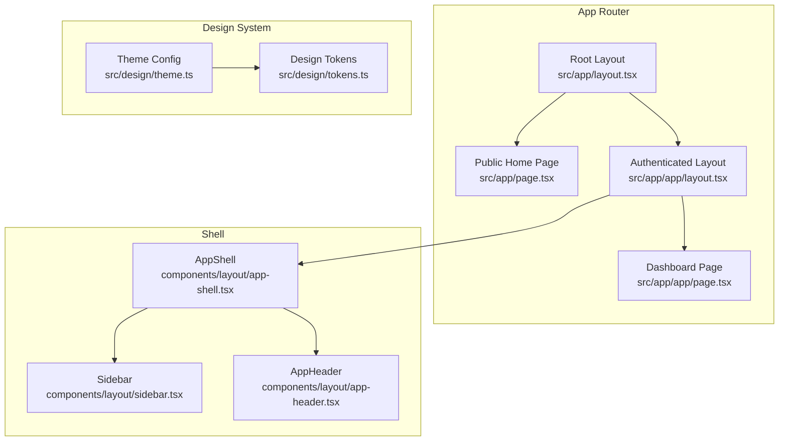
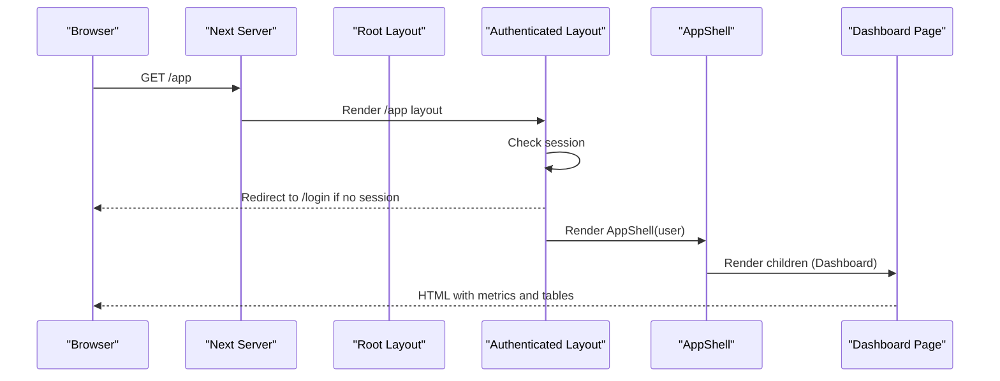
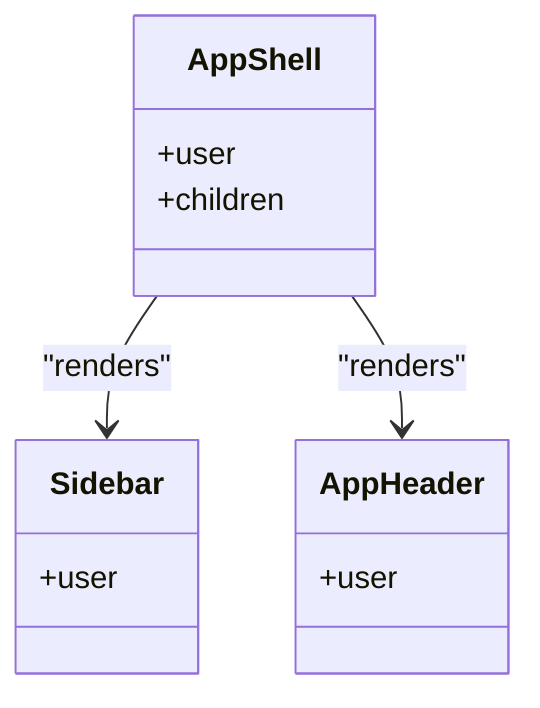
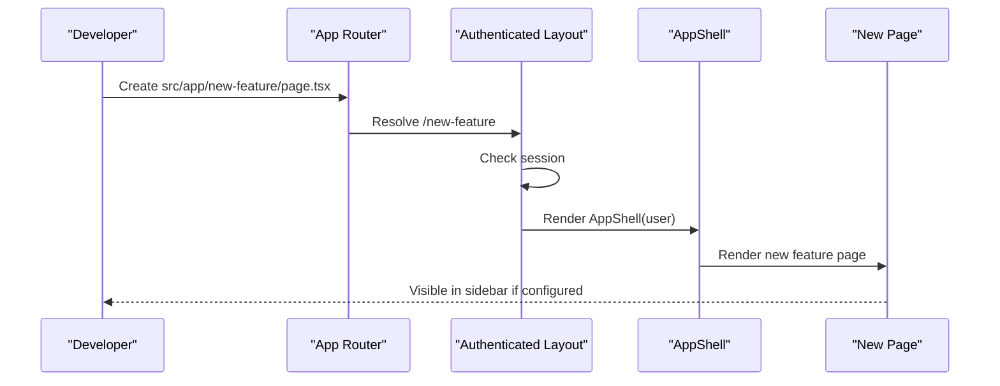
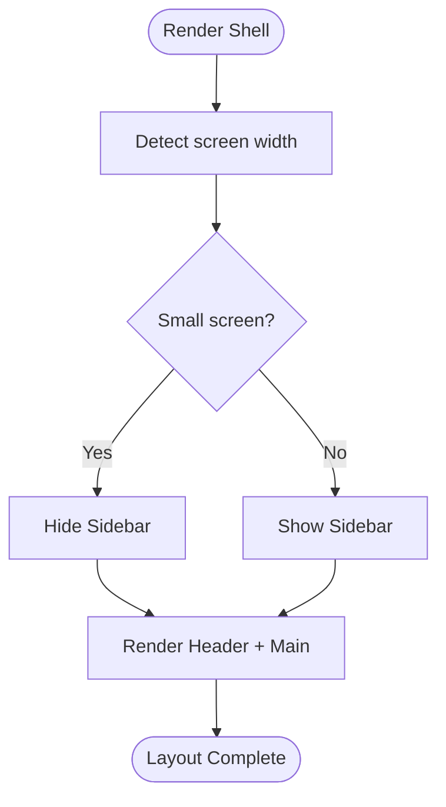
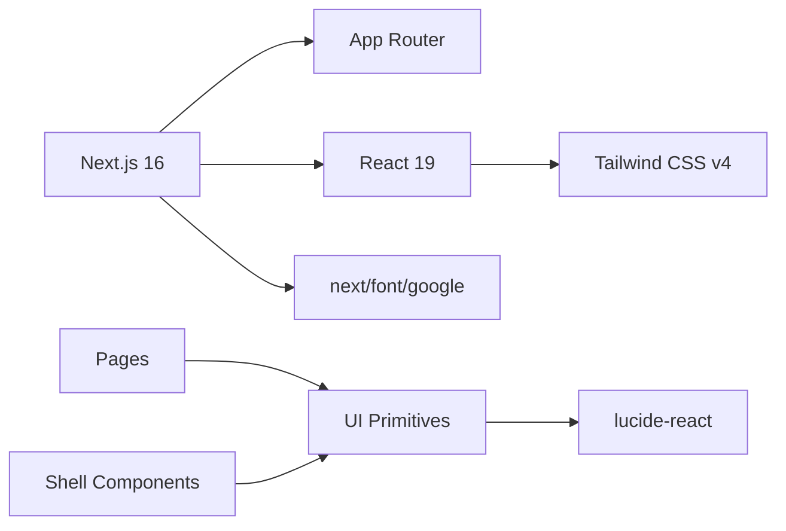

# UI Architecture & Components

<cite>
**Referenced Files in This Document**
- [package.json](file://frontend/package.json)
- [next.config.ts](file://frontend/next.config.ts)
- [layout.tsx](file://frontend/src/app/layout.tsx)
- [page.tsx](file://frontend/src/app/page.tsx)
- [app-layout.tsx](file://frontend/src/app/app/layout.tsx)
- [dashboard-page.tsx](file://frontend/src/app/app/page.tsx)
- [theme.ts](file://frontend/src/design/theme.ts)
- [tokens.ts](file://frontend/src/design/tokens.ts)
- [app-shell.tsx](file://frontend/src/components/layout/app-shell.tsx)
- [sidebar.tsx](file://frontend/src/components/layout/sidebar.tsx)
</cite>

## Table of Contents
1. Introduction
2. Project Structure
3. Core Components
4. Architecture Overview
5. Detailed Component Analysis
6. Dependency Analysis
7. Performance Considerations
8. Troubleshooting Guide
9. Conclusion
10. Appendices

## Introduction
This document explains the frontend UI architecture for the Next.js application using the App Router. It covers the layout system, component hierarchy, and design system (theme configuration, design tokens, typography with IBM Plex fonts). It also documents shell components that provide consistent navigation and layout, including AppShell, Sidebar, and AppHeader, and provides guidance on creating new pages, extending the design system, and implementing responsive layouts.

## Project Structure
The frontend is a Next.js 16 application with React 19 and Tailwind CSS v4. The App Router organizes routes under src/app. A root layout sets global metadata and typography variables, while an authenticated app layout enforces session checks and wraps content with the AppShell. The dashboard page composes reusable UI primitives to present operational metrics and tables.

**Diagram sources**
- [layout.tsx:1-29](file://frontend/src/app/layout.tsx#L1-L29)
- [page.tsx:1-90](file://frontend/src/app/page.tsx#L1-L90)
- [app-layout.tsx:1-5](file://frontend/src/app/app/layout.tsx#L1-L5)
- [dashboard-page.tsx:1-154](file://frontend/src/app/app/page.tsx#L1-L154)
- [app-shell.tsx:1-6](file://frontend/src/components/layout/app-shell.tsx#L1-L6)
- [sidebar.tsx:1-9](file://frontend/src/components/layout/sidebar.tsx#L1-L9)
- [theme.ts:1-11](file://frontend/src/design/theme.ts#L1-L11)
- [tokens.ts:1-14](file://frontend/src/design/tokens.ts#L1-L14)

**Section sources**
- [package.json:1-45](file://frontend/package.json#L1-L45)
- [next.config.ts:1-8](file://frontend/next.config.ts#L1-L8)
- [layout.tsx:1-29](file://frontend/src/app/layout.tsx#L1-L29)
- [page.tsx:1-90](file://frontend/src/app/page.tsx#L1-L90)
- [app-layout.tsx:1-5](file://frontend/src/app/app/layout.tsx#L1-L5)
- [dashboard-page.tsx:1-154](file://frontend/src/app/app/page.tsx#L1-L154)
- [app-shell.tsx:1-6](file://frontend/src/components/layout/app-shell.tsx#L1-L6)
- [sidebar.tsx:1-9](file://frontend/src/components/layout/sidebar.tsx#L1-L9)
- [theme.ts:1-11](file://frontend/src/design/theme.ts#L1-L11)
- [tokens.ts:1-14](file://frontend/src/design/tokens.ts#L1-L14)

## Core Components
- Root Layout: Sets global metadata and injects IBM Plex Sans and IBM Plex Mono as CSS variables for body and mono text. Applies base font classes and theme color variables to the body.
- Authenticated Layout: Guards access by checking the current session; redirects unauthenticated users to login and renders AppShell around children.
- AppShell: Provides the main layout grid with Sidebar and AppHeader, and a responsive main content area.
- Sidebar: Renders navigation groups filtered by user permissions and highlights the active route.
- Dashboard Page: Composes Section, MetricCard, DataTable, StatusBadge, and other UI primitives to display operational data.

Key responsibilities:
- Global typography and theming via CSS variables
- Route-level authentication gating
- Consistent shell layout across authenticated pages
- Permission-aware navigation rendering

**Section sources**
- [layout.tsx:1-29](file://frontend/src/app/layout.tsx#L1-L29)
- [app-layout.tsx:1-5](file://frontend/src/app/app/layout.tsx#L1-L5)
- [app-shell.tsx:1-6](file://frontend/src/components/layout/app-shell.tsx#L1-L6)
- [sidebar.tsx:1-9](file://frontend/src/components/layout/sidebar.tsx#L1-L9)
- [dashboard-page.tsx:1-154](file://frontend/src/app/app/page.tsx#L1-L154)

## Architecture Overview
The UI follows a layered structure:
- App Router layers: Root layout -> Authenticated layout -> Pages
- Shell layer: AppShell encapsulates Sidebar and AppHeader
- Design system: Theme config references design tokens and typography names
- UI primitives: Reusable components used by pages and shells

**Diagram sources**
- [app-layout.tsx:1-5](file://frontend/src/app/app/layout.tsx#L1-L5)
- [app-shell.tsx:1-6](file://frontend/src/components/layout/app-shell.tsx#L1-L6)
- [dashboard-page.tsx:1-154](file://frontend/src/app/app/page.tsx#L1-L154)

## Detailed Component Analysis

### Root Layout and Typography
- Injects IBM Plex Sans and IBM Plex Mono from next/font/google
- Exposes CSS custom properties for fonts and applies them globally
- Defines site-wide metadata (title and description)
- Establishes base styles for body including font family, size, color, and antialiasing

Implementation notes:
- Font variables are attached to the html element for use throughout the app
- Body class uses CSS variables for colors and font families

**Section sources**
- [layout.tsx:1-29](file://frontend/src/app/layout.tsx#L1-L29)

### Authentication-Gated App Layout
- Uses server-side session check to redirect unauthenticated users
- Wraps all child routes with AppShell, ensuring consistent shell across authenticated areas

Behavioral flow:
- If no session exists, redirect to login
- Otherwise render AppShell with user context and children

**Section sources**
- [app-layout.tsx:1-5](file://frontend/src/app/app/layout.tsx#L1-L5)

### AppShell
- Renders a responsive flex layout with Sidebar on the left and a flexible main area
- Places AppHeader at the top of the main area
- Main content area adapts padding based on viewport size

Responsiveness:
- On small screens, Sidebar is hidden; on larger screens it appears as a fixed-width column
- Main area scales horizontally and vertically to fill remaining space

**Section sources**
- [app-shell.tsx:1-6](file://frontend/src/components/layout/app-shell.tsx#L1-L6)

### Sidebar
- Client component using next/navigation to detect active path
- Filters navigation items by user role-based permissions
- Highlights the active link and supports nested paths

Navigation model:
- Navigation groups define sections and items with labels, icons, hrefs, and required permissions
- hasPermission determines visibility per item

**Section sources**
- [sidebar.tsx:1-9](file://frontend/src/components/layout/sidebar.tsx#L1-L9)

### Dashboard Page
- Aggregates operational data and renders it using UI primitives
- Displays metric cards, onboarding checklist, posture summary, approvals queue table, and audit feed
- Uses DataTable with custom column renderers for status badges

Data composition:
- Loads product bundle containing metrics, approvals, audit logs, knowledge docs, processes, workflows, and checklist
- Formats dates and maps statuses to visual badges

**Section sources**
- [dashboard-page.tsx:1-154](file://frontend/src/app/app/page.tsx#L1-L154)

### Design System: Theme and Tokens
- Theme object centralizes brand name, token reference, and typography names
- Tokens define core colors for background, surface, accent variants, semantic states, and muted text

Usage patterns:
- Theme references tokens and typography names
- Fonts are loaded via next/font and exposed as CSS variables
- Colors are consumed through CSS variables applied in Tailwind utilities

**Section sources**
- [theme.ts:1-11](file://frontend/src/design/theme.ts#L1-L11)
- [tokens.ts:1-14](file://frontend/src/design/tokens.ts#L1-L14)

#### Class Diagram: Shell Components

**Diagram sources**
- [app-shell.tsx:1-6](file://frontend/src/components/layout/app-shell.tsx#L1-L6)
- [sidebar.tsx:1-9](file://frontend/src/components/layout/sidebar.tsx#L1-L9)

#### Sequence Diagram: Creating a New Page Under /app

[No diagram sources needed since this diagram shows conceptual workflow, not actual code structure]

#### Flowchart: Responsive Layout Behavior

[No diagram sources needed since this diagram shows conceptual workflow, not actual code structure]

## Dependency Analysis
- Next.js runtime and App Router orchestrate layout and routing
- React 19 powers client/server components
- Tailwind CSS v4 provides utility-first styling
- next/font supplies Google fonts with variable injection
- lucide-react provides icons used in pages and shells
- Zustand and react-hook-form are available for state and forms (not directly used in analyzed files)

**Diagram sources**
- [package.json:1-45](file://frontend/package.json#L1-L45)
- [layout.tsx:1-29](file://frontend/src/app/layout.tsx#L1-L29)
- [dashboard-page.tsx:1-154](file://frontend/src/app/app/page.tsx#L1-L154)
- [app-shell.tsx:1-6](file://frontend/src/components/layout/app-shell.tsx#L1-L6)

**Section sources**
- [package.json:1-45](file://frontend/package.json#L1-L45)
- [next.config.ts:1-8](file://frontend/next.config.ts#L1-L8)

## Performance Considerations
- Prefer server components for data-heavy pages to reduce client bundle size
- Use next/font to avoid layout shifts and minimize font loading overhead
- Keep Sidebar lightweight; defer heavy logic to client-only interactions when necessary
- Leverage Tailwind’s utility classes to avoid large custom CSS payloads
- Avoid unnecessary re-renders by memoizing expensive computations and keeping client state minimal

## Troubleshooting Guide
- Unauthenticated redirect loop: Ensure the session check in the authenticated layout correctly identifies logged-in users and redirects appropriately
- Sidebar not showing: Verify responsive breakpoints and ensure the Sidebar is visible on larger screens; confirm navigation groups include items with matching permissions
- Active link highlighting: Confirm pathname comparisons account for nested routes
- Typography not applying: Check that font variables are set on the html element and that CSS variables are referenced in Tailwind utilities or inline styles

**Section sources**
- [app-layout.tsx:1-5](file://frontend/src/app/app/layout.tsx#L1-L5)
- [sidebar.tsx:1-9](file://frontend/src/components/layout/sidebar.tsx#L1-L9)
- [layout.tsx:1-29](file://frontend/src/app/layout.tsx#L1-L29)

## Conclusion
The frontend UI architecture centers on a clean App Router setup with a strong separation between global layout, authentication gating, and shell composition. The design system standardizes typography and colors, while shell components deliver a consistent, permission-aware navigation experience. Pages compose reusable UI primitives to present complex operational data clearly and responsively.

## Appendices

### How to Create a New Page
- Add a new folder under src/app with a page.tsx file
- If the page requires authentication, place it under src/app so the authenticated layout will apply
- Optionally add a corresponding entry in the navigation types to appear in the Sidebar

**Section sources**
- [app-layout.tsx:1-5](file://frontend/src/app/app/layout.tsx#L1-L5)
- [sidebar.tsx:1-9](file://frontend/src/components/layout/sidebar.tsx#L1-L9)

### How to Extend the Design System
- Add new tokens to the tokens file and reference them via CSS variables
- Update the theme configuration to include any additional typography or branding values
- Apply tokens in components using Tailwind utilities or CSS variables

**Section sources**
- [tokens.ts:1-14](file://frontend/src/design/tokens.ts#L1-L14)
- [theme.ts:1-11](file://frontend/src/design/theme.ts#L1-L11)

### Implementing Responsive Layouts
- Use Tailwind’s responsive prefixes to adjust spacing, grids, and visibility
- In the shell, rely on existing responsive classes to hide/show the Sidebar and adjust main content padding
- For complex layouts, prefer CSS Grid and Flexbox utilities provided by Tailwind

**Section sources**
- [app-shell.tsx:1-6](file://frontend/src/components/layout/app-shell.tsx#L1-L6)
- [dashboard-page.tsx:1-154](file://frontend/src/app/app/page.tsx#L1-L154)