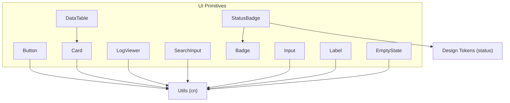
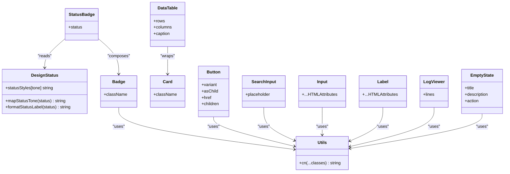
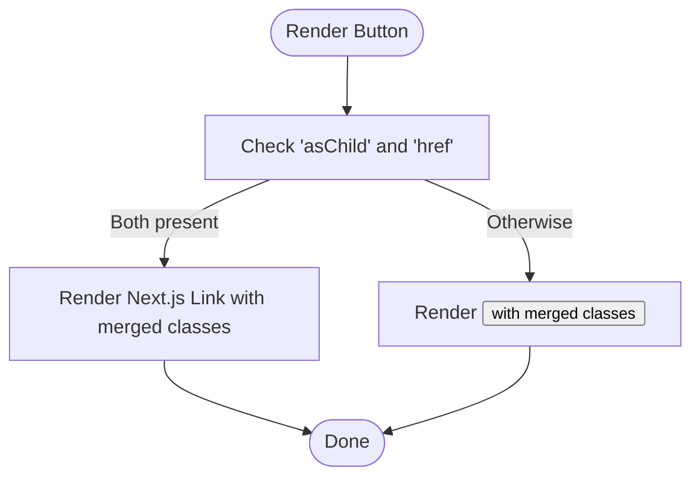
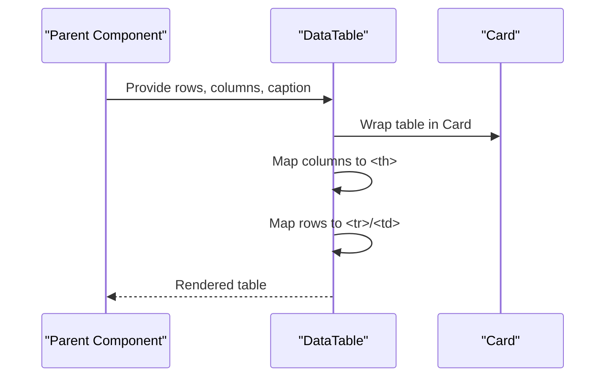
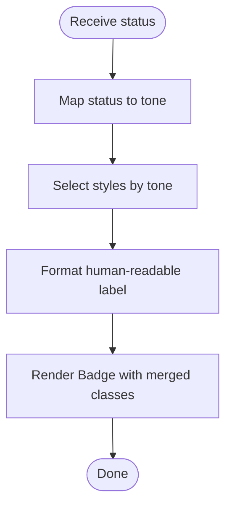
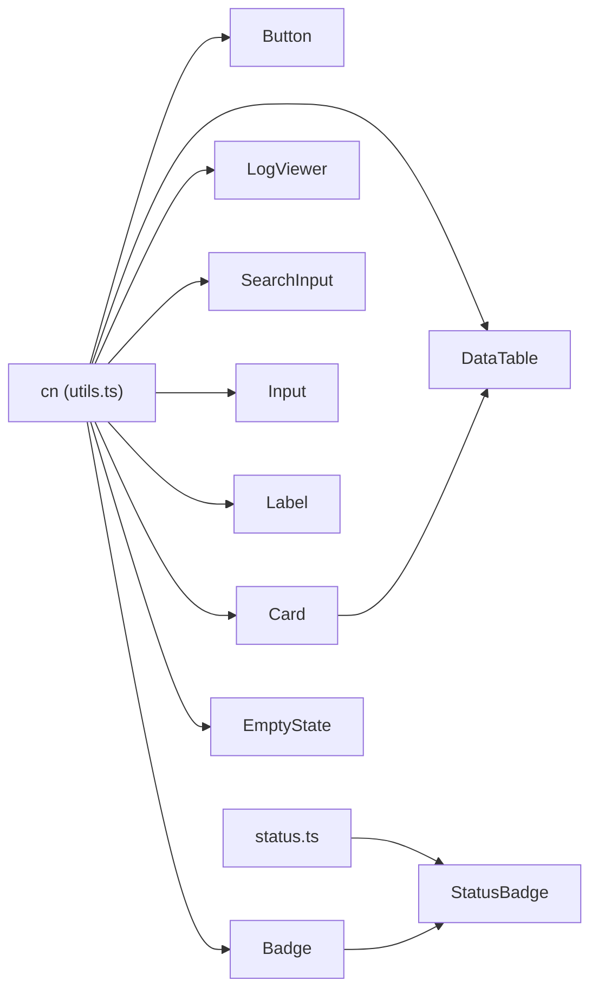

# UI Component Library

<cite>
**Referenced Files in This Document**
- [button.tsx](file://frontend/src/components/ui/button.tsx)
- [card.tsx](file://frontend/src/components/ui/card.tsx)
- [data-table.tsx](file://frontend/src/components/ui/data-table.tsx)
- [log-viewer.tsx](file://frontend/src/components/ui/log-viewer.tsx)
- [status-badge.tsx](file://frontend/src/components/ui/status-badge.tsx)
- [search-input.tsx](file://frontend/src/components/ui/search-input.tsx)
- [badge.tsx](file://frontend/src/components/ui/badge.tsx)
- [input.tsx](file://frontend/src/components/ui/input.tsx)
- [label.tsx](file://frontend/src/components/ui/label.tsx)
- [empty-state.tsx](file://frontend/src/components/ui/empty-state.tsx)
- [utils.ts](file://frontend/src/lib/utils.ts)
- [status.ts](file://frontend/src/design/status.ts)
</cite>

## Table of Contents
1. [Introduction](#introduction)
2. [Project Structure](#project-structure)
3. [Core Components](#core-components)
4. [Architecture Overview](#architecture-overview)
5. [Detailed Component Analysis](#detailed-component-analysis)
6. [Dependency Analysis](#dependency-analysis)
7. [Performance Considerations](#performance-considerations)
8. [Troubleshooting Guide](#troubleshooting-guide)
9. [Conclusion](#conclusion)
10. [Appendices](#appendices)

## Introduction
This document describes the reusable UI component library used across the application. It focuses on base components such as Button, Card, DataTable, LogViewer, StatusBadge, SearchInput, and other shared UI elements. For each component, you will find:
- API overview (props and behavior)
- Styling approach using Tailwind CSS and design tokens
- Accessibility considerations
- Customization options
- Usage examples and guidelines for consistent usage

The library is implemented with React and styled via Tailwind utility classes, leveraging a small set of helpers and design tokens to ensure consistency.

## Project Structure
The UI components live under the frontend source tree and are organized by feature area. The core primitives are located in the ui directory and are composed into higher-level domain-specific components elsewhere.

**Diagram sources**
- [button.tsx](file://frontend/src/components/ui/button.tsx)
- [card.tsx](file://frontend/src/components/ui/card.tsx)
- [data-table.tsx](file://frontend/src/components/ui/data-table.tsx)
- [log-viewer.tsx](file://frontend/src/components/ui/log-viewer.tsx)
- [status-badge.tsx](file://frontend/src/components/ui/status-badge.tsx)
- [search-input.tsx](file://frontend/src/components/ui/search-input.tsx)
- [badge.tsx](file://frontend/src/components/ui/badge.tsx)
- [input.tsx](file://frontend/src/components/ui/input.tsx)
- [label.tsx](file://frontend/src/components/ui/label.tsx)
- [empty-state.tsx](file://frontend/src/components/ui/empty-state.tsx)
- [utils.ts](file://frontend/src/lib/utils.ts)
- [status.ts](file://frontend/src/design/status.ts)

**Section sources**
- [button.tsx](file://frontend/src/components/ui/button.tsx)
- [card.tsx](file://frontend/src/components/ui/card.tsx)
- [data-table.tsx](file://frontend/src/components/ui/data-table.tsx)
- [log-viewer.tsx](file://frontend/src/components/ui/log-viewer.tsx)
- [status-badge.tsx](file://frontend/src/components/ui/status-badge.tsx)
- [search-input.tsx](file://frontend/src/components/ui/search-input.tsx)
- [badge.tsx](file://frontend/src/components/ui/badge.tsx)
- [input.tsx](file://frontend/src/components/ui/input.tsx)
- [label.tsx](file://frontend/src/components/ui/label.tsx)
- [empty-state.tsx](file://frontend/src/components/ui/empty-state.tsx)
- [utils.ts](file://frontend/src/lib/utils.ts)
- [status.ts](file://frontend/src/design/status.ts)

## Core Components
Below is a concise overview of each primitive component’s purpose and key props.

- Button
  - Purpose: Primary interactive control with multiple visual variants and optional navigation support.
  - Key props: variant, asChild, href, children, plus standard button attributes.
  - Styling: Uses Tailwind utilities and CSS variables; supports focus-visible outlines.
  - Accessibility: Focus ring, keyboard activation, semantic <button> or <Link>.
  - Customization: Choose variant, pass className, or render as child element.

- Card
  - Purpose: Content container with rounded corners and subtle borders.
  - Key props: Standard div attributes via className.
  - Styling: Surface styling with padding and border radius.
  - Accessibility: Semantic container; compose with headings and content.
  - Customization: Extend via className.

- DataTable
  - Purpose: Tabular display with typed columns and optional caption.
  - Key props: rows, columns, caption.
  - Styling: Header/footer styles, hover states, responsive overflow.
  - Accessibility: Optional caption for screen readers; semantic table structure.
  - Customization: Provide custom column renderers; extend via className on wrapper.

- LogViewer
  - Purpose: Scrollable log viewer with monospace font and accent-colored text.
  - Key props: lines array.
  - Styling: Dark background, thin scrollbar, fixed max height.
  - Accessibility: Read-only content; consider adding aria-label if needed.
  - Customization: Wrap with additional containers; style via parent.

- StatusBadge
  - Purpose: Displays status with tone-aware styling and human-readable label.
  - Key props: status string.
  - Styling: Derived from design tokens and mapping functions.
  - Accessibility: Semantic badge; ensure status values are meaningful.
  - Customization: Extend status mappings and labels centrally.

- SearchInput
  - Purpose: Search field with icon and placeholder.
  - Key props: placeholder.
  - Styling: Rounded input with transparent background and focus ring.
  - Accessibility: Labeling should be provided by parent; type="search".
  - Customization: Compose with form libraries; style via parent.

- Badge
  - Purpose: Small inline indicator with border and subtle background.
  - Key props: Standard span attributes via className.
  - Styling: Pill shape with border and muted background.
  - Accessibility: Use for non-essential indicators; avoid conveying critical info alone.
  - Customization: Extend via className.

- Input
  - Purpose: Base text input with focus state and consistent sizing.
  - Key props: Standard input attributes.
  - Styling: Rounded, bordered, accent focus color.
  - Accessibility: Pair with Label; use htmlFor/id when needed.
  - Customization: Extend via className.

- Label
  - Purpose: Form label with uppercase tracking and muted text.
  - Key props: Standard label attributes.
  - Styling: Consistent typography and spacing.
  - Accessibility: Associate with inputs via htmlFor/id.
  - Customization: Extend via className.

- EmptyState
  - Purpose: Placeholder for empty data sets with title, description, and optional action.
  - Key props: title, description, action.
  - Styling: Dashed border, centered layout, muted text.
  - Accessibility: Use heading levels appropriately; provide actionable controls.
  - Customization: Replace action slot with any ReactNode.

**Section sources**
- [button.tsx](file://frontend/src/components/ui/button.tsx)
- [card.tsx](file://frontend/src/components/ui/card.tsx)
- [data-table.tsx](file://frontend/src/components/ui/data-table.tsx)
- [log-viewer.tsx](file://frontend/src/components/ui/log-viewer.tsx)
- [status-badge.tsx](file://frontend/src/components/ui/status-badge.tsx)
- [search-input.tsx](file://frontend/src/components/ui/search-input.tsx)
- [badge.tsx](file://frontend/src/components/ui/badge.tsx)
- [input.tsx](file://frontend/src/components/ui/input.tsx)
- [label.tsx](file://frontend/src/components/ui/label.tsx)
- [empty-state.tsx](file://frontend/src/components/ui/empty-state.tsx)

## Architecture Overview
The UI layer follows a layered composition model:
- Primitives (Button, Card, Badge, Input, Label, etc.) implement minimal, focused responsibilities.
- Utilities (cn) merge class names consistently.
- Design tokens (status) centralize tone-to-style mappings and label formatting.
- Composite components (DataTable, StatusBadge) combine primitives and tokens.

**Diagram sources**
- [utils.ts](file://frontend/src/lib/utils.ts)
- [status.ts](file://frontend/src/design/status.ts)
- [badge.tsx](file://frontend/src/components/ui/badge.tsx)
- [status-badge.tsx](file://frontend/src/components/ui/status-badge.tsx)
- [card.tsx](file://frontend/src/components/ui/card.tsx)
- [data-table.tsx](file://frontend/src/components/ui/data-table.tsx)
- [button.tsx](file://frontend/src/components/ui/button.tsx)
- [search-input.tsx](file://frontend/src/components/ui/search-input.tsx)
- [input.tsx](file://frontend/src/components/ui/input.tsx)
- [label.tsx](file://frontend/src/components/ui/label.tsx)
- [log-viewer.tsx](file://frontend/src/components/ui/log-viewer.tsx)
- [empty-state.tsx](file://frontend/src/components/ui/empty-state.tsx)

## Detailed Component Analysis

### Button
- Props
  - variant: primary | secondary | ghost | danger
  - asChild: boolean (optional)
  - href: string (optional)
  - children: ReactNode
  - All standard button attributes are forwarded
- Behavior
  - Renders a <button> by default
  - If asChild and href are provided, renders a Next.js Link instead
- Styling
  - Uses cn to merge classes
  - Applies variant-based Tailwind classes and CSS variables
  - Includes focus-visible outline for accessibility
- Accessibility
  - Keyboard operable
  - Visible focus ring
- Customization
  - Pass className to override or extend styles
  - Use asChild to integrate with routing/link components

**Diagram sources**
- [button.tsx](file://frontend/src/components/ui/button.tsx)
- [utils.ts](file://frontend/src/lib/utils.ts)

**Section sources**
- [button.tsx](file://frontend/src/components/ui/button.tsx)

### Card
- Props
  - className: string (via HTMLAttributes<HTMLDivElement>)
- Behavior
  - Renders a 
 with surface styling and rounded corners
- Styling
  - Combines base classes with user-provided className via cn
- Accessibility
  - Container role; pair with headings and landmarks as needed
- Customization
  - Extend via className

**Section sources**
- [card.tsx](file://frontend/src/components/ui/card.tsx)

### DataTable
- Props
  - rows: T[] where T has id: string | number
  - columns: Column<T>[] where Column = { key: keyof T | string; label: string; render?: (row: T) => ReactNode }
  - caption?: string
- Behavior
  - Renders a table inside a Card
  - Maps columns to header cells and row cells
  - Supports custom cell rendering via column.render
- Styling
  - Header uses uppercase, muted text, and subtle borders
  - Rows have hover states and bottom borders
  - Overflow-x auto for horizontal scrolling
- Accessibility
  - Optional caption for screen readers
  - Semantic table structure
- Customization
  - Provide custom renderers per column
  - Wrap with additional containers if needed

**Diagram sources**
- [data-table.tsx](file://frontend/src/components/ui/data-table.tsx)
- [card.tsx](file://frontend/src/components/ui/card.tsx)

**Section sources**
- [data-table.tsx](file://frontend/src/components/ui/data-table.tsx)
- [card.tsx](file://frontend/src/components/ui/card.tsx)

### LogViewer
- Props
  - lines: string[]
- Behavior
  - Renders a scrollable list of log lines
- Styling
  - Monospace font, dark background, accent-colored text
  - Thin scrollbar and max-height for containment
- Accessibility
  - Read-only content; add aria-label if context requires
- Customization
  - Wrap with additional containers or apply parent styles

**Section sources**
- [log-viewer.tsx](file://frontend/src/components/ui/log-viewer.tsx)

### StatusBadge
- Props
  - status: string
- Behavior
  - Maps status to a tone, selects styles, formats label, and renders a Badge
- Styling
  - Uses centralized status styles and label formatter
- Accessibility
  - Semantic badge; ensure status values are descriptive
- Customization
  - Extend status mappings and label formatting in design tokens

**Diagram sources**
- [status-badge.tsx](file://frontend/src/components/ui/status-badge.tsx)
- [badge.tsx](file://frontend/src/components/ui/badge.tsx)
- [status.ts](file://frontend/src/design/status.ts)

**Section sources**
- [status-badge.tsx](file://frontend/src/components/ui/status-badge.tsx)
- [badge.tsx](file://frontend/src/components/ui/badge.tsx)
- [status.ts](file://frontend/src/design/status.ts)

### SearchInput
- Props
  - placeholder: string
- Behavior
  - Renders a search input with an icon and placeholder
- Styling
  - Rounded container with border and transparent input
  - Accent-colored icon
- Accessibility
  - Provide a visible label or aria-label in parent
- Customization
  - Integrate with form libraries; style via parent

**Section sources**
- [search-input.tsx](file://frontend/src/components/ui/search-input.tsx)

### Badge
- Props
  - className: string (via HTMLAttributes<HTMLSpanElement>)
- Behavior
  - Renders a  with pill styling
- Styling
  - Subtle background and border
- Accessibility
  - Non-semantic; avoid conveying critical information alone
- Customization
  - Extend via className

**Section sources**
- [badge.tsx](file://frontend/src/components/ui/badge.tsx)

### Input
- Props
  - All standard input attributes
- Behavior
  - Renders a text input with consistent styling
- Styling
  - Rounded, bordered, accent focus color
- Accessibility
  - Pair with Label; associate via htmlFor/id
- Customization
  - Extend via className

**Section sources**
- [input.tsx](file://frontend/src/components/ui/input.tsx)

### Label
- Props
  - All standard label attributes
- Behavior
  - Renders a label with consistent typography
- Styling
  - Uppercase, muted text, spacing
- Accessibility
  - Associate with inputs via htmlFor/id
- Customization
  - Extend via className

**Section sources**
- [label.tsx](file://frontend/src/components/ui/label.tsx)

### EmptyState
- Props
  - title: string
  - description: string
  - action?: ReactNode
- Behavior
  - Renders a centered placeholder with optional action
- Styling
  - Dashed border, muted background, centered layout
- Accessibility
  - Use appropriate heading levels; make action accessible
- Customization
  - Replace action slot with any ReactNode

**Section sources**
- [empty-state.tsx](file://frontend/src/components/ui/empty-state.tsx)

## Dependency Analysis
Key dependencies and relationships:
- cn utility merges Tailwind classes deterministically across components.
- StatusBadge depends on design tokens for tone mapping and label formatting.
- DataTable composes Card to provide consistent container styling.
- SearchInput, Input, Label, Badge, and others rely on cn for class merging.

**Diagram sources**
- [utils.ts](file://frontend/src/lib/utils.ts)
- [status.ts](file://frontend/src/design/status.ts)
- [button.tsx](file://frontend/src/components/ui/button.tsx)
- [card.tsx](file://frontend/src/components/ui/card.tsx)
- [data-table.tsx](file://frontend/src/components/ui/data-table.tsx)
- [log-viewer.tsx](file://frontend/src/components/ui/log-viewer.tsx)
- [search-input.tsx](file://frontend/src/components/ui/search-input.tsx)
- [input.tsx](file://frontend/src/components/ui/input.tsx)
- [label.tsx](file://frontend/src/components/ui/label.tsx)
- [badge.tsx](file://frontend/src/components/ui/badge.tsx)
- [status-badge.tsx](file://frontend/src/components/ui/status-badge.tsx)
- [empty-state.tsx](file://frontend/src/components/ui/empty-state.tsx)

**Section sources**
- [utils.ts](file://frontend/src/lib/utils.ts)
- [status.ts](file://frontend/src/design/status.ts)
- [button.tsx](file://frontend/src/components/ui/button.tsx)
- [card.tsx](file://frontend/src/components/ui/card.tsx)
- [data-table.tsx](file://frontend/src/components/ui/data-table.tsx)
- [log-viewer.tsx](file://frontend/src/components/ui/log-viewer.tsx)
- [search-input.tsx](file://frontend/src/components/ui/search-input.tsx)
- [input.tsx](file://frontend/src/components/ui/input.tsx)
- [label.tsx](file://frontend/src/components/ui/label.tsx)
- [badge.tsx](file://frontend/src/components/ui/badge.tsx)
- [status-badge.tsx](file://frontend/src/components/ui/status-badge.tsx)
- [empty-state.tsx](file://frontend/src/components/ui/empty-state.tsx)

## Performance Considerations
- Prefer memoization for large tables: wrap DataTable consumers with React.memo or useMemo for rows/columns to avoid unnecessary re-renders.
- Avoid heavy computations in column.render; precompute derived values before passing to DataTable.
- Keep LogViewer line arrays bounded; virtualize if displaying very large logs.
- Use stable keys (e.g., row.id) to optimize reconciliation.
- Minimize prop churn by grouping related props and avoiding inline object creation in tight loops.

[No sources needed since this section provides general guidance]

## Troubleshooting Guide
- Button not linking
  - Ensure asChild and href are both provided to trigger Link rendering.
- DataTable missing headers or cells
  - Verify columns include correct key references matching row fields.
- StatusBadge shows incorrect tone or label
  - Confirm status values match expected mappings in design tokens.
- SearchInput lacks labeling
  - Add a visible Label or aria-label in the parent component.
- Input focus not visible
  - Ensure focus styles are not overridden by parent className.

**Section sources**
- [button.tsx](file://frontend/src/components/ui/button.tsx)
- [data-table.tsx](file://frontend/src/components/ui/data-table.tsx)
- [status-badge.tsx](file://frontend/src/components/ui/status-badge.tsx)
- [search-input.tsx](file://frontend/src/components/ui/search-input.tsx)
- [input.tsx](file://frontend/src/components/ui/input.tsx)

## Conclusion
This UI component library provides a cohesive set of primitives and composites built with React and Tailwind CSS. By centralizing styling through cn and design tokens, the components maintain visual consistency and accessibility while remaining flexible for customization. Follow the usage guidelines and prop interfaces outlined above to ensure predictable behavior and a uniform user experience across the application.

[No sources needed since this section summarizes without analyzing specific files]

## Appendices

### Prop Interfaces Summary
- Button
  - variant: "primary" | "secondary" | "ghost" | "danger"
  - asChild: boolean
  - href: string
  - children: ReactNode
  - Plus all standard button attributes
- Card
  - className: string
- DataTable
  - rows: T[] (T must include id: string | number)
  - columns: Column<T>[] where Column = { key: keyof T | string; label: string; render?: (row: T) => ReactNode }
  - caption?: string
- LogViewer
  - lines: string[]
- StatusBadge
  - status: string
- SearchInput
  - placeholder: string
- Badge
  - className: string
- Input
  - All standard input attributes
- Label
  - All standard label attributes
- EmptyState
  - title: string
  - description: string
  - action?: ReactNode

**Section sources**
- [button.tsx](file://frontend/src/components/ui/button.tsx)
- [card.tsx](file://frontend/src/components/ui/card.tsx)
- [data-table.tsx](file://frontend/src/components/ui/data-table.tsx)
- [log-viewer.tsx](file://frontend/src/components/ui/log-viewer.tsx)
- [status-badge.tsx](file://frontend/src/components/ui/status-badge.tsx)
- [search-input.tsx](file://frontend/src/components/ui/search-input.tsx)
- [badge.tsx](file://frontend/src/components/ui/badge.tsx)
- [input.tsx](file://frontend/src/components/ui/input.tsx)
- [label.tsx](file://frontend/src/components/ui/label.tsx)
- [empty-state.tsx](file://frontend/src/components/ui/empty-state.tsx)