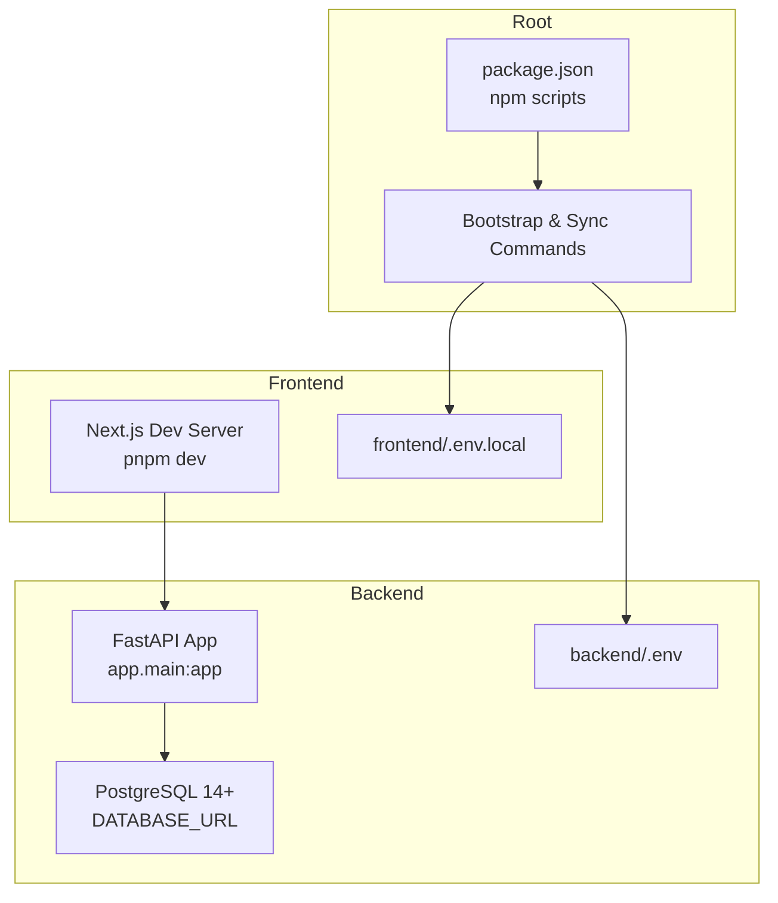
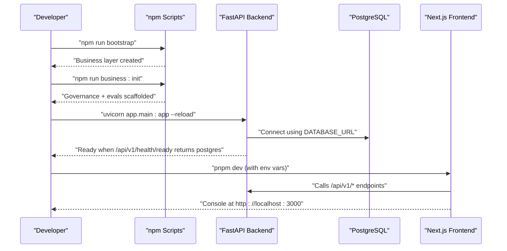
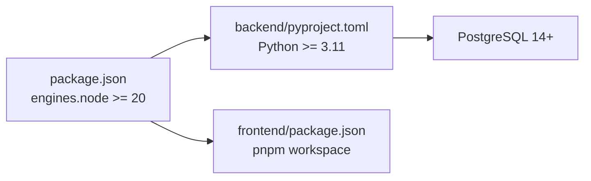

# Getting Started

<cite>
**Referenced Files in This Document**
- [README.md](file://README.md)
- [package.json](file://package.json)
- [backend/README.md](file://backend/README.md)
- [frontend/README.md](file://frontend/README.md)
- [docs/installation.md](file://docs/installation.md)
- [book/user_guide/chapters/01-02-installation-prerequisites.md](file://book/user_guide/chapters/01-02-installation-prerequisites.md)
- [book/user_guide/chapters/01-03-initial-setup-wizard.md](file://book/user_guide/chapters/01-03-initial-setup-wizard.md)
- [book/user_guide/chapters/01-04-first-time-configuration.md](file://book/user_guide/chapters/01-04-first-time-configuration.md)
- [docs/troubleshooting.md](file://docs/troubleshooting.md)
- [book/user_guide/chapters/04-01-common-error-resolution.md](file://book/user_guide/chapters/04-01-common-error-resolution.md)
- [backend/.env.example](file://backend/.env.example)
- [frontend/.env.example](file://frontend/.env.example)
- [backend/pyproject.toml](file://backend/pyproject.toml)
</cite>

## Table of Contents
1. [Introduction](#introduction)
2. [Project Structure](#project-structure)
3. [Core Components](#core-components)
4. [Architecture Overview](#architecture-overview)
5. [Detailed Component Analysis](#detailed-component-analysis)
6. [Dependency Analysis](#dependency-analysis)
7. [Performance Considerations](#performance-considerations)
8. [Troubleshooting Guide](#troubleshooting-guide)
9. [Conclusion](#conclusion)
10. [Appendices](#appendices)

## Introduction
Generic Swarm Ops is a governed, auditable, self-improving multi-agent business operating system designed for both Trae IDE and Grok Build harnesses. It provides:
- A FastAPI backend as the control plane with authentication, RBAC, workflow execution, governance gates, audit logs, memory/knowledge retrieval, process intelligence, evolution sandbox, and self-improvement loops.
- A Next.js frontend console for live operations (agents, workflows, runs, approvals, knowledge, evaluations, processes, Improve pipeline, Evolution archive).
- A bootstrap-driven setup that creates the business layer, seeds governance artifacts, and prepares dual-harness configuration.

This guide helps you quickly install prerequisites, bootstrap the project, configure environment variables, start the backend and frontend, and verify everything works locally.

**Section sources**
- [README.md:1-129](file://README.md#L1-L129)
- [backend/README.md:1-74](file://backend/README.md#L1-L74)
- [frontend/README.md:1-39](file://frontend/README.md#L1-L39)

## Project Structure
At a high level:
- Root orchestrates bootstrap, sync, and business commands via npm scripts.
- Backend contains the FastAPI application, services, domain models, infrastructure integrations, workers, and tests.
- Frontend is a Next.js app with pages, components, hooks, stores, and API client integration.
- Business layer holds governance, evaluation corpus, evolution artifacts, knowledge base, and process intelligence outputs.

**Diagram sources**
- [package.json:1-36](file://package.json#L1-L36)
- [backend/README.md:29-41](file://backend/README.md#L29-L41)
- [frontend/README.md:15-39](file://frontend/README.md#L15-L39)
- [docs/installation.md:11-33](file://docs/installation.md#L11-L33)

**Section sources**
- [package.json:1-36](file://package.json#L1-L36)
- [docs/installation.md:1-69](file://docs/installation.md#L1-L69)

## Core Components
- Bootstrap and orchestration:
  - npm run bootstrap initializes the business directory tree and validates the OS layer.
  - npm run business:init scaffolds governance artifacts and evaluation fixtures.
  - npm run doctor checks local prerequisites.
- Backend (FastAPI):
  - Install dependencies and run with uvicorn; health endpoint confirms Postgres connectivity.
  - Seed credentials provided for initial access.
- Frontend (Next.js):
  - Configure demo mode and API base URL; install with pnpm and run dev server.

Key commands:
- npm run bootstrap
- npm run business:init
- cd backend && python -m pip install -e . && set PYTHONPATH=. && uvicorn app.main:app --reload
- cd frontend && set NEXT_PUBLIC_DEMO_MODE=false && set NEXT_PUBLIC_API_BASE_URL=http://127.0.0.1:8000/api/v1 && pnpm install && pnpm dev

**Section sources**
- [README.md:7-129](file://README.md#L7-L129)
- [backend/README.md:29-58](file://backend/README.md#L29-L58)
- [frontend/README.md:15-39](file://frontend/README.md#L15-L39)
- [docs/installation.md:11-48](file://docs/installation.md#L11-L48)

## Architecture Overview
The platform follows a layered architecture:
- Orchestration layer (npm scripts) manages bootstrap, business initialization, and validation.
- Backend layer exposes APIs, enforces governance, executes workflows, and persists state to PostgreSQL.
- Frontend layer provides an interactive console connected to the backend APIs.

**Diagram sources**
- [docs/installation.md:11-33](file://docs/installation.md#L11-L33)
- [backend/README.md:29-41](file://backend/README.md#L29-L41)
- [frontend/README.md:15-39](file://frontend/README.md#L15-L39)

## Detailed Component Analysis

### Prerequisites and Environment Setup
- Required: Node.js 20+, npm, Python 3.11+, PostgreSQL 14+, pnpm, Git.
- Optional: Neo4j (graph federation), pgvector (embeddings), LLM critic.
- Set environment variables:
  - Backend: DATABASE_URL and optional flags in backend/.env.
  - Frontend: NEXT_PUBLIC_DEMO_MODE=false and NEXT_PUBLIC_API_BASE_URL.

Verification:
- Use npm run doctor to validate prerequisites.
- Confirm backend readiness via GET /api/v1/health/ready returning database: postgres.

**Section sources**
- [docs/installation.md:1-33](file://docs/installation.md#L1-L33)
- [book/user_guide/chapters/01-02-installation-prerequisites.md:1-120](file://book/user_guide/chapters/01-02-installation-prerequisites.md#L1-L120)
- [backend/.env.example:1-30](file://backend/.env.example#L1-L30)
- [frontend/.env.example:1-16](file://frontend/.env.example#L1-L16)

### Quick Start Workflow
- Bootstrap:
  - Run npm run bootstrap from repository root.
- Initialize business layer:
  - Run npm run business:init.
- Configure backend:
  - Copy backend/.env.example to backend/.env and set DATABASE_URL.
  - Ensure PYTHONPATH=..
- Start backend:
  - cd backend && python -m pip install -e . && uvicorn app.main:app --reload.
  - Verify health: GET /api/v1/health/ready should report database: postgres.
- Start frontend:
  - cd frontend && set NEXT_PUBLIC_DEMO_MODE=false && set NEXT_PUBLIC_API_BASE_URL=http://127.0.0.1:8000/api/v1 && pnpm install && pnpm dev.
- Access UI:
  - Open http://localhost:3000 and log in with seed credentials.

**Section sources**
- [README.md:7-129](file://README.md#L7-L129)
- [docs/installation.md:11-48](file://docs/installation.md#L11-L48)
- [book/user_guide/chapters/01-03-initial-setup-wizard.md:46-376](file://book/user_guide/chapters/01-03-initial-setup-wizard.md#L46-L376)

### First-Time Configuration
- Authentication:
  - Seed login: admin@example.com / admin-password.
  - Prefer password-based login; static tokens are smoke-only.
- Roles:
  - admin (full access), operator (run workflows), reviewer (approve human-gated steps).
- Create first agent and workflow:
  - Use ops console or API to define agents with tools and risk tiers.
  - Define a simple Workflow DNA with steps, guardrails, verification, rollback, and fitness metrics.
- Validate configuration:
  - npm run business:validate, business:governance, business:security, business:evolution:check.

**Section sources**
- [book/user_guide/chapters/01-04-first-time-configuration.md:26-183](file://book/user_guide/chapters/01-04-first-time-configuration.md#L26-L183)
- [book/user_guide/chapters/01-04-first-time-configuration.md:186-417](file://book/user_guide/chapters/01-04-first-time-configuration.md#L186-L417)
- [book/user_guide/chapters/01-04-first-time-configuration.md:419-500](file://book/user_guide/chapters/01-04-first-time-configuration.md#L419-L500)

### Running Locally and Accessing the Web Interface
- Backend:
  - Health check: GET /api/v1/health/ready.
  - Swagger UI: http://127.0.0.1:8000/docs.
- Frontend:
  - Dev server: http://localhost:3000.
  - Demo vs Live:
    - NEXT_PUBLIC_DEMO_MODE=false connects to live backend.
    - NEXT_PUBLIC_DEMO_MODE=true uses mock data.

**Section sources**
- [backend/README.md:29-41](file://backend/README.md#L29-L41)
- [frontend/README.md:15-39](file://frontend/README.md#L15-L39)
- [docs/installation.md:27-33](file://docs/installation.md#L27-L33)

## Dependency Analysis
- Root package.json defines orchestration scripts and engine requirements.
- Backend pyproject.toml specifies Python runtime and core dependencies (FastAPI, uvicorn, SQLAlchemy, psycopg, asyncpg).
- Frontend uses pnpm exclusively and requires correct environment variables for live ops.

**Diagram sources**
- [package.json:32-35](file://package.json#L32-L35)
- [backend/pyproject.toml:1-19](file://backend/pyproject.toml#L1-L19)
- [docs/installation.md:1-10](file://docs/installation.md#L1-L10)

**Section sources**
- [package.json:1-36](file://package.json#L1-L36)
- [backend/pyproject.toml:1-19](file://backend/pyproject.toml#L1-L19)
- [docs/installation.md:1-10](file://docs/installation.md#L1-L10)

## Performance Considerations
- Use hot-reload during development:
  - Backend: uvicorn --reload.
  - Frontend: pnpm dev.
- Keep database connections healthy:
  - Ensure DATABASE_URL points to the same instance across sessions.
  - For Docker, use persistent volumes to avoid data loss.
- Avoid unnecessary mutations in demo mode:
  - NEXT_PUBLIC_DEMO_MODE=false enables real operations; ensure backend is running.

[No sources needed since this section provides general guidance]

## Troubleshooting Guide
Common issues and resolutions:
- Bootstrap/Starter:
  - Run npm run doctor; inspect sources/source-lock.json; re-run sources:download if needed.
  - If missing business artifacts, run npm run business:init and validate with npm run business:validate.
- Backend/Postgres:
  - Health shows no postgres: verify DATABASE_URL and that Postgres is running.
  - Empty DB after restart: ensure connecting to the same Postgres instance; JSON file is backup only.
  - Auth fails: prefer password login; static tokens are smoke-only.
  - Tool step fails closed: inspect tool_effects and audit logs; provide required inputs.
  - Import/PYTHONPATH errors: set PYTHONPATH=. before running backend commands.
- Frontend:
  - Demo data only: set NEXT_PUBLIC_DEMO_MODE=false and point NEXT_PUBLIC_API_BASE_URL at backend.
  - Mutations show no detail: inspect network tab for message + request_id.
  - Playwright smoke skipped: start backend + frontend or use E2E_START=1.
  - OpenAPI types drift: regenerate with pnpm api:generate.

**Section sources**
- [docs/troubleshooting.md:1-48](file://docs/troubleshooting.md#L1-L48)
- [book/user_guide/chapters/04-01-common-error-resolution.md:41-230](file://book/user_guide/chapters/04-01-common-error-resolution.md#L41-L230)
- [book/user_guide/chapters/04-01-common-error-resolution.md:233-501](file://book/user_guide/chapters/04-01-common-error-resolution.md#L233-L501)
- [book/user_guide/chapters/04-01-common-error-resolution.md:504-664](file://book/user_guide/chapters/04-01-common-error-resolution.md#L504-L664)

## Conclusion
You now have the essentials to get Generic Swarm Ops running locally:
- Install prerequisites and run npm run bootstrap.
- Initialize the business layer and configure backend/frontend environments.
- Start the FastAPI backend and Next.js frontend, then verify health and access the console.
- Use the troubleshooting guide to resolve common setup issues.

[No sources needed since this section summarizes without analyzing specific files]

## Appendices

### Environment Variables Reference
- Backend (.env):
  - DATABASE_URL (required)
  - GENERIC_SWARM_AUTO_REFLECT, LLM_CRITIC_ENABLED, EMBEDDINGS_ENABLED, PGVECTOR_ENABLED (optional)
  - NEO4J_URI (optional)
- Frontend (.env.local):
  - NEXT_PUBLIC_APP_NAME, NEXT_PUBLIC_APP_ENV
  - NEXT_PUBLIC_API_BASE_URL
  - NEXT_PUBLIC_DEMO_MODE (false for live ops)
  - NEXT_PUBLIC_ENABLE_REGISTRATION, BILLING, SSO (optional)

**Section sources**
- [backend/.env.example:1-30](file://backend/.env.example#L1-L30)
- [frontend/.env.example:1-16](file://frontend/.env.example#L1-L16)

### Seed Credentials and Roles
- Seed login: admin@example.com / admin-password
- Roles: admin, operator, reviewer

**Section sources**
- [book/user_guide/chapters/01-04-first-time-configuration.md:26-108](file://book/user_guide/chapters/01-04-first-time-configuration.md#L26-L108)