# Document Management & Indexing

<cite>
**Referenced Files in This Document**
- [knowledge.py](file://backend/app/api/v1/routes/knowledge.py)
- [knowledge_service.py](file://backend/app/services/knowledge_service.py)
- [knowledge_worker.py](file://backend/app/workers/knowledge_worker.py)
- [models.py](file://backend/app/domain/knowledge/models.py)
- [chunking.py](file://backend/app/domain/knowledge/chunking.py)
- [retrieval.py](file://backend/app/domain/knowledge/retrieval.py)
- [embeddings.py](file://backend/app/infrastructure/knowledge/embeddings.py)
- [retrieval.py](file://backend/app/infrastructure/knowledge/retrieval.py)
- [extract.py](file://backend/app/infrastructure/knowledge_orchestration/extract.py)
- [federation.py](file://backend/app/infrastructure/knowledge_orchestration/federation.py)
- [operators.py](file://backend/app/infrastructure/knowledge_orchestration/operators.py)
- [knowledge_repository.py](file://backend/app/infrastructure/repositories/knowledge_repository.py)
- [knowledge.py](file://backend/app/schemas/knowledge.py)
</cite>

## Table of Contents
1. [Introduction](#introduction)
2. [Project Structure](#project-structure)
3. [Core Components](#core-components)
4. [Architecture Overview](#architecture-overview)
5. [Detailed Component Analysis](#detailed-component-analysis)
6. [Dependency Analysis](#dependency-analysis)
7. [Performance Considerations](#performance-considerations)
8. [Troubleshooting Guide](#troubleshooting-guide)
9. [Conclusion](#conclusion)
10. [Appendices](#appendices)

## Introduction
This document explains the document management and indexing capabilities within the knowledge system. It covers how documents are uploaded, processed, indexed, searched, archived, and related to knowledge items. It also outlines chunking strategies, metadata handling, versioning considerations, batch operations, and storage backend abstractions. The goal is to provide both a high-level understanding and actionable guidance for developers and operators.

## Project Structure
The knowledge subsystem spans API routes, service layer functions, domain modules, infrastructure adapters, workers, and schemas. The primary entry points for document operations are exposed via REST endpoints that delegate to service functions, which in turn call into runtime orchestration and infrastructure components.

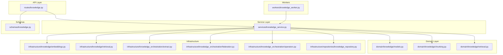

**Diagram sources**
- [knowledge.py:1-92](file://backend/app/api/v1/routes/knowledge.py#L1-L92)
- [knowledge_service.py:1-27](file://backend/app/services/knowledge_service.py#L1-L27)
- [models.py:1-2](file://backend/app/domain/knowledge/models.py#L1-L2)
- [chunking.py:1-2](file://backend/app/domain/knowledge/chunking.py#L1-L2)
- [retrieval.py](file://backend/app/domain/knowledge/retrieval.py)
- [embeddings.py](file://backend/app/infrastructure/knowledge/embeddings.py)
- [retrieval.py](file://backend/app/infrastructure/knowledge/retrieval.py)
- [extract.py](file://backend/app/infrastructure/knowledge_orchestration/extract.py)
- [federation.py](file://backend/app/infrastructure/knowledge_orchestration/federation.py)
- [operators.py](file://backend/app/infrastructure/knowledge_orchestration/operators.py)
- [knowledge_repository.py](file://backend/app/infrastructure/repositories/knowledge_repository.py)
- [knowledge_worker.py:1-6](file://backend/app/workers/knowledge_worker.py#L1-L6)
- [knowledge.py:1-2](file://backend/app/schemas/knowledge.py#L1-L2)

**Section sources**
- [knowledge.py:1-92](file://backend/app/api/v1/routes/knowledge.py#L1-L92)
- [knowledge_service.py:1-27](file://backend/app/services/knowledge_service.py#L1-L27)
- [knowledge_worker.py:1-6](file://backend/app/workers/knowledge_worker.py#L1-L6)

## Core Components
- API Routes: Expose endpoints for search, upload, get, archive, index, graph extraction, graph query, gaps analysis, and federation.
- Service Layer: Thin wrappers around runtime operations for search, upload, get, index, and archive.
- Domain Layer: Models, chunking logic, and retrieval interfaces (currently generated placeholders).
- Infrastructure Layer: Embedding generation, retrieval implementation, knowledge orchestration (extraction, federation, operators), and repository access.
- Workers: Background tasks such as refreshing or listing collections.
- Schemas: Request/response models including upload and search requests.

Key responsibilities:
- Upload: Accepts a structured payload and delegates to runtime for persistence and processing.
- Index: Triggers indexing for a specific document.
- Search: Supports simple and multi-hop queries with optional filters and limits.
- Archive: Marks a document as archived.
- Graph Operations: Extract, query, analyze gaps, and federate knowledge graphs.

**Section sources**
- [knowledge.py:1-92](file://backend/app/api/v1/routes/knowledge.py#L1-L92)
- [knowledge_service.py:1-27](file://backend/app/services/knowledge_service.py#L1-L27)
- [knowledge.py:1-2](file://backend/app/schemas/knowledge.py#L1-L2)

## Architecture Overview
The document lifecycle flows through API routes to services, then into runtime orchestration and infrastructure components. Indexing may be triggered on-demand or via background workers. Retrieval uses embeddings and vector stores, while graph features leverage extraction and federation utilities.

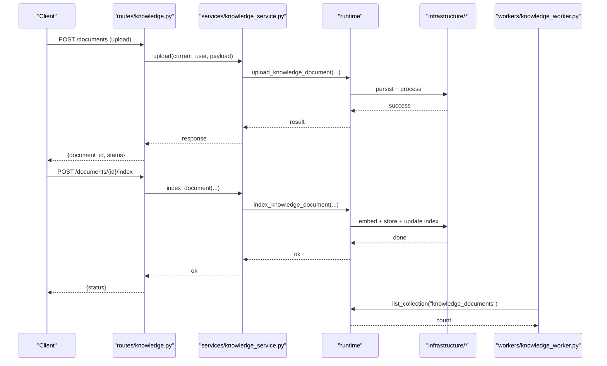

**Diagram sources**
- [knowledge.py:31-54](file://backend/app/api/v1/routes/knowledge.py#L31-L54)
- [knowledge_service.py:17-22](file://backend/app/services/knowledge_service.py#L17-L22)
- [knowledge_worker.py:4-5](file://backend/app/workers/knowledge_worker.py#L4-L5)

## Detailed Component Analysis

### API Endpoints and Control Flow
- GET /documents: List/search documents with optional multi-hop flag.
- POST /documents: Upload a new document using KnowledgeUploadRequest.
- GET /documents/{document_id}: Retrieve document details.
- DELETE /documents/{document_id}: Archive a document.
- POST /documents/{document_id}/index: Trigger indexing for a document.
- POST /search: Advanced search with query, multi_hop, filters, and limit.
- Graph endpoints: extract, query, gaps, federate.

Permissions: Read operations assert knowledge:read permission.

```mermaid
flowchart TD
Start(["Request Received"]) --> CheckPerm["Assert 'knowledge:read' if required"]
CheckPerm --> Route{"Route Type"}
Route --> |GET /documents| DoSearch["Call search()"]
Route --> |POST /documents| DoUpload["Call upload()"]
Route --> |GET /documents/{id}| GetDoc["Call get_document()"]
Route --> |DELETE /documents/{id}| Archive["Call archive_document()"]
Route --> |POST /documents/{id}/index| Index["Call index_document()"]
Route --> |POST /search| SearchPayload["Call search() with filters and limit"]
DoSearch --> ReturnResp["Return results"]
DoUpload --> ReturnResp
GetDoc --> ReturnResp
Archive --> ReturnResp
Index --> ReturnResp
SearchPayload --> ReturnResp
```

**Diagram sources**
- [knowledge.py:11-63](file://backend/app/api/v1/routes/knowledge.py#L11-L63)
- [knowledge_service.py:4-26](file://backend/app/services/knowledge_service.py#L4-L26)

**Section sources**
- [knowledge.py:1-92](file://backend/app/api/v1/routes/knowledge.py#L1-L92)
- [knowledge_service.py:1-27](file://backend/app/services/knowledge_service.py#L1-L27)

### Upload Workflow
- Input: KnowledgeUploadRequest payload (structured fields defined by schema).
- Processing: Service delegates to runtime.upload_knowledge_document.
- Outcome: Returns document metadata and status; subsequent indexing can be triggered.

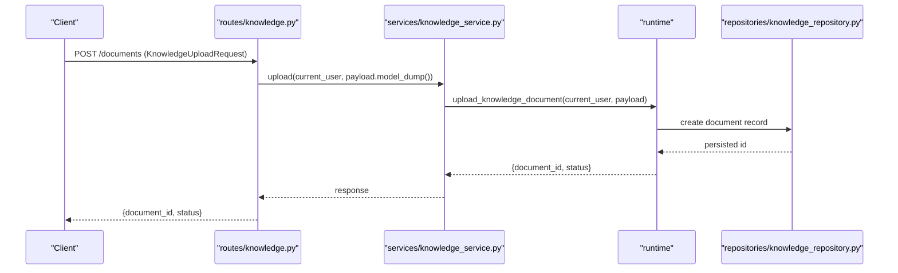

**Diagram sources**
- [knowledge.py:31-38](file://backend/app/api/v1/routes/knowledge.py#L31-L38)
- [knowledge_service.py:17-18](file://backend/app/services/knowledge_service.py#L17-L18)
- [knowledge_repository.py](file://backend/app/infrastructure/repositories/knowledge_repository.py)

**Section sources**
- [knowledge.py:31-38](file://backend/app/api/v1/routes/knowledge.py#L31-L38)
- [knowledge_service.py:17-18](file://backend/app/services/knowledge_service.py#L17-L18)

### Indexing Process
- Trigger: POST /documents/{document_id}/index calls index_document.
- Steps: Delegates to runtime.index_knowledge_document, which typically involves embedding generation and vector store updates.
- Result: Document becomes searchable; errors propagate back to client.

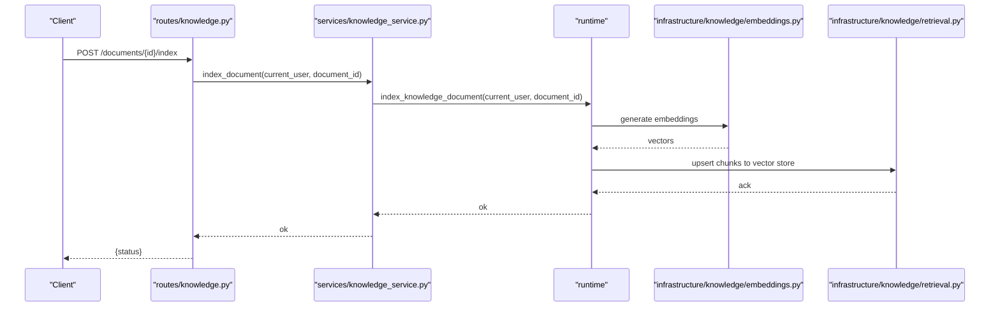

**Diagram sources**
- [knowledge.py:52-54](file://backend/app/api/v1/routes/knowledge.py#L52-L54)
- [knowledge_service.py:21-22](file://backend/app/services/knowledge_service.py#L21-L22)
- [embeddings.py](file://backend/app/infrastructure/knowledge/embeddings.py)
- [retrieval.py](file://backend/app/infrastructure/knowledge/retrieval.py)

**Section sources**
- [knowledge.py:52-54](file://backend/app/api/v1/routes/knowledge.py#L52-L54)
- [knowledge_service.py:21-22](file://backend/app/services/knowledge_service.py#L21-L22)

### Search and Retrieval
- Simple search: GET /documents supports query and multi_hop flags.
- Advanced search: POST /search accepts query, multi_hop, filters, and limit.
- Filtering: Server-side filter application before limiting results.

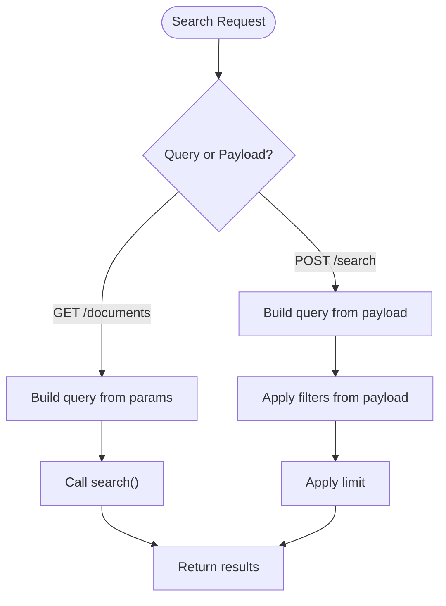

**Diagram sources**
- [knowledge.py:11-28](file://backend/app/api/v1/routes/knowledge.py#L11-L28)
- [knowledge.py:57-63](file://backend/app/api/v1/routes/knowledge.py#L57-L63)
- [knowledge_service.py:4-10](file://backend/app/services/knowledge_service.py#L4-L10)

**Section sources**
- [knowledge.py:11-28](file://backend/app/api/v1/routes/knowledge.py#L11-L28)
- [knowledge.py:57-63](file://backend/app/api/v1/routes/knowledge.py#L57-L63)
- [knowledge_service.py:4-10](file://backend/app/services/knowledge_service.py#L4-L10)

### Archiving Documents
- Endpoint: DELETE /documents/{document_id}.
- Behavior: Calls archive_document, which delegates to runtime.archive_knowledge_document.

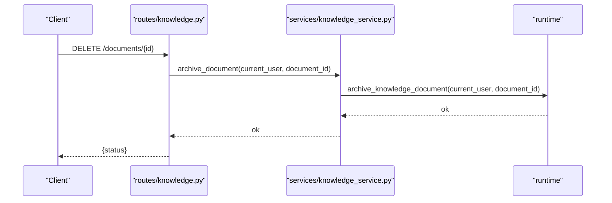

**Diagram sources**
- [knowledge.py:47-49](file://backend/app/api/v1/routes/knowledge.py#L47-L49)
- [knowledge_service.py:25-26](file://backend/app/services/knowledge_service.py#L25-L26)

**Section sources**
- [knowledge.py:47-49](file://backend/app/api/v1/routes/knowledge.py#L47-L49)
- [knowledge_service.py:25-26](file://backend/app/services/knowledge_service.py#L25-L26)

### Chunking Strategies
- Location: domain/knowledge/chunking.py (placeholder module).
- Purpose: Implement text segmentation strategies (e.g., fixed-size, semantic, recursive) to produce chunks suitable for embedding and retrieval.
- Integration: Called during indexing to split content into manageable units.

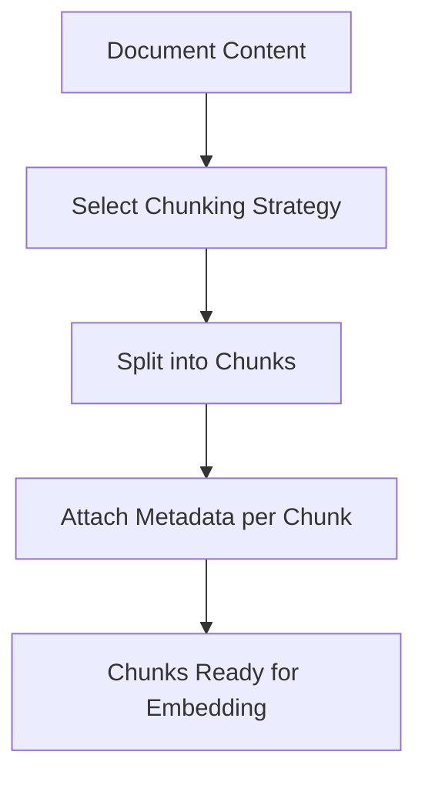

[No sources needed since this diagram shows conceptual workflow, not actual code structure]

**Section sources**
- [chunking.py:1-2](file://backend/app/domain/knowledge/chunking.py#L1-L2)

### Metadata Management and Versioning
- Metadata: Stored alongside documents and chunks; used for filtering and provenance.
- Versioning: Consider tracking versions at the document level to support rollback and auditability.
- Best Practices: Include source, author, timestamps, tags, and retention policy in metadata.

[No sources needed since this section provides general guidance]

### Relationship Between Documents and Knowledge Items
- Documents are the primary ingest artifacts.
- Knowledge items may represent derived entities (e.g., extracted facts, graph nodes) produced by orchestration and extraction processes.
- Graph endpoints enable extraction and querying across these relationships.

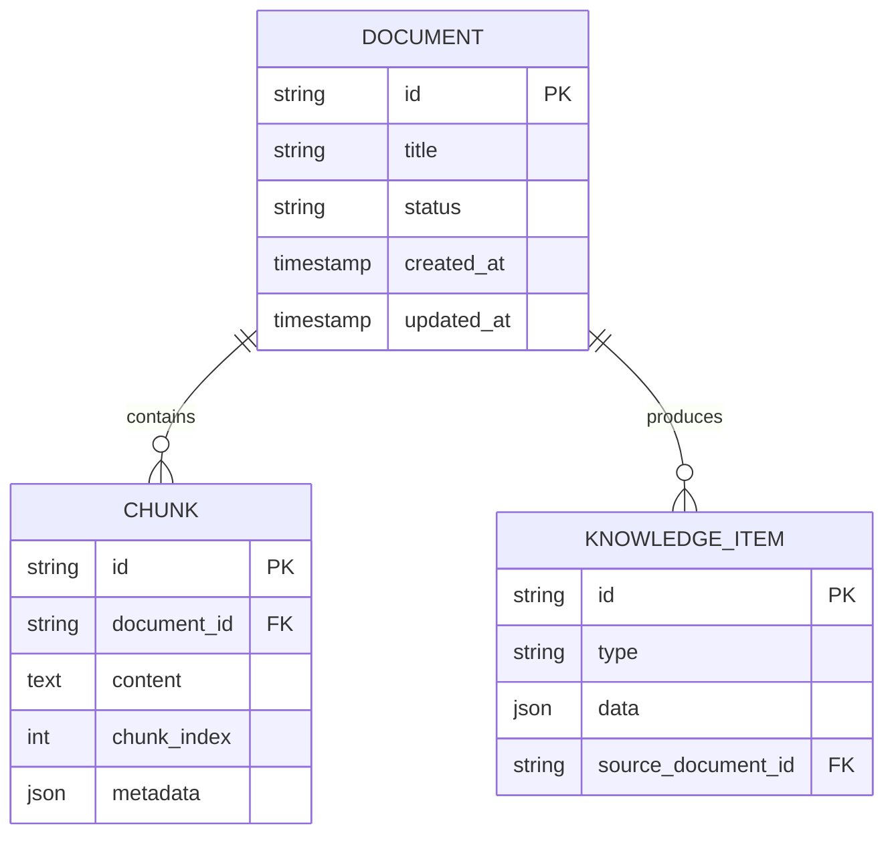

[No sources needed since this diagram shows conceptual model, not actual code structure]

**Section sources**
- [knowledge.py:65-91](file://backend/app/api/v1/routes/knowledge.py#L65-L91)

### Batch Processing Capabilities
- Current APIs focus on single-document operations.
- For batch uploads or re-indexing, consider:
  - Iterative calls to upload and index endpoints.
  - Using workers to enumerate collections and trigger bulk jobs.
- Example worker usage: list collection counts to drive batch loops.

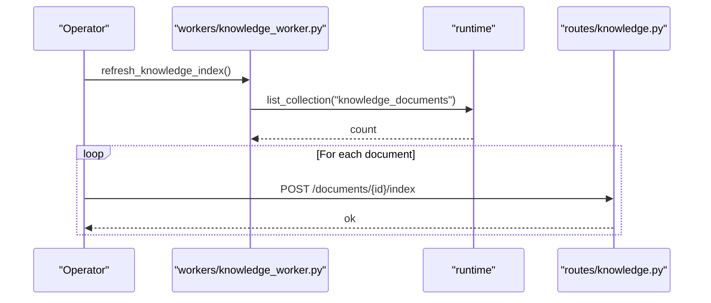

**Diagram sources**
- [knowledge_worker.py:4-5](file://backend/app/workers/knowledge_worker.py#L4-L5)
- [knowledge.py:52-54](file://backend/app/api/v1/routes/knowledge.py#L52-L54)

**Section sources**
- [knowledge_worker.py:1-6](file://backend/app/workers/knowledge_worker.py#L1-L6)
- [knowledge.py:52-54](file://backend/app/api/v1/routes/knowledge.py#L52-L54)

### Storage Backend Abstraction
- Repository layer abstracts persistence for knowledge documents.
- Embeddings and retrieval layers abstract vector store interactions.
- Federation and operators support cross-system synchronization and transformations.

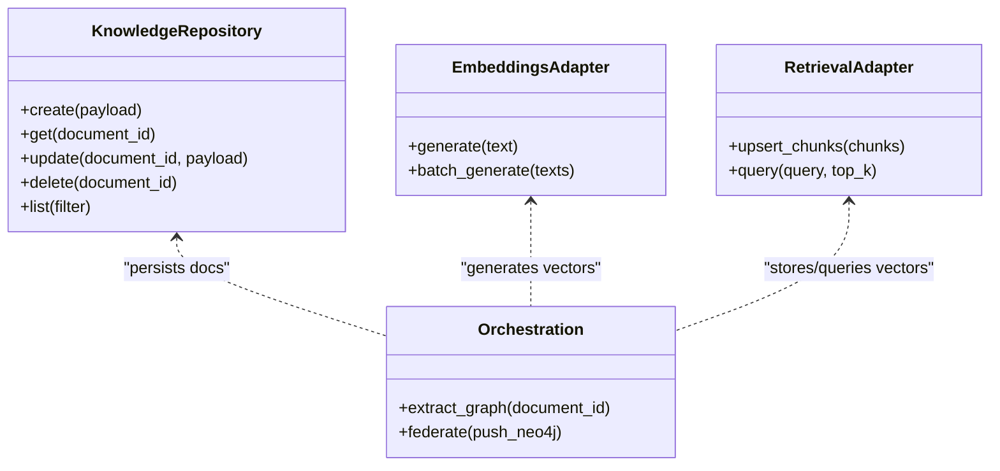

**Diagram sources**
- [knowledge_repository.py](file://backend/app/infrastructure/repositories/knowledge_repository.py)
- [embeddings.py](file://backend/app/infrastructure/knowledge/embeddings.py)
- [retrieval.py](file://backend/app/infrastructure/knowledge/retrieval.py)
- [extract.py](file://backend/app/infrastructure/knowledge_orchestration/extract.py)
- [federation.py](file://backend/app/infrastructure/knowledge_orchestration/federation.py)
- [operators.py](file://backend/app/infrastructure/knowledge_orchestration/operators.py)

**Section sources**
- [knowledge_repository.py](file://backend/app/infrastructure/repositories/knowledge_repository.py)
- [embeddings.py](file://backend/app/infrastructure/knowledge/embeddings.py)
- [retrieval.py](file://backend/app/infrastructure/knowledge/retrieval.py)
- [extract.py](file://backend/app/infrastructure/knowledge_orchestration/extract.py)
- [federation.py](file://backend/app/infrastructure/knowledge_orchestration/federation.py)
- [operators.py](file://backend/app/infrastructure/knowledge_orchestration/operators.py)

## Dependency Analysis
- API depends on service layer for business logic delegation.
- Service layer depends on runtime for orchestration and on domain/infrastructure contracts.
- Infrastructure components depend on repositories and external stores (vector DB, graph DB).
- Workers interact with runtime to enumerate collections and coordinate background tasks.

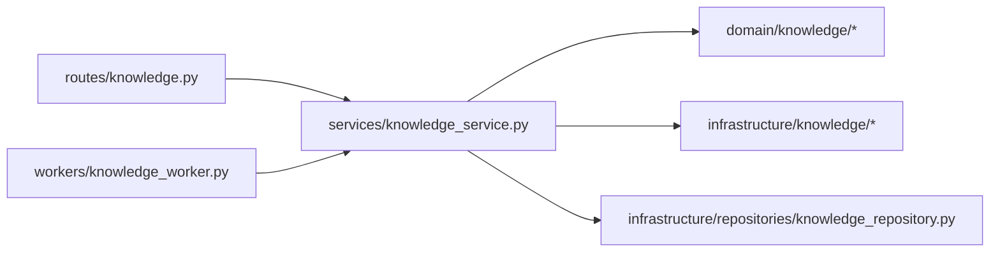

**Diagram sources**
- [knowledge.py:1-92](file://backend/app/api/v1/routes/knowledge.py#L1-L92)
- [knowledge_service.py:1-27](file://backend/app/services/knowledge_service.py#L1-L27)
- [knowledge_worker.py:1-6](file://backend/app/workers/knowledge_worker.py#L1-L6)

**Section sources**
- [knowledge.py:1-92](file://backend/app/api/v1/routes/knowledge.py#L1-L92)
- [knowledge_service.py:1-27](file://backend/app/services/knowledge_service.py#L1-L27)
- [knowledge_worker.py:1-6](file://backend/app/workers/knowledge_worker.py#L1-L6)

## Performance Considerations
- Chunk size tuning: Balance retrieval accuracy vs. index size and latency.
- Embedding batching: Use batch embedding where possible to reduce overhead.
- Vector store optimization: Configure appropriate top_k and similarity thresholds.
- Concurrency: Parallelize independent indexing jobs; avoid hot-path contention.
- Pagination and limits: Enforce reasonable limits on search responses.

[No sources needed since this section provides general guidance]

## Troubleshooting Guide
- Upload failures: Validate payload structure against KnowledgeUploadRequest; check permissions and storage availability.
- Indexing errors: Inspect embedding generation and vector store connectivity; verify document existence and content validity.
- Search anomalies: Review filters and multi_hop settings; ensure indexes are refreshed after updates.
- Archiving issues: Confirm document state transitions and downstream dependencies (e.g., graph nodes).
- Worker stalls: Monitor collection enumeration and job queues; validate runtime health.

**Section sources**
- [knowledge.py:31-63](file://backend/app/api/v1/routes/knowledge.py#L31-L63)
- [knowledge_service.py:17-26](file://backend/app/services/knowledge_service.py#L17-L26)
- [knowledge_worker.py:4-5](file://backend/app/workers/knowledge_worker.py#L4-L5)

## Conclusion
The knowledge system provides a cohesive set of APIs and services for document ingestion, indexing, search, archiving, and graph-based reasoning. While some domain modules are placeholders, the architecture clearly separates concerns across API, service, domain, infrastructure, and workers. Operators should focus on chunking strategy configuration, embedding performance, and robust error handling to ensure reliable large-scale document processing.

[No sources needed since this section summarizes without analyzing specific files]

## Appendices

### Example Workflows

- Uploading a document:
  - Send a POST request to /documents with a KnowledgeUploadRequest payload.
  - Receive a response containing document_id and status.
  - Optionally trigger indexing via POST /documents/{document_id}/index.

- Managing document states:
  - Retrieve details via GET /documents/{document_id}.
  - Archive via DELETE /documents/{document_id}.
  - Re-index when content changes.

- Handling large files:
  - Split content into chunks upstream or rely on chunking strategies.
  - Use batch embedding and upsert operations.
  - Employ workers to enumerate and process collections in loops.

[No sources needed since this section provides general guidance]