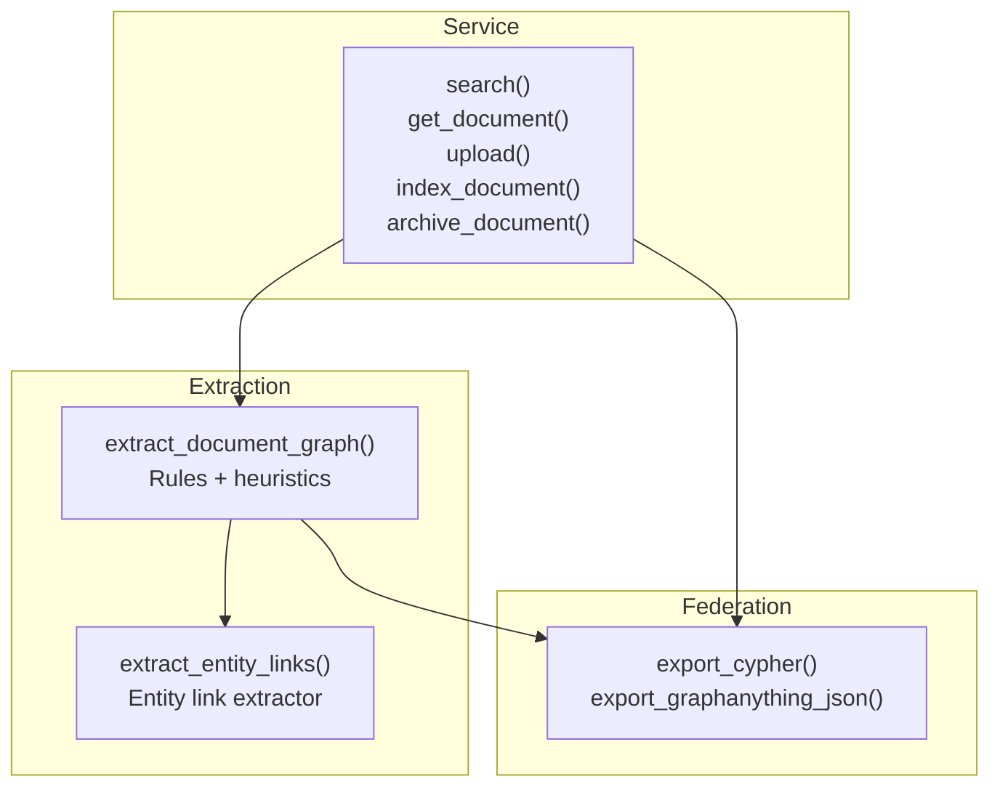
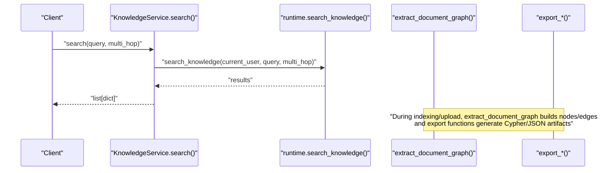
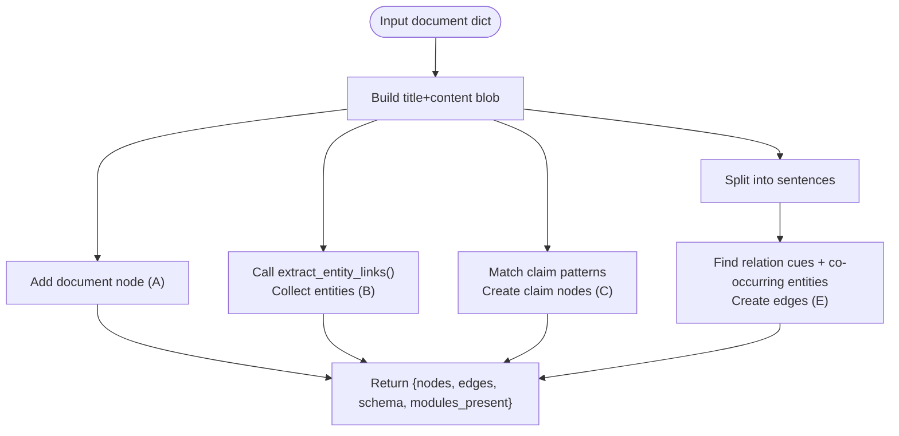
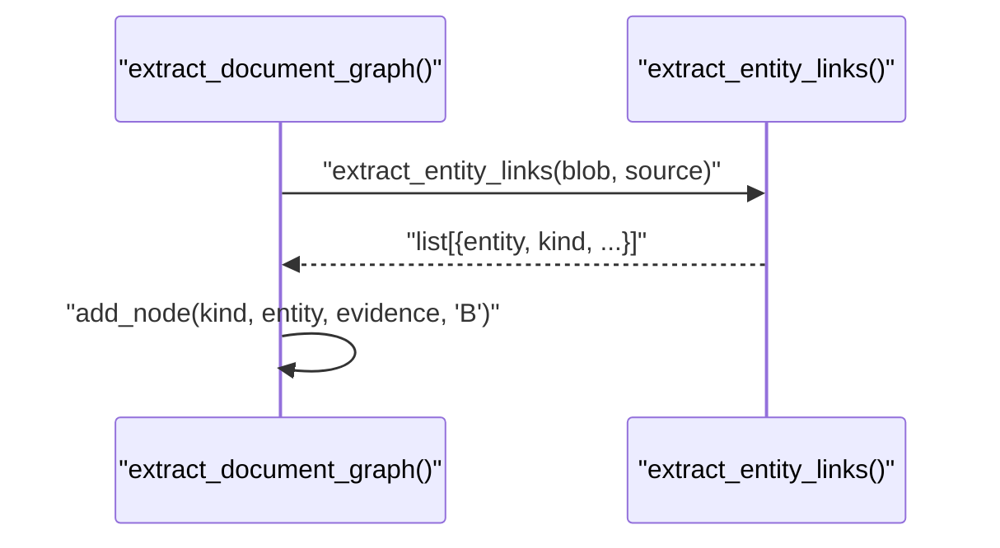
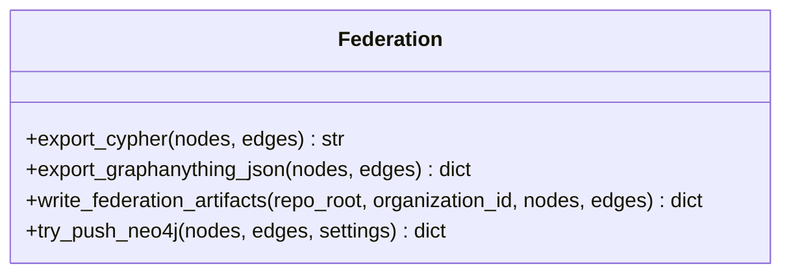
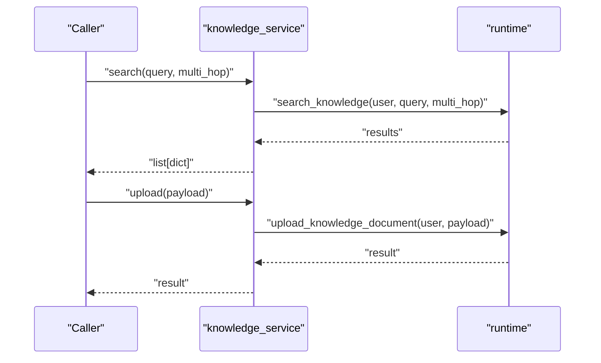
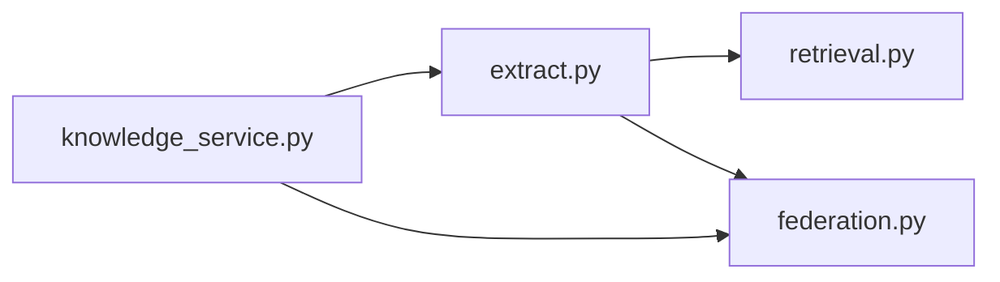

# Graph Knowledge & Entity Linking

<cite>
**Referenced Files in This Document**
- [extract.py](file://backend/app/infrastructure/knowledge_orchestration/extract.py)
- [federation.py](file://backend/app/infrastructure/knowledge_orchestration/federation.py)
- [retrieval.py](file://backend/app/infrastructure/knowledge/retrieval.py)
- [knowledge_service.py](file://backend/app/services/knowledge_service.py)
</cite>

## Table of Contents
1. [Introduction](#introduction)
2. [Project Structure](#project-structure)
3. [Core Components](#core-components)
4. [Architecture Overview](#architecture-overview)
5. [Detailed Component Analysis](#detailed-component-analysis)
6. [Dependency Analysis](#dependency-analysis)
7. [Performance Considerations](#performance-considerations)
8. [Troubleshooting Guide](#troubleshooting-guide)
9. [Conclusion](#conclusion)
10. [Appendices](#appendices)

## Introduction
This document explains how the system represents knowledge as a graph and links entities across documents. It covers:
- How entities are extracted from documents
- How relationships are established between knowledge items
- How multi-hop queries traverse the knowledge graph
- The entity types and relationship schemas used
- Integration with vector stores for hybrid graph-vector search
- Practical examples for building graphs, querying relationships, and performing complex multi-hop retrievals

The implementation focuses on a lightweight, rule-based extraction pipeline that produces nodes and edges suitable for downstream graph storage (e.g., Neo4j) and hybrid retrieval combining graph traversal with vector similarity.

## Project Structure
The relevant code for graph-based knowledge representation and entity linking is organized under:
- Extraction and orchestration: backend/app/infrastructure/knowledge_orchestration
- Retrieval utilities: backend/app/infrastructure/knowledge
- Service layer: backend/app/services

**Diagram sources**
- [extract.py:33-117](file://backend/app/infrastructure/knowledge_orchestration/extract.py#L33-L117)
- [federation.py:18-95](file://backend/app/infrastructure/knowledge_orchestration/federation.py#L18-L95)
- [knowledge_service.py:4-26](file://backend/app/services/knowledge_service.py#L4-L26)

**Section sources**
- [extract.py:1-118](file://backend/app/infrastructure/knowledge_orchestration/extract.py#L1-L118)
- [federation.py:1-122](file://backend/app/infrastructure/knowledge_orchestration/federation.py#L1-L122)
- [knowledge_service.py:1-27](file://backend/app/services/knowledge_service.py#L1-L27)

## Core Components
- Rule-based extractor: Builds a minimal graph per document by detecting entities, claims, and relations using regex patterns and co-occurrence heuristics.
- Entity linker: Identifies mentions and assigns kinds to produce node candidates.
- Federation exporter: Produces Cypher statements and GraphAnything-compatible JSON for import into graph databases or external tools.
- Service API: Exposes endpoints for search, document retrieval, upload, indexing, and archiving; delegates to runtime components.

Key responsibilities:
- Node schema: id, kind, label, module, document_id, evidence_span, confidence, source_refs
- Edge schema: id, head, relation, tail, document_id, evidence_span, confidence, source_refs, module
- Modules: A (document structure), B (entities), C (claims/obligations), E (relations)

**Section sources**
- [extract.py:28-117](file://backend/app/infrastructure/knowledge_orchestration/extract.py#L28-L117)
- [federation.py:18-95](file://backend/app/infrastructure/knowledge_orchestration/federation.py#L18-L95)
- [knowledge_service.py:4-26](file://backend/app/services/knowledge_service.py#L4-L26)

## Architecture Overview
The pipeline ingests a document, extracts a small graph, and exports it for federation. The service layer exposes operations that can trigger indexing and search flows.

**Diagram sources**
- [knowledge_service.py:4-10](file://backend/app/services/knowledge_service.py#L4-L10)
- [extract.py:33-117](file://backend/app/infrastructure/knowledge_orchestration/extract.py#L33-L117)
- [federation.py:18-95](file://backend/app/infrastructure/knowledge_orchestration/federation.py#L18-L95)

## Detailed Component Analysis

### Graph Extraction Engine
The extractor constructs a graph per document using:
- Document node creation (Module A-lite)
- Entity detection via an entity link extractor (Module B)
- Claim/obligation detection via claim patterns (Module C)
- Relation inference via cue words and co-occurring entities (Module E)

Node and edge structures include provenance fields (document_id, source_refs, evidence_span) and confidence scores.

**Diagram sources**
- [extract.py:33-117](file://backend/app/infrastructure/knowledge_orchestration/extract.py#L33-L117)

**Section sources**
- [extract.py:14-25](file://backend/app/infrastructure/knowledge_orchestration/extract.py#L14-L25)
- [extract.py:28-61](file://backend/app/infrastructure/knowledge_orchestration/extract.py#L28-L61)
- [extract.py:63-117](file://backend/app/infrastructure/knowledge_orchestration/extract.py#L63-L117)

### Entity Linking Utilities
Entity linking is delegated to a utility function that returns candidate entities with kinds and spans. The extractor consumes these results to create Module B nodes.

**Diagram sources**
- [extract.py:66-71](file://backend/app/infrastructure/knowledge_orchestration/extract.py#L66-L71)
- [retrieval.py:1-200](file://backend/app/infrastructure/knowledge/retrieval.py#L1-L200)

**Section sources**
- [extract.py:66-71](file://backend/app/infrastructure/knowledge_orchestration/extract.py#L66-L71)
- [retrieval.py:1-200](file://backend/app/infrastructure/knowledge/retrieval.py#L1-L200)

### Federation Exporters
Exporters transform nodes and edges into:
- Cypher statements for Neo4j ingestion
- GraphAnything-compatible JSON for interoperability

They also write timestamped artifacts and maintain “latest” pointers.

**Diagram sources**
- [federation.py:18-95](file://backend/app/infrastructure/knowledge_orchestration/federation.py#L18-L95)
- [federation.py:98-122](file://backend/app/infrastructure/knowledge_orchestration/federation.py#L98-L122)

**Section sources**
- [federation.py:18-95](file://backend/app/infrastructure/knowledge_orchestration/federation.py#L18-L95)
- [federation.py:98-122](file://backend/app/infrastructure/knowledge_orchestration/federation.py#L98-L122)

### Service Layer
The knowledge service exposes simple methods that delegate to runtime components. These methods support search (with optional multi-hop flag), document retrieval, upload, indexing, and archiving.

**Diagram sources**
- [knowledge_service.py:4-26](file://backend/app/services/knowledge_service.py#L4-L26)

**Section sources**
- [knowledge_service.py:4-26](file://backend/app/services/knowledge_service.py#L4-L26)

## Dependency Analysis
- The extractor depends on the entity link extractor to identify entities before creating nodes and inferring relations.
- Federation exporters depend only on nodes/edges produced by the extractor.
- The service layer depends on runtime abstractions for search/indexing/archival operations.

**Diagram sources**
- [extract.py:12](file://backend/app/infrastructure/knowledge_orchestration/extract.py#L12)
- [federation.py:18-95](file://backend/app/infrastructure/knowledge_orchestration/federation.py#L18-L95)
- [knowledge_service.py:4-26](file://backend/app/services/knowledge_service.py#L4-L26)

**Section sources**
- [extract.py:12](file://backend/app/infrastructure/knowledge_orchestration/extract.py#L12)
- [federation.py:18-95](file://backend/app/infrastructure/knowledge_orchestration/federation.py#L18-L95)
- [knowledge_service.py:4-26](file://backend/app/services/knowledge_service.py#L4-L26)

## Performance Considerations
- Regex-heavy extraction: Keep patterns concise and avoid catastrophic backtracking. Precompile patterns once at module load time.
- Sentence splitting: Use robust sentence boundary detection to reduce false positives in relation inference.
- Deduplication: Node deduplication by normalized id reduces graph size and improves traversal performance.
- Federation writes: Batch Cypher statements when pushing to Neo4j to minimize round-trips.
- Multi-hop queries: Limit hop depth and fan-out; consider caching frequent subgraphs or precomputing adjacency lists.

## Troubleshooting Guide
- Missing entity links: Ensure the entity link extractor is configured and available; verify input text length and encoding.
- No relations detected: Check relation cue patterns and ensure multiple entities appear in the same sentence context.
- Federation push failures: Confirm Neo4j driver installation and environment configuration; inspect returned reason codes.
- Search not returning multi-hop results: Verify runtime supports multi-hop traversal and that the graph contains sufficient edges.

**Section sources**
- [federation.py:98-122](file://backend/app/infrastructure/knowledge_orchestration/federation.py#L98-L122)
- [extract.py:78-109](file://backend/app/infrastructure/knowledge_orchestration/extract.py#L78-L109)

## Conclusion
The system provides a pragmatic, rule-based approach to building knowledge graphs from documents. It emphasizes provenance, lightweight extraction, and interoperable exports. For advanced retrieval, integrate with vector stores to combine semantic similarity with structured graph traversal, enabling powerful multi-hop queries grounded in explicit relationships.

## Appendices

### Entity Types and Relationship Schema
- Nodes
  - id: string
  - kind: string (e.g., document, entity, claim)
  - label: string
  - module: string (A/B/C/E)
  - document_id: string
  - evidence_span: string
  - confidence: float
  - source_refs: list[string]
- Edges
  - id: string
  - head: string (node id)
  - relation: string (e.g., BUILDS_ON, REQUIRES, GOVERNED_BY, USES, ALTERNATIVE_TO)
  - tail: string (node id)
  - document_id: string
  - evidence_span: string
  - confidence: float
  - source_refs: list[string]
  - module: string

**Section sources**
- [extract.py:45-61](file://backend/app/infrastructure/knowledge_orchestration/extract.py#L45-L61)
- [extract.py:97-109](file://backend/app/infrastructure/knowledge_orchestration/extract.py#L97-L109)

### Building a Knowledge Graph (Step-by-step)
- Prepare a document dictionary with id, title, content, and source/path.
- Run the extractor to obtain nodes and edges.
- Export to Cypher and/or GraphAnything JSON for ingestion into a graph database or toolchain.
- Optionally push to Neo4j if credentials are configured.

**Section sources**
- [extract.py:33-117](file://backend/app/infrastructure/knowledge_orchestration/extract.py#L33-L117)
- [federation.py:70-95](file://backend/app/infrastructure/knowledge_orchestration/federation.py#L70-L95)
- [federation.py:98-122](file://backend/app/infrastructure/knowledge_orchestration/federation.py#L98-L122)

### Querying Entity Relationships
- Use the service search method with a query string. If multi-hop is enabled, the runtime should traverse edges beyond immediate neighbors.
- Filter results by module tags (A/B/C/E) to focus on document structure, entities, claims, or relations.

**Section sources**
- [knowledge_service.py:4-10](file://backend/app/services/knowledge_service.py#L4-L10)

### Hybrid Graph-Vector Search
- Combine vector similarity (from embeddings) with graph traversal:
  - Retrieve top-k semantically similar chunks or entities from a vector store.
  - Seed graph traversal from those entities to expand context through relations.
  - Re-rank combined results using a score that blends vector similarity and graph proximity.
- Persist hybrid results with provenance fields for traceability.

[No sources needed since this section provides general guidance]