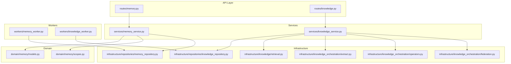
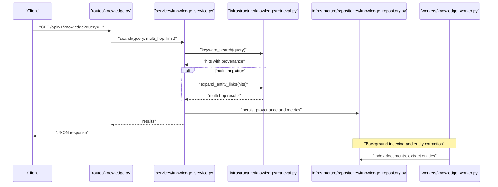
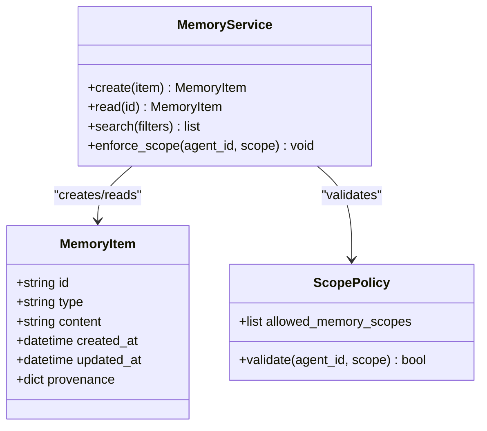
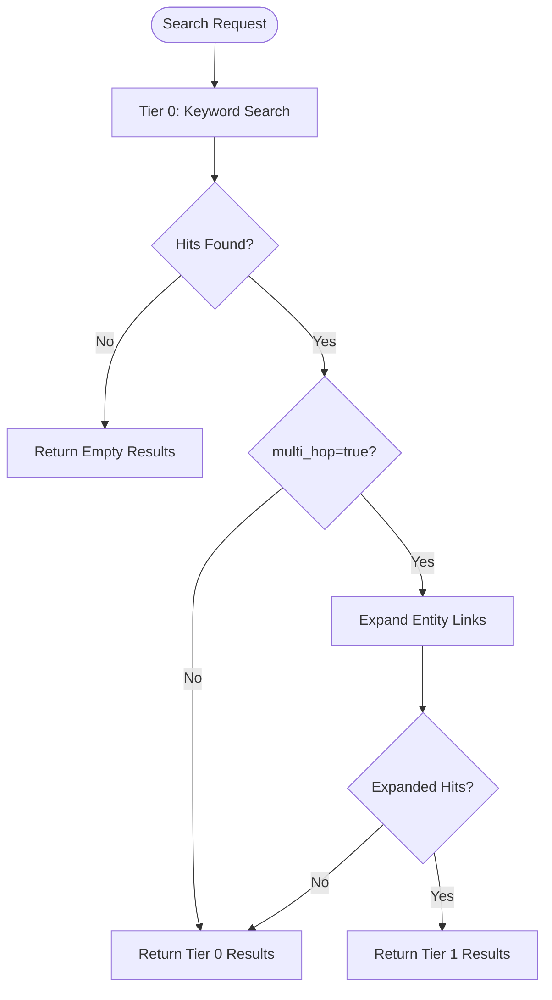
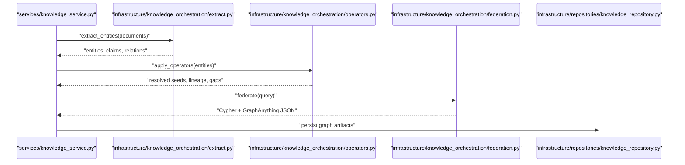
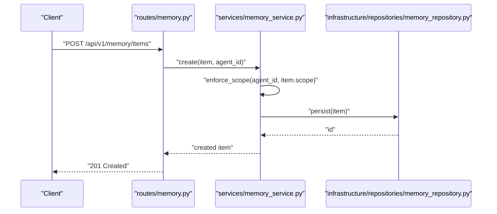
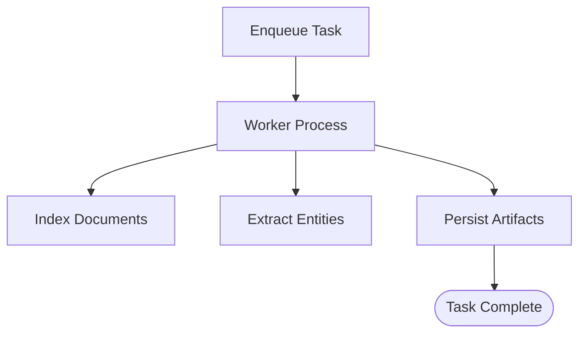
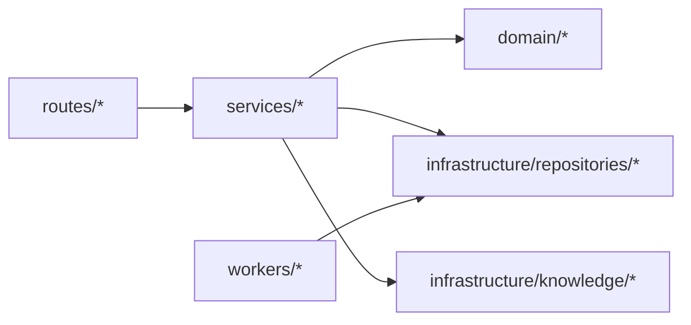

# Knowledge & Memory

<cite>
**Referenced Files in This Document**
- [knowledge-memory.md](file://docs/knowledge-memory.md)
- [retrieval.py](file://backend/app/infrastructure/knowledge/retrieval.py)
- [__init__.py](file://backend/app/infrastructure/knowledge/__init__.py)
- [models.py](file://backend/app/domain/memory/models.py)
- [scopes.py](file://backend/app/domain/memory/scopes.py)
- [memory_service.py](file://backend/app/services/memory_service.py)
- [memory_repository.py](file://backend/app/infrastructure/repositories/memory_repository.py)
- [memory_worker.py](file://backend/app/workers/memory_worker.py)
- [memory.py](file://backend/app/api/v1/routes/memory.py)
- [schemas.py](file://backend/app/schemas/memory.py)
- [knowledge_service.py](file://backend/app/services/knowledge_service.py)
- [knowledge_repository.py](file://backend/app/infrastructure/repositories/knowledge_repository.py)
- [knowledge_worker.py](file://backend/app/workers/knowledge_worker.py)
- [extract.py](file://backend/app/infrastructure/knowledge_orchestration/extract.py)
- [federation.py](file://backend/app/infrastructure/knowledge_orchestration/federation.py)
- [operators.py](file://backend/app/infrastructure/knowledge_orchestration/operators.py)
</cite>

## Table of Contents
1. Introduction
2. Project Structure
3. Core Components
4. Architecture Overview
5. Detailed Component Analysis
6. Dependency Analysis
7. Performance Considerations
8. Troubleshooting Guide
9. Conclusion

## Introduction
This document explains the hybrid knowledge and memory system, focusing on:
- Four memory types: event, episodic, semantic, procedural
- Tiered knowledge retrieval combining keyword search and vector embeddings
- Entity link extraction, multi-hop retrieval, and graph-based knowledge representation
- Per-agent memory scoping, provenance tracking, and audit trails
- Practical examples for storing knowledge items, performing searches, and building knowledge graphs

The system separates persistent knowledge (rules, best practices, tacit knowledge, provenance) from agent memory (episodic, semantic, procedural, decision, evaluation), while providing a unified retrieval layer with multiple tiers and optional graph federation.

## Project Structure
Knowledge and memory are implemented across domain models, services, repositories, workers, API routes, and orchestration utilities:
- Domain models define memory item structures and scoping rules
- Services implement business logic for read/write/search and orchestrate indexing
- Repositories abstract persistence for memory and knowledge stores
- Workers perform background tasks such as embedding generation and entity extraction
- API routes expose endpoints for clients to interact with knowledge and memory
- Orchestration components handle entity extraction, operators, and graph federation

**Diagram sources**
- [memory.py](file://backend/app/api/v1/routes/memory.py)
- [memory_service.py](file://backend/app/services/memory_service.py)
- [memory_repository.py](file://backend/app/infrastructure/repositories/memory_repository.py)
- [models.py](file://backend/app/domain/memory/models.py)
- [scopes.py](file://backend/app/domain/memory/scopes.py)
- [knowledge_service.py](file://backend/app/services/knowledge_service.py)
- [knowledge_repository.py](file://backend/app/infrastructure/repositories/knowledge_repository.py)
- [retrieval.py](file://backend/app/infrastructure/knowledge/retrieval.py)
- [extract.py](file://backend/app/infrastructure/knowledge_orchestration/extract.py)
- [operators.py](file://backend/app/infrastructure/knowledge_orchestration/operators.py)
- [federation.py](file://backend/app/infrastructure/knowledge_orchestration/federation.py)
- [memory_worker.py](file://backend/app/workers/memory_worker.py)
- [knowledge_worker.py](file://backend/app/workers/knowledge_worker.py)

**Section sources**
- [knowledge-memory.md:1-47](file://docs/knowledge-memory.md#L1-L47)

## Core Components
- Memory types and scoping
  - Event memory: short-lived records of discrete occurrences tied to an agent or workflow run
  - Episodic memory: time-stamped experiences and interactions that inform future behavior
  - Semantic memory: durable facts, concepts, and relationships used for reasoning
  - Procedural memory: learned procedures, skills, and policies that guide actions
  - Scoping: each agent has allowed_memory_scopes; reads/writes enforce these scopes at service and repository layers

- Tiered knowledge retrieval
  - Tier 0 (default): keyword search with source_refs and provenance.retrieval_tier included
  - Tier 1 (lite): entity-link multi-hop expansion for shared entities (workflow/policy/path)
  - Tier 2 (deferred): hierarchical summaries (future)

- Graph orchestration (K1-lite)
  - Index/extract: entities, claims, relations with evidence spans
  - Operators: seed resolve (O1), lineage (O2), gaps (O5)
  - Federation: returns Cypher + GraphAnything-compatible JSON

- Provenance and audit trails
  - Every knowledge hit includes source_refs and provenance metadata
  - Memory items carry independent provenance
  - Lessons from auto-reflection are written to organization_memory and improvement_lessons

**Section sources**
- [knowledge-memory.md:1-47](file://docs/knowledge-memory.md#L1-L47)
- [retrieval.py](file://backend/app/infrastructure/knowledge/retrieval.py)
- [__init__.py](file://backend/app/infrastructure/knowledge/__init__.py)
- [models.py](file://backend/app/domain/memory/models.py)
- [scopes.py](file://backend/app/domain/memory/scopes.py)

## Architecture Overview
The system composes API routes, services, domain models, repositories, and workers to provide:
- Hybrid retrieval: keyword search plus optional entity-link expansion and vector-backed operations
- Multi-hop retrieval via entity links
- Graph federation for advanced querying and visualization

**Diagram sources**
- [knowledge-service.py](file://backend/app/services/knowledge_service.py)
- [retrieval.py](file://backend/app/infrastructure/knowledge/retrieval.py)
- [knowledge_repository.py](file://backend/app/infrastructure/repositories/knowledge_repository.py)
- [knowledge_worker.py](file://backend/app/workers/knowledge_worker.py)

## Detailed Component Analysis

### Memory Types and Scoping
Memory is modeled by domain schemas and enforced by scoping rules:
- Models define fields for type, content, timestamps, and provenance
- Scopes restrict which agents can read/write specific memory categories
- Services validate scopes before persisting or returning memory items

**Diagram sources**
- [models.py](file://backend/app/domain/memory/models.py)
- [scopes.py](file://backend/app/domain/memory/scopes.py)
- [memory_service.py](file://backend/app/services/memory_service.py)

**Section sources**
- [models.py](file://backend/app/domain/memory/models.py)
- [scopes.py](file://backend/app/domain/memory/scopes.py)
- [memory_service.py](file://backend/app/services/memory_service.py)
- [memory_repository.py](file://backend/app/infrastructure/repositories/memory_repository.py)

### Tiered Knowledge Retrieval
Tiered retrieval combines keyword search with optional entity-link expansion:
- Tier 0: keyword search with provenance and source references
- Tier 1: multi-hop expansion using entity_links
- Utilities include scoring and escalation logic

**Diagram sources**
- [retrieval.py](file://backend/app/infrastructure/knowledge/retrieval.py)
- [__init__.py](file://backend/app/infrastructure/knowledge/__init__.py)

**Section sources**
- [retrieval.py](file://backend/app/infrastructure/knowledge/retrieval.py)
- [__init__.py](file://backend/app/infrastructure/knowledge/__init__.py)
- [knowledge-memory.md:9-22](file://docs/knowledge-memory.md#L9-L22)

### Entity Link Extraction and Graph Federation
Entity extraction builds entity_links for Tier-1 edges; operators and federation enable advanced queries:
- Extract: identifies entities, claims, relations with evidence spans
- Operators: seed resolve (O1), lineage (O2), gaps (O5)
- Federation: returns Cypher + GraphAnything-compatible JSON

**Diagram sources**
- [extract.py](file://backend/app/infrastructure/knowledge_orchestration/extract.py)
- [operators.py](file://backend/app/infrastructure/knowledge_orchestration/operators.py)
- [federation.py](file://backend/app/infrastructure/knowledge_orchestration/federation.py)
- [knowledge_repository.py](file://backend/app/infrastructure/repositories/knowledge_repository.py)

**Section sources**
- [knowledge-memory.md:42-47](file://docs/knowledge-memory.md#L42-L47)
- [extract.py](file://backend/app/infrastructure/knowledge_orchestration/extract.py)
- [operators.py](file://backend/app/infrastructure/knowledge_orchestration/operators.py)
- [federation.py](file://backend/app/infrastructure/knowledge_orchestration/federation.py)

### API Endpoints and Schemas
- Knowledge endpoints support query parameters and POST search payloads
- Memory endpoints allow CRUD and scoped access
- Schemas define request/response shapes and validation rules

**Diagram sources**
- [memory.py](file://backend/app/api/v1/routes/memory.py)
- [memory_service.py](file://backend/app/services/memory_service.py)
- [memory_repository.py](file://backend/app/infrastructure/repositories/memory_repository.py)
- [schemas.py](file://backend/app/schemas/memory.py)

**Section sources**
- [knowledge-memory.md:15-28](file://docs/knowledge-memory.md#L15-L28)
- [memory.py](file://backend/app/api/v1/routes/memory.py)
- [schemas.py](file://backend/app/schemas/memory.py)

### Background Processing and Indexing
Workers handle long-running tasks like embedding generation, entity extraction, and index updates:
- Memory worker persists and indexes memory items
- Knowledge worker performs document indexing and entity extraction

**Diagram sources**
- [memory_worker.py](file://backend/app/workers/memory_worker.py)
- [knowledge_worker.py](file://backend/app/workers/knowledge_worker.py)

**Section sources**
- [memory_worker.py](file://backend/app/workers/memory_worker.py)
- [knowledge_worker.py](file://backend/app/workers/knowledge_worker.py)

## Dependency Analysis
Key dependencies and relationships:
- API routes depend on services for business logic
- Services depend on domain models and scoping policies
- Services call repositories for persistence
- Knowledge service integrates retrieval utilities and orchestration components
- Workers operate asynchronously to maintain performance

**Diagram sources**
- [memory.py](file://backend/app/api/v1/routes/memory.py)
- [memory_service.py](file://backend/app/services/memory_service.py)
- [memory_repository.py](file://backend/app/infrastructure/repositories/memory_repository.py)
- [knowledge_service.py](file://backend/app/services/knowledge_service.py)
- [knowledge_repository.py](file://backend/app/infrastructure/repositories/knowledge_repository.py)
- [retrieval.py](file://backend/app/infrastructure/knowledge/retrieval.py)
- [memory_worker.py](file://backend/app/workers/memory_worker.py)
- [knowledge_worker.py](file://backend/app/workers/knowledge_worker.py)

**Section sources**
- [memory.py](file://backend/app/api/v1/routes/memory.py)
- [memory_service.py](file://backend/app/services/memory_service.py)
- [memory_repository.py](file://backend/app/infrastructure/repositories/memory_repository.py)
- [knowledge_service.py](file://backend/app/services/knowledge_service.py)
- [knowledge_repository.py](file://backend/app/infrastructure/repositories/knowledge_repository.py)
- [retrieval.py](file://backend/app/infrastructure/knowledge/retrieval.py)
- [memory_worker.py](file://backend/app/workers/memory_worker.py)
- [knowledge_worker.py](file://backend/app/workers/knowledge_worker.py)

## Performance Considerations
- Prefer Tier 0 keyword search for low-latency responses
- Use multi_hop only when necessary due to additional entity-link expansion cost
- Offload heavy indexing and extraction to workers to avoid blocking requests
- Cache frequent queries and precompute entity_links where feasible
- Monitor provenance overhead and size of source_refs

[No sources needed since this section provides general guidance]

## Troubleshooting Guide
Common issues and resolutions:
- Missing provenance: ensure knowledge hits include source_refs and provenance.retrieval_tier
- Multi-hop not expanding: verify entity_links exist and multi_hop flag is set
- Scope violations: confirm agent’s allowed_memory_scopes include target scope
- Indexing delays: check worker queues and logs for failed indexing jobs

**Section sources**
- [knowledge-memory.md:30-41](file://docs/knowledge-memory.md#L30-L41)
- [retrieval.py](file://backend/app/infrastructure/knowledge/retrieval.py)
- [scopes.py](file://backend/app/domain/memory/scopes.py)

## Conclusion
The hybrid knowledge and memory system provides a robust foundation for:
- Storing and retrieving diverse knowledge types with clear provenance
- Performing tiered searches with optional multi-hop expansion
- Building and federating knowledge graphs for advanced analytics
- Enforcing per-agent memory scoping and maintaining audit trails

Adopting the recommended patterns ensures scalability, transparency, and reliability across agent workflows.

[No sources needed since this section summarizes without analyzing specific files]