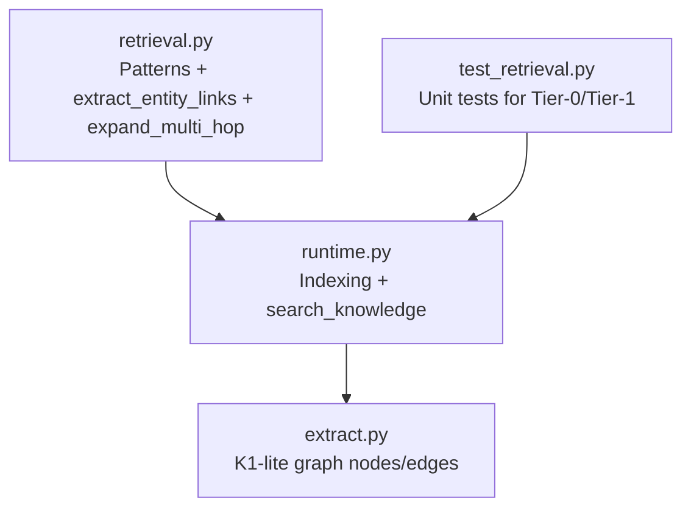
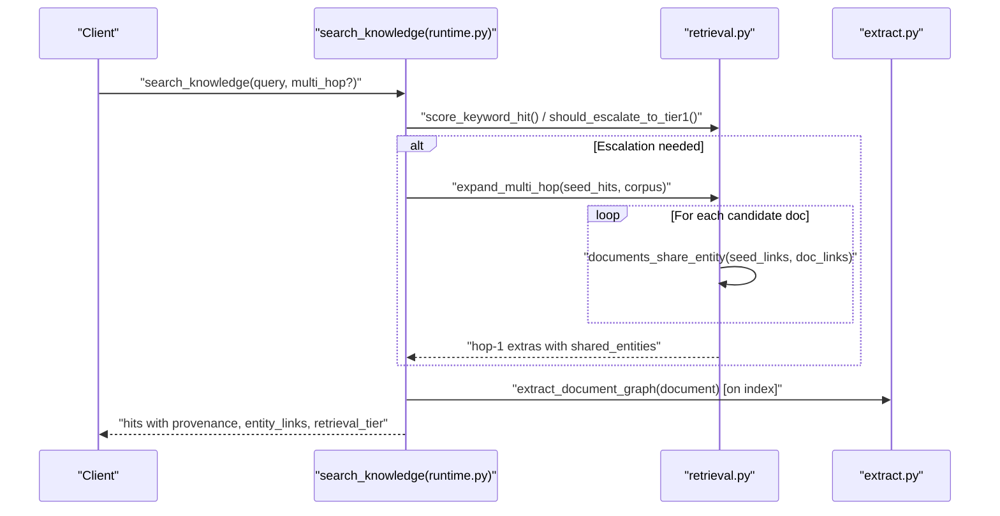
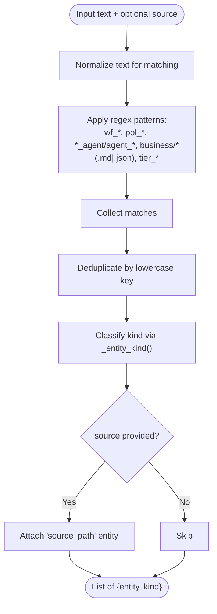
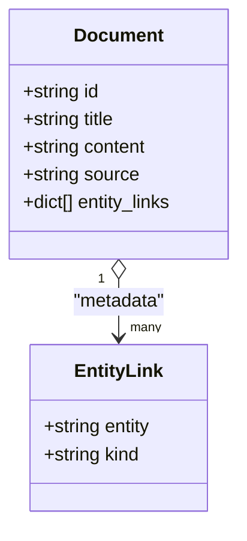
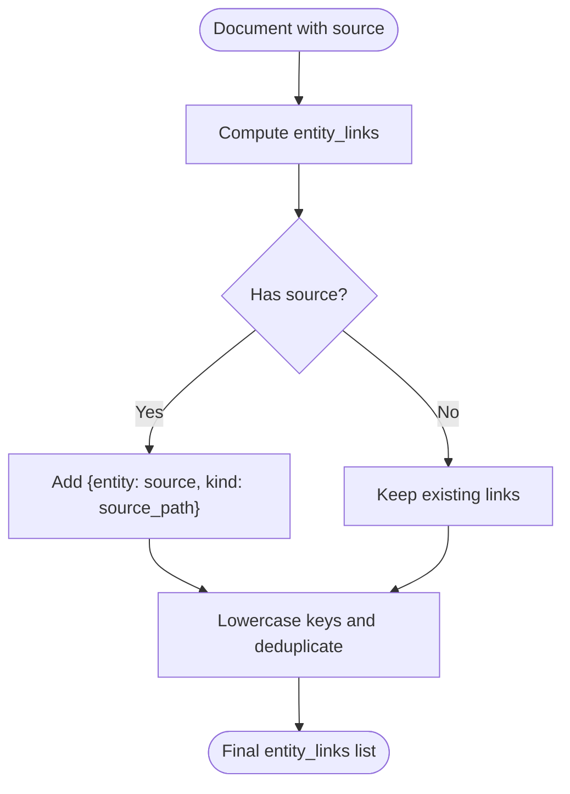
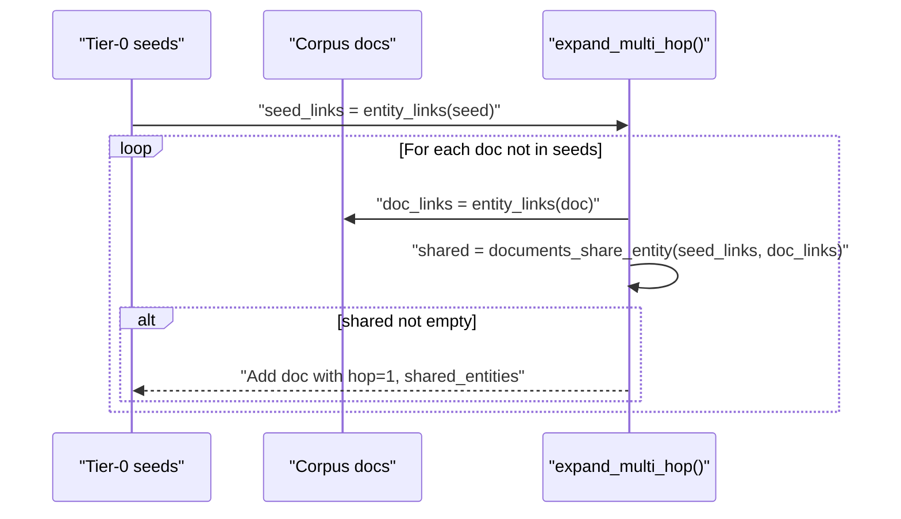
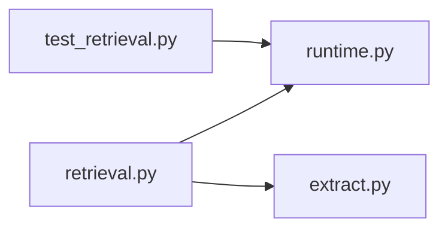

# Entity Link Extraction

<cite>
**Referenced Files in This Document**
- [retrieval.py](file://backend/app/infrastructure/knowledge/retrieval.py)
- [extract.py](file://backend/app/infrastructure/knowledge_orchestration/extract.py)
- [runtime.py](file://backend/app/runtime.py)
- [test_retrieval.py](file://backend/app/tests/unit/test_retrieval.py)
</cite>

## Table of Contents
1. [Introduction](#introduction)
2. [Project Structure](#project-structure)
3. [Core Components](#core-components)
4. [Architecture Overview](#architecture-overview)
5. [Detailed Component Analysis](#detailed-component-analysis)
6. [Dependency Analysis](#dependency-analysis)
7. [Performance Considerations](#performance-considerations)
8. [Troubleshooting Guide](#troubleshooting-guide)
9. [Conclusion](#conclusion)
10. [Appendices](#appendices)

## Introduction
This document explains the entity link extraction system used for Tier 1 multi-hop retrieval. It covers:
- Regex-based pattern matching to identify entities such as workflows (wf_*), policies (pol_*), agents (*_agent or agent_*), business documents (business/*), and risk tiers (tier_*).
- The entity kind classification system that maps matched strings to semantic categories.
- How extracted entities are stored as metadata on knowledge documents.
- Source path association and deduplication logic.
- Examples of entity extraction from sample text and the resulting entity link structures.
- How Tier 1 uses these links to expand search results across documents.

## Project Structure
The entity link extraction is implemented in a small, focused module and integrated into indexing and search flows:
- Pattern definitions and extraction logic live in the retrieval module.
- Indexing attaches entity links to documents and builds a lightweight knowledge graph.
- Search orchestrates Tier 0 keyword hits and optional Tier 1 expansion using shared entity links.

**Diagram sources**
- [retrieval.py:1-134](file://backend/app/infrastructure/knowledge/retrieval.py#L1-L134)
- [runtime.py:2500-2699](file://backend/app/runtime.py#L2500-L2699)
- [extract.py:1-118](file://backend/app/infrastructure/knowledge_orchestration/extract.py#L1-L118)
- [test_retrieval.py:1-132](file://backend/app/tests/unit/test_retrieval.py#L1-L132)

**Section sources**
- [retrieval.py:1-134](file://backend/app/infrastructure/knowledge/retrieval.py#L1-L134)
- [runtime.py:2500-2699](file://backend/app/runtime.py#L2500-L2699)
- [extract.py:1-118](file://backend/app/infrastructure/knowledge_orchestration/extract.py#L1-L118)
- [test_retrieval.py:1-132](file://backend/app/tests/unit/test_retrieval.py#L1-L132)

## Core Components
- Pattern registry and entity extractor:
  - Defines regex patterns for workflow IDs, policy IDs, agent names, business document paths, and risk tier identifiers.
  - Extracts unique mentions and classifies each into an entity kind.
  - Optionally includes the source path as a special “source_path” entity.
- Kind classifier:
  - Maps matched strings to kinds like workflow, policy, agent, document_path, risk_tier, or generic entity.
- Multi-hop expansion:
  - Computes shared entities between seed hits and other corpus documents to surface related content at hop 1.
- Integration points:
  - Indexing attaches entity_links to documents and builds a K1-lite graph.
  - Search performs Tier 0 ranking and optionally escalates to Tier 1 when relational cues are detected or when explicitly requested.

**Section sources**
- [retrieval.py:30-68](file://backend/app/infrastructure/knowledge/retrieval.py#L30-L68)
- [retrieval.py:89-134](file://backend/app/infrastructure/knowledge/retrieval.py#L89-L134)
- [runtime.py:2507-2540](file://backend/app/runtime.py#L2507-L2540)
- [runtime.py:2552-2668](file://backend/app/runtime.py#L2552-L2668)
- [extract.py:66-71](file://backend/app/infrastructure/knowledge_orchestration/extract.py#L66-L71)

## Architecture Overview
The system follows a two-tier retrieval strategy:
- Tier 0: Keyword scoring with provenance and optional embedding blending.
- Tier 1: Entity-link multi-hop expansion based on shared entities between seeds and other documents.

**Diagram sources**
- [runtime.py:2552-2668](file://backend/app/runtime.py#L2552-L2668)
- [retrieval.py:81-134](file://backend/app/infrastructure/knowledge/retrieval.py#L81-L134)
- [extract.py:33-118](file://backend/app/infrastructure/knowledge_orchestration/extract.py#L33-L118)

## Detailed Component Analysis

### Entity Patterns and Classification
- Recognized entity kinds and their patterns:
  - Workflow: wf_*
  - Policy: pol_*
  - Agent: *_agent or agent_*
  - Business document: business/* with .md or .json extensions
  - Risk tier: tier_*
- Deduplication:
  - Entities are normalized to lowercase keys; duplicates are collapsed to a single entry per unique value.
- Source path association:
  - If a source path is provided, it is added as a special entity with kind “source_path”.

**Diagram sources**
- [retrieval.py:30-68](file://backend/app/infrastructure/knowledge/retrieval.py#L30-L68)

**Section sources**
- [retrieval.py:30-68](file://backend/app/infrastructure/knowledge/retrieval.py#L30-L68)

### Storage of Entity Links as Metadata
- During indexing, entity links are computed and attached to the document under the field entity_links.
- Each link is a dictionary containing:
  - entity: the matched string
  - kind: the classified category (workflow, policy, agent, document_path, risk_tier, source_path, or entity)
- The same function is also invoked during search if a document lacks precomputed links.

**Diagram sources**
- [runtime.py:2507-2540](file://backend/app/runtime.py#L2507-L2540)
- [retrieval.py:39-53](file://backend/app/infrastructure/knowledge/retrieval.py#L39-L53)

**Section sources**
- [runtime.py:2507-2540](file://backend/app/runtime.py#L2507-L2540)
- [retrieval.py:39-53](file://backend/app/infrastructure/knowledge/retrieval.py#L39-L53)

### Source Path Association and Deduplication Logic
- Source path handling:
  - When a source is present, it is appended as a special entity with kind “source_path”, ensuring traceability back to the original file.
- Deduplication:
  - All entities are lowercased before insertion; subsequent occurrences of the same normalized value are ignored.
- Provenance enrichment:
  - Search results include source_refs derived from the document’s source and provenance fields.

**Diagram sources**
- [retrieval.py:39-53](file://backend/app/infrastructure/knowledge/retrieval.py#L39-L53)
- [runtime.py:2634-2654](file://backend/app/runtime.py#L2634-L2654)

**Section sources**
- [retrieval.py:39-53](file://backend/app/infrastructure/knowledge/retrieval.py#L39-L53)
- [runtime.py:2634-2654](file://backend/app/runtime.py#L2634-L2654)

### Tier 1 Multi-Hop Expansion
- Trigger conditions:
  - Relational cues in the query (e.g., “related”, “linked”, “which policy”, “who owns”, “depends on”, “governed by”, “refers to”, “connection”, “multi-hop”, “relationship”, “associated”) escalate to Tier 1.
  - Explicit multi_hop flag forces escalation.
- Expansion process:
  - For each Tier 0 seed, compute its entity_links (or reuse cached ones).
  - For each non-seed document, compute its entity_links and find shared entities with the seed.
  - Attach hop metadata (retrieval_hop=1, linked_from, shared_entities) and limit extra results.

**Diagram sources**
- [retrieval.py:95-134](file://backend/app/infrastructure/knowledge/retrieval.py#L95-L134)
- [runtime.py:2621-2633](file://backend/app/runtime.py#L2621-L2633)

**Section sources**
- [retrieval.py:81-134](file://backend/app/infrastructure/knowledge/retrieval.py#L81-L134)
- [runtime.py:2621-2633](file://backend/app/runtime.py#L2621-L2633)

### Example Entity Extraction and Result Structures
- Sample input text:
  - “Run wf_customer_onboarding_v12 under pol_onboarding_default at tier_4_execute_with_gate.”
- Expected entities:
  - workflow: wf_customer_onboarding_v12
  - policy: pol_onboarding_default
  - risk_tier: tier_4_execute_with_gate
- With a source path:
  - Additional entity: source_path pointing to the original file.
- Result structure:
  - A list of objects where each object has:
    - entity: the matched identifier or path
    - kind: one of workflow, policy, agent, document_path, risk_tier, source_path, or entity

These behaviors are validated by unit tests that assert presence of workflow and policy entities and confirm multi-hop behavior.

**Section sources**
- [test_retrieval.py:120-128](file://backend/app/tests/unit/test_retrieval.py#L120-L128)
- [retrieval.py:30-68](file://backend/app/infrastructure/knowledge/retrieval.py#L30-L68)

## Dependency Analysis
- retrieval.py provides core functions:
  - extract_entity_links(text, source)
  - should_escalate_to_tier1(query, force)
  - expand_multi_hop(seed_hits, corpus, max_extra)
  - documents_share_entity(a_links, b_links)
- runtime.py integrates:
  - Indexing: computes entity_links and builds K1-lite graph nodes/edges.
  - Search: runs Tier 0, optionally escalates to Tier 1, and annotates provenance and retrieval tier.
- extract.py consumes entity_links to build nodes and edges for the knowledge graph.

**Diagram sources**
- [retrieval.py:1-134](file://backend/app/infrastructure/knowledge/retrieval.py#L1-L134)
- [runtime.py:2500-2699](file://backend/app/runtime.py#L2500-L2699)
- [extract.py:1-118](file://backend/app/infrastructure/knowledge_orchestration/extract.py#L1-L118)
- [test_retrieval.py:1-132](file://backend/app/tests/unit/test_retrieval.py#L1-L132)

**Section sources**
- [retrieval.py:1-134](file://backend/app/infrastructure/knowledge/retrieval.py#L1-L134)
- [runtime.py:2500-2699](file://backend/app/runtime.py#L2500-L2699)
- [extract.py:1-118](file://backend/app/infrastructure/knowledge_orchestration/extract.py#L1-L118)
- [test_retrieval.py:1-132](file://backend/app/tests/unit/test_retrieval.py#L1-L132)

## Performance Considerations
- Regex scanning is linear in text length and bounded by a fixed set of patterns; complexity is O(n) per document.
- Deduplication uses a hash map keyed by lowercase entity values; expected O(1) insertions.
- Multi-hop expansion compares entity sets between seeds and corpus; worst-case O(S*C) where S is number of seeds and C is corpus size, mitigated by limits on max_extra and early termination.
- Avoid recomputation by caching entity_links on indexed documents; search reuses them when available.

[No sources needed since this section provides general guidance]

## Troubleshooting Guide
- Missing entity_links:
  - Ensure documents are indexed so entity_links are computed and persisted.
  - If searching without precomputed links, the system will compute them on-the-fly.
- No Tier 1 expansion:
  - Verify relational cues in the query or pass multi_hop=true to force escalation.
  - Confirm seed documents contain recognizable entities (wf_*, pol_*, etc.).
- Unexpected kinds:
  - Check that entity names match recognized patterns; otherwise they fall back to generic “entity”.
- Provenance issues:
  - Ensure source paths are set on documents; they appear both as source_path entities and in provenance.source_refs.

**Section sources**
- [retrieval.py:81-134](file://backend/app/infrastructure/knowledge/retrieval.py#L81-L134)
- [runtime.py:2507-2540](file://backend/app/runtime.py#L2507-L2540)
- [runtime.py:2634-2654](file://backend/app/runtime.py#L2634-L2654)

## Conclusion
The entity link extraction system provides a lightweight, deterministic foundation for Tier 1 multi-hop retrieval. By recognizing well-formed identifiers and paths, classifying them into semantic kinds, and attaching them as metadata, the system enables efficient cross-document linking without external graph services. Tests validate both extraction correctness and multi-hop behavior, while integration points ensure provenance and performance remain strong.

[No sources needed since this section summarizes without analyzing specific files]

## Appendices

### API and Data Contracts Summary
- Entity link item:
  - Fields: entity (string), kind (string)
  - Kinds: workflow, policy, agent, document_path, risk_tier, source_path, entity
- Document metadata:
  - entity_links: list of entity link items
  - provenance.source_refs: list of source paths
  - retrieval_tier: 0 or 1
  - retrieval_hop: 0 for seeds, 1 for expanded results
  - shared_entities: list of shared entity strings for hop-1 results

**Section sources**
- [retrieval.py:39-68](file://backend/app/infrastructure/knowledge/retrieval.py#L39-L68)
- [runtime.py:2634-2668](file://backend/app/runtime.py#L2634-L2668)