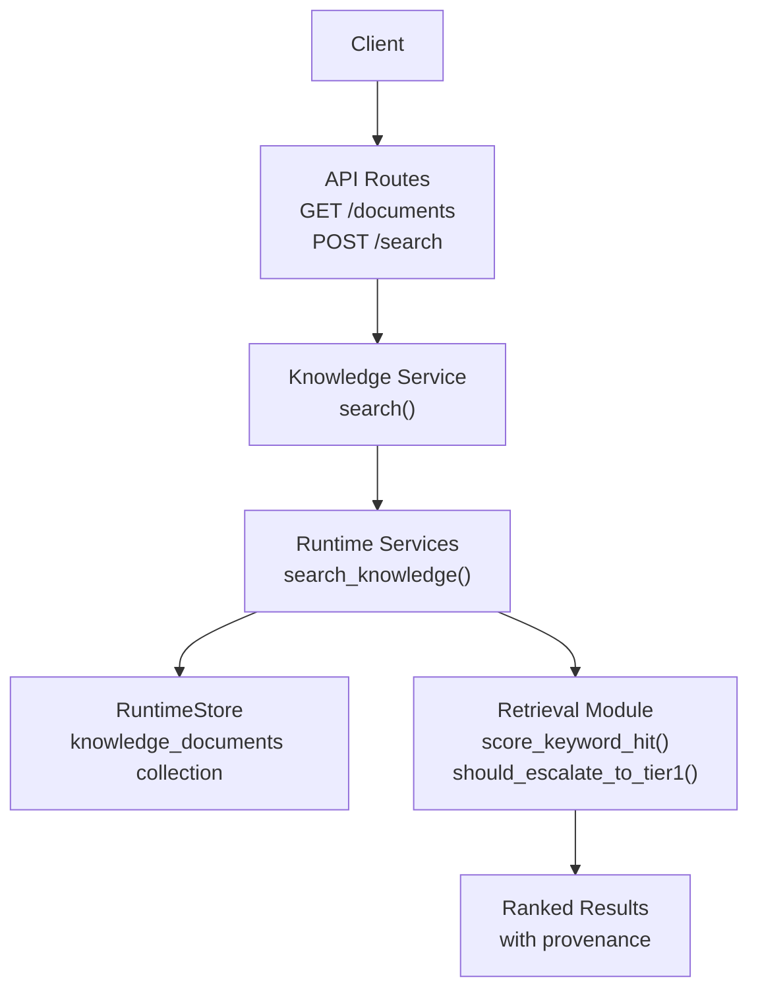
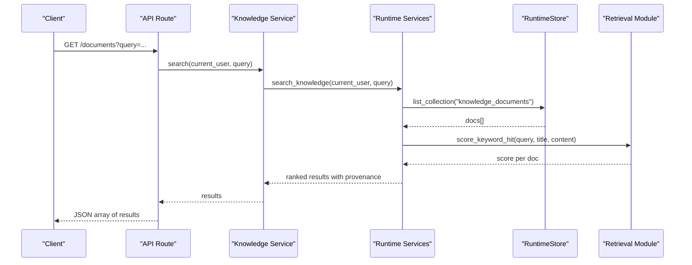
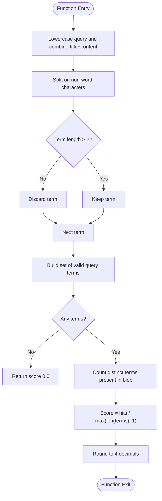
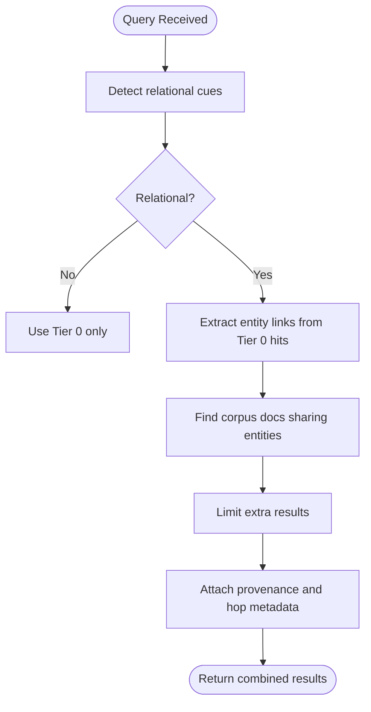
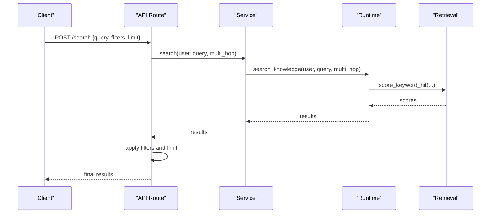
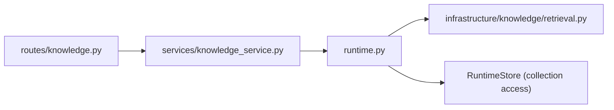

# Keyword Search Engine

<cite>
**Referenced Files in This Document**
- [retrieval.py](file://backend/app/infrastructure/knowledge/retrieval.py)
- [knowledge_service.py](file://backend/app/services/knowledge_service.py)
- [runtime.py](file://backend/app/runtime.py)
- [knowledge.py](file://backend/app/api/v1/routes/knowledge.py)
</cite>

## Table of Contents
1. [Introduction](#introduction)
2. [Project Structure](#project-structure)
3. [Core Components](#core-components)
4. [Architecture Overview](#architecture-overview)
5. [Detailed Component Analysis](#detailed-component-analysis)
6. [Dependency Analysis](#dependency-analysis)
7. [Performance Considerations](#performance-considerations)
8. [Troubleshooting Guide](#troubleshooting-guide)
9. [Conclusion](#conclusion)

## Introduction
This document describes the Tier 0 keyword search engine used for knowledge retrieval. It focuses on:
- The term overlap scoring algorithm that ranks results by query term frequency presence in titles and content
- Text preprocessing, tokenization, and filtering rules (minimum term length greater than two characters)
- Mandatory provenance tracking ensuring every result includes source attribution
- Examples of queries, scoring calculations, and ranking behavior
- Performance optimization techniques and indexing strategies for large corpora

The Tier 0 strategy is a lightweight, deterministic keyword-based approach with mandatory provenance. A simple escalation rule can optionally trigger Tier 1 entity-link expansion for relational or multi-hop queries.

## Project Structure
The Tier 0 search spans API routing, service orchestration, runtime state access, and the core retrieval logic:
- API layer exposes endpoints to search knowledge documents
- Service layer delegates to runtime
- Runtime provides persistence-backed collections and orchestrates retrieval
- Retrieval module implements Tier 0 scoring and optional Tier 1 expansion

**Diagram sources**
- [knowledge.py:1-92](file://backend/app/api/v1/routes/knowledge.py#L1-L92)
- [knowledge_service.py:1-27](file://backend/app/services/knowledge_service.py#L1-L27)
- [runtime.py:258-392](file://backend/app/runtime.py#L258-L392)
- [retrieval.py:1-134](file://backend/app/infrastructure/knowledge/retrieval.py#L1-L134)

**Section sources**
- [knowledge.py:1-92](file://backend/app/api/v1/routes/knowledge.py#L1-L92)
- [knowledge_service.py:1-27](file://backend/app/services/knowledge_service.py#L1-L27)
- [runtime.py:258-392](file://backend/app/runtime.py#L258-L392)
- [retrieval.py:1-134](file://backend/app/infrastructure/knowledge/retrieval.py#L1-L134)

## Core Components
- Retrieval module
  - Implements Tier 0 term overlap scoring over title and content
  - Applies tokenization and filtering rules
  - Provides optional Tier 1 entity-link expansion helpers
- Knowledge service
  - Exposes a search function that forwards to runtime
- Runtime services
  - Accesses persisted knowledge documents via RuntimeStore
  - Orchestrates retrieval and returns results with provenance fields
- API routes
  - Accepts query parameters and optional filters
  - Enforces read permissions before returning results

Key responsibilities:
- Tokenization and filtering: split non-word characters, lowercase, keep terms longer than two characters
- Scoring: proportion of query terms found in the combined title+content blob
- Provenance: ensure each result includes source attribution fields such as id, title, path/source, and status
- Escalation: detect relational cues to optionally expand with Tier 1

**Section sources**
- [retrieval.py:71-86](file://backend/app/infrastructure/knowledge/retrieval.py#L71-L86)
- [knowledge_service.py:4-11](file://backend/app/services/knowledge_service.py#L4-L11)
- [runtime.py:258-392](file://backend/app/runtime.py#L258-L392)
- [knowledge.py:11-28](file://backend/app/api/v1/routes/knowledge.py#L11-L28)

## Architecture Overview
The Tier 0 search pipeline:
1. Client sends a GET or POST request with a query string and optional filters
2. API route validates permissions and calls the knowledge service
3. Knowledge service delegates to runtime.search_knowledge
4. Runtime retrieves knowledge_documents from the store
5. Retrieval module scores each document using term overlap
6. Results are returned with mandatory provenance fields

**Diagram sources**
- [knowledge.py:11-28](file://backend/app/api/v1/routes/knowledge.py#L11-L28)
- [knowledge_service.py:4-11](file://backend/app/services/knowledge_service.py#L4-L11)
- [runtime.py:258-392](file://backend/app/runtime.py#L258-L392)
- [retrieval.py:71-78](file://backend/app/infrastructure/knowledge/retrieval.py#L71-L78)

## Detailed Component Analysis

### Term Overlap Scoring Algorithm (Tier 0)
- Preprocessing and tokenization
  - Lowercase the query
  - Split on non-word characters
  - Filter out tokens with length less than or equal to two
- Scoring
  - Concatenate title and content into a single blob (lowercased)
  - Count how many unique query terms appear in the blob
  - Score equals hits divided by number of query terms (rounded to four decimals)
- Ranking
  - Higher scores indicate more relevant matches; sort descending by score
- Edge cases
  - Empty query yields zero score
  - Missing title or content treated as empty strings

**Diagram sources**
- [retrieval.py:71-78](file://backend/app/infrastructure/knowledge/retrieval.py#L71-L78)

**Section sources**
- [retrieval.py:71-78](file://backend/app/infrastructure/knowledge/retrieval.py#L71-L78)

### Text Preprocessing, Tokenization, and Filtering Rules
- Normalization: convert to lowercase
- Tokenization: split on non-word boundaries
- Filtering: retain only tokens longer than two characters
- Impact: short tokens like “a”, “is”, “of” are excluded, improving precision

**Section sources**
- [retrieval.py:71-78](file://backend/app/infrastructure/knowledge/retrieval.py#L71-L78)

### Mandatory Provenance Tracking
Every result must include source attribution to ensure traceability:
- Required fields typically include:
  - id: unique document identifier
  - title: human-readable title
  - source/path: original location or reference
  - status: indexing or archival status
- These fields are populated when loading seed documents and preserved through retrieval

Provenance ensures users can always trace back to the authoritative source of retrieved information.

**Section sources**
- [runtime.py:519-544](file://backend/app/runtime.py#L519-L544)

### Optional Tier 1 Entity-Link Expansion
- Relational cue detection
  - If the query contains relational keywords (e.g., “related”, “linked”, “depends on”), the system may escalate to Tier 1
- Entity extraction
  - Lightweight patterns extract entities such as workflow IDs, policy IDs, agent names, and file paths
- Multi-hop expansion
  - For each Tier 0 hit, find other corpus items sharing at least one entity link
  - Attach metadata indicating hop level, linked_from, and shared_entities
- Purpose
  - Enhances recall for relational queries without requiring external graph vendors

**Diagram sources**
- [retrieval.py:24-36](file://backend/app/infrastructure/knowledge/retrieval.py#L24-L36)
- [retrieval.py:39-68](file://backend/app/infrastructure/knowledge/retrieval.py#L39-L68)
- [retrieval.py:95-133](file://backend/app/infrastructure/knowledge/retrieval.py#L95-L133)

**Section sources**
- [retrieval.py:24-36](file://backend/app/infrastructure/knowledge/retrieval.py#L24-L36)
- [retrieval.py:39-68](file://backend/app/infrastructure/knowledge/retrieval.py#L39-L68)
- [retrieval.py:95-133](file://backend/app/infrastructure/knowledge/retrieval.py#L95-L133)

### API Integration and Filters
- GET /documents accepts query and optional multi_hop flag
- POST /search accepts a payload with query, filters, and limit
- Filters are applied post-retrieval to narrow results by key-value equality
- Limits cap the number of returned items

**Diagram sources**
- [knowledge.py:57-63](file://backend/app/api/v1/routes/knowledge.py#L57-L63)
- [knowledge_service.py:4-11](file://backend/app/services/knowledge_service.py#L4-L11)
- [retrieval.py:71-78](file://backend/app/infrastructure/knowledge/retrieval.py#L71-L78)

**Section sources**
- [knowledge.py:11-28](file://backend/app/api/v1/routes/knowledge.py#L11-L28)
- [knowledge.py:57-63](file://backend/app/api/v1/routes/knowledge.py#L57-L63)
- [knowledge_service.py:4-11](file://backend/app/services/knowledge_service.py#L4-L11)

### Example Queries, Scoring Calculations, and Ranking Behavior
- Query: “policy governance”
  - Terms after filtering: {"policy", "governance"}
  - If both terms appear in title+content, hits = 2, score = 2/2 = 1.0
  - If only “policy” appears, hits = 1, score = 1/2 = 0.5
- Query: “wf_abc depends on pol_xyz”
  - Terms after filtering: {"wf_abc", "depends", "on", "pol_xyz"}
  - Short tokens filtered: “on” removed if ≤2 characters
  - Remaining terms scored against title+content
- Ranking behavior
  - Documents sorted by descending score
  - Ties remain in stable order based on retrieval sequence
- Provenance example
  - Each result includes id, title, path/source, and status for traceability

[No sources needed since this section provides illustrative examples]

## Dependency Analysis
The Tier 0 search depends on:
- API routes for request handling and permission checks
- Knowledge service for delegation
- Runtime services for data access and orchestration
- Retrieval module for scoring and optional expansion

**Diagram sources**
- [knowledge.py:1-92](file://backend/app/api/v1/routes/knowledge.py#L1-L92)
- [knowledge_service.py:1-27](file://backend/app/services/knowledge_service.py#L1-L27)
- [runtime.py:258-392](file://backend/app/runtime.py#L258-L392)
- [retrieval.py:1-134](file://backend/app/infrastructure/knowledge/retrieval.py#L1-L134)

**Section sources**
- [knowledge.py:1-92](file://backend/app/api/v1/routes/knowledge.py#L1-L92)
- [knowledge_service.py:1-27](file://backend/app/services/knowledge_service.py#L1-L27)
- [runtime.py:258-392](file://backend/app/runtime.py#L258-L392)
- [retrieval.py:1-134](file://backend/app/infrastructure/knowledge/retrieval.py#L1-L134)

## Performance Considerations
Optimization techniques for large corpora:
- Indexing strategies
  - Maintain inverted indexes mapping terms to document IDs for O(1) lookup per term
  - Precompute normalized tokens during ingestion to avoid repeated processing
  - Cache frequent queries with TTL to reduce CPU usage
- Query-time optimizations
  - Early termination when all query terms are satisfied
  - Use sets for term membership checks to minimize overhead
  - Apply filters before scoring to reduce candidate set size
- Storage considerations
  - Prefer Postgres JSONB for scalable storage and querying when available
  - Keep provenance fields compact and indexed where necessary
- Scaling
  - Shard knowledge_documents by organization or domain
  - Parallelize scoring across partitions
  - Use pagination and limits to bound response sizes

[No sources needed since this section provides general guidance]

## Troubleshooting Guide
Common issues and resolutions:
- No results returned
  - Verify query terms exceed minimum length (>2 characters)
  - Ensure documents are indexed and have non-empty title/content
- Unexpected low scores
  - Check tokenization behavior; punctuation and case normalization affect matches
  - Confirm title and content concatenation includes expected text
- Provenance missing
  - Validate that seed documents include required fields (id, title, path/source, status)
  - Inspect runtime store population and persistence backend selection

**Section sources**
- [retrieval.py:71-78](file://backend/app/infrastructure/knowledge/retrieval.py#L71-L78)
- [runtime.py:519-544](file://backend/app/runtime.py#L519-L544)

## Conclusion
The Tier 0 keyword search engine provides a fast, deterministic retrieval mechanism grounded in term overlap scoring with strict preprocessing and filtering rules. Mandatory provenance ensures full traceability, while optional Tier 1 expansion supports relational queries. With proper indexing and caching strategies, the system scales effectively for large corpora and remains accessible to users seeking precise, attributable results.