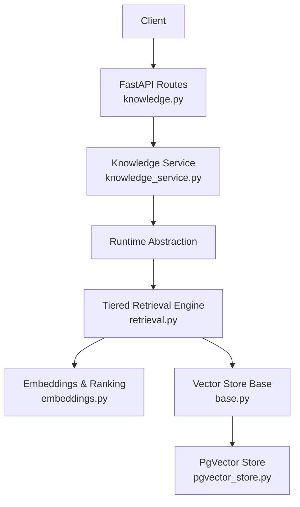
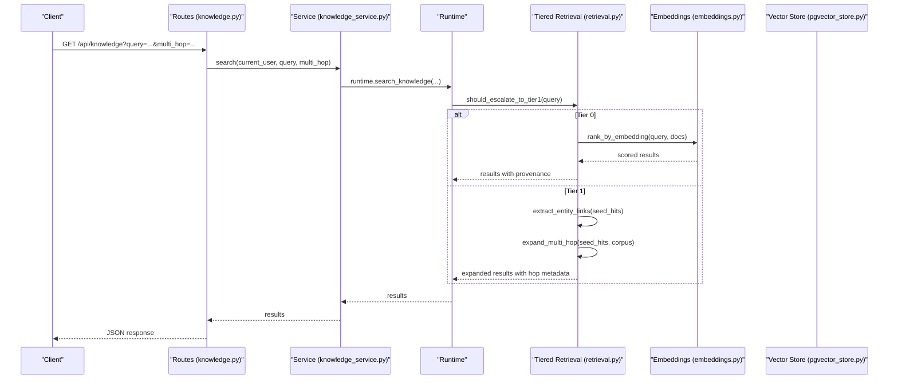
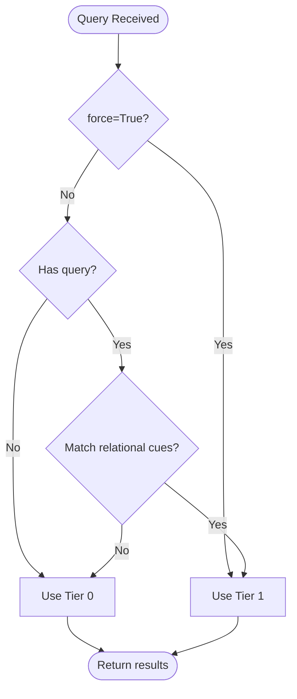
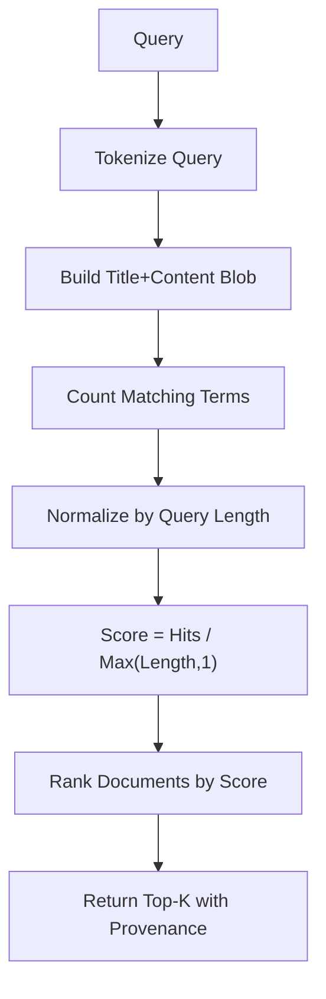
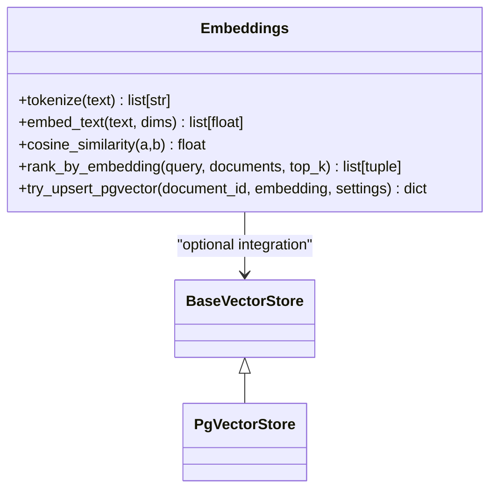
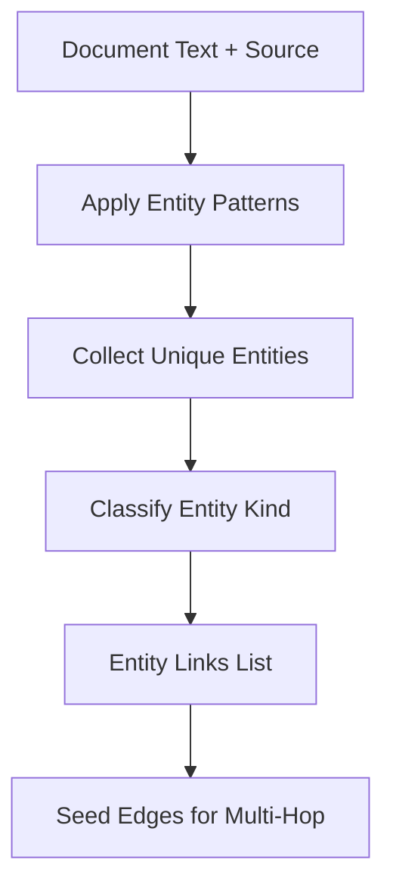
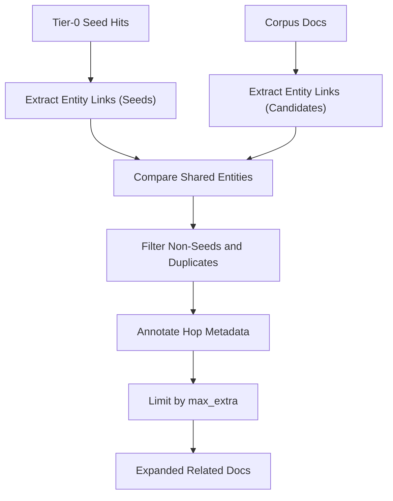

# Knowledge Retrieval System

<cite>
**Referenced Files in This Document**
- [knowledge.py](file://backend/app/api/v1/routes/knowledge.py)
- [retrieval.py](file://backend/app/infrastructure/knowledge/retrieval.py)
- [embeddings.py](file://backend/app/infrastructure/knowledge/embeddings.py)
- [base.py](file://backend/app/infrastructure/vector_store/base.py)
- [pgvector_store.py](file://backend/app/infrastructure/vector_store/pgvector_store.py)
- [knowledge_service.py](file://backend/app/services/knowledge_service.py)
</cite>

## Table of Contents
1. Introduction
2. Project Structure
3. Core Components
4. Architecture Overview
5. Detailed Component Analysis
6. Dependency Analysis
7. Performance Considerations
8. Troubleshooting Guide
9. Conclusion

## Introduction
This document explains the tiered knowledge retrieval system implemented in the backend. It covers:
- Keyword search with full-text indexing and provenance
- Vector embedding similarity search using a deterministic local embedding strategy
- Multi-hop entity traversal via lightweight entity-link extraction
- The retrieval tier policy that selects the appropriate search method based on query complexity
- Entity link extraction, graph-based knowledge representation, and result ranking algorithms
- Practical examples for performing searches, configuring retrieval tiers, and optimizing performance

The design emphasizes portability and low external dependencies while providing a clear escalation path from simple keyword matching to relational expansion when queries imply relationships or multi-hop reasoning.

## Project Structure
The knowledge retrieval feature spans API routes, services, infrastructure utilities for embeddings and vector storage, and a tiered retrieval engine.

**Diagram sources**
- [knowledge.py:1-92](file://backend/app/api/v1/routes/knowledge.py#L1-L92)
- [knowledge_service.py:1-27](file://backend/app/services/knowledge_service.py#L1-L27)
- [retrieval.py:1-134](file://backend/app/infrastructure/knowledge/retrieval.py#L1-L134)
- [embeddings.py:1-90](file://backend/app/infrastructure/knowledge/embeddings.py#L1-L90)
- [base.py:1-3](file://backend/app/infrastructure/vector_store/base.py#L1-L3)
- [pgvector_store.py:1-6](file://backend/app/infrastructure/vector_store/pgvector_store.py#L1-L6)

**Section sources**
- [knowledge.py:1-92](file://backend/app/api/v1/routes/knowledge.py#L1-L92)
- [knowledge_service.py:1-27](file://backend/app/services/knowledge_service.py#L1-L27)
- [retrieval.py:1-134](file://backend/app/infrastructure/knowledge/retrieval.py#L1-L134)
- [embeddings.py:1-90](file://backend/app/infrastructure/knowledge/embeddings.py#L1-L90)
- [base.py:1-3](file://backend/app/infrastructure/vector_store/base.py#L1-L3)
- [pgvector_store.py:1-6](file://backend/app/infrastructure/vector_store/pgvector_store.py#L1-L6)

## Core Components
- Tiered retrieval policy: Determines whether to use Tier 0 (keyword), Tier 1 (entity-link multi-hop), or defer Tier 2 (hierarchical summaries). Includes heuristics for detecting relational cues and entity patterns.
- Keyword search and ranking: Term overlap scoring over title and content with mandatory provenance fields.
- Deterministic local embeddings: Hashing-trick embeddings with cosine similarity ranking; optional pgvector persistence.
- Entity link extraction: Regex-based extraction of workflow, policy, agent, document path, and risk tier entities to build lightweight edges for multi-hop expansion.
- Multi-hop expansion: Joins seed hits with corpus documents sharing extracted entities to produce related results with hop metadata.
- API surface: Endpoints for search, upload, index, archive, and graph operations (extract/query/gaps/federate).

**Section sources**
- [retrieval.py:1-134](file://backend/app/infrastructure/knowledge/retrieval.py#L1-L134)
- [embeddings.py:1-90](file://backend/app/infrastructure/knowledge/embeddings.py#L1-L90)
- [knowledge.py:1-92](file://backend/app/api/v1/routes/knowledge.py#L1-L92)

## Architecture Overview
The retrieval pipeline is layered:
- API layer exposes REST endpoints and enforces permissions.
- Service layer delegates to runtime abstractions.
- Infrastructure layer implements retrieval strategies, embeddings, and optional vector store backends.
- Tier selection logic decides which strategy to apply based on query characteristics.

**Diagram sources**
- [knowledge.py:1-92](file://backend/app/api/v1/routes/knowledge.py#L1-L92)
- [knowledge_service.py:1-27](file://backend/app/services/knowledge_service.py#L1-L27)
- [retrieval.py:1-134](file://backend/app/infrastructure/knowledge/retrieval.py#L1-L134)
- [embeddings.py:1-90](file://backend/app/infrastructure/knowledge/embeddings.py#L1-L90)
- [pgvector_store.py:1-6](file://backend/app/infrastructure/vector_store/pgvector_store.py#L1-L6)

## Detailed Component Analysis

### Tiered Retrieval Policy
- Default behavior: Tier 0 keyword search with mandatory provenance.
- Escalation triggers: Relational cues such as “related,” “linked,” “depends on,” “governed by,” “refers to,” “connection,” “multi-hop,” “relationship,” “associated.”
- Optional force: A flag can force Tier 1 even if cues are absent.
- Non-goals: Avoids vendor lock-in and heavy external graph systems at this stage.

**Diagram sources**
- [retrieval.py:14-28](file://backend/app/infrastructure/knowledge/retrieval.py#L14-L28)
- [retrieval.py:81-86](file://backend/app/infrastructure/knowledge/retrieval.py#L81-L86)

**Section sources**
- [retrieval.py:1-28](file://backend/app/infrastructure/knowledge/retrieval.py#L1-L28)
- [retrieval.py:81-86](file://backend/app/infrastructure/knowledge/retrieval.py#L81-L86)

### Keyword Search and Ranking (Tier 0)
- Tokenization: Lowercase split on non-word characters, filtering short tokens.
- Scoring: Term overlap ratio between query terms and combined title/content.
- Provenance: Results include source references to ensure traceability.

**Diagram sources**
- [retrieval.py:71-78](file://backend/app/infrastructure/knowledge/retrieval.py#L71-L78)

**Section sources**
- [retrieval.py:71-78](file://backend/app/infrastructure/knowledge/retrieval.py#L71-L78)

### Vector Embedding Similarity Search
- Deterministic embeddings: Hashing-trick approach producing stable vectors without external models.
- Cosine similarity: Normalized dot product used as similarity score.
- In-memory ranking: Computes scores across documents; supports top-k selection.
- Optional pgvector persistence: Upserts embeddings into a Postgres table when enabled.

**Diagram sources**
- [embeddings.py:13-47](file://backend/app/infrastructure/knowledge/embeddings.py#L13-L47)
- [embeddings.py:50-89](file://backend/app/infrastructure/knowledge/embeddings.py#L50-L89)
- [base.py:1-3](file://backend/app/infrastructure/vector_store/base.py#L1-L3)
- [pgvector_store.py:1-6](file://backend/app/infrastructure/vector_store/pgvector_store.py#L1-L6)

**Section sources**
- [embeddings.py:1-90](file://backend/app/infrastructure/knowledge/embeddings.py#L1-L90)
- [base.py:1-3](file://backend/app/infrastructure/vector_store/base.py#L1-L3)
- [pgvector_store.py:1-6](file://backend/app/infrastructure/vector_store/pgvector_store.py#L1-L6)

### Entity Link Extraction and Graph-Based Representation
- Patterns: Extracts identifiers like workflows (wf_*), policies (pol_*), agents (agent_* or *_agent), document paths (business/...), and risk tiers (tier_*).
- Source linking: Associates each document’s source path as an entity for provenance.
- Kind classification: Assigns semantic kinds to entities to support downstream graph operations.

**Diagram sources**
- [retrieval.py:30-68](file://backend/app/infrastructure/knowledge/retrieval.py#L30-L68)

**Section sources**
- [retrieval.py:30-68](file://backend/app/infrastructure/knowledge/retrieval.py#L30-L68)

### Multi-Hop Entity Traversal (Tier 1 Lite)
- Seed hits: Start from Tier 0 results.
- Shared entities: For each candidate document, compute shared entities with seed hits.
- Expansion: Attach hop metadata and linkage information to related documents, limited by max_extra.

**Diagram sources**
- [retrieval.py:89-133](file://backend/app/infrastructure/knowledge/retrieval.py#L89-L133)

**Section sources**
- [retrieval.py:89-133](file://backend/app/infrastructure/knowledge/retrieval.py#L89-L133)

### API Surface and Usage Examples
- Search endpoints:
  - GET /api/knowledge with query and multi_hop parameters
  - POST /api/knowledge/search with payload including query, filters, and limit
- Upload and indexing:
  - POST /api/knowledge and /api/knowledge/documents
  - POST /api/knowledge/documents/{document_id}/index
- Archive:
  - DELETE /api/knowledge/documents/{document_id}
- Graph operations:
  - POST /api/knowledge/graph/extract/{document_id}
  - GET /api/knowledge/graph/query?seed=...&max_hops=...
  - GET /api/knowledge/graph/gaps
  - POST /api/knowledge/graph/federate

Practical examples:
- Simple keyword search: GET /api/knowledge?query="policy compliance"
- Force multi-hop: GET /api/knowledge?query="workflow wf_deploy"
- Payload-based search with filters: POST /api/knowledge/search with body {"query": "...", "filters": {"source_type": "policy"}, "limit": 10}
- Index a document: POST /api/knowledge/documents/{id}/index
- Extract graph edges: POST /api/knowledge/graph/extract/{id}
- Query graph: GET /api/knowledge/graph/query?seed="wf_deploy"&max_hops=2

**Section sources**
- [knowledge.py:11-92](file://backend/app/api/v1/routes/knowledge.py#L11-L92)
- [knowledge_service.py:4-10](file://backend/app/services/knowledge_service.py#L4-L10)

## Dependency Analysis
The retrieval system composes several modules with clear boundaries:
- Routes depend on service functions for search and document operations.
- Service delegates to runtime abstractions.
- Tiered retrieval depends on embeddings and optional vector store interfaces.
- Vector store base defines an abstraction; pgvector store provides a concrete implementation.

```mermaid
graph LR
Routes["routes/knowledge.py"] --> Service["services/knowledge_service.py"]
Service --> Runtime["runtime abstraction"]
Runtime --> Tiered["infrastructure/knowledge/retrieval.py"]
Tiered --> Embeddings["infrastructure/knowledge/embeddings.py"]
Embeddings --> VBase["infrastructure/vector_store/base.py"]
VBase --> PgV["infrastructure/vector_store/pgvector_store.py"]
```

**Diagram sources**
- [knowledge.py:1-92](file://backend/app/api/v1/routes/knowledge.py#L1-L92)
- [knowledge_service.py:1-27](file://backend/app/services/knowledge_service.py#L1-L27)
- [retrieval.py:1-134](file://backend/app/infrastructure/knowledge/retrieval.py#L1-L134)
- [embeddings.py:1-90](file://backend/app/infrastructure/knowledge/embeddings.py#L1-L90)
- [base.py:1-3](file://backend/app/infrastructure/vector_store/base.py#L1-L3)
- [pgvector_store.py:1-6](file://backend/app/infrastructure/vector_store/pgvector_store.py#L1-L6)

**Section sources**
- [knowledge.py:1-92](file://backend/app/api/v1/routes/knowledge.py#L1-L92)
- [knowledge_service.py:1-27](file://backend/app/services/knowledge_service.py#L1-L27)
- [retrieval.py:1-134](file://backend/app/infrastructure/knowledge/retrieval.py#L1-L134)
- [embeddings.py:1-90](file://backend/app/infrastructure/knowledge/embeddings.py#L1-L90)
- [base.py:1-3](file://backend/app/infrastructure/vector_store/base.py#L1-L3)
- [pgvector_store.py:1-6](file://backend/app/infrastructure/vector_store/pgvector_store.py#L1-L6)

## Performance Considerations
- Prefer Tier 0 for simple queries to minimize overhead; it uses fast tokenization and term overlap scoring.
- Use multi_hop only when necessary; multi-hop expansion adds O(n*m) comparisons between seeds and corpus candidates.
- Tune top_k and max_extra to balance recall and latency.
- Enable pgvector persistence only when Postgres is available and needed; otherwise, rely on in-memory embeddings.
- Cache frequent queries and precompute embeddings for large corpora to reduce repeated computation.
- Keep entity patterns focused to avoid false positives and unnecessary edge creation.

[No sources needed since this section provides general guidance]

## Troubleshooting Guide
Common issues and resolutions:
- No results returned:
  - Verify query terms are longer than two characters; very short tokens are filtered out.
  - Ensure documents have title and content populated; empty blobs yield zero scores.
- Multi-hop not triggered:
  - Add relational cues (“related,” “linked,” “depends on”) or set multi_hop=true.
  - Confirm entity patterns match identifiers in your documents (e.g., wf_*, pol_*, agent_*).
- pgvector upsert failures:
  - Check that pgvector is enabled and Postgres is reachable; failures are best-effort and do not block requests.
- High latency:
  - Reduce top_k and max_extra; consider precomputing embeddings and limiting corpus size per request.

**Section sources**
- [retrieval.py:71-78](file://backend/app/infrastructure/knowledge/retrieval.py#L71-L78)
- [retrieval.py:81-86](file://backend/app/infrastructure/knowledge/retrieval.py#L81-L86)
- [embeddings.py:50-89](file://backend/app/infrastructure/knowledge/embeddings.py#L50-L89)

## Conclusion
The tiered knowledge retrieval system offers a pragmatic balance between simplicity and capability:
- Tier 0 ensures fast, deterministic keyword search with provenance.
- Tier 1 introduces lightweight multi-hop expansion through entity links without requiring external graph vendors.
- Deterministic embeddings provide a portable similarity baseline, with optional pgvector persistence for scalability.
- Clear API endpoints enable straightforward usage, configuration, and extension.

Adopt Tier 0 for most queries, escalate to Tier 1 when relational context is implied, and consider precomputation and parameter tuning to optimize performance at scale.