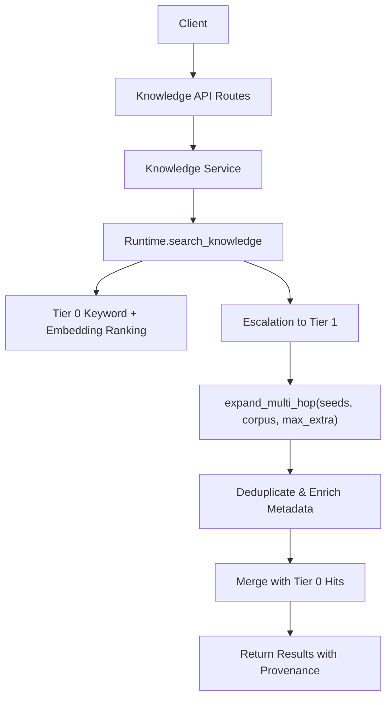
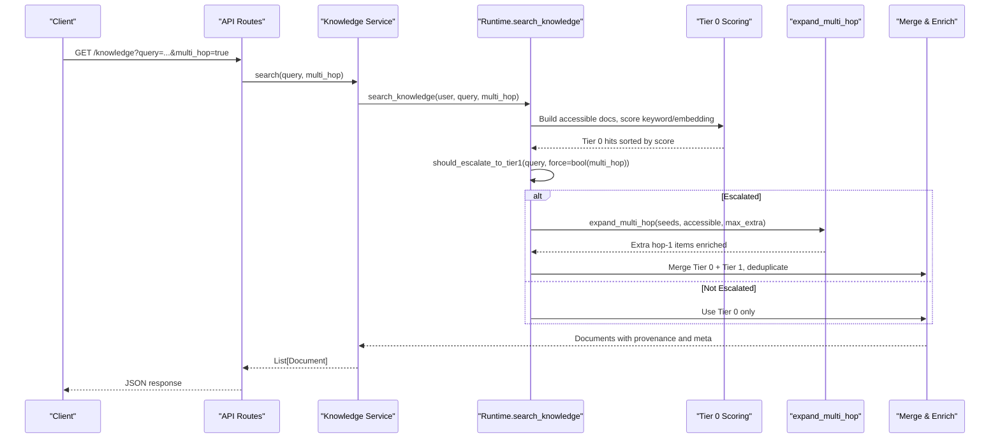
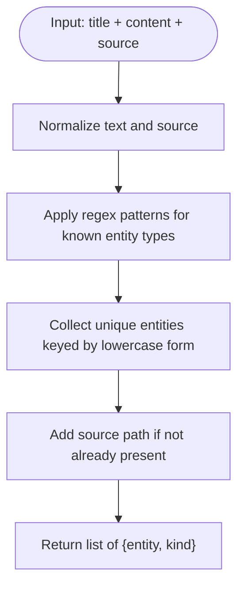
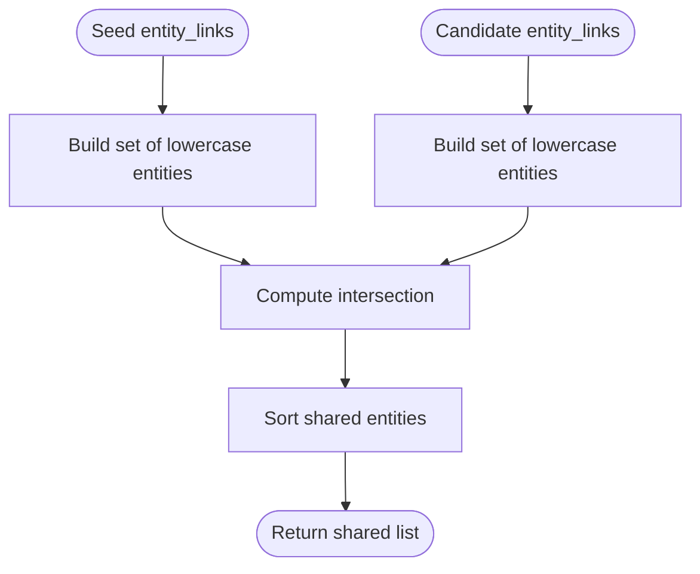
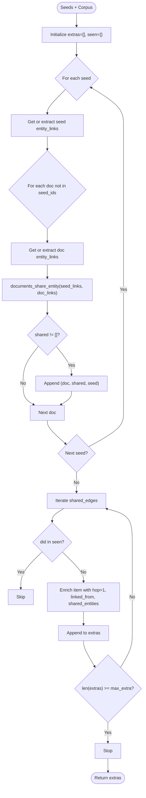
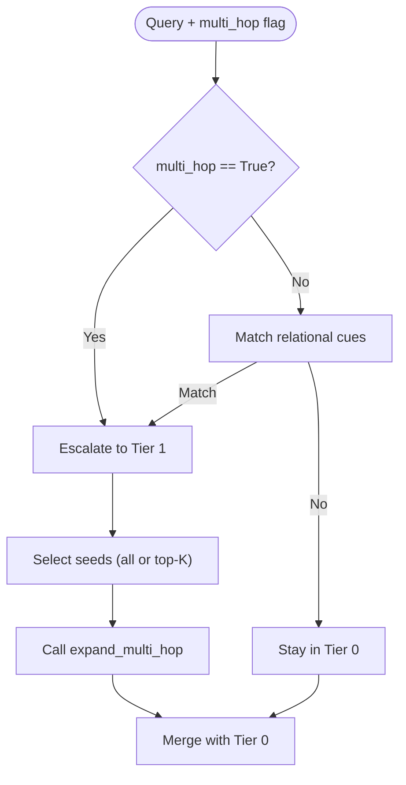
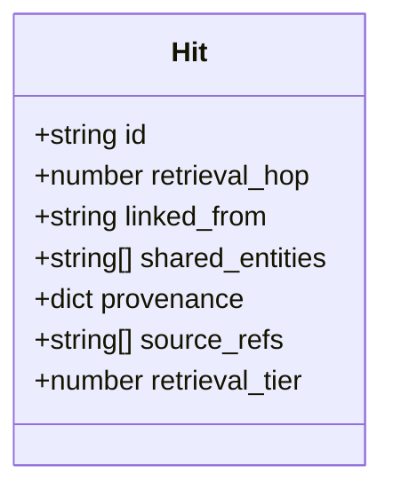
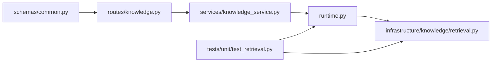

# Multi-hop Expansion Engine

<cite>
**Referenced Files in This Document**
- [retrieval.py](file://backend/app/infrastructure/knowledge/retrieval.py)
- [runtime.py](file://backend/app/runtime.py)
- [knowledge.py](file://backend/app/api/v1/routes/knowledge.py)
- [common.py](file://backend/app/schemas/common.py)
- [test_retrieval.py](file://backend/app/tests/unit/test_retrieval.py)
- [tier1-multi-hop-entity.json](file://business/evals/retrieval/tier1-multi-hop-entity.json)
</cite>

## Table of Contents
1. [Introduction](#introduction)
2. [Project Structure](#project-structure)
3. [Core Components](#core-components)
4. [Architecture Overview](#architecture-overview)
5. [Detailed Component Analysis](#detailed-component-analysis)
6. [Dependency Analysis](#dependency-analysis)
7. [Performance Considerations](#performance-considerations)
8. [Troubleshooting Guide](#troubleshooting-guide)
9. [Conclusion](#conclusion)
10. [Appendices](#appendices)

## Introduction
This document explains the Tier 1 multi-hop expansion engine that augments initial search results by finding related documents sharing entity links with seed hits. It covers:
- One-hop expansion mechanics
- Shared entity detection algorithm
- Result deduplication and maximum expansion limits
- Metadata enrichment fields (retrieval_hop, linked_from, shared_entities)
- Practical examples using seed hits and expanded result sets
- Performance considerations and tuning parameters for depth and breadth

## Project Structure
The Tier 1 expansion is implemented as a lightweight, in-process component integrated into the knowledge retrieval pipeline. The key files are:
- Retrieval logic and entity-link utilities
- Runtime orchestration of Tier 0 and Tier 1
- API routes exposing multi-hop control
- Schemas defining request parameters
- Unit tests and evaluation assertions validating behavior

**Diagram sources**
- [knowledge.py:1-92](file://backend/app/api/v1/routes/knowledge.py#L1-L92)
- [runtime.py:2550-2668](file://backend/app/runtime.py#L2550-L2668)
- [retrieval.py:94-134](file://backend/app/infrastructure/knowledge/retrieval.py#L94-L134)

**Section sources**
- [knowledge.py:1-92](file://backend/app/api/v1/routes/knowledge.py#L1-L92)
- [runtime.py:2550-2668](file://backend/app/runtime.py#L2550-L2668)
- [retrieval.py:1-134](file://backend/app/infrastructure/knowledge/retrieval.py#L1-L134)

## Core Components
- Entity link extraction: Identifies typed entities such as workflows, policies, agents, document paths, and risk tiers from text and source metadata.
- Shared entity detection: Computes intersection of normalized entity sets between seed and candidate documents.
- One-hop expansion: For each seed hit, scans corpus candidates to find those sharing at least one entity; enriches candidates with hop metadata and caps output via max_extra.
- Escalation policy: Determines when to escalate from Tier 0 to Tier 1 based on explicit flags or relational cues in the query.
- Result merging and provenance: Combines Tier 0 and Tier 1 results, ensures deduplication, and attaches provenance including retrieval tier and policy notes.

**Section sources**
- [retrieval.py:39-68](file://backend/app/infrastructure/knowledge/retrieval.py#L39-L68)
- [retrieval.py:89-134](file://backend/app/infrastructure/knowledge/retrieval.py#L89-L134)
- [runtime.py:2550-2668](file://backend/app/runtime.py#L2550-L2668)

## Architecture Overview
The system performs Tier 0 keyword and optional embedding ranking, then optionally escalates to Tier 1 to expand results via shared entity links. The API exposes a multi_hop flag to force expansion even without relational cues.

**Diagram sources**
- [knowledge.py:11-28](file://backend/app/api/v1/routes/knowledge.py#L11-L28)
- [runtime.py:2550-2668](file://backend/app/runtime.py#L2550-L2668)
- [retrieval.py:81-134](file://backend/app/infrastructure/knowledge/retrieval.py#L81-L134)

## Detailed Component Analysis

### Entity Link Extraction
- Purpose: Identify lightweight entity mentions for building edges used in multi-hop expansion.
- Patterns: Recognizes workflow IDs, policy IDs, agent references, business document paths, and risk tiers; also includes source path as an entity.
- Output: A list of entity objects with normalized keys and kinds.

**Diagram sources**
- [retrieval.py:39-68](file://backend/app/infrastructure/knowledge/retrieval.py#L39-L68)

**Section sources**
- [retrieval.py:39-68](file://backend/app/infrastructure/knowledge/retrieval.py#L39-L68)

### Shared Entity Detection Algorithm
- Input: Two lists of entity links (seed vs candidate).
- Process: Normalize entities to lowercase sets and compute intersection.
- Output: Sorted list of shared entity strings.

**Diagram sources**
- [retrieval.py:89-92](file://backend/app/infrastructure/knowledge/retrieval.py#L89-L92)

**Section sources**
- [retrieval.py:89-92](file://backend/app/infrastructure/knowledge/retrieval.py#L89-L92)

### One-Hop Expansion Logic
- Seed selection: Uses all Tier 0 seeds when multi_hop is forced; otherwise uses top-K seeds.
- Candidate scanning: For each non-seed document, computes shared entities with seed links.
- Deduplication: Tracks seen document IDs to avoid duplicates.
- Enrichment: Adds retrieval_hop=1, linked_from=seed id, shared_entities=intersection list.
- Limits: Stops after max_extra items are collected.

**Diagram sources**
- [retrieval.py:95-134](file://backend/app/infrastructure/knowledge/retrieval.py#L95-L134)

**Section sources**
- [retrieval.py:95-134](file://backend/app/infrastructure/knowledge/retrieval.py#L95-L134)

### Escalation Policy and Integration
- Force mode: When multi_hop is true, escalation occurs regardless of query cues.
- Cue-based mode: Relational phrases trigger escalation automatically.
- Seed breadth: In forced mode, all Tier 0 hits become seeds; otherwise top-K seeds are used.
- Max extra: Larger cap in forced mode to support precision exploration.

**Diagram sources**
- [runtime.py:2620-2632](file://backend/app/runtime.py#L2620-L2632)
- [retrieval.py:81-87](file://backend/app/infrastructure/knowledge/retrieval.py#L81-L87)

**Section sources**
- [runtime.py:2620-2632](file://backend/app/runtime.py#L2620-L2632)
- [retrieval.py:81-87](file://backend/app/infrastructure/knowledge/retrieval.py#L81-L87)

### Metadata Enrichment
- retrieval_hop: 0 for Tier 0 seeds; 1 for expanded results.
- linked_from: ID of the seed document that caused the expansion.
- shared_entities: List of shared entity identifiers linking seed and expanded document.
- Provenance: Always attached, including source_refs, retrieval_tier, and policy notes.

**Diagram sources**
- [retrieval.py:126-130](file://backend/app/infrastructure/knowledge/retrieval.py#L126-L130)
- [runtime.py:2644-2654](file://backend/app/runtime.py#L2644-L2654)

**Section sources**
- [retrieval.py:126-130](file://backend/app/infrastructure/knowledge/retrieval.py#L126-L130)
- [runtime.py:2644-2654](file://backend/app/runtime.py#L2644-L2654)

### Practical Examples
- Seed hits: Initial Tier 0 matches include a SOP referencing a policy and workflow.
- Entity overlap detection: The policy document shares the same policy entity with the SOP but lacks query keywords.
- Expanded result set: With multi_hop enabled, the policy document appears as a hop-1 result with shared_entities containing the policy identifier and linked_from pointing to the SOP.

Validation references:
- Unit test verifies hop-1 presence, shared_entities, and hop-0 seed retention.
- Evaluation assertion checks that a hop-1 hit exists with the expected shared entity and carries source_refs.

**Section sources**
- [test_retrieval.py:51-118](file://backend/app/tests/unit/test_retrieval.py#L51-L118)
- [tier1-multi-hop-entity.json:1-34](file://business/evals/retrieval/tier1-multi-hop-entity.json#L1-L34)

## Dependency Analysis
- API layer depends on service layer which delegates to runtime.
- Runtime imports retrieval functions for scoring, escalation, and expansion.
- Tests import both retrieval utilities and runtime methods to validate behavior.
- Schemas define request fields including multi_hop and limit.

**Diagram sources**
- [knowledge.py:1-92](file://backend/app/api/v1/routes/knowledge.py#L1-L92)
- [runtime.py:2550-2668](file://backend/app/runtime.py#L2550-L2668)
- [retrieval.py:1-134](file://backend/app/infrastructure/knowledge/retrieval.py#L1-L134)
- [common.py:200-204](file://backend/app/schemas/common.py#L200-L204)
- [test_retrieval.py:1-132](file://backend/app/tests/unit/test_retrieval.py#L1-L132)

**Section sources**
- [knowledge.py:1-92](file://backend/app/api/v1/routes/knowledge.py#L1-L92)
- [runtime.py:2550-2668](file://backend/app/runtime.py#L2550-L2668)
- [retrieval.py:1-134](file://backend/app/infrastructure/knowledge/retrieval.py#L1-L134)
- [common.py:200-204](file://backend/app/schemas/common.py#L200-L204)
- [test_retrieval.py:1-132](file://backend/app/tests/unit/test_retrieval.py#L1-L132)

## Performance Considerations
- Time complexity:
  - Entity extraction per document is linear in text length due to regex scans.
  - One-hop expansion compares each seed against each corpus candidate; worst-case O(S*C) where S is number of seeds and C is corpus size.
  - Shared entity computation is set intersection over normalized entities.
- Space complexity:
  - Stores entity link sets per document during expansion; bounded by corpus size and average entity count.
- Tuning parameters:
  - multi_hop: Controls whether to escalate and use all seeds versus top-K seeds.
  - max_extra: Caps the number of expanded results; larger values increase breadth but also CPU and memory usage.
  - Top-K seeds: In non-forced mode, limiting seeds reduces comparisons significantly.
- Recommendations:
  - Prefer forcing multi_hop only when necessary to keep seed set precise.
  - Adjust max_extra based on workload constraints and desired recall.
  - Ensure entity_link precomputation where possible to avoid repeated extraction.

[No sources needed since this section provides general guidance]

## Troubleshooting Guide
- Missing hop-1 results:
  - Verify multi_hop is enabled or query contains relational cues.
  - Confirm seed documents contain recognizable entity patterns.
  - Check that candidate documents reference the same entities.
- Unexpected duplicates:
  - Ensure deduplication by document ID is active; verify IDs are stable across documents.
- Insufficient breadth:
  - Increase max_extra or force multi_hop to expand from all seeds.
- Provenance gaps:
  - Confirm source_refs are populated; fallback defaults exist when missing.

**Section sources**
- [test_retrieval.py:88-118](file://backend/app/tests/unit/test_retrieval.py#L88-L118)
- [tier1-multi-hop-entity.json:14-22](file://business/evals/retrieval/tier1-multi-hop-entity.json#L14-L22)

## Conclusion
The Tier 1 multi-hop expansion engine provides a lightweight, deterministic way to surface related documents through shared entity links. It integrates seamlessly with Tier 0 retrieval, supports controlled escalation, and enriches results with clear provenance and metadata. By tuning multi_hop and max_extra, operators can balance recall and performance according to their needs.

[No sources needed since this section summarizes without analyzing specific files]

## Appendices

### API Usage Notes
- Query parameter multi_hop enables forced escalation to Tier 1.
- Request schema includes limit and filters for post-processing.

**Section sources**
- [knowledge.py:11-28](file://backend/app/api/v1/routes/knowledge.py#L11-L28)
- [common.py:200-204](file://backend/app/schemas/common.py#L200-L204)