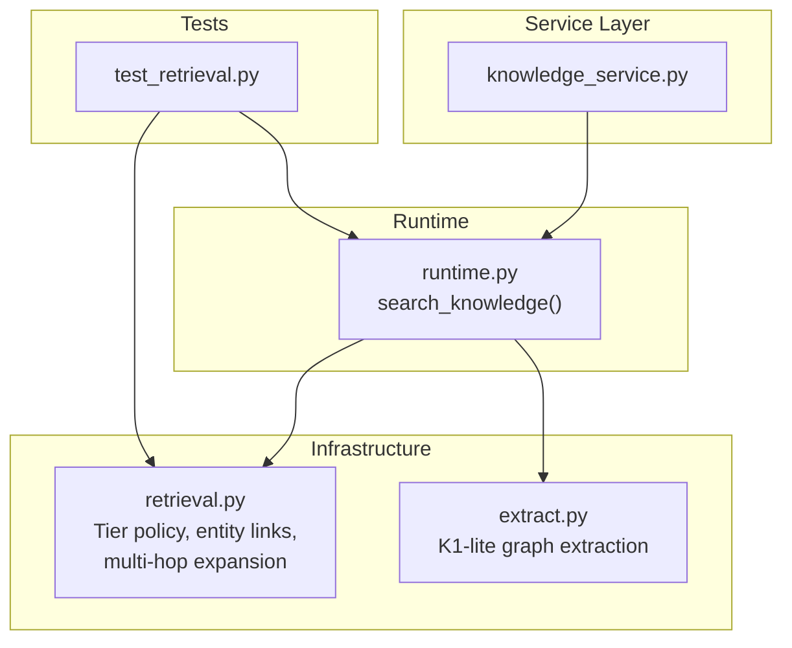
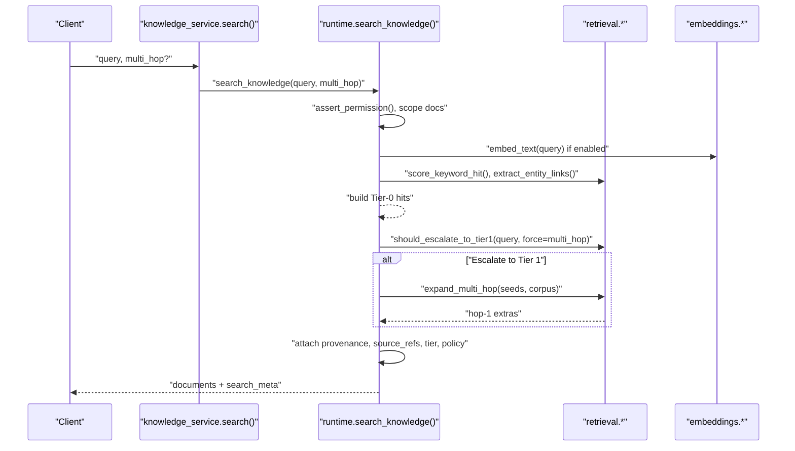
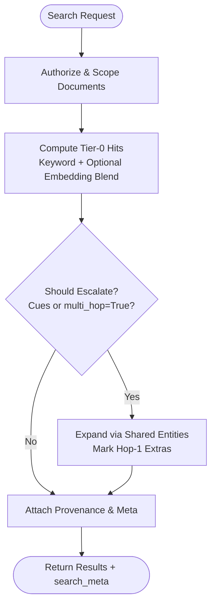
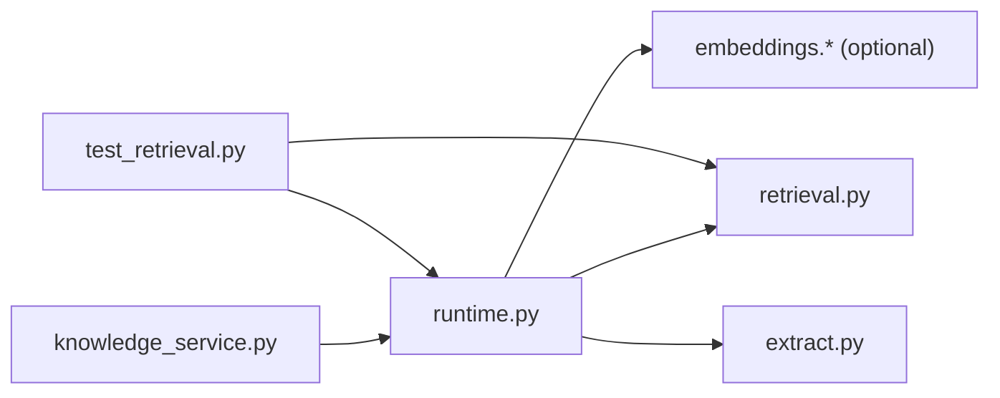

# Tiered Retrieval Strategy

<cite>
**Referenced Files in This Document**
- [retrieval.py](file://backend/app/infrastructure/knowledge/retrieval.py)
- [runtime.py](file://backend/app/runtime.py)
- [extract.py](file://backend/app/infrastructure/knowledge_orchestration/extract.py)
- [knowledge_service.py](file://backend/app/services/knowledge_service.py)
- [test_retrieval.py](file://backend/app/tests/unit/test_retrieval.py)
</cite>

## Table of Contents
1. [Introduction](#introduction)
2. [Project Structure](#project-structure)
3. [Core Components](#core-components)
4. [Architecture Overview](#architecture-overview)
5. [Detailed Component Analysis](#detailed-component-analysis)
6. [Dependency Analysis](#dependency-analysis)
7. [Performance Considerations](#performance-considerations)
8. [Troubleshooting Guide](#troubleshooting-guide)
9. [Conclusion](#conclusion)
10. [Appendices](#appendices)

## Introduction
This document explains the tiered retrieval strategy used by the knowledge search system. It covers:
- Tier 0: Keyword search with mandatory provenance and optional embedding blending
- Tier 1: Entity-link multi-hop lite expansion for relational queries
- Deferred Tier 2: RAPTOR-style hierarchical summaries (out of scope, reserved for future work)

It also documents the automatic escalation logic from Tier 0 to Tier 1 based on query patterns, configuration of retrieval tiers, performance considerations, and practical examples of when each tier is triggered.

## Project Structure
The tiered retrieval strategy spans a small set of focused modules:
- Infrastructure retrieval utilities define policies, entity link extraction, scoring, and multi-hop expansion
- Runtime orchestrates access control, indexing, and the end-to-end search flow
- Knowledge orchestration extracts lightweight graph artifacts during indexing
- Service layer exposes a simple API surface over runtime
- Unit tests validate behavior and expected outputs

**Diagram sources**
- [knowledge_service.py:1-27](file://backend/app/services/knowledge_service.py#L1-L27)
- [runtime.py:2552-2668](file://backend/app/runtime.py#L2552-L2668)
- [retrieval.py:1-134](file://backend/app/infrastructure/knowledge/retrieval.py#L1-L134)
- [extract.py:1-118](file://backend/app/infrastructure/knowledge_orchestration/extract.py#L1-L118)
- [test_retrieval.py:1-132](file://backend/app/tests/unit/test_retrieval.py#L1-L132)

**Section sources**
- [knowledge_service.py:1-27](file://backend/app/services/knowledge_service.py#L1-L27)
- [runtime.py:2552-2668](file://backend/app/runtime.py#L2552-L2668)
- [retrieval.py:1-134](file://backend/app/infrastructure/knowledge/retrieval.py#L1-L134)
- [extract.py:1-118](file://backend/app/infrastructure/knowledge_orchestration/extract.py#L1-L118)
- [test_retrieval.py:1-132](file://backend/app/tests/unit/test_retrieval.py#L1-L132)

## Core Components
- Retrieval policy and cues:
  - Default tier is 0
  - Tier 1 is enabled automatically for relational/multi-hop cue words or explicitly via force flag
  - Tier 2 is deferred and not implemented
- Entity link extraction:
  - Lightweight regex-based extraction of entities like workflows, policies, agents, document paths, and risk tiers
- Scoring and ranking:
  - Keyword overlap score with optional blending with embeddings when available
- Multi-hop expansion:
  - Finds additional documents that share entity links with seed hits (Tier 0 results), marking them as hop-1

Key responsibilities are implemented in:
- Policy, cues, entity extraction, scoring, and multi-hop expansion: [retrieval.py:1-134](file://backend/app/infrastructure/knowledge/retrieval.py#L1-L134)
- Search orchestration, permission checks, provenance attachment, and meta annotation: [runtime.py:2552-2668](file://backend/app/runtime.py#L2552-L2668)
- Graph extraction during indexing (used by Tier 1 indirectly): [extract.py:1-118](file://backend/app/infrastructure/knowledge_orchestration/extract.py#L1-L118)
- Simple service wrapper: [knowledge_service.py:1-27](file://backend/app/services/knowledge_service.py#L1-L27)
- Behavior validation: [test_retrieval.py:1-132](file://backend/app/tests/unit/test_retrieval.py#L1-L132)

**Section sources**
- [retrieval.py:1-134](file://backend/app/infrastructure/knowledge/retrieval.py#L1-L134)
- [runtime.py:2552-2668](file://backend/app/runtime.py#L2552-L2668)
- [extract.py:1-118](file://backend/app/infrastructure/knowledge_orchestration/extract.py#L1-L118)
- [knowledge_service.py:1-27](file://backend/app/services/knowledge_service.py#L1-L27)
- [test_retrieval.py:1-132](file://backend/app/tests/unit/test_retrieval.py#L1-L132)

## Architecture Overview
The retrieval pipeline follows a clear sequence:
- Access control and scoping
- Tier 0 keyword + optional embedding ranking
- Escalation decision to Tier 1 based on cues or explicit request
- Optional Tier 1 multi-hop expansion using shared entity links
- Provenance enrichment and response metadata

**Diagram sources**
- [knowledge_service.py:1-27](file://backend/app/services/knowledge_service.py#L1-L27)
- [runtime.py:2552-2668](file://backend/app/runtime.py#L2552-L2668)
- [retrieval.py:1-134](file://backend/app/infrastructure/knowledge/retrieval.py#L1-L134)

## Detailed Component Analysis

### Tier 0: Keyword Search with Mandatory Provenance
- Purpose: Fast, precise baseline retrieval with strict provenance guarantees
- Behavior:
  - Computes a keyword overlap score; short substring matches can boost low-score hits
  - Optionally blends with embedding similarity when embeddings are enabled
  - Ensures every result includes provenance and source references
  - Always attaches entity_links for downstream use
- Output fields include:
  - retrieval_score, retrieval_hop = 0, retrieval_tier = 0, provenance.source_refs, provenance.retrieval_policy

Implementation highlights:
- Keyword scoring and blending: [runtime.py:2580-2620](file://backend/app/runtime.py#L2580-L2620)
- Provenance and policy attachment: [runtime.py:2634-2668](file://backend/app/runtime.py#L2634-L2668)
- Entity link extraction for results: [retrieval.py:39-68](file://backend/app/infrastructure/knowledge/retrieval.py#L39-L68)

Practical example:
- Query: "billing gate"
- Expected: Tier 0 hits with provenance and entity_links; no multi-hop unless escalated

**Section sources**
- [runtime.py:2580-2668](file://backend/app/runtime.py#L2580-L2668)
- [retrieval.py:39-68](file://backend/app/infrastructure/knowledge/retrieval.py#L39-L68)

### Tier 1: Entity-Link Multi-Hop Lite
- Purpose: Surface related documents that do not match keywords but share entities with Tier 0 seeds
- Behavior:
  - Uses extracted entity mentions to find co-occurring entities across documents
  - Adds up to a configurable number of extra documents marked as hop-1
  - Marks these extras with retrieval_hop = 1, retrieval_tier = 1, and shared_entities
- Trigger conditions:
  - Automatic escalation when query contains relational cues such as "related", "linked", "which policy", "who owns", "depends on", "governed by", "refers to", "connection", "multi-hop", "relationship", "associated"
  - Explicit escalation when multi_hop=True is passed (force path)

Implementation highlights:
- Escalation decision: [retrieval.py:81-86](file://backend/app/infrastructure/knowledge/retrieval.py#L81-L86)
- Multi-hop expansion: [retrieval.py:95-133](file://backend/app/infrastructure/knowledge/retrieval.py#L95-L133)
- Integration into search flow: [runtime.py:2621-2633](file://backend/app/runtime.py#L2621-L2633)

Practical example:
- Query: "which policy is related to billing"
- Expected: Tier 0 seeds plus hop-1 documents sharing entities like policy identifiers; retrieval_tier = 1

**Section sources**
- [retrieval.py:81-133](file://backend/app/infrastructure/knowledge/retrieval.py#L81-L133)
- [runtime.py:2621-2633](file://backend/app/runtime.py#L2621-L2633)

### Deferred Tier 2: RAPTOR-Style Hierarchical Summaries
- Status: Out of scope for current implementation
- Intent: Future hierarchical summarization for long-context synthesis
- Current impact: None; reserved for later phases

No code changes affect current behavior.

[No sources needed since this section does not analyze specific files]

### Escalation Logic and Policy Configuration
- Policy constants:
  - default_tier = 0
  - tier_0 = "keyword_search_with_mandatory_provenance"
  - tier_1 = "entity_link_multi_hop_lite"
  - tier_2 = "deferred_raptor_optional"
  - escalation = "tier0_then_tier1_on_relational_queries"
- Cues for Tier 1:
  - Regex pattern matches common relational phrases
- Force escalation:
  - Passing multi_hop=True forces Tier 1 even without cues

Implementation highlights:
- Policy note and cues: [retrieval.py:14-28](file://backend/app/infrastructure/knowledge/retrieval.py#L14-L28)
- Escalation function: [retrieval.py:81-86](file://backend/app/infrastructure/knowledge/retrieval.py#L81-L86)
- Usage in search: [runtime.py:2621-2633](file://backend/app/runtime.py#L2621-L2633)

Practical examples:
- Cue-triggered: "who owns wf_customer_onboarding_v12"
- Force-triggered: any query with multi_hop=True

**Section sources**
- [retrieval.py:14-28](file://backend/app/infrastructure/knowledge/retrieval.py#L14-L28)
- [retrieval.py:81-86](file://backend/app/infrastructure/knowledge/retrieval.py#L81-L86)
- [runtime.py:2621-2633](file://backend/app/runtime.py#L2621-L2633)

### Indexing and Graph Extraction (Supporting Tier 1)
- During index, documents are enriched with:
  - entity_links via lightweight extraction
  - K1-lite graph nodes and edges for relations and claims
- These artifacts support downstream reasoning and multi-hop discovery

Implementation highlights:
- Indexing flow and entity/graph enrichment: [runtime.py:2498-2540](file://backend/app/runtime.py#L2498-L2540)
- Graph extraction: [extract.py:33-117](file://backend/app/infrastructure/knowledge_orchestration/extract.py#L33-L117)

**Section sources**
- [runtime.py:2498-2540](file://backend/app/runtime.py#L2498-L2540)
- [extract.py:33-117](file://backend/app/infrastructure/knowledge_orchestration/extract.py#L33-L117)

### API Surface and Service Wrapper
- The service layer provides a thin wrapper around runtime methods
- Exposes search with optional multi_hop parameter

Implementation highlights:
- Service wrapper: [knowledge_service.py:1-27](file://backend/app/services/knowledge_service.py#L1-L27)

**Section sources**
- [knowledge_service.py:1-27](file://backend/app/services/knowledge_service.py#L1-L27)

### End-to-End Flow Diagram

**Diagram sources**
- [runtime.py:2552-2668](file://backend/app/runtime.py#L2552-L2668)
- [retrieval.py:81-133](file://backend/app/infrastructure/knowledge/retrieval.py#L81-L133)

## Dependency Analysis
The following diagram shows how components depend on each other during search and indexing.

**Diagram sources**
- [knowledge_service.py:1-27](file://backend/app/services/knowledge_service.py#L1-L27)
- [runtime.py:2552-2668](file://backend/app/runtime.py#L2552-L2668)
- [retrieval.py:1-134](file://backend/app/infrastructure/knowledge/retrieval.py#L1-L134)
- [extract.py:1-118](file://backend/app/infrastructure/knowledge_orchestration/extract.py#L1-L118)
- [test_retrieval.py:1-132](file://backend/app/tests/unit/test_retrieval.py#L1-L132)

**Section sources**
- [knowledge_service.py:1-27](file://backend/app/services/knowledge_service.py#L1-L27)
- [runtime.py:2552-2668](file://backend/app/runtime.py#L2552-L2668)
- [retrieval.py:1-134](file://backend/app/infrastructure/knowledge/retrieval.py#L1-L134)
- [extract.py:1-118](file://backend/app/infrastructure/knowledge_orchestration/extract.py#L1-L118)
- [test_retrieval.py:1-132](file://backend/app/tests/unit/test_retrieval.py#L1-L132)

## Performance Considerations
- Tier 0 cost:
  - Keyword scoring is O(n) per document with minimal overhead
  - Embedding computation is optional and only applied when enabled; blending occurs for keyword hits
- Tier 1 cost:
  - Multi-hop expansion compares entity sets between seeds and corpus; complexity grows with corpus size and number of seeds
  - Limits max_extra cap the number of added hop-1 documents
- Recommendations:
  - Prefer Tier 0 for straightforward factual queries
  - Use multi_hop=True for targeted exploration when you need related context
  - Keep entity linking concise by ensuring consistent naming conventions for entities (e.g., workflow IDs, policy IDs)

[No sources needed since this section provides general guidance]

## Troubleshooting Guide
Common issues and diagnostics:
- No Tier 1 expansion observed:
  - Ensure documents have entity_links populated (indexing must succeed)
  - Verify shared entities exist between seed and candidate documents
- Unexpected Tier 1 escalation:
  - Check whether query contains relational cues or multi_hop=True was passed
- Missing provenance:
  - Confirm provenance attachment logic runs; all results should include source_refs and retrieval_tier

Validation via tests:
- Tests assert Tier 0 always includes provenance and entity_links
- Tests assert multi-hop surfaces hop-1 documents with correct tier and shared_entities

**Section sources**
- [test_retrieval.py:29-118](file://backend/app/tests/unit/test_retrieval.py#L29-L118)
- [runtime.py:2634-2668](file://backend/app/runtime.py#L2634-L2668)

## Conclusion
The tiered retrieval strategy balances speed and recall:
- Tier 0 ensures fast, provable answers
- Tier 1 adds contextual breadth through entity-link multi-hop expansion
- Tier 2 remains deferred for future hierarchical summarization needs

Use Tier 0 for direct queries and escalate to Tier 1 when exploring relationships or dependencies.

[No sources needed since this section summarizes without analyzing specific files]

## Appendices

### Practical Examples and Expected Results
- Tier 0-only:
  - Query: "billing gate"
  - Expected: Tier 0 hits with provenance and entity_links; retrieval_tier = 0
- Tier 1 auto-escalation:
  - Query: "which policy is related to billing"
  - Expected: Tier 0 seeds plus hop-1 documents sharing entities; retrieval_tier = 1
- Tier 1 forced:
  - Any query with multi_hop=True
  - Expected: Same as above, regardless of cues

Behavior validated by unit tests:
- Provenance presence and tier tagging
- Multi-hop expansion and shared_entities

**Section sources**
- [test_retrieval.py:29-118](file://backend/app/tests/unit/test_retrieval.py#L29-L118)
- [retrieval.py:81-133](file://backend/app/infrastructure/knowledge/retrieval.py#L81-L133)
- [runtime.py:2621-2668](file://backend/app/runtime.py#L2621-L2668)