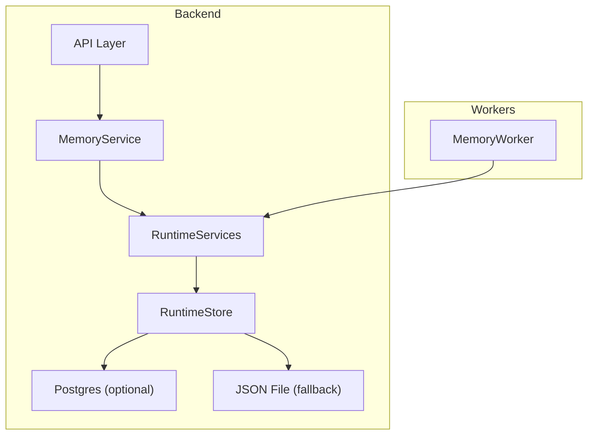
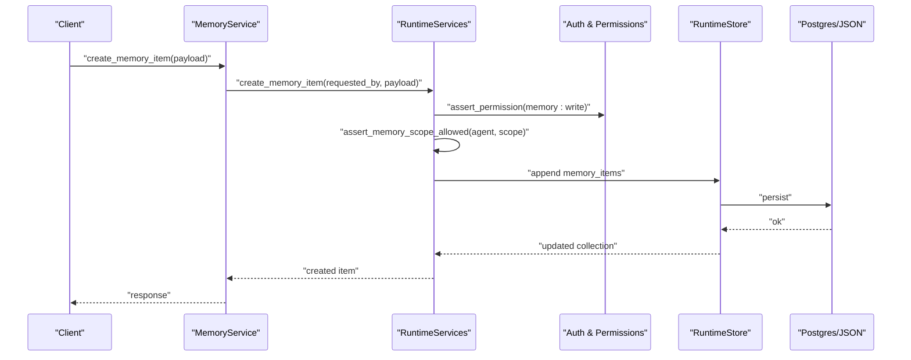
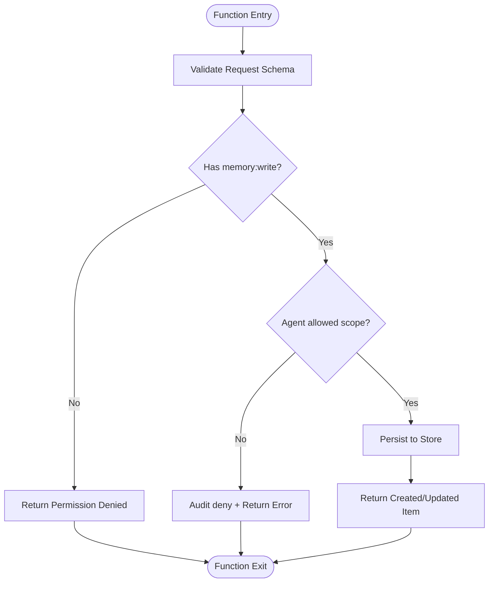
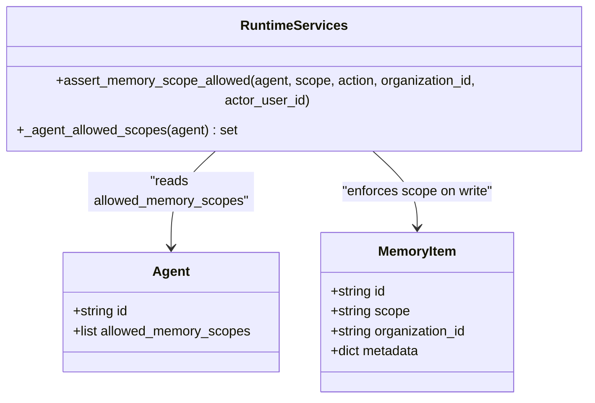
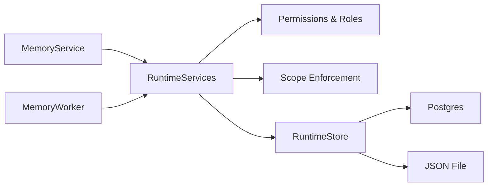

# Memory Types & Architecture

<cite>
**Referenced Files in This Document**
- [runtime.py](file://backend/app/runtime.py)
- [memory_service.py](file://backend/app/services/memory_service.py)
- [memory_worker.py](file://backend/app/workers/memory_worker.py)
- [common.py](file://backend/app/schemas/common.py)
</cite>

## Table of Contents
1. [Introduction](#introduction)
2. [Project Structure](#project-structure)
3. [Core Components](#core-components)
4. [Architecture Overview](#architecture-overview)
5. [Detailed Component Analysis](#detailed-component-analysis)
6. [Dependency Analysis](#dependency-analysis)
7. [Performance Considerations](#performance-considerations)
8. [Troubleshooting Guide](#troubleshooting-guide)
9. [Conclusion](#conclusion)
10. [Appendices](#appendices)

## Introduction
This document explains the hybrid memory system architecture and how it supports four distinct memory types:
- Event memory for temporal sequences
- Episodic memory for experience-based learning
- Semantic memory for factual knowledge
- Procedural memory for skill execution patterns

It covers memory item lifecycle, scoping mechanisms per agent, cross-memory relationships, examples of creating different memory types, accessing scoped memories, and understanding provenance tracking. The implementation is backed by a runtime store with optional Postgres persistence and JSON file fallback, and exposes service-layer APIs for CRUD and search operations.

## Project Structure
The memory subsystem is implemented as part of the backend runtime and services:
- Runtime layer provides authentication, authorization, scoping, persistence, and core memory operations.
- Service layer wraps runtime calls to expose clean endpoints for clients.
- Worker utilities provide operational helpers (e.g., compacting or listing memory items).
- Schemas define request/response contracts for memory creation and updates.

**Diagram sources**
- [runtime.py:258-384](file://backend/app/runtime.py#L258-L384)
- [memory_service.py:1-27](file://backend/app/services/memory_service.py#L1-L27)
- [memory_worker.py:1-6](file://backend/app/workers/memory_worker.py#L1-L6)

**Section sources**
- [runtime.py:258-384](file://backend/app/runtime.py#L258-L384)
- [memory_service.py:1-27](file://backend/app/services/memory_service.py#L1-L27)
- [memory_worker.py:1-6](file://backend/app/workers/memory_worker.py#L1-L6)

## Core Components
- RuntimeServices: Central orchestrator for memory operations, including create, get, update, delete, and search. It enforces permissions, scopes, and organization isolation, and persists changes via RuntimeStore.
- RuntimeStore: Persistent document store that can use Postgres (JSONB) or fall back to a local JSON file. It manages collections such as memory_items and ensures thread-safe access.
- MemoryService: Thin service facade over RuntimeServices for API consumers.
- MemoryWorker: Operational helper to list/compact memory items.

Key responsibilities:
- Scoping: Agents declare allowed_memory_scopes; writes are denied if scope is not permitted.
- Organization isolation: Items are filtered by organization_id.
- Provenance: Seed events carry provenance metadata attached to memory items.
- Lifecycle: Creation includes timestamps and optional expiration; updates and deletes are supported.

**Section sources**
- [runtime.py:894-936](file://backend/app/runtime.py#L894-L936)
- [runtime.py:2338-2430](file://backend/app/runtime.py#L2338-L2430)
- [memory_service.py:1-27](file://backend/app/services/memory_service.py#L1-L27)
- [memory_worker.py:1-6](file://backend/app/workers/memory_worker.py#L1-L6)

## Architecture Overview
The hybrid memory system uses a unified memory_items collection with typed semantics driven by metadata and scope. Four conceptual memory types are represented as memory items distinguished by their scope and metadata:
- Event memory: Temporal sequences tagged with event-like metadata and time-aware fields.
- Episodic memory: Experience-based entries capturing context, outcomes, and lessons learned.
- Semantic memory: Factual knowledge entries with rich metadata and references.
- Procedural memory: Skill execution patterns encoded as reusable procedures or steps.

Access control and scoping:
- Agents have allowed_memory_scopes (e.g., workflow_memory, organization_memory). Writes are enforced against these scopes.
- Users authenticate via tokens or API keys; roles determine read/write permissions.

Persistence:
- RuntimeStore persists memory_items to Postgres (preferred) or JSON file (fallback), ensuring durability and portability.

**Diagram sources**
- [memory_service.py:17-18](file://backend/app/services/memory_service.py#L17-L18)
- [runtime.py:2338-2379](file://backend/app/runtime.py#L2338-L2379)
- [runtime.py:903-936](file://backend/app/runtime.py#L903-L936)
- [runtime.py:258-384](file://backend/app/runtime.py#L258-L384)

## Detailed Component Analysis

### Memory Types and Semantics
- Event memory: Use scope and metadata to denote event-type entries. Typical fields include temporal markers and sequence identifiers.
- Episodic memory: Entries representing experiences with contextual details and outcomes.
- Semantic memory: Knowledge-centric entries with references and structured metadata.
- Procedural memory: Patterns or procedures describing skill execution flows.

These types are not separate tables but semantic distinctions within the unified memory_items collection, governed by scope and metadata.

[No sources needed since this section describes conceptual mapping without analyzing specific files]

### Memory Item Lifecycle
Lifecycle stages:
- Create: Validate request schema, enforce permissions and scope, persist item with timestamps and optional provenance.
- Read: Retrieve by ID with organization scoping.
- Update: Modify fields while preserving identity and audit trails.
- Delete: Remove item from collection and persist.
- Search: Filter by query, scope, and acting_agent_id.

**Diagram sources**
- [runtime.py:2338-2379](file://backend/app/runtime.py#L2338-L2379)
- [runtime.py:903-936](file://backend/app/runtime.py#L903-L936)

**Section sources**
- [runtime.py:2338-2430](file://backend/app/runtime.py#L2338-L2430)

### Scoping Mechanisms Per Agent
Agents declare allowed_memory_scopes at registration. When writing memory items:
- If no agent context is provided, admin/owner API writes default to org-level memory.
- If an agent is present, its allowed scopes must include the target scope; otherwise, write is denied and audited.

**Diagram sources**
- [runtime.py:894-902](file://backend/app/runtime.py#L894-L902)
- [runtime.py:903-936](file://backend/app/runtime.py#L903-L936)

**Section sources**
- [runtime.py:894-936](file://backend/app/runtime.py#L894-L936)

### Cross-Memory Relationships
Cross-memory relationships are modeled through metadata and references:
- embedding_reference links to vector embeddings for semantic retrieval.
- provenance tracks source events and lineage.
- department and sensitivity_level enable filtering and governance.
- expires_at supports lifecycle management.

These fields allow linking between episodic, semantic, procedural, and event memories without rigid schema constraints.

**Section sources**
- [runtime.py:787-804](file://backend/app/runtime.py#L787-L804)
- [common.py:164-186](file://backend/app/schemas/common.py#L164-L186)

### Examples

#### Creating Different Memory Types
- Event memory: Create a memory item with scope indicating event type and metadata containing temporal markers.
- Episodic memory: Create a memory item with experiential content and outcome-related metadata.
- Semantic memory: Create a memory item with factual content and embedding_reference for retrieval.
- Procedural memory: Create a memory item encoding procedure steps and skill patterns.

Use the service method to create items; ensure the caller has memory:write permission and the agent’s allowed_memory_scopes include the intended scope.

**Section sources**
- [memory_service.py:17-18](file://backend/app/services/memory_service.py#L17-L18)
- [runtime.py:2338-2379](file://backend/app/runtime.py#L2338-L2379)
- [common.py:164-186](file://backend/app/schemas/common.py#L164-L186)

#### Accessing Scoped Memories
- Search: Provide query, optional scope, and acting_agent_id to filter results.
- Get: Retrieve a specific memory item by ID with organization scoping.

Ensure the user role has memory:read permission and any scope restrictions apply based on agent context.

**Section sources**
- [memory_service.py:4-14](file://backend/app/services/memory_service.py#L4-L14)
- [runtime.py:2380-2430](file://backend/app/runtime.py#L2380-L2430)
- [common.py:206-210](file://backend/app/schemas/common.py#L206-L210)

#### Understanding Memory Provenance Tracking
Provenance is attached to memory items during creation (seeded or runtime-created). It records source events and lineage, enabling traceability across memory types.

**Section sources**
- [runtime.py:787-804](file://backend/app/runtime.py#L787-L804)

## Dependency Analysis
The memory subsystem depends on:
- Authentication and authorization via RuntimeServices.
- Persistence via RuntimeStore (Postgres or JSON).
- Service layer for API exposure.
- Workers for operational tasks.

**Diagram sources**
- [memory_service.py:1-27](file://backend/app/services/memory_service.py#L1-27)
- [runtime.py:258-384](file://backend/app/runtime.py#L258-L384)
- [memory_worker.py:1-6](file://backend/app/workers/memory_worker.py#L1-6)

**Section sources**
- [memory_service.py:1-27](file://backend/app/services/memory_service.py#L1-27)
- [runtime.py:258-384](file://backend/app/runtime.py#L258-L384)
- [memory_worker.py:1-6](file://backend/app/workers/memory_worker.py#L1-6)

## Performance Considerations
- Prefer Postgres for large-scale deployments; JSON file fallback is suitable for development and small workloads.
- Use scope filters and acting_agent_id in searches to reduce result sets.
- Leverage metadata and expires_at to manage retention and improve retrieval efficiency.
- Batch operations where possible to minimize persistence overhead.

[No sources needed since this section provides general guidance]

## Troubleshooting Guide
Common issues:
- Permission denied: Ensure the user role has memory:read or memory:write as required.
- Scope denied: Verify the agent’s allowed_memory_scopes include the target scope.
- Not found: Confirm the memory item exists within the organization scope.
- Validation errors: Check request schema fields and values.

Operational checks:
- List memory items using worker helpers to verify persistence state.

**Section sources**
- [runtime.py:903-936](file://backend/app/runtime.py#L903-L936)
- [memory_worker.py:1-6](file://backend/app/workers/memory_worker.py#L1-6)

## Conclusion
The hybrid memory system unifies four memory types under a single flexible model, enforcing strong scoping and provenance tracking. With robust authentication, authorization, and persistence options, it supports scalable and secure memory operations across agents and organizations.

[No sources needed since this section summarizes without analyzing specific files]

## Appendices

### API Contracts for Memory Operations
- Create: Requires memory:write permission and valid scope.
- Get: Requires memory:read permission and valid ID within organization.
- Update: Requires memory:write permission and valid ID.
- Delete: Requires memory:write permission and valid ID.
- Search: Optional query, scope, and acting_agent_id filters.

**Section sources**
- [common.py:164-186](file://backend/app/schemas/common.py#L164-L186)
- [common.py:206-210](file://backend/app/schemas/common.py#L206-L210)
- [memory_service.py:4-27](file://backend/app/services/memory_service.py#L4-L27)