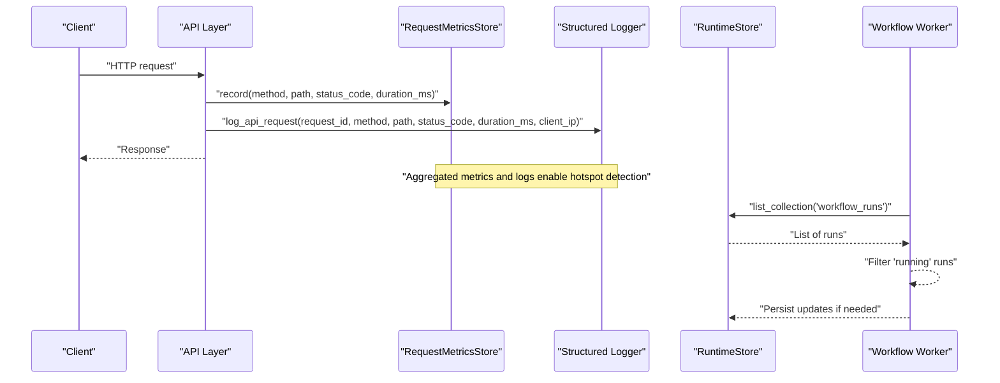
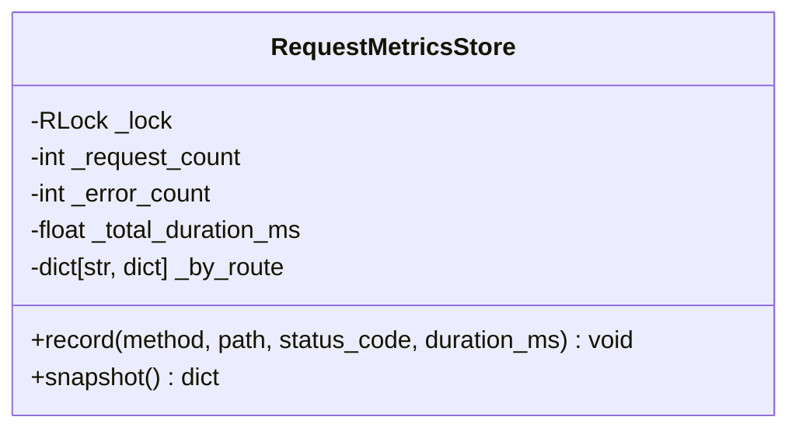
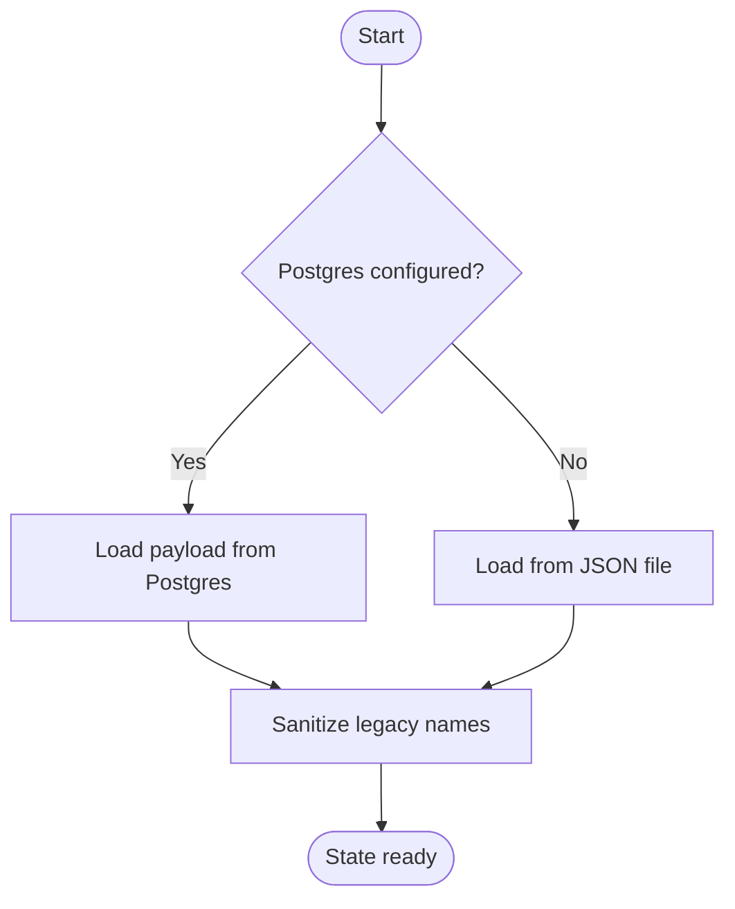
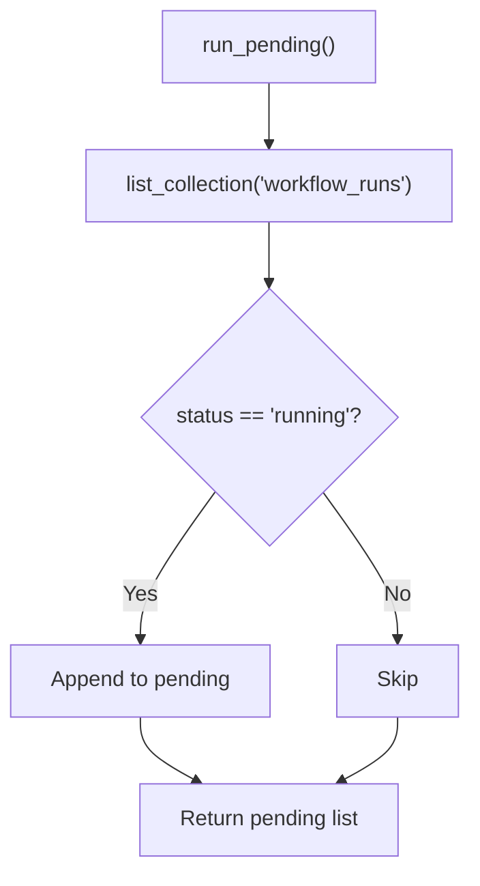
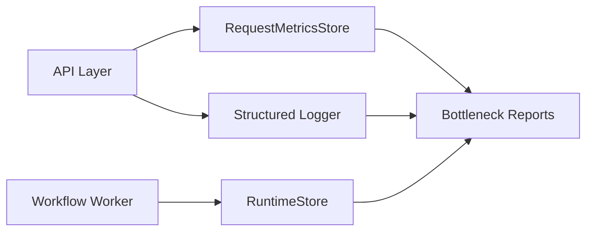

# Bottleneck Analysis

<cite>
**Referenced Files in This Document**
- [metrics.py](file://backend/app/core/metrics.py)
- [logging.py](file://backend/app/core/logging.py)
- [runtime.py](file://backend/app/runtime.py)
- [workflow_worker.py](file://backend/app/workers/workflow_worker.py)
</cite>

## Table of Contents
1. [Introduction](#introduction)
2. [Project Structure](#project-structure)
3. [Core Components](#core-components)
4. [Architecture Overview](#architecture-overview)
5. [Detailed Component Analysis](#detailed-component-analysis)
6. [Dependency Analysis](#dependency-analysis)
7. [Performance Considerations](#performance-considerations)
8. [Troubleshooting Guide](#troubleshooting-guide)
9. [Conclusion](#conclusion)
10. [Appendices](#appendices)

## Introduction
This document explains how to identify bottlenecks and optimize performance using the system’s execution data. It focuses on detecting delays, resource constraints, and process inefficiencies from request-level metrics, structured logs, runtime state, and worker activity. You will learn:
- Which metrics to collect and how they map to bottlenecks
- How to perform root cause analysis with available signals
- How to assess performance impact and prioritize fixes
- What a bottleneck report should include and how to visualize it
- Practical examples of identifying bottlenecks and implementing improvements

## Project Structure
The bottleneck analysis capability is built around four core areas:
- Request-level metrics aggregation for latency and error rates
- Structured API logging for traceability and correlation
- Runtime store that persists workflow runs and process metrics
- Worker utilities to discover long-running or stuck executions

```mermaid
graph TB
subgraph "Observability"
M["RequestMetricsStore<br/>In-memory counters"]
L["Structured API Logger<br/>JSON lines"]
end
subgraph "Runtime"
R["RuntimeStore<br/>Persistent collections"]
end
subgraph "Workers"
W["Workflow Worker<br/>Pending run discovery"]
end
M --> |"snapshot()"|"Reports/Visualization"
L --> |"structured JSON"| "Logs/Analytics"
R --> |"process_metrics, workflow_runs"| "Bottleneck Reports"
W --> |"list_collection('workflow_runs')"| "RuntimeStore"
```

**Diagram sources**
- [metrics.py:7-48](file://backend/app/core/metrics.py#L7-L48)
- [logging.py:11-31](file://backend/app/core/logging.py#L11-L31)
- [runtime.py:258-392](file://backend/app/runtime.py#L258-L392)
- [workflow_worker.py:4-9](file://backend/app/workers/workflow_worker.py#L4-L9)

**Section sources**
- [metrics.py:7-48](file://backend/app/core/metrics.py#L7-L48)
- [logging.py:11-31](file://backend/app/core/logging.py#L11-L31)
- [runtime.py:258-392](file://backend/app/runtime.py#L258-L392)
- [workflow_worker.py:4-9](file://backend/app/workers/workflow_worker.py#L4-L9)

## Core Components
- RequestMetricsStore: Thread-safe aggregator for per-route request counts, errors, and durations; exposes a snapshot for reporting.
- Structured API Logger: Emits JSON log lines with request_id, method, path, status_code, duration_ms, client_ip for correlation and analytics.
- RuntimeStore: Persistent collection store (Postgres-backed when configured, otherwise JSON file). Includes collections such as workflow_runs and process_metrics used by reports.
- Workflow Worker: Enumerates running workflow runs to detect stuck or long-lived jobs.

Key capabilities for bottleneck detection:
- Latency hotspots via average_duration_ms per route
- Error spikes via error_count per route
- Long-running processes via workflow_runs status and timestamps
- Process-level summaries via process_metrics collection

**Section sources**
- [metrics.py:7-48](file://backend/app/core/metrics.py#L7-L48)
- [logging.py:11-31](file://backend/app/core/logging.py#L11-L31)
- [runtime.py:258-392](file://backend/app/runtime.py#L258-L392)
- [workflow_worker.py:4-9](file://backend/app/workers/workflow_worker.py#L4-L9)

## Architecture Overview
The following sequence shows how request telemetry flows into actionable insights for bottleneck identification.



**Diagram sources**
- [metrics.py:15-45](file://backend/app/core/metrics.py#L15-L45)
- [logging.py:11-31](file://backend/app/core/logging.py#L11-L31)
- [runtime.py:385-392](file://backend/app/runtime.py#L385-L392)
- [workflow_worker.py:4-9](file://backend/app/workers/workflow_worker.py#L4-L9)

## Detailed Component Analysis

### RequestMetricsStore
Purpose:
- Aggregate per-route request volume, error counts, and total duration
- Provide a snapshot including average duration per route and overall averages

How it helps identify bottlenecks:
- High average_duration_ms indicates slow endpoints
- Elevated error_count suggests failures or upstream issues
- Disproportionate request_count may indicate traffic concentration

Snapshot fields:
- request_count: total requests
- error_count: total errors (status >= 400)
- average_duration_ms: global average latency
- routes: array of {route, request_count, error_count, average_duration_ms}



**Diagram sources**
- [metrics.py:7-48](file://backend/app/core/metrics.py#L7-L48)

**Section sources**
- [metrics.py:7-48](file://backend/app/core/metrics.py#L7-L48)

### Structured API Logger
Purpose:
- Emit structured JSON logs with key fields for correlation and analysis

Key fields:
- request_id: unique identifier for tracing across components
- method, path: endpoint identity
- status_code: HTTP response code
- duration_ms: request latency
- client_ip: source IP for load distribution analysis

Usage patterns:
- Correlate high-latency requests with downstream dependencies
- Detect error bursts by grouping on status_code and time windows

**Section sources**
- [logging.py:11-31](file://backend/app/core/logging.py#L11-L31)

### RuntimeStore
Purpose:
- Persist collections such as workflow_runs and process_metrics
- Support Postgres backend with JSON fallback

Relevant collections for bottleneck analysis:
- workflow_runs: track lifecycle and timing of workflow executions
- process_metrics: aggregate process-level KPIs

Access pattern:
- Use collection(name) to read/write lists safely under lock



**Diagram sources**
- [runtime.py:258-392](file://backend/app/runtime.py#L258-L392)

**Section sources**
- [runtime.py:258-392](file://backend/app/runtime.py#L258-L392)

### Workflow Worker
Purpose:
- Discover pending or long-running workflow runs to surface stuck processes

Behavior:
- Lists all workflow_runs
- Filters those with status "running"
- Returns list for further processing (e.g., alerting, cleanup)



**Diagram sources**
- [workflow_worker.py:4-9](file://backend/app/workers/workflow_worker.py#L4-L9)

**Section sources**
- [workflow_worker.py:4-9](file://backend/app/workers/workflow_worker.py#L4-L9)

## Dependency Analysis
High-level relationships among components involved in bottleneck detection:



**Diagram sources**
- [metrics.py:15-45](file://backend/app/core/metrics.py#L15-L45)
- [logging.py:11-31](file://backend/app/core/logging.py#L11-L31)
- [runtime.py:385-392](file://backend/app/runtime.py#L385-L392)
- [workflow_worker.py:4-9](file://backend/app/workers/workflow_worker.py#L4-L9)

**Section sources**
- [metrics.py:15-45](file://backend/app/core/metrics.py#L15-L45)
- [logging.py:11-31](file://backend/app/core/logging.py#L11-L31)
- [runtime.py:385-392](file://backend/app/runtime.py#L385-L392)
- [workflow_worker.py:4-9](file://backend/app/workers/workflow_worker.py#L4-L9)

## Performance Considerations
- Lock contention: RequestMetricsStore uses a reentrant lock; ensure record calls are lightweight and batched where possible.
- Snapshot cost: snapshot() iterates and computes averages; call at controlled intervals rather than per-request.
- Log volume: Structured logs can be large; sample or filter noisy endpoints during peak load.
- Runtime persistence: Frequent saves to Postgres or JSON can add overhead; coalesce writes and use background flushes.
- Worker polling: Avoid tight loops when scanning workflow_runs; introduce backoff or event-driven triggers.

[No sources needed since this section provides general guidance]

## Troubleshooting Guide
Common symptoms and diagnostics:
- Slow endpoints:
  - Inspect RequestMetricsStore snapshot for high average_duration_ms per route
  - Correlate with structured logs using request_id to find failing downstream calls
- Spikes in errors:
  - Check error_count in snapshot and group logs by status_code
  - Validate upstream service health and rate limits
- Stuck workflows:
  - Use workflow worker to list “running” runs
  - Examine workflow_runs in RuntimeStore for long-held states and missing completion events
- Storage backends:
  - If Postgres is unavailable, RuntimeStore falls back to JSON; verify file permissions and disk space

Actionable steps:
- Add targeted instrumentation around suspected slow paths
- Implement alerts on thresholds for average_duration_ms and error_count
- Introduce timeouts and retries with circuit breakers for external calls
- Periodically archive old workflow_runs to keep RuntimeStore lean

**Section sources**
- [metrics.py:15-45](file://backend/app/core/metrics.py#L15-L45)
- [logging.py:11-31](file://backend/app/core/logging.py#L11-L31)
- [runtime.py:258-392](file://backend/app/runtime.py#L258-L392)
- [workflow_worker.py:4-9](file://backend/app/workers/workflow_worker.py#L4-L9)

## Conclusion
By combining per-route latency and error metrics, structured request logs, persistent runtime state, and worker-based discovery of long-running jobs, you can systematically identify bottlenecks, determine root causes, and implement targeted optimizations. Prioritize changes based on impact (latency reduction, error mitigation, throughput gains) and validate improvements through repeatable snapshots and log analysis.

[No sources needed since this section summarizes without analyzing specific files]

## Appendices

### Bottleneck Metrics Catalog
- Global:
  - request_count
  - error_count
  - average_duration_ms
- Per-route:
  - route
  - request_count
  - error_count
  - average_duration_ms
- Logs:
  - request_id, method, path, status_code, duration_ms, client_ip
- Runtime:
  - workflow_runs (status, timestamps)
  - process_metrics (aggregate KPIs)

**Section sources**
- [metrics.py:27-45](file://backend/app/core/metrics.py#L27-L45)
- [logging.py:11-31](file://backend/app/core/logging.py#L11-L31)
- [runtime.py:258-392](file://backend/app/runtime.py#L258-L392)

### Bottleneck Report Format
Recommended structure:
- Summary:
  - Time window, environment, overall request_count, error_count, average_duration_ms
- Hotspots:
  - Top N routes by average_duration_ms and error_count
- Process bottlenecks:
  - Longest-running workflow_runs, stuck statuses, top offenders
- Root causes:
  - Observations from logs correlated by request_id
- Impact assessment:
  - Estimated user impact, SLA risk, revenue implications
- Recommendations:
  - Short-term mitigations and long-term improvements

[No sources needed since this section defines a conceptual format]

### Visualization Options
- Dashboards:
  - Line charts for average_duration_ms and error_count over time
  - Bar charts for top slow routes
- Heatmaps:
  - Route x time-of-day to reveal periodic congestion
- Run timelines:
  - Gantt-style view of workflow_runs to spot stuck stages
- Log correlation:
  - Click-through from metrics to request_id-linked logs

[No sources needed since this section provides general guidance]

### Optimization Examples
- Reduce tail latency:
  - Cache frequent reads, paginate heavy queries, parallelize independent steps
- Lower error rates:
  - Add retries with exponential backoff, improve input validation, guard against upstream outages
- Prevent stuck workflows:
  - Enforce timeouts, add watchdogs, auto-retry idempotent steps, alert on stale “running” runs
- Improve throughput:
  - Scale horizontally, tune concurrency, offload heavy tasks to workers

[No sources needed since this section provides general guidance]