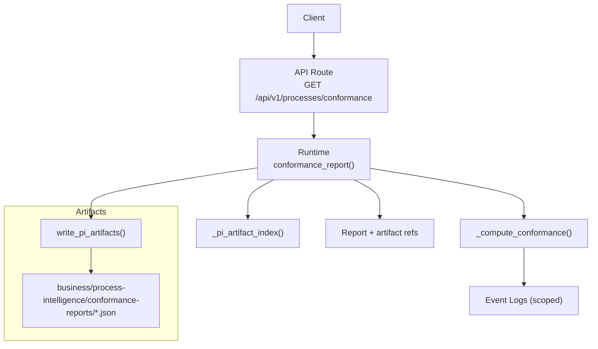
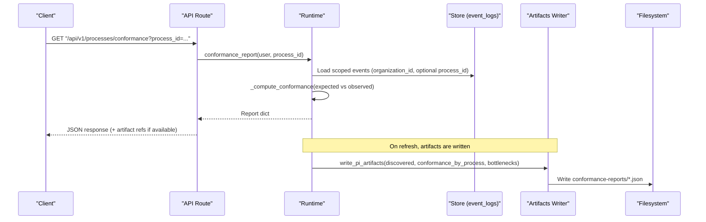
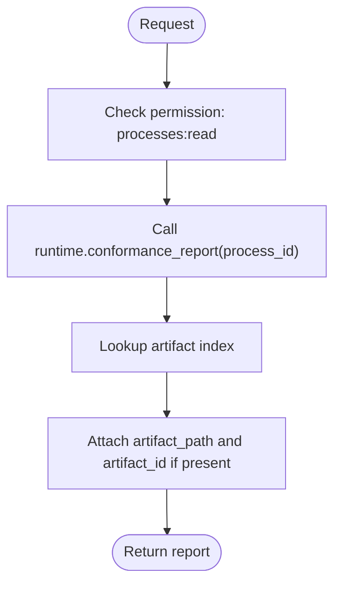
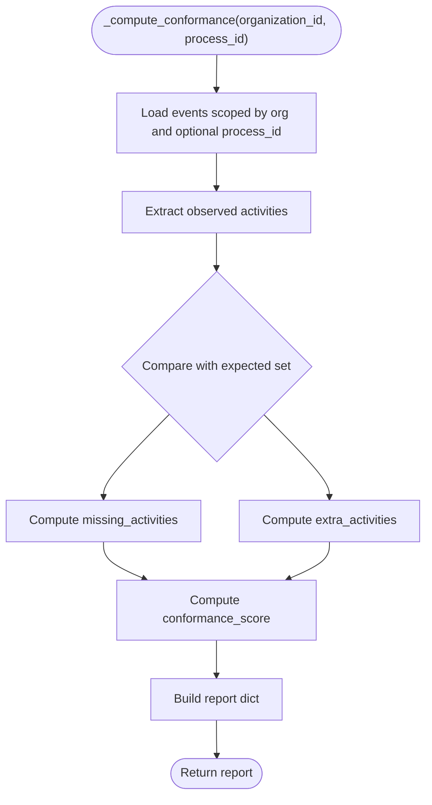
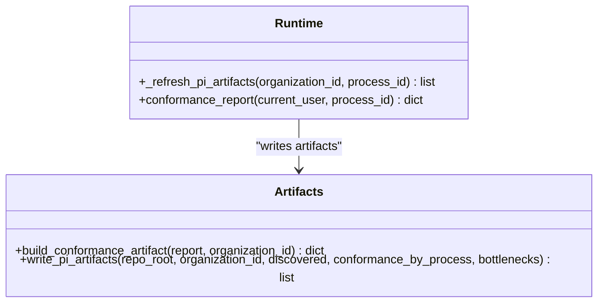
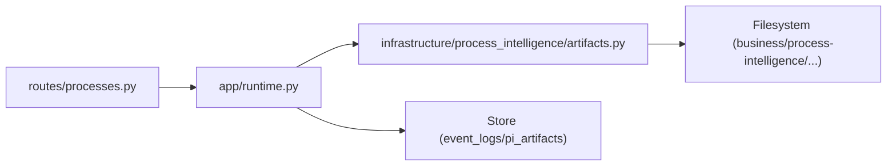

# Conformance Checking

<cite>
**Referenced Files in This Document**
- [runtime.py](file://backend/app/runtime.py)
- [artifacts.py](file://backend/app/infrastructure/process_intelligence/artifacts.py)
- [processes.py](file://backend/app/api/v1/routes/processes.py)
- [README.md](file://business/process-intelligence/conformance-reports/README.md)
- [all.json](file://business/process-intelligence/conformance-reports/all.json)
</cite>

## Table of Contents
1. [Introduction](#introduction)
2. [Project Structure](#project-structure)
3. [Core Components](#core-components)
4. [Architecture Overview](#architecture-overview)
5. [Detailed Component Analysis](#detailed-component-analysis)
6. [Dependency Analysis](#dependency-analysis)
7. [Performance Considerations](#performance-considerations)
8. [Troubleshooting Guide](#troubleshooting-guide)
9. [Conclusion](#conclusion)
10. [Appendices](#appendices)

## Introduction
This document explains how the system performs conformance checking against expected process flows. It covers how actual execution traces are compared to defined process models, compliance metrics, deviation types, severity classification, report structure, violation detection algorithms, and remediation suggestions. It also includes examples for defining expected flows and analyzing conformance results.

## Project Structure
Conformance checking is implemented as part of the Process Intelligence layer:
- API route exposes a conformance endpoint.
- Runtime computes conformance by comparing observed activities from event logs with an expected set.
- Artifacts module writes conformance reports as JSON files under business/process-intelligence/conformance-reports and indexes them for retrieval.

**Diagram sources**
- [processes.py](file://backend/app/api/v1/routes/processes.py)
- [runtime.py](file://backend/app/runtime.py)
- [artifacts.py](file://backend/app/infrastructure/process_intelligence/artifacts.py)

**Section sources**
- [processes.py](file://backend/app/api/v1/routes/processes.py)
- [runtime.py](file://backend/app/runtime.py)
- [artifacts.py](file://backend/app/infrastructure/process_intelligence/artifacts.py)

## Core Components
- API Endpoint: Provides a read-only view of conformance results for a given process or across all processes.
- Runtime Engine: Computes conformance by loading scoped event logs, extracting observed activities, comparing with expected activities, and calculating a conformance score.
- Artifact Writer: Persists conformance reports as JSON artifacts and maintains an index for efficient retrieval.

Key responsibilities:
- Expected model definition: The expected activity set is defined within the runtime computation logic.
- Observed data source: Event logs scoped by organization and optionally by process_id.
- Metrics: Missing and extra activities, conformance score, and event count.
- Output: A structured report enriched with artifact references.

**Section sources**
- [processes.py](file://backend/app/api/v1/routes/processes.py)
- [runtime.py](file://backend/app/runtime.py)
- [artifacts.py](file://backend/app/infrastructure/process_intelligence/artifacts.py)

## Architecture Overview
The conformance pipeline integrates API, runtime computation, and artifact persistence.

**Diagram sources**
- [processes.py](file://backend/app/api/v1/routes/processes.py)
- [runtime.py](file://backend/app/runtime.py)
- [artifacts.py](file://backend/app/infrastructure/process_intelligence/artifacts.py)

## Detailed Component Analysis

### API Endpoint: Conformance Report
- Purpose: Expose conformance results for a specific process or across all processes.
- Behavior:
  - Validates user permissions.
  - Delegates to runtime to compute or retrieve the latest report.
  - Enriches the response with artifact path and id when available.

**Diagram sources**
- [processes.py](file://backend/app/api/v1/routes/processes.py)
- [runtime.py](file://backend/app/runtime.py)

**Section sources**
- [processes.py](file://backend/app/api/v1/routes/processes.py)
- [runtime.py](file://backend/app/runtime.py)

### Runtime: Violation Detection Algorithm
- Inputs:
  - Organization-scoped event logs.
  - Optional process_id filter.
- Processing:
  - Extracts observed activities from events.
  - Compares with a predefined expected activity set.
  - Computes missing and extra activities.
  - Calculates conformance_score = 1 - (missing_count / max(expected_count, 1)).
- Outputs:
  - A report including expected_activities, observed_activities, missing_activities, extra_activities, conformance_score, and event_count.

**Diagram sources**
- [runtime.py](file://backend/app/runtime.py)

**Section sources**
- [runtime.py](file://backend/app/runtime.py)

### Artifact Writer: Report Persistence and Indexing
- Responsibilities:
  - Build standardized artifact records for conformance reports.
  - Persist artifacts under business/process-intelligence/conformance-reports/<process_id>.json.
  - Maintain an index mapping artifact keys and relative paths to entries.
- Key fields added:
  - id, artifact_type, organization_id, updated_at, provenance, artifact_path, relative_path.

**Diagram sources**
- [artifacts.py](file://backend/app/infrastructure/process_intelligence/artifacts.py)
- [runtime.py](file://backend/app/runtime.py)

**Section sources**
- [artifacts.py](file://backend/app/infrastructure/process_intelligence/artifacts.py)
- [runtime.py](file://backend/app/runtime.py)

### Conformance Report Schema
The conformance report contains:
- Identification: id, artifact_type, organization_id, process_id.
- Model comparison: expected_activities, observed_activities, missing_activities, extra_activities.
- Metrics: conformance_score, event_count.
- Metadata: updated_at, provenance (source_refs, captured_by, recorded_at).
- References: artifact_path, artifact_id (when persisted).

Example reference:
- See the “all” conformance report file for a complete example of the schema and values.

**Section sources**
- [all.json](file://business/process-intelligence/conformance-reports/all.json)
- [artifacts.py](file://backend/app/infrastructure/process_intelligence/artifacts.py)

## Dependency Analysis
High-level dependencies:
- API depends on Runtime for business logic.
- Runtime depends on Store for event logs and on Artifacts for persistence.
- Artifacts depend on filesystem operations to write JSON artifacts.

**Diagram sources**
- [processes.py](file://backend/app/api/v1/routes/processes.py)
- [runtime.py](file://backend/app/runtime.py)
- [artifacts.py](file://backend/app/infrastructure/process_intelligence/artifacts.py)

**Section sources**
- [processes.py](file://backend/app/api/v1/routes/processes.py)
- [runtime.py](file://backend/app/runtime.py)
- [artifacts.py](file://backend/app/infrastructure/process_intelligence/artifacts.py)

## Performance Considerations
- Filtering at load time: Events are filtered by organization and optionally by process_id before processing to reduce dataset size.
- Set-based comparisons: Observed and expected activities are represented as sets to efficiently compute missing and extra activities.
- Scoring formula: Simple arithmetic avoids heavy computation; ensure expected set remains bounded.
- Artifact indexing: An in-memory index maps artifact keys and relative paths to avoid repeated scans.

[No sources needed since this section provides general guidance]

## Troubleshooting Guide
Common issues and resolutions:
- Zero conformance score: Indicates that none of the expected activities were observed. Verify that event logs contain correctly labeled activities matching the expected set.
- Large number of extra activities: Suggests noise or mislabeled activities. Consider refining activity normalization or expanding the expected model if legitimate.
- Missing artifact references: If artifact_path or artifact_id are absent, ensure the PI artifacts refresh has run and artifacts have been written.

Operational checks:
- Confirm the conformance endpoint returns a valid report structure.
- Validate that conformance-reports/*.json files exist and are up-to-date.
- Review provenance metadata to trace data sources and capture timestamps.

**Section sources**
- [all.json](file://business/process-intelligence/conformance-reports/all.json)
- [README.md](file://business/process-intelligence/conformance-reports/README.md)

## Conclusion
The conformance checking feature compares observed process activities against a defined expected model, quantifies deviations via missing and extra activities, and produces a standardized report with a clear conformance score. Reports are persisted as artifacts and indexed for easy retrieval. To improve compliance, align event labeling with the expected model, refine the expected set as processes evolve, and use the report’s provenance and artifact references to guide remediation.

[No sources needed since this section summarizes without analyzing specific files]

## Appendices

### Defining Expected Flows
- Expected activities are defined within the conformance computation logic. Update the expected set to reflect current SOPs and governance requirements.
- Ensure event logs consistently label activities using the same identifiers as the expected set.

**Section sources**
- [runtime.py](file://backend/app/runtime.py)

### Analyzing Conformance Results
- Inspect missing_activities to identify steps not executed.
- Inspect extra_activities to detect unmodeled behavior.
- Use conformance_score to track overall adherence trends over time.
- Leverage artifact_path and artifact_id to locate detailed reports and historical versions.

**Section sources**
- [all.json](file://business/process-intelligence/conformance-reports/all.json)
- [artifacts.py](file://backend/app/infrastructure/process_intelligence/artifacts.py)

### Remediation Suggestions
- For missing activities: Investigate why required steps were skipped and enforce controls or training.
- For extra activities: Determine if these represent legitimate variations; if so, update the expected model accordingly.
- For low conformance scores: Prioritize high-impact missing activities and monitor improvements after corrective actions.

[No sources needed since this section provides general guidance]