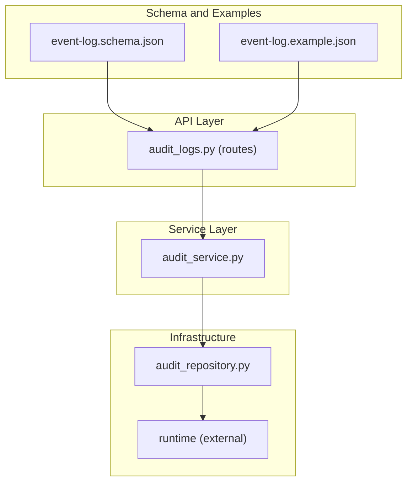
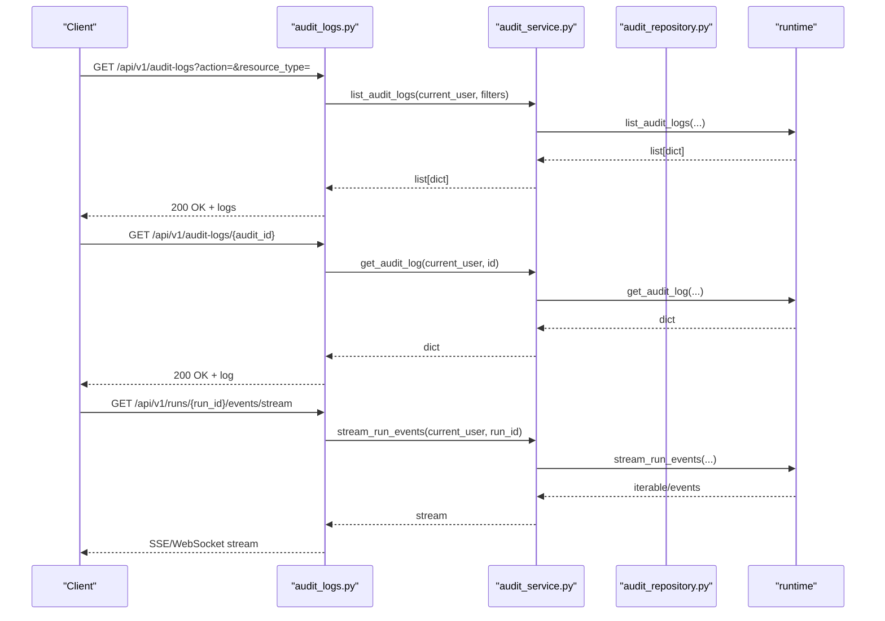
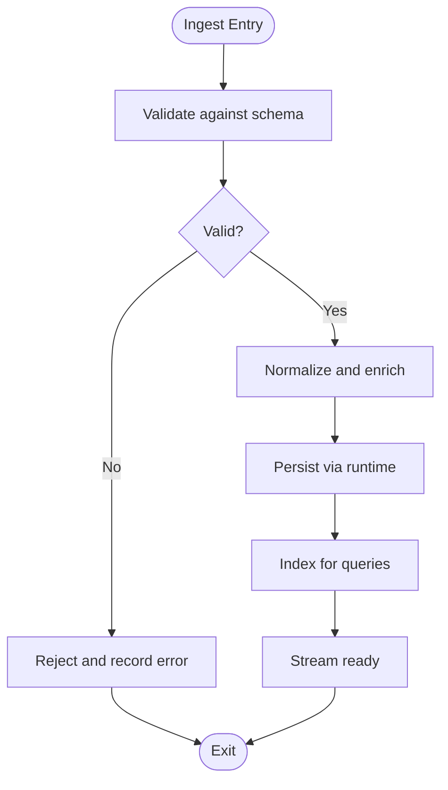
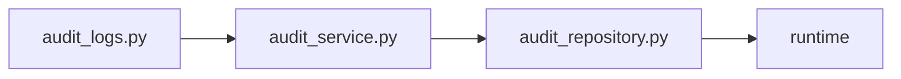

# Event Log Ingestion

<cite>
**Referenced Files in This Document**
- [event-log.schema.json](file://business/schemas/event-log.schema.json)
- [event-log.example.json](file://business/examples/event-log.example.json)
- [audit_logs.py](file://backend/app/api/v1/routes/audit_logs.py)
- [audit_service.py](file://backend/app/services/audit_service.py)
- [audit_repository.py](file://backend/app/infrastructure/repositories/audit_repository.py)
</cite>

## Table of Contents
1. [Introduction](#introduction)
2. [Project Structure](#project-structure)
3. [Core Components](#core-components)
4. [Architecture Overview](#architecture-overview)
5. [Detailed Component Analysis](#detailed-component-analysis)
6. [Dependency Analysis](#dependency-analysis)
7. [Performance Considerations](#performance-considerations)
8. [Troubleshooting Guide](#troubleshooting-guide)
9. [Conclusion](#conclusion)
10. [Appendices](#appendices)

## Introduction
This document explains the event log ingestion capabilities for structured events originating from workflow runs, API calls, and external systems. It covers the event schema, validation rules, transformation pipeline, batch and real-time streaming approaches, error handling strategies, ingestion APIs, and configuration options. The goal is to provide a clear, end-to-end understanding of how events are validated, transformed, ingested, and made available for querying and streaming.

## Project Structure
Event log ingestion spans three primary areas:
- Schema and examples: Define the canonical event structure and sample payloads.
- API layer: Expose endpoints for listing and retrieving audit logs and streaming run events.
- Service and repository layers: Orchestrate access to runtime facilities and data stores.

**Diagram sources**
- [event-log.schema.json:1-156](file://business/schemas/event-log.schema.json#L1-L156)
- [event-log.example.json:1-40](file://business/examples/event-log.example.json#L1-L40)
- [audit_logs.py:1-24](file://backend/app/api/v1/routes/audit_logs.py#L1-L24)
- [audit_service.py:1-14](file://backend/app/services/audit_service.py#L1-L14)
- [audit_repository.py:1-6](file://backend/app/infrastructure/repositories/audit_repository.py#L1-L6)

**Section sources**
- [event-log.schema.json:1-156](file://business/schemas/event-log.schema.json#L1-L156)
- [event-log.example.json:1-40](file://business/examples/event-log.example.json#L1-L40)
- [audit_logs.py:1-24](file://backend/app/api/v1/routes/audit_logs.py#L1-L24)
- [audit_service.py:1-14](file://backend/app/services/audit_service.py#L1-L14)
- [audit_repository.py:1-6](file://backend/app/infrastructure/repositories/audit_repository.py#L1-L6)

## Core Components
- Event schema: A JSON Schema defines required fields, types, constraints, and nested objects for outcome and provenance.
- Example payload: Demonstrates a complete, valid event instance aligned with the schema.
- Audit logs API: Provides read access to audit logs and supports filtering by action and resource type.
- Streaming endpoint: Offers a method to stream events for a specific run.
- Repository abstraction: Delegates collection operations to the runtime environment.

Key responsibilities:
- Validation: Enforce schema constraints before persistence or processing.
- Transformation: Normalize incoming events into the canonical schema.
- Ingestion: Persist or forward events via runtime facilities.
- Querying: List and retrieve audit logs with optional filters.
- Streaming: Provide real-time event delivery per run.

**Section sources**
- [event-log.schema.json:1-156](file://business/schemas/event-log.schema.json#L1-L156)
- [event-log.example.json:1-40](file://business/examples/event-log.example.json#L1-L40)
- [audit_logs.py:1-24](file://backend/app/api/v1/routes/audit_logs.py#L1-L24)
- [audit_service.py:1-14](file://backend/app/services/audit_service.py#L1-L14)
- [audit_repository.py:1-6](file://backend/app/infrastructure/repositories/audit_repository.py#L1-L6)

## Architecture Overview
The ingestion architecture separates concerns across schema definition, API exposure, service orchestration, and infrastructure delegation.

**Diagram sources**
- [audit_logs.py:1-24](file://backend/app/api/v1/routes/audit_logs.py#L1-L24)
- [audit_service.py:1-14](file://backend/app/services/audit_service.py#L1-L14)
- [audit_repository.py:1-6](file://backend/app/infrastructure/repositories/audit_repository.py#L1-L6)

## Detailed Component Analysis

### Event Schema and Validation Rules
The canonical event schema enforces:
- Required top-level identifiers and timestamps.
- Actor metadata (type and identifier).
- Process and case correlation identifiers.
- Activity description and tool usage arrays.
- Decision context flags and summaries.
- Confidence and risk tier constraints.
- Outcome object with status, latency, and quality score.
- Provenance object with source references, capture agent, and recording timestamp.

Validation rules include:
- Non-empty strings for core identifiers.
- ISO date-time formats for timestamps.
- Enumerated values for actor_type and risk_tier.
- Numeric ranges for confidence and quality_score.
- Minimum item counts for array fields.

Transformation guidance:
- Normalize timestamps to UTC ISO 8601.
- Map external actor IDs to canonical actor_id.
- Ensure input_refs/output_refs point to stable identifiers.
- Populate provenance with capture source and recorded_at.

Example payload:
- See example file for a fully formed event that satisfies all schema requirements.

**Section sources**
- [event-log.schema.json:1-156](file://business/schemas/event-log.schema.json#L1-L156)
- [event-log.example.json:1-40](file://business/examples/event-log.example.json#L1-L40)

### Ingestion API Endpoints
Available endpoints:
- List audit logs with optional filters:
  - Method: GET
  - Path: /api/v1/audit-logs
  - Query parameters: action, resource_type
  - Authentication: Required
  - Authorization: Requires audit:read permission
  - Response: Array of audit log entries

- Retrieve a single audit log:
  - Method: GET
  - Path: /api/v1/audit-logs/{audit_id}
  - Authentication: Required
  - Authorization: Requires audit:read permission
  - Response: Single audit log entry

Streaming:
- Stream run events:
  - Method: GET
  - Path: /api/v1/runs/{run_id}/events/stream
  - Authentication: Required
  - Authorization: Depends on runtime policy
  - Response: Real-time event stream (SSE/WebSocket)

Notes:
- All routes enforce authentication and authorization checks through the runtime.
- Filtering is supported at the route level for listing.

**Section sources**
- [audit_logs.py:1-24](file://backend/app/api/v1/routes/audit_logs.py#L1-L24)
- [audit_service.py:1-14](file://backend/app/services/audit_service.py#L1-L14)

### Service and Repository Orchestration
Service layer:
- Delegates to runtime for listing, retrieval, and streaming operations.
- Maintains clean separation between HTTP handlers and data access.

Repository layer:
- Abstracts collection operations via runtime.list_collection("audit_logs").
- Enables swapping underlying storage without changing higher layers.

Runtime integration:
- Centralizes permissions, persistence, and streaming backends.
- Provides consistent interfaces for domain services.

**Section sources**
- [audit_service.py:1-14](file://backend/app/services/audit_service.py#L1-L14)
- [audit_repository.py:1-6](file://backend/app/infrastructure/repositories/audit_repository.py#L1-L6)

### Processing Logic and Pipeline
End-to-end flow for ingestion and consumption:
- Receive event (batch or stream).
- Validate against schema.
- Transform to canonical form.
- Persist via runtime.
- Make available via query and streaming APIs.

[No sources needed since this diagram shows conceptual workflow, not actual code structure]

## Dependency Analysis
High-level dependencies among components:
- Routes depend on services for business logic.
- Services depend on runtime for cross-cutting concerns (auth, persistence, streaming).
- Repository depends on runtime for collection operations.

**Diagram sources**
- [audit_logs.py:1-24](file://backend/app/api/v1/routes/audit_logs.py#L1-L24)
- [audit_service.py:1-14](file://backend/app/services/audit_service.py#L1-L14)
- [audit_repository.py:1-6](file://backend/app/infrastructure/repositories/audit_repository.py#L1-L6)

**Section sources**
- [audit_logs.py:1-24](file://backend/app/api/v1/routes/audit_logs.py#L1-L24)
- [audit_service.py:1-14](file://backend/app/services/audit_service.py#L1-L14)
- [audit_repository.py:1-6](file://backend/app/infrastructure/repositories/audit_repository.py#L1-L6)

## Performance Considerations
- Batch ingestion:
  - Prefer batching multiple events per request to reduce overhead.
  - Use idempotency keys to handle retries safely.
- Real-time streaming:
  - Backpressure-aware consumers to avoid memory spikes.
  - Partition streams by run_id for scalability.
- Indexing:
  - Index frequently filtered fields (process_id, case_id, activity).
- Caching:
  - Cache hot queries behind short TTLs where appropriate.
- Rate limiting:
  - Apply rate limits at the API boundary to protect downstream systems.

[No sources needed since this section provides general guidance]

## Troubleshooting Guide
Common issues and resolutions:
- Validation failures:
  - Check required fields and enum values.
  - Verify date-time formats and numeric ranges.
- Permission errors:
  - Ensure caller has audit:read for listing and detail endpoints.
- Missing events:
  - Confirm provenance.recorded_at and timestamp are set.
  - Verify upstream producers emit canonical actor_id and process_id.
- Streaming gaps:
  - Inspect consumer lag and reconnect policies.
  - Validate run_id scoping and backend connectivity.

Operational tips:
- Log rejected events with validation diagnostics.
- Track ingestion latency and throughput metrics.
- Monitor error rates per source and per step in the pipeline.

**Section sources**
- [audit_logs.py:1-24](file://backend/app/api/v1/routes/audit_logs.py#L1-L24)
- [audit_service.py:1-14](file://backend/app/services/audit_service.py#L1-L14)
- [audit_repository.py:1-6](file://backend/app/infrastructure/repositories/audit_repository.py#L1-L6)

## Conclusion
The event log ingestion system centers on a strict schema, robust validation, and a layered architecture that cleanly separates API, service, and infrastructure concerns. With support for both batch and real-time ingestion, along with secure querying and streaming, it provides a solid foundation for observability and process intelligence. Extending ingestion sources requires adherence to the canonical schema and leveraging the existing API and runtime integrations.

[No sources needed since this section summarizes without analyzing specific files]

## Appendices

### Event Schema Reference
- Top-level identifiers: id, timestamp, actor_type, actor_id, process_id, case_id, activity.
- Arrays: input_refs, output_refs, tools_used.
- Decision metadata: decision_point, decision_reason_summary, confidence, risk_tier, human_approved.
- Outcome: status, latency_minutes, quality_score.
- Provenance: source_refs, captured_by, recorded_at.

Constraints:
- Strings must be non-empty where specified.
- Timestamps must be valid ISO 8601 date-time.
- Enums restrict actor_type and risk_tier.
- Numbers bounded within defined ranges.

**Section sources**
- [event-log.schema.json:1-156](file://business/schemas/event-log.schema.json#L1-L156)

### Example Payload
- A complete, valid event demonstrating all fields and constraints.

**Section sources**
- [event-log.example.json:1-40](file://business/examples/event-log.example.json#L1-L40)

### Ingestion APIs Summary
- GET /api/v1/audit-logs
  - Filters: action, resource_type
  - Auth: Required
  - Perm: audit:read
  - Response: Array of logs

- GET /api/v1/audit-logs/{audit_id}
  - Auth: Required
  - Perm: audit:read
  - Response: Single log

- GET /api/v1/runs/{run_id}/events/stream
  - Auth: Required
  - Response: Real-time stream

**Section sources**
- [audit_logs.py:1-24](file://backend/app/api/v1/routes/audit_logs.py#L1-L24)
- [audit_service.py:1-14](file://backend/app/services/audit_service.py#L1-L14)