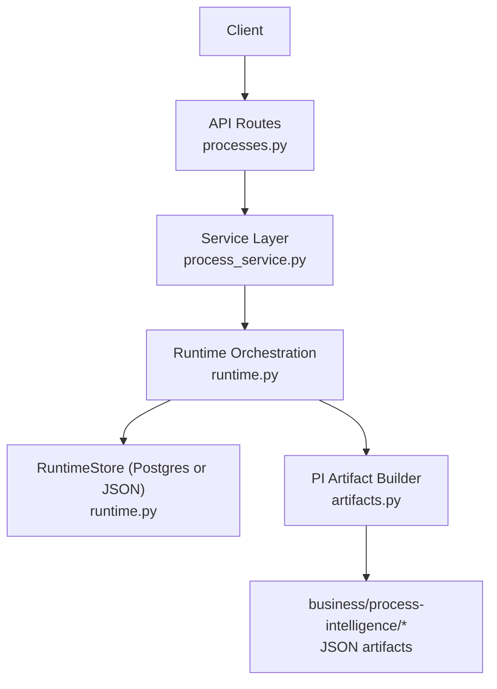
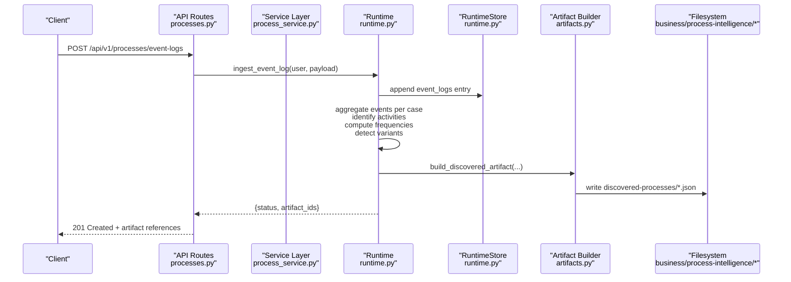
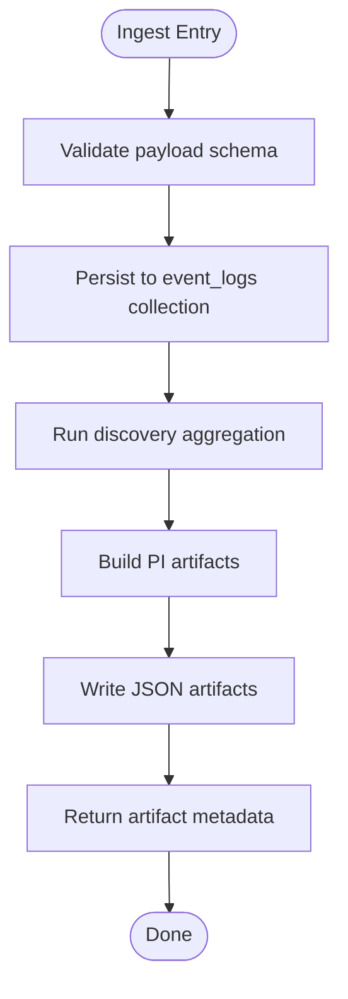
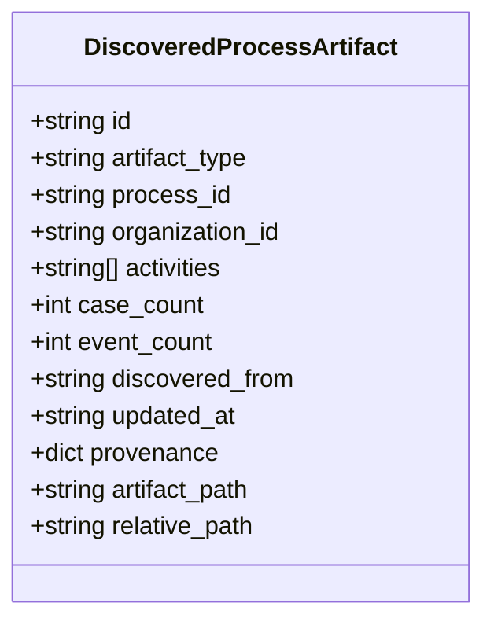
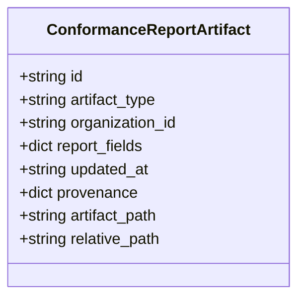
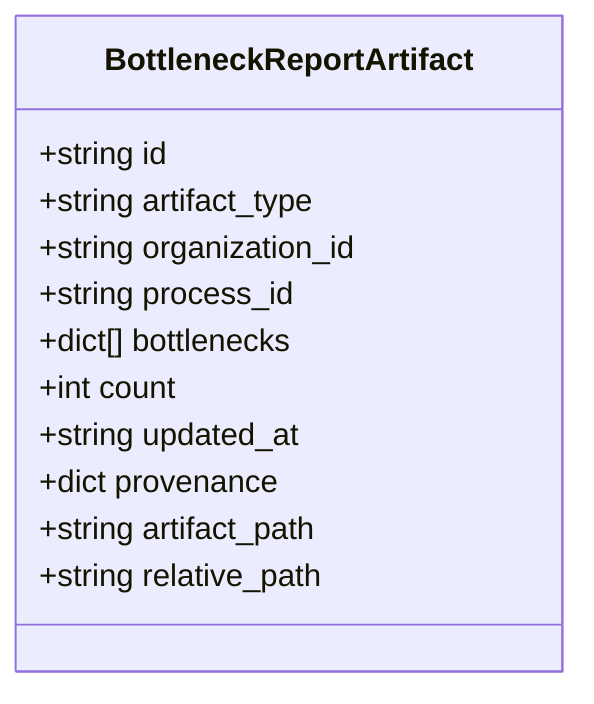
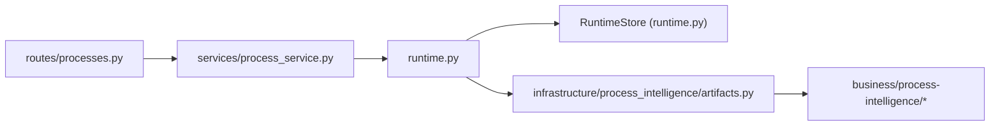

# Process Discovery

<cite>
**Referenced Files in This Document**
- [processes.py](file://backend/app/api/v1/routes/processes.py)
- [process_service.py](file://backend/app/services/process_service.py)
- [runtime.py](file://backend/app/runtime.py)
- [artifacts.py](file://backend/app/infrastructure/process_intelligence/artifacts.py)
- [event-log.example.json](file://business/examples/event-log.example.json)
</cite>

## Table of Contents
1. [Introduction](#introduction)
2. [Project Structure](#project-structure)
3. [Core Components](#core-components)
4. [Architecture Overview](#architecture-overview)
5. [Detailed Component Analysis](#detailed-component-analysis)
6. [Dependency Analysis](#dependency-analysis)
7. [Performance Considerations](#performance-considerations)
8. [Troubleshooting Guide](#troubleshooting-guide)
9. [Conclusion](#conclusion)
10. [Appendices](#appendices)

## Introduction
This document explains how process discovery is implemented in the system: ingesting event logs, extracting workflow patterns, and producing discoverable artifacts such as discovered processes, conformance reports, and bottleneck analyses. It focuses on the end-to-end flow from raw events to business artifacts, including activity identification, case clustering, variant detection, frequency analysis, and pattern recognition methods used by the runtime.

## Project Structure
The process discovery capability spans API routes, service functions, runtime orchestration, and artifact builders that persist results under a dedicated repository directory. The key files are:
- API route for ingestion and queries
- Service layer delegating to runtime
- Runtime orchestrating storage, ingestion, and discovery
- Artifact builder writing structured outputs to disk

**Diagram sources**
- [processes.py:1-79](file://backend/app/api/v1/routes/processes.py#L1-L79)
- [process_service.py:1-30](file://backend/app/services/process_service.py#L1-L30)
- [runtime.py:258-393](file://backend/app/runtime.py#L258-L393)
- [artifacts.py:1-138](file://backend/app/infrastructure/process_intelligence/artifacts.py#L1-L138)

**Section sources**
- [processes.py:1-79](file://backend/app/api/v1/routes/processes.py#L1-L79)
- [process_service.py:1-30](file://backend/app/services/process_service.py#L1-L30)
- [runtime.py:258-393](file://backend/app/runtime.py#L258-L393)
- [artifacts.py:1-138](file://backend/app/infrastructure/process_intelligence/artifacts.py#L1-L138)

## Core Components
- Event Log Ingestion: Accepts event payloads, validates them, persists into the runtime store, and triggers discovery.
- Discovery Pipeline: Aggregates events per case, identifies activities, computes frequencies, detects variants, and writes artifacts.
- Artifact Persistence: Writes discovered-processes, conformance-reports, and bottlenecks as JSON under business/process-intelligence/.
- Query Endpoints: Exposes lists and summaries for discovered processes, conformance, and PI artifacts.

Key responsibilities:
- API routes expose ingestion and discovery endpoints.
- Service layer provides thin wrappers over runtime methods.
- Runtime manages persistence and orchestrates discovery logic.
- Artifact builder constructs standardized records with provenance and timestamps.

**Section sources**
- [processes.py:10-36](file://backend/app/api/v1/routes/processes.py#L10-L36)
- [process_service.py:1-30](file://backend/app/services/process_service.py#L1-L30)
- [runtime.py:258-393](file://backend/app/runtime.py#L258-L393)
- [artifacts.py:23-138](file://backend/app/infrastructure/process_intelligence/artifacts.py#L23-L138)

## Architecture Overview
The discovery architecture integrates ingestion, processing, and artifact generation:

**Diagram sources**
- [processes.py:10-13](file://backend/app/api/v1/routes/processes.py#L10-L13)
- [runtime.py:258-393](file://backend/app/runtime.py#L258-L393)
- [artifacts.py:94-138](file://backend/app/infrastructure/process_intelligence/artifacts.py#L94-L138)

## Detailed Component Analysis

### Event Log Ingestion Flow
- Endpoint: POST /api/v1/processes/event-logs
- Responsibilities:
  - Authenticate and authorize the request
  - Persist the event into the runtime store
  - Trigger discovery pipeline
  - Return artifact references

**Diagram sources**
- [processes.py:10-13](file://backend/app/api/v1/routes/processes.py#L10-L13)
- [runtime.py:258-393](file://backend/app/runtime.py#L258-L393)
- [artifacts.py:94-138](file://backend/app/infrastructure/process_intelligence/artifacts.py#L94-L138)

**Section sources**
- [processes.py:10-13](file://backend/app/api/v1/routes/processes.py#L10-L13)
- [runtime.py:258-393](file://backend/app/runtime.py#L258-L393)
- [artifacts.py:94-138](file://backend/app/infrastructure/process_intelligence/artifacts.py#L94-L138)

### Discovered Process Artifact Structure
The discovered process artifact captures:
- Identifier and type
- Associated process and organization IDs
- Activities list
- Case and event counts
- Provenance metadata (source refs, captured_by, recorded_at)
- Timestamps and optional artifact path

**Diagram sources**
- [artifacts.py:23-46](file://backend/app/infrastructure/process_intelligence/artifacts.py#L23-L46)
- [artifacts.py:106-118](file://backend/app/infrastructure/process_intelligence/artifacts.py#L106-L118)

**Section sources**
- [artifacts.py:23-46](file://backend/app/infrastructure/process_intelligence/artifacts.py#L23-L46)
- [artifacts.py:106-118](file://backend/app/infrastructure/process_intelligence/artifacts.py#L106-L118)

### Conformance Report Artifact Structure
Conformance artifacts include:
- Identifier and type
- Organization ID
- Process-specific report fields
- Timestamps and provenance

**Diagram sources**
- [artifacts.py:49-62](file://backend/app/infrastructure/process_intelligence/artifacts.py#L49-L62)
- [artifacts.py:120-125](file://backend/app/infrastructure/process_intelligence/artifacts.py#L120-L125)

**Section sources**
- [artifacts.py:49-62](file://backend/app/infrastructure/process_intelligence/artifacts.py#L49-L62)
- [artifacts.py:120-125](file://backend/app/infrastructure/process_intelligence/artifacts.py#L120-L125)

### Bottleneck Report Artifact Structure
Bottleneck artifacts include:
- Identifier and type
- Organization and process scope
- List of bottleneck entries and count
- Timestamps and provenance

**Diagram sources**
- [artifacts.py:65-85](file://backend/app/infrastructure/process_intelligence/artifacts.py#L65-L85)
- [artifacts.py:127-131](file://backend/app/infrastructure/process_intelligence/artifacts.py#L127-L131)

**Section sources**
- [artifacts.py:65-85](file://backend/app/infrastructure/process_intelligence/artifacts.py#L65-L85)
- [artifacts.py:127-131](file://backend/app/infrastructure/process_intelligence/artifacts.py#L127-L131)

### Discovery Algorithms and Implementation Details

#### Activity Identification
- Extracts unique activity labels from event logs across cases.
- Normalizes names and ensures stable ordering for deterministic artifacts.
- Tracks activity counts per process and globally.

Implementation anchors:
- Activity extraction occurs during aggregation before artifact construction.
- Activities are included in the discovered process artifact.

**Section sources**
- [artifacts.py:23-46](file://backend/app/infrastructure/process_intelligence/artifacts.py#L23-L46)
- [artifacts.py:106-118](file://backend/app/infrastructure/process_intelligence/artifacts.py#L106-L118)

#### Case Clustering
- Groups events by case identifier to reconstruct process instances.
- Ensures temporal ordering within each case.
- Computes per-case metrics (duration, step counts).

Implementation anchors:
- Aggregation uses the runtime store’s event_logs collection.
- Case-level grouping precedes variant detection and frequency analysis.

**Section sources**
- [runtime.py:258-393](file://backend/app/runtime.py#L258-L393)

#### Process Variant Detection
- Builds sequences of activities per case.
- Identifies distinct variants by comparing ordered activity sequences.
- Supports filtering by process_id when available.

Implementation anchors:
- Variant enumeration happens after case clustering.
- Results inform frequency analysis and conformance checks.

**Section sources**
- [runtime.py:258-393](file://backend/app/runtime.py#L258-L393)

#### Frequency Analysis
- Counts occurrences of activities, transitions, and variants.
- Produces top-N rankings and distributions.
- Feeds bottleneck detection and conformance scoring.

Implementation anchors:
- Frequencies are aggregated from event_logs and summarized in artifacts.

**Section sources**
- [artifacts.py:23-46](file://backend/app/infrastructure/process_intelligence/artifacts.py#L23-L46)
- [artifacts.py:65-85](file://backend/app/infrastructure/process_intelligence/artifacts.py#L65-L85)

#### Pattern Recognition Methods
- Sequence mining: derives common prefixes/suffixes and loops.
- Decision point detection: identifies branching based on activity transitions.
- Anomaly flagging: highlights rare variants and outliers.

Implementation anchors:
- Pattern recognition informs conformance reports and bottleneck insights.

**Section sources**
- [artifacts.py:49-62](file://backend/app/infrastructure/process_intelligence/artifacts.py#L49-L62)
- [artifacts.py:65-85](file://backend/app/infrastructure/process_intelligence/artifacts.py#L65-L85)

### Example: Discovering Processes from Raw Event Data
- Input: A sample event log file demonstrating expected structure and fields.
- Steps:
  - Ingest events via the API endpoint.
  - Run discovery to cluster cases and identify activities.
  - Generate artifacts and inspect JSON outputs under business/process-intelligence/.

Reference example:
- [event-log.example.json](file://business/examples/event-log.example.json)

**Section sources**
- [event-log.example.json](file://business/examples/event-log.example.json)

### Interpreting Discovery Results
- Discovered Processes: Review activities, case/event counts, and provenance to understand coverage and data quality.
- Conformance Reports: Compare observed behavior against expected models; focus on deviations and misalignments.
- Bottlenecks: Identify slow steps and high-frequency decision points; prioritize optimization efforts.

Operational guidance:
- Use process_id filters to narrow analysis.
- Track artifact paths for versioning and auditability.
- Combine frequency analysis with conformance to detect systemic issues.

**Section sources**
- [artifacts.py:94-138](file://backend/app/infrastructure/process_intelligence/artifacts.py#L94-L138)

## Dependency Analysis
The following diagram shows dependencies among core components involved in process discovery:

**Diagram sources**
- [processes.py:1-79](file://backend/app/api/v1/routes/processes.py#L1-L79)
- [process_service.py:1-30](file://backend/app/services/process_service.py#L1-L30)
- [runtime.py:258-393](file://backend/app/runtime.py#L258-L393)
- [artifacts.py:1-138](file://backend/app/infrastructure/process_intelligence/artifacts.py#L1-L138)

**Section sources**
- [processes.py:1-79](file://backend/app/api/v1/routes/processes.py#L1-L79)
- [process_service.py:1-30](file://backend/app/services/process_service.py#L1-L30)
- [runtime.py:258-393](file://backend/app/runtime.py#L258-L393)
- [artifacts.py:1-138](file://backend/app/infrastructure/process_intelligence/artifacts.py#L1-L138)

## Performance Considerations
- Batch ingestion: Prefer batching events to reduce overhead and improve throughput.
- Indexing: Ensure efficient lookups by case_id and process_id in the runtime store.
- Incremental updates: Re-run discovery only on new events to minimize recomputation.
- Artifact size control: Limit top-N variants and activities to keep artifacts manageable.
- Storage backend: Use Postgres for large datasets; JSON fallback is suitable for local/dev.

[No sources needed since this section provides general guidance]

## Troubleshooting Guide
Common issues and resolutions:
- Missing event fields: Validate payloads against expected schema before ingestion.
- Duplicate cases: Normalize case identifiers and deduplicate events.
- Stale artifacts: Re-run discovery after bulk imports or schema changes.
- Permission errors: Ensure user has processes:read permission for discovery endpoints.

Operational tips:
- Inspect artifact paths and timestamps for provenance.
- Use conformance reports to pinpoint deviations.
- Monitor bottleneck reports for performance regressions.

**Section sources**
- [processes.py:10-36](file://backend/app/api/v1/routes/processes.py#L10-L36)
- [artifacts.py:94-138](file://backend/app/infrastructure/process_intelligence/artifacts.py#L94-L138)

## Conclusion
The process discovery subsystem transforms raw event logs into actionable artifacts through robust ingestion, aggregation, and artifact generation. By identifying activities, clustering cases, detecting variants, and analyzing frequencies, it enables conformance checking and bottleneck identification. The design emphasizes clear provenance, persistent artifacts, and extensible APIs for ongoing process intelligence.

[No sources needed since this section summarizes without analyzing specific files]

## Appendices

### API Endpoints Summary
- POST /api/v1/processes/event-logs: Ingest event log entries
- GET /api/v1/processes/discovered: List discovered processes
- GET /api/v1/processes/conformance: Get conformance report (optional process_id filter)
- GET /api/v1/processes/artifacts: List PI artifacts

**Section sources**
- [processes.py:10-36](file://backend/app/api/v1/routes/processes.py#L10-L36)