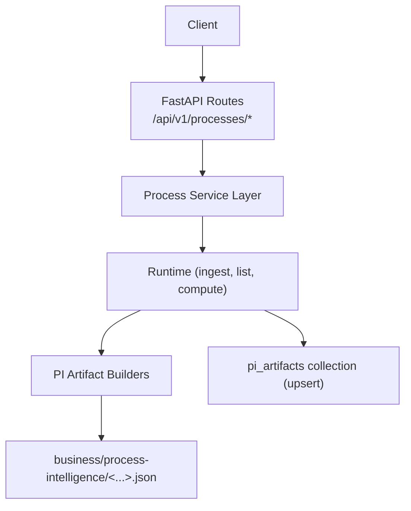
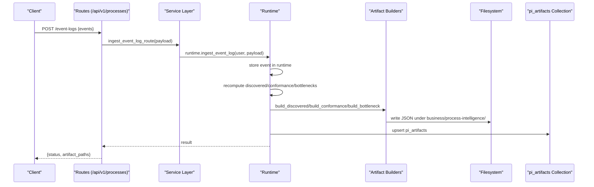
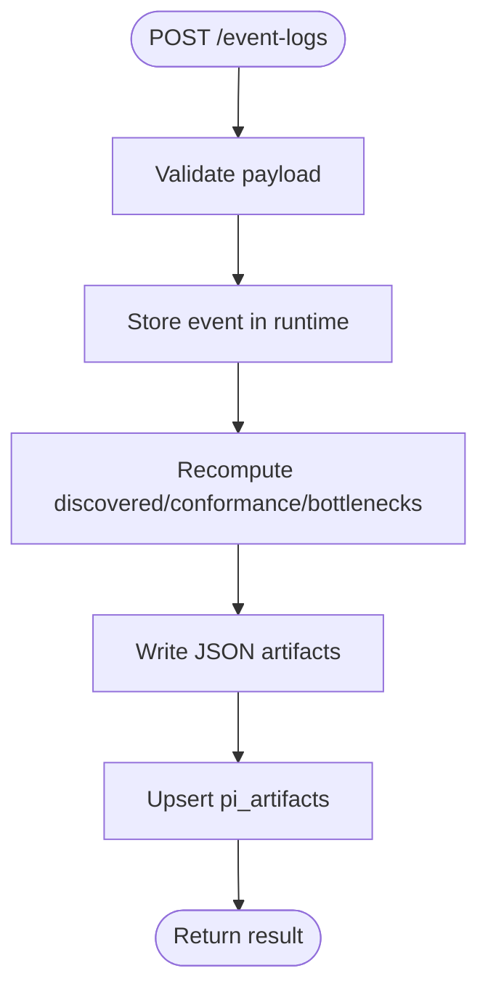
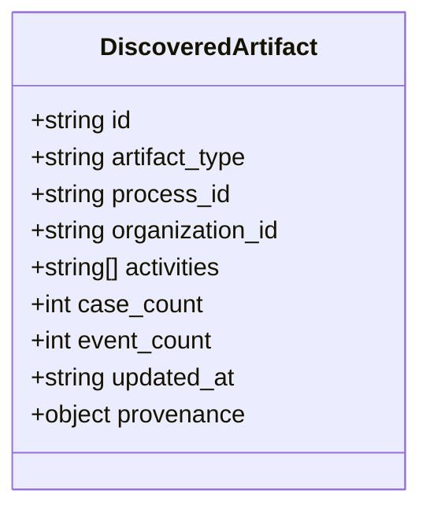
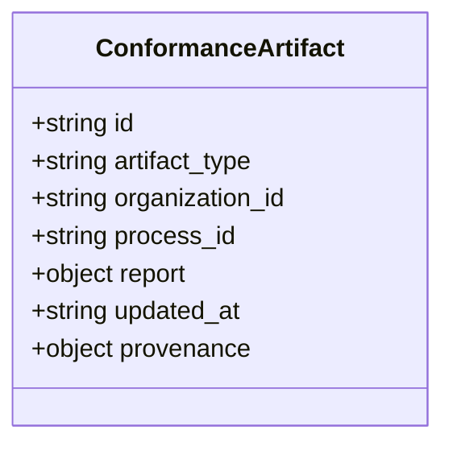
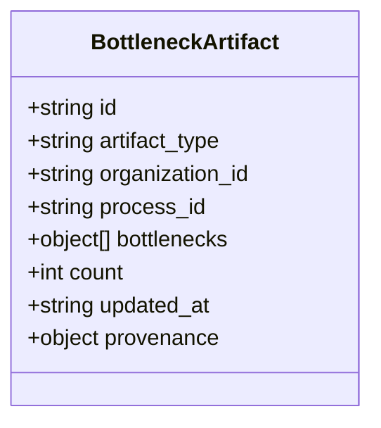
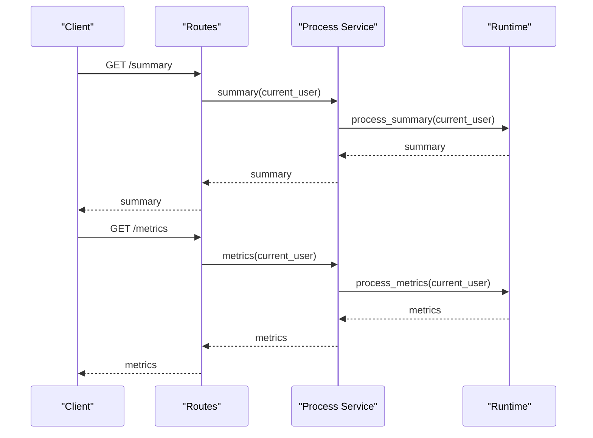
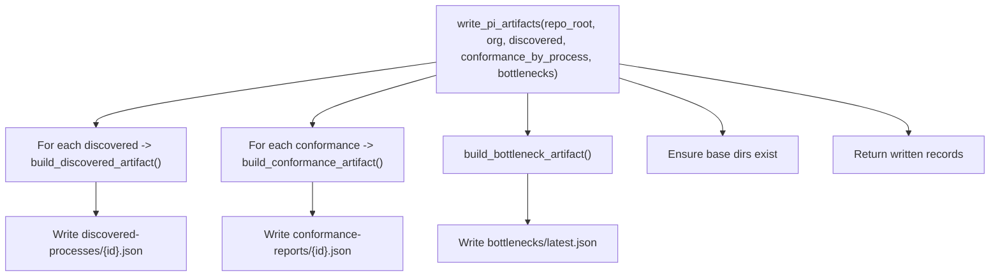
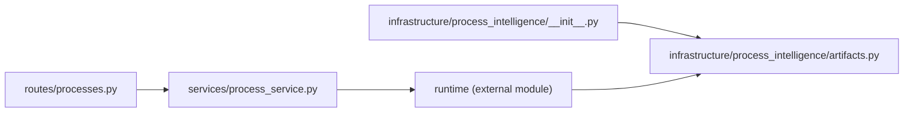

# Process Intelligence

<cite>
**Referenced Files in This Document**
- [process-intelligence.md](file://docs/process-intelligence.md)
- [routes.py](file://backend/app/api/v1/routes/processes.py)
- [artifacts.py](file://backend/app/infrastructure/process_intelligence/artifacts.py)
- [__init__.py](file://backend/app/infrastructure/process_intelligence/__init__.py)
- [process_service.py](file://backend/app/services/process_service.py)
</cite>

## Table of Contents
1. [Introduction](#introduction)
2. [Project Structure](#project-structure)
3. [Core Components](#core-components)
4. [Architecture Overview](#architecture-overview)
5. [Detailed Component Analysis](#detailed-component-analysis)
6. [Dependency Analysis](#dependency-analysis)
7. [Performance Considerations](#performance-considerations)
8. [Troubleshooting Guide](#troubleshooting-guide)
9. [Conclusion](#conclusion)
10. [Appendices](#appendices)

## Introduction
This document explains the process intelligence capabilities: ingesting event logs from structured events and raw operational data, discovering workflow patterns, checking conformance against expected flows, identifying bottlenecks for performance optimization, and generating analytics artifacts with reporting formats and visualization options. It also provides practical examples for ingestion, discovery, and bottleneck analysis.

## Project Structure
Process intelligence is exposed via REST endpoints, implemented through a service layer that delegates to runtime operations, and persists durable artifacts under business/process-intelligence/. The artifact builders construct standardized JSON records for discovered processes, conformance reports, and bottleneck summaries.

**Diagram sources**
- [routes.py:10-79](file://backend/app/api/v1/routes/processes.py#L10-L79)
- [process_service.py:4-30](file://backend/app/services/process_service.py#L4-L30)
- [artifacts.py:94-138](file://backend/app/infrastructure/process_intelligence/artifacts.py#L94-L138)

**Section sources**
- [process-intelligence.md:1-38](file://docs/process-intelligence.md#L1-L38)
- [routes.py:10-79](file://backend/app/api/v1/routes/processes.py#L10-L79)
- [process_service.py:4-30](file://backend/app/services/process_service.py#L4-L30)
- [artifacts.py:94-138](file://backend/app/infrastructure/process_intelligence/artifacts.py#L94-L138)

## Core Components
- Event log ingestion endpoint: accepts structured events and triggers downstream recomputation.
- Discovery, conformance, and bottleneck APIs: read computed results or trigger on-demand computation.
- Artifact writers: produce durable JSON artifacts and metadata for traceability.
- Service facade: exposes concise functions for summary, metrics, performance, bottlenecks, delays, costs, and failures.

Key responsibilities:
- Ingest and store event logs.
- Recompute discovered processes, conformance, and bottlenecks.
- Persist artifacts under business/process-intelligence/.
- Upsert pi_artifacts collection for queryability.

**Section sources**
- [process-intelligence.md:5-13](file://docs/process-intelligence.md#L5-L13)
- [routes.py:10-36](file://backend/app/api/v1/routes/processes.py#L10-L36)
- [artifacts.py:23-85](file://backend/app/infrastructure/process_intelligence/artifacts.py#L23-L85)

## Architecture Overview
The ingestion flow writes an event into runtime storage, recomputes PI artifacts, writes JSON files under business/process-intelligence/, and upserts records into the pi_artifacts collection.

**Diagram sources**
- [process-intelligence.md:5-13](file://docs/process-intelligence.md#L5-L13)
- [routes.py:10-12](file://backend/app/api/v1/routes/processes.py#L10-L12)
- [artifacts.py:94-138](file://backend/app/infrastructure/process_intelligence/artifacts.py#L94-L138)

## Detailed Component Analysis

### Event Log Ingestion
- Endpoint: POST /api/v1/processes/event-logs
- Behavior: stores the event in runtime, recomputes artifacts, writes JSON artifacts, and upserts pi_artifacts.
- Querying: GET /api/v1/processes/event-logs supports filtering by process_id and case_id.

**Diagram sources**
- [process-intelligence.md:5-13](file://docs/process-intelligence.md#L5-L13)
- [routes.py:10-22](file://backend/app/api/v1/routes/processes.py#L10-L22)

**Section sources**
- [process-intelligence.md:5-13](file://docs/process-intelligence.md#L5-L13)
- [routes.py:10-22](file://backend/app/api/v1/routes/processes.py#L10-L22)

### Process Discovery
- Endpoint: GET /api/v1/processes/discovered
- Output: per-process activity maps derived from event logs.
- Artifact: discovered-processes/{process_id}.json includes activities, counts, provenance, and timestamps.

**Diagram sources**
- [artifacts.py:23-46](file://backend/app/infrastructure/process_intelligence/artifacts.py#L23-L46)

**Section sources**
- [routes.py:24-26](file://backend/app/api/v1/routes/processes.py#L24-L26)
- [artifacts.py:23-46](file://backend/app/infrastructure/process_intelligence/artifacts.py#L23-L46)

### Conformance Checking
- Endpoint: GET /api/v1/processes/conformance?process_id=...
- Output: comparison between expected and observed activities; per-process report.
- Artifact: conformance-reports/{process_id}.json with report details and provenance.

**Diagram sources**
- [artifacts.py:49-62](file://backend/app/infrastructure/process_intelligence/artifacts.py#L49-L62)

**Section sources**
- [routes.py:29-31](file://backend/app/api/v1/routes/processes.py#L29-L31)
- [artifacts.py:49-62](file://backend/app/infrastructure/process_intelligence/artifacts.py#L49-L62)

### Bottleneck Identification
- Endpoint: GET /api/v1/processes/bottlenecks
- Output: list of identified bottlenecks (e.g., approval waits, activity latency).
- Artifact: bottlenecks/latest.json aggregates top bottlenecks with counts and provenance.

**Diagram sources**
- [artifacts.py:65-85](file://backend/app/infrastructure/process_intelligence/artifacts.py#L65-L85)

**Section sources**
- [routes.py:57-60](file://backend/app/api/v1/routes/processes.py#L57-L60)
- [artifacts.py:65-85](file://backend/app/infrastructure/process_intelligence/artifacts.py#L65-L85)

### Analytics Summary, Metrics, Performance, Costs, Failures
- Endpoints:
  - GET /api/v1/processes/summary
  - GET /api/v1/processes/metrics
  - GET /api/v1/processes/workflow-performance
  - GET /api/v1/processes/costs
  - GET /api/v1/processes/failures
- Service facade functions delegate to runtime methods for aggregation and reporting.

**Diagram sources**
- [routes.py:39-54](file://backend/app/api/v1/routes/processes.py#L39-L54)
- [process_service.py:4-13](file://backend/app/services/process_service.py#L4-L13)

**Section sources**
- [routes.py:39-78](file://backend/app/api/v1/routes/processes.py#L39-L78)
- [process_service.py:4-30](file://backend/app/services/process_service.py#L4-L30)

### Artifact Writing and Persistence
- Functionality: builds and writes JSON artifacts for discovered processes, conformance reports, and bottleneck summaries; ensures base directories exist; returns written records.
- Provenance: each artifact includes source references, capture agent, and recorded timestamp.

**Diagram sources**
- [artifacts.py:94-138](file://backend/app/infrastructure/process_intelligence/artifacts.py#L94-L138)

**Section sources**
- [artifacts.py:94-138](file://backend/app/infrastructure/process_intelligence/artifacts.py#L94-L138)

## Dependency Analysis
- API routes depend on the process service layer.
- Process service delegates to runtime methods.
- Artifact builders are imported via the infrastructure package init and used during artifact writing.

**Diagram sources**
- [routes.py:1-6](file://backend/app/api/v1/routes/processes.py#L1-L6)
- [process_service.py:1-3](file://backend/app/services/process_service.py#L1-L3)
- [__init__.py:1-13](file://backend/app/infrastructure/process_intelligence/__init__.py#L1-L13)
- [artifacts.py:1-12](file://backend/app/infrastructure/process_intelligence/artifacts.py#L1-L12)

**Section sources**
- [routes.py:1-6](file://backend/app/api/v1/routes/processes.py#L1-L6)
- [process_service.py:1-3](file://backend/app/services/process_service.py#L1-L3)
- [__init__.py:1-13](file://backend/app/infrastructure/process_intelligence/__init__.py#L1-L13)

## Performance Considerations
- Batch ingestion: prefer batching events to reduce recomputation overhead.
- Incremental updates: ensure runtime recomputation is incremental where possible.
- Artifact size: keep reported fields minimal to reduce disk I/O and network transfer.
- Indexing: ensure queries over event logs and pi_artifacts use appropriate indexes for process_id and case_id filters.
- Caching: consider caching summary and metrics responses with short TTLs for dashboards.

[No sources needed since this section provides general guidance]

## Troubleshooting Guide
Common issues and checks:
- Ingestion fails: verify payload structure and authentication; check runtime error paths.
- Missing artifacts: confirm write permissions to business/process-intelligence/ and that recomputation ran after ingestion.
- Empty discovery or conformance: validate that event logs contain required identifiers (process_id, case_id, activity names).
- Bottleneck lists empty: ensure sufficient historical data and that workflow runs include timing information.

Operational tips:
- Use GET /api/v1/processes/event-logs to inspect stored events.
- Use GET /api/v1/processes/artifacts to list persisted artifacts and their relative paths.
- Review timestamps and provenance fields in artifacts to trace origin and recency.

**Section sources**
- [routes.py:10-36](file://backend/app/api/v1/routes/processes.py#L10-L36)
- [process-intelligence.md:15-23](file://docs/process-intelligence.md#L15-L23)

## Conclusion
Process intelligence in this system centers on robust event log ingestion, automated artifact generation, and clear APIs for discovery, conformance, and bottleneck analysis. By persisting artifacts with provenance and exposing comprehensive analytics endpoints, teams can continuously monitor and optimize operational workflows.

[No sources needed since this section summarizes without analyzing specific files]

## Appendices

### Example Workflows

#### Ingesting an Event Log
- Call POST /api/v1/processes/event-logs with a structured event payload.
- The system stores the event, recomputes artifacts, writes JSON files, and upserts pi_artifacts.

**Section sources**
- [process-intelligence.md:5-13](file://docs/process-intelligence.md#L5-L13)
- [routes.py:10-12](file://backend/app/api/v1/routes/processes.py#L10-L12)

#### Discovering Processes
- Call GET /api/v1/processes/discovered to retrieve per-process activity maps.
- Inspect discovered-processes/*.json for detailed activities and counts.

**Section sources**
- [routes.py:24-26](file://backend/app/api/v1/routes/processes.py#L24-L26)
- [artifacts.py:23-46](file://backend/app/infrastructure/process_intelligence/artifacts.py#L23-L46)

#### Analyzing Performance Bottlenecks
- Call GET /api/v1/processes/bottlenecks to obtain bottleneck lists.
- Review bottlenecks/latest.json for aggregated findings and counts.

**Section sources**
- [routes.py:57-60](file://backend/app/api/v1/routes/processes.py#L57-L60)
- [artifacts.py:65-85](file://backend/app/infrastructure/process_intelligence/artifacts.py#L65-L85)

### Reporting Formats and Visualization Options
- Formats: JSON artifacts with consistent fields including id, artifact_type, organization_id, process_id, content, updated_at, and provenance.
- Visualization: consume JSON artifacts to render process graphs, heatmaps of delays, and conformance dashboards in any BI tool.

**Section sources**
- [artifacts.py:23-85](file://backend/app/infrastructure/process_intelligence/artifacts.py#L23-L85)
- [process-intelligence.md:15-23](file://docs/process-intelligence.md#L15-L23)