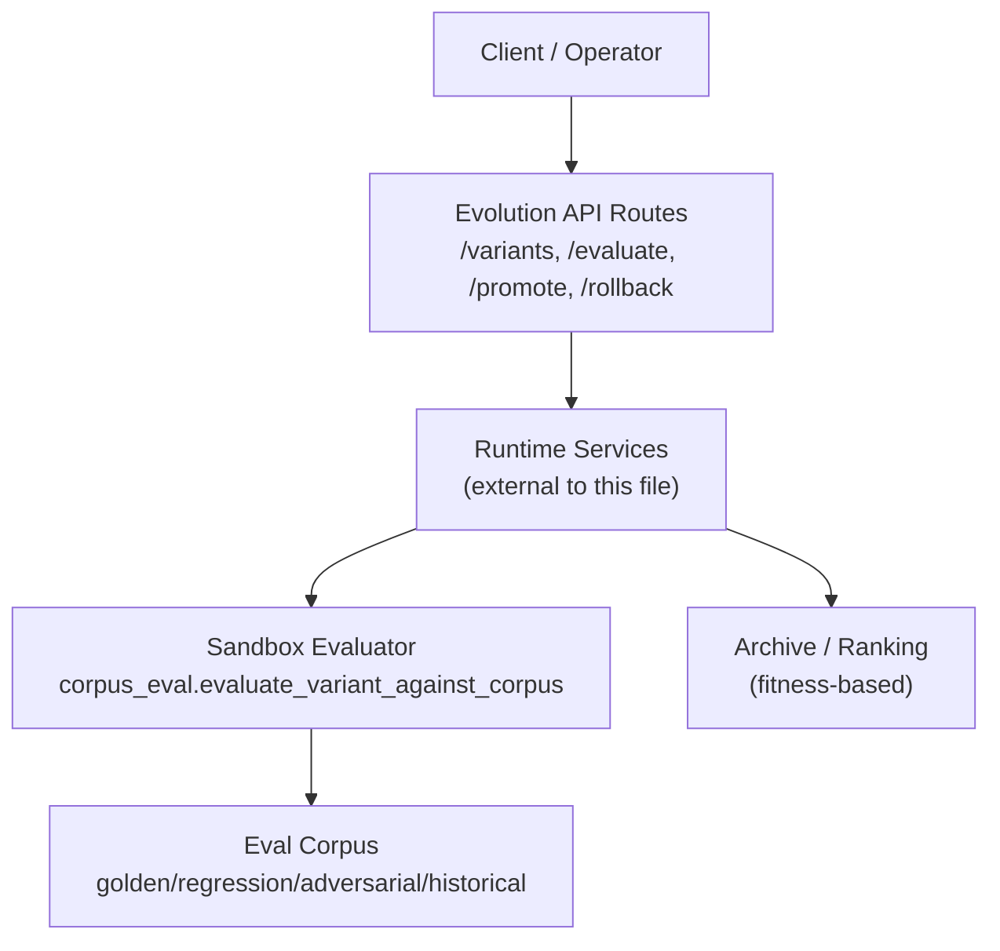
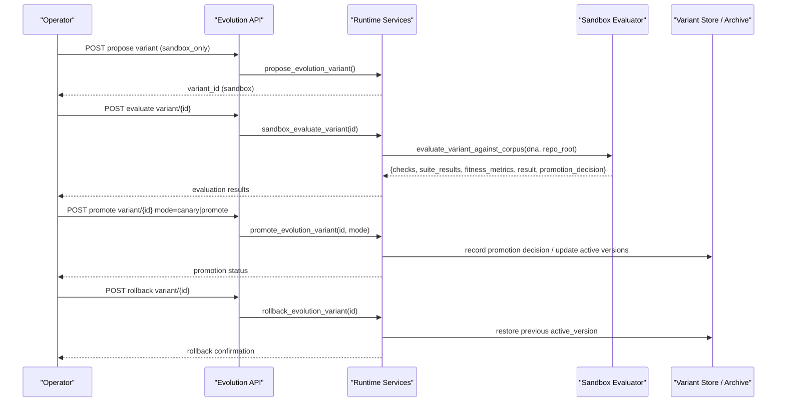
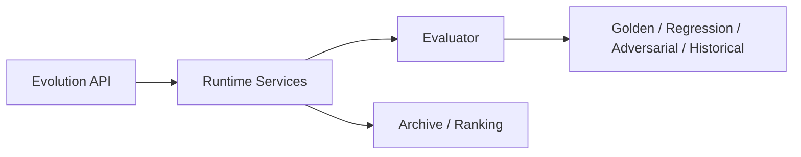

# Canary Deployment & Promotion

<cite>
**Referenced Files in This Document**
- [evolution.py](file://backend/app/api/v1/routes/evolution.py)
- [corpus_eval.py](file://backend/app/infrastructure/evolution/corpus_eval.py)
- [evolution-sandbox.md](file://docs/evolution-sandbox.md)
- [README.md](file://business/evolution/README.md)
</cite>

## Table of Contents
1. [Introduction](#introduction)
2. [Project Structure](#project-structure)
3. [Core Components](#core-components)
4. [Architecture Overview](#architecture-overview)
5. [Detailed Component Analysis](#detailed-component-analysis)
6. [Dependency Analysis](#dependency-analysis)
7. [Performance Considerations](#performance-considerations)
8. [Troubleshooting Guide](#troubleshooting-guide)
9. [Conclusion](#conclusion)
10. [Appendices](#appendices)

## Introduction
This document explains canary deployment strategies and promotion controls within the evolution pipeline. It covers gradual rollout mechanisms, traffic splitting between old and new variants, automated rollback triggers based on performance metrics, and promotion workflows from development to staging to production. It also documents monitoring integration, alerting thresholds, manual approval gates for critical deployments, configuration examples for canary releases, promotion criteria, handling failures, and emergency rollback procedures.

The evolution system is designed to propose variants, evaluate them in a sandbox against curated corpora, request approvals, canary deploy, and roll back on failure without mutating production directly.

## Project Structure
The evolution-related functionality relevant to canary and promotion spans:
- API routes that expose variant lifecycle operations (propose, evaluate, promote, rollback).
- A sandbox evaluation module that runs multi-suite checks and computes fitness metrics.
- Documentation describing the shipped loop and policy constraints.

**Diagram sources**
- [evolution.py:1-61](file://backend/app/api/v1/routes/evolution.py#L1-L61)
- [corpus_eval.py:286-329](file://backend/app/infrastructure/evolution/corpus_eval.py#L286-L329)

**Section sources**
- [evolution.py:1-61](file://backend/app/api/v1/routes/evolution.py#L1-L61)
- [evolution-sandbox.md:1-40](file://docs/evolution-sandbox.md#L1-L40)
- [README.md:1-4](file://business/evolution/README.md#L1-L4)

## Core Components
- Evolution API endpoints:
  - List variants and archive.
  - Propose a new variant (sandbox-only by design).
  - Evaluate a variant against the corpus.
  - Promote a variant with explicit mode selection (canary or promote).
  - Rollback a variant to restore previous active state.
- Sandbox evaluator:
  - Loads platform and domain-specific eval suites.
  - Runs golden, regression, adversarial, and historical replay checks.
  - Computes fitness metrics and returns promotion decisions.
- Policy and workflow:
  - No direct mutation of production DNA.
  - Auto-promotion is forbidden; human approval required for promotions.
  - Rollback plans recorded for canary variants.

Key responsibilities:
- API layer enforces authentication and delegates to runtime services.
- Evaluation layer ensures safety and quality via structured tests and metrics.
- Promotion logic respects governance rules and supports canary vs full promotion modes.

**Section sources**
- [evolution.py:9-38](file://backend/app/api/v1/routes/evolution.py#L9-L38)
- [corpus_eval.py:14-84](file://backend/app/infrastructure/evolution/corpus_eval.py#L14-L84)
- [evolution-sandbox.md:1-40](file://docs/evolution-sandbox.md#L1-L40)
- [README.md:1-4](file://business/evolution/README.md#L1-L4)

## Architecture Overview
The canary and promotion architecture centers around a safe proposal-and-evaluate loop followed by controlled rollout and rollback.

**Diagram sources**
- [evolution.py:9-38](file://backend/app/api/v1/routes/evolution.py#L9-L38)
- [corpus_eval.py:286-329](file://backend/app/infrastructure/evolution/corpus_eval.py#L286-L329)

## Detailed Component Analysis

### Variant Lifecycle Endpoints
- Propose variant: Creates a sandbox-only variant; blocks direct production mutation.
- Evaluate variant: Executes corpus-based checks and returns pass/fail plus fitness metrics.
- Promote variant: Supports two modes:
  - canary: Gradual rollout with monitoring and rollback triggers.
  - promote: Full promotion to target environment after approval.
- Rollback variant: Restores previous active version.

Operational notes:
- Authentication is enforced via dependencies.
- Promotion mode is explicitly provided in the request payload.
- Governance review endpoint lists pending artifacts for sign-off.

**Section sources**
- [evolution.py:9-38](file://backend/app/api/v1/routes/evolution.py#L9-L38)
- [evolution-sandbox.md:15-22](file://docs/evolution-sandbox.md#L15-L22)

### Sandbox Evaluator and Fitness Metrics
The evaluator loads multiple test suites and performs structural and behavioral checks:
- Golden tasks: Validates expected controls such as human gates and irreversible actions.
- Regression tests: Enforces gating for irreversible steps at higher risk tiers and requires rollback plans when applicable.
- Adversarial tests: Prevents unsafe configurations like bypassing allowlists or skipping gates.
- Historical replay: Applies threshold-based checks on metrics like hallucination rate, unauthorized tool attempts, and compliance pass rate.

Fitness metrics include:
- Suite pass rate and counts.
- Step-level statistics (total, gated, irreversible).
- Human gate coverage relative to irreversible steps.
- Presence of rollback plan and production readiness flags.

Promotion decision:
- Returns a decision suitable for canary-only progression when all checks pass.
- Blocks promotion if any suite fails.

**Section sources**
- [corpus_eval.py:115-235](file://backend/app/infrastructure/evolution/corpus_eval.py#L115-L235)
- [corpus_eval.py:267-284](file://backend/app/infrastructure/evolution/corpus_eval.py#L267-L284)
- [corpus_eval.py:286-329](file://backend/app/infrastructure/evolution/corpus_eval.py#L286-L329)

### Promotion Workflows: Development → Staging → Production
- Development:
  - Propose variant in sandbox.
  - Run evaluations; ensure all suites pass and fitness metrics meet internal thresholds.
- Staging:
  - Use promote mode=canary to introduce the variant to a subset of traffic.
  - Monitor key metrics and apply alerting thresholds.
  - If metrics degrade beyond thresholds, trigger automatic rollback.
- Production:
  - After successful canary period and human approval, promote fully using promote mode=promote.
  - Record promotion decision and maintain auditability.

Policy constraints:
- Auto-promotion is forbidden.
- Full promotion requires owner/admin privileges.
- Rollback plans must be present for canary variants.

**Section sources**
- [evolution-sandbox.md:5-13](file://docs/evolution-sandbox.md#L5-L13)
- [evolution-sandbox.md:35-40](file://docs/evolution-sandbox.md#L35-L40)
- [README.md:1-4](file://business/evolution/README.md#L1-L4)

### Monitoring Integration and Alerting Thresholds
Integration points:
- The evaluator produces structured results including suite outcomes and fitness metrics.
- These outputs can be consumed by monitoring systems to drive alerts and dashboards.

Recommended thresholds (derived from evaluator behavior):
- Hallucination rate above a small fraction should fail checks.
- Unauthorized tool attempts must be zero.
- Compliance pass rate must remain high.

Alerting strategy:
- On canary, monitor error rates, latency percentiles, and domain-specific KPIs.
- Trigger rollback automatically if thresholds are breached.
- Escalate to human operators for manual intervention when needed.

**Section sources**
- [corpus_eval.py:238-264](file://backend/app/infrastructure/evolution/corpus_eval.py#L238-L264)
- [corpus_eval.py:267-284](file://backend/app/infrastructure/evolution/corpus_eval.py#L267-L284)

### Manual Approval Gates
Governance review:
- Pending learned artifacts can be reviewed by humans before promotion.
- Operators can approve or reject changes based on audit logs and evaluation results.

Gate enforcement:
- Irreversible steps require human gates at higher risk tiers.
- Regression checks enforce gating presence and rollback availability.

**Section sources**
- [evolution.py:57-61](file://backend/app/api/v1/routes/evolution.py#L57-L61)
- [corpus_eval.py:159-210](file://backend/app/infrastructure/evolution/corpus_eval.py#L159-L210)

### Configuring Canary Releases
Configuration elements:
- Promotion mode selection: canary vs promote.
- Rollback plan inclusion: reversible flag and rollback steps.
- Risk tier alignment: ensure irreversible steps are gated appropriately.

Example configuration flow:
- Propose variant with sandbox_only.
- Evaluate and confirm all suites pass.
- Promote with mode=canary and attach rollback plan.
- Monitor metrics; auto-rollback on threshold breach.
- Approve and promote fully after canary success.

**Section sources**
- [evolution.py:30-33](file://backend/app/api/v1/routes/evolution.py#L30-L33)
- [corpus_eval.py:267-284](file://backend/app/infrastructure/evolution/corpus_eval.py#L267-L284)
- [evolution-sandbox.md:15-22](file://docs/evolution-sandbox.md#L15-L22)

### Handling Deployment Failures and Emergency Rollback
Failure handling:
- If evaluation fails, promotion is blocked.
- During canary, metric breaches trigger rollback.

Emergency rollback procedure:
- Invoke rollback endpoint for the variant.
- System restores previous active version.
- Audit log records the action and reason.

**Section sources**
- [evolution.py:36-38](file://backend/app/api/v1/routes/evolution.py#L36-L38)
- [evolution-sandbox.md:11-13](file://docs/evolution-sandbox.md#L11-L13)

## Dependency Analysis
The API layer depends on runtime services (not shown here) which orchestrate storage and evaluation. The evaluator depends on disk-based corpora and domain overlays.

**Diagram sources**
- [evolution.py:1-61](file://backend/app/api/v1/routes/evolution.py#L1-L61)
- [corpus_eval.py:14-84](file://backend/app/infrastructure/evolution/corpus_eval.py#L14-L84)

**Section sources**
- [evolution.py:1-61](file://backend/app/api/v1/routes/evolution.py#L1-L61)
- [corpus_eval.py:14-84](file://backend/app/infrastructure/evolution/corpus_eval.py#L14-L84)

## Performance Considerations
- Keep evaluation suites lean and focused on high-signal checks.
- Cache corpus loading where appropriate to reduce I/O overhead.
- Limit canary traffic initially and scale gradually based on observed metrics.
- Ensure rollback operations are fast and idempotent.

[No sources needed since this section provides general guidance]

## Troubleshooting Guide
Common issues and resolutions:
- Evaluation blocked due to missing human gates:
  - Add human_gate_required or mark step irreversible with proper gating.
- Regression failures indicating ungated critical steps:
  - Align risk tier and ensure irreversible steps have gates.
- Historical replay failures:
  - Review recorded metrics and adjust thresholds or fix underlying issues.
- Promotion denied due to auto_promote flag:
  - Remove auto_promote; use manual promotion with approval.

Operational tips:
- Inspect suite_results and fitness_metrics for detailed diagnostics.
- Use governance review to validate pending artifacts before promotion.

**Section sources**
- [corpus_eval.py:159-210](file://backend/app/infrastructure/evolution/corpus_eval.py#L159-L210)
- [corpus_eval.py:238-264](file://backend/app/infrastructure/evolution/corpus_eval.py#L238-L264)
- [evolution.py:57-61](file://backend/app/api/v1/routes/evolution.py#L57-L61)

## Conclusion
The evolution pipeline provides a robust foundation for canary deployments and promotion controls. By enforcing strict evaluation, gating, and rollback policies, it enables safe experimentation and controlled rollouts across environments. Operators can leverage structured APIs, clear promotion decisions, and comprehensive metrics to manage risk while accelerating delivery.

[No sources needed since this section summarizes without analyzing specific files]

## Appendices

### API Reference Summary
- GET /api/v1/evolution/variants — list variants
- GET /api/v1/evolution/archive — population ranked by fitness
- POST /api/v1/evolution/variants — propose variant (sandbox_only)
- POST /api/v1/evolution/variants/{id}/evaluate — run corpus evaluation
- POST /api/v1/evolution/variants/{id}/promote — promote with mode=canary|promote
- POST /api/v1/evolution/variants/{id}/rollback — rollback to previous active version
- GET /api/v1/evolution/governance/review — list pending artifacts for human sign-off

**Section sources**
- [evolution.py:9-38](file://backend/app/api/v1/routes/evolution.py#L9-L38)
- [evolution-sandbox.md:15-22](file://docs/evolution-sandbox.md#L15-L22)