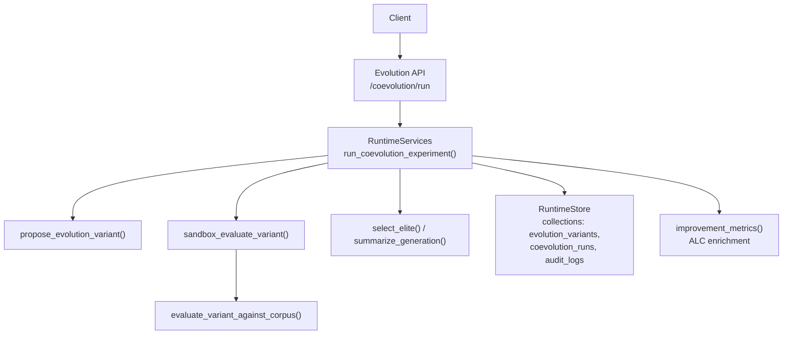
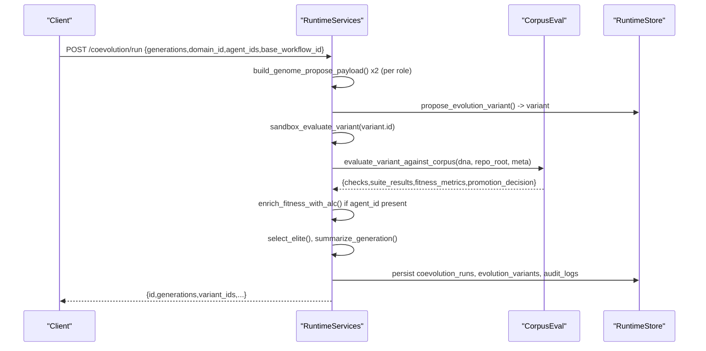
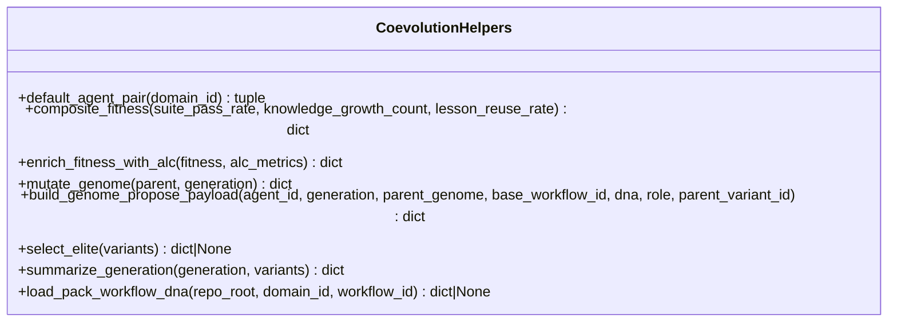
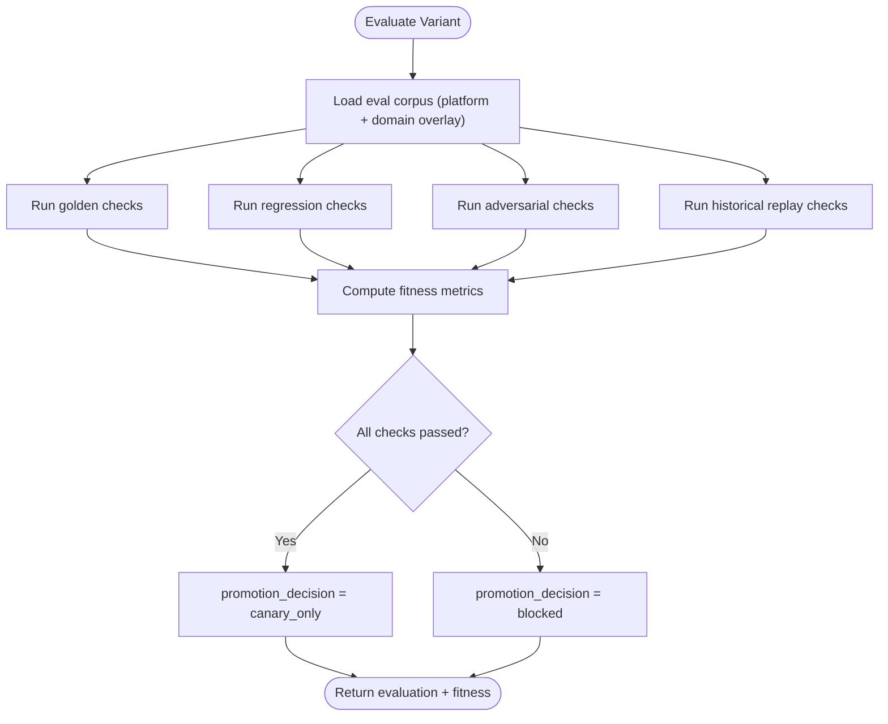
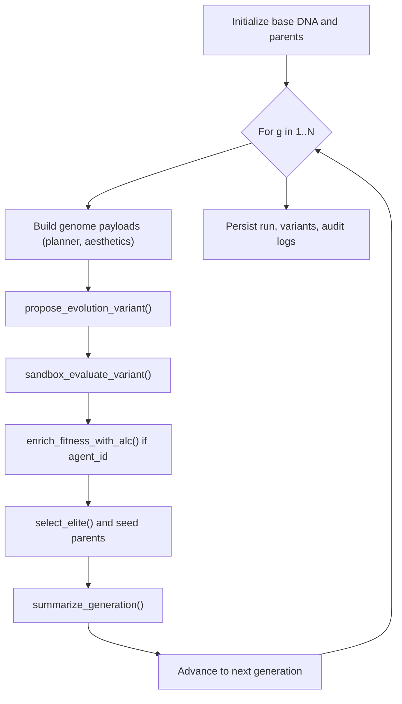
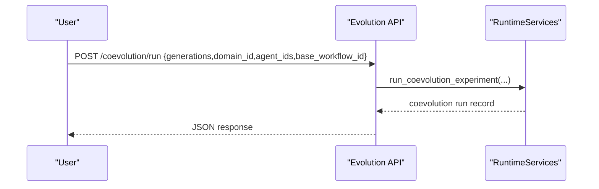
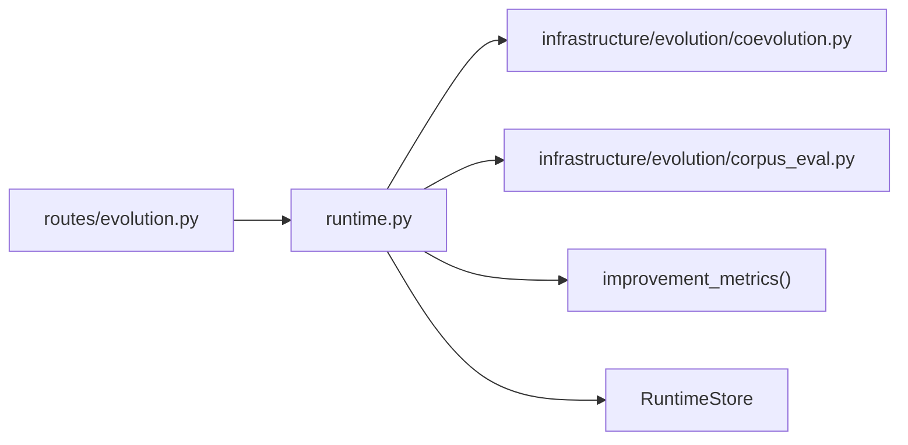

# Coevolution Engine

<cite>
**Referenced Files in This Document**
- [coevolution.py](file://backend/app/infrastructure/evolution/coevolution.py)
- [corpus_eval.py](file://backend/app/infrastructure/evolution/corpus_eval.py)
- [evolution.py](file://backend/app/api/v1/routes/evolution.py)
- [runtime.py](file://backend/app/runtime.py)
- [test_wave3_coevolution.py](file://backend/app/tests/unit/test_wave3_coevolution.py)
</cite>

## Table of Contents
1. [Introduction](#introduction)
2. [Project Structure](#project-structure)
3. [Core Components](#core-components)
4. [Architecture Overview](#architecture-overview)
5. [Detailed Component Analysis](#detailed-component-analysis)
6. [Dependency Analysis](#dependency-analysis)
7. [Performance Considerations](#performance-considerations)
8. [Troubleshooting Guide](#troubleshooting-guide)
9. [Conclusion](#conclusion)
10. [Appendices](#appendices)

## Introduction
This document explains the coevolution engine that enables competitive evolution of workflow variants. It focuses on how multiple agent genomes (e.g., planner and aesthetics/QC roles) compete across shared fitness landscapes, selection pressures, mutation strategies, population management, and convergence signals. The engine is sandbox-only: it never auto-promotes to production and enforces strict governance via human sign-off paths.

Key capabilities include:
- Multi-generation coevolution with deterministic genome mutation and lineage tracking
- Shared evaluation corpus (golden, regression, adversarial, historical replay) for consistent fitness landscapes
- Composite fitness combining suite pass rate, knowledge growth, and lesson reuse
- Population management per generation with elite selection and parent seeding
- Integration with variant proposal, evaluation, promotion, rollback, and governance review
- Auditability and invariant checks ensuring production DNA remains unchanged during experiments

## Project Structure
The coevolution engine spans API routes, runtime orchestration, and infrastructure helpers:
- API route exposes a single endpoint to run multi-generation coevolution experiments
- Runtime orchestrates variant proposals, evaluations, selection, and persistence
- Infrastructure provides deterministic mutation, composite fitness, and corpus-based evaluation

**Diagram sources**
- [evolution.py:41-54](file://backend/app/api/v1/routes/evolution.py#L41-L54)
- [runtime.py:4572-4699](file://backend/app/runtime.py#L4572-L4699)
- [corpus_eval.py:286-329](file://backend/app/infrastructure/evolution/corpus_eval.py#L286-L329)

**Section sources**
- [evolution.py:1-61](file://backend/app/api/v1/routes/evolution.py#L1-L61)
- [runtime.py:4572-4699](file://backend/app/runtime.py#L4572-L4699)
- [corpus_eval.py:1-329](file://backend/app/infrastructure/evolution/corpus_eval.py#L1-L329)

## Core Components
- Coevolution helpers: deterministic mutation, genome payload building, elite selection, generation summarization, and pack DNA loading
- Evaluation harness: loads platform and domain-specific eval suites, runs structural and behavioral checks, computes fitness metrics
- Runtime orchestration: manages generations, proposes variants, evaluates them, selects elites, persists artifacts, and audits outcomes

Highlights:
- Sandbox-only by design; no auto-promotion
- Deterministic mutation increases temperature and exploration traits over generations
- Fitness combines suite performance with ALC growth/reuse when available
- Invariant checks ensure production DNA version does not change during coevolution

**Section sources**
- [coevolution.py:1-153](file://backend/app/infrastructure/evolution/coevolution.py#L1-L153)
- [corpus_eval.py:1-329](file://backend/app/infrastructure/evolution/corpus_eval.py#L1-L329)
- [runtime.py:3178-3466](file://backend/app/runtime.py#L3178-L3466)
- [runtime.py:4572-4699](file://backend/app/runtime.py#L4572-L4699)

## Architecture Overview
The coevolution loop executes N generations. Each generation:
- Builds two agent-genome variants (planner and aesthetics) from parents or defaults
- Proposes sandbox variants with lineage and metadata
- Evaluates each variant against the shared corpus
- Computes composite fitness (with optional ALC enrichment)
- Selects the best-of-generation and seeds next generation parents
- Summarizes generation results and persists all artifacts

**Diagram sources**
- [evolution.py:41-54](file://backend/app/api/v1/routes/evolution.py#L41-L54)
- [runtime.py:4572-4699](file://backend/app/runtime.py#L4572-L4699)
- [corpus_eval.py:286-329](file://backend/app/infrastructure/evolution/corpus_eval.py#L286-L329)

## Detailed Component Analysis

### Coevolution Helpers
Responsibilities:
- Default agent pair selection by domain
- Deterministic genome mutation (temperature, exploration, versioning)
- Payload construction for variant proposal with lineage and sandbox flags
- Elite selection based on composite fitness
- Generation summarization for reporting
- Loading pack DNA from disk when not in runtime store

**Diagram sources**
- [coevolution.py:17-153](file://backend/app/infrastructure/evolution/coevolution.py#L17-L153)

**Section sources**
- [coevolution.py:1-153](file://backend/app/infrastructure/evolution/coevolution.py#L1-L153)

### Evaluation Harness (Shared Fitness Landscape)
Responsibilities:
- Load platform and domain-specific eval suites (golden, regression, adversarial, historical replay)
- Run structural and behavioral checks against DNA
- Compute fitness metrics including suite pass rate, step counts, gate coverage, and safety flags
- Return promotion decision (canary_only or blocked), never promote automatically

**Diagram sources**
- [corpus_eval.py:68-84](file://backend/app/infrastructure/evolution/corpus_eval.py#L68-L84)
- [corpus_eval.py:115-264](file://backend/app/infrastructure/evolution/corpus_eval.py#L115-L264)
- [corpus_eval.py:267-329](file://backend/app/infrastructure/evolution/corpus_eval.py#L267-L329)

**Section sources**
- [corpus_eval.py:1-329](file://backend/app/infrastructure/evolution/corpus_eval.py#L1-L329)

### Runtime Orchestration (Population Management and Selection)
Responsibilities:
- Initialize base DNA (from runtime store or pack file) and enforce sandbox constraints
- For each generation:
  - Build genome payloads for both roles using mutate_genome and build_genome_propose_payload
  - Propose variants and evaluate against corpus
  - Enrich fitness with ALC metrics when agent_id is present
  - Select elite and seed next generation parents
- Persist coevolution run record, variants, and audit logs
- Enforce invariants: production DNA version must remain unchanged

**Diagram sources**
- [runtime.py:4572-4699](file://backend/app/runtime.py#L4572-L4699)
- [runtime.py:3178-3318](file://backend/app/runtime.py#L3178-L3318)
- [coevolution.py:59-132](file://backend/app/infrastructure/evolution/coevolution.py#L59-L132)

**Section sources**
- [runtime.py:3178-3466](file://backend/app/runtime.py#L3178-L3466)
- [runtime.py:4572-4699](file://backend/app/runtime.py#L4572-L4699)

### API Surface
- POST /coevolution/run: triggers multi-generation sandbox coevolution experiment
- Other endpoints support listing variants, archive, propose, evaluate, promote, rollback, and governance review

**Diagram sources**
- [evolution.py:41-54](file://backend/app/api/v1/routes/evolution.py#L41-L54)

**Section sources**
- [evolution.py:1-61](file://backend/app/api/v1/routes/evolution.py#L1-L61)

## Dependency Analysis
- API depends on RuntimeServices for business logic
- RuntimeServices composes:
  - Evolution helpers (mutation, selection, summarization)
  - Corpus evaluation (shared fitness landscape)
  - Improvement metrics (ALC enrichment)
  - RuntimeStore for persistence and auditing

**Diagram sources**
- [evolution.py:41-54](file://backend/app/api/v1/routes/evolution.py#L41-L54)
- [runtime.py:4572-4699](file://backend/app/runtime.py#L4572-L4699)
- [coevolution.py:1-153](file://backend/app/infrastructure/evolution/coevolution.py#L1-L153)
- [corpus_eval.py:1-329](file://backend/app/infrastructure/evolution/corpus_eval.py#L1-L329)

**Section sources**
- [evolution.py:1-61](file://backend/app/api/v1/routes/evolution.py#L1-L61)
- [runtime.py:4572-4699](file://backend/app/runtime.py#L4572-L4699)

## Performance Considerations
- Deterministic mutation avoids randomness overhead; complexity dominated by evaluation suite size
- Corpus loading merges platform and domain overlays; deduplication prevents redundant checks
- Fitness computation is O(S) where S is number of suites; ALC enrichment adds O(L) where L is lessons count
- Convergence detection is implicit via elite fitness trends; consider monitoring composite_fitness per generation to detect plateaus
- Parallel execution is not implemented in this path; future work could parallelize variant evaluation across agents/generations

[No sources needed since this section provides general guidance]

## Troubleshooting Guide
Common issues and resolutions:
- Production DNA changed during coevolution: an invariant check raises a validation error; verify no concurrent mutations occurred
- Direct production mutation blocked: evolution path forbids direct mutations; use proposed variants and explicit promotion flow
- Promotion blocked: evaluation did not pass or promotion_decision is blocked; review suite failures and adversarial checks
- Auto-promote forbidden: system enforces manual canary then versioned promote; follow governance review process

Operational tips:
- Use governance_review_learned_artifacts to list pending variants and skills for human sign-off
- Inspect audit logs for evolution events (variant proposed, evaluated, completed)
- Validate corpus presence for domain overlays to ensure expected checks are loaded

**Section sources**
- [runtime.py:3178-3318](file://backend/app/runtime.py#L3178-L3318)
- [runtime.py:3320-3466](file://backend/app/runtime.py#L3320-L3466)
- [runtime.py:4741-4796](file://backend/app/runtime.py#L4741-L4796)
- [test_wave3_coevolution.py:64-102](file://backend/app/tests/unit/test_wave3_coevolution.py#L64-L102)

## Conclusion
The coevolution engine provides a robust, sandbox-first framework for competitive evolution of workflow variants. It leverages a shared evaluation corpus to define a stable fitness landscape, applies deterministic mutation and selection to evolve agent genomes, and integrates tightly with governance and audit mechanisms. By enforcing sandbox-only operations and requiring human sign-off for promotions, it balances innovation with safety.

[No sources needed since this section summarizes without analyzing specific files]

## Appendices

### Example: Setting Up a Coevolution Experiment
- Call POST /coevolution/run with parameters:
  - generations: integer (e.g., 2)
  - domain_id: string (e.g., "video")
  - agent_ids: optional list of two agent IDs (defaults to planner × aiqaconsistency)
  - base_workflow_id: string identifying baseline workflow
- Response includes run id, generations summaries, variant ids, and sandbox_only flag

**Section sources**
- [evolution.py:41-54](file://backend/app/api/v1/routes/evolution.py#L41-L54)
- [test_wave3_coevolution.py:64-102](file://backend/app/tests/unit/test_wave3_coevolution.py#L64-L102)

### Competition Rules and Selection
- Two roles compete per generation: planner and aesthetics
- Selection uses composite_fitness; if agent_id present, ALC enrichment augments fitness
- Elite variant seeds next generation parents for its role; overall elite also considered

**Section sources**
- [coevolution.py:109-132](file://backend/app/infrastructure/evolution/coevolution.py#L109-L132)
- [runtime.py:4626-4653](file://backend/app/runtime.py#L4626-L4653)

### Analyzing Evolutionary Trajectories
- Review generation summaries for elite_fitness and fitness_metrics
- Track variant_ids across generations to observe lineage
- Use governance review to inspect pending variants and their fitness

**Section sources**
- [runtime.py:4642-4699](file://backend/app/runtime.py#L4642-L4699)
- [runtime.py:4741-4796](file://backend/app/runtime.py#L4741-L4796)