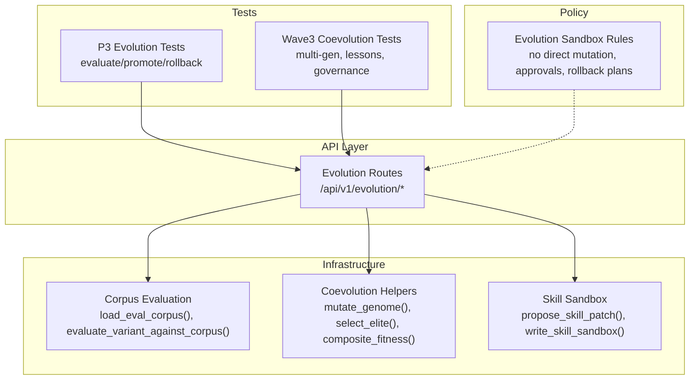
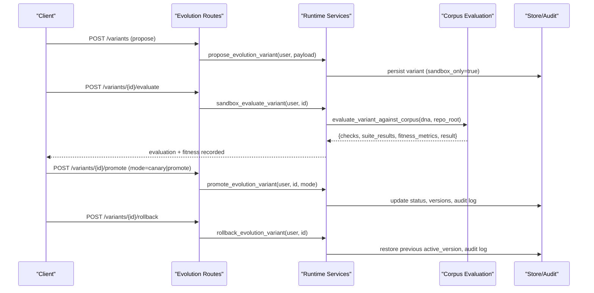
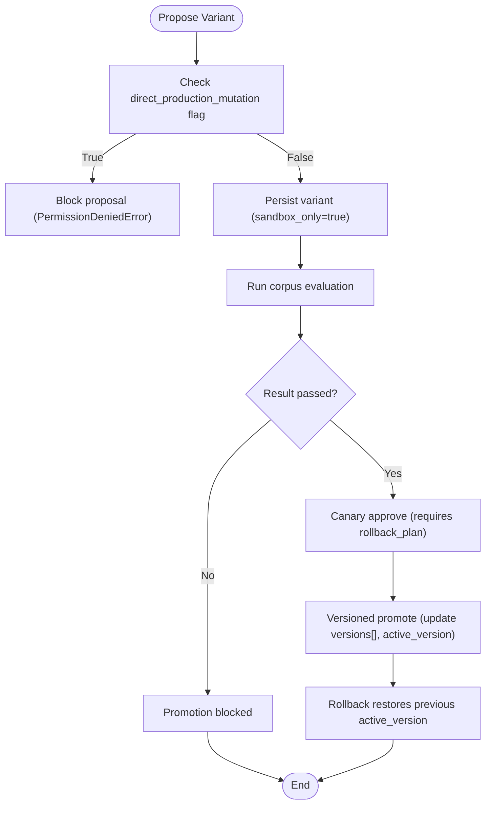
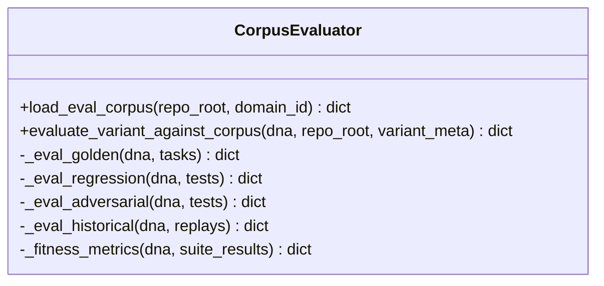
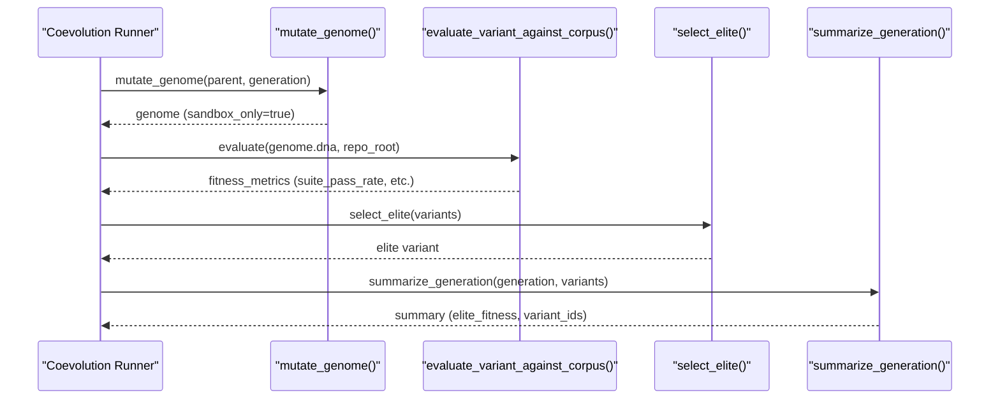
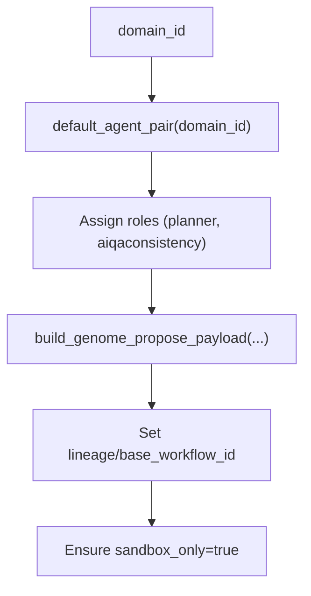
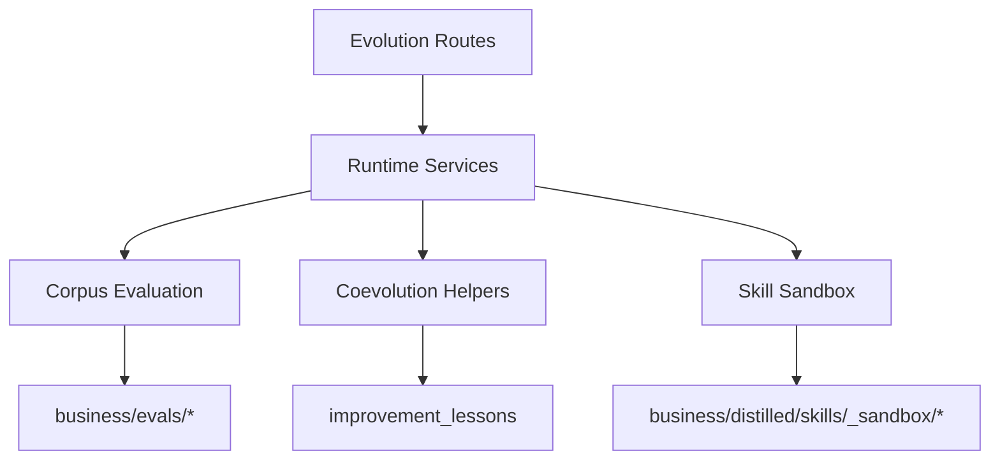

# Evolution Sandbox

<cite>
**Referenced Files in This Document**
- [evolution-sandbox.md](file://docs/evolution-sandbox.md)
- [100-evolution-sandbox.md](file://rules/100-evolution-sandbox.md)
- [evolution.py](file://backend/app/api/v1/routes/evolution.py)
- [corpus_eval.py](file://backend/app/infrastructure/evolution/corpus_eval.py)
- [coevolution.py](file://backend/app/infrastructure/evolution/coevolution.py)
- [skill_sandbox.py](file://backend/app/infrastructure/self_improvement/skill_sandbox.py)
- [test_p3_pi_evolution.py](file://backend/app/tests/unit/test_p3_pi_evolution.py)
- [test_wave3_coevolution.py](file://backend/app/tests/unit/test_wave3_coevolution.py)
</cite>

## Table of Contents
1. [Introduction](#introduction)
2. [Project Structure](#project-structure)
3. [Core Components](#core-components)
4. [Architecture Overview](#architecture-overview)
5. [Detailed Component Analysis](#detailed-component-analysis)
6. [Dependency Analysis](#dependency-analysis)
7. [Performance Considerations](#performance-considerations)
8. [Troubleshooting Guide](#troubleshooting-guide)
9. [Conclusion](#conclusion)
10. [Appendices](#appendices)

## Introduction
The Evolution Sandbox is a safe, sandbox-only environment for proposing, evaluating, comparing, and promoting workflow variants without mutating production DNA directly. It enforces strict safety policies: no direct production mutation, mandatory baseline comparisons, regression and adversarial checks, rollback plans, and human approvals before canary rollout. The system supports multi-generation coevolution experiments where multiple agent genomes compete and evolve over time, with deterministic fitness scoring and governance review gates.

Key capabilities include:
- Variant creation via propose endpoints that block direct production mutation
- Fitness evaluation against on-disk corpus datasets (golden, regression, adversarial, historical replay)
- Automated testing strategies across suites with pass/fail and promotion decisions
- Coevolution loops generating generations of variants, selecting elites, and summarizing outcomes
- Skill sandboxing for prompt evolution proposals written to sandbox paths only
- Promotion modes (canary or versioned promote) with rollback support and audit trails

## Project Structure
The Evolution Sandbox spans API routes, infrastructure modules, tests, and policy documents:
- API layer exposes endpoints for variant lifecycle and coevolution runs
- Infrastructure provides corpus evaluation, coevolution helpers, and skill sandbox utilities
- Tests validate end-to-end flows including evaluate, promote, rollback, and coevolution
- Policy rules enforce safety constraints and approval requirements

**Diagram sources**
- [evolution.py:1-61](file://backend/app/api/v1/routes/evolution.py#L1-L61)
- [corpus_eval.py:1-329](file://backend/app/infrastructure/evolution/corpus_eval.py#L1-L329)
- [coevolution.py:1-153](file://backend/app/infrastructure/evolution/coevolution.py#L1-L153)
- [skill_sandbox.py:1-87](file://backend/app/infrastructure/self_improvement/skill_sandbox.py#L1-L87)
- [test_p3_pi_evolution.py:1-201](file://backend/app/tests/unit/test_p3_pi_evolution.py#L1-L201)
- [test_wave3_coevolution.py:1-209](file://backend/app/tests/unit/test_wave3_coevolution.py#L1-L209)
- [100-evolution-sandbox.md:1-6](file://rules/100-evolution-sandbox.md#L1-L6)

**Section sources**
- [evolution-sandbox.md:1-40](file://docs/evolution-sandbox.md#L1-L40)
- [100-evolution-sandbox.md:1-6](file://rules/100-evolution-sandbox.md#L1-L6)

## Core Components
- Evolution API Routes: Provide endpoints for listing variants, proposing new variants, evaluating against corpus, promoting (canary/versioned), rolling back, running coevolution experiments, and governance review.
- Corpus Evaluation: Loads platform and domain-specific eval suites from disk, performs structural and behavioral checks, computes fitness metrics, and returns promotion decisions without mutating production.
- Coevolution Helpers: Generate mutated genomes per generation, compute composite fitness using suite pass rate plus knowledge growth and lesson reuse, select elite variants, and summarize generations.
- Skill Sandbox: Proposes skill/prompt patches into sandbox directories, writes files safely, and promotes to production only via explicit action after stripping sandbox banners.

**Section sources**
- [evolution.py:1-61](file://backend/app/api/v1/routes/evolution.py#L1-L61)
- [corpus_eval.py:1-329](file://backend/app/infrastructure/evolution/corpus_eval.py#L1-L329)
- [coevolution.py:1-153](file://backend/app/infrastructure/evolution/coevolution.py#L1-L153)
- [skill_sandbox.py:1-87](file://backend/app/infrastructure/self_improvement/skill_sandbox.py#L1-L87)

## Architecture Overview
The Evolution Sandbox orchestrates a closed-loop process: propose → evaluate → fitness → canary approve or versioned promote → rollback if needed. Coevolution extends this by iterating multiple generations, pairing agents, and ranking variants by composite fitness.

**Diagram sources**
- [evolution.py:1-61](file://backend/app/api/v1/routes/evolution.py#L1-L61)
- [corpus_eval.py:286-329](file://backend/app/infrastructure/evolution/corpus_eval.py#L286-L329)
- [test_p3_pi_evolution.py:84-158](file://backend/app/tests/unit/test_p3_pi_evolution.py#L84-L158)

## Detailed Component Analysis

### Variant Lifecycle and Safety Controls
- Propose: Creates a sandbox-only variant linked to a base workflow; blocks direct_production_mutation.
- Evaluate: Runs multi-suite checks (golden, regression, adversarial, historical replay); computes fitness metrics; sets promotion_decision to canary_only when passed, blocked otherwise.
- Promote: Supports canary and versioned promote; requires rollback plan; records promoted_version and updates active_version; preserves base_workflow_id.
- Rollback: Restores previous active_version; logs audit trail.

**Diagram sources**
- [test_p3_pi_evolution.py:159-196](file://backend/app/tests/unit/test_p3_pi_evolution.py#L159-L196)
- [test_p3_pi_evolution.py:113-158](file://backend/app/tests/unit/test_p3_pi_evolution.py#L113-L158)
- [corpus_eval.py:286-329](file://backend/app/infrastructure/evolution/corpus_eval.py#L286-L329)

**Section sources**
- [evolution.py:20-38](file://backend/app/api/v1/routes/evolution.py#L20-L38)
- [test_p3_pi_evolution.py:84-158](file://backend/app/tests/unit/test_p3_pi_evolution.py#L84-L158)
- [corpus_eval.py:286-329](file://backend/app/infrastructure/evolution/corpus_eval.py#L286-L329)

### Corpus Evaluation and Fitness Metrics
- Suite Loading: Platform suites under business/evals/ plus domain overlays (e.g., video, example_research). Deduplication by id/source_path ensures stable corpora.
- Golden Checks: Validates human gate presence on expected steps; flags missing gates or forbidden flags like production_ready_true_in_sandbox.
- Regression Checks: Enforces irreversible step gating at higher risk tiers; asserts rollback_present and no_auto_promote; fails closed on violations.
- Adversarial Checks: Blocks production_ready claims, bypass_tool_allowlist, skip_human_gates, and unrestricted tool wildcards.
- Historical Replay: Fails on recorded fail or auto-promote decisions; thresholds for hallucination_rate, unauthorized_tool_attempts, compliance_pass_rate.
- Fitness Metrics: Computes suite_pass_rate, gated_step_count, irreversible_step_count, human_gate_coverage, has_rollback, and production_ready flags.

**Diagram sources**
- [corpus_eval.py:68-84](file://backend/app/infrastructure/evolution/corpus_eval.py#L68-L84)
- [corpus_eval.py:115-156](file://backend/app/infrastructure/evolution/corpus_eval.py#L115-L156)
- [corpus_eval.py:159-210](file://backend/app/infrastructure/evolution/corpus_eval.py#L159-L210)
- [corpus_eval.py:213-235](file://backend/app/infrastructure/evolution/corpus_eval.py#L213-L235)
- [corpus_eval.py:238-264](file://backend/app/infrastructure/evolution/corpus_eval.py#L238-L264)
- [corpus_eval.py:267-283](file://backend/app/infrastructure/evolution/corpus_eval.py#L267-L283)
- [corpus_eval.py:286-329](file://backend/app/infrastructure/evolution/corpus_eval.py#L286-L329)

**Section sources**
- [corpus_eval.py:1-329](file://backend/app/infrastructure/evolution/corpus_eval.py#L1-L329)

### Coevolution Process and Agent Pairing
- Genome Mutation: Deterministic mutations increase temperature and exploration traits per generation; marks sandbox_only and resets production flags.
- Composite Fitness: Combines suite_pass_rate, normalized knowledge_growth, and normalized lesson_reuse with fixed weights to produce composite_fitness.
- Elite Selection: Chooses the variant with highest composite_fitness or suite_pass_rate fallback.
- Generation Summary: Records elite_variant_id, elite_fitness, variant_ids, and counts.
- Pack Workflow DNA Loading: Reads domain pack workflows from disk when not present in runtime store.

**Diagram sources**
- [coevolution.py:59-70](file://backend/app/infrastructure/evolution/coevolution.py#L59-L70)
- [coevolution.py:22-39](file://backend/app/infrastructure/evolution/coevolution.py#L22-L39)
- [coevolution.py:109-117](file://backend/app/infrastructure/evolution/coevolution.py#L109-L117)
- [coevolution.py:120-132](file://backend/app/infrastructure/evolution/coevolution.py#L120-L132)
- [coevolution.py:135-152](file://backend/app/infrastructure/evolution/coevolution.py#L135-L152)
- [corpus_eval.py:286-329](file://backend/app/infrastructure/evolution/corpus_eval.py#L286-L329)

**Section sources**
- [coevolution.py:1-153](file://backend/app/infrastructure/evolution/coevolution.py#L1-L153)
- [test_wave3_coevolution.py:64-102](file://backend/app/tests/unit/test_wave3_coevolution.py#L64-L102)

### Archetype Selection Mechanisms
- Default Agent Pairing: For a given domain_id, pairs planner and aiqaconsistency agents (e.g., video.planner × video.aiqaconsistency).
- Role Assignment: Each genome carries role and agent_id; payloads are constructed with lineage and base_workflow_id references.
- Governance Review: Lists pending learned artifacts (variants and skills) requiring human sign-off; never auto-promotes.

**Diagram sources**
- [coevolution.py:17-19](file://backend/app/infrastructure/evolution/coevolution.py#L17-L19)
- [coevolution.py:73-106](file://backend/app/infrastructure/evolution/coevolution.py#L73-L106)
- [evolution.py:57-61](file://backend/app/api/v1/routes/evolution.py#L57-L61)

**Section sources**
- [coevolution.py:17-106](file://backend/app/infrastructure/evolution/coevolution.py#L17-L106)
- [evolution.py:57-61](file://backend/app/api/v1/routes/evolution.py#L57-L61)

### Performance Benchmarking and Quality Gates
- Benchmarking: Composite fitness integrates suite performance and learning utility; tests assert deterministic behavior and ranking stability.
- Quality Gates: Fail-closed on production_ready claims in sandbox; require rollback metadata; enforce no_auto_promote; check hallucination_rate and compliance thresholds.
- Promotion Decisions: Can be canary_only when all checks pass; blocked otherwise; full promote requires owner/admin permissions.

**Section sources**
- [test_wave3_coevolution.py:41-51](file://backend/app/tests/unit/test_wave3_coevolution.py#L41-L51)
- [corpus_eval.py:267-283](file://backend/app/infrastructure/evolution/corpus_eval.py#L267-L283)
- [evolution-sandbox.md:35-40](file://docs/evolution-sandbox.md#L35-L40)

### Examples: Setting Up Evolution Experiments
- Define fitness metrics: Use suite_pass_rate, knowledge_growth, lesson_reuse; composite_fitness combines these deterministically.
- Run comparative evaluations: Propose variants, evaluate against corpus, compare fitness_metrics across variants.
- Analyze performance: Use archive endpoint to rank population by fitness; examine suite_results and checks for failure details.

**Section sources**
- [coevolution.py:22-39](file://backend/app/infrastructure/evolution/coevolution.py#L22-L39)
- [test_wave3_coevolution.py:104-136](file://backend/app/tests/unit/test_wave3_coevolution.py#L104-L136)
- [evolution.py:14-17](file://backend/app/api/v1/routes/evolution.py#L14-L17)

## Dependency Analysis
The Evolution Sandbox components interact through well-defined interfaces:
- API routes depend on runtime services which orchestrate persistence and evaluation.
- Corpus evaluation depends on filesystem layout for eval suites and domain overlays.
- Coevolution depends on corpus evaluation results and lesson utility metrics.
- Skill sandbox writes to sandbox directories and promotes explicitly.

**Diagram sources**
- [evolution.py:1-61](file://backend/app/api/v1/routes/evolution.py#L1-L61)
- [corpus_eval.py:14-34](file://backend/app/infrastructure/evolution/corpus_eval.py#L14-L34)
- [coevolution.py:1-153](file://backend/app/infrastructure/evolution/coevolution.py#L1-L153)
- [skill_sandbox.py:1-87](file://backend/app/infrastructure/self_improvement/skill_sandbox.py#L1-L87)

**Section sources**
- [evolution.py:1-61](file://backend/app/api/v1/routes/evolution.py#L1-L61)
- [corpus_eval.py:1-329](file://backend/app/infrastructure/evolution/corpus_eval.py#L1-L329)
- [coevolution.py:1-153](file://backend/app/infrastructure/evolution/coevolution.py#L1-L153)
- [skill_sandbox.py:1-87](file://backend/app/infrastructure/self_improvement/skill_sandbox.py#L1-L87)

## Performance Considerations
- Deterministic Scoring: Composite fitness uses bounded normalization to ensure stable rankings across runs.
- Suite Efficiency: Deduplication and selective loading reduce overhead when merging domain overlays.
- Fail-Closed Policies: Early failures prevent expensive promotions and maintain safety.

[No sources needed since this section provides general guidance]

## Troubleshooting Guide
- Direct Mutation Blocked: Proposals with direct_production_mutation=True raise PermissionDeniedError; ensure sandbox_only flow.
- Failed Evaluation Blocks Promote: If any suite fails (e.g., production_ready claim, ungated critical steps), promotion is blocked; inspect suite_results and failures.
- Missing Rollback Plan: Canary promotion requires rollback_plan; add reversible rollback_steps to proceed.
- Auto-Promote Forbidden: auto_promote must be False; enforcement occurs during evaluation and promotion.

**Section sources**
- [test_p3_pi_evolution.py:159-196](file://backend/app/tests/unit/test_p3_pi_evolution.py#L159-L196)
- [corpus_eval.py:286-329](file://backend/app/infrastructure/evolution/corpus_eval.py#L286-L329)
- [100-evolution-sandbox.md:1-6](file://rules/100-evolution-sandbox.md#L1-L6)

## Conclusion
The Evolution Sandbox provides a robust, policy-enforced framework for safe experimentation with workflow variants. Through structured evaluation against curated corpora, deterministic fitness scoring, and controlled promotion pathways, it enables iterative improvement while safeguarding production integrity. Coevolution mechanisms facilitate multi-agent learning and selection, and governance reviews ensure human oversight. Together, these components form a comprehensive evolution pipeline suitable for complex, high-stakes environments.

[No sources needed since this section summarizes without analyzing specific files]

## Appendices
- API Reference: See evolution routes for endpoint definitions and behaviors.
- Policy Reference: Consult evolution sandbox rules for safety constraints and approval requirements.
- Test References: Use unit tests as examples for setting up experiments and validating flows.

**Section sources**
- [evolution.py:1-61](file://backend/app/api/v1/routes/evolution.py#L1-L61)
- [100-evolution-sandbox.md:1-6](file://rules/100-evolution-sandbox.md#L1-L6)
- [test_p3_pi_evolution.py:1-201](file://backend/app/tests/unit/test_p3_pi_evolution.py#L1-L201)
- [test_wave3_coevolution.py:1-209](file://backend/app/tests/unit/test_wave3_coevolution.py#L1-L209)