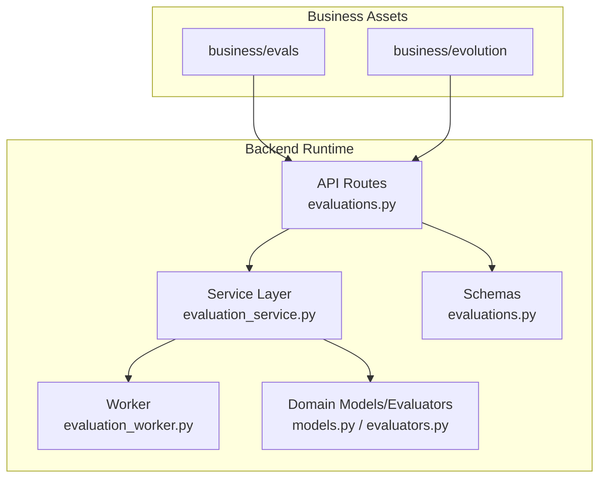
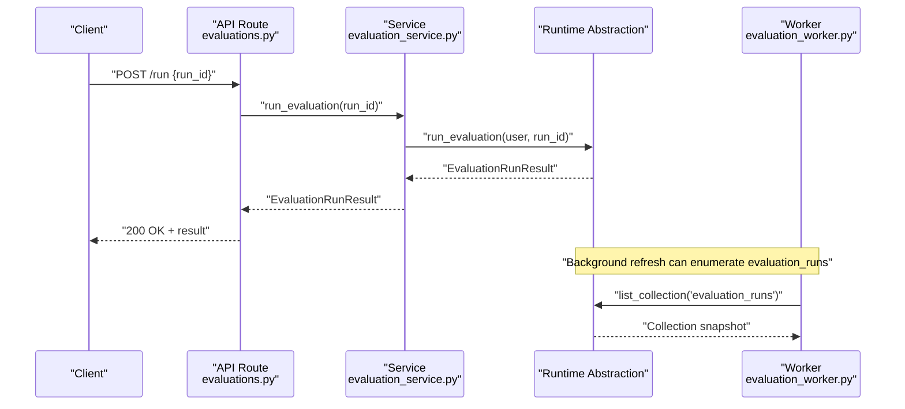
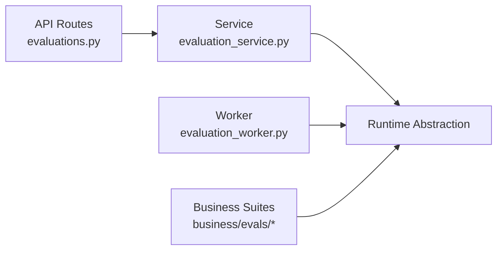
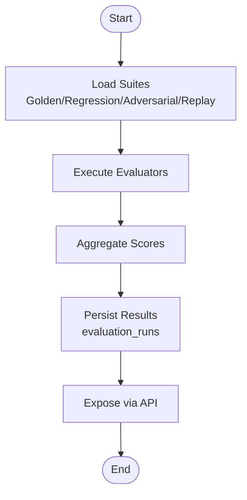

# Fitness Evaluation

<cite>
**Referenced Files in This Document**
- [README.md](file://business/evals/README.md)
- [README.md](file://business/evolution/README.md)
- [evaluation_service.py](file://backend/app/services/evaluation_service.py)
- [evaluation_worker.py](file://backend/app/workers/evaluation_worker.py)
- [evaluations.py](file://backend/app/api/v1/routes/evaluations.py)
- [models.py](file://backend/app/domain/evaluations/models.py)
- [evaluators.py](file://backend/app/domain/evaluations/evaluators.py)
- [evaluations.py](file://backend/app/schemas/evaluations.py)
</cite>

## Table of Contents
1. [Introduction](#introduction)
2. [Project Structure](#project-structure)
3. [Core Components](#core-components)
4. [Architecture Overview](#architecture-overview)
5. [Detailed Component Analysis](#detailed-component-analysis)
6. [Dependency Analysis](#dependency-analysis)
7. [Performance Considerations](#performance-considerations)
8. [Troubleshooting Guide](#troubleshooting-guide)
9. [Conclusion](#conclusion)
10. [Appendices](#appendices)

## Introduction
This document explains the fitness evaluation system used by the evolution sandbox to compare variants against baselines and guide promotion decisions. It covers:
- Multi-suite evaluation framework: golden tasks, regression tests, adversarial testing, and historical replay analysis
- How fitness metrics are calculated, scored, and compared across variants
- Suite loading mechanisms, domain-specific test overlays, and automated quality gates
- Examples for defining custom fitness criteria, interpreting results, and setting promotion thresholds
- Evaluation pipeline architecture and performance benchmarking capabilities

The evaluation system is intentionally non-promoting; it provides evidence and scores that gatekeepers or operators use to decide promotions.

## Project Structure
Evaluation-related assets and runtime components are organized as follows:
- Business evaluation suites (golden tasks, regression tests, adversarial tests, human-review sets, benchmarks, historical replay) live under business/evals
- Evolution sandbox policy and guidance live under business/evolution
- Backend API routes expose listing, detail retrieval, running evaluations, and per-run evaluation queries
- Service layer delegates to a runtime abstraction
- Worker exposes a simple refresh capability over evaluation runs
- Domain modules exist as scaffolding for evaluators and models
- Schemas define request/response contracts



**Diagram sources**
- [evaluations.py:1-32](file://backend/app/api/v1/routes/evaluations.py#L1-L32)
- [evaluation_service.py:1-18](file://backend/app/services/evaluation_service.py#L1-L18)
- [evaluation_worker.py:1-6](file://backend/app/workers/evaluation_worker.py#L1-L6)
- [models.py:1-2](file://backend/app/domain/evaluations/models.py#L1-L2)
- [evaluators.py:1-2](file://backend/app/domain/evaluations/evaluators.py#L1-L2)
- [evaluations.py:1-2](file://backend/app/schemas/evaluations.py#L1-L2)

**Section sources**
- [README.md:1-4](file://business/evals/README.md#L1-L4)
- [README.md:1-4](file://business/evolution/README.md#L1-L4)
- [evaluations.py:1-32](file://backend/app/api/v1/routes/evaluations.py#L1-L32)
- [evaluation_service.py:1-18](file://backend/app/services/evaluation_service.py#L1-L18)
- [evaluation_worker.py:1-6](file://backend/app/workers/evaluation_worker.py#L1-L6)
- [models.py:1-2](file://backend/app/domain/evaluations/models.py#L1-L2)
- [evaluators.py:1-2](file://backend/app/domain/evaluations/evaluators.py#L1-L2)
- [evaluations.py:1-2](file://backend/app/schemas/evaluations.py#L1-L2)

## Core Components
- API endpoints:
  - List evaluations
  - Get evaluation details
  - Run an evaluation by run_id
  - List evaluations associated with a workflow run
- Service layer:
  - Delegates to runtime for permissions and data access
- Worker:
  - Provides a refresh operation over evaluation_runs collection
- Domain scaffolding:
  - Placeholder modules for evaluators and models
- Schemas:
  - Request/response contracts for evaluation operations

Key responsibilities:
- Expose controlled access to evaluation artifacts and execution
- Provide a single entry point to trigger evaluation runs
- Aggregate evaluation results per workflow run for comparison

**Section sources**
- [evaluations.py:1-32](file://backend/app/api/v1/routes/evaluations.py#L1-L32)
- [evaluation_service.py:1-18](file://backend/app/services/evaluation_service.py#L1-L18)
- [evaluation_worker.py:1-6](file://backend/app/workers/evaluation_worker.py#L1-L6)
- [models.py:1-2](file://backend/app/domain/evaluations/models.py#L1-L2)
- [evaluators.py:1-2](file://backend/app/domain/evaluations/evaluators.py#L1-L2)
- [evaluations.py:1-2](file://backend/app/schemas/evaluations.py#L1-L2)

## Architecture Overview
The evaluation pipeline integrates business suite assets with backend runtime services to produce comparable fitness scores across variants.



**Diagram sources**
- [evaluations.py:23-26](file://backend/app/api/v1/routes/evaluations.py#L23-L26)
- [evaluation_service.py:12-13](file://backend/app/services/evaluation_service.py#L12-L13)
- [evaluation_worker.py:4-5](file://backend/app/workers/evaluation_worker.py#L4-L5)

## Detailed Component Analysis

### API Layer: Evaluations Endpoints
Responsibilities:
- Enforce read permissions on evaluation resources
- Accept run requests via a typed payload
- Return aggregated evaluation results for a given run

Key endpoints:
- GET /api/v1/evaluations: list available evaluations
- GET /api/v1/evaluations/{evaluation_id}: fetch details
- POST /api/v1/evaluations/run: execute evaluation for a specific run_id
- GET /api/v1/evaluations/workflow-runs/{run_id}: list evaluations tied to a workflow run

```mermaid
classDiagram
class EvaluationsRouter {
+get("")
+get("/{evaluation_id}")
+post("/run")
+get("/workflow-runs/{run_id}")
}
class EvaluationService {
+list_evaluations(user)
+get_evaluation(user, id)
+run_evaluation(user, run_id)
+list_run_evaluations(user, run_id)
}
class RuntimeAbstraction {
+assert_permission(user, perm)
+list_evaluations(user)
+get_evaluation(user, id)
+run_evaluation(user, run_id)
+list_run_evaluations(user, run_id)
}
EvaluationsRouter --> EvaluationService : "delegates"
EvaluationService --> RuntimeAbstraction : "uses"
```

**Diagram sources**
- [evaluations.py:1-32](file://backend/app/api/v1/routes/evaluations.py#L1-L32)
- [evaluation_service.py:1-18](file://backend/app/services/evaluation_service.py#L1-L18)

**Section sources**
- [evaluations.py:1-32](file://backend/app/api/v1/routes/evaluations.py#L1-L32)
- [evaluation_service.py:1-18](file://backend/app/services/evaluation_service.py#L1-L18)

### Service Layer: Evaluation Orchestration
Responsibilities:
- Centralize user-scoped calls to runtime
- Keep API thin and focused on routing and validation

Behavior:
- Each method forwards the authenticated user and parameters to runtime
- Returns structured results consumed by the API layer

**Section sources**
- [evaluation_service.py:1-18](file://backend/app/services/evaluation_service.py#L1-L18)

### Worker: Refresh and Inventory
Responsibilities:
- Provide a background refresh mechanism
- Enumerate evaluation_runs to keep UI or dashboards current

Operational note:
- The worker uses a generic collection enumeration to count or inspect evaluation runs

**Section sources**
- [evaluation_worker.py:1-6](file://backend/app/workers/evaluation_worker.py#L1-L6)

### Domain Scaffolding: Models and Evaluators
Status:
- Placeholder modules exist for future evaluator implementations and model definitions
- These will host scoring logic, metric aggregations, and variant comparisons

Future extension points:
- Implement concrete evaluators for each suite type (golden, regression, adversarial, replay)
- Define model schemas for evaluation inputs, outputs, and metrics

**Section sources**
- [models.py:1-2](file://backend/app/domain/evaluations/models.py#L1-L2)
- [evaluators.py:1-2](file://backend/app/domain/evaluations/evaluators.py#L1-L2)

### Schemas: Contracts
Responsibilities:
- Define request payloads such as EvaluationRunRequest
- Ensure consistent serialization between client and server

Usage:
- Used by the run endpoint to accept run_id and related metadata

**Section sources**
- [evaluations.py:1-2](file://backend/app/schemas/evaluations.py#L1-L2)

## Dependency Analysis
High-level dependencies:
- API depends on service layer for authorization and orchestration
- Service depends on runtime abstraction for persistence and execution
- Worker depends on runtime abstraction for collection enumeration
- Business assets (eval suites) are external inputs consumed by runtime during evaluation execution



**Diagram sources**
- [evaluations.py:1-32](file://backend/app/api/v1/routes/evaluations.py#L1-L32)
- [evaluation_service.py:1-18](file://backend/app/services/evaluation_service.py#L1-L18)
- [evaluation_worker.py:1-6](file://backend/app/workers/evaluation_worker.py#L1-L6)

**Section sources**
- [evaluations.py:1-32](file://backend/app/api/v1/routes/evaluations.py#L1-L32)
- [evaluation_service.py:1-18](file://backend/app/services/evaluation_service.py#L1-L18)
- [evaluation_worker.py:1-6](file://backend/app/workers/evaluation_worker.py#L1-L6)

## Performance Considerations
- Batched evaluation runs: group multiple runs to reduce overhead when comparing many variants
- Parallelization: evaluate independent suites concurrently where safe
- Result caching: cache stable baseline results to avoid recomputation
- Streaming results: stream partial metrics for long-running suites
- Resource limits: cap concurrency and memory usage per evaluation job
- Indexing: ensure efficient lookup by run_id and workflow_run_id

[No sources needed since this section provides general guidance]

## Troubleshooting Guide
Common issues and checks:
- Permission errors: verify the caller has evaluations:read permission before listing or retrieving details
- Missing run_id: ensure the run request includes a valid run identifier
- Empty results: confirm evaluation_runs collection contains entries after a successful run
- Stale UI state: trigger worker refresh to synchronize evaluation_runs inventory

Operational tips:
- Use the worker’s refresh function to re-enumerate evaluation_runs
- Validate schema compliance for run requests using the defined request model

**Section sources**
- [evaluations.py:11-31](file://backend/app/api/v1/routes/evaluations.py#L11-L31)
- [evaluation_service.py:1-18](file://backend/app/services/evaluation_service.py#L1-L18)
- [evaluation_worker.py:4-5](file://backend/app/workers/evaluation_worker.py#L4-L5)

## Conclusion
The evaluation subsystem provides a secure, extensible foundation for multi-suite fitness assessment within the evolution sandbox. With clear API boundaries, a service layer delegating to runtime, and a worker for background synchronization, teams can implement domain-specific evaluators and integrate them into automated quality gates. Evaluation outcomes inform promotion decisions without automatically promoting changes, aligning with sandbox governance principles.

[No sources needed since this section summarizes without analyzing specific files]

## Appendices

### Multi-Suite Evaluation Framework
- Golden tasks: deterministic scenarios with expected outcomes
- Regression tests: guardrails against regressions across domains
- Adversarial testing: stress and edge-case scenarios
- Historical replay: re-run past runs to detect drift

Policy note:
- Evaluation never promotes a workflow automatically; it supplies evidence for human or policy-based gates

**Section sources**
- [README.md:1-4](file://business/evals/README.md#L1-L4)

### Evolution Sandbox Policy
- Variants must be proposed, tested in sandbox, compared to baseline, approved, canary-deployed, and rolled back on failure
- Direct mutation of production is not allowed by the Evolution Manager

**Section sources**
- [README.md:1-4](file://business/evolution/README.md#L1-L4)

### Defining Custom Fitness Criteria
Steps:
- Add new evaluators in the domain evaluators module
- Define input/output models in the domain models module
- Integrate suite loaders to discover and apply domain-specific overlays
- Wire scoring aggregation into the runtime evaluation flow
- Expose metrics through the existing run and list endpoints

[No sources needed since this section provides general guidance]

### Interpreting Evaluation Results
Guidance:
- Compare variant metrics against baseline across suites
- Track deltas per suite and overall weighted score
- Inspect per-test pass/fail and severity for targeted fixes
- Use historical replay to validate stability over time

[No sources needed since this section provides general guidance]

### Setting Promotion Thresholds
Recommendations:
- Define minimum acceptable scores per suite
- Require no regressions above a threshold in critical suites
- Mandate approval gates for high-risk changes
- Combine quantitative thresholds with qualitative review

[No sources needed since this section provides general guidance]

### Evaluation Pipeline Architecture
Conceptual flow:
- Ingest suites from business/evals
- Execute evaluators against variant codepaths
- Aggregate metrics and produce comparative reports
- Persist results under evaluation_runs for later retrieval



[No sources needed since this diagram shows conceptual workflow, not actual code structure]