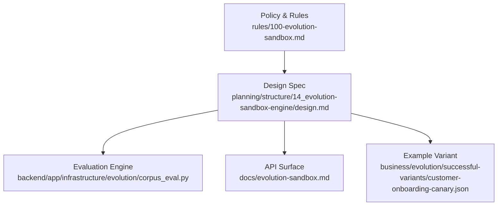
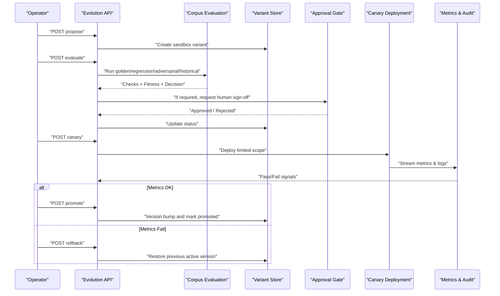
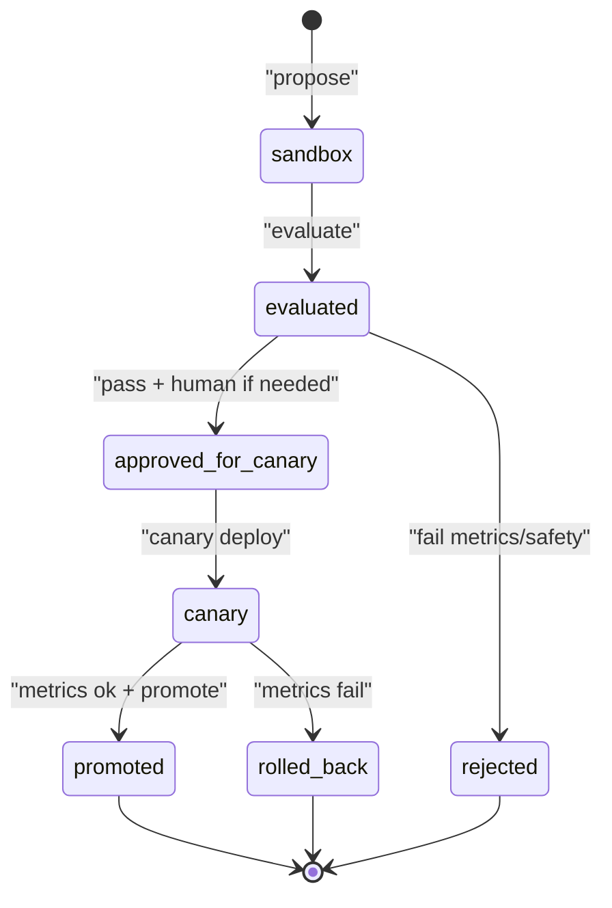
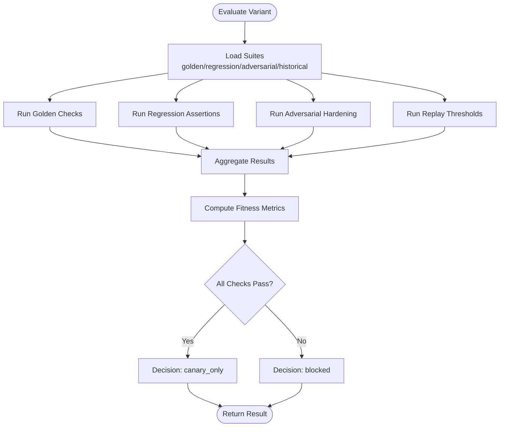
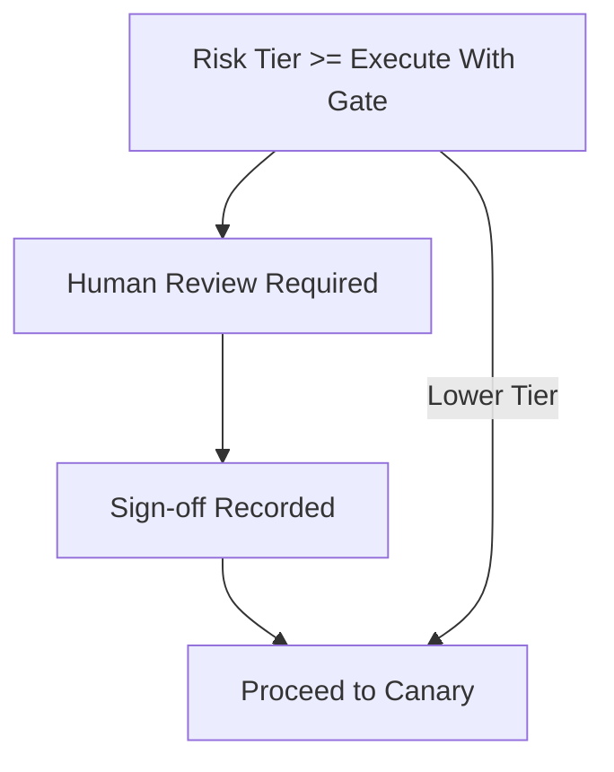
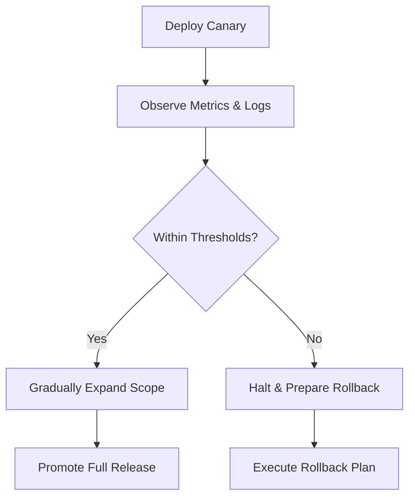
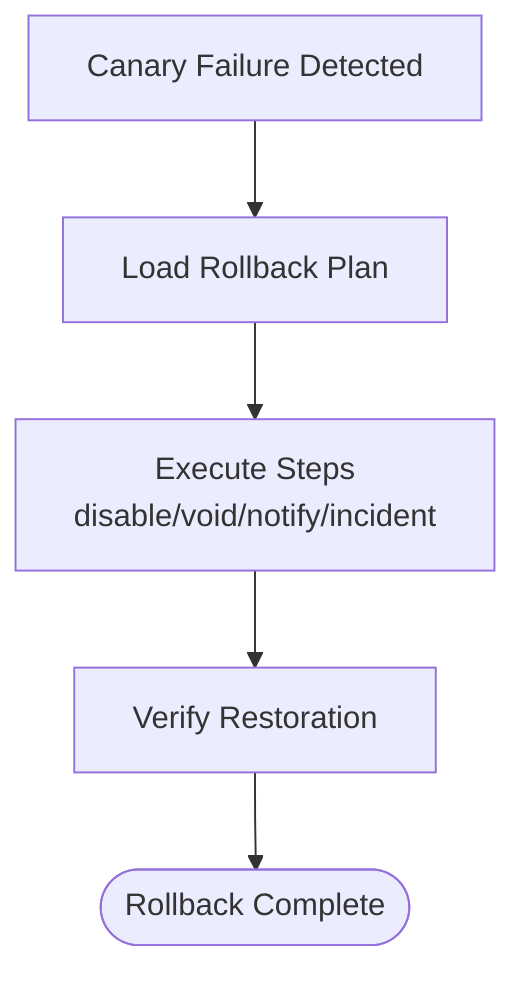
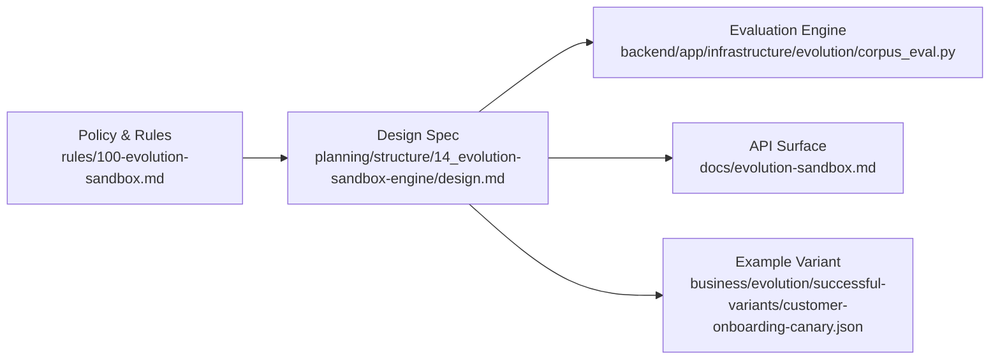

# Promotion Workflow

<cite>
**Referenced Files in This Document**
- [evolution-sandbox.md](file://docs/evolution-sandbox.md)
- [100-evolution-sandbox.md](file://rules/100-evolution-sandbox.md)
- [design.md](file://planning/structure/14_evolution-sandbox-engine/design.md)
- [corpus_eval.py](file://backend/app/infrastructure/evolution/corpus_eval.py)
- [customer-onboarding-canary.json](file://business/evolution/successful-variants/customer-onboarding-canary.json)
</cite>

## Table of Contents
1. [Introduction](#introduction)
2. [Project Structure](#project-structure)
3. [Core Components](#core-components)
4. [Architecture Overview](#architecture-overview)
5. [Detailed Component Analysis](#detailed-component-analysis)
6. [Dependency Analysis](#dependency-analysis)
7. [Performance Considerations](#performance-considerations)
8. [Troubleshooting Guide](#troubleshooting-guide)
9. [Conclusion](#conclusion)
10. [Appendices](#appendices)

## Introduction
This document describes the promotion workflow that moves successful variants from sandbox to production. It covers decision logic, quality gates, approval processes, canary deployment strategies, rollback mechanisms, gradual rollout controls, and integration with governance policies and audit logging. The system enforces a strict separation between sandbox experimentation and production changes: evolution proposes, evaluates, requests approvals, canaries, and rolls back; it never mutates production DNA directly.

## Project Structure
The promotion workflow spans design rules, architecture design, evaluation implementation, and example variant artifacts:
- Policy and rules define non-negotiable constraints (no direct mutation, required checks, approvals).
- Architecture design specifies the state machine, fitness function, pipeline mapping, and API surface.
- Evaluation module runs multi-suite offline checks against on-disk corpora and computes fitness metrics.
- Example artifact demonstrates a canary-ready variant with required fields and approvals.

**Diagram sources**
- [100-evolution-sandbox.md:1-6](file://rules/100-evolution-sandbox.md#L1-L6)
- [design.md:1-186](file://planning/structure/14_evolution-sandbox-engine/design.md#L1-L186)
- [corpus_eval.py:1-329](file://backend/app/infrastructure/evolution/corpus_eval.py#L1-L329)
- [evolution-sandbox.md:1-40](file://docs/evolution-sandbox.md#L1-L40)
- [customer-onboarding-canary.json:1-18](file://business/evolution/successful-variants/customer-onboarding-canary.json#L1-L18)

**Section sources**
- [evolution-sandbox.md:1-40](file://docs/evolution-sandbox.md#L1-L40)
- [100-evolution-sandbox.md:1-6](file://rules/100-evolution-sandbox.md#L1-L6)
- [design.md:1-186](file://planning/structure/14_evolution-sandbox-engine/design.md#L1-L186)
- [corpus_eval.py:1-329](file://backend/app/infrastructure/evolution/corpus_eval.py#L1-L329)
- [customer-onboarding-canary.json:1-18](file://business/evolution/successful-variants/customer-onboarding-canary.json#L1-L18)

## Core Components
- Evolution Sandbox Policy: Enforces sandbox-only proposals, baseline comparisons, regression/adversarial/compliance checks, rollback plans, and approvals before canary rollout.
- Design Specification: Defines the variant lifecycle states, transitions, guards, fitness function, and API endpoints for propose, evaluate, canary, promote, and rollback.
- Corpus Evaluation Engine: Loads golden, regression, adversarial, and historical replay suites; performs structural and behavioral checks; computes fitness metrics; returns promotion decisions.
- Example Canary Variant: Demonstrates required metadata such as baseline reference, test results, compliance status, rollback plan, approval record, risk tier, and status.

Key responsibilities:
- Decision Logic: Determined by suite pass/fail, safety/compliance checks, human approvals, and fitness thresholds.
- Quality Gates: Golden tasks, regression assertions, adversarial hardening, historical replay thresholds.
- Approval Processes: Human sign-off when risk tier requires it; documented in approval records.
- Rollback Mechanisms: Versioned promotions and explicit rollback steps recorded for canary variants.

**Section sources**
- [100-evolution-sandbox.md:1-6](file://rules/100-evolution-sandbox.md#L1-L6)
- [design.md:66-109](file://planning/structure/14_evolution-sandbox-engine/design.md#L66-L109)
- [corpus_eval.py:286-329](file://backend/app/infrastructure/evolution/corpus_eval.py#L286-L329)
- [customer-onboarding-canary.json:1-18](file://business/evolution/successful-variants/customer-onboarding-canary.json#L1-L18)

## Architecture Overview
The promotion workflow follows a controlled progression from proposal through evaluation, optional human review, canary deployment, monitoring, and final promotion or rollback. Direct mutations to production are forbidden at all times.

**Diagram sources**
- [design.md:66-109](file://planning/structure/14_evolution-sandbox-engine/design.md#L66-L109)
- [evolution-sandbox.md:15-22](file://docs/evolution-sandbox.md#L15-L22)
- [corpus_eval.py:286-329](file://backend/app/infrastructure/evolution/corpus_eval.py#L286-L329)

## Detailed Component Analysis

### Variant Lifecycle and State Machine
The variant lifecycle ensures safe progression through well-defined states with explicit guards:
- States: sandbox, evaluated, approved_for_canary, canary, promoted, rolled_back, rejected.
- Transitions: propose, evaluate, fail metrics/safety, pass + human if needed, canary deploy, metrics ok + promote, metrics fail → rollback.
- Guards: Always sandbox_only; forbid direct production writes; require checklist completion.

**Diagram sources**
- [design.md:66-84](file://planning/structure/14_evolution-sandbox-engine/design.md#L66-L84)

**Section sources**
- [design.md:66-84](file://planning/structure/14_evolution-sandbox-engine/design.md#L66-L84)

### Promotion Decision Logic and Quality Gates
Promotion decisions are derived from multi-suite evaluations and policy checks:
- Golden tasks: Structural expectations like human gates and forbidden behaviors.
- Regression tests: Irreversible step gating, rollback presence, no auto-promote.
- Adversarial checks: No production_ready claims in sandbox, no tool wildcards, no skipping gates.
- Historical replay: Thresholds for hallucination rate, unauthorized tool attempts, compliance pass rate.
- Fitness metrics: Suite pass rate, gated/irreversible step coverage, rollback presence.

**Diagram sources**
- [corpus_eval.py:286-329](file://backend/app/infrastructure/evolution/corpus_eval.py#L286-L329)

**Section sources**
- [corpus_eval.py:115-264](file://backend/app/infrastructure/evolution/corpus_eval.py#L115-L264)
- [corpus_eval.py:267-329](file://backend/app/infrastructure/evolution/corpus_eval.py#L267-L329)

### Approval Processes and Governance Integration
- Risk-tier-based approvals: Higher tiers require human sign-off before canary.
- Approval records: Stored alongside variant metadata for traceability.
- Governance alignment: Policies mandate baseline comparison, regression/adversarial/compliance checks, rollback plans, and approvals prior to canary rollout.

**Diagram sources**
- [design.md:112-123](file://planning/structure/14_evolution-sandbox-engine/design.md#L112-L123)
- [customer-onboarding-canary.json:14-16](file://business/evolution/successful-variants/customer-onboarding-canary.json#L14-L16)

**Section sources**
- [design.md:112-123](file://planning/structure/14_evolution-sandbox-engine/design.md#L112-L123)
- [customer-onboarding-canary.json:1-18](file://business/evolution/successful-variants/customer-onboarding-canary.json#L1-L18)

### Canary Deployment Strategies and Gradual Rollout Controls
- Limited scope deployment: Canary targets a constrained subset of traffic or workflows.
- Monitoring: Metrics and logs streamed during canary phase to validate performance and safety.
- Gradual rollout: Controlled expansion based on passing metrics and compliance thresholds.

[No sources needed since this diagram shows conceptual workflow, not actual code structure]

### Rollback Mechanisms
- Explicit rollback plans: Defined per variant, including operational steps and notifications.
- Versioned promotions: Promotions create new versions; rollbacks restore previous active versions.
- Automated triggers: Canary failures trigger rollback execution.

**Diagram sources**
- [customer-onboarding-canary.json:8-13](file://business/evolution/successful-variants/customer-onboarding-canary.json#L8-L13)

**Section sources**
- [customer-onboarding-canary.json:8-13](file://business/evolution/successful-variants/customer-onboarding-canary.json#L8-L13)

### Promotion Criteria: Fitness Scores, Safety Checks, Compliance Validation
- Fitness scores: Derived from suite pass rates, gated/irreversible coverage, and rollback presence.
- Safety checks: Ensure no production_ready claims in sandbox, no bypass flags, no unrestricted tools.
- Compliance validation: Historical replay thresholds enforce minimum compliance pass rates and zero unauthorized tool attempts.

**Section sources**
- [corpus_eval.py:267-329](file://backend/app/infrastructure/evolution/corpus_eval.py#L267-L329)
- [design.md:100-109](file://planning/structure/14_evolution-sandbox-engine/design.md#L100-L109)

### Examples: Configuring Promotion Rules, Handling Failures, Managing Rollbacks
- Configure promotion rules via policy and design spec: Require baseline comparison, regression/adversarial/compliance checks, rollback plans, and approvals before canary.
- Handle promotion failures: Blocked decisions return detailed suite failures; operators must remediate and re-evaluate.
- Manage rollback scenarios: Use stored rollback plans to execute operational steps and notify stakeholders.

**Section sources**
- [100-evolution-sandbox.md:1-6](file://rules/100-evolution-sandbox.md#L1-L6)
- [design.md:100-109](file://planning/structure/14_evolution-sandbox-engine/design.md#L100-L109)
- [customer-onboarding-canary.json:1-18](file://business/evolution/successful-variants/customer-onboarding-canary.json#L1-L18)

## Dependency Analysis
The promotion workflow depends on:
- Policy and rules defining constraints and requirements.
- Design specification detailing state machine, fitness, and APIs.
- Evaluation engine implementing checks and metrics.
- Example variant artifacts demonstrating required metadata.

**Diagram sources**
- [100-evolution-sandbox.md:1-6](file://rules/100-evolution-sandbox.md#L1-L6)
- [design.md:1-186](file://planning/structure/14_evolution-sandbox-engine/design.md#L1-L186)
- [corpus_eval.py:1-329](file://backend/app/infrastructure/evolution/corpus_eval.py#L1-L329)
- [evolution-sandbox.md:1-40](file://docs/evolution-sandbox.md#L1-L40)
- [customer-onboarding-canary.json:1-18](file://business/evolution/successful-variants/customer-onboarding-canary.json#L1-L18)

**Section sources**
- [100-evolution-sandbox.md:1-6](file://rules/100-evolution-sandbox.md#L1-L6)
- [design.md:1-186](file://planning/structure/14_evolution-sandbox-engine/design.md#L1-L186)
- [corpus_eval.py:1-329](file://backend/app/infrastructure/evolution/corpus_eval.py#L1-L329)
- [evolution-sandbox.md:1-40](file://docs/evolution-sandbox.md#L1-L40)
- [customer-onboarding-canary.json:1-18](file://business/evolution/successful-variants/customer-onboarding-canary.json#L1-L18)

## Performance Considerations
- Offline evaluation bounded by disk corpus size and suite complexity; design targets reasonable latency for reference runs.
- Archive queries optimized with indexed variants for quick ranking and retrieval.
- Canary monitoring should stream metrics efficiently to avoid blocking promotion decisions.

[No sources needed since this section provides general guidance]

## Troubleshooting Guide
Common issues and resolutions:
- Blocked promotion due to failed suites: Review suite failure details (golden/regression/adversarial/historical) and remediate structural or behavioral gaps.
- Missing human gate or irreversible step gating: Add required human_gate_required flags or ensure irreversible steps are properly gated.
- Production_ready claimed in sandbox: Remove production_ready flag; sandbox variants must remain sandbox_only.
- Unrestricted tools or bypass flags: Replace wildcards with explicit allowlists; remove bypass_tool_allowlist and skip_human_gates flags.
- Historical replay thresholds exceeded: Investigate hallucination rate, unauthorized tool attempts, and compliance pass rate; adjust safeguards accordingly.

**Section sources**
- [corpus_eval.py:115-264](file://backend/app/infrastructure/evolution/corpus_eval.py#L115-L264)
- [design.md:100-109](file://planning/structure/14_evolution-sandbox-engine/design.md#L100-L109)

## Conclusion
The promotion workflow enforces a rigorous, auditable path from sandbox proposal to production release. Through multi-suite evaluations, fitness scoring, human approvals, canary deployment, and robust rollback mechanisms, the system ensures safety, compliance, and reliability while enabling continuous improvement.

[No sources needed since this section summarizes without analyzing specific files]

## Appendices

### API Surface Summary
- Propose variants (sandbox_only)
- Evaluate variants against corpus
- Promote variants (mode=canary|promote)
- Rollback variants
- Archive population ranked by fitness

**Section sources**
- [evolution-sandbox.md:15-22](file://docs/evolution-sandbox.md#L15-L22)