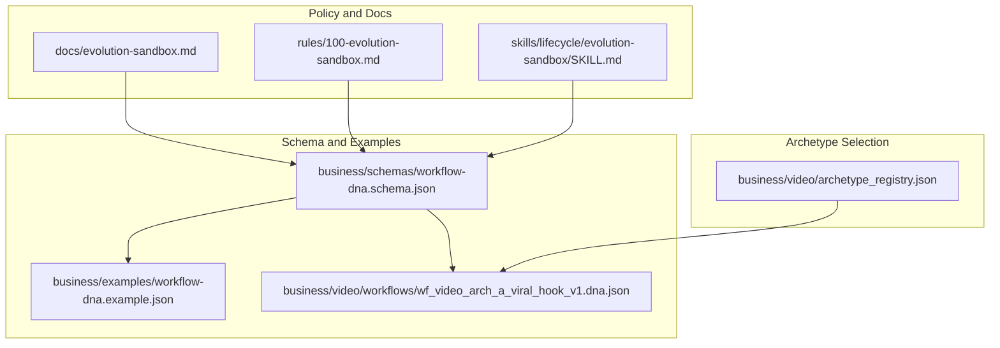
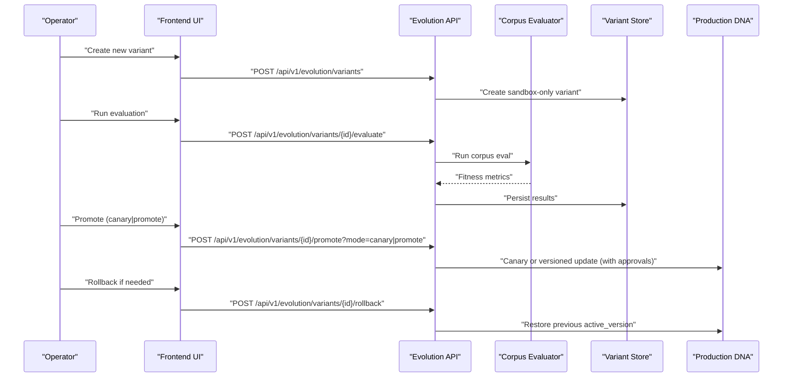
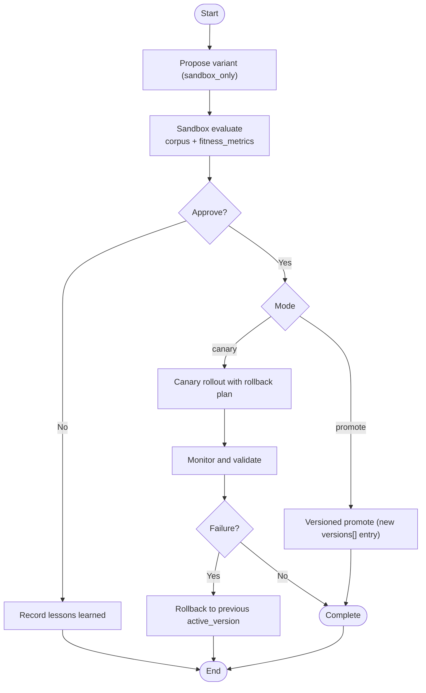
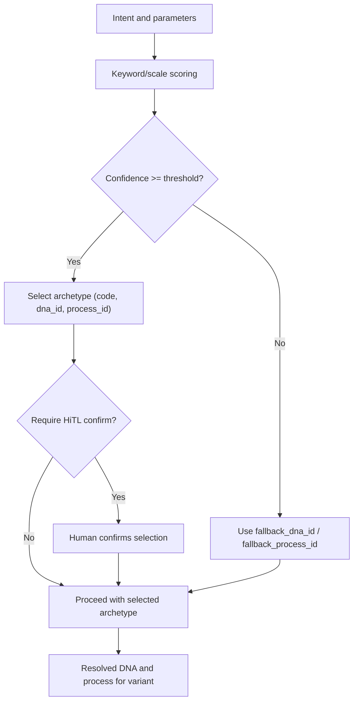
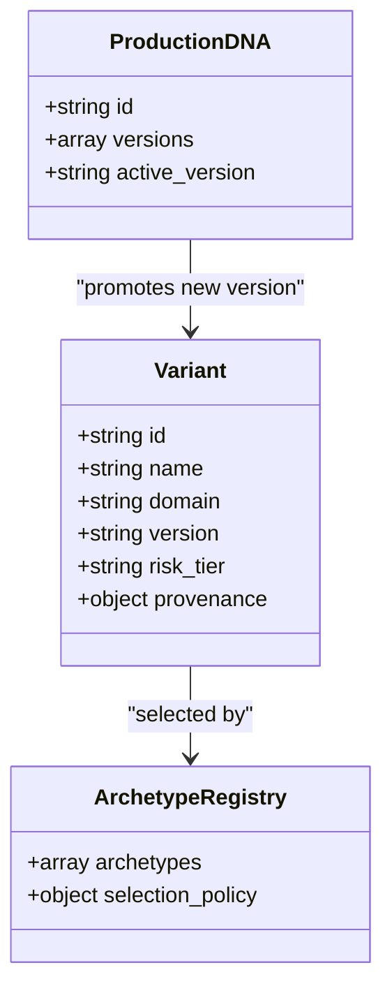
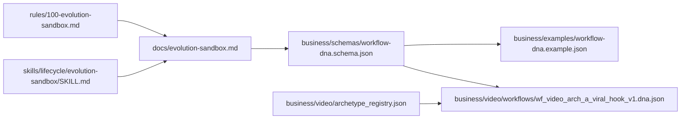

# Variant Management

<cite>
**Referenced Files in This Document**
- [evolution-sandbox.md](file://docs/evolution-sandbox.md)
- [100-evolution-sandbox.md](file://rules/100-evolution-sandbox.md)
- [SKILL.md](file://skills/lifecycle/evolution-sandbox/SKILL.md)
- [workflow-dna.schema.json](file://business/schemas/workflow-dna.schema.json)
- [workflow-dna.example.json](file://business/examples/workflow-dna.example.json)
- [wf_video_arch_a_viral_hook_v1.dna.json](file://business/video/workflows/wf_video_arch_a_viral_hook_v1.dna.json)
- [archetype_registry.json](file://business/video/archetype_registry.json)
</cite>

## Table of Contents
1. [Introduction](#introduction)
2. [Project Structure](#project-structure)
3. [Core Components](#core-components)
4. [Architecture Overview](#architecture-overview)
5. [Detailed Component Analysis](#detailed-component-analysis)
6. [Dependency Analysis](#dependency-analysis)
7. [Performance Considerations](#performance-considerations)
8. [Troubleshooting Guide](#troubleshooting-guide)
9. [Conclusion](#conclusion)
10. [Appendices](#appendices)

## Introduction
This document explains variant management within the evolution sandbox. It covers how to create workflow variants, manage their lifecycle from creation to promotion, and handle versioning. It also documents variant metadata structure, naming conventions, inheritance from parent workflows, archetype selection mechanisms that choose base templates based on workflow characteristics, branching strategies for experimental variants, dependency management, and the relationship between variants and production DNA versions.

The evolution sandbox enforces a strict policy: it never mutates production directly. Instead, it proposes variants, evaluates them against baselines, requires approvals, supports canary deployments, and enables rollback on failure.

## Project Structure
The evolution sandbox is defined by policies, APIs, skills, schemas, and example artifacts:
- Policy and documentation define the sandbox loop and safety constraints.
- Schemas define the Workflow DNA model used by variants.
- Example DNA files illustrate concrete structures and provenance fields.
- Archetype registry maps intent and scale to specific workflow templates.

**Diagram sources**
- [evolution-sandbox.md:1-40](file://docs/evolution-sandbox.md#L1-L40)
- [100-evolution-sandbox.md:1-6](file://rules/100-evolution-sandbox.md#L1-L6)
- [SKILL.md:1-11](file://skills/lifecycle/evolution-sandbox/SKILL.md#L1-L11)
- [workflow-dna.schema.json:1-258](file://business/schemas/workflow-dna.schema.json#L1-L258)
- [workflow-dna.example.json:1-153](file://business/examples/workflow-dna.example.json#L1-L153)
- [wf_video_arch_a_viral_hook_v1.dna.json:1-104](file://business/video/workflows/wf_video_arch_a_viral_hook_v1.dna.json#L1-L104)
- [archetype_registry.json:1-328](file://business/video/archetype_registry.json#L1-L328)

**Section sources**
- [evolution-sandbox.md:1-40](file://docs/evolution-sandbox.md#L1-L40)
- [100-evolution-sandbox.md:1-6](file://rules/100-evolution-sandbox.md#L1-L6)
- [SKILL.md:1-11](file://skills/lifecycle/evolution-sandbox/SKILL.md#L1-L11)

## Core Components
- Evolution Sandbox API surface: propose, evaluate, promote (canary or full), rollback, and archive listing.
- Workflow DNA schema: defines required metadata, steps, guardrails, verification, rollback plan, fitness metrics, and provenance.
- Archetype registry: selects appropriate base template (DNA) based on keywords, scale profiles, and risk tier.
- Example DNA artifacts: demonstrate naming, structure, and provenance linkage.

Key responsibilities:
- Propose creates a sandbox-only variant without mutating production.
- Evaluate runs corpus-based tests and computes fitness metrics.
- Promote applies either canary rollout or versioned promotion with approval gates.
- Rollback restores previous active version and records rollback plans.
- Archive exposes population ranked by fitness for comparison.

**Section sources**
- [evolution-sandbox.md:15-27](file://docs/evolution-sandbox.md#L15-L27)
- [workflow-dna.schema.json:1-258](file://business/schemas/workflow-dna.schema.json#L1-L258)
- [archetype_registry.json:1-328](file://business/video/archetype_registry.json#L1-L328)

## Architecture Overview
The evolution sandbox orchestrates a safe progression from proposal to production via controlled stages.

**Diagram sources**
- [evolution-sandbox.md:15-27](file://docs/evolution-sandbox.md#L15-L27)

## Detailed Component Analysis

### Variant Lifecycle and Version Control
- Creation: Variants are proposed into the sandbox only; direct mutation of production DNA is blocked.
- Evaluation: Corpus evaluation produces fitness metrics for comparison against baseline.
- Promotion: Two modes supported:
  - Canary: limited exposure with rollback plan recorded.
  - Full promote: adds a new version entry with governance checks.
- Rollback: Restores previous active version and logs actions.
- Versioning: Production maintains an ordered list of versions; promotion appends a new version entry rather than overwriting.

**Diagram sources**
- [evolution-sandbox.md:7-13](file://docs/evolution-sandbox.md#L7-L13)
- [100-evolution-sandbox.md:1-6](file://rules/100-evolution-sandbox.md#L1-L6)

**Section sources**
- [evolution-sandbox.md:7-27](file://docs/evolution-sandbox.md#L7-L27)
- [100-evolution-sandbox.md:1-6](file://rules/100-evolution-sandbox.md#L1-L6)

### Variant Metadata Structure and Naming Conventions
- Required top-level fields include identifiers, domain, objective, owner, version, risk_tier, inputs, preconditions, steps, memory_reads, memory_writes, guardrails, verification, rollback, fitness_metrics, audit_log_write_required, and provenance.
- Steps define state transitions, agents, tools, action types, human gate requirements, and irreversibility flags.
- Guardrails enforce conditions for human approval and forbidden actions.
- Verification lists required checks post-execution.
- Rollback specifies reversibility and explicit rollback steps.
- Provenance captures source references, capture agent, and timestamp.

Naming conventions observed:
- IDs follow a pattern like wf_<domain>_<name>_v<version>.
- Versions use semantic-like strings (e.g., major.minor.patch).
- Risk tiers are enumerated and influence gating behavior.

Examples:
- A complete example demonstrates all required sections and provenance linkage.
- An archetype-specific DNA shows depth hints and host executable demo markers.

**Section sources**
- [workflow-dna.schema.json:1-258](file://business/schemas/workflow-dna.schema.json#L1-L258)
- [workflow-dna.example.json:1-153](file://business/examples/workflow-dna.example.json#L1-L153)
- [wf_video_arch_a_viral_hook_v1.dna.json:1-104](file://business/video/workflows/wf_video_arch_a_viral_hook_v1.dna.json#L1-L104)

### Inheritance from Parent Workflows
- Variants inherit structural elements from parent workflows through shared schema and archetype mappings.
- The archetype registry associates process and DNA identifiers, enabling reuse of core flows while allowing targeted modifications in variants.
- Depth and scale profiles guide which parts of the parent flow are fully implemented versus stubbed.

Operational guidance:
- When creating a variant, reference the parent’s DNA path and process_id to maintain alignment.
- Use allowed_scales and default_scale to constrain variant scope relative to the parent.

**Section sources**
- [archetype_registry.json:1-328](file://business/video/archetype_registry.json#L1-L328)
- [wf_video_arch_a_viral_hook_v1.dna.json:1-104](file://business/video/workflows/wf_video_arch_a_viral_hook_v1.dna.json#L1-L104)

### Archetype Selection Mechanisms
The archetype registry provides deterministic selection based on:
- Keywords and negative keywords describing intent.
- Scale profiles defining duration limits, agent budgets, and delivery branches.
- Default and allowed scales per archetype.
- Risk tier and depth indicators.
- Optional fallback DNA/process when classifier confidence is low.

Selection policy highlights:
- Require human-in-the-loop confirmation for certain selections.
- Auto-selection threshold for confidence.
- Fallback to a known spine or process when uncertain.

**Diagram sources**
- [archetype_registry.json:1-328](file://business/video/archetype_registry.json#L1-L328)

**Section sources**
- [archetype_registry.json:1-328](file://business/video/archetype_registry.json#L1-L328)

### Creating Experimental Variants and Branching Strategies
- Create experimental variants by proposing a new sandbox-only variant derived from a parent archetype or spine.
- Use distinct version strings to track iterations (e.g., increment minor or patch).
- Maintain clear provenance linking to parent DNA and relevant design docs.
- For branching strategies:
  - Feature branches: isolate changes tied to a specific improvement goal.
  - Canary branches: narrow rollout paths with explicit rollback plans.
  - Integration branches: merge multiple small improvements before promotion.

Best practices:
- Keep experiments scoped and time-boxed.
- Record lessons learned for every accepted or rejected variant.
- Ensure evaluation corpus includes regression and adversarial cases.

**Section sources**
- [evolution-sandbox.md:1-13](file://docs/evolution-sandbox.md#L1-L13)
- [100-evolution-sandbox.md:1-6](file://rules/100-evolution-sandbox.md#L1-L6)

### Managing Variant Dependencies
- Dependency mapping is achieved via:
  - Provenance source_refs linking to upstream designs and artifacts.
  - Related family references in archetype entries.
  - Process IDs and DNA IDs that tie variants to canonical flows.
- When updating dependencies:
  - Update provenance to reflect new source references.
  - Re-run evaluations to ensure regressions are caught.
  - If changing parent processes, verify step compatibility and tool permissions.

**Section sources**
- [workflow-dna.schema.json:230-255](file://business/schemas/workflow-dna.schema.json#L230-L255)
- [archetype_registry.json:1-328](file://business/video/archetype_registry.json#L1-L328)

### Relationship Between Variants and Production DNA Versions
- Variants do not mutate production directly; they exist in sandbox until approved.
- Promotion adds a new version entry to production rather than replacing existing versions.
- Rollback restores the previous active version, preserving history.
- Fitness metrics and evaluation results inform promotion decisions and help compare variants against baselines.

**Diagram sources**
- [workflow-dna.schema.json:1-258](file://business/schemas/workflow-dna.schema.json#L1-L258)
- [archetype_registry.json:1-328](file://business/video/archetype_registry.json#L1-L328)
- [evolution-sandbox.md:7-13](file://docs/evolution-sandbox.md#L7-L13)

**Section sources**
- [evolution-sandbox.md:7-27](file://docs/evolution-sandbox.md#L7-L27)
- [workflow-dna.schema.json:1-258](file://business/schemas/workflow-dna.schema.json#L1-L258)

## Dependency Analysis
- Policies and skills drive operational constraints and user-facing capabilities.
- Schema governs data integrity across variants and production.
- Archetype registry decouples intent from implementation, enabling automated selection.
- Example DNAs validate schema compliance and provide reusable patterns.

**Diagram sources**
- [100-evolution-sandbox.md:1-6](file://rules/100-evolution-sandbox.md#L1-L6)
- [evolution-sandbox.md:1-40](file://docs/evolution-sandbox.md#L1-L40)
- [SKILL.md:1-11](file://skills/lifecycle/evolution-sandbox/SKILL.md#L1-L11)
- [workflow-dna.schema.json:1-258](file://business/schemas/workflow-dna.schema.json#L1-L258)
- [workflow-dna.example.json:1-153](file://business/examples/workflow-dna.example.json#L1-L153)
- [wf_video_arch_a_viral_hook_v1.dna.json:1-104](file://business/video/workflows/wf_video_arch_a_viral_hook_v1.dna.json#L1-L104)
- [archetype_registry.json:1-328](file://business/video/archetype_registry.json#L1-L328)

**Section sources**
- [100-evolution-sandbox.md:1-6](file://rules/100-evolution-sandbox.md#L1-L6)
- [evolution-sandbox.md:1-40](file://docs/evolution-sandbox.md#L1-L40)
- [SKILL.md:1-11](file://skills/lifecycle/evolution-sandbox/SKILL.md#L1-L11)
- [workflow-dna.schema.json:1-258](file://business/schemas/workflow-dna.schema.json#L1-L258)
- [archetype_registry.json:1-328](file://business/video/archetype_registry.json#L1-L328)

## Performance Considerations
- Prefer canary promotions to limit blast radius and reduce evaluation overhead during rollout.
- Cache corpus evaluation results where possible to speed up re-runs after small changes.
- Use scale profiles to constrain agent budgets and execution time for faster feedback loops.
- Keep provenance concise but sufficient to trace lineage without bloating payloads.

[No sources needed since this section provides general guidance]

## Troubleshooting Guide
Common issues and resolutions:
- Direct mutation attempts: Blocked by policy; use propose endpoint instead.
- Missing required fields: Validate against schema before submission.
- Low classifier confidence: Expect fallback selection; confirm via human-in-the-loop.
- Failed canary rollout: Use rollback endpoint to restore previous active version.
- Regression failures: Review evaluation results and adjust steps or guardrails accordingly.

Operational tips:
- Always record lessons learned for accepted or rejected variants.
- Ensure required_checks align with verification outcomes.
- Verify human_approval_required_if conditions match risk tier and action types.

**Section sources**
- [evolution-sandbox.md:1-40](file://docs/evolution-sandbox.md#L1-L40)
- [100-evolution-sandbox.md:1-6](file://rules/100-evolution-sandbox.md#L1-L6)
- [workflow-dna.schema.json:1-258](file://business/schemas/workflow-dna.schema.json#L1-L258)

## Conclusion
Variant management in the evolution sandbox ensures safe experimentation and controlled promotion. By leveraging the Workflow DNA schema, archetype selection, and strict policies, teams can iterate rapidly while maintaining production stability. Clear provenance, robust evaluation, and disciplined promotion and rollback practices form the backbone of reliable evolution.

[No sources needed since this section summarizes without analyzing specific files]

## Appendices

### API Reference Summary
- POST /api/v1/evolution/variants — propose a sandbox-only variant
- POST /api/v1/evolution/variants/{id}/evaluate — run corpus evaluation
- POST /api/v1/evolution/variants/{id}/promote — mode=canary|promote
- POST /api/v1/evolution/variants/{id}/rollback — restore previous active version
- GET /api/v1/evolution/archive — list population ranked by fitness

**Section sources**
- [evolution-sandbox.md:15-27](file://docs/evolution-sandbox.md#L15-L27)