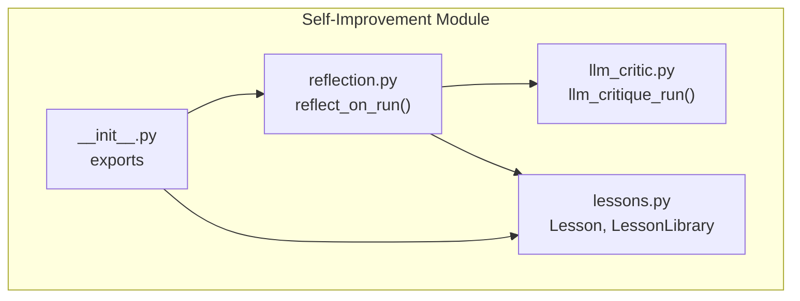
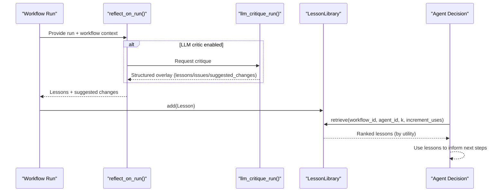
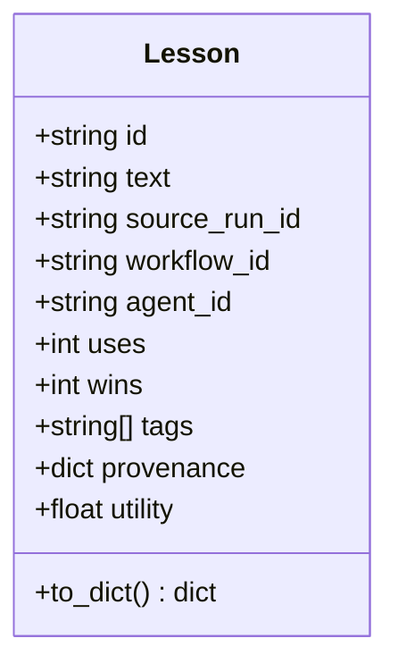
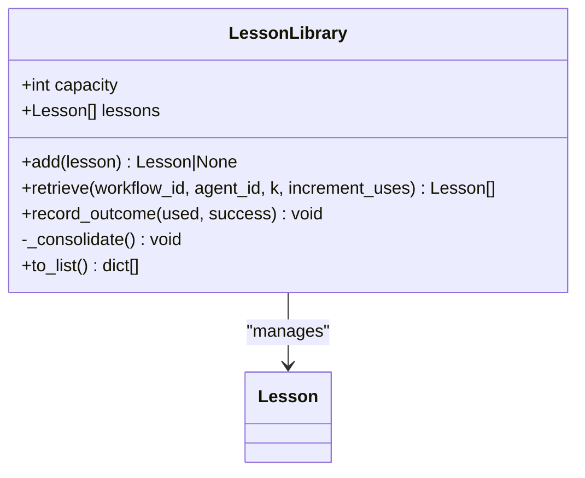
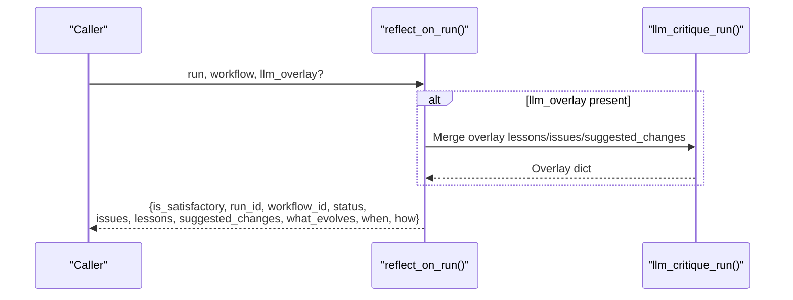
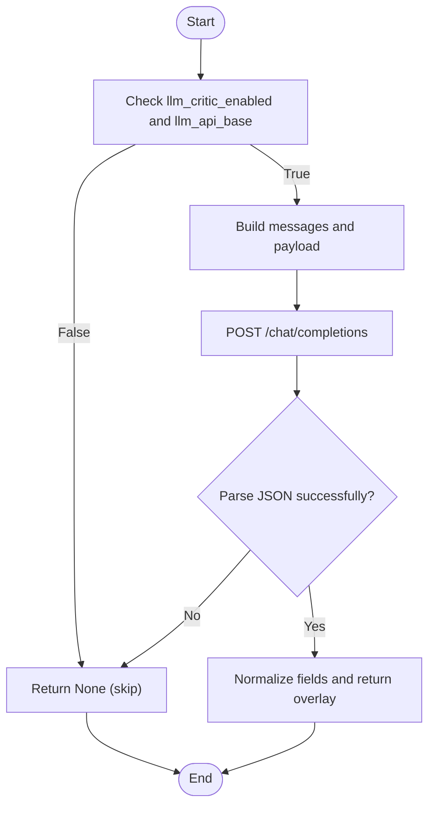
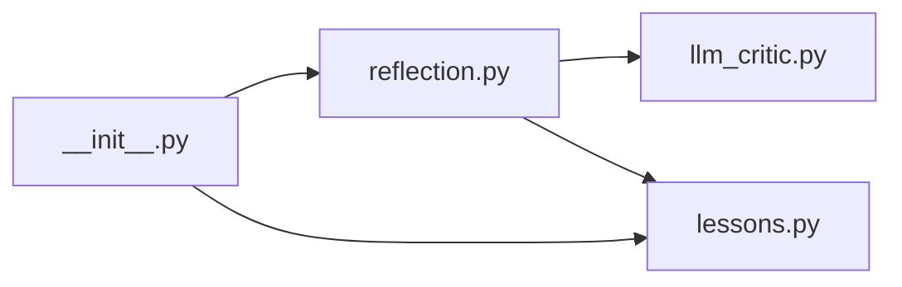

# Reflexion Loops

<cite>
**Referenced Files in This Document**
- [lessons.py](file://backend/app/infrastructure/self_improvement/lessons.py)
- [reflection.py](file://backend/app/infrastructure/self_improvement/reflection.py)
- [llm_critic.py](file://backend/app/infrastructure/self_improvement/llm_critic.py)
- [__init__.py](file://backend/app/infrastructure/self_improvement/__init__.py)
</cite>

## Table of Contents
1. [Introduction](#introduction)
2. [Project Structure](#project-structure)
3. [Core Components](#core-components)
4. [Architecture Overview](#architecture-overview)
5. [Detailed Component Analysis](#detailed-component-analysis)
6. [Dependency Analysis](#dependency-analysis)
7. [Performance Considerations](#performance-considerations)
8. [Troubleshooting Guide](#troubleshooting-guide)
9. [Conclusion](#conclusion)
10. [Appendices](#appendices)

## Introduction
This document explains the reflexion loops that automatically extract lessons from workflow runs and integrate them into agent decision-making. It focuses on:
- The Lesson data model with utility scoring, usage tracking, and win counting
- The LessonLibrary class for storage, scoping by agent/workflow, and capacity management
- How lessons are extracted from successful runs, tagged for categorization, and ranked by utility scores
- Examples of configuring reflexion triggers, customizing extraction criteria, and integrating lessons into agents

The implementation is rule-based and deterministic by default, with an optional LLM critic overlay to enrich insights without compromising safety or reproducibility.

## Project Structure
The reflexion loop components live under a focused self-improvement module:
- Reflection engine: produces structured lessons and suggested changes from run artifacts
- Optional LLM critic: augments rule-based reflection when enabled
- Lesson library: stores, scopes, ranks, and manages capacity of lessons

**Diagram sources**
- [reflection.py:1-116](file://backend/app/infrastructure/self_improvement/reflection.py#L1-L116)
- [llm_critic.py:1-81](file://backend/app/infrastructure/self_improvement/llm_critic.py#L1-L81)
- [lessons.py:1-111](file://backend/app/infrastructure/self_improvement/lessons.py#L1-L111)
- [__init__.py:1-5](file://backend/app/infrastructure/self_improvement/__init__.py#L1-L5)

**Section sources**
- [reflection.py:1-116](file://backend/app/infrastructure/self_improvement/reflection.py#L1-L116)
- [llm_critic.py:1-81](file://backend/app/infrastructure/self_improvement/llm_critic.py#L1-L81)
- [lessons.py:1-111](file://backend/app/infrastructure/self_improvement/lessons.py#L1-L111)
- [__init__.py:1-5](file://backend/app/infrastructure/self_improvement/__init__.py#L1-L5)

## Core Components
- Lesson: A lightweight record capturing text, provenance, tags, and counters (uses, wins). Utility is computed as a smoothed win rate to balance exploration and exploitation.
- LessonLibrary: In-memory store with deduplication, scoping by agent_id and workflow_id, retrieval ranked by utility, automatic increment of uses on read, win recording on success, and capacity-based pruning.
- reflect_on_run: Rule-based analyzer that emits lessons, issues, and suggested changes based on run status, step outcomes, and evaluation policy.
- llm_critique_run: Optional external critique that merges additional lessons and suggestions while preserving rule-based safety outputs.

Key behaviors:
- Utility scoring: (wins + 1) / (uses + 2)
- Usage tracking: retrieve(..., increment_uses=True) increments uses for returned lessons
- Win counting: record_outcome(used, success=True) increments wins for used lessons
- Scoping: retrieve can filter by agent_id and/or workflow_id; strict scoping when agent_id is set
- Capacity management: _consolidate prunes to top-k by utility when over capacity

**Section sources**
- [lessons.py:11-54](file://backend/app/infrastructure/self_improvement/lessons.py#L11-L54)
- [lessons.py:56-111](file://backend/app/infrastructure/self_improvement/lessons.py#L56-L111)
- [reflection.py:11-116](file://backend/app/infrastructure/self_improvement/reflection.py#L11-L116)
- [llm_critic.py:10-81](file://backend/app/infrastructure/self_improvement/llm_critic.py#L10-L81)

## Architecture Overview
The reflexion loop integrates at post-run time:
- The reflection engine inspects run artifacts and emits lessons and suggested changes
- Optionally, an LLM critic augments these outputs
- Lessons are added to the LessonLibrary, which maintains scope, ranking, and capacity
- Agents retrieve scoped lessons before decisions, using utility-ranked results

**Diagram sources**
- [reflection.py:11-116](file://backend/app/infrastructure/self_improvement/reflection.py#L11-L116)
- [llm_critic.py:17-81](file://backend/app/infrastructure/self_improvement/llm_critic.py#L17-L81)
- [lessons.py:56-111](file://backend/app/infrastructure/self_improvement/lessons.py#L56-L111)

## Detailed Component Analysis

### Lesson Data Model
- Fields: id, text, source_run_id, workflow_id, agent_id, uses, wins, tags, provenance
- Utility property: computes a smoothed win rate to rank lessons
- Serialization: to_dict returns a stable representation including rounded utility
- Deserialization: lesson_from_dict constructs instances from persisted dicts

Complexity:
- O(1) for utility computation
- O(1) for serialization/deserialization per instance

Optimization opportunities:
- Cache utility if frequently accessed
- Normalize tags and provenance keys for consistent scoping

Error handling:
- Defensive defaults for missing fields during deserialization

**Section sources**
- [lessons.py:11-54](file://backend/app/infrastructure/self_improvement/lessons.py#L11-L54)

#### Class Diagram

**Diagram sources**
- [lessons.py:11-54](file://backend/app/infrastructure/self_improvement/lessons.py#L11-L54)

### LessonLibrary Management
Responsibilities:
- Add with deduplication by text + workflow_id + agent_id
- Retrieve with scoping by agent_id and/or workflow_id, ranked by utility
- Increment uses on retrieval when requested
- Record wins upon successful outcomes
- Consolidate by capacity, keeping highest utility lessons
- Export list for persistence

Scoping behavior:
- If agent_id is provided, only lessons for that agent are considered
- If workflow_id is provided, lessons are narrowed to that workflow; if agent_id is also set, no fallback to other agents’ lessons

Capacity management:
- When size exceeds capacity, sort by utility descending and truncate to capacity

Complexity:
- add: O(n) scan for duplicates; O(n log n) consolidation when over capacity
- retrieve: O(n log n) sort by utility; slicing to k
- record_outcome: O(k) for used lessons

Edge cases:
- Empty pools after scoping return empty lists
- Deduplication prevents duplicate entries with identical content and scope

**Section sources**
- [lessons.py:56-111](file://backend/app/infrastructure/self_improvement/lessons.py#L56-L111)

#### Class Diagram

**Diagram sources**
- [lessons.py:56-111](file://backend/app/infrastructure/self_improvement/lessons.py#L56-L111)

### Reflection Engine (Rule-Based)
Behavior:
- Inspects run status, failed/waiting steps, errors, and evaluation policy
- Emits lessons and issues describing failures, human gates, and evaluation blocks
- Suggests concrete changes such as aligning tool allowlists or enabling block_on_fail
- Merges optional LLM overlay without dropping rule-based safety lessons
- Returns a structured result including what evolves and timing metadata

Integration points:
- Can be invoked after any run completion or failure
- Works offline deterministically; LLM overlay is optional

**Section sources**
- [reflection.py:11-116](file://backend/app/infrastructure/self_improvement/reflection.py#L11-L116)

#### Sequence Diagram

**Diagram sources**
- [reflection.py:11-116](file://backend/app/infrastructure/self_improvement/reflection.py#L11-L116)
- [llm_critic.py:17-81](file://backend/app/infrastructure/self_improvement/llm_critic.py#L17-L81)

### Optional LLM Critic
Behavior:
- Checks settings for availability (feature flag and API base)
- Calls OpenAI-compatible chat endpoint with structured prompt
- Parses JSON response and normalizes fields
- Returns None on skip/failure, allowing safe fallback to rule-based reflection

Configuration:
- Requires feature flag and API base; optional API key for authorization
- Uses low temperature for stability and enforces JSON output

Safety:
- Never recommends bypassing human gates or auto-promotion
- Preserves rule-based lessons even when LLM overlay is active

**Section sources**
- [llm_critic.py:10-81](file://backend/app/infrastructure/self_improvement/llm_critic.py#L10-L81)

#### Flowchart

**Diagram sources**
- [llm_critic.py:10-81](file://backend/app/infrastructure/self_improvement/llm_critic.py#L10-L81)

## Dependency Analysis
Module-level dependencies:
- __init__.py exports reflect_on_run and LessonLibrary for consumers
- reflection.py depends on llm_critic.py for optional overlay
- lessons.py is independent and consumed by both reflection and higher layers

**Diagram sources**
- [__init__.py:1-5](file://backend/app/infrastructure/self_improvement/__init__.py#L1-L5)
- [reflection.py:1-116](file://backend/app/infrastructure/self_improvement/reflection.py#L1-L116)
- [llm_critic.py:1-81](file://backend/app/infrastructure/self_improvement/llm_critic.py#L1-L81)
- [lessons.py:1-111](file://backend/app/infrastructure/self_improvement/lessons.py#L1-L111)

**Section sources**
- [__init__.py:1-5](file://backend/app/infrastructure/self_improvement/__init__.py#L1-L5)
- [reflection.py:1-116](file://backend/app/infrastructure/self_improvement/reflection.py#L1-L116)
- [llm_critic.py:1-81](file://backend/app/infrastructure/self_improvement/llm_critic.py#L1-L81)
- [lessons.py:1-111](file://backend/app/infrastructure/self_improvement/lessons.py#L1-L111)

## Performance Considerations
- Utility computation is O(1); prefer caching if repeatedly accessed
- Retrieval sorts all scoped lessons; consider indexing by agent_id and workflow_id for large libraries
- Capacity pruning occurs only when exceeding capacity; tune capacity to balance memory and recall
- Avoid unnecessary use increments by passing increment_uses=False when reading for diagnostics

[No sources needed since this section provides general guidance]

## Troubleshooting Guide
Common issues and resolutions:
- No lessons retrieved: verify scoping filters (agent_id/workflow_id) and ensure lessons exist within scope
- Low utility scores: increase wins via successful outcomes or reduce noise by refining extraction criteria
- Duplicate lessons: confirm deduplication keys include text, workflow_id, and agent_id
- LLM overlay not applied: check feature flag and API base configuration; inspect network timeouts and JSON parsing errors

Operational checks:
- Confirm record_outcome is called with success=True only for genuinely successful runs
- Validate that retrieve(..., increment_uses=True) is used when you intend to track usage counts

**Section sources**
- [lessons.py:56-111](file://backend/app/infrastructure/self_improvement/lessons.py#L56-L111)
- [llm_critic.py:10-81](file://backend/app/infrastructure/self_improvement/llm_critic.py#L10-L81)

## Conclusion
The reflexion loop provides a robust, deterministic foundation for learning from workflow runs, with optional LLM augmentation. Lessons are scored, tracked, and scoped to support informed agent decisions. By tuning scoping, capacity, and extraction criteria, teams can evolve workflows and agent behavior safely and effectively.

[No sources needed since this section summarizes without analyzing specific files]

## Appendices

### Configuring Reflexion Triggers
- Enable LLM critic via settings flags and API base
- Invoke reflect_on_run after each run completion or failure
- Merge LLM overlay when available; otherwise rely on rule-based outputs

**Section sources**
- [llm_critic.py:10-81](file://backend/app/infrastructure/self_improvement/llm_critic.py#L10-L81)
- [reflection.py:11-116](file://backend/app/infrastructure/self_improvement/reflection.py#L11-L116)

### Customizing Lesson Extraction Criteria
- Adjust rule-based logic in reflect_on_run to emit domain-specific lessons
- Tag lessons with meaningful categories for improved scoping and filtering
- Capture provenance details to trace back to source runs and contexts

**Section sources**
- [reflection.py:11-116](file://backend/app/infrastructure/self_improvement/reflection.py#L11-L116)

### Integrating Lessons into Agent Decision-Making
- Before making decisions, retrieve top-k lessons scoped by agent_id and workflow_id
- Use utility-ranked lessons to guide tool selection, parameter tuning, or process adjustments
- Record outcomes to update win counts and improve future rankings

**Section sources**
- [lessons.py:56-111](file://backend/app/infrastructure/self_improvement/lessons.py#L56-L111)