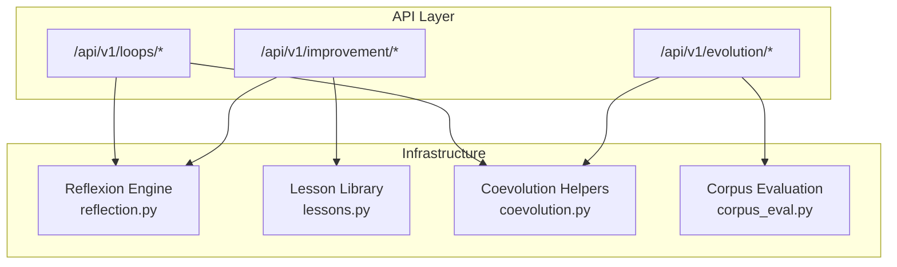
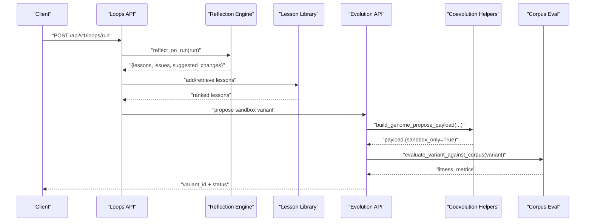
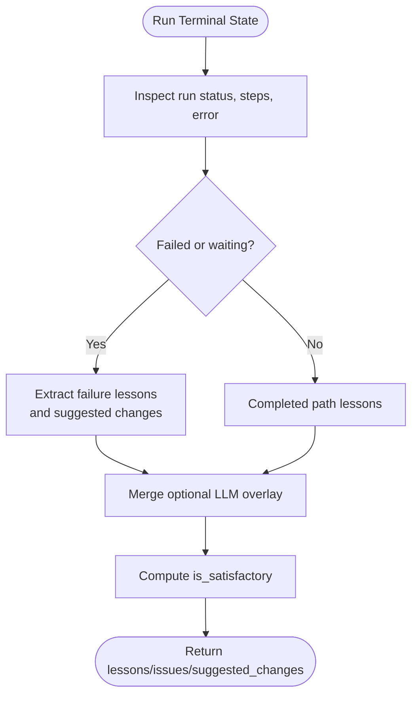
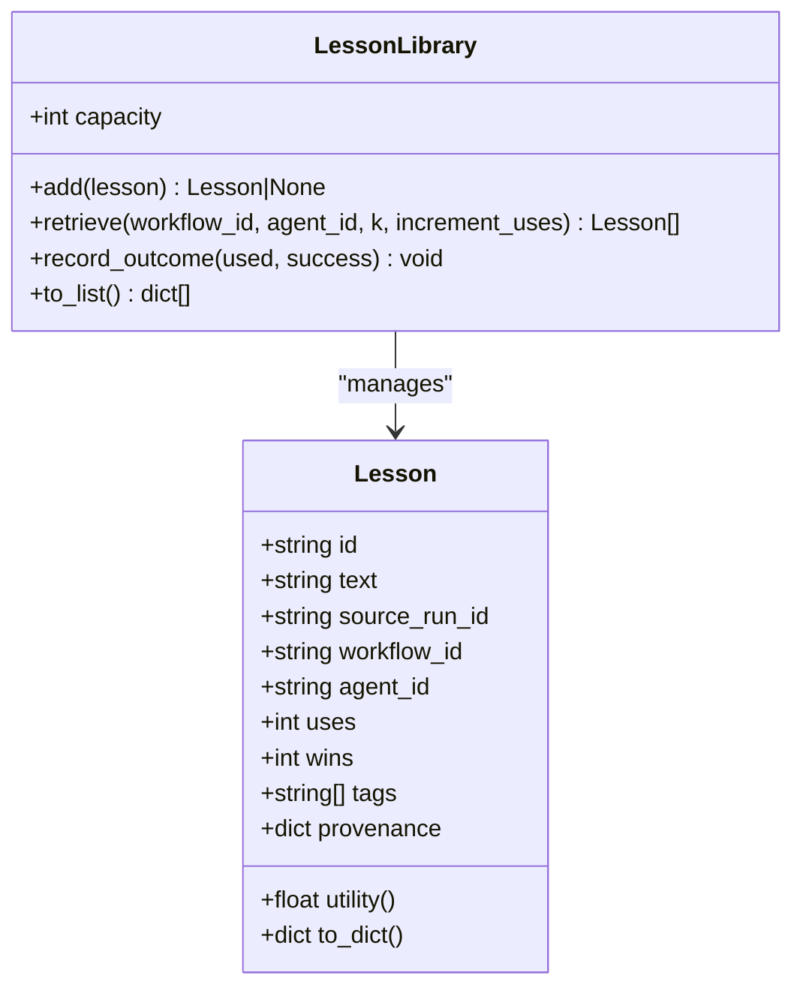
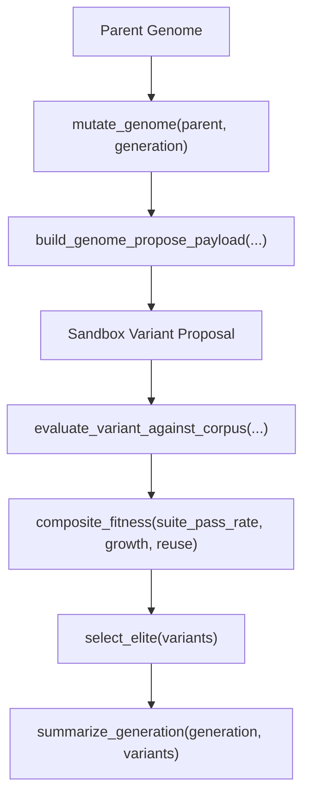
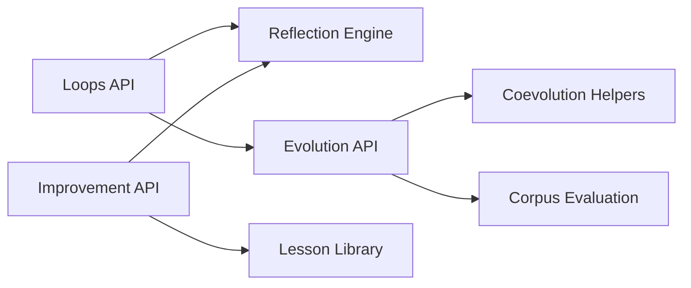

# Self-Improvement & Evolution

<cite>
**Referenced Files in This Document**
- [self-improvement-and-orchestration.md](file://docs/self-improvement-and-orchestration.md)
- [reflection.py](file://backend/app/infrastructure/self_improvement/reflection.py)
- [lessons.py](file://backend/app/infrastructure/self_improvement/lessons.py)
- [__init__.py (self_improvement)](file://backend/app/infrastructure/self_improvement/__init__.py)
- [coevolution.py](file://backend/app/infrastructure/evolution/coevolution.py)
- [corpus_eval.py](file://backend/app/infrastructure/evolution/corpus_eval.py)
- [__init__.py (evolution)](file://backend/app/infrastructure/evolution/__init__.py)
- [loops.py](file://backend/app/api/v1/routes/loops.py)
- [evolution.py](file://backend/app/api/v1/routes/evolution.py)
</cite>

## Table of Contents
1. Introduction
2. Project Structure
3. Core Components
4. Architecture Overview
5. Detailed Component Analysis
6. Dependency Analysis
7. Performance Considerations
8. Troubleshooting Guide
9. Conclusion
10. Appendices

## Introduction
This document explains the self-improvement and evolution capabilities that enable safe, governed learning from workflow runs. It covers:
- Reflexion loops for automatic lesson extraction after workflow executions
- An evolution sandbox for canary-safe experimentation with variant proposals
- Variant creation, fitness evaluation against a corpus, and promotion controls
- Skill proposal generation, lesson library management, and knowledge growth tracking
- Practical examples to configure improvement loops, run evolution experiments, and promote successful variants

The system is designed to be deterministic and sandbox-first, ensuring production DNA is never mutated directly without empirical validation and human gates.

## Project Structure
Self-improvement and evolution are implemented as infrastructure modules with API routes exposing controlled operations:
- Self-improvement: reflection engine and lesson library
- Evolution: coevolution helpers and corpus evaluation utilities
- Loop engineering: loop runner and orchestration endpoints
- API routes: /api/v1/improvement/*, /api/v1/loops/*, /api/v1/evolution/*

**Diagram sources**
- [loops.py](file://backend/app/api/v1/routes/loops.py)
- [evolution.py](file://backend/app/api/v1/routes/evolution.py)
- [reflection.py](file://backend/app/infrastructure/self_improvement/reflection.py)
- [lessons.py](file://backend/app/infrastructure/self_improvement/lessons.py)
- [coevolution.py](file://backend/app/infrastructure/evolution/coevolution.py)
- [corpus_eval.py](file://backend/app/infrastructure/evolution/corpus_eval.py)

**Section sources**
- [self-improvement-and-orchestration.md](file://docs/self-improvement-and-orchestration.md)

## Core Components
- Reflexion engine: analyzes completed or failed runs to extract lessons and suggested changes; supports optional LLM overlay for richer critique while preserving rule-based safety lessons.
- Lesson library: stores lessons with utility scoring, scoped retrieval by agent/workflow, outcome recording, and capacity-based consolidation.
- Coevolution helpers: deterministic genome mutation, composite fitness computation, elite selection, and payload building for sandbox-only variant proposals.
- Corpus evaluation: evaluates variants against an evaluation corpus to produce pass rates and structured metrics.
- Loop engineering: orchestrates prompt → observe → verify → iterate cycles around workflow runs with isolation and stopping conditions.

Key responsibilities and interactions:
- After each run, reflexion produces lessons and change suggestions.
- Lessons are persisted and scored; successful usage increases wins.
- Coevolution proposes sandbox variants with lineage and non-production flags.
- Fitness combines suite performance, knowledge growth, and lesson reuse.
- APIs expose controlled entry points for reflection, loop execution, and evolution.

**Section sources**
- [reflection.py](file://backend/app/infrastructure/self_improvement/reflection.py)
- [lessons.py](file://backend/app/infrastructure/self_improvement/lessons.py)
- [coevolution.py](file://backend/app/infrastructure/evolution/coevolution.py)
- [corpus_eval.py](file://backend/app/infrastructure/evolution/corpus_eval.py)
- [loops.py](file://backend/app/api/v1/routes/loops.py)
- [evolution.py](file://backend/app/api/v1/routes/evolution.py)

## Architecture Overview
The architecture separates concerns into API routes, infrastructure engines, and data artifacts:
- API routes provide controlled endpoints for loops, evolution, and improvement.
- Infrastructure modules implement deterministic logic for reflection, lesson management, coevolution, and corpus evaluation.
- Artifacts include lessons, variant genomes, and evaluation results stored under evolution directories.

**Diagram sources**
- [loops.py](file://backend/app/api/v1/routes/loops.py)
- [evolution.py](file://backend/app/api/v1/routes/evolution.py)
- [reflection.py](file://backend/app/infrastructure/self_improvement/reflection.py)
- [lessons.py](file://backend/app/infrastructure/self_improvement/lessons.py)
- [coevolution.py](file://backend/app/infrastructure/evolution/coevolution.py)
- [corpus_eval.py](file://backend/app/infrastructure/evolution/corpus_eval.py)

## Detailed Component Analysis

### Reflexion Engine
Purpose:
- Extract lessons from workflow runs based on status, step outcomes, and errors.
- Generate suggested changes aligned with governance rules (e.g., tool allow-list alignment, evaluation policy hardening).
- Support optional LLM overlay to enrich lessons while preserving rule-based outputs.

Behavior highlights:
- Detects failed steps, approval waits, and completion states.
- Produces structured lessons and issues; marks satisfactoriness based on outcomes.
- Returns metadata including what evolves (memory vs. DNA proposal), when (inter_episode), and how (rule_based or rule_based+llm_critic).

**Diagram sources**
- [reflection.py](file://backend/app/infrastructure/self_improvement/reflection.py)

**Section sources**
- [reflection.py](file://backend/app/infrastructure/self_improvement/reflection.py)

### Lesson Library
Purpose:
- Store lessons with provenance and utility scoring.
- Provide scoped retrieval by agent_id and workflow_id.
- Record outcomes to increase utility over time.

Data model:
- Lesson fields: id, text, source_run_id, workflow_id, agent_id, uses, wins, tags, provenance.
- Utility formula: (wins + 1) / (uses + 2).
- Capacity-based consolidation keeps top-scoring lessons.

Operations:
- add: deduplicate by text and scope; consolidate if over capacity.
- retrieve: rank by utility; increment uses optionally.
- record_outcome: update wins on success.
- to_list: serialize lessons.

**Diagram sources**
- [lessons.py](file://backend/app/infrastructure/self_improvement/lessons.py)

**Section sources**
- [lessons.py](file://backend/app/infrastructure/self_improvement/lessons.py)
- [__init__.py (self_improvement)](file://backend/app/infrastructure/self_improvement/__init__.py)

### Coevolution Helpers
Purpose:
- Generate sandbox-only variant proposals deterministically.
- Compute composite fitness combining suite pass rate, knowledge growth, and lesson reuse.
- Select elites and summarize generations.

Key functions:
- mutate_genome: increments version, adjusts temperature/exploration traits, marks sandbox_only.
- build_genome_propose_payload: constructs variant payload with lineage and non-production flags.
- composite_fitness: weighted combination of suite_pass_rate, knowledge_growth_norm, lesson_reuse_norm.
- select_elite: chooses best variant by composite_fitness or suite_pass_rate fallback.
- summarize_generation: aggregates generation stats and elite metrics.

**Diagram sources**
- [coevolution.py](file://backend/app/infrastructure/evolution/coevolution.py)
- [corpus_eval.py](file://backend/app/infrastructure/evolution/corpus_eval.py)

**Section sources**
- [coevolution.py](file://backend/app/infrastructure/evolution/coevolution.py)
- [__init__.py (evolution)](file://backend/app/infrastructure/evolution/__init__.py)

### Corpus Evaluation
Purpose:
- Load evaluation corpus and evaluate variants against it.
- Produce pass rates and structured metrics used by composite fitness.

Integration:
- Used by evolution pipeline to score sandbox variants before any promotion consideration.
- Metrics feed into coevolution’s composite_fitness calculation.

**Section sources**
- [corpus_eval.py](file://backend/app/infrastructure/evolution/corpus_eval.py)
- [__init__.py (evolution)](file://backend/app/infrastructure/evolution/__init__.py)

### Loop Engineering Runner
Purpose:
- Orchestrate governed improvement loops around workflow runs.
- Isolate each loop run, generate steps, evaluate outcomes, and stop based on configured conditions.

Lifecycle:
- Trigger via API endpoint.
- Observe run status and collect lessons.
- Verify via evaluation harness and stop rules.
- Iterate or terminate based on max_iterations, success, fail_budget, escalation.

**Section sources**
- [loops.py](file://backend/app/api/v1/routes/loops.py)
- [self-improvement-and-orchestration.md](file://docs/self-improvement-and-orchestration.md)

### API Surface
Controlled endpoints for self-improvement and evolution:
- POST /api/v1/improvement/reflect/{run_id}: Extract lessons from a run.
- GET /api/v1/improvement/lessons: List lesson library entries.
- POST /api/v1/improvement/auto-propose: Propose sandbox variant from failures.
- POST /api/v1/loops/run: Start governed improvement loop.
- GET /api/v1/loops/{id}: Loop run status.
- POST /api/v1/knowledge/graph/extract/{document_id}: Build graph from doc.
- GET /api/v1/knowledge/graph/query: Seed + neighborhood.
- GET /api/v1/knowledge/graph/gaps: Gap detection.

These endpoints coordinate reflection, lesson storage, variant proposal, and evaluation.

**Section sources**
- [self-improvement-and-orchestration.md](file://docs/self-improvement-and-orchestration.md)
- [loops.py](file://backend/app/api/v1/routes/loops.py)
- [evolution.py](file://backend/app/api/v1/routes/evolution.py)

## Dependency Analysis
Component relationships and coupling:
- API routes depend on infrastructure modules for core logic.
- Reflection depends on run state and optional LLM overlay; does not mutate production DNA.
- Lesson library is independent and provides retrieval and scoring services.
- Coevolution depends on corpus evaluation to compute fitness.
- Loop runner coordinates reflection and evolution endpoints.

**Diagram sources**
- [loops.py](file://backend/app/api/v1/routes/loops.py)
- [evolution.py](file://backend/app/api/v1/routes/evolution.py)
- [reflection.py](file://backend/app/infrastructure/self_improvement/reflection.py)
- [lessons.py](file://backend/app/infrastructure/self_improvement/lessons.py)
- [coevolution.py](file://backend/app/infrastructure/evolution/coevolution.py)
- [corpus_eval.py](file://backend/app/infrastructure/evolution/corpus_eval.py)

**Section sources**
- [loops.py](file://backend/app/api/v1/routes/loops.py)
- [evolution.py](file://backend/app/api/v1/routes/evolution.py)
- [reflection.py](file://backend/app/infrastructure/self_improvement/reflection.py)
- [lessons.py](file://backend/app/infrastructure/self_improvement/lessons.py)
- [coevolution.py](file://backend/app/infrastructure/evolution/coevolution.py)
- [corpus_eval.py](file://backend/app/infrastructure/evolution/corpus_eval.py)

## Performance Considerations
- Deterministic algorithms: Reflection and coevolution use rule-based and deterministic computations to avoid non-deterministic overhead.
- Capacity-limited lesson library: Consolidation ensures bounded memory usage and fast retrieval.
- Composite fitness normalization: Growth and reuse metrics are normalized to prevent dominance by single factors.
- Sandbox-only mutations: Variants are marked sandbox_only and production_ready=False to avoid heavy production-side checks during experimentation.

[No sources needed since this section provides general guidance]

## Troubleshooting Guide
Common issues and resolutions:
- No lessons extracted: Ensure run has terminal state and steps populated; check for missing error fields.
- Low lesson utility: Increase wins by applying lessons successfully; review agent/workflow scoping.
- Variant not proposed: Confirm auto-propose triggers and suggested_changes exist; verify sandbox_only flag is set.
- Fitness low: Improve suite pass rate, increase knowledge growth count, or boost lesson reuse rate.
- Loop stuck: Check stopping conditions (max_iterations, fail_budget); inspect observed statuses and verification results.

Operational tips:
- Use GET /api/v1/improvement/lessons to audit lessons and their utility scores.
- Review variant lineage and fitness_metrics to understand progression.
- Keep human gates enabled for irreversible steps per governance rules.

**Section sources**
- [reflection.py](file://backend/app/infrastructure/self_improvement/reflection.py)
- [lessons.py](file://backend/app/infrastructure/self_improvement/lessons.py)
- [coevolution.py](file://backend/app/infrastructure/evolution/coevolution.py)
- [self-improvement-and-orchestration.md](file://docs/self-improvement-and-orchestration.md)

## Conclusion
The self-improvement and evolution subsystem provides a governed, sandbox-first approach to learning from workflow runs. Reflexion extracts actionable lessons, the lesson library tracks utility and outcomes, and coevolution generates safe variant proposals evaluated against a corpus. The loop engineering runner orchestrates these components with clear isolation and stopping conditions, enabling continuous, empirical improvement without risking production stability.

[No sources needed since this section summarizes without analyzing specific files]

## Appendices

### Examples

- Configure improvement loops:
  - Trigger via POST /api/v1/loops/run with parameters defining start/continue prompts, isolation context, and stopping conditions.
  - Monitor status via GET /api/v1/loops/{id}.

- Run evolution experiments:
  - Use POST /api/v1/improvement/auto-propose to propose sandbox variants from failures.
  - Evaluate variants using evaluate_variant_against_corpus through the evolution API.
  - Review fitness_metrics and composite_fitness to assess progress.

- Promote successful variants:
  - Promotion requires passing empirical validation and human gates.
  - Ensure production_ready remains False until approved; auto_promote must remain disabled by default.
  - Archive successful variants and track lineage for auditability.

**Section sources**
- [loops.py](file://backend/app/api/v1/routes/loops.py)
- [evolution.py](file://backend/app/api/v1/routes/evolution.py)
- [coevolution.py](file://backend/app/infrastructure/evolution/coevolution.py)
- [self-improvement-and-orchestration.md](file://docs/self-improvement-and-orchestration.md)