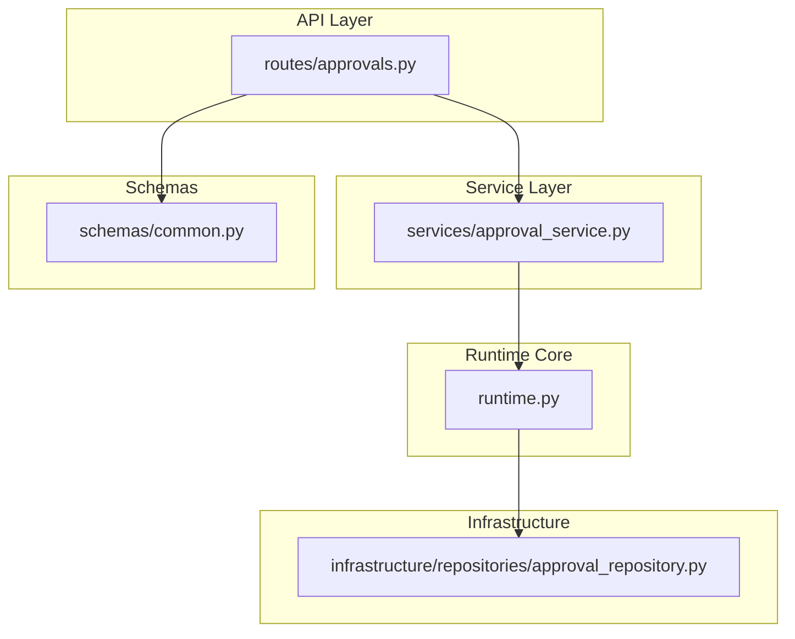
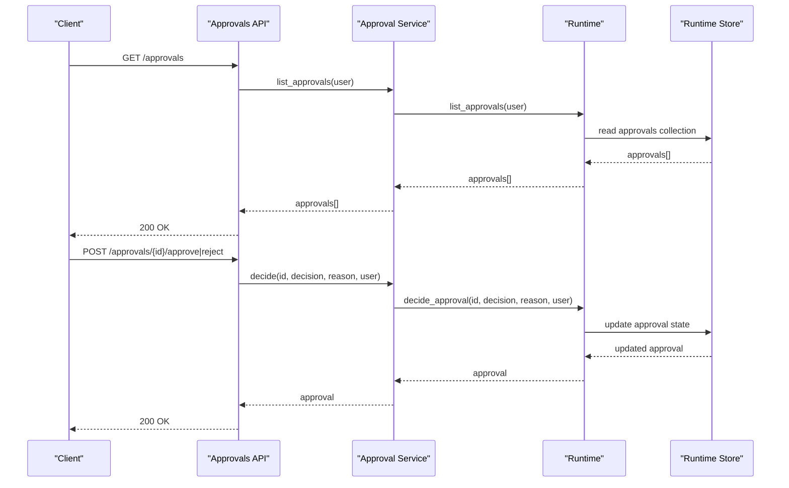
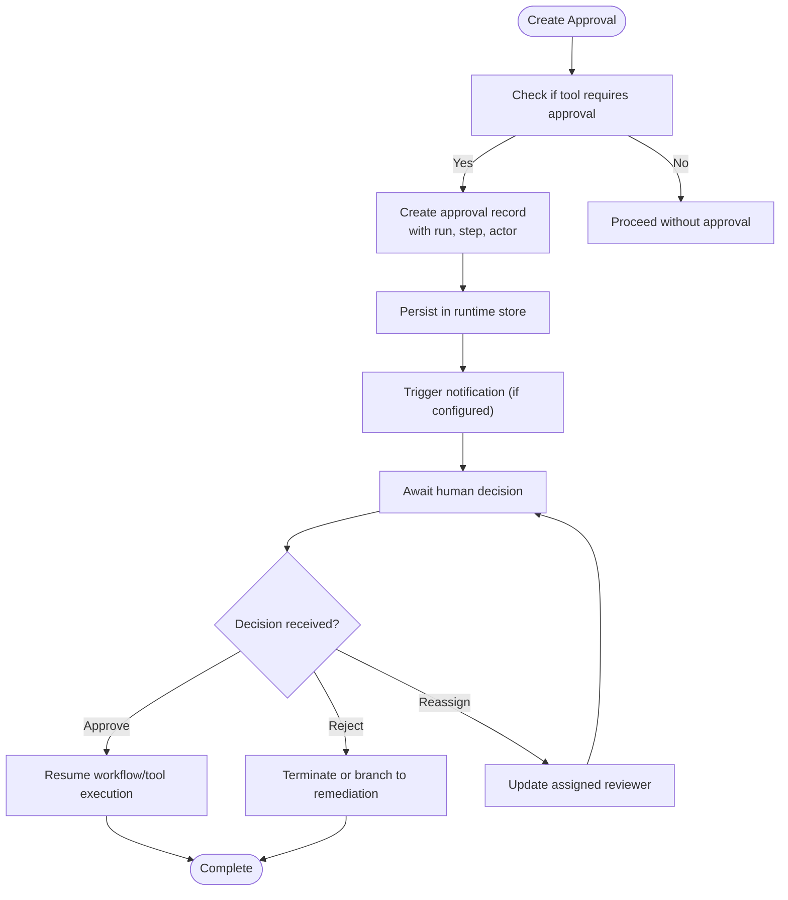
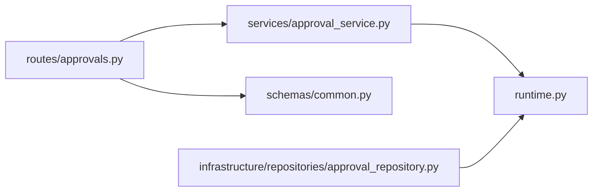

# Approval Gates & Human-in-the-Loop

<cite>
**Referenced Files in This Document**
- [runtime.py](file://backend/app/runtime.py)
- [approval_service.py](file://backend/app/services/approval_service.py)
- [approvals.py](file://backend/app/api/v1/routes/approvals.py)
- [common.py](file://backend/app/schemas/common.py)
- [approval_repository.py](file://backend/app/infrastructure/repositories/approval_repository.py)
</cite>

## Table of Contents
1. [Introduction](#introduction)
2. [Project Structure](#project-structure)
3. [Core Components](#core-components)
4. [Architecture Overview](#architecture-overview)
5. [Detailed Component Analysis](#detailed-component-analysis)
6. [Dependency Analysis](#dependency-analysis)
7. [Performance Considerations](#performance-considerations)
8. [Troubleshooting Guide](#troubleshooting-guide)
9. [Conclusion](#conclusion)
10. [Appendices](#appendices)

## Introduction
This document explains how approval gates and human-in-the-loop controls are implemented within the system’s workflows. It covers:
- How to configure approval points and define approver roles and permissions
- How escalation policies can be modeled and enforced
- The end-to-end lifecycle from request creation to decision recording
- Integration with notifications, UI components, and audit logging
- Examples of single approver, multi-level approvals, and conditional approvals based on workflow context

The implementation is centered around a runtime-managed approval store, role-based permissions, and API endpoints that expose listing, viewing, deciding, and reassigning approvals.

## Project Structure
Approval-related functionality spans several layers:
- API routes for listing, viewing, approving, rejecting, and reassigning approvals
- A thin service layer delegating to the runtime
- Runtime logic for creating, querying, and resolving approvals
- Schemas for request payloads
- A repository helper for collection access



**Diagram sources**
- [approvals.py:1-41](file://backend/app/api/v1/routes/approvals.py#L1-L41)
- [approval_service.py:1-18](file://backend/app/services/approval_service.py#L1-L18)
- [runtime.py:2210-2360](file://backend/app/runtime.py#L2210-L2360)
- [common.py:154-160](file://backend/app/schemas/common.py#L154-L160)
- [approval_repository.py:1-6](file://backend/app/infrastructure/repositories/approval_repository.py#L1-L6)

**Section sources**
- [approvals.py:1-41](file://backend/app/api/v1/routes/approvals.py#L1-L41)
- [approval_service.py:1-18](file://backend/app/services/approval_service.py#L1-L18)
- [runtime.py:2210-2360](file://backend/app/runtime.py#L2210-L2360)
- [common.py:154-160](file://backend/app/schemas/common.py#L154-L160)
- [approval_repository.py:1-6](file://backend/app/infrastructure/repositories/approval_repository.py#L1-L6)

## Core Components
- Approval API routes: Provide endpoints to list approvals, fetch details, approve, reject, reassign, and submit arbitrary decisions.
- Approval service: Thin facade over runtime methods for approvals.
- Runtime approval engine: Creates approvals when required by tools/workflows, lists them, resolves decisions, and supports reassignment.
- Request schemas: Define payloads for decisions and reassignments.
- Repository helper: Accesses the approvals collection via runtime.

Key responsibilities:
- Enforce RBAC before exposing or mutating approvals
- Persist approvals in the runtime store (Postgres-backed JSONB or file fallback)
- Record decisions and reasons
- Support reassignment to another user

**Section sources**
- [approvals.py:1-41](file://backend/app/api/v1/routes/approvals.py#L1-L41)
- [approval_service.py:1-18](file://backend/app/services/approval_service.py#L1-L18)
- [runtime.py:2210-2360](file://backend/app/runtime.py#L2210-L2360)
- [common.py:154-160](file://backend/app/schemas/common.py#L154-L160)
- [approval_repository.py:1-6](file://backend/app/infrastructure/repositories/approval_repository.py#L1-L6)

## Architecture Overview
The approval flow integrates with workflow execution and tool gating. When a step requires human review, the runtime creates an approval record. Operators or reviewers interact via the API to decide or reassign. Decisions are persisted and can trigger downstream actions.



**Diagram sources**
- [approvals.py:11-41](file://backend/app/api/v1/routes/approvals.py#L11-L41)
- [approval_service.py:1-18](file://backend/app/services/approval_service.py#L1-L18)
- [runtime.py:2210-2360](file://backend/app/runtime.py#L2210-L2360)

## Detailed Component Analysis

### API Routes: Approvals
Endpoints:
- List approvals
- Get approval detail
- Approve
- Reject
- Reassign reviewer
- Submit decision (generic)

Behavior:
- All endpoints require authentication and enforce RBAC using runtime permission checks.
- Decision endpoints accept a structured payload including optional reason.
- Reassignment updates the assigned reviewer.

```mermaid
classDiagram
class ApprovalsRouter {
+GET ""
+GET "/{approval_id}"
+POST "/{approval_id}/approve"
+POST "/{approval_id}/reject"
+POST "/{approval_id}/reassign"
+POST "/{approval_id}/decision"
}
class ApprovalService {
+list_approvals(user)
+get_approval(user, id)
+decide(id, decision, reason, user)
+reassign(id, reviewer_user_id, user)
}
class Runtime {
+list_approvals(user)
+get_approval(user, id)
+decide_approval(id, decision, reason, user)
+reassign_approval(id, reviewer_user_id, user)
}
ApprovalsRouter --> ApprovalService : "delegates"
ApprovalService --> Runtime : "calls"
```

**Diagram sources**
- [approvals.py:1-41](file://backend/app/api/v1/routes/approvals.py#L1-L41)
- [approval_service.py:1-18](file://backend/app/services/approval_service.py#L1-L18)
- [runtime.py:2210-2360](file://backend/app/runtime.py#L2210-L2360)

**Section sources**
- [approvals.py:1-41](file://backend/app/api/v1/routes/approvals.py#L1-L41)

### Service Layer: Approval Service
Responsibilities:
- Expose simple functions for listing, fetching, deciding, and reassigning approvals
- Forward calls to runtime with current user context

Design notes:
- Minimal abstraction; keeps API layer clean and testable
- Centralizes runtime interaction for approvals

**Section sources**
- [approval_service.py:1-18](file://backend/app/services/approval_service.py#L1-L18)

### Runtime: Approval Engine
Key capabilities:
- Create approvals when tool execution requires human gate
- List and retrieve approvals for authenticated users
- Decide approvals (approve/reject or custom decision)
- Reassign approvals to other users
- Compute approval delays metrics

Permissions:
- Roles include owner, admin, manager, operator, reviewer, viewer, service_account
- Approval-specific permissions: approvals:read, approvals:approve, approvals:reject

Error handling:
- Specialized error types for approval-required scenarios and validation failures



**Diagram sources**
- [runtime.py:883-900](file://backend/app/runtime.py#L883-L900)
- [runtime.py:2210-2360](file://backend/app/runtime.py#L2210-L2360)

**Section sources**
- [runtime.py:112-129](file://backend/app/runtime.py#L112-L129)
- [runtime.py:140-222](file://backend/app/runtime.py#L140-L222)
- [runtime.py:2210-2360](file://backend/app/runtime.py#L2210-L2360)
- [runtime.py:2785-2820](file://backend/app/runtime.py#L2785-L2820)

### Schemas: Approval Requests
Request models:
- ApprovalDecisionRequest: carries decision and optional reason
- ApprovalReassignRequest: carries target reviewer user ID

Usage:
- Validated at API layer before invoking service/runtime

**Section sources**
- [common.py:154-160](file://backend/app/schemas/common.py#L154-L160)

### Infrastructure: Approval Repository Helper
Purpose:
- Provides a convenience function to list approvals via runtime collections

Note:
- Most operations go through runtime directly; this helper exists for collection access patterns

**Section sources**
- [approval_repository.py:1-6](file://backend/app/infrastructure/repositories/approval_repository.py#L1-L6)

## Dependency Analysis
High-level dependencies:
- API routes depend on service layer and schemas
- Service depends on runtime
- Runtime manages persistence and business logic
- Repository helper uses runtime for collection access



**Diagram sources**
- [approvals.py:1-41](file://backend/app/api/v1/routes/approvals.py#L1-L41)
- [approval_service.py:1-18](file://backend/app/services/approval_service.py#L1-L18)
- [runtime.py:2210-2360](file://backend/app/runtime.py#L2210-L2360)
- [common.py:154-160](file://backend/app/schemas/common.py#L154-L160)
- [approval_repository.py:1-6](file://backend/app/infrastructure/repositories/approval_repository.py#L1-L6)

**Section sources**
- [approvals.py:1-41](file://backend/app/api/v1/routes/approvals.py#L1-L41)
- [approval_service.py:1-18](file://backend/app/services/approval_service.py#L1-L18)
- [runtime.py:2210-2360](file://backend/app/runtime.py#L2210-L2360)
- [common.py:154-160](file://backend/app/schemas/common.py#L154-L160)
- [approval_repository.py:1-6](file://backend/app/infrastructure/repositories/approval_repository.py#L1-L6)

## Performance Considerations
- Use Postgres-backed runtime store for concurrency and durability; JSON file fallback is suitable for local/dev.
- Keep approval queries scoped to the current user to minimize data exposure and improve performance.
- Avoid polling-heavy UIs; prefer server-sent events or websockets where available to reduce load.
- Batch notifications and audit writes to avoid excessive I/O during high-throughput runs.

[No sources needed since this section provides general guidance]

## Troubleshooting Guide
Common issues and resolutions:
- Permission denied when accessing approvals: Ensure the user has approvals:read or appropriate action permissions.
- Approval not created: Verify the tool or step indicates it requires human gate and that the runtime path to create approvals is invoked.
- Decision not applied: Confirm the approval is still pending and the caller has approvals:approve or approvals:reject.
- Reassignment fails: Validate the target reviewer exists and has approvals:read (and optionally approvals:approve/reject).

Operational tips:
- Inspect approval delays endpoint to identify bottlenecks.
- Review audit logs for approval lifecycle events.
- For local development, ensure runtime.json or Postgres is accessible and writable.

**Section sources**
- [runtime.py:112-129](file://backend/app/runtime.py#L112-L129)
- [runtime.py:140-222](file://backend/app/runtime.py#L140-L222)
- [runtime.py:2785-2820](file://backend/app/runtime.py#L2785-L2820)

## Conclusion
The approval system provides a robust foundation for human-in-the-loop controls across workflows. With clear RBAC, straightforward APIs, and a resilient runtime store, teams can implement single approver, multi-level, and conditional approval patterns. Extending notifications, UI components, and audit logging ensures transparency and operational visibility.

[No sources needed since this section summarizes without analyzing specific files]

## Appendices

### Configuring Approval Points
- Mark steps or tools as requiring human gate so the runtime creates approvals automatically.
- Use governance policy fields to specify which steps require gates.

**Section sources**
- [runtime.py:883-900](file://backend/app/runtime.py#L883-L900)
- [runtime.py:714-720](file://backend/app/runtime.py#L714-L720)

### Defining Approver Roles and Permissions
- Assign users roles such as reviewer, manager, admin, or owner.
- Ensure roles include approvals:read and approvals:approve/reject as needed.

**Section sources**
- [runtime.py:140-222](file://backend/app/runtime.py#L140-L222)

### Setting Up Escalation Policies
- Model escalation by reassigning approvals to higher-authority users after timeouts.
- Use approval delays metrics to detect and escalate overdue items.

**Section sources**
- [runtime.py:2325-2360](file://backend/app/runtime.py#L2325-L2360)
- [runtime.py:2785-2820](file://backend/app/runtime.py#L2785-L2820)

### Approval Workflow Lifecycle
- Creation: Triggered by gated tools/steps
- Notification: Optional integration point for alerts
- Decision: Approve, reject, or custom decision
- Resolution: Resume workflow or terminate/branch
- Audit: Log all actions for compliance

**Section sources**
- [runtime.py:2210-2360](file://backend/app/runtime.py#L2210-L2360)

### Integrations
- Notifications: Emit events or messages when approvals are created or decided
- UI: Build dashboards to list, filter, and act on approvals
- Audit: Record decisions, reasons, and timestamps

**Section sources**
- [runtime.py:2210-2360](file://backend/app/runtime.py#L2210-L2360)

### Approval Patterns
- Single approver: One reviewer decides per approval
- Multi-level approvals: Chain approvals by creating subsequent approvals upon prior decisions
- Conditional approvals: Gate based on workflow context (e.g., risk tier, tool sensitivity)

**Section sources**
- [runtime.py:883-900](file://backend/app/runtime.py#L883-L900)
- [runtime.py:714-720](file://backend/app/runtime.py#L714-L720)