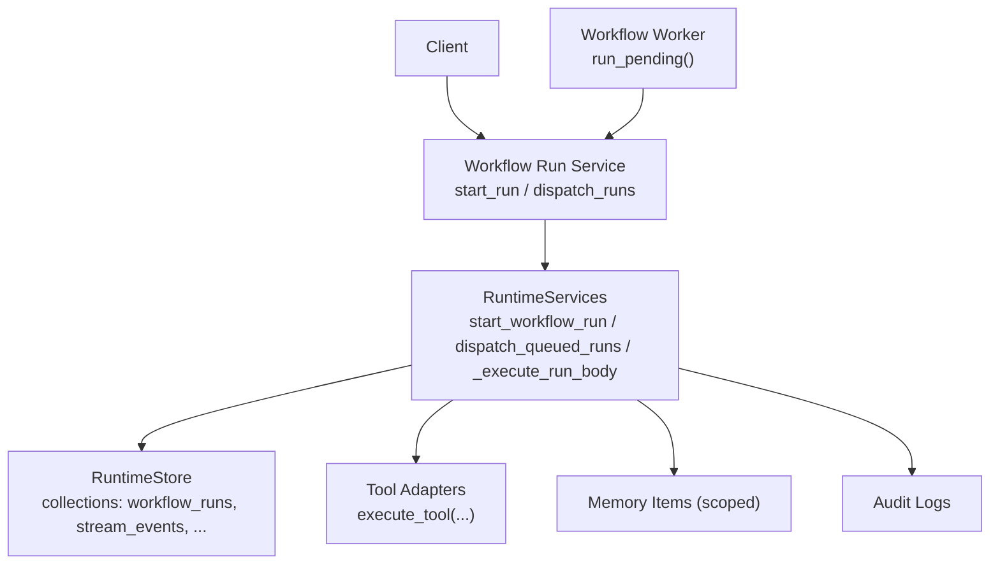
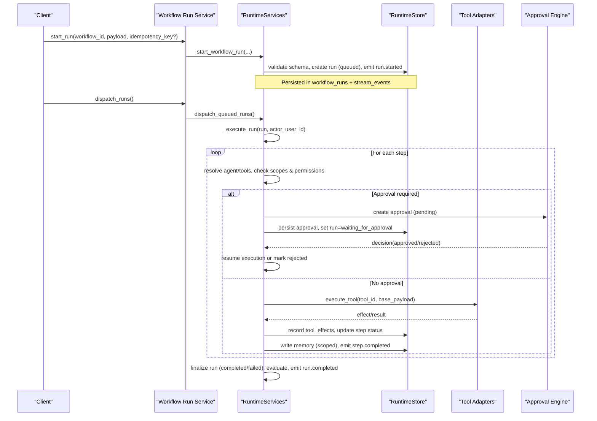
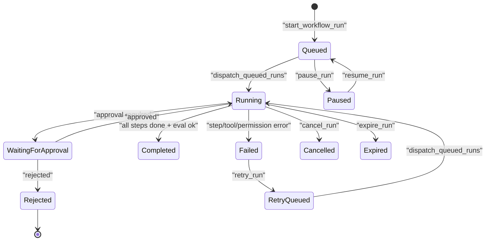
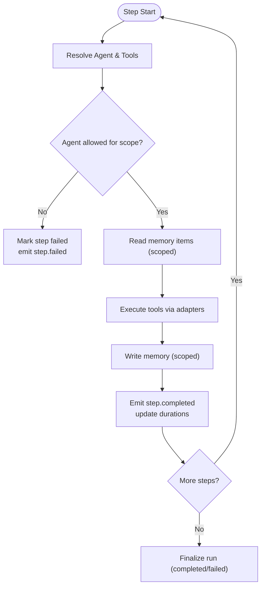
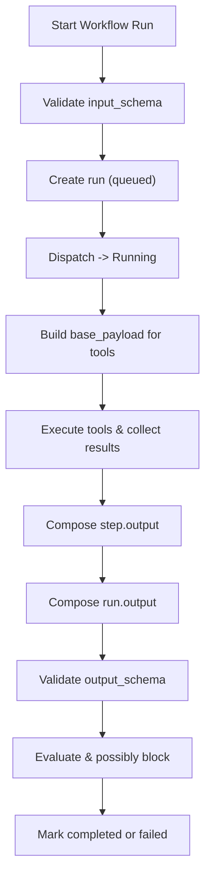
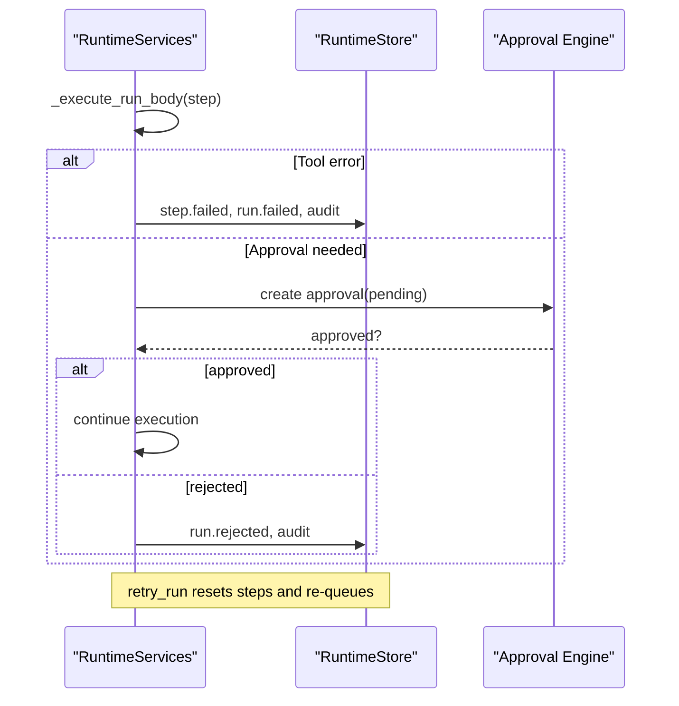
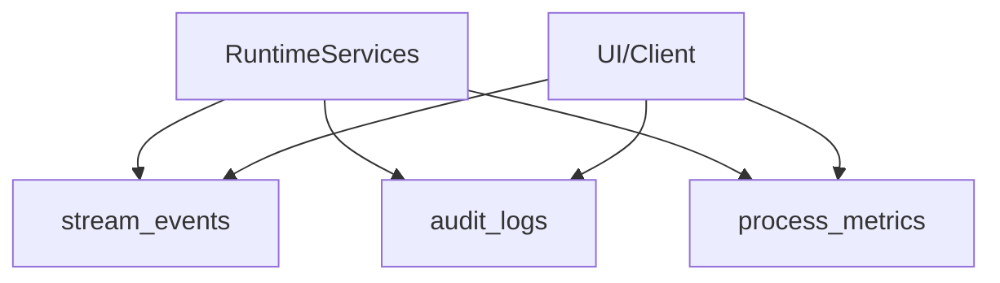
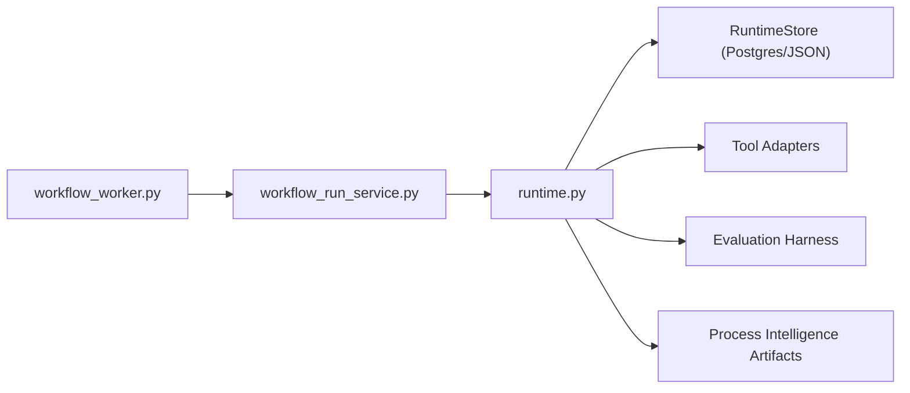

# Core Execution Flow

<cite>
**Referenced Files in This Document**
- [runtime.py](file://backend/app/runtime.py)
- [workflow_service.py](file://backend/app/services/workflow_service.py)
- [workflow_run_service.py](file://backend/app/services/workflow_run_service.py)
- [workflow_worker.py](file://backend/app/workers/workflow_worker.py)
</cite>

## Table of Contents
1. [Introduction](#introduction)
2. [Project Structure](#project-structure)
3. [Core Components](#core-components)
4. [Architecture Overview](#architecture-overview)
5. [Detailed Component Analysis](#detailed-component-analysis)
6. [Dependency Analysis](#dependency-analysis)
7. [Performance Considerations](#performance-considerations)
8. [Troubleshooting Guide](#troubleshooting-guide)
9. [Conclusion](#conclusion)

## Introduction
This document explains the end-to-end workflow execution flow: from initiation to completion, including state transitions, execution context management, memory scoping, input validation, parameter binding, output serialization, error handling, exception propagation, recovery mechanisms, and observability for monitoring and debugging.

## Project Structure
The core execution flow is implemented primarily within the runtime layer and exposed via services and workers:
- Runtime orchestrates authentication, authorization, persistence, workflow run lifecycle, step execution, approvals, evaluations, memory scoping, audit logging, and streaming events.
- Services provide thin API-facing entry points that delegate to the runtime.
- Workers poll and dispatch queued runs for execution.

**Diagram sources**
- [workflow_run_service.py:16-21](file://backend/app/services/workflow_run_service.py#L16-L21)
- [runtime.py:1660-1767](file://backend/app/runtime.py#L1660-L1767)
- [runtime.py:1938-2210](file://backend/app/runtime.py#L1938-L2210)
- [workflow_worker.py:4-9](file://backend/app/workers/workflow_worker.py#L4-L9)

**Section sources**
- [workflow_service.py:1-38](file://backend/app/services/workflow_service.py#L1-L38)
- [workflow_run_service.py:1-42](file://backend/app/services/workflow_run_service.py#L1-L42)
- [workflow_worker.py:1-10](file://backend/app/workers/workflow_worker.py#L1-L10)
- [runtime.py:258-393](file://backend/app/runtime.py#L258-L393)

## Core Components
- RuntimeServices: Central orchestration for workflows, runs, approvals, evaluations, memory scoping, tool execution, audit logs, and streaming events.
- RuntimeStore: Persistent store abstraction over Postgres or JSON file with thread-safe save and collection access.
- Workflow Run Service: Thin service exposing start, dispatch, cancel, pause/resume, expire, retry operations.
- Workflow Worker: Background helper to discover pending/running runs.

Key responsibilities:
- Input validation against workflow schemas.
- Parameter binding into step payloads.
- Step-by-step execution with agent/tool gating and approval gates.
- Memory reads/writes scoped by agent permissions.
- Output serialization and evaluation gating.
- Auditing and event emission for monitoring.

**Section sources**
- [runtime.py:556-800](file://backend/app/runtime.py#L556-L800)
- [runtime.py:1660-1767](file://backend/app/runtime.py#L1660-L1767)
- [runtime.py:1938-2210](file://backend/app/runtime.py#L1938-L2210)
- [workflow_run_service.py:16-42](file://backend/app/services/workflow_run_service.py#L16-L42)

## Architecture Overview
The execution path spans API/service calls, runtime orchestration, and background dispatching. The runtime enforces governance, security, and quality gates at each stage.

**Diagram sources**
- [workflow_run_service.py:16-21](file://backend/app/services/workflow_run_service.py#L16-L21)
- [runtime.py:1660-1767](file://backend/app/runtime.py#L1660-L1767)
- [runtime.py:1938-2210](file://backend/app/runtime.py#L1938-L2210)
- [runtime.py:2211-2283](file://backend/app/runtime.py#L2211-L2283)

## Detailed Component Analysis

### Workflow Run Lifecycle and State Transitions
- Creation: start_workflow_run validates workflow existence, active status, risk tier, input schema, and idempotency; creates a run in queued state and emits run.started.
- Dispatch: dispatch_queued_runs transitions queued/retry_queued to running, records started_at, and invokes the executor.
- Step execution: _execute_run_body iterates steps, sets current_step, resolves agent/tool permissions, checks approval requirements, performs memory reads, executes tools, writes memory, and updates step/run state.
- Completion/Failure: After all steps, output is serialized, validated against output_schema, evaluated, and run marked completed unless blocked by evaluation policy. Errors transition run to failed.
- Control: cancel, pause/resume, expire, retry manage non-terminal states and re-queueing.

**Diagram sources**
- [runtime.py:1660-1767](file://backend/app/runtime.py#L1660-L1767)
- [runtime.py:1769-1867](file://backend/app/runtime.py#L1769-L1867)
- [runtime.py:1938-2210](file://backend/app/runtime.py#L1938-L2210)

**Section sources**
- [runtime.py:1660-1767](file://backend/app/runtime.py#L1660-L1767)
- [runtime.py:1769-1867](file://backend/app/runtime.py#L1769-L1867)
- [runtime.py:1938-2210](file://backend/app/runtime.py#L1938-L2210)

### Execution Context Management and Memory Scoping
- Context: Each run carries organization_id, workflow_id, requested_by, and per-step metadata (agent_id, tool_ids).
- Memory reads: Declared on workflow; resolved via scope aliases; enforced through agent allowed_scopes before returning hits.
- Memory writes: Scoped by workflow configuration; enforced via assert_memory_scope_allowed; recorded with provenance.
- Tool effects: Recorded per tool invocation with run and step linkage.

**Diagram sources**
- [runtime.py:1938-2210](file://backend/app/runtime.py#L1938-L2210)

**Section sources**
- [runtime.py:1938-2210](file://backend/app/runtime.py#L1938-L2210)

### Input Validation, Parameter Binding, and Output Serialization
- Input validation: Enforced against workflow input_schema (required fields checked).
- Parameter binding: Base payload merges run-level inputs with run/step identifiers for tool execution.
- Output serialization: Step outputs aggregate tool results and metadata; final run output validated against output_schema; evaluation created and may block completion.

**Diagram sources**
- [runtime.py:1660-1767](file://backend/app/runtime.py#L1660-L1767)
- [runtime.py:1938-2210](file://backend/app/runtime.py#L1938-L2210)

**Section sources**
- [runtime.py:1660-1767](file://backend/app/runtime.py#L1660-L1767)
- [runtime.py:1938-2210](file://backend/app/runtime.py#L1938-L2210)

### Error Handling, Exception Propagation, and Recovery
- Step failures: On agent/tool unavailability or permission errors, step marked failed, run marked failed, audit logged, and step.failed emitted.
- Approval outcomes: Approved resumes execution; rejected marks run rejected with reason.
- Recovery: retry_run resets step states and queues for re-execution; pause/resume allows manual control; expire terminates stale runs.

**Diagram sources**
- [runtime.py:1938-2210](file://backend/app/runtime.py#L1938-L2210)
- [runtime.py:2211-2283](file://backend/app/runtime.py#L2211-L2283)
- [runtime.py:1841-1867](file://backend/app/runtime.py#L1841-L1867)

**Section sources**
- [runtime.py:1938-2210](file://backend/app/runtime.py#L1938-L2210)
- [runtime.py:2211-2283](file://backend/app/runtime.py#L2211-L2283)
- [runtime.py:1841-1867](file://backend/app/runtime.py#L1841-L1867)

### Monitoring, Debugging, and Execution Traces
- Streaming events: run.started, step.started, step.completed, step.failed, approval.requested/approved/rejected, evaluation.* and run.completed are appended to stream_events for real-time monitoring.
- Audit logs: Every significant action is recorded with actor, resource, and metadata for post-mortem analysis.
- Process metrics: Aggregated summaries include counts, durations, bottlenecks, and conformance reports.

**Diagram sources**
- [runtime.py:1885-1893](file://backend/app/runtime.py#L1885-L1893)
- [runtime.py:1869-1884](file://backend/app/runtime.py#L1869-L1884)
- [runtime.py:2738-2791](file://backend/app/runtime.py#L2738-L2791)

**Section sources**
- [runtime.py:1885-1893](file://backend/app/runtime.py#L1885-L1893)
- [runtime.py:1869-1884](file://backend/app/runtime.py#L1869-L1884)
- [runtime.py:2738-2791](file://backend/app/runtime.py#L2738-L2791)

## Dependency Analysis
- Services depend on RuntimeServices for all business logic.
- RuntimeServices depends on RuntimeStore for persistence and on external modules for tool execution, knowledge indexing, and process intelligence artifacts.
- Worker depends on RuntimeServices to fetch and dispatch queued runs.

**Diagram sources**
- [workflow_worker.py:4-9](file://backend/app/workers/workflow_worker.py#L4-L9)
- [workflow_run_service.py:16-21](file://backend/app/services/workflow_run_service.py#L16-L21)
- [runtime.py:1660-1767](file://backend/app/runtime.py#L1660-L1767)

**Section sources**
- [workflow_worker.py:1-10](file://backend/app/workers/workflow_worker.py#L1-L10)
- [workflow_run_service.py:1-42](file://backend/app/services/workflow_run_service.py#L1-L42)
- [runtime.py:258-393](file://backend/app/runtime.py#L258-L393)

## Performance Considerations
- Persistence: RuntimeStore uses a lock for concurrent saves and prefers Postgres when configured, falling back to JSON file for local/dev.
- Event emission and audit logging occur per step; batch saving is performed after critical transitions to reduce overhead.
- Memory reads are limited to top-K hits per scope to bound query size.
- Tool execution results are persisted immediately to support traceability; consider batching if tool throughput becomes a bottleneck.

[No sources needed since this section provides general guidance]

## Troubleshooting Guide
Common issues and diagnostics:
- Permission denied during memory read/write: Verify agent allowed_memory_scopes and workflow memory_reads/memory_writes configuration.
- Tool unavailable or disabled: Ensure tool exists and enabled; confirm agent has tool in allowed_tools.
- Approval gate blocking progress: Review approvals list and decide appropriately; check risk tier and step action_type.
- Evaluation blocking completion: Inspect evaluation results and policy settings; adjust evaluation_policy.block_on_fail if necessary.
- Stuck runs: Use pause/resume/expiry controls; use retry_run to reset and re-queue.

Operational queries:
- List runs and steps: get_run/get_run_steps.
- Stream events for a run: stream_run_events.
- Audit logs filtered by action/resource_type: list_audit_logs.
- Process metrics and bottlenecks: process_summary/process_bottlenecks/conformance_report.

**Section sources**
- [runtime.py:1938-2210](file://backend/app/runtime.py#L1938-L2210)
- [runtime.py:2211-2283](file://backend/app/runtime.py#L2211-L2283)
- [runtime.py:2895-2901](file://backend/app/runtime.py#L2895-L2901)
- [runtime.py:2720-2736](file://backend/app/runtime.py#L2720-L2736)
- [runtime.py:2738-2791](file://backend/app/runtime.py#L2738-L2791)

## Conclusion
The workflow execution engine integrates robust validation, secure scoping, governance gates, and comprehensive observability. By following the documented lifecycle and using the provided operational endpoints, teams can reliably initiate, monitor, debug, and recover workflow runs while maintaining strong auditability and compliance.