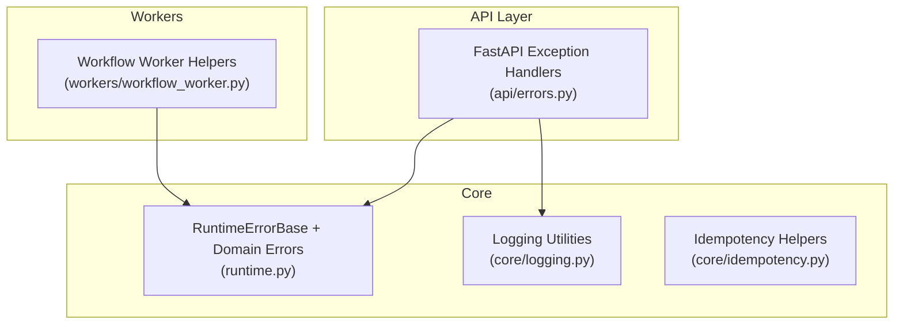
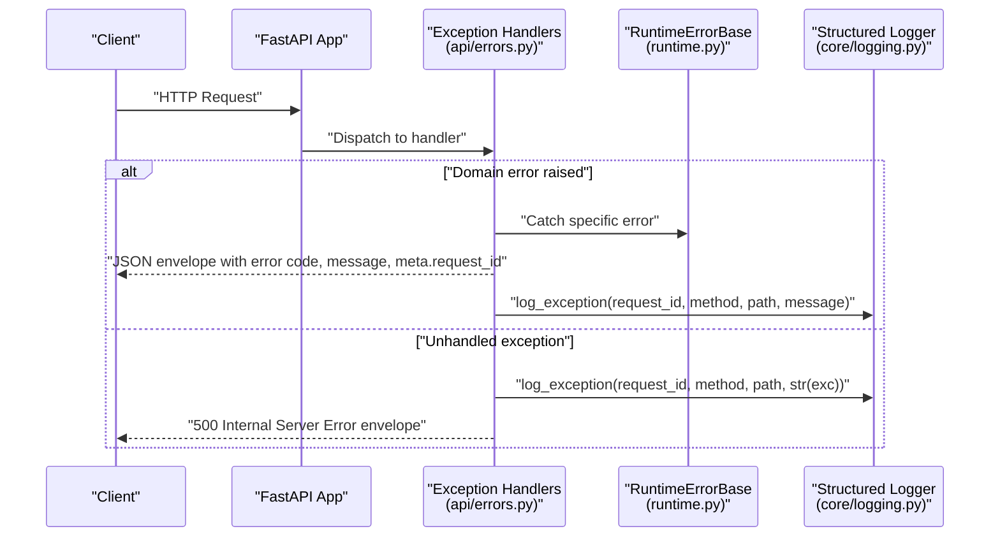
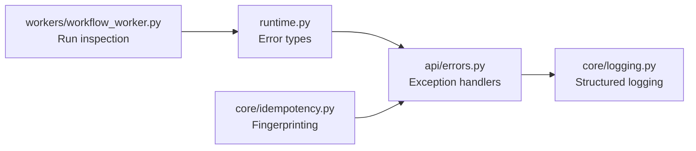

# Error Handling & Recovery

<cite>
**Referenced Files in This Document**
- [runtime.py](file://backend/app/runtime.py)
- [errors.py](file://backend/app/api/errors.py)
- [core_errors.py](file://backend/app/core/errors.py)
- [logging.py](file://backend/app/core/logging.py)
- [idempotency.py](file://backend/app/core/idempotency.py)
- [workflow_worker.py](file://backend/app/workers/workflow_worker.py)
</cite>

## Table of Contents
1. [Introduction](#introduction)
2. [Project Structure](#project-structure)
3. [Core Components](#core-components)
4. [Architecture Overview](#architecture-overview)
5. [Detailed Component Analysis](#detailed-component-analysis)
6. [Dependency Analysis](#dependency-analysis)
7. [Performance Considerations](#performance-considerations)
8. [Troubleshooting Guide](#troubleshooting-guide)
9. [Conclusion](#conclusion)
10. [Appendices](#appendices)

## Introduction
This document explains error handling and recovery mechanisms in the execution engine, focusing on retry strategies, timeout management, idempotency controls, transaction boundaries, rollback behavior, failure detection, alerting, automatic recovery, logging strategies, and troubleshooting workflows. It maps these concepts to concrete implementation points in the codebase and provides guidance for configuring policies and customizing handlers.

## Project Structure
The error handling and recovery features are implemented across a small set of focused modules:
- Runtime error types and base classes
- API exception handlers that translate runtime errors into structured JSON responses
- Centralized logging utilities for requests and exceptions
- Idempotency helpers for request fingerprinting
- Worker utilities for resuming or inspecting long-running runs

**Diagram sources**
- [errors.py:8-46](file://backend/app/api/errors.py#L8-L46)
- [runtime.py:93-129](file://backend/app/runtime.py#L93-L129)
- [logging.py:34-45](file://backend/app/core/logging.py#L34-L45)
- [idempotency.py:5-6](file://backend/app/core/idempotency.py#L5-L6)
- [workflow_worker.py:4-9](file://backend/app/workers/workflow_worker.py#L4-L9)

**Section sources**
- [errors.py:8-46](file://backend/app/api/errors.py#L8-L46)
- [runtime.py:93-129](file://backend/app/runtime.py#L93-L129)
- [logging.py:34-45](file://backend/app/core/logging.py#L34-L45)
- [idempotency.py:5-6](file://backend/app/core/idempotency.py#L5-L6)
- [workflow_worker.py:4-9](file://backend/app/workers/workflow_worker.py#L4-L9)

## Core Components
- RuntimeErrorBase and domain-specific errors (not found, permission denied, approval required, validation error, rate limited). These define status codes, error codes, and optional fields such as retry hints.
- FastAPI exception handlers that convert runtime errors into consistent JSON envelopes with request correlation IDs and optional Retry-After headers.
- Logging utilities that emit structured logs for API requests and exceptions, including request_id, method, path, and message.
- Idempotency helper to compute deterministic fingerprints from payloads.
- Worker helper to enumerate running workflow runs for inspection or recovery.

Key responsibilities:
- Standardize error shapes and HTTP semantics at the API boundary.
- Provide structured observability via request-scoped logging.
- Support idempotent operations through payload fingerprinting.
- Enable basic recovery by surfacing running runs.

**Section sources**
- [runtime.py:93-129](file://backend/app/runtime.py#L93-L129)
- [errors.py:8-46](file://backend/app/api/errors.py#L8-L46)
- [logging.py:11-31](file://backend/app/core/logging.py#L11-L31)
- [logging.py:34-45](file://backend/app/core/logging.py#L34-L45)
- [idempotency.py:5-6](file://backend/app/core/idempotency.py#L5-L6)
- [workflow_worker.py:4-9](file://backend/app/workers/workflow_worker.py#L4-L9)

## Architecture Overview
The error handling architecture centers around a thin API layer that translates runtime exceptions into standardized responses while emitting structured logs. The runtime module defines the canonical error taxonomy used throughout the system.

**Diagram sources**
- [errors.py:8-46](file://backend/app/api/errors.py#L8-L46)
- [runtime.py:93-129](file://backend/app/runtime.py#L93-L129)
- [logging.py:34-45](file://backend/app/core/logging.py#L34-L45)

## Detailed Component Analysis

### Error Types and Base Class
- RuntimeErrorBase establishes a common interface for all application errors, including status_code, error_code, and message.
- Specialized subclasses model not_found, permission_denied, approval_required, validation_error, and rate_limited. RateLimitedError adds a retry_after hint.

Design implications:
- Consistent HTTP semantics and machine-readable error codes enable predictable client retries and UI flows.
- Adding new error categories is straightforward by subclassing RuntimeErrorBase.

**Section sources**
- [runtime.py:93-129](file://backend/app/runtime.py#L93-L129)

### API Exception Handlers
- A dedicated handler for RuntimeErrorBase returns a structured JSON response with an error envelope and metadata (request_id). If the error includes retry_after, it sets a Retry-After header.
- A catch-all handler for Exception logs the exception and returns a generic 500 response.

Operational notes:
- Always include request_id in responses for tracing.
- Use Retry-After for transient failures like rate limiting.

**Section sources**
- [errors.py:8-46](file://backend/app/api/errors.py#L8-L46)

### Structured Logging
- log_api_request emits JSON logs with request_id, method, path, status_code, duration_ms, and client_ip.
- log_exception emits JSON logs with request_id, method, path, and message.

Best practices:
- Correlate logs using request_id across services.
- Avoid logging sensitive data; keep messages concise and actionable.

**Section sources**
- [logging.py:11-31](file://backend/app/core/logging.py#L11-L31)
- [logging.py:34-45](file://backend/app/core/logging.py#L34-L45)

### Idempotency Controls
- request_fingerprint computes a stable SHA-256 digest over a normalized payload (sorted keys). This can be used to deduplicate identical requests.

Usage patterns:
- Compute fingerprint before persisting state changes.
- Store completed results keyed by fingerprint to short-circuit duplicates.

**Section sources**
- [idempotency.py:5-6](file://backend/app/core/idempotency.py#L5-L6)

### Worker-Based Recovery Hooks
- run_pending enumerates workflow_runs with status "running". This can be used by external orchestrators or cron jobs to resume or re-evaluate stuck runs.

Recovery strategy:
- Periodically scan for long-running or stale runs.
- Transition them to failed or retriable states based on policy.

**Section sources**
- [workflow_worker.py:4-9](file://backend/app/workers/workflow_worker.py#L4-L9)

### Retry Strategies and Timeout Management
- RateLimitedError exposes retry_after to signal backoff timing. Clients should honor Retry-After when present.
- Tool definitions include a retry_policy field with max_retries, enabling per-tool retry configuration.
- Timeouts are modeled per tool via a timeout field.

Guidance:
- Implement exponential backoff with jitter for retries beyond immediate Retry-After.
- Respect per-tool timeouts to prevent resource exhaustion.
- Limit total retries to avoid runaway loops.

**Section sources**
- [runtime.py:122-129](file://backend/app/runtime.py#L122-L129)
- [runtime.py:466-517](file://backend/app/runtime.py#L466-L517)

### Circuit Breaker Patterns
- No explicit circuit breaker implementation is present in the analyzed files.
- Recommended approach: wrap external calls with a circuit breaker that opens after consecutive failures and half-opens after a cooldown period. Integrate with existing retry and timeout logic.

[No sources needed since this section proposes a pattern not implemented in the referenced files]

### Transaction Boundaries and Rollback Mechanisms
- The runtime store persists state to Postgres (when enabled) and always writes a JSON snapshot. Writes are wrapped in database transactions where applicable.
- On save, legacy product name sanitization is applied in-place to maintain consistency.

Behavioral notes:
- If Postgres write fails, the JSON snapshot remains available, providing a fallback.
- For multi-step operations, ensure atomicity by grouping related updates within a single transaction scope.

**Section sources**
- [runtime.py:329-353](file://backend/app/runtime.py#L329-L353)
- [runtime.py:370-383](file://backend/app/runtime.py#L370-L383)

### Failure Detection, Alerting, and Automatic Recovery
- Failure detection:
  - API-level: unhandled exceptions are logged via log_exception.
  - Operational: worker helper surfaces running runs for inspection.
- Alerting:
  - Emit structured logs for errors and integrate with your monitoring/alerting pipeline (e.g., threshold-based alerts on error rates).
- Automatic recovery:
  - Use run_pending to identify and remediate stuck runs.
  - Combine with idempotency to safely re-run failed steps without duplication.

**Section sources**
- [errors.py:30-46](file://backend/app/api/errors.py#L30-L46)
- [logging.py:34-45](file://backend/app/core/logging.py#L34-L45)
- [workflow_worker.py:4-9](file://backend/app/workers/workflow_worker.py#L4-L9)

### Logging Strategies for Debugging and Troubleshooting
- Use request_id to correlate logs across components.
- Prefer structured JSON logs for parsing and aggregation.
- Include minimal context in messages; attach detailed diagnostics via structured fields.

**Section sources**
- [logging.py:11-31](file://backend/app/core/logging.py#L11-L31)
- [logging.py:34-45](file://backend/app/core/logging.py#L34-L45)

### Configuring Retry Policies and Custom Error Handlers
- Configure per-tool retry policies via the tool definition’s retry_policy.max_retries and timeout fields.
- Extend error handling by adding new RuntimeErrorBase subclasses and registering additional FastAPI exception handlers.

Examples (paths only):
- Define a new domain error class: [runtime.py:93-129](file://backend/app/runtime.py#L93-L129)
- Register a new exception handler: [errors.py:8-46](file://backend/app/api/errors.py#L8-L46)
- Adjust tool retry and timeout defaults: [runtime.py:466-517](file://backend/app/runtime.py#L466-L517)

**Section sources**
- [runtime.py:93-129](file://backend/app/runtime.py#L93-L129)
- [errors.py:8-46](file://backend/app/api/errors.py#L8-L46)
- [runtime.py:466-517](file://backend/app/runtime.py#L466-L517)

### Analyzing Execution Failures for Root Cause Analysis
- Start with the error envelope returned by the API (error.code, error.message, meta.request_id).
- Search logs using request_id to reconstruct the full call chain.
- Inspect running runs via the worker helper to determine if a step is stuck or repeatedly failing.
- Validate idempotency by checking whether duplicate requests were deduplicated using the payload fingerprint.

**Section sources**
- [errors.py:8-46](file://backend/app/api/errors.py#L8-L46)
- [logging.py:34-45](file://backend/app/core/logging.py#L34-L45)
- [workflow_worker.py:4-9](file://backend/app/workers/workflow_worker.py#L4-L9)
- [idempotency.py:5-6](file://backend/app/core/idempotency.py#L5-L6)

## Dependency Analysis
The following diagram shows how key modules depend on each other for error handling and recovery.

**Diagram sources**
- [runtime.py:93-129](file://backend/app/runtime.py#L93-L129)
- [errors.py:8-46](file://backend/app/api/errors.py#L8-L46)
- [logging.py:34-45](file://backend/app/core/logging.py#L34-L45)
- [workflow_worker.py:4-9](file://backend/app/workers/workflow_worker.py#L4-L9)
- [idempotency.py:5-6](file://backend/app/core/idempotency.py#L5-L6)

**Section sources**
- [runtime.py:93-129](file://backend/app/runtime.py#L93-L129)
- [errors.py:8-46](file://backend/app/api/errors.py#L8-L46)
- [logging.py:34-45](file://backend/app/core/logging.py#L34-L45)
- [workflow_worker.py:4-9](file://backend/app/workers/workflow_worker.py#L4-L9)
- [idempotency.py:5-6](file://backend/app/core/idempotency.py#L5-L6)

## Performance Considerations
- Keep error messages concise and avoid heavy serialization in hot paths.
- Use structured logging to minimize overhead and improve parseability.
- Honor Retry-After and implement exponential backoff to reduce load during outages.
- Limit retries and enforce timeouts to prevent cascading failures.

[No sources needed since this section provides general guidance]

## Troubleshooting Guide
Common issues and resolutions:
- Missing request_id in logs: Ensure middleware or handlers inject request_id into request.state and pass it to logging functions.
- Stuck workflow runs: Use the worker helper to list running runs and transition them based on policy.
- Duplicate processing: Verify idempotency by computing and storing payload fingerprints before side effects.
- Unexpected 500s: Check unhandled exception logs for stack traces and root causes.

**Section sources**
- [errors.py:30-46](file://backend/app/api/errors.py#L30-L46)
- [logging.py:34-45](file://backend/app/core/logging.py#L34-L45)
- [workflow_worker.py:4-9](file://backend/app/workers/workflow_worker.py#L4-L9)
- [idempotency.py:5-6](file://backend/app/core/idempotency.py#L5-L6)

## Conclusion
The execution engine implements a clear separation between error modeling, API translation, and observability. By leveraging standardized error types, structured logging, idempotency helpers, and simple worker hooks, teams can build robust retry, timeout, and recovery strategies. Extending the system with circuit breakers and richer transactional guarantees will further improve resilience.

[No sources needed since this section summarizes without analyzing specific files]

## Appendices

### Appendix A: Error Envelope Shape
- Fields:
  - error.code: Machine-readable error category
  - error.message: Human-readable description
  - error.details: Additional context (reserved)
  - meta.request_id: Correlation identifier

**Section sources**
- [errors.py:8-46](file://backend/app/api/errors.py#L8-L46)

### Appendix B: Retry and Timeout Configuration Points
- Per-tool retry_policy.max_retries and timeout fields are defined in tool records.
- RateLimitedError supports retry_after for immediate backoff signaling.

**Section sources**
- [runtime.py:466-517](file://backend/app/runtime.py#L466-L517)
- [runtime.py:122-129](file://backend/app/runtime.py#L122-L129)