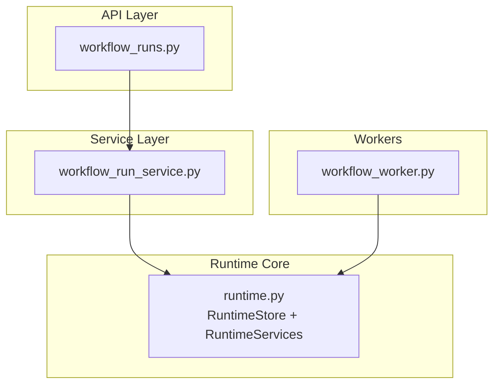
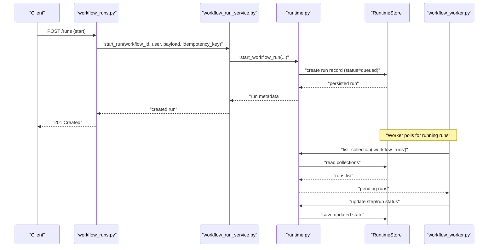
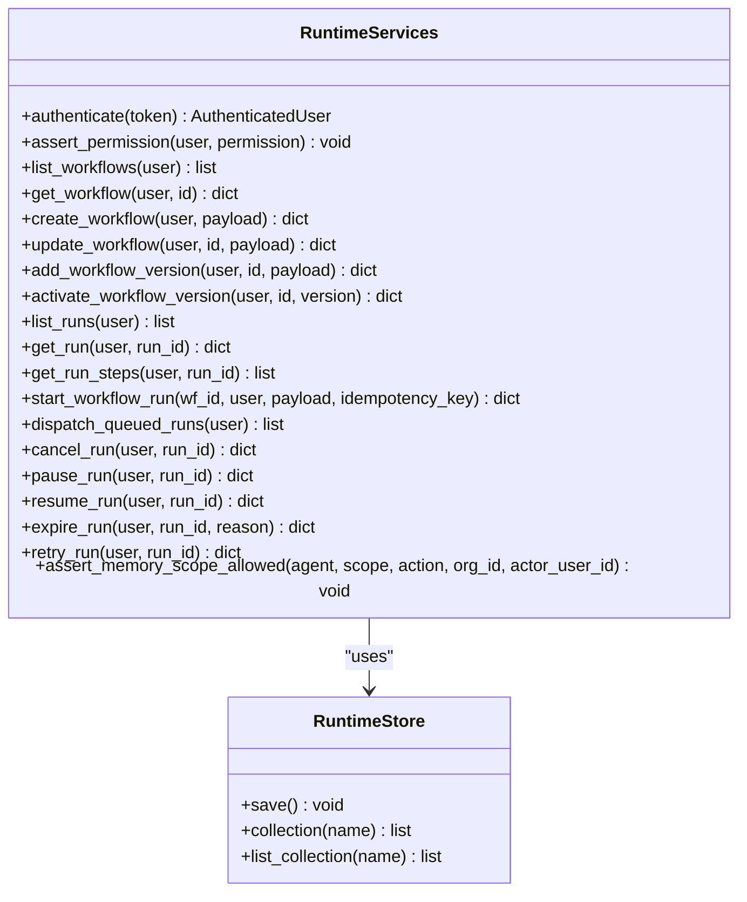
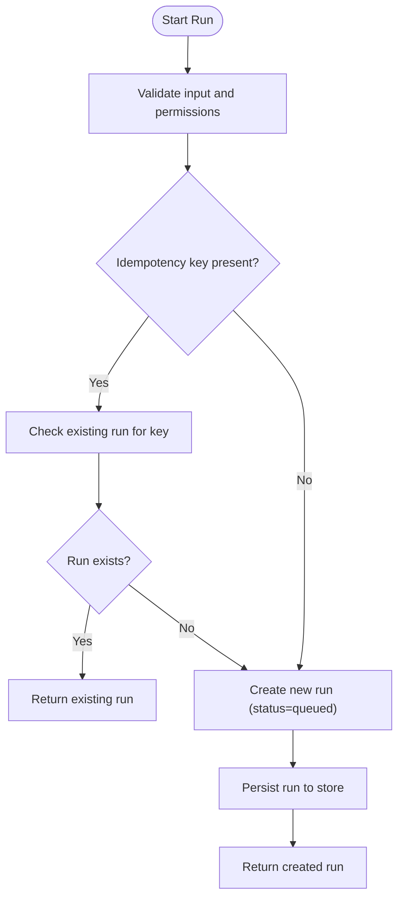
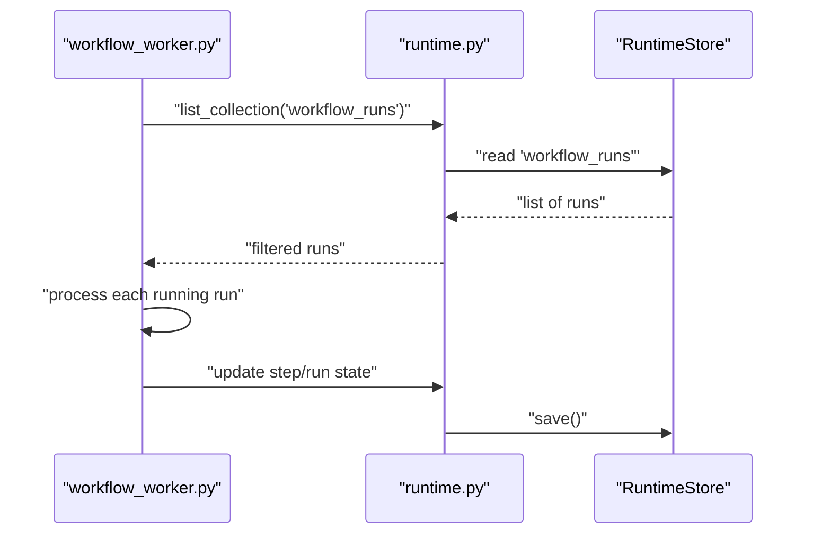
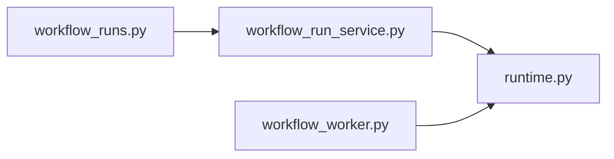

# Execution Engine

<cite>
**Referenced Files in This Document**
- [runtime.py](file://backend/app/runtime.py)
- [workflow_worker.py](file://backend/app/workers/workflow_worker.py)
- [workflow_run_service.py](file://backend/app/services/workflow_run_service.py)
- [workflow_runs.py](file://backend/app/api/v1/routes/workflow_runs.py)
</cite>

## Table of Contents
1. [Introduction](#introduction)
2. [Project Structure](#project-structure)
3. [Core Components](#core-components)
4. [Architecture Overview](#architecture-overview)
5. [Detailed Component Analysis](#detailed-component-analysis)
6. [Dependency Analysis](#dependency-analysis)
7. [Performance Considerations](#performance-considerations)
8. [Troubleshooting Guide](#troubleshooting-guide)
9. [Conclusion](#conclusion)

## Introduction
This document explains the workflow execution engine with a focus on orchestration, state management, execution context, memory scoping, task queuing, worker processes, distributed execution considerations, error handling, retry mechanisms, timeout management, and operational monitoring. It synthesizes the runtime store, service layer, API routes, and worker entry points to provide a complete view of how workflow runs are created, dispatched, executed, observed, and controlled.

## Project Structure
The execution engine spans several layers:
- Runtime store and services: central persistence, identity, permissions, and domain operations for workflows and runs.
- Service layer: thin façade over runtime methods for listing, starting, dispatching, canceling, pausing/resuming, expiring, and retrying runs.
- API routes: HTTP endpoints that expose run lifecycle operations.
- Worker process: background loop that discovers running runs and drives their progress.

**Diagram sources**
- [workflow_runs.py](file://backend/app/api/v1/routes/workflow_runs.py)
- [workflow_run_service.py](file://backend/app/services/workflow_run_service.py)
- [runtime.py](file://backend/app/runtime.py)
- [workflow_worker.py](file://backend/app/workers/workflow_worker.py)

**Section sources**
- [runtime.py](file://backend/app/runtime.py)
- [workflow_run_service.py](file://backend/app/services/workflow_run_service.py)
- [workflow_runs.py](file://backend/app/api/v1/routes/workflow_runs.py)
- [workflow_worker.py](file://backend/app/workers/workflow_worker.py)

## Core Components
- RuntimeStore: persistent document store with Postgres or JSON fallback, thread-safe save/load, collection accessors, and legacy name sanitization.
- RuntimeServices: orchestrates authentication, authorization, seed/bootstrap, and high-level operations including workflow/run management and audit logging.
- Workflow Run Service: exposes simple functions for listing, starting, dispatching, canceling, pausing/resuming, expiring, and retrying runs.
- API Routes: HTTP handlers for run lifecycle operations.
- Worker: scans for pending/running runs and coordinates next steps.

Key responsibilities:
- State persistence and scoping by organization.
- Authentication and permission enforcement.
- Audit trail creation for critical actions.
- Idempotency support for run creation.
- Queued/dispatched execution model.

**Section sources**
- [runtime.py](file://backend/app/runtime.py)
- [workflow_run_service.py](file://backend/app/services/workflow_run_service.py)
- [workflow_runs.py](file://backend/app/api/v1/routes/workflow_runs.py)
- [workflow_worker.py](file://backend/app/workers/workflow_worker.py)

## Architecture Overview
End-to-end flow from API to worker and back to persisted state:

**Diagram sources**
- [workflow_runs.py](file://backend/app/api/v1/routes/workflow_runs.py)
- [workflow_run_service.py](file://backend/app/services/workflow_run_service.py)
- [runtime.py](file://backend/app/runtime.py)
- [workflow_worker.py](file://backend/app/workers/workflow_worker.py)

## Detailed Component Analysis

### Runtime Store and Services
- Persistence:
  - Uses Postgres when configured; otherwise falls back to a local JSON file.
  - Thread-safe writes via a reentrant lock.
  - Always persists a JSON snapshot even when using Postgres for offline backup/migration.
- Collections:
  - Typed lists per entity (e.g., workflow_runs, approvals, audit_logs).
  - Auto-creates missing collections for forward compatibility.
- Identity and Permissions:
  - Token-based authentication (access tokens, refresh tokens, API keys).
  - Role-based permissions map with fine-grained resource permissions.
  - Organization-scoped data access helpers.
- Audit Logging:
  - Centralized append-and-save for auth, user, agent, tool, workflow, and memory events.
- Memory Scoping:
  - Enforces allowed scopes per agent; denies unauthorized reads/writes and records audit entries.

**Diagram sources**
- [runtime.py](file://backend/app/runtime.py)

**Section sources**
- [runtime.py](file://backend/app/runtime.py)

### Workflow Run Service
Provides a clean interface for the API layer and workers:
- Listing and retrieval of runs and steps.
- Starting runs with optional idempotency key.
- Dispatching queued runs into execution.
- Lifecycle controls: cancel, pause, resume, expire, retry.

**Diagram sources**
- [workflow_run_service.py](file://backend/app/services/workflow_run_service.py)
- [runtime.py](file://backend/app/runtime.py)

**Section sources**
- [workflow_run_service.py](file://backend/app/services/workflow_run_service.py)
- [runtime.py](file://backend/app/runtime.py)

### API Routes for Workflow Runs
Expose HTTP endpoints for:
- Listing runs
- Getting a specific run and its steps
- Starting a run (with optional idempotency)
- Dispatching queued runs
- Canceling/pausing/resuming/expiring/retrying runs

These routes delegate to the service layer, which in turn calls runtime services.

**Section sources**
- [workflow_runs.py](file://backend/app/api/v1/routes/workflow_runs.py)
- [workflow_run_service.py](file://backend/app/services/workflow_run_service.py)
- [runtime.py](file://backend/app/runtime.py)

### Worker Process
- Discovers runs with status “running” by scanning the workflow_runs collection.
- Can be extended to drive step execution, update statuses, handle retries/timeouts, and emit stream events.

**Diagram sources**
- [workflow_worker.py](file://backend/app/workers/workflow_worker.py)
- [runtime.py](file://backend/app/runtime.py)

**Section sources**
- [workflow_worker.py](file://backend/app/workers/workflow_worker.py)
- [runtime.py](file://backend/app/runtime.py)

## Dependency Analysis
- API depends on service layer for business logic.
- Service layer depends on runtime services for persistence, identity, and domain operations.
- Worker depends on runtime’s collection accessors to discover work.
- Runtime encapsulates all persistence and cross-cutting concerns (auth, audit, memory scoping).

**Diagram sources**
- [workflow_runs.py](file://backend/app/api/v1/routes/workflow_runs.py)
- [workflow_run_service.py](file://backend/app/services/workflow_run_service.py)
- [runtime.py](file://backend/app/runtime.py)
- [workflow_worker.py](file://backend/app/workers/workflow_worker.py)

**Section sources**
- [workflow_runs.py](file://backend/app/api/v1/routes/workflow_runs.py)
- [workflow_run_service.py](file://backend/app/services/workflow_run_service.py)
- [runtime.py](file://backend/app/runtime.py)
- [workflow_worker.py](file://backend/app/workers/workflow_worker.py)

## Performance Considerations
- Concurrency:
  - RuntimeStore uses a reentrant lock around saves to ensure consistency.
  - For higher throughput, consider sharding by organization or partitioning collections.
- I/O:
  - Prefer Postgres for production; JSON is a convenient fallback and always kept as a snapshot.
  - Batch updates where possible to reduce save frequency.
- Parallelization:
  - The worker can be scaled horizontally by sharding runs (e.g., by run ID prefix or organization).
  - Step-level parallelism should be gated by dependency graphs defined in workflow versions.
- Observability:
  - Use audit logs and stream events to monitor progress without polling heavy queries.
- Timeouts and Retries:
  - Configure timeouts at the tool level and enforce them during step execution.
  - Implement exponential backoff with jitter for transient failures.

[No sources needed since this section provides general guidance]

## Troubleshooting Guide
Common issues and diagnostics:
- Permission errors:
  - Verify token validity and role permissions; check audit logs for denied actions.
- Memory scope denials:
  - Ensure the executing agent has the required memory scopes; review audit entries for memory.denied events.
- Stuck runs:
  - Inspect run and step statuses; confirm worker is discovering and updating runs.
- Idempotency collisions:
  - If start_run returns an existing run, reuse the returned run ID to avoid duplicates.
- Database vs JSON mode:
  - Confirm Postgres availability; if unavailable, system falls back to JSON but may lose multi-process safety guarantees.

Operational tips:
- Use the run listing and step retrieval APIs to inspect current state.
- Leverage dispatch to move queued runs into execution after configuration changes.
- Use cancel/pause/resume to control long-running or blocked runs.
- Expire stale runs when external dependencies fail permanently.
- Retry failed runs selectively after root cause remediation.

**Section sources**
- [runtime.py](file://backend/app/runtime.py)
- [workflow_run_service.py](file://backend/app/services/workflow_run_service.py)
- [workflow_runs.py](file://backend/app/api/v1/routes/workflow_runs.py)
- [workflow_worker.py](file://backend/app/workers/workflow_worker.py)

## Conclusion
The execution engine combines a robust runtime store, a clear service boundary, and a lightweight worker to manage workflow runs end-to-end. It emphasizes secure, auditable, and organized state management with flexible persistence options. With careful scaling of workers, thoughtful parallelization of independent steps, and disciplined use of timeouts and retries, the system supports reliable, observable, and efficient workflow execution across single-process and distributed deployments.