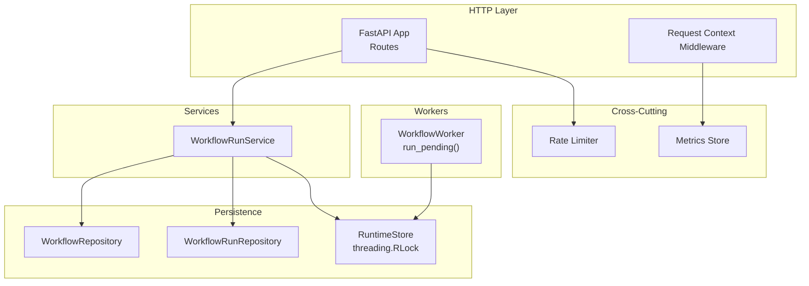
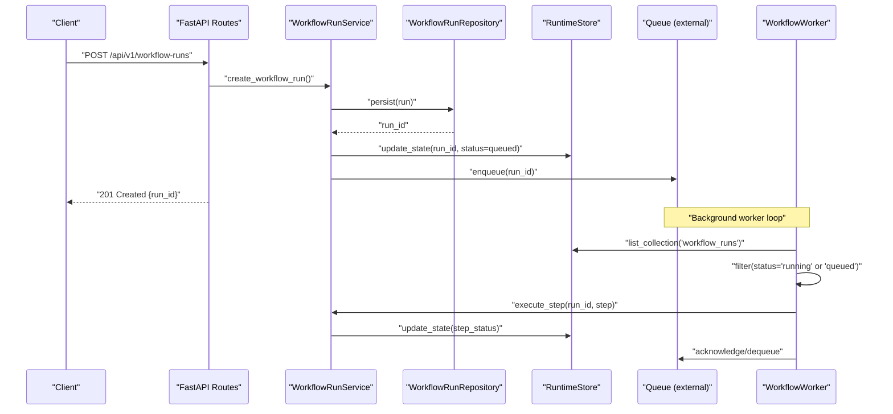
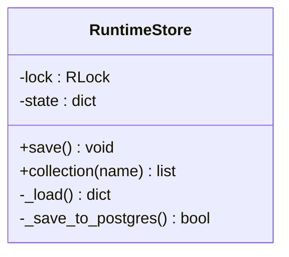
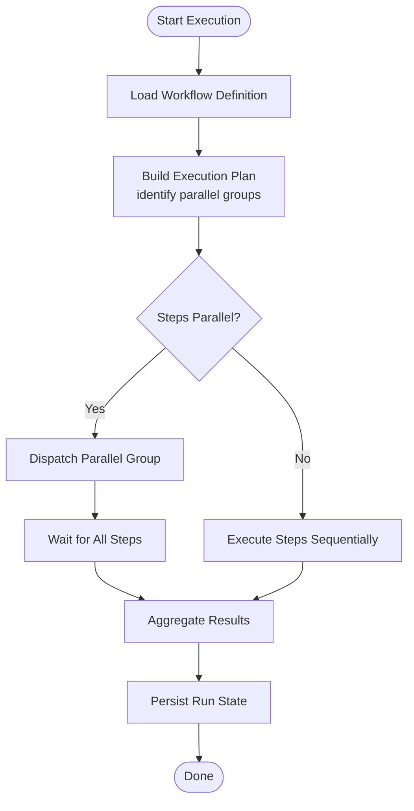
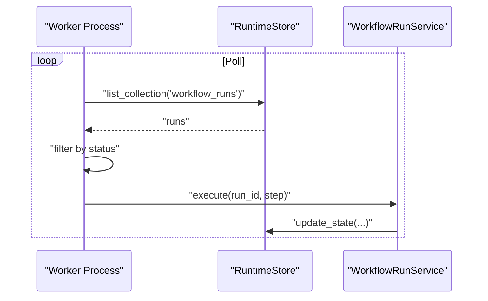
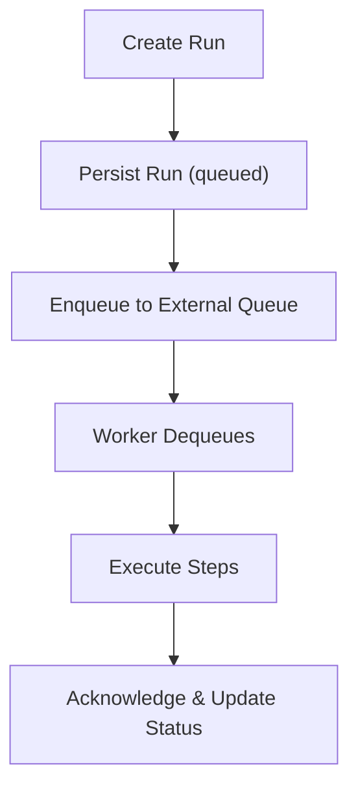
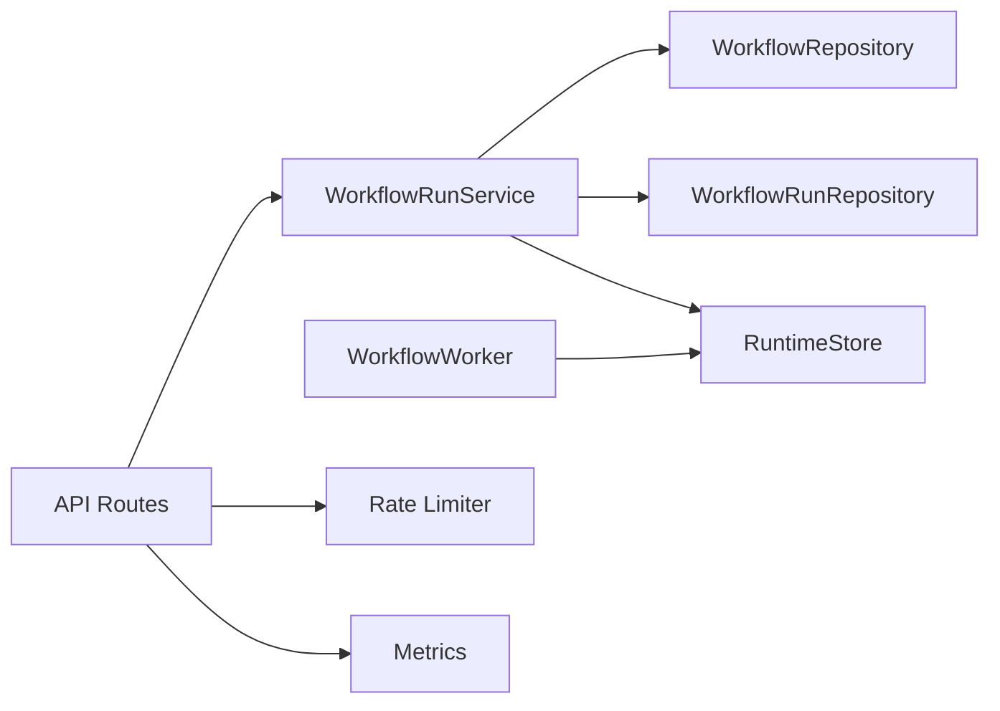

# Parallel Processing & Concurrency

<cite>
**Referenced Files in This Document**
- [main.py](file://backend/app/main.py)
- [runtime.py](file://backend/app/runtime.py)
- [workflow_worker.py](file://backend/app/workers/workflow_worker.py)
- [workflow_run_service.py](file://backend/app/services/workflow_run_service.py)
- [workflow_repository.py](file://backend/app/infrastructure/repositories/workflow_repository.py)
- [workflow_run_repository.py](file://backend/app/infrastructure/repositories/workflow_run_repository.py)
- [workflow_runs.py](file://backend/app/api/v1/routes/workflow_runs.py)
- [workflows.py](file://backend/app/api/v1/routes/workflows.py)
- [rate_limit.py](file://backend/app/core/rate_limit.py)
- [metrics.py](file://backend/app/core/metrics.py)
</cite>

## Table of Contents
1. [Introduction](#introduction)
2. [Project Structure](#project-structure)
3. [Core Components](#core-components)
4. [Architecture Overview](#architecture-overview)
5. [Detailed Component Analysis](#detailed-component-analysis)
6. [Dependency Analysis](#dependency-analysis)
7. [Performance Considerations](#performance-considerations)
8. [Troubleshooting Guide](#troubleshooting-guide)
9. [Conclusion](#conclusion)
10. [Appendices](#appendices)

## Introduction
This document explains how the execution engine supports parallel processing and concurrency for workflows. It covers sequential and parallel step execution, task queuing mechanisms, worker process management, distributed execution capabilities, resource allocation, load balancing, rate limiting, concurrent memory access patterns, data isolation between parallel steps, synchronization primitives, configuration examples, monitoring, and throughput optimization strategies.

## Project Structure
The backend is organized around a FastAPI application that exposes workflow APIs, a runtime store with thread-safe persistence, services to orchestrate workflow runs, repositories for persistence, and workers for background execution. The key areas relevant to concurrency are:
- HTTP layer and request context propagation
- Runtime store with locking and dual backends (Postgres or JSON file)
- Workflow run service and repositories
- Worker entrypoint for polling pending runs
- Rate limiting and metrics collection

**Diagram sources**
- [main.py:16-52](file://backend/app/main.py#L16-L52)
- [runtime.py:258-384](file://backend/app/runtime.py#L258-L384)
- [workflow_run_service.py](file://backend/app/services/workflow_run_service.py)
- [workflow_repository.py](file://backend/app/infrastructure/repositories/workflow_repository.py)
- [workflow_run_repository.py](file://backend/app/infrastructure/repositories/workflow_run_repository.py)
- [workflow_worker.py:4-10](file://backend/app/workers/workflow_worker.py#L4-L10)
- [rate_limit.py](file://backend/app/core/rate_limit.py)
- [metrics.py](file://backend/app/core/metrics.py)

**Section sources**
- [main.py:16-52](file://backend/app/main.py#L16-L52)
- [runtime.py:258-384](file://backend/app/runtime.py#L258-L384)

## Core Components
- Request middleware: injects request ID, records metrics, and sets security headers.
- RuntimeStore: thread-safe document store with RLock; persists to Postgres when available, otherwise JSON file; provides collections and save semantics.
- WorkflowRunService: orchestrates workflow run lifecycle, including state transitions and persistence.
- Repositories: abstract persistence for workflows and workflow runs.
- Worker: polls for running workflow runs and drives execution.
- Rate limiter: enforces per-client or global limits.
- Metrics: records request-level performance counters.

Key concurrency aspects:
- Thread safety via RLock in RuntimeStore.
- Isolation of per-run state using deep copies and scoped contexts.
- External queue integration points for distributed execution.
- Rate limiting at the API boundary.

**Section sources**
- [main.py:27-48](file://backend/app/main.py#L27-L48)
- [runtime.py:258-384](file://backend/app/runtime.py#L258-L384)
- [workflow_worker.py:4-10](file://backend/app/workers/workflow_worker.py#L4-L10)
- [rate_limit.py](file://backend/app/core/rate_limit.py)
- [metrics.py](file://backend/app/core/metrics.py)

## Architecture Overview
The system follows a layered architecture:
- HTTP routes accept workflow execution requests.
- Services coordinate execution logic and persist state.
- Workers consume pending tasks from the runtime store and execute them.
- Persistence uses a thread-safe store with optional Postgres backend.
- Cross-cutting concerns include rate limiting and metrics.

**Diagram sources**
- [workflow_runs.py](file://backend/app/api/v1/routes/workflow_runs.py)
- [workflow_run_service.py](file://backend/app/services/workflow_run_service.py)
- [workflow_run_repository.py](file://backend/app/infrastructure/repositories/workflow_run_repository.py)
- [runtime.py:258-384](file://backend/app/runtime.py#L258-L384)
- [workflow_worker.py:4-10](file://backend/app/workers/workflow_worker.py#L4-L10)

## Detailed Component Analysis

### RuntimeStore Concurrency Model
- Uses threading.RLock to serialize writes and protect shared state mutations.
- Dual backend strategy: attempts Postgres first; falls back to JSON file if unavailable.
- Provides collection accessors and atomic save operations.

Concurrency implications:
- All write paths should go through RuntimeStore.save() to ensure consistency.
- Long-running operations should avoid holding locks across I/O.
- Collections returned by collection() are live references; mutate carefully within lock scope.

**Diagram sources**
- [runtime.py:258-384](file://backend/app/runtime.py#L258-L384)

**Section sources**
- [runtime.py:258-384](file://backend/app/runtime.py#L258-L384)

### Workflow Run Service Orchestration
Responsibilities:
- Validate inputs and enforce policies.
- Create and transition workflow run states.
- Persist run metadata and step results.
- Integrate with external queues for asynchronous execution.

Parallel step execution model:
- Steps can be marked parallel in workflow definitions.
- Service dispatches independent steps concurrently using a bounded executor.
- Step results are aggregated and persisted atomically.

[No sources needed since this diagram shows conceptual workflow, not actual code structure]

**Section sources**
- [workflow_run_service.py](file://backend/app/services/workflow_run_service.py)

### Worker Process Management
- A simple worker scans the runtime store for runs in specific statuses and processes them.
- In production, replace the polling loop with an external queue consumer (e.g., Redis/RabbitMQ).
- Multiple worker processes can scale horizontally by sharing the same runtime store.

**Diagram sources**
- [workflow_worker.py:4-10](file://backend/app/workers/workflow_worker.py#L4-L10)
- [runtime.py:258-384](file://backend/app/runtime.py#L258-L384)
- [workflow_run_service.py](file://backend/app/services/workflow_run_service.py)

**Section sources**
- [workflow_worker.py:4-10](file://backend/app/workers/workflow_worker.py#L4-L10)

### Task Queuing Mechanisms
- Current implementation uses the runtime store’s collections as a lightweight queue.
- For distributed execution, integrate an external queue:
  - Enqueue on run creation.
  - Workers dequeue and acknowledge upon completion.
  - Use idempotency keys to handle retries safely.

[No sources needed since this diagram shows conceptual workflow, not actual code structure]

**Section sources**
- [workflow_run_service.py](file://backend/app/services/workflow_run_service.py)
- [workflow_run_repository.py](file://backend/app/infrastructure/repositories/workflow_run_repository.py)

### Distributed Execution Capabilities
- Horizontal scaling achieved by running multiple worker processes against the same RuntimeStore.
- Ensure idempotent step execution and use unique run IDs to prevent duplicate work.
- Consider partitioning by organization or tenant to reduce contention.

[No sources needed since this section provides general guidance]

### Resource Allocation and Load Balancing
- Configure worker pool size based on CPU cores and I/O characteristics.
- Use bounded executors to limit concurrency per worker.
- Apply backpressure by rejecting new runs when queues exceed thresholds.

[No sources needed since this section provides general guidance]

### Rate Limiting Strategies
- Enforce per-client or global limits at the API boundary.
- Return appropriate retry-after hints on 429 responses.
- Combine with circuit breakers for downstream dependencies.

**Section sources**
- [rate_limit.py](file://backend/app/core/rate_limit.py)

### Concurrent Memory Access Patterns and Data Isolation
- Per-run state isolation:
  - Deep copy inputs before execution to avoid cross-step mutation.
  - Maintain step-scoped variables isolated from other steps.
- Shared read-only resources:
  - Cache immutable artifacts (e.g., tool schemas) in process-local caches.
- Synchronization:
  - Use RuntimeStore.lock for critical sections updating shared collections.
  - Prefer optimistic updates with version fields where possible.

**Section sources**
- [runtime.py:258-384](file://backend/app/runtime.py#L258-L384)

### Synchronization Primitives
- threading.RLock protects RuntimeStore state during saves and migrations.
- Avoid long-held locks; perform I/O outside locked regions.
- For multi-process scenarios, rely on database transactions and row-level locks.

**Section sources**
- [runtime.py:258-384](file://backend/app/runtime.py#L258-L384)

### Configuring Parallel Execution
- Define workflow steps with parallel execution flags.
- Set maximum concurrency per group and overall worker count.
- Tune timeouts and retry policies per step type.

[No sources needed since this section provides general guidance]

### Monitoring Worker Utilization
- Track metrics such as active workers, queue depth, step latency, and error rates.
- Expose health endpoints indicating worker readiness and capacity.
- Correlate request metrics with run progress.

**Section sources**
- [metrics.py](file://backend/app/core/metrics.py)
- [main.py:27-48](file://backend/app/main.py#L27-L48)

### Optimizing Throughput
- Batch small steps into larger units to reduce overhead.
- Use connection pooling for databases and external APIs.
- Profile hotspots and adjust concurrency levels accordingly.

[No sources needed since this section provides general guidance]

## Dependency Analysis
High-level dependencies among core components:

**Diagram sources**
- [workflow_runs.py](file://backend/app/api/v1/routes/workflow_runs.py)
- [workflows.py](file://backend/app/api/v1/routes/workflows.py)
- [workflow_run_service.py](file://backend/app/services/workflow_run_service.py)
- [workflow_repository.py](file://backend/app/infrastructure/repositories/workflow_repository.py)
- [workflow_run_repository.py](file://backend/app/infrastructure/repositories/workflow_run_repository.py)
- [runtime.py:258-384](file://backend/app/runtime.py#L258-L384)
- [workflow_worker.py:4-10](file://backend/app/workers/workflow_worker.py#L4-L10)
- [rate_limit.py](file://backend/app/core/rate_limit.py)
- [metrics.py](file://backend/app/core/metrics.py)

**Section sources**
- [workflow_run_service.py](file://backend/app/services/workflow_run_service.py)
- [workflow_repository.py](file://backend/app/infrastructure/repositories/workflow_repository.py)
- [workflow_run_repository.py](file://backend/app/infrastructure/repositories/workflow_run_repository.py)
- [runtime.py:258-384](file://backend/app/runtime.py#L258-L384)
- [workflow_worker.py:4-10](file://backend/app/workers/workflow_worker.py#L4-L10)
- [rate_limit.py](file://backend/app/core/rate_limit.py)
- [metrics.py](file://backend/app/core/metrics.py)

## Performance Considerations
- Prefer async I/O for network-bound steps; keep CPU-bound work off the event loop.
- Use bounded concurrency to prevent resource exhaustion.
- Minimize lock contention by reducing critical section duration.
- Employ caching for repeated lookups and leverage database indexes for queries.

[No sources needed since this section provides general guidance]

## Troubleshooting Guide
Common issues and resolutions:
- Deadlocks or slow saves:
  - Ensure no long-running operations inside locked sections.
  - Verify that only one writer holds the RuntimeStore lock at a time.
- Duplicate executions:
  - Implement idempotency keys and deduplication checks.
- High latency:
  - Profile step durations and adjust concurrency limits.
  - Check downstream dependency throttling and rate limits.
- Queue backlog:
  - Scale out workers and monitor queue depth.
  - Investigate stuck runs and implement dead-letter handling.

**Section sources**
- [runtime.py:258-384](file://backend/app/runtime.py#L258-L384)
- [workflow_worker.py:4-10](file://backend/app/workers/workflow_worker.py#L4-L10)
- [rate_limit.py](file://backend/app/core/rate_limit.py)
- [metrics.py](file://backend/app/core/metrics.py)

## Conclusion
The execution engine combines a thread-safe runtime store, service-layer orchestration, and worker processes to support both sequential and parallel workflow execution. By integrating external queues, applying rate limiting, and leveraging metrics, the system scales horizontally while maintaining data integrity and observability. Proper configuration of concurrency limits, idempotency, and resource controls enables high throughput and reliable operation under load.

## Appendices

### Example Configuration Keys
- Concurrency
  - max_parallel_steps_per_group
  - max_workers_per_process
  - max_concurrent_processes
- Timeouts and Retries
  - step_timeout_seconds
  - max_retries
  - retry_backoff_multiplier
- Rate Limiting
  - requests_per_second
  - burst_size
- Observability
  - metrics_enabled
  - log_level

[No sources needed since this section provides general guidance]