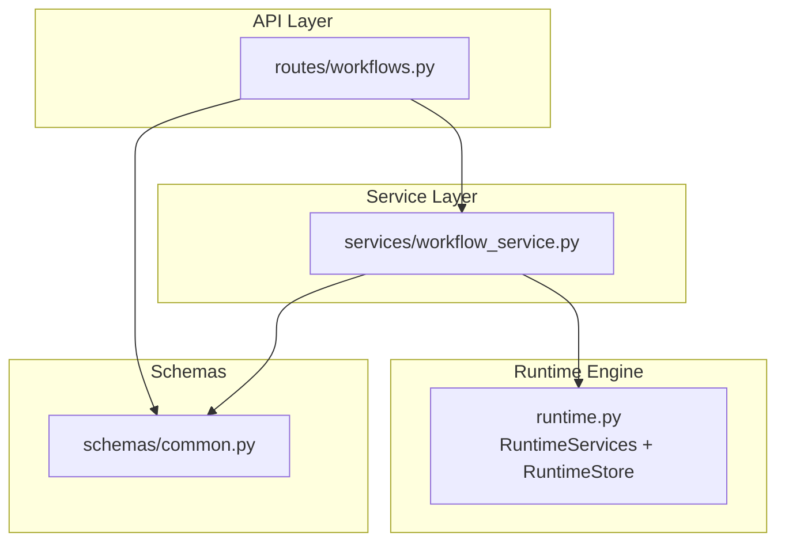
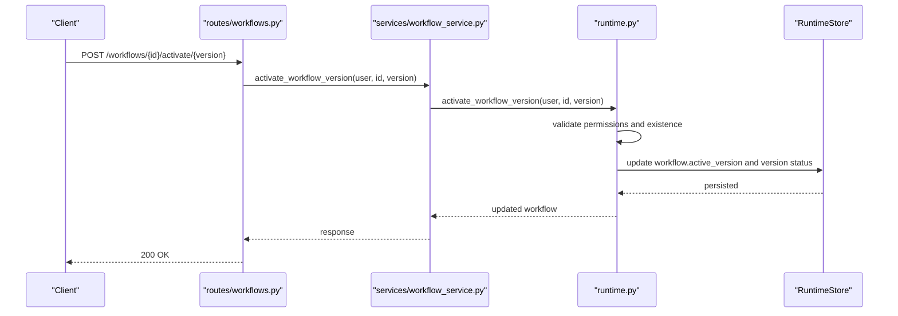
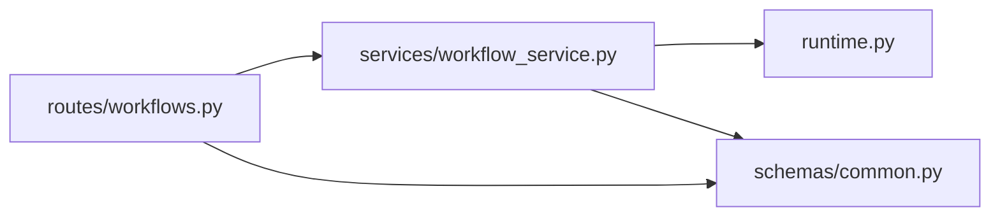

# Versioning & Lifecycle Management

<cite>
**Referenced Files in This Document**
- [runtime.py](file://backend/app/runtime.py)
- [workflow_service.py](file://backend/app/services/workflow_service.py)
- [workflows.py](file://backend/app/api/v1/routes/workflows.py)
- [common.py](file://backend/app/schemas/common.py)
</cite>

## Table of Contents
1. [Introduction](#introduction)
2. [Project Structure](#project-structure)
3. [Core Components](#core-components)
4. [Architecture Overview](#architecture-overview)
5. [Detailed Component Analysis](#detailed-component-analysis)
6. [Dependency Analysis](#dependency-analysis)
7. [Performance Considerations](#performance-considerations)
8. [Troubleshooting Guide](#troubleshooting-guide)
9. [Conclusion](#conclusion)
10. [Appendices](#appendices)

## Introduction
This document explains workflow versioning and lifecycle management as implemented in the backend. It covers:
- Workflow states and transitions (draft, active, disabled, archived)
- Version control mechanisms (create versions, activate a version, rollback to a previous version)
- Promotion workflows across environments (development, staging, production)
- Activation strategies including canary deployments and A/B testing patterns
- Backup and restore operations for runtime state
- Migration procedures between major versions and compatibility checks
- Practical examples for managing lifecycles in different environments

The implementation is centered around an in-process runtime store that persists workflow definitions and their versions, with API endpoints and services orchestrating lifecycle actions.

## Project Structure
The relevant parts of the codebase for workflow versioning and lifecycle are:
- API routes for workflow CRUD and version operations
- Service layer exposing high-level operations
- Schemas defining request/response contracts
- Runtime engine providing persistence, normalization, and bootstrap logic

**Diagram sources**
- [workflows.py:1-76](file://backend/app/api/v1/routes/workflows.py#L1-L76)
- [workflow_service.py:1-38](file://backend/app/services/workflow_service.py#L1-L38)
- [runtime.py:258-384](file://backend/app/runtime.py#L258-L384)
- [common.py:106-153](file://backend/app/schemas/common.py#L106-L153)

**Section sources**
- [workflows.py:1-76](file://backend/app/api/v1/routes/workflows.py#L1-L76)
- [workflow_service.py:1-38](file://backend/app/services/workflow_service.py#L1-L38)
- [runtime.py:258-384](file://backend/app/runtime.py#L258-L384)
- [common.py:106-153](file://backend/app/schemas/common.py#L106-L153)

## Core Components
- API Routes: Expose endpoints for listing, creating, updating workflows; creating and listing versions; activating a version; disabling; archiving; and starting runs.
- Services: Thin wrappers over runtime methods for workflow lifecycle operations.
- Runtime: Provides persistence (Postgres or JSON file), bootstrapping, normalization, and core business logic for workflows and versions.
- Schemas: Define typed requests for workflow creation, updates, and versioning.

Key responsibilities:
- Versioning: Create immutable versions, maintain an active_version pointer on the workflow record.
- Lifecycle: Set workflow status to draft/active/disabled/archived; enforce permissions and rate limits.
- Persistence: Save normalized workflow records and versions atomically.

**Section sources**
- [workflows.py:15-76](file://backend/app/api/v1/routes/workflows.py#L15-L76)
- [workflow_service.py:1-38](file://backend/app/services/workflow_service.py#L1-L38)
- [runtime.py:674-728](file://backend/app/runtime.py#L674-L728)
- [common.py:110-153](file://backend/app/schemas/common.py#L110-L153)

## Architecture Overview
The following sequence shows how a client activates a specific workflow version through the API into the runtime store.

**Diagram sources**
- [workflows.py:48-55](file://backend/app/api/v1/routes/workflows.py#L48-L55)
- [workflow_service.py:28-29](file://backend/app/services/workflow_service.py#L28-L29)
- [runtime.py:258-384](file://backend/app/runtime.py#L258-L384)

## Detailed Component Analysis

### Workflow States and Transitions
Implemented states:
- draft: Default for new workflows or non-active versions
- active: The current production-ready state
- disabled: Temporarily halted; not executable
- archived: Retired; kept for history

Transitions:
- Create workflow: defaults to draft
- Activate a version: sets workflow.status to active and marks the selected version as active
- Disable workflow: sets workflow.status to disabled
- Archive workflow: sets workflow.status to archived

Notes:
- Each workflow maintains an active_version pointer and a versions list where each version has its own status and metadata.
- Normalization ensures missing fields are populated during bootstrap and migration.

**Section sources**
- [runtime.py:674-728](file://backend/app/runtime.py#L674-L728)
- [workflows.py:53-65](file://backend/app/api/v1/routes/workflows.py#L53-L65)
- [workflow_service.py:28-37](file://backend/app/services/workflow_service.py#L28-L37)

### Version Control Mechanisms
- Create version: Adds a new immutable version entry with steps snapshot and timestamp.
- List versions: Returns all versions for a workflow.
- Activate version: Updates the workflow’s active_version and version status accordingly.
- Update workflow: Allows partial updates to metadata and steps; normalization preserves existing versions unless explicitly created via the version endpoint.

Operational guarantees:
- Versions are immutable once created.
- Only one active version per workflow at any time.
- Active version must exist before execution.

**Section sources**
- [workflows.py:37-55](file://backend/app/api/v1/routes/workflows.py#L37-L55)
- [workflow_service.py:12-29](file://backend/app/services/workflow_service.py#L12-L29)
- [runtime.py:674-728](file://backend/app/runtime.py#L674-L728)

### Rollback Procedures
To roll back to a previous version:
1. List versions for the workflow.
2. Identify the target version to revert to.
3. Activate that version using the activation endpoint.

This effectively re-points the workflow’s active_version to the chosen historical version.

**Section sources**
- [workflows.py:42-55](file://backend/app/api/v1/routes/workflows.py#L42-L55)
- [workflow_service.py:12-29](file://backend/app/services/workflow_service.py#L12-L29)

### Promotion Workflows Across Environments
Recommended pattern:
- Development: Create and iterate on drafts; create multiple versions for experimentation.
- Staging: Promote a candidate version by activating it; run validation and integration tests.
- Production: Activate the same version after approvals; keep audit logs and governance policies enforced.

Implementation notes:
- Use the same API calls across environments; environment differences are controlled by configuration and access controls.
- Leverage governance and evaluation policies attached to workflows to gate promotions.

**Section sources**
- [runtime.py:674-728](file://backend/app/runtime.py#L674-L728)
- [workflows.py:37-55](file://backend/app/api/v1/routes/workflows.py#L37-L55)

### Activation Strategies: Canary and A/B Testing
While the system does not implement traffic splitting natively, you can model these strategies using versions:
- Canary deployment:
  - Keep the current active version as baseline.
  - Create a new version with changes and set its status to draft.
  - Route a subset of executions to the canary version by invoking runs against the canary workflow ID or by using a separate workflow alias pointing to the canary version.
- A/B testing:
  - Maintain two parallel workflows (or two versions) representing variants A and B.
  - Direct traffic to either variant based on user segments or feature flags.
  - Compare outcomes using evaluation and process intelligence artifacts.

These patterns rely on the ability to manage multiple versions and selectively activate them.

[No sources needed since this section provides conceptual guidance]

### Backup and Restore Operations
Persistence options:
- Postgres-backed JSONB storage when configured.
- JSON file fallback for local development and offline backup.

Backup:
- Export the JSON file snapshot from the data directory.
- If using Postgres, export the runtime_state table payload.

Restore:
- Replace the JSON file with a previously saved snapshot and restart the service.
- For Postgres, import the payload into the runtime_state table.

Important:
- The runtime always writes a JSON snapshot alongside Postgres for portability and disaster recovery.

**Section sources**
- [runtime.py:258-384](file://backend/app/runtime.py#L258-L384)

### Migration Procedures Between Major Versions
Normalization and bootstrap:
- On startup, the runtime normalizes workflow records to ensure required fields like input/output schemas, status, active_version, and versions are present.
- Legacy fields are mapped to canonical structures, and missing values are filled with sensible defaults.

Compatibility checks:
- Ensure input/output schemas remain compatible with existing runs.
- Validate that step definitions referenced by versions still resolve correctly.
- Use evaluation policies to verify behavior before promoting a new major version.

Procedure:
1. Create a new version with updated steps and schemas.
2. Run evaluations and validations against the new version.
3. Activate the new version after approval.
4. Monitor metrics and process intelligence for regressions.

**Section sources**
- [runtime.py:674-728](file://backend/app/runtime.py#L674-L728)

### Examples: Managing Lifecycles in Different Environments
- Development:
  - Create a workflow in draft status.
  - Add multiple versions while iterating on steps.
  - Keep the latest experimental version as draft until validated.
- Staging:
  - Activate a candidate version for integration testing.
  - Enable governance and evaluation policies to enforce quality gates.
- Production:
  - Activate the approved version for live execution.
  - Use disable/archive to retire old versions safely.
  - Maintain audit logs and provenance for compliance.

**Section sources**
- [workflows.py:15-76](file://backend/app/api/v1/routes/workflows.py#L15-L76)
- [workflow_service.py:1-38](file://backend/app/services/workflow_service.py#L1-L38)
- [runtime.py:674-728](file://backend/app/runtime.py#L674-L728)

## Dependency Analysis
High-level dependencies among components:
- API routes depend on services for business logic.
- Services depend on runtime for persistence and orchestration.
- Schemas define request contracts used by both routes and services.

**Diagram sources**
- [workflows.py:1-76](file://backend/app/api/v1/routes/workflows.py#L1-L76)
- [workflow_service.py:1-38](file://backend/app/services/workflow_service.py#L1-L38)
- [runtime.py:258-384](file://backend/app/runtime.py#L258-L384)
- [common.py:106-153](file://backend/app/schemas/common.py#L106-L153)

**Section sources**
- [workflows.py:1-76](file://backend/app/api/v1/routes/workflows.py#L1-L76)
- [workflow_service.py:1-38](file://backend/app/services/workflow_service.py#L1-L38)
- [runtime.py:258-384](file://backend/app/runtime.py#L258-L384)
- [common.py:106-153](file://backend/app/schemas/common.py#L106-L153)

## Performance Considerations
- Prefer Postgres-backed persistence for concurrent write safety and durability.
- Avoid frequent full workflow updates; prefer creating new versions for changes.
- Use rate limiting on write endpoints to protect the runtime store.
- Batch operations where possible and leverage idempotency keys for run invocations.

[No sources needed since this section provides general guidance]

## Troubleshooting Guide
Common issues and resolutions:
- Not found errors: Verify workflow_id and version exist before activation.
- Permission denied: Ensure the authenticated user has the required permissions for the operation.
- Validation errors: Check schema constraints for input_payload and version steps.
- Rate limiting: Respect retry-after headers and throttle write operations.

Operational tips:
- Inspect the JSON snapshot for last known good state.
- Review audit logs and process metrics to trace failures.
- Re-run evaluations against the problematic version to identify regressions.

**Section sources**
- [runtime.py:93-129](file://backend/app/runtime.py#L93-L129)
- [workflows.py:1-76](file://backend/app/api/v1/routes/workflows.py#L1-L76)

## Conclusion
The system provides robust workflow versioning and lifecycle management through clear APIs, immutable versions, and a flexible runtime store. By leveraging normalization, governance, and evaluation policies, teams can safely promote versions across environments, perform rollbacks, and adopt canary/A-B strategies without compromising stability.

[No sources needed since this section summarizes without analyzing specific files]

## Appendices

### API Endpoints Summary
- List workflows
- Get workflow detail
- Create workflow
- Update workflow
- Create workflow version
- List workflow versions
- Activate workflow version
- Disable workflow
- Archive workflow
- Start workflow run

**Section sources**
- [workflows.py:15-76](file://backend/app/api/v1/routes/workflows.py#L15-L76)
- [common.py:106-153](file://backend/app/schemas/common.py#L106-L153)