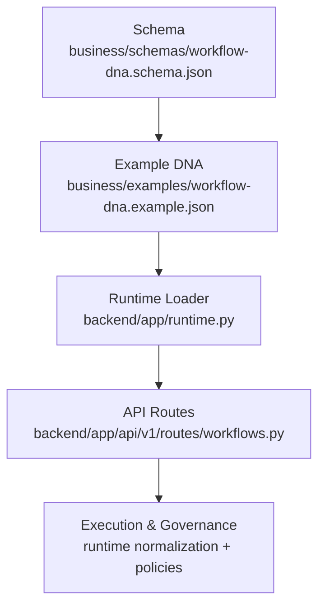
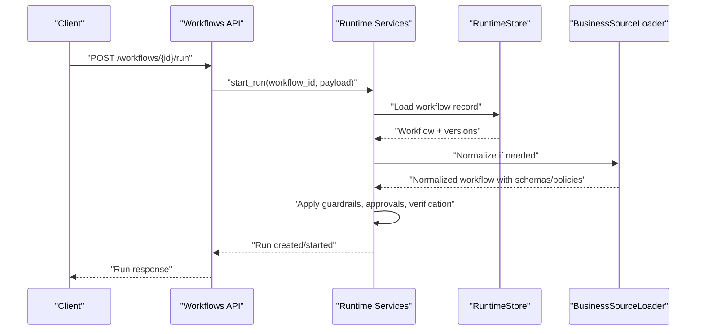
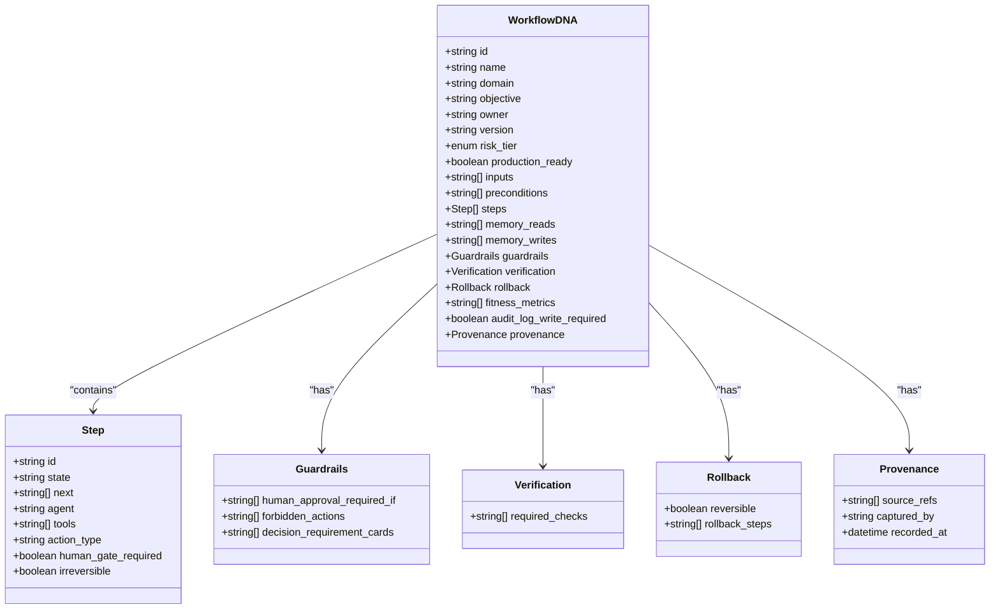
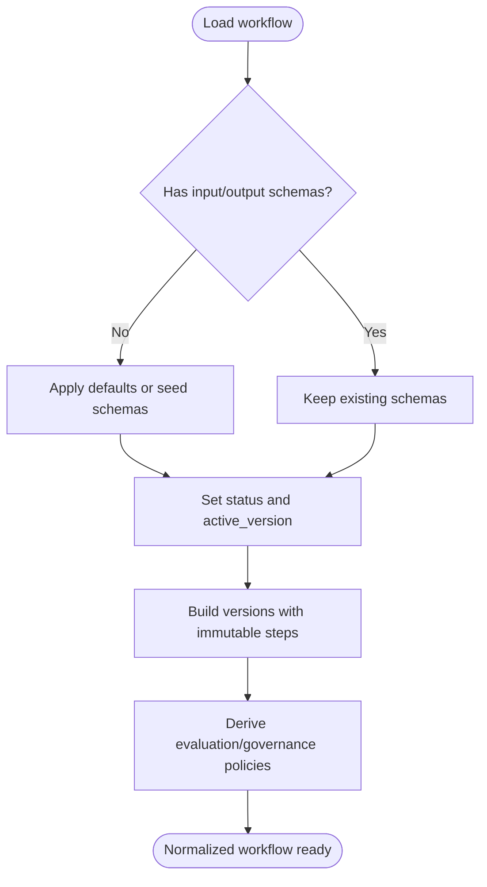
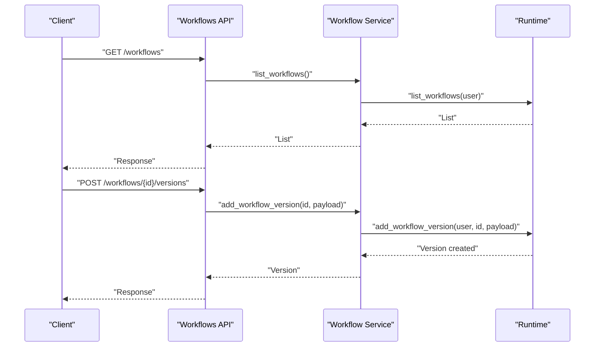
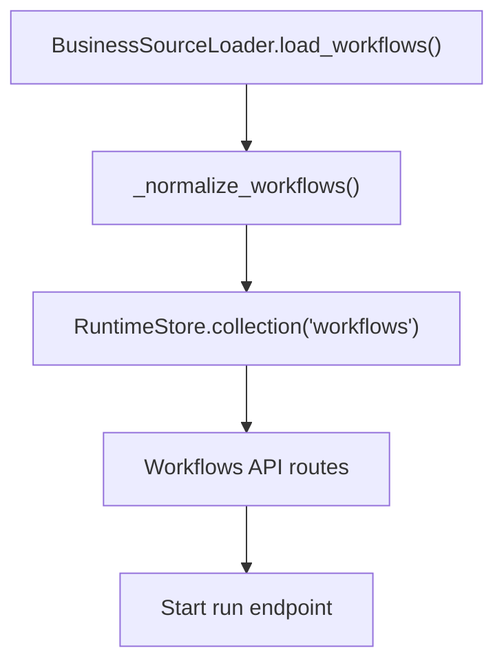

# Workflow DNA Definition

<cite>
**Referenced Files in This Document**
- [workflow-dna.schema.json](file://business/schemas/workflow-dna.schema.json)
- [workflow-dna.example.json](file://business/examples/workflow-dna.example.json)
- [workflow-dna.md](file://docs/workflow-dna.md)
- [workflows.py (API routes)](file://backend/app/api/v1/routes/workflows.py)
- [runtime.py](file://backend/app/runtime.py)
</cite>

## Table of Contents
1. [Introduction](#introduction)
2. [Project Structure](#project-structure)
3. [Core Components](#core-components)
4. [Architecture Overview](#architecture-overview)
5. [Detailed Component Analysis](#detailed-component-analysis)
6. [Dependency Analysis](#dependency-analysis)
7. [Performance Considerations](#performance-considerations)
8. [Troubleshooting Guide](#troubleshooting-guide)
9. [Conclusion](#conclusion)
10. [Appendices](#appendices)

## Introduction
This document defines the Workflow DNA definition format and structure used by the system to describe bounded, auditable workflows. It specifies the JSON schema for workflow definitions, including metadata, steps configuration, input/output schemas, versioning information, guardrails, verification, rollback, memory access, and provenance. It also explains step types, conditional logic, error handling configurations, parameter passing between steps, and provides examples for sequential, parallel, and branching patterns. Validation rules, required fields, and best practices are included to guide robust workflow design.

## Project Structure
The Workflow DNA is defined as a JSON Schema and exemplified with a concrete workflow file. The runtime loads and normalizes these definitions into an internal representation that supports execution, versioning, and governance.

**Diagram sources**
- [workflow-dna.schema.json:1-258](file://business/schemas/workflow-dna.schema.json#L1-L258)
- [workflow-dna.example.json:1-153](file://business/examples/workflow-dna.example.json#L1-L153)
- [runtime.py:395-436](file://backend/app/runtime.py#L395-L436)
- [workflows.py (API routes):1-76](file://backend/app/api/v1/routes/workflows.py#L1-L76)

**Section sources**
- [workflow-dna.md:1-37](file://docs/workflow-dna.md#L1-L37)
- [workflow-dna.schema.json:1-258](file://business/schemas/workflow-dna.schema.json#L1-L258)
- [workflow-dna.example.json:1-153](file://business/examples/workflow-dna.example.json#L1-L153)
- [runtime.py:395-436](file://backend/app/runtime.py#L395-L436)
- [workflows.py (API routes):1-76](file://backend/app/api/v1/routes/workflows.py#L1-L76)

## Core Components
- Metadata and identity: id, name, domain, objective, owner, version, risk_tier, production_ready
- Inputs and preconditions: inputs (list of required input identifiers), preconditions (boolean expressions or checks)
- Steps graph: ordered list of steps defining state transitions, agents, tools, action_type, human gates, and irreversibility
- Memory access: memory_reads and memory_writes (scopes/names)
- Guardrails: conditions requiring human approval and forbidden actions
- Verification: required_checks to validate outcomes
- Rollback: reversibility flag and rollback_steps
- Fitness metrics: observability and performance indicators
- Audit logging: audit_log_write_required
- Provenance: source_refs, captured_by, recorded_at

Validation and runtime behavior:
- The schema enforces required fields and basic constraints.
- The runtime normalizes DNA-only records into runnable workflow objects with input/output schemas, versions, and governance policies.

**Section sources**
- [workflow-dna.schema.json:1-258](file://business/schemas/workflow-dna.schema.json#L1-L258)
- [workflow-dna.example.json:1-153](file://business/examples/workflow-dna.example.json#L1-L153)
- [runtime.py:674-728](file://backend/app/runtime.py#L674-L728)

## Architecture Overview
Workflow DNA definitions are authored as JSON files validated against the schema. At runtime, they are loaded, normalized, and exposed via API endpoints for listing, creating, updating, versioning, activating, disabling, archiving, and executing runs.

**Diagram sources**
- [workflows.py (API routes):68-76](file://backend/app/api/v1/routes/workflows.py#L68-L76)
- [runtime.py:395-436](file://backend/app/runtime.py#L395-L436)
- [runtime.py:674-728](file://backend/app/runtime.py#L674-L728)

## Detailed Component Analysis

### Workflow DNA JSON Schema
The schema defines the contract for all production-grade workflow definitions. Key aspects include:
- Required top-level fields ensure traceability, safety, and operational clarity.
- Steps define a directed graph via next arrays; each step declares agent, tools, action_type, human_gate_required, and irreversible flags.
- Guardrails enforce policy-driven human approval and forbid dangerous actions.
- Verification requires post-execution checks.
- Rollback configures reversibility and remediation steps.
- Provenance captures authorship and source references.

**Diagram sources**
- [workflow-dna.schema.json:1-258](file://business/schemas/workflow-dna.schema.json#L1-L258)

**Section sources**
- [workflow-dna.schema.json:1-258](file://business/schemas/workflow-dna.schema.json#L1-L258)

### Example Workflow
A flagship example demonstrates a sequential onboarding flow with a critical human gate before irreversible billing activation. It includes memory reads/writes, guardrails, verification checks, rollback plan, fitness metrics, and provenance.

Use cases illustrated:
- Sequential processing across research → execution → critical gate → notification → verification
- Human gate enforcement at irreversible steps
- Post-run verification and audit logging

**Section sources**
- [workflow-dna.example.json:1-153](file://business/examples/workflow-dna.example.json#L1-L153)

### Runtime Normalization and Versioning
The runtime ensures DNA-only or partial workflow records become fully runnable by:
- Assigning default input/output schemas when missing
- Deriving status and active_version from production_ready and seed data
- Building versions with immutable snapshots of steps
- Populating evaluation and governance policies based on risk tier and human gate steps

**Diagram sources**
- [runtime.py:674-728](file://backend/app/runtime.py#L674-L728)

**Section sources**
- [runtime.py:395-436](file://backend/app/runtime.py#L395-L436)
- [runtime.py:674-728](file://backend/app/runtime.py#L674-L728)

### API Surface for Workflows
Endpoints support full lifecycle management and run initiation:
- List and detail workflows
- Create/update workflows
- Create versions and activate specific versions
- Disable/archive workflows
- Start runs with optional idempotency key

**Diagram sources**
- [workflows.py (API routes):15-56](file://backend/app/api/v1/routes/workflows.py#L15-L56)

**Section sources**
- [workflows.py (API routes):1-76](file://backend/app/api/v1/routes/workflows.py#L1-76)

### Step Types and Execution Semantics
- Tool execution: steps invoke tools via agents; tool permissions and scopes govern access.
- Memory operations: declared via memory_reads and memory_writes; enforced by agent allowed_memory_scopes.
- Approval gates: human_gate_required triggers pause until approval; irreversible steps often require gates.
- Action types: analysis, reversible_execution, irreversible_execution, notification, audit.

Parameter passing between steps:
- Use next arrays to define control flow.
- Pass outputs implicitly through shared context or explicitly via tool effects and memory writes consumed by subsequent steps.

Conditional logic:
- Preconditions at the workflow level gate start.
- Guardrails evaluate conditions like risk tier and tool action characteristics to enforce approvals.
- Verification required_checks assert post-run correctness.

Error handling:
- Rollback steps can be executed if reversible is true.
- Forbidden actions are blocked by guardrails.
- ApprovalRequiredError indicates human intervention is needed.

**Section sources**
- [workflow-dna.schema.json:78-134](file://business/schemas/workflow-dna.schema.json#L78-L134)
- [workflow-dna.schema.json:151-182](file://business/schemas/workflow-dna.schema.json#L151-L182)
- [workflow-dna.schema.json:183-218](file://business/schemas/workflow-dna.schema.json#L183-L218)
- [runtime.py:112-129](file://backend/app/runtime.py#L112-L129)

### Patterns and Examples

#### Simple Sequential Workflow
- Steps form a linear chain where each step’s next points to the following step.
- Suitable for intake → process → notify → verify flows.

Implementation hints:
- Ensure each step has a unique id and valid next reference.
- Mark irreversible steps with human_gate_required and configure rollback.

**Section sources**
- [workflow-dna.example.json:19-91](file://business/examples/workflow-dna.example.json#L19-L91)

#### Parallel Processing Pattern
- A step may have multiple entries in next to fan out to independent branches.
- Merge later by converging on a common verification step.

Design tips:
- Keep branches idempotent and safe to retry.
- Use memory writes to coordinate results across branches.

[No sources needed since this section doesn't analyze specific files]

#### Complex Branching Scenario
- Conditional routing based on preconditions or guardrail evaluations.
- Decision requirement cards can inform branch selection.

Operational guidance:
- Document branch rationale in objective and provenance.
- Add verification checks per branch outcome.

[No sources needed since this section doesn't analyze specific files]

## Dependency Analysis
The runtime composes several components to normalize and execute workflows:
- BusinessSourceLoader seeds and enriches workflow records with schemas, versions, and policies.
- RuntimeStore persists state and provides collections for workflows, runs, approvals, etc.
- API routes expose CRUD and execution endpoints backed by services and runtime.

**Diagram sources**
- [runtime.py:395-436](file://backend/app/runtime.py#L395-L436)
- [runtime.py:674-728](file://backend/app/runtime.py#L674-L728)
- [workflows.py (API routes):68-76](file://backend/app/api/v1/routes/workflows.py#L68-L76)

**Section sources**
- [runtime.py:395-436](file://backend/app/runtime.py#L395-L436)
- [runtime.py:674-728](file://backend/app/runtime.py#L674-L728)
- [workflows.py (API routes):1-76](file://backend/app/api/v1/routes/workflows.py#L1-76)

## Performance Considerations
- Prefer minimal memory reads/writes to reduce overhead.
- Keep step graphs shallow and avoid deep recursion in next chains.
- Use idempotency keys for run creation to prevent duplicate work.
- Batch verification checks where possible to minimize repeated tool calls.

[No sources needed since this section provides general guidance]

## Troubleshooting Guide
Common issues and resolutions:
- Missing required fields: Validate against the schema; ensure id, name, domain, objective, owner, version, risk_tier, inputs, preconditions, steps, memory_reads, memory_writes, guardrails, verification, rollback, fitness_metrics, audit_log_write_required, provenance are present.
- High-risk actions without gates: Guardrails must include human_approval_required_if conditions for irreversible or high-tier actions.
- Irreversible actions without rollback: Configure rollback.reversible and rollback.rollback_steps accordingly.
- Missing provenance: Provide source_refs, captured_by, and recorded_at.
- Undeclared audit writes: Set audit_log_write_required to true when required by policy.

Relevant errors:
- ApprovalRequiredError indicates a human gate is pending.
- ValidationError signals schema or business rule violations.

**Section sources**
- [workflow-dna.schema.json:1-258](file://business/schemas/workflow-dna.schema.json#L1-L258)
- [runtime.py:112-129](file://backend/app/runtime.py#L112-L129)

## Conclusion
The Workflow DNA definition provides a rigorous, auditable contract for building safe, verifiable, and evolvable workflows. By adhering to the schema, leveraging guardrails and verification, and using the runtime’s normalization and versioning features, teams can implement robust automation with clear governance and traceability.

[No sources needed since this section summarizes without analyzing specific files]

## Appendices

### Validation Commands
- Use provided commands to validate business assets and evolution checks.

**Section sources**
- [workflow-dna.md:25-32](file://docs/workflow-dna.md#L25-L32)