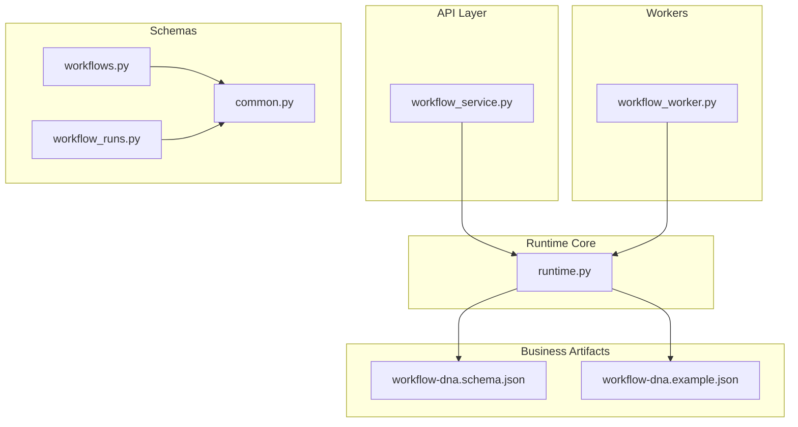
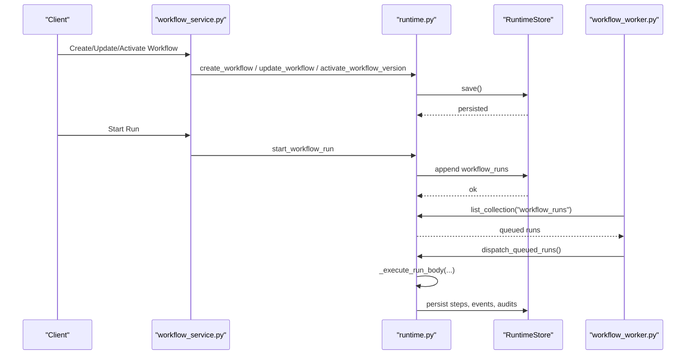
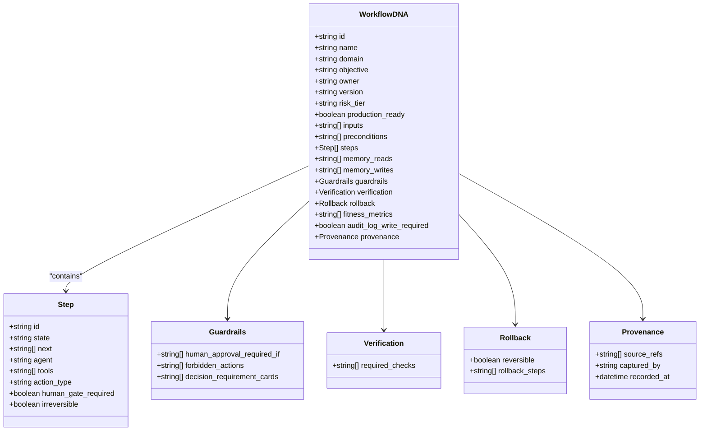
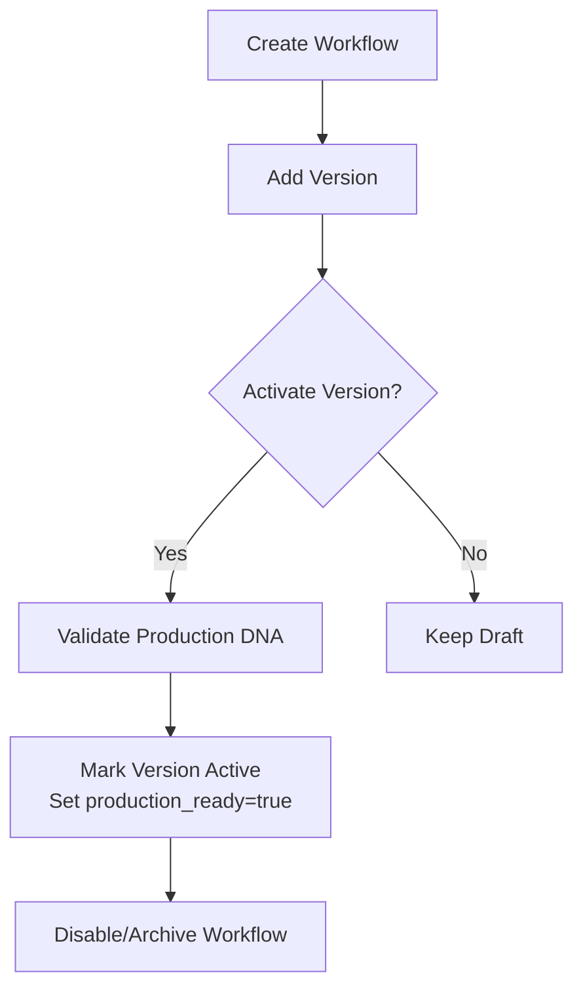
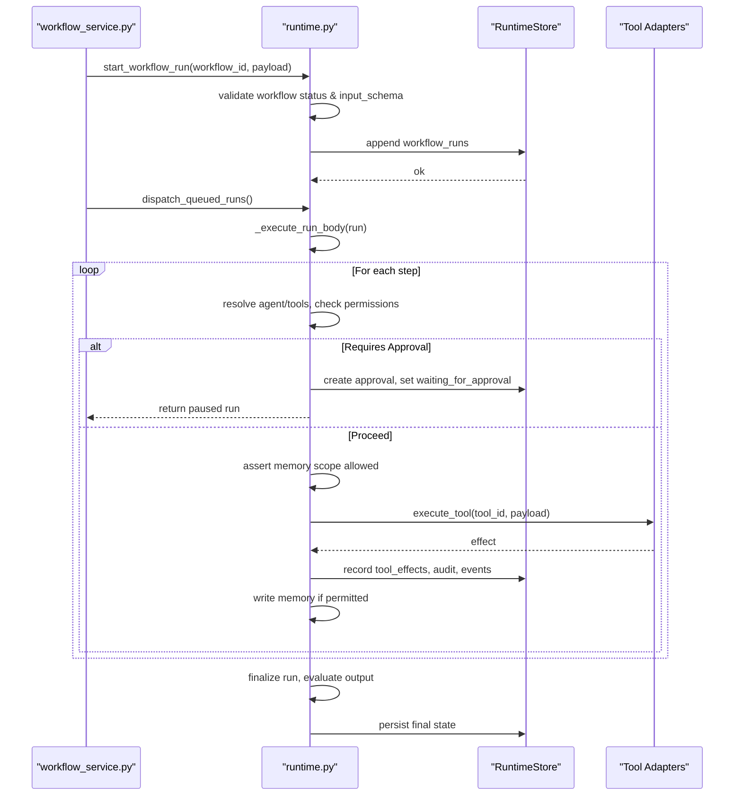
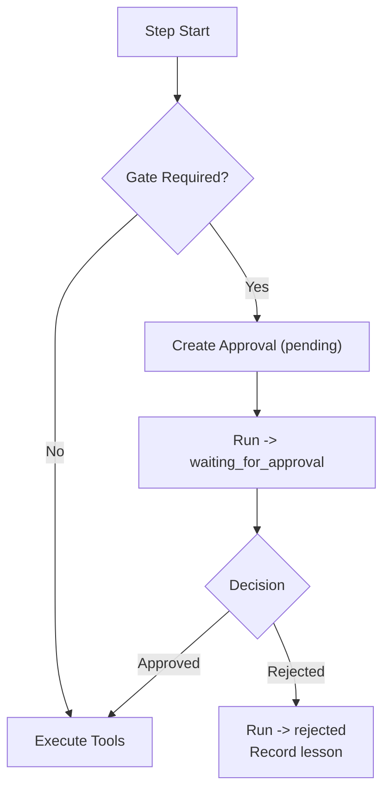
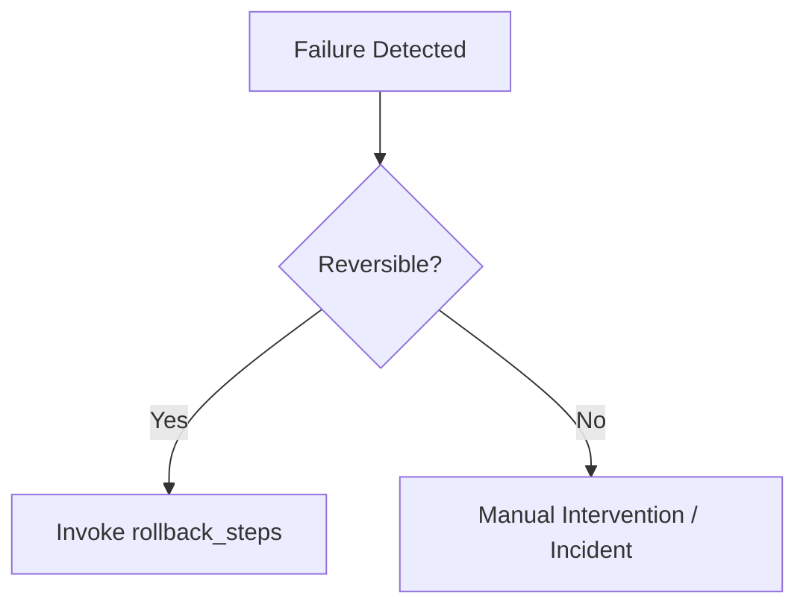
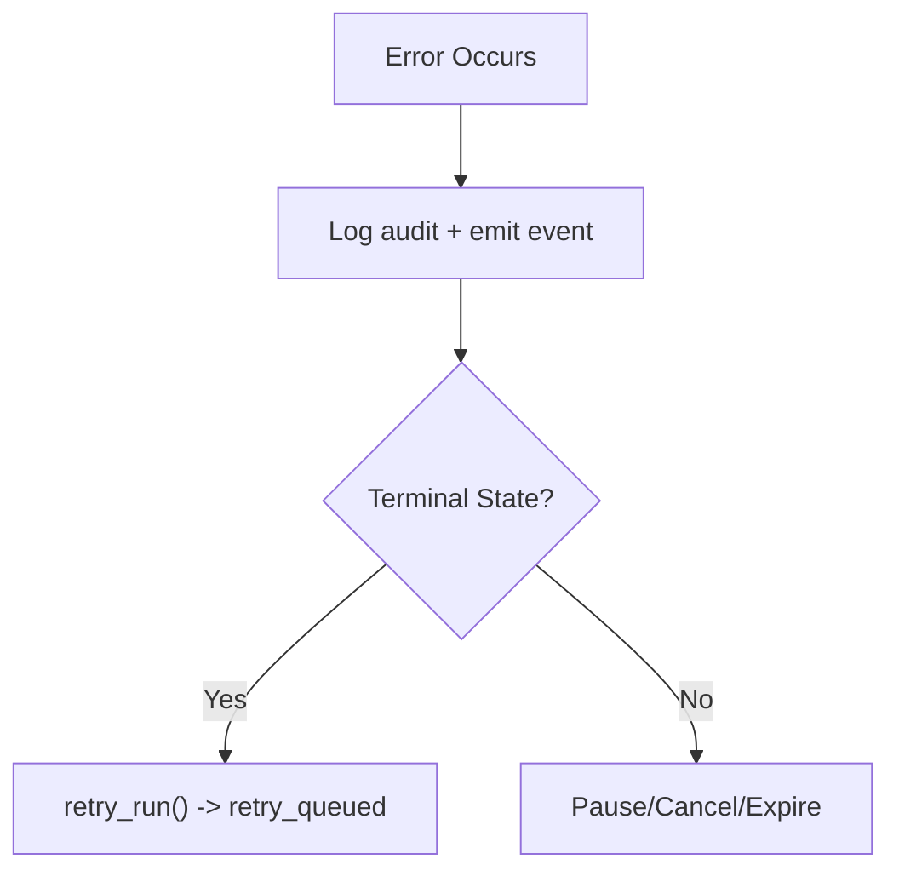
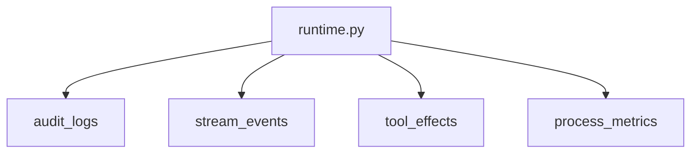
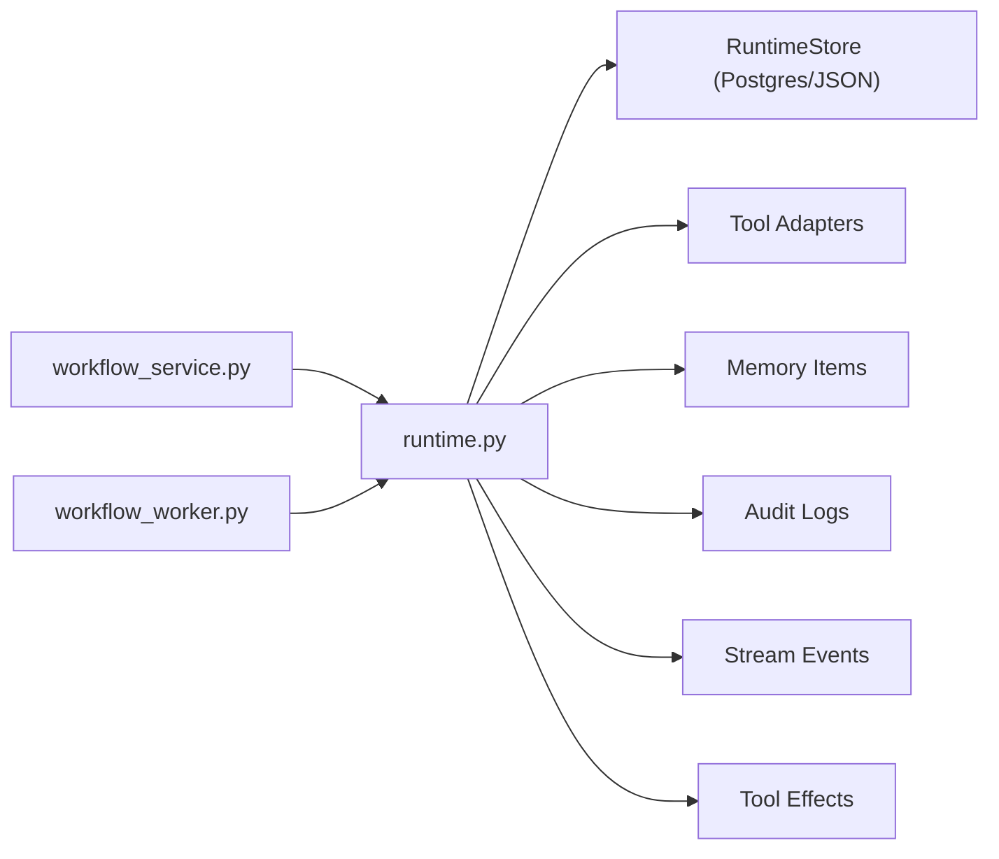

# Workflow Engine

<cite>
**Referenced Files in This Document**
- [runtime.py](file://backend/app/runtime.py)
- [workflow_service.py](file://backend/app/services/workflow_service.py)
- [workflow_worker.py](file://backend/app/workers/workflow_worker.py)
- [workflows.py](file://backend/app/schemas/workflows.py)
- [workflow_runs.py](file://backend/app/schemas/workflow_runs.py)
- [common.py](file://backend/app/schemas/common.py)
- [workflow-dna.schema.json](file://business/schemas/workflow-dna.schema.json)
- [workflow-dna.example.json](file://business/examples/workflow-dna.example.json)
</cite>

## Table of Contents
1. [Introduction](#introduction)
2. [Project Structure](#project-structure)
3. [Core Components](#core-components)
4. [Architecture Overview](#architecture-overview)
5. [Detailed Component Analysis](#detailed-component-analysis)
6. [Dependency Analysis](#dependency-analysis)
7. [Performance Considerations](#performance-considerations)
8. [Troubleshooting Guide](#troubleshooting-guide)
9. [Conclusion](#conclusion)
10. [Appendices](#appendices)

## Introduction
This document explains the workflow DNA execution engine: how workflows are defined, versioned, validated, and executed; how human-in-the-loop approvals are enforced; how errors, retries, and recovery work; and how to monitor and tune performance. It is intended for both technical and non-technical readers.

## Project Structure
The workflow engine is implemented primarily in the backend runtime layer with supporting services, workers, schemas, and business artifacts (schema and example). The key files are:
- Runtime orchestration and persistence: runtime.py
- Service facade over runtime: workflow_service.py
- Worker helper for pending runs: workflow_worker.py
- Pydantic request/response models: common.py, workflows.py, workflow_runs.py
- Business definition schema and example: workflow-dna.schema.json, workflow-dna.example.json

**Diagram sources**
- [workflow_service.py:1-38](file://backend/app/services/workflow_service.py#L1-L38)
- [runtime.py:1454-1626](file://backend/app/runtime.py#L1454-L1626)
- [workflow_worker.py:1-10](file://backend/app/workers/workflow_worker.py#L1-L10)
- [common.py:106-153](file://backend/app/schemas/common.py#L106-L153)
- [workflows.py:1-2](file://backend/app/schemas/workflows.py#L1-L2)
- [workflow_runs.py:1-2](file://backend/app/schemas/workflow_runs.py#L1-L2)
- [workflow-dna.schema.json:1-258](file://business/schemas/workflow-dna.schema.json#L1-L258)
- [workflow-dna.example.json:1-153](file://business/examples/workflow-dna.example.json#L1-L153)

**Section sources**
- [workflow_service.py:1-38](file://backend/app/services/workflow_service.py#L1-L38)
- [workflow_worker.py:1-10](file://backend/app/workers/workflow_worker.py#L1-L10)
- [common.py:106-153](file://backend/app/schemas/common.py#L106-L153)
- [workflows.py:1-2](file://backend/app/schemas/workflows.py#L1-L2)
- [workflow_runs.py:1-2](file://backend/app/schemas/workflow_runs.py#L1-L2)
- [workflow-dna.schema.json:1-258](file://business/schemas/workflow-dna.schema.json#L1-L258)
- [workflow-dna.example.json:1-153](file://business/examples/workflow-dna.example.json#L1-L153)

## Core Components
- RuntimeServices: Central orchestrator for authentication, authorization, workflow CRUD, run lifecycle, approvals, memory access control, tool execution, evaluation, audit logging, and event emission.
- RuntimeStore: Persistent store abstraction that persists state to Postgres or JSON file fallback.
- Services: Thin API-facing functions delegating to RuntimeServices.
- Workers: Helpers to discover and dispatch queued runs.
- Schemas: Pydantic models for requests/responses used by API layers.
- Business Artifacts: Schema and example defining the workflow DNA format.

Key responsibilities:
- Definition and versioning: create/update/add versions/activate/disable/archive workflows.
- Execution orchestration: start/run/dispatch/pause/resume/retry/cancel/expire runs.
- Human gates: approval creation, decision handling, reassignment.
- Tool execution and side effects: adapter-based execution with effect recording.
- Memory scoping: read/write with agent scope enforcement.
- Evaluation and governance: post-run checks and policy summaries.
- Audit and events: comprehensive logging and stream events.

**Section sources**
- [runtime.py:258-393](file://backend/app/runtime.py#L258-L393)
- [runtime.py:556-800](file://backend/app/runtime.py#L556-L800)
- [runtime.py:1454-1626](file://backend/app/runtime.py#L1454-L1626)
- [runtime.py:1660-1749](file://backend/app/runtime.py#L1660-L1749)
- [runtime.py:1755-1867](file://backend/app/runtime.py#L1755-L1867)
- [runtime.py:1938-2210](file://backend/app/runtime.py#L1938-L2210)
- [runtime.py:2211-2337](file://backend/app/runtime.py#L2211-L2337)
- [workflow_service.py:1-38](file://backend/app/services/workflow_service.py#L1-L38)
- [workflow_worker.py:1-10](file://backend/app/workers/workflow_worker.py#L1-L10)
- [common.py:106-153](file://backend/app/schemas/common.py#L106-L153)

## Architecture Overview
High-level flow from API to worker to runtime:

**Diagram sources**
- [workflow_service.py:16-33](file://backend/app/services/workflow_service.py#L16-L33)
- [runtime.py:1485-1606](file://backend/app/runtime.py#L1485-L1606)
- [runtime.py:1660-1749](file://backend/app/runtime.py#L1660-L1749)
- [runtime.py:1755-1767](file://backend/app/runtime.py#L1755-L1767)
- [runtime.py:1938-2210](file://backend/app/runtime.py#L1938-L2210)
- [workflow_worker.py:4-9](file://backend/app/workers/workflow_worker.py#L4-L9)

## Detailed Component Analysis

### Workflow DNA Definition Format and Validation
- Schema contract: The business artifact defines the canonical structure for a workflow DNA including identifiers, risk tier, inputs, preconditions, steps, memory scopes, guardrails, verification, rollback, fitness metrics, audit requirements, and provenance.
- Steps model: Each step declares id, state, next targets, agent, tools, action_type, human_gate_required, and irreversible flags.
- Validation at activation: When activating a version or marking production-ready, the runtime enforces additional production DNA rules via a validator integration point.

**Diagram sources**
- [workflow-dna.schema.json:1-258](file://business/schemas/workflow-dna.schema.json#L1-L258)

**Section sources**
- [workflow-dna.schema.json:1-258](file://business/schemas/workflow-dna.schema.json#L1-L258)
- [workflow-dna.example.json:1-153](file://business/examples/workflow-dna.example.json#L1-L153)
- [runtime.py:1469-1484](file://backend/app/runtime.py#L1469-L1484)

### Versioning and Activation
- Create workflow: initializes metadata, default policies, and an initial version entry.
- Add version: appends a new immutable snapshot of steps under versions.
- Activate version: validates candidate as production-safe, marks target version active, sets workflow status and production_ready, and updates active_version.
- Disable/Archive: transitions workflow status for lifecycle management.

**Diagram sources**
- [runtime.py:1485-1525](file://backend/app/runtime.py#L1485-L1525)
- [runtime.py:1561-1580](file://backend/app/runtime.py#L1561-L1580)
- [runtime.py:1582-1606](file://backend/app/runtime.py#L1582-L1606)
- [runtime.py:1608-1626](file://backend/app/runtime.py#L1608-L1626)

**Section sources**
- [runtime.py:1485-1525](file://backend/app/runtime.py#L1485-L1525)
- [runtime.py:1561-1580](file://backend/app/runtime.py#L1561-L1580)
- [runtime.py:1582-1606](file://backend/app/runtime.py#L1582-L1606)
- [runtime.py:1608-1626](file://backend/app/runtime.py#L1608-L1626)

### Execution Orchestration (Sequential Processing)
- Start run: validates workflow status and input schema, creates a run record with initialized steps, emits events, and persists.
- Dispatch: picks up queued runs, marks running, and executes sequentially through steps.
- Step execution: resolves agent/tool permissions, checks for human gate requirements, performs memory reads/writes, executes tools via adapters, records effects, computes durations, and advances to next step.
- Completion: finalizes run, evaluates output against output schema, runs evaluation, and may block completion based on policy.

**Diagram sources**
- [runtime.py:1660-1749](file://backend/app/runtime.py#L1660-L1749)
- [runtime.py:1755-1767](file://backend/app/runtime.py#L1755-L1767)
- [runtime.py:1938-2210](file://backend/app/runtime.py#L1938-L2210)

**Section sources**
- [runtime.py:1660-1749](file://backend/app/runtime.py#L1660-L1749)
- [runtime.py:1755-1767](file://backend/app/runtime.py#L1755-L1767)
- [runtime.py:1938-2210](file://backend/app/runtime.py#L1938-L2210)

### Parallel vs Sequential Processing
- Current implementation processes steps sequentially within a single run. There is no explicit parallel fan-out per step in the provided code paths.
- If parallelism is needed, it would require extending the executor to schedule independent steps concurrently while preserving ordering constraints and atomicity guarantees.

[No sources needed since this section provides general guidance]

### Approval Gates and Human-in-the-Loop Controls
- Gate triggers: determined by step attributes (human_gate_required, irreversible), tool approval requirement, and risk-tier logic.
- Approval lifecycle: runtime creates a pending approval when a sensitive step is encountered; run transitions to waiting_for_approval until a decision is made.
- Decision handling: approve resumes execution; reject terminates the run and records a lesson for improvement.

**Diagram sources**
- [runtime.py:2004-2031](file://backend/app/runtime.py#L2004-L2031)
- [runtime.py:2211-2283](file://backend/app/runtime.py#L2211-L2283)

**Section sources**
- [runtime.py:2004-2031](file://backend/app/runtime.py#L2004-L2031)
- [runtime.py:2211-2283](file://backend/app/runtime.py#L2211-L2283)

### Rollback Mechanisms
- Rollback configuration: workflow DNA includes a rollback object specifying reversibility and rollback steps.
- Execution behavior: the current executor does not automatically invoke rollback steps; however, the configuration is present and can be leveraged by higher-level controllers or operators to perform compensations.

**Diagram sources**
- [workflow-dna.schema.json:199-218](file://business/schemas/workflow-dna.schema.json#L199-L218)

**Section sources**
- [workflow-dna.schema.json:199-218](file://business/schemas/workflow-dna.schema.json#L199-L218)

### Error Handling, Retry Strategies, and Recovery
- Errors: tool failures, permission denials, missing agents/tools, and validation errors transition steps/runs to failed states and emit audit/event logs.
- Retries: supports retrying terminal runs by resetting step states and queuing for dispatch.
- Lifecycle controls: pause/resume/expire/cancel provide operational recovery options.

**Diagram sources**
- [runtime.py:1769-1867](file://backend/app/runtime.py#L1769-L1867)
- [runtime.py:1869-1893](file://backend/app/runtime.py#L1869-L1893)

**Section sources**
- [runtime.py:1769-1867](file://backend/app/runtime.py#L1769-L1867)
- [runtime.py:1869-1893](file://backend/app/runtime.py#L1869-L1893)

### Monitoring, Debugging, and Observability
- Audit logs: every significant action is appended to audit_logs with actor, resource, and metadata.
- Stream events: run and step lifecycle events are emitted to stream_events for real-time monitoring.
- Tool effects: side-effectful tool executions are recorded with IDs for traceability.
- Process summary: seed process metrics are maintained for high-level observability.

**Diagram sources**
- [runtime.py:1869-1893](file://backend/app/runtime.py#L1869-L1893)
- [runtime.py:2126-2140](file://backend/app/runtime.py#L2126-L2140)
- [runtime.py:807-819](file://backend/app/runtime.py#L807-L819)

**Section sources**
- [runtime.py:1869-1893](file://backend/app/runtime.py#L1869-L1893)
- [runtime.py:2126-2140](file://backend/app/runtime.py#L2126-L2140)
- [runtime.py:807-819](file://backend/app/runtime.py#L807-L819)

## Dependency Analysis
The following diagram shows core dependencies among components involved in workflow operations.

**Diagram sources**
- [workflow_service.py:1-38](file://backend/app/services/workflow_service.py#L1-L38)
- [workflow_worker.py:1-10](file://backend/app/workers/workflow_worker.py#L1-L10)
- [runtime.py:258-393](file://backend/app/runtime.py#L258-L393)
- [runtime.py:1869-1893](file://backend/app/runtime.py#L1869-L1893)
- [runtime.py:2126-2140](file://backend/app/runtime.py#L2126-L2140)

**Section sources**
- [workflow_service.py:1-38](file://backend/app/services/workflow_service.py#L1-L38)
- [workflow_worker.py:1-10](file://backend/app/workers/workflow_worker.py#L1-L10)
- [runtime.py:258-393](file://backend/app/runtime.py#L258-L393)
- [runtime.py:1869-1893](file://backend/app/runtime.py#L1869-L1893)
- [runtime.py:2126-2140](file://backend/app/runtime.py#L2126-L2140)

## Performance Considerations
- Persistence: RuntimeStore uses a lock and writes to Postgres when available, with JSON fallback. Prefer Postgres for concurrency and durability.
- Eventual consistency: Frequent saves occur during execution; batch or coalesce where possible to reduce I/O pressure.
- Tool execution: External calls dominate latency; consider timeouts and circuit breakers at the adapter layer.
- Memory scoping: Scope checks are lightweight but add overhead; ensure agent scopes are minimal and precise.
- Evaluation: Blocking evaluations can delay completion; tune evaluation_policy.block_on_fail based on SLAs.

[No sources needed since this section provides general guidance]

## Troubleshooting Guide
Common issues and resolutions:
- Permission denied: Ensure user has required role permissions and agent has allowed_tools and memory scopes.
- Approval stuck: Check approvals collection for pending items; assign reviewer or decide.
- Tool failure: Inspect tool_effects and audit logs for tool-specific error messages.
- Run not progressing: Verify run status; use pause/resume/retry/expire as appropriate.
- Input/output validation errors: Align payload with workflow input_schema and output_schema.

**Section sources**
- [runtime.py:862-866](file://backend/app/runtime.py#L862-L866)
- [runtime.py:2238-2283](file://backend/app/runtime.py#L2238-L2283)
- [runtime.py:1869-1893](file://backend/app/runtime.py#L1869-L1893)
- [runtime.py:1769-1867](file://backend/app/runtime.py#L1769-L1867)
- [runtime.py:1628-1637](file://backend/app/runtime.py#L1628-L1637)

## Conclusion
The workflow DNA execution engine provides a robust, auditable, and policy-driven framework for orchestrating multi-step processes with human oversight. It emphasizes safety through risk tiers, approval gates, and strict memory scoping, while offering operational controls for retries, pauses, and cancellations. Extensibility points exist for tool adapters, evaluation policies, and production DNA validation.

[No sources needed since this section summarizes without analyzing specific files]

## Appendices

### Creating a Workflow DNA File
- Use the schema to define your workflow, including steps, agents, tools, and policies.
- Reference the example to understand typical structures and fields.

**Section sources**
- [workflow-dna.schema.json:1-258](file://business/schemas/workflow-dna.schema.json#L1-L258)
- [workflow-dna.example.json:1-153](file://business/examples/workflow-dna.example.json#L1-L153)

### Defining Steps
- Each step must declare id, state, next, agent, tools, action_type, human_gate_required, and irreversible.
- Choose action_type aligned with risk and reversibility expectations.

**Section sources**
- [workflow-dna.schema.json:78-134](file://business/schemas/workflow-dna.schema.json#L78-L134)

### Managing Execution States
- Use service methods to create, update, add versions, activate, disable, and archive workflows.
- Control run lifecycle with start, dispatch, pause, resume, retry, cancel, and expire.

**Section sources**
- [workflow_service.py:16-33](file://backend/app/services/workflow_service.py#L16-L33)
- [runtime.py:1485-1626](file://backend/app/runtime.py#L1485-L1626)
- [runtime.py:1660-1867](file://backend/app/runtime.py#L1660-L1867)