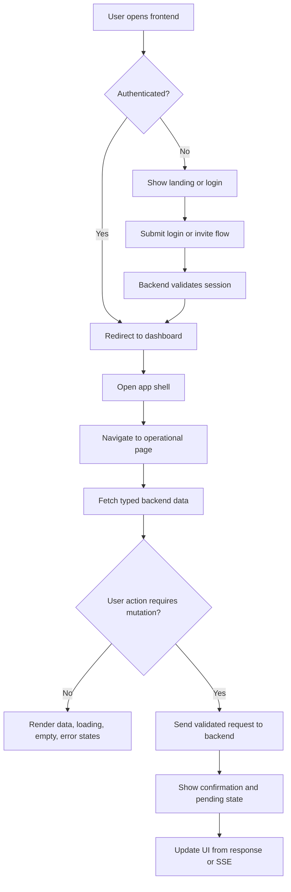

# Frontend PRD

## 1. Product Overview
Build a professional frontend for the AI Business Automation Platform that lets authenticated users operate agents, workflows, approvals, knowledge, memory, evaluations, audits, and organization settings from a secure SaaS-style web app.
- The product prioritizes operational clarity, trust, observability, and controlled execution over demo-style AI aesthetics.
- The frontend must stay presentation-focused while the backend remains the source of truth for auth, permissions, workflow execution, governance, and audit writes.

## 2. Core Features

### 2.1 User Roles
| Role | Registration Method | Core Permissions |
|------|---------------------|------------------|
| Owner | Invite or bootstrap | Full organization administration |
| Admin | Invite | Manage users, settings, agents, tools, workflows |
| Developer | Invite | Create and manage agents, tools, workflows |
| Operator | Invite | Monitor runs, processes, and knowledge operations |
| Reviewer | Invite | Review and decide approvals |
| Viewer | Invite | Read-only operational visibility |
| Billing Manager | Invite | Access billing and subscription settings |
| Security Auditor | Invite | Review audit logs and security settings |

### 2.2 Feature Modules
1. **Public entry and auth**: landing redirect, login, register, forgot password, reset password, accept invite.
2. **Authenticated shell**: sidebar navigation, sticky header, breadcrumbs, notifications placeholder, user menu, organization switcher, command palette.
3. **Dashboard**: operational summary cards, recent activity, approvals queue, knowledge health, evaluation summary, onboarding checklist.
4. **Agents and tools**: agent list/create/detail, tool list/detail, status and permission-aware actions.
5. **Workflows and runs**: workflow list/create/detail, version history, run initiation, realtime run detail with SSE timeline and logs.
6. **Approvals**: queue view, approval detail, risk indicators, approve/reject flows.
7. **Knowledge and memory**: knowledge overview, search, documents/sources views, memory list/detail with redaction-safe display.
8. **Evaluations and processes**: evaluation list/detail, process monitoring, operational analytics.
9. **Audit and settings**: audit log browsing, organization settings, users, roles, billing placeholder, API keys, security, integrations, profile.

### 2.3 Page Details
| Page Name | Module Name | Feature Description |
|-----------|-------------|---------------------|
| `/login` | Session form | Email/password login, loading and error states, secure session assumptions |
| `/app` | Dashboard | KPI cards, onboarding checklist, activity feed, quick actions |
| `/app/agents` | Agent registry | Search, filters, status, owner, tool/knowledge indicators |
| `/app/tools` | Tool catalog | Tool status, credential masking, usage insights |
| `/app/workflows` | Workflow registry | Search, filters, create action, last-run and status visibility |
| `/app/workflow-runs/[runId]` | Operations console | Realtime timeline, logs, tool calls, approval state, error panel |
| `/app/approvals` | Review queue | Risk-based queue, filters, approve/reject access |
| `/app/knowledge` | Knowledge health | Source summaries, indexing state, search entry |
| `/app/memory` | Memory records | Search/filter list, safe detail rendering, delete when permitted |
| `/app/evaluations` | Quality center | Score summaries, recent runs, trigger evaluation |
| `/app/processes` | Process monitoring | Job/process status, progress, duration, failures |
| `/app/audit-logs` | Audit explorer | Read-only table with actor/action/resource filters |
| `/app/settings/*` | Admin settings | Organization, users, roles, billing, API keys, security, integrations, profile |

## 3. Core Process
Unauthenticated users enter through the public root and are directed to login or dashboard depending on session status. After authentication, users work inside a persistent app shell where navigation is filtered by permissions. Core operational flows include creating agents, configuring tools, building workflows, running workflows, monitoring run status in real time, reviewing approvals, searching knowledge, inspecting memory, reviewing evaluations, and administering settings.

## 4. User Interface Design
### 4.1 Design Style
- Aesthetic direction: enterprise operations console with calm, editorial precision and dense but readable information surfaces.
- Primary colors: slate, midnight, steel, and controlled accent colors for semantic statuses.
- Buttons: low-radius, deliberate weight hierarchy, strong destructive emphasis, subtle hover motion only.
- Fonts: refined sans-serif for UI copy paired with a precise monospace for IDs, logs, payloads, and keys.
- Layout: desktop-first left sidebar plus sticky top header, with modular content grids and split panes for operational detail pages.
- Icon style: minimal line icons with strong semantic consistency.

### 4.2 Page Design Overview
| Page Name | Module Name | UI Elements |
|-----------|-------------|-------------|
| Dashboard | Summary grid | Dense metric cards, recent activity rails, risk badges, quick action strip |
| Workflow run detail | Split operations view | Timeline rail, live logs panel, selected-step drawer, status header |
| Approvals | Review queue | Priority indicators, reviewer actions, risk chips, confirmation dialogs |
| Settings | Structured admin panels | Sidebar subnav, forms, security notices, masked secrets, audit references |

### 4.3 Responsiveness
- Desktop-first design is required.
- Tablet uses collapsible navigation and adaptive card/table transformations.
- Mobile uses drawer navigation, single-column flows, sticky primary actions, and vertically optimized logs/timelines.
- All critical pages must include loading, empty, error, permission-denied, and not-found states where applicable.

## 5. Delivery Constraints
- The frontend must use typed API integration against the backend OpenAPI surface.
- Realtime workflow run updates must use SSE.
- Destructive actions require explicit confirmation.
- Sensitive values such as API keys must be masked after first reveal.
- The required `opendesign` MCP server is currently unavailable in this workspace, so major page layout implementation is blocked unless the MCP is configured or the project owner explicitly approves a documented fallback.
