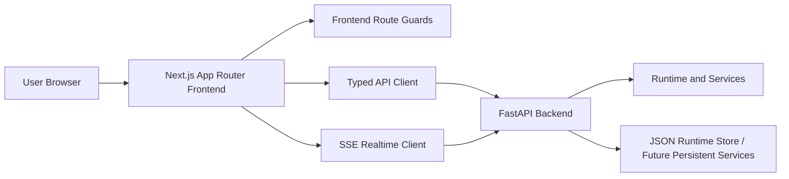
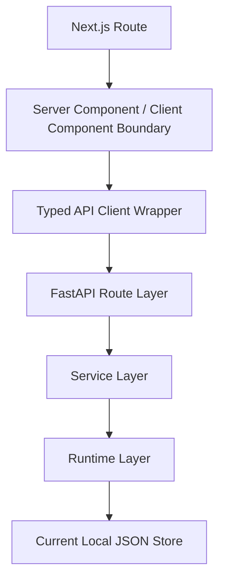
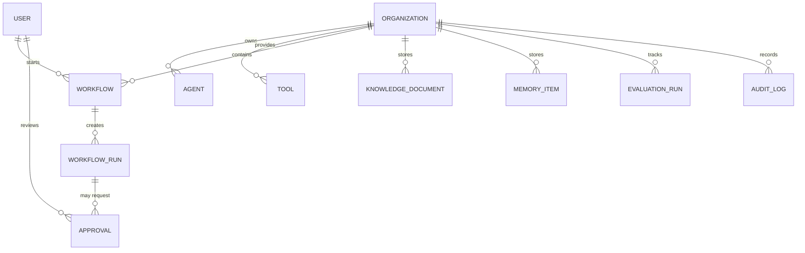

# Frontend Technical Architecture

## 1. Architecture Design


## 2. Technology Description
- Frontend: Next.js 15 + React 18 + TypeScript + Tailwind CSS
- State and UX: React Server Components for shell composition, client components for command palette, tables, dialogs, workflow run console, and SSE views
- Forms: React Hook Form + Zod
- API integration: generated typed client from backend OpenAPI schema
- Testing: Vitest + React Testing Library + Playwright + accessibility checks
- Package manager: `pnpm`
- Deployment: `pnpm install`, `pnpm build`, `pnpm start`

## 3. Route Definitions
| Route | Purpose |
|-------|---------|
| `/` | Public landing or authenticated redirect |
| `/login` | Login flow |
| `/register` | Registration flow when enabled |
| `/forgot-password` | Password reset request |
| `/reset-password` | Password reset completion |
| `/accept-invite` | Invite acceptance |
| `/app` | Main operational dashboard |
| `/app/agents` | Agent list |
| `/app/agents/new` | Create agent |
| `/app/agents/[agentId]` | Agent detail |
| `/app/tools` | Tool list |
| `/app/tools/[toolId]` | Tool detail |
| `/app/workflows` | Workflow list |
| `/app/workflows/new` | Create workflow |
| `/app/workflows/[workflowId]` | Workflow detail |
| `/app/workflow-runs/[runId]` | Realtime workflow run view |
| `/app/approvals` | Approvals queue |
| `/app/approvals/[approvalId]` | Approval detail |
| `/app/knowledge` | Knowledge overview |
| `/app/knowledge/search` | Knowledge search |
| `/app/memory` | Memory list |
| `/app/evaluations` | Evaluations center |
| `/app/processes` | Process monitoring |
| `/app/audit-logs` | Audit explorer |
| `/app/settings/*` | Organization and user settings |

## 4. API Definitions
### 4.1 API Client Strategy
- Generate types from the backend OpenAPI schema into `frontend/src/lib/api/generated/`.
- Wrap generated requests in `frontend/src/lib/api/client.ts`.
- Use `credentials: "include"` for cookie-based auth.
- Normalize backend errors into frontend-safe UI states for `401`, `403`, `404`, `409`, `422`, `429`, `500`, and network failures.

### 4.2 Key Frontend Contracts
```ts
type SessionUser = {
  id: string;
  organization_id: string;
  email: string;
  name: string;
  role: string;
};

type ApiErrorEnvelope = {
  error: {
    code: string;
    message: string;
    details: Record<string, unknown>;
  };
  meta: {
    request_id?: string;
  };
};

type WorkflowRunEvent = {
  id: string;
  runId: string;
  type:
    | "run.started"
    | "run.status_changed"
    | "step.started"
    | "step.completed"
    | "step.failed"
    | "tool_call.started"
    | "tool_call.completed"
    | "approval.requested"
    | "approval.approved"
    | "approval.rejected"
    | "log"
    | "error"
    | "run.completed"
    | "run.failed"
    | "run.cancelled";
  timestamp: string;
  payload: Record<string, unknown>;
};
```

### 4.3 Backend Integration Notes
- The backend already exposes auth, API key, workflow, approvals, knowledge, memory, evaluations, audit, process, and settings-related routes.
- Success responses are not yet uniformly wrapped in `{data, meta}`, so the frontend client must tolerate current raw payloads plus structured error envelopes.
- SSE workflow run support must bind to the backend run events endpoint and deduplicate event IDs on reconnect.

## 5. Server Architecture Diagram


## 6. Data Model
### 6.1 Frontend Domain Model


### 6.2 Directory and Implementation Plan
```text
frontend/
  app/
  src/components/
  src/design/
  src/hooks/
  src/lib/api/
  src/lib/auth/
  src/lib/realtime/
  src/stores/
  src/types/
  docs/design/
  docs/api/
  tests/
```

## 7. Design-System and OpenDesign Requirement
- Major layouts must use the `opendesign` MCP workflow before implementation.
- Required sequence:
  1. `get_director_protocol`
  2. `search_designs`
  3. `get_design_system`
  4. `fetch_design_spec_markdown`
  5. document selected reference and token extraction
  6. implement page
- Required documentation outputs:
  - `frontend/docs/design/open-design-reference.md`
  - `frontend/docs/design/design-token-map.md`
  - `frontend/docs/design/layout-decisions.md`

## 8. Security and Runtime Decisions
- Use HttpOnly cookie-oriented session assumptions; do not store long-lived auth tokens in `localStorage`.
- Never expose secrets, provider credentials, or full API keys after initial reveal.
- Route protection is UX-only; backend authorization remains final.
- Support masked displays, confirmation dialogs for destructive actions, and safe rendering without `dangerouslySetInnerHTML`.
- Surface backend `request_id` values in error states for supportability.

## 9. Blocking Constraint
- `frontend.md` requires OpenDesign MCP usage before implementing major page layouts.
- The current workspace does not expose an `opendesign` MCP server.
- Because of that requirement, implementation must pause after the documentation phase until one of these occurs:
  1. `opendesign` MCP is configured and available in Trae, or
  2. the project owner explicitly approves a documented fallback design workflow.
