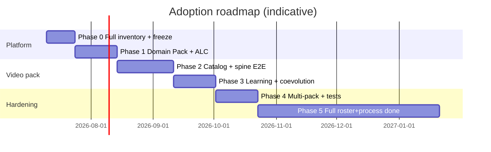

# Adoption Plan: generic-swarm-ops (Universal Platform) × va-agent-swarm (Video Domain)

**Version:** 2.3  
**Date:** 2026-07-10  
**Status:** Executable merge strategy (post product-bar mark ~100) — **full va roster + full process tree required** (rethought sequencing)  
**Authors:** Review of both local repos per `review_adoption.md`  
**Sources audited (deep local scan 2026-07-10):**
- `C:\Project\generic-swarm-ops` (https://github.com/nicholashui/generic-swarm-ops)
- `C:\Project\va-agent-swarm` (https://github.com/nicholashui/va-agent-swarm)

### Rethink (v2.3) — what we keep, what we change

N3 still stands: **all 114 agents and all processes end up in generic and stay there.**  
What changed after rethinking execution risk:

| Keep (non-negotiable) | Change (how we execute) |
|----------------------|-------------------------|
| Full roster **retained in-repo** | **Catalog ≠ full SPEC.** Wave 0 = ROSTER + dirs + MAP + minimal agent_spec. Deep SPEC is filled **when an agent is activated**, not all 114 prose docs before first E2E. |
| Full process **coverage** | **Process index first; DNA depth later.** PROCESSES.md lists every process early. Runnable DNA starts with spine + archetype A; B–J/LQR deepen after spine works. |
| ALC for active agents | **ALC hard-gate only on `active` / production_ready**, not on draft placeholders (draft still carries `requires_alc: true` fields). |
| No second control plane | Unchanged — map LangGraph/Temporal dreams onto generic DNA/steps. |
| Protect E1 / mark ~100 | **Platform ALC + Domain Pack (minimal example) before bulk video content** so host stays green. |

**Three maturity levels (do not conflate):**

| Level | Name | Meaning | Target phase |
|-------|------|---------|--------------|
| **L0 Catalog** | Present | Directory + ROSTER/MAP row + draft agent_spec exists | Phase 0–2 early |
| **L1 Process-indexed** | Reachable | Agent appears in PROCESSES.md / standby_pool / DNA stub | Phase 2 |
| **L2 Runtime** | Runnable | Active (or registered+invoked), ALC enforced, tools stubbed, on a real DNA path | Waves 1–6 |

**Honest outcome framing:** “Adoption complete (N3)” = all agents ≥ **L1**, spine ≥ **L2**, inventory CI green, processes indexed. “Production video swarm” = progressive L2 expansion — months, not one sprint.

**Failure modes this rethink avoids:** (1) 114 shallow SPEC walls before any demo; (2) claiming N3 done at viral-hook only; (3) dual orchestrator confusion — ops `business_orchestrator` stays **ops domain**; video uses `video.orchestrator` namespace only.

### Research snapshot (empirical)

| Corpus | Measured fact |
|--------|----------------|
| **va** files | **92** `.md`, **141** script/txt variants, **19** SVG, **2** `.py` (SVG helpers only) |
| **va** `study/` | **277** files; **68** reference chapters under `study/reference/how_to_build_a_video_agent_system/` |
| **va** UI docs | **42** files under `study/ui/` |
| **va** workflows | **10** archetype SVGs **A–J** + **6** LQR SVGs under `study/workflows/` |
| **va** agent roster | **114** unique agents, ids **1–114**, **10** categories — parsed from `study/agents.md` (names ending in Agent); cross-checked with `SYSTEM_REFERENCE.md` |
| **va** deep specs | Functional/technical: aesthetics, optimization, research, intent, coding, GCA, agentic RAG, podcast, psychological profile/recommendation, screenwriter/strategic goal, LLM usage, agent_loop v1–v3, planner v2.0–2.1, system_build_plan, etc. |
| **generic** product bar | Mark **~100**, E1 **PASS** (`status.md`) |
| **generic** API routes | auth, users, orgs, agents, tools, workflows, workflow_runs, approvals, governance, knowledge, memory, evaluations, audit_logs, processes, evolution, improvement, loops, settings, health — **no `domains` router** |
| **generic** business schemas | WorkflowDNA, EvaluationCard, DecisionRequirementCard, EventLog only — **no** agent-spec / domain-manifest / learning-log |
| **generic** video pack | **`business/video/` missing** |
| **generic** seed agents | 5 ops agents: `business_orchestrator`, `quality_compliance_agent`, `execution_agent`, `finance_ops_agent`, `communications_agent` |
| **generic** tool adapters | `audit_log_writer`, `crm`, `billing_system`, `email`, `contract_parser`, `policy_retriever` only |
| **generic** goldens | **20** customer-onboarding JSON under `business/evals/golden-tasks/` |
| **generic** lessons on disk | **~168** `business/evolution/lessons-learned/run_*.json` (workflow-level) |
| **generic** learning gap | `Lesson` has `workflow_id`, **no `agent_id`**; reflect writes org memory with `agent=None` |
| **generic** FE domain | Improve, evolution archive, run console, user admin, org settings — **no video domain pack UI** |

---

## 0. Non-negotiable requirements (review contract)

| # | Requirement | How this plan enforces it |
|---|-------------|---------------------------|
| **N1** | **va-agent-swarm** keeps **all** video agent-specific business logic; every agent must gain **mandatory autonomous learning** (individual knowledge growth) | Video logic lives only under domain pack paths (`business/video/` + optional va thin-repo mirror). Every registered agent must implement the **Agent Learning Contract** (ALC) or fail activation. |
| **N2** | **generic-swarm-ops** becomes a **universal foundation** for dozens of multi-agent (MMA) systems beyond video | Introduce **Domain Pack** interface, schemas, registration hooks, and isolation so any `business/<domain>/` onboard is config + artifacts, not a fork of the runtime. |
| **N3** | **Adopt ALL agents and ALL business processes from va-agent-swarm** into the generic project — from **orchestrator / planner / meta-agents down through every specialist and workflow-support agent**. **No agent may be dropped, archived-out, or left only in the external va repo as the long-term home.** | (1) **Complete roster import** of the full va catalog (114 agents / 10 categories per `study/agents.md` + `SYSTEM_REFERENCE.md`) into `business/video/agents/` with stable ids and MAP traceability. (2) **Complete process import**: every va business process / pipeline / LQR / archetype workflow becomes Workflow DNA (or DNA family) under `business/video/workflows/`, including orchestration (Orchestrator, Planner, Router, Judge) and handoffs to all leaf agents. (3) **Retention policy**: all agents remain **in-project** forever as pack assets (specs + agent_spec + ALC bindings); runtime activation may still be staged, but **deletion or “later maybe” omission is forbidden**. (4) Gate: pack CI / inventory check fails if MAP count &lt; va roster count or any roster agent lacks a pack directory. |

**Merge shape (one sentence):**  
generic-swarm-ops = governed runtime + learning engine + MMA plugin host;  
va-agent-swarm = **complete** video domain pack — **every agent and every business process** (orchestrator → specialists → workflow support), specs → Workflow DNA + agents + evals + tools, with **mandatory** per-agent ALC and **in-project retention of the full roster**.

### 0.1 Full-roster & full-process mandate (N3 detail)

| Mandate | Meaning | Forbidden |
|---------|---------|-----------|
| **All agents** | Every agent defined in va (`study/agents.md` categories 1–10, ids 1–114, plus any deep-spec agents not double-counted) is adopted into generic under `business/video/agents/<pack_id>/` | Shipping a “P0-only pack” as the *final* state; omitting meta-agents or workflow-support agents (81–114) |
| **All business processes** | Every va process/workflow (human→AI maps, LQR, archetypes A–J, system orchestration layers, critique/QC meshes, delivery fabric as modeled in va) is represented as Workflow DNA and/or pack process docs wired to DNA | Leaving orchestration only as prose in va; implementing only viral-hook and declaring adoption complete |
| **Orchestrator-down hierarchy** | Process trees always include top-level orchestration (OrchestratorAgent, PlannerAgent, RouterAgent, JudgeAgent / equivalents) **and** every downstream agent those processes call | Orphan specialists with no orchestrator path; orchestrator without specialists |
| **Keep in the project** | Pack directories, MAP, manifests, and (when activated) runtime registry entries live in **generic-swarm-ops** git history; va remains upstream research/narrative SoT but is **not** the only place agents “exist” | Relying on “read va when needed”; deleting unused agent folders to “reduce scope” |

**Staging vs completeness (important):**

| Layer | Completeness rule |
|-------|-------------------|
| **In-repo assets** | **100% of agents + 100% of process definitions** must be present in `business/video/` before adoption is declared **complete** (Phase 5 exit). |
| **Runtime activation** | May still roll out in waves (draft → active, ALC-ready, tool stubs first) so E2E quality stays controlled — but **every agent file stays in the tree** at `draft`/`registered` even when not yet `active`. |
| **MVP (Phase 2)** | Proves the **spine** (orchestrator + first vertical path) **without** abandoning the rest of the roster; full catalog must already be **imported or import-scheduled with directories created** by Phase 0–2 inventory gates. |

---

## 1. Executive summary

### 1.1 Current reality (deep scan 2026-07-10)

**generic-swarm-ops** is a **shipped product-bar platform** (mark ~100, E1 operator path PASS per `status.md`):

- FastAPI control plane + Postgres `runtime_state` JSONB, RBAC, audit, approvals, SSE runs (`workflow_runs` lifecycle includes cancel/retry/pause/resume/expire).
- Workflow DNA + `structure_validators`; evolution: propose/evaluate/canary/rollback/archive with **`sandbox_only`**.
- Self-improvement APIs: `POST /improvement/reflect/{run_id}`, lessons list, auto-propose, skill sandbox, loops; FE `ImproveRunButton` + `evolution-archive-panel`.
- Knowledge: Tier-0 + K1-lite; dual harness Trae + Grok; SDD packs + gap analyses **100/100**.
- Ops seed: **5** business agents + **6** local tool adapters + **20** onboarding goldens + flagship `wf_customer_onboarding_*`.

**Critical gaps for N1–N3 (confirmed missing on disk):**

| Gap | Evidence |
|-----|----------|
| No video Domain Pack | `business/video/` does not exist |
| No Domain Pack SDK | no `domain-manifest` / `agent-spec` / `learning-log` schemas; no `/api/v1/domains` |
| Learning not per-agent | `lessons.py` `Lesson` lacks `agent_id`; reflect → org memory `agent=None` |
| No va roster in runtime | seeds are ops-only, not Director…ArchiveMaster |
| No video tools | adapters are CRM/billing/email/contract/policy only |
| Domain agent module stub | `backend/app/domain/agents/models.py` is placeholder |

**va-agent-swarm** is a **complete specification corpus with almost no executable product**:

| Area | Scan result |
|------|-------------|
| Scale | 92 MD, 141 script txt, 19 SVG, 2 py |
| Roster | **114 agents** (see **Appendix A**), categories 1–10 in `study/agents.md` |
| Orchestration spine | **#53 OrchestratorAgent, #54 PlannerAgent, #55 RouterAgent, #56 JudgeAgent** (+ GateKeeper #57 … SafetyRedTeam #80) |
| Processes | 6-phase production pipeline in `SYSTEM_REFERENCE.md` §6; archetypes **A–J**; **LQR** six SVGs; human→AI workflow docs |
| Deep specs | research, optimization, GCA, aesthetics, intent (DIA), coding, agentic RAG, podcast, psych profile/rec, screenwriter/SGA, LLM usage, agent_loop v1–v3, planner v2.x, system_build_plan |
| Aspired stack (do **not** re-build) | React 19 + Next 15, FastAPI + **LangGraph + Temporal + Redis**, Sora/Veo/Runway/ElevenLabs — map onto generic as-built instead |
| Runtime | **None** (SVG helper scripts only) |

### 1.2 Target end-state

```text
┌──────────────────────────────────────────────────────────────────────┐
│ generic-swarm-ops  (UNIVERSAL MMA HOST)                              │
│  runtime · governance · eval · evolution · ALC enforcement           │
│  Domain Pack SDK · schemas · APIs · FE ops console shells            │
└───────────────┬───────────────────────────────┬──────────────────────┘
                │ registers FULL roster         │ registers
                ▼                               ▼
     business/video/ (COMPLETE va pack)   business/<next-domain>/
     ALL agents (1–114, 10 categories)    agents · workflows · tools
     ALL processes (orchestrator→leaf)    evals · knowledge seeds
     workflows · tools · evals · seeds    ALC bindings mandatory
     ALC bindings mandatory · RETAINED
```

- **va repo** remains upstream **research / narration / bilingual scripts** SoT; **canonical adopted agents + processes live in generic** `business/video/` and must not be removed.
- **generic repo** hosts the **complete video swarm** as a Domain Pack (not a hard-coded one-off), plus future packs.
- Hierarchy is preserved: **Orchestrator / Planner / Router / Judge → category specialists → workflow-support agents**, expressed as Workflow DNA graphs that can invoke the full roster over time.

### 1.3 Success definition

**Platform / learning (N1–N2)**

1. Domain Pack + ALC work for video (and a second example pack proves N2).
2. Every **active** agent has agent-scoped lessons + memory growth after runs.
3. Evolution proposals remain **`sandbox_only`** until gated promote; no host code self-rewrite.

**Full va adoption (N3) — all required**

4. **Agent completeness:** `business/video/agents/` contains **every** va roster agent (full 10 categories / 114 definitions per va `agents.md` + SYSTEM_REFERENCE); `MAP.md` has 1:1 rows; inventory CI passes.
5. **Process completeness:** all va business processes (orchestration mesh, production pipelines, LQR, archetypes A–J, QC/critique meshes, delivery variants as specified in va) exist as Workflow DNA and/or pack process docs linked to DNA under `business/video/workflows/` (and related pack paths).
6. **Orchestrator-down integrity:** at least one production DNA family starts at orchestrator/planner and can route to any adopted specialist via declared handoffs (stubs allowed until tools mature).
7. **Retention:** no roster agent is deleted from the project; inactive agents remain `draft`/`registered` with ALC fields populated, not omitted.
8. **Runtime spine:** at least one E2E path (e.g. viral-hook) runs with human gates and audit; remaining agents activate in waves without dropping pack assets.

---

## 2. Full audit of both repositories

### 2.1 generic-swarm-ops — architecture

| Layer | Location | Maturity |
|-------|----------|----------|
| Starter / dual harness | `.trae/`, `.grok/`, `scripts/sync.mjs` | High |
| Business OS artifacts | `business/` (schemas, evals ≥20 golden, governance, PI, evolution lessons) | High |
| Backend API | `backend/app/api/v1`, `runtime.py`, domain + infrastructure | High (product bar) |
| Frontend ops console | `frontend/` Next.js | High |
| Evolution sandbox | APIs + corpus eval + archive UI | Medium–High |
| Self-improvement | reflect / lessons / auto-propose / loops / skill sandbox | Medium (workflow-centric) |
| Agent implementations | Registry + seeded agents; domain packages under `backend/app/domain/agents` | **Thin** — not domain specialists |
| Multi-domain plugin host | Implicit via `business/` only | **Missing formal Domain Pack contract** |
| Per-agent learning enforcement | Partial memory scopes on agents | **Missing mandatory ALC** |

**Strengths**

- Production-minded governance (risk tiers, approvals, audit, provenance culture).
- Working run lifecycle + SSE + tool effects.
- Evolution never mutates production DNA directly (`sandbox_only` discipline).
- Documented self-improvement map (`docs/self-improvement-and-orchestration.md`).
- SDD + gap analyses close the structure/backend/frontend bars.
- Clear extension point: `business/` + Workflow DNA schema.

**Technical debt / misalignment**

| Debt | Evidence | Impact |
|------|----------|--------|
| Agent learning not individual | `reflect_on_workflow_run` stores lessons with `workflow_id`, writes `organization_memory`, `agent=None` | Agents do not accumulate private procedural knowledge |
| No Domain Pack SDK | No `business/*/manifest.json` loader, no register-domain API | Hard to onboard “dozens of MMA systems” cleanly |
| Evolution fitness mostly workflow DNA | Population archive of variants, not agent genomes | Coevolution of specialist teams under-specified |
| Multi-modal / media tools absent | Local adapters only; CRM/email external non-goals | Video gen tools must be added as adapters, mocked in CI |
| Aspirational stack in docs vs as-built | Docs list Redis/Temporal/pgvector at scale; as-built is Postgres JSONB + in-process runs | Domain packs must target **as-built** first |
| Large `external/sources/` | Reference only until audited | Must not block video pack; keep source-audit discipline |

**Preserve / extend (do not rewrite)**

- `runtime.py` control plane, auth, RBAC, workflow engine, SSE.
- Evolution promote/canary/rollback.
- FE shell + Improve + evolution archive.
- Schemas: WorkflowDNA, EvaluationCard, DecisionRequirementCard, EventLog.
- Rules: evolution sandbox, human approval, security.

### 2.2 va-agent-swarm — architecture

| Area | Location | Maturity |
|------|----------|----------|
| System map | `study/SYSTEM_REFERENCE.md` | Spec-complete (aspirational stack) |
| Agent roster (114) | `study/agents.md` | Spec-complete |
| Workflows / LQR / SVGs | `study/workflows/`, LQR docs | Design-complete |
| Deep agent specs | aesthetics, optimization, research, psychological_*, coding, creative, intent, knowledge_router, screenwriter, podcast, agentic_rag, agent_loop v1–v3 | Spec-complete |
| Build plan | `study/system_build_plan.md` (M0–M12, 100-point checklist) | Implementation-ready **plan**, no build |
| Project starters / loops | root `project_starter_*`, `agent_loop_creator_*`, `plan/` | Iterative research docs |
| Runtime code | — | **Absent** |
| Tests / CI / deploy | — | **Absent** |

**Strengths**

- Unmatched video domain decomposition (roles, rubrics, critique buses, quality gates).
- Explicit self-refine / Reflexion / episodic memory **intent** per agent tables.
- Shared artifact contracts and vertical-slice philosophy in system_build_plan (G1–G7).
- Bilingual/script assets useful for knowledge seeding and narration products.
- Reference corpus under `study/reference/how_to_build_a_video_agent_system/`.

**Technical debt / misalignment**

| Debt | Evidence | Impact |
|------|----------|--------|
| Weak architecture | No backend/frontend; only SVG Python helpers | Cannot run agents |
| Spec sprawl | Multiple starters, loop versions, EN/HK/script quadruples | Migration needs prioritization + consolidation |
| Assumed stack drift | Specs assume LangGraph + Temporal + Redis + React 19 video UI | Must map onto generic as-built, not re-create a second platform |
| Learning implicit | Textual only | N1 requires ALC wiring at implementation time |
| Scope breadth | 114 agents + many archetypes | **N3 requires full import + retention**; runtime activation waves (spine first), not permanent subset |

**Key assets to migrate (ownership of adopted copies lives in generic pack; va remains upstream)**

1. **Entire agent roster (1–114, all 10 categories)** → `business/video/agents/<pack_id>/` (`SPEC.md` + `agent_spec.json` + ALC) — **mandatory, complete, retained**.
2. **Entire process tree** (orchestrator/planner/router/judge + production pipelines + LQR + archetypes A–J + support processes) → Workflow DNA under `business/video/workflows/` (+ process index).
3. Quality gates / critique / consistency → EvaluationCards + step guardrails on every process that requires them.
4. Agentic RAG concepts → pack knowledge pipelines + generic memory scopes.
5. Reference corpus → `business/video/knowledge/` with provenance.
6. UI concepts (agent management, pipeline viz) → generic FE domain routes that can list/filter the **full** roster, not a separate product stack first.

### 2.3 Complementary fit matrix

| Concern | generic today | va today | Merged owner |
|---------|---------------|----------|--------------|
| Auth, RBAC, audit | Strong | None | generic |
| Workflow execution | Strong | Spec only | generic |
| Evolution sandbox | Strong | Named only | generic (+ agent genomes) |
| Video creative logic | None | Strong specs | **va / business/video** |
| Per-agent learning | Weak | Spec only | **generic ALC enforced for all packs** |
| Ops UI | Strong ops console | Spec aspirational | generic + video pages |
| Generality for N MMA | Partial | N/A | generic Domain Pack |

---

## 3. Target architecture (redesign)

### 3.1 Domain Pack contract (universal MMA onboarding)

Every MMA system (video first) is a **Domain Pack**:

```text
business/<domain_id>/
  manifest.json          # id, version, risk_default, entrypoints
  README.md
  agents/
    <agent_id>/
      agent_spec.json    # role, tools, memory scopes, ALC flags
      SPEC.md            # human-readable domain logic (from va)
      prompts/           # versioned prompt assets
      rubrics/           # quality criteria
  workflows/
    <workflow_id>.dna.json
  tools/
    adapters.md          # maps to backend tool registry ids
  evals/
    golden/ regression/ adversarial/
  knowledge/
    seeds/               # md/json with provenance
  policies/
    risk-overrides.md
  ui/
    routes.md            # optional FE extension notes
```

**`manifest.json` (minimum fields)**

```json
{
  "domain_id": "video",
  "version": "0.1.0",
  "display_name": "Video Production Swarm",
  "default_risk_tier": "tier_2_draft",
  "requires_alc": true,
  "agents": ["planner_video", "research_video", "aesthetics_video"],
  "workflows": ["wf_video_viral_hook_v1"],
  "knowledge_seed_globs": ["knowledge/seeds/**/*.md"],
  "api_hooks": {
    "on_register": "internal",
    "tool_namespace": "video."
  }
}
```

**Registration (platform hooks)**

| Hook | Purpose |
|------|---------|
| `POST /api/v1/domains/register` (or CLI `npm run domain:register`) | Validate manifest + schemas; load agents/workflows into org catalog (draft) |
| DNA validator + ALC gate | Refuse `production_ready` if any step agent lacks ALC binding |
| Tool allow-list | Pack tools only under declared namespace |
| Eval pack load | Domain golden/adversarial auto-discovered by harness |
| FE module map | Optional `/app/domains/video/*` routes from pack UI notes |

### 3.2 Agent Learning Contract (ALC) — mandatory for all agents

**Problem fixed:** generic currently reflects at **run** level without binding growth to **each agent**.

**ALC (must be true before agent status = active in any pack):**

| Capability | Required behavior | Storage / API |
|------------|-------------------|---------------|
| **Episodic write** | After each step completion involving the agent, write episode with `agent_id`, `run_id`, `step_id`, outcome, critique | `memory` scope `agent` or collection `agent_episodes` |
| **Reflect** | Post-run (or post-step for high-risk) extract lessons **tagged `agent_id`** | Extend `reflect_on_workflow_run` → `reflect_on_agent(agent_id, run_id)` |
| **Retrieve before act** | Step preflight loads top-k agent lessons + scoped memory | Runtime step guard |
| **Propose skill/DNA tweak** | On repeated failure patterns, create **`sandbox_only`** proposal linked to agent genome | improvement + evolution APIs |
| **Provenance** | Every learned item has source_refs, captured_by, recorded_at | existing provenance shape |
| **Metrics** | `knowledge_growth_count`, `lesson_reuse_rate`, `human_gate_rate_delta` | improvement metrics endpoint |

**Activation rule (platform-wide):**

```text
IF agent.requires_learning != false AND domain.requires_alc == true:
  DENY activate UNLESS agent.alc_version >= ALC_CURRENT
  AND agent.allowed_memory_scopes includes "agent"
  AND agent.hooks.reflect == true
```

Video pack sets `requires_alc: true` for **all** production agents (N1).

### 3.3 Agent genome vs workflow DNA

| Concept | Content | Evolution |
|---------|---------|-----------|
| **Workflow DNA** | Graph of steps, tools, gates, fitness | Existing sandbox (keep) |
| **Agent genome** | Prompts, rubrics, tool prefs, retrieval policy, critique weights | New: `sandbox_only` agent variants; promote creates new agent version |

Coevolution experiment = population of genomes + workflow DNA evaluated on shared golden tasks.

### 3.4 Orchestration patterns (configurable per DNA, not hard-coded)

Support topologies as Workflow DNA metadata (no va-specific runtime fork):

1. Hierarchical supervisor + specialists (planner → workers).  
2. Pipeline + quality gates (video production stages).  
3. Router / knowledge_router handoffs.  
4. Parallel fan-out (e.g., multi-shot gen) with join + QC.  
5. Critique bus as **evaluation steps** + optional peer agents (not a second message bus product in MVP).

Implementation preference: **map onto generic step machine first**; only introduce external graph engines if DNA cannot express the topology.

### 3.5 Where va business logic lives (N1)

| Asset | Canonical home | va repo role |
|-------|----------------|--------------|
| Video agent specs | `business/video/agents/**` | Upstream authoring / research / scripts |
| Video workflows | `business/video/workflows/**` | Same |
| Video tools adapters | generic `backend` adapters + pack `tools/` docs | Spec only |
| Narration scripts | va repo or `business/video/content/` | Stay in va if product is content |
| Control plane | generic only | **Forbidden to reimplement** |

**Architectural redesign for va “weak core”:** stop treating va as a future second platform (FastAPI+LangGraph+Temporal duplicate). Rebuild va **as a domain pack on generic**, using `system_build_plan.md` milestones **retargeted** to Domain Pack + ALC + generic APIs.

### 3.6 Modularization for dozens of MMA systems (N2)

| Mechanism | Description |
|-----------|-------------|
| Domain Pack SDK | Schema + validator + CLI |
| Stable APIs | Existing `/api/v1/*` + domain register + agent reflect |
| Data schemas | Extend business schemas with `agent-spec.schema.json`, `domain-manifest.schema.json`, `learning-log.schema.json` |
| Isolation | `organization_id` + `domain_id` on agents/workflows/memory |
| Config | Pack env for tool keys; never global host rewrite |
| FE plugin map | Convention-based routes under `/app/domains/{id}` |
| Test harness | Per-pack pytest/vitest markers `@domain:video` |
| Versioning | Pack semver independent of platform semver |

---

## 4. Generic learning specifications (platform work)

These changes live in **generic-swarm-ops** and apply to **every** future MMA pack.

### 4.1 Schema additions

1. **`business/schemas/agent-spec.schema.json`**  
   Fields: `id`, `domain_id`, `role`, `tools`, `allowed_memory_scopes`, `alc`, `risk_tier`, `critique_rubric_ref`, `provenance`.

2. **`business/schemas/domain-manifest.schema.json`**

3. **`business/schemas/learning-log.schema.json`**  
   `agent_id`, `run_id`, `lesson_text`, `utility_score`, `reuse_count`, `provenance`.

### 4.2 Runtime changes (implementation specs)

| Change | File/area (indicative) | Behavior |
|--------|------------------------|----------|
| Agent-scoped lessons | `runtime.reflect_on_workflow_run` | Split lessons per `step.agent_id`; store `agent_id` on lesson |
| `POST /api/v1/improvement/reflect/agent/{agent_id}` | `routes/improvement.py` | Agent-only reflection |
| Pre-step memory inject | workflow step executor | Retrieve agent lessons + agent memory before LLM/tool |
| ALC validation | `structure_validators` / activate agent | Block activate without ALC |
| Agent genome propose | evolution service | Variant type `agent_genome` + `sandbox_only` |
| Metrics | `GET /api/v1/improvement/metrics?agent_id=` | growth + reuse |
| Domain register | new routes + CLI | Load pack into draft catalog |
| Auto-reflect default | already `GENERIC_SWARM_AUTO_REFLECT` | Extend to write agent lessons |

### 4.3 Fitness for agent learning (not only workflow quality)

$$
F_{agent} = w_q Q + w_s S + w_c C + w_l L_{reuse} + w_g G_{growth} - w_h H_{escalation} - w_r R
$$

Where \(L_{reuse}\) = lesson reuse success, \(G_{growth}\) = net new validated lessons, \(H\) = human escalations. All proposals remain sandbox-gated.

### 4.4 What remains non-goal on generic

- DGM-style host code self-modification.
- Unattended production promotion.
- Full LightRAG/Neo4j mesh as hard dependency for pack MVP.
- Always-on multi-worker Temporal (optional later adapter).

---

## 5. Video domain redesign (va → pack on generic)

### 5.0 Full adoption scope (N3) — roster & processes (scan-verified)

**Agents (complete catalog — all must stay in project)**

| Cat | Range | Count | Names (scan-verified anchors) | Pack import rule |
|-----|-------|-------|--------------------------------|------------------|
| 1 Above-the-Line | 1–5 | 5 | Director → Casting | Import all; retain |
| 2 Camera & Lighting | 6–8 | 3 | DoP, CameraOperator, DronePilot | Import all; retain |
| 3 Editorial & Color | 9–18 | 10 | Editor → MUA | Import all; retain |
| 4 Sound & Music | 19–22 | 4 | SoundDesign → SoundMixer | Import all; retain |
| 5 Performance & Choreography | 23–27 | 5 | Choreography → UGCCreator | Import all; retain |
| 6 Distribution & Marketing | 28–31 | 4 | SocialMediaStrategist → PerformanceMarketer | Import all; retain |
| 7 Education & Domain-Expert | 32–45 | 14 | InstructionalDesign → RealEstatePhoto | Import all; retain |
| 8 AI-Era Specialists | 46–52 | 7 | PromptEngineer → SportsAnalyst | Import all; retain |
| 9 Specialist **Meta** | 53–80 | 28 | **Orchestrator, Planner, Router, Judge**, GateKeeper, Memory, optimizers, SafetyRedTeam, … | Import all; retain — **orchestration spine** |
| 10 Workflow Support | 81–114 | 34 | Analyst → ArchiveMaster | Import all; retain |
| **Total** | **1–114** | **114** | Full list + pack ids: **Appendix A** | **N3 mandatory** |

Authoritative sources: `va-agent-swarm/study/agents.md` (tables §1–10), `study/SYSTEM_REFERENCE.md` §3. If va adds agents later, MAP and pack dirs grow; **dropping agents is out of policy**.

**Additional deep-spec systems (adopt as pack modules / shared services, not dropped):**

| System (SYSTEM_REFERENCE §4–5) | Spec files under `study/` | Pack target |
|--------------------------------|---------------------------|-------------|
| Research Agent | `research_agent_*` | `video.webresearch` / research tools + knowledge |
| Process Optimization | `optimization_agent_*` | meta optimizers + process DNA |
| General Creative (GCA/SSOR) | `general_creative_agent_*` | creative service used by Director/Screenwriter/ConceptArtist |
| Agentic RAG | `agentic_rag_functional_specification.md` | knowledge + memory pack wiring |
| Deep Intent Analysis (DIA) | `intent_analysis_agent_*` | intent path + `video` intent agent |
| Coding Agent | `coding_agent_*` | **sandbox-only** tooling; never host self-rewrite |
| LLM usage | `llm_usage_*` | metrics/settings surface |
| Podcast Agent | `podcast_agent_*` | process DNA + agents (may dual-home under video pack) |
| Aesthetics Agent | `aesthetics_agent_*` | shared critic/aligner for gen agents |
| Strategic goal / screenwriter SGA | `strategic_goal_*`, `screenwriter_strategic_*` | planner/screenwriter DNA steps |
| Psychological profile/recommendation | `psychological_*` | casting/talent/personalization |
| Complex problem model | `complex_problem_solution_process_model.md` | judge/factchecker/optimization |
| Agent loop designs | `agent_loop.md`, `agent_loop_v2`, `agent_loop_v3`, root `agent_loop_creator_*` | loop DNA patterns |
| Planner designs | `plan/planner_agent_v2.0`, `v2.1` | `video.planner` |
| Common agent structure | `common-agent-structure.svg/html` | agent_spec template fields |

**Business processes (complete — orchestrator down to leaf)**

| Process family | Source artifacts | Generic DNA / pack target |
|----------------|------------------|---------------------------|
| **6-phase E2E production** | `SYSTEM_REFERENCE.md` §6.1: Intent&Planning → Creative → Pre-pro → Production → Post → Delivery | `wf_video_production_e2e_v1` (+ phase sub-DNAs) |
| Phase 1 Intent & Planning | IntentAnalysis (DIA) → Planner → Producer | spine DNA; agents #intent path, #54, #2 |
| Phase 2 Creative | Director + Screenwriter + GCA | DNA steps; GCA as tool/service |
| Phase 3 Pre-production | Casting, ProductionDesign, ConceptArtist, Costume, Research | DNA + research adapters |
| Phase 4 Production/gen | PromptEngineer, DoP, Talent, Sound, Composer, VO | DNA + **media stubs** first |
| Phase 5 Post | Editor, Colorist, VFX, Animator, Mixer, AIQAConsistency | DNA + QC stubs |
| Phase 6 Delivery & optimization | Social, PerformanceMarketer, Trailer, Personalization, Optimization | DNA + packaging stubs |
| **Archetypes A–J** | `study/workflows/A-viral-hook.svg` … `J-feature-film.svg` | `wf_video_arch_a` … `wf_video_arch_j` |
| **LQR** | `lqr-pipeline-overview`, scene-flow, per-shot-loop, character-consistency, engine-routing, quality-gates | `wf_video_lqr_*` family |
| Human vs AI workflow maps | `human_video_production_workflow.md`, `ai_agent_video_production_workflow.md` | process index + DNA coverage matrix |
| Critique / QC / delivery fabric | agents.md + SYSTEM_REFERENCE layers | evaluation steps + approvals |
| Agent management / UI processes | `study/ui/*` (architecture_communication, agent_management, project_creation, …) | FE domain routes on generic ops console |
| System build milestones | `system_build_plan.md` M0–M12 | retarget to Domain Pack + ALC (no second LangGraph host) |

**Hierarchy rule:** every executable process DNA **must** enter via **Orchestrator (#53) and/or Planner (#54)** (with Router #55 / Judge #56 as needed). Every roster agent **must** appear in ≥1 DNA step **or** `standby_pool` route from orchestrator (orphan-agent check = 0).

### 5.1 Runtime activation waves (spine first — catalog already complete)

From va `system_build_plan` golden rule **G2** and archetype **A (viral hook)** — used only to **activate and prove** the spine, **not** to limit which agents are kept in the pack.

**Spine pipeline (first E2E) — maps to SYSTEM_REFERENCE Phase 1–2 + archetype A:**

```text
video.orchestrator / video.planner
  → intent (DIA) → video.producer gates
  → video.director + video.screenwriter (+ GCA service)
  → research / aesthetics (deep-spec modules)
  → media_gen_stub → video.aiqaconsistency / QC stub
  → human_gate (as required) → package_metadata
```

Viral-hook archetype DNA: `wf_video_arch_a_viral_hook_v1` (from `A-viral-hook.svg`).

**Activation waves (catalog complete first):**

| Wave | Scope (pack ids / ranges) | Runtime status goal |
|------|---------------------------|---------------------|
| **0 — Catalog** | **All 114** dirs + MAP + agent_spec + SPEC (Appendix A) | `draft`/`registered`; ALC fields present |
| **1 — Spine active** | `video.orchestrator`, `planner`, `router`, `judge`, `producer`, intent/DIA, `director`, `screenwriter`, research module | `active`; viral-hook or Phase1–2 E2E |
| **2 — QC + creative services** | `aiqaconsistency`, aesthetics module, optimization, GateKeeper, Memory | active on spine |
| **3 — Production crafts** | cats 2–5 + PromptEngineer, Avatar, VoiceClone, Talent | active on gen/post DNAs (stubs OK) |
| **4 — Domain + go-to-market** | cats 6–8 remainder + 7 education specialists used by archetypes | active per DNA family |
| **5 — Full meta + support** | remaining #57–80, #81–114 + standby_pool | all orchestrator-reachable |
| **6 — Process complete** | A–J + LQR + 6-phase E2E + UI process docs wired | inventory + process index 100% |

Media tools (**Sora/Veo/Kling/ElevenLabs/…**) → generic **adapter interface + CI stubs** first (`infrastructure/tools/adapters.py` pattern); register under `video.*` + `tool-permission-register.json`.

### 5.2 Mapping va patterns → generic primitives

| va concept | generic primitive |
|------------|-------------------|
| Agentic graph / DAG | Workflow DNA steps + conditions |
| Self-refine + critique | Step loop + evaluation step + ALC reflect |
| Shared artifact contract | run `runtime_state` step outputs + knowledge docs |
| Human-in-the-loop | Approval API + FE approvals |
| Provenance / C2PA intent | provenance fields + audit logs (C2PA media signing = later tool) |
| Critique bus | evaluation events + optional peer agent steps |
| Temporal/Airflow dreams | generic worker/queue path; Temporal optional adapter later |
| React video IDE | generic FE domain routes; heavy timeline editor later |

### 5.3 Knowledge seeding from va

1. Curate top specs + reference chapters into `business/video/knowledge/seeds/` with provenance (`source: va-agent-swarm@<commit>`).  
2. Index via generic knowledge APIs (Tier-0; graph extract optional).  
3. Agents retrieve with `acting_agent_id` for scope enforcement.

### 5.4 Frontend (video)

- Phase A: reuse ops console — agents, workflows, runs, Improve, evolution.  
- Phase B: `/app/domains/video` dashboard (pipeline stages, asset list placeholders).  
- Phase C: only if needed — advanced timeline; do not block platform learning work.

---

## 6. Phased migration roadmap

**Principle:** generic is base template; va is rebuilt as a **complete** domain pack + ALC (full roster + full processes), not a parallel stack and **not** a partial agent subset as the end state.



### Phase 0 — Full inventory, catalog freeze, skeletons (1–2 weeks)

**Goals:** **Enumerate all va agents and all va processes**; create pack homes; no selective “drop list.”

| Task | Owner repo | Exit criteria |
|------|------------|---------------|
| Export **complete** va agent roster (1–114, 10 categories) into inventory | both | `business/video/ROSTER.json` (or equiv.) count matches va |
| Export **complete** va business-process index (orchestration + pipelines + LQR + A–J + support) | both | `business/video/PROCESSES.md` covers orchestrator→leaf |
| Create `business/video/` skeleton + **placeholder dir per agent** | generic | 114 agent folders exist (may hold stub SPEC) |
| Create `business/video/MAP.md` with **one row per agent** | both | MAP rows == roster count; no “later” omissions |
| Document ownership + N3 retention policy (this file) | generic | adoption.md **v2.1+** approved |
| Decide monorepo vs dual-repo sync | product | ADR: dual-repo OK; **canonical agents live in generic pack** |

**Repo strategy (recommended):**

- Keep **two GitHub repos**.  
- generic = platform + **complete** `business/video` pack (all agents + processes).  
- va = research/specs/scripts upstream; PR/sync **copies full roster** into pack — never leaves agents only in va.  
- Avoid git submodule until pack stable; use documented sync script later.

### Phase 1 — Platform: Domain Pack SDK + ALC (2–3 weeks)

| Milestone | Work | Tests |
|-----------|------|-------|
| M1.1 | `domain-manifest` + `agent-spec` + `learning-log` schemas | schema unit tests |
| M1.2 | Domain register CLI/API (draft load) | unit + dry-run on `example_domain` |
| M1.3 | Agent-scoped reflect + lesson store | unit: lessons contain `agent_id` |
| M1.4 | Pre-step retrieve agent memory | unit: inject called |
| M1.5 | ALC gate on agent activate / DNA production_ready | unit: deny without ALC |
| M1.6 | Agent genome `sandbox_only` propose path | unit: cannot direct production |
| M1.7 | Docs: `docs/domain-packs.md`, update structure.md | review |

**Exit:** toy domain `business/example_domain` registers; agent learns one lesson across two runs; metrics visible.

### Phase 2 — Full catalog in-repo + spine E2E (3–5 weeks)

| Milestone | Work | Tests |
|-----------|------|-------|
| M2.0 | **Complete agent import:** SPEC + agent_spec for **all** roster agents (stubs OK for non-spine) | inventory count == va roster; MAP 100% |
| M2.0b | **Process index + DNA stubs** for all process families; orchestrator-entry DNAs declared | PROCESSES.md + workflows/ coverage check |
| M2.1 | Flesh spine agents (orchestrator/planner/intent/research/screenwriter) to runnable | ALC activate for spine |
| M2.2 | Workflow DNA `wf_video_viral_hook_v1` (orchestrator-down) | DNA validator pass |
| M2.3 | Tool adapters stubs (media gen, script format) | adapter unit tests |
| M2.4 | Golden evals for hook quality + gate behavior | `business:eval` green |
| M2.5 | E2E run with human gate + ALC reflects | e2e like E1 for video |
| M2.6 | FE: domain page listing **full roster** (filter active vs draft) | vitest smoke |
| M2.7 | Seed knowledge from va reference corpus (systematic, not ad-hoc only) | retrieval smoke |

**Exit:** (a) **all agents present in project**; (b) process index complete; (c) operator can login → viral-hook E2E → gate → lessons → sandbox propose.

### Phase 3 — Full learning & coevolution on video tasks (2–3 weeks)

| Milestone | Work |
|-----------|------|
| M3.1 | Multi-generation sandbox experiments on video goldens |
| M3.2 | Coevolution: planner genome × aesthetics genome |
| M3.3 | Lesson utility scoring + reuse metrics dashboard (API or FE panel) |
| M3.4 | Skill sandbox for video prompt skills |
| M3.5 | Governance review of learned artifacts |

**Exit:** measurable improvement on ≥1 fitness metric without production regression; all variants audit-logged.

### Phase 4 — Validation, multi-pack proof, load (2–3 weeks)

| Milestone | Work |
|-----------|------|
| M4.1 | Second pack `business/example_research` or podcast lite (prove N2) |
| M4.2 | Integration tests cross-pack isolation (no memory bleed) |
| M4.3 | Load: concurrent runs multi-domain (see §7) |
| M4.4 | Security: red-team video tool misuse + prompt injection |
| M4.5 | Docs kit: “Add a Domain Pack” + versioning |

**Exit:** two packs live in draft; isolation tests pass; runbook published.

### Phase 5 — Full roster activation + full process wiring (required completion)

**This phase is mandatory for N3 — not optional “nice to have.”**

| Milestone | Work | Exit |
|-----------|------|------|
| M5.1 | Activate remaining agents category-by-category (waves 2–4) with ALC | All agents `active` or `registered`+orchestrator-reachable |
| M5.2 | Wire all process DNAs (A–J, LQR, delivery, support) to real agent ids | No process left va-only |
| M5.3 | Standby pool / router tables so every agent is invocable | Orphan-agent check == 0 |
| M5.4 | Full-roster inventory CI in default pipeline | Fail build if agent missing |
| M5.5 | Optional other domains (podcast, research, …) — **after** video N3 complete | N2 demos without stealing video completion |

- **Retention forever:** agent directories remain even if a tool is stubbed or status is `registered`.  
- Track platform vs pack version compatibility matrix.

**Indicative effort:** Spine catalog+E2E (Phases 0–2) **6–9 weeks**; learning + multi-pack proof (through Phase 4) **10–16 weeks**; **full N3 (Phase 5)** additional **8–16+ weeks** depending on tool depth (stubs first, live media later).

---

## 7. Testing strategy

### 7.1 Unit tests (platform learning)

| Area | Cases |
|------|-------|
| ALC gate | activate denied without agent memory scope / reflect hook |
| Reflect | lessons persist with `agent_id`, provenance, org scope |
| Retrieve | wrong agent cannot read another agent’s private episodes |
| Evolution | agent genome promote blocked if `sandbox_only` false mutation path |
| Domain register | invalid manifest fails closed |

### 7.2 Integration tests (cross-repo / pack)

| Case | Assert |
|------|--------|
| Video DNA E2E | queued → running → waiting_for_approval → succeeded |
| Auto-reflect after terminal | agent lessons + org lessons both non-empty |
| Tool effect | stub media adapter writes `tool_effects` |
| Pack isolation | video memory query with research agent id returns empty |
| OpenAPI FE | Improve + evolution still green with video runs |

### 7.3 Domain / golden evals

- Port va rubrics into `business/video/evals/golden/`.  
- Regression: human gate still required for irreversible external publish tools.  
- Adversarial: prompt injection in script inputs must not expand tool allow-list.

### 7.4 Load / scalability (multi MMA)

| Scenario | Target (initial) |
|----------|------------------|
| Concurrent workflow runs | N=20 mixed domains on single API process |
| Lesson write throughput | no lost lessons under concurrent reflect |
| Archive list | evolution archive p95 acceptable on 1k variants |
| FE | ops console remains responsive under SSE of 5 runs |

**Note:** Full GPU media gen load is **out of band**; stubs for CI, real providers in staging with rate limits.

### 7.5 Acceptance gates (DoD)

**Platform**

- [ ] ALC enforced platform-wide for packs with `requires_alc: true`  
- [ ] Video spine E2E green (orchestrator-down path)  
- [ ] Second domain pack registers without runtime edits  
- [ ] `sandbox_only` never bypassed  
- [ ] Unit + e2e + business:eval green  
- [ ] Gap note updated in `status.md` / handoff  

**Full va adoption (N3)**

- [ ] Agent count in `business/video/agents/` + MAP == full va roster (no omissions)  
- [ ] All 10 agent categories present; meta-agents include orchestrator/planner/router/judge  
- [ ] All va business processes indexed and represented as DNA / linked pack process docs  
- [ ] Every agent is orchestrator-reachable (DNA step or standby_pool route)  
- [ ] Retention policy enforced (CI fails on deleted roster agent)  
- [ ] Activation waves documented; inactive agents remain in-project as draft/registered

---

## 8. Risk mitigation

| Risk | Likelihood | Impact | Mitigation |
|------|------------|--------|------------|
| Dual platform rewrite (va rebuilds FastAPI stack) | Medium | High | Explicit ban in ADR; pack-only path |
| Loss of va research fidelity | Medium | High | Provenance on every seed; keep va repo; MAP.md traceability |
| Scope explosion / unfinished N3 | High | High | **Import full catalog early (Wave 0)**; activate in waves; forbid dropping agents; Phase 5 mandatory exit for N3 |
| Orphan agents (imported but never routed) | Medium | High | standby_pool + router DNA; orphan-agent CI check |
| Learning pollutes shared memory | Medium | High | Agent scopes + isolation tests |
| Evolution regression | Medium | High | Fitness + human gate + rollback; no auto_promote |
| External media API cost/rate | High | Medium | Stub adapters in CI; budget gates; tool allow-lists |
| Migration data loss | Low | High | Pack artifacts in git; runtime DB backups; no destructive renames without dual-write |
| Breaking generic mark-100 paths | Medium | High | E1 regression suite must stay green every PR |
| Doc/script language variants diverge | Medium | Low | Canonical EN spec in pack; HK scripts stay in va |
| Weekly API usage limits (tooling) | Medium | Medium | Prefer offline unit tests; batch LLM critic optional |

**Conflict resolution policy**

1. Platform safety/governance wins over domain convenience.  
2. Domain creative logic wins over platform defaults **inside pack files only**.  
3. Spec conflicts between va versions → prefer `SYSTEM_REFERENCE` + latest agent_loop/planner; archive older starters.

---

## 9. Long-term maintenance & reuse

### 9.1 Versioning

| Component | Scheme | Compatibility |
|-----------|--------|---------------|
| generic platform | semver (e.g. 2.x) | Breaking ALC/schema → major |
| Domain pack | semver independent | manifest `engine_range`: `">=2.0 <3"` |
| Agent genome | `agent_id@version` | immutable after promote |
| Workflow DNA | existing version arrays | unchanged |

### 9.2 Contribution workflow

1. Domain experts open PRs in **va** (specs) and/or **generic** (`business/video`).  
2. Platform PRs require E1 + unit green + evolution sandbox tests.  
3. Pack PRs require schema validate + domain evals + ALC fixtures.  
4. Human governance review for tier ≥4 tools.  
5. Conventional commits; reference phase milestone ids (M1.x, M2.x).

### 9.3 Documentation standards

| Doc | Owner |
|-----|-------|
| `adoption.md` (this file) | Platform + merge |
| `docs/domain-packs.md` | Platform (to create) |
| `business/video/README.md` | Video pack |
| `structure.md` / `backend.md` / `frontend.md` | Update when ALC/pack land |
| va `SYSTEM_REFERENCE.md` | Keep as domain encyclopedia; add “Implemented on generic pack path X” banners |

### 9.4 Reuse playbook (new MMA system)

1. `cp -r business/example_domain business/<id>`  
2. Fill manifest, agents, one workflow DNA, one golden eval.  
3. Register pack; activate agents (ALC must pass).  
4. Run E2E; enable auto-reflect; review lessons.  
5. Only then expand agent count.

### 9.5 Ownership matrix

| Concern | Maintainer |
|---------|------------|
| Runtime, ALC, Domain SDK | generic-swarm-ops core |
| Video creative specs & rubrics | va-agent-swarm / video pack owners |
| Shared schemas | generic (RFC process) |
| Tool vendor integrations | pack owners + platform adapter review |

---

## 10. Implementation checklist (first 30 days)

**Week 1**

- [ ] Approve adoption.md **v2.1** (N3 full roster + full processes)  
- [ ] ADR: dual-repo + pack-on-generic + **in-project retention of all va agents**  
- [ ] Skeleton `business/video/` + `business/example_domain/`  
- [ ] Export full roster + process index; create **placeholder dirs for all agents**  
- [ ] Draft `agent-spec` / `domain-manifest` schemas  

**Week 2–3**

- [ ] Agent-scoped lessons + reflect API  
- [ ] ALC activation gate  
- [ ] Domain register dry-run  
- [ ] MAP.md 1:1 for **entire** roster (not P0-only)  

**Week 4**

- [ ] Spine agents + viral-hook DNA (orchestrator-down)  
- [ ] Stub tools + golden eval  
- [ ] Confirm catalog completeness gate (count == va roster)  
- [ ] E2E spine demo + status/handoff update

---

## 11. Traceability: review_adoption.md → this document

| Required section in review | Location here |
|----------------------------|---------------|
| Full audit both repos | §2 |
| Phased migration roadmap | §6 |
| Generic learning specs enforced for all MMA | §3.2, §4 |
| Strengthen va weak core, preserve video logic | §3.5, §5 |
| Modularization / APIs / schemas / hooks | §3.1, §3.6 |
| Testing strategy (unit/integration/load) | §7 |
| Maintenance, versioning, contribution, docs | §9 |
| Risk mitigation | §8 |
| N1 / N2 non-negotiables | §0 |
| **N3 full agents + full processes + retention** | **§0, §0.1, §1.3, §5.0–5.1, §6 Phase 0/2/5, §7.5** |

---

## 12. References (local) — scan anchors

**generic-swarm-ops**

| Path | Role in adoption |
|------|------------------|
| `status.md`, `mark_100_verification.md`, `structure_scorecard_100.md` | Product-bar evidence |
| `structure.md` / `backend.md` / `frontend.md` (+ `_hk`) | Architecture plans |
| `docs/self-improvement-and-orchestration.md`, `docs/evolution-sandbox.md`, `docs/workflow-dna.md` | Learning + DNA |
| `backend/app/runtime.py` | Seeds, reflect, evolution, runs |
| `backend/app/api/v1/routes/{improvement,evolution,workflow_runs,agents,tools}.py` | API surface |
| `backend/app/infrastructure/self_improvement/{lessons,reflection,skill_sandbox}.py` | ALC extension points |
| `backend/app/infrastructure/tools/adapters.py` | Pattern for `video.*` stubs |
| `backend/app/infrastructure/evolution/corpus_eval.py` | Sandbox fitness |
| `business/schemas/workflow-dna.schema.json` | DNA validation |
| `business/evals/golden-tasks/` | Eval template (20 onboarding) |
| `business/security/tool-permissions/tool-permission-register.json` | Tool allow-lists |
| `frontend/src/components/domain/*` | Improve, evolution, run console |
| `planning/gap_analysis_for_{structure,backend,frontend}.md` | SDD close-out |
| `reviews/e1_operator_checklist.md`, `backend/app/tests/e2e/test_e1_operator_path.py` | Regression protect |
| `adoption_plan.md` | Executable task list (align to N3) |

**va-agent-swarm**

| Path | Role in adoption |
|------|------------------|
| `study/agents.md` (+ `_hk`) | **Authoritative 114-agent roster** |
| `study/SYSTEM_REFERENCE.md` | Integration map, phases, deep-spec index |
| `study/ai_agent_video_production_workflow.md` | Agentic production workflow |
| `study/human_video_production_workflow.md` | Human process baseline |
| `study/system_build_plan.md` | Build milestones (retarget to pack) |
| `study/workflows/A-…J-*.svg` | Archetype processes A–J |
| `study/workflows/lqr-*.svg` | LQR process family |
| `study/*_agent_*specification*.md` | Deep functional/technical specs |
| `study/agent_loop*.md`, root `agent_loop_creator_*` | Loop patterns |
| `plan/planner_agent_v2.*.md` | Planner design |
| `study/ui/*` | Agent management / architecture UI (map to generic FE) |
| `study/reference/how_to_build_a_video_agent_system/` | 68-chapter knowledge seed corpus |
| `project_starter_0.*.md` | Historical starters (archive; do not fork second stack) |

---

## 13. Changelog

| Version | Date | Notes |
|---------|------|-------|
| 1.0 | 2026-07-09 | Initial merge vision and roadmap |
| 2.0 | 2026-07-10 | `review_adoption.md` execution; N1/N2 Domain Pack + ALC |
| 2.1 | 2026-07-10 | **N3** full roster + full processes + in-project retention |
| 2.2 | 2026-07-10 | Deep repo scan; Appendix A 114 roster; process map; generic gap matrix |
| **2.3** | **2026-07-10** | **Rethink:** L0/L1/L2 maturity; catalog ≠ full SPEC; ALC hard-gate on active only; process index before DNA depth; ops vs `video.orchestrator` namespace; honest N3 vs production framing |

---

## Appendix A — Full va agent roster (N3 import list)

**Source:** `C:\Project\va-agent-swarm\study\agents.md` (first-seen Agent-named rows per id).  
**Rule:** create `business/video/agents/<pack_id>/` for **every** row; never delete.

| # | va Agent | Cat | Pack id (canonical) |
|---|----------|-----|---------------------|
| 1 | DirectorAgent | 1-ATL | `video.director` |
| 2 | ProducerAgent / EP | 1-ATL | `video.producer` |
| 3 | ScreenwriterAgent | 1-ATL | `video.screenwriter` |
| 4 | ShowrunnerAgent | 1-ATL | `video.showrunner` |
| 5 | CastingAgent | 1-ATL | `video.casting` |
| 6 | CinematographerAgent (DoP) | 2-Cam | `video.cinematographer` |
| 7 | CameraOperatorAgent | 2-Cam | `video.cameraoperator` |
| 8 | DronePilotAgent | 2-Cam | `video.dronepilot` |
| 9 | EditorAgent | 3-Edit | `video.editor` |
| 10 | ColoristAgent | 3-Edit | `video.colorist` |
| 11 | VFXSupervisorAgent | 3-Edit | `video.vfxsupervisor` |
| 12 | AnimatorAgent (2D/3D) | 3-Edit | `video.animator_2d` |
| 13 | MotionGraphicsAgent | 3-Edit | `video.motiongraphics` |
| 14 | StoryboardAgent | 3-Edit | `video.storyboard` |
| 15 | ConceptArtistAgent | 3-Edit | `video.conceptartist` |
| 16 | ProductionDesignAgent | 3-Edit | `video.productiondesign` |
| 17 | CostumeDesignAgent | 3-Edit | `video.costumedesign` |
| 18 | MUAAgent (Makeup/Hair/SFX) | 3-Edit | `video.mua_makeup` |
| 19 | SoundDesignAgent | 4-Snd | `video.sounddesign` |
| 20 | ComposerAgent | 4-Snd | `video.composer` |
| 21 | VoiceOverAgent | 4-Snd | `video.voiceover` |
| 22 | SoundMixerAgent (Re-recording) | 4-Snd | `video.soundmixer` |
| 23 | ChoreographyAgent | 5-Perf | `video.choreography` |
| 24 | MusicVideoDirectorAgent | 5-Perf | `video.musicvideodirector` |
| 25 | ComedyWriterAgent | 5-Perf | `video.comedywriter` |
| 26 | TalentAgent (On-camera) | 5-Perf | `video.talent` |
| 27 | UGCCreatorAgent | 5-Perf | `video.ugccreator` |
| 28 | SocialMediaStrategistAgent | 6-Dist | `video.socialmediastrategist` |
| 29 | CopywriterAgent | 6-Dist | `video.copywriter` |
| 30 | CreativeDirectorAgent | 6-Dist | `video.creativedirector` |
| 31 | PerformanceMarketerAgent | 6-Dist | `video.performancemarketer` |
| 32 | InstructionalDesignAgent | 7-Edu | `video.instructionaldesign` |
| 33 | SMEAgent (Subject-Matter Expert) | 7-Edu | `video.sme` |
| 34 | FactCheckerAgent | 7-Edu | `video.factchecker` |
| 35 | MedicalIllustratorAgent | 7-Edu | `video.medicalillustrator` |
| 36 | JournalistAgent | 7-Edu | `video.journalist` |
| 37 | ComplianceAgent (Legal) | 7-Edu | `video.compliance` |
| 38 | FinanceAgent | 7-Edu | `video.finance` |
| 39 | FoodStylistAgent | 7-Edu | `video.foodstylist` |
| 40 | TravelCineAgent | 7-Edu | `video.travelcine` |
| 41 | ChildrensAuthorAgent | 7-Edu | `video.childrensauthor` |
| 42 | AudiobookNarratorAgent | 7-Edu | `video.audiobooknarrator` |
| 43 | SignLanguageInterpreterAgent | 7-Edu | `video.signlanguageinterpreter` |
| 44 | LocalizationQAAgent (Linguist) | 7-Edu | `video.localizationqa` |
| 45 | RealEstatePhotoAgent / 3D Scan | 7-Edu | `video.realestatephoto` |
| 46 | PromptEngineerAgent / GeneratorOperator | 8-AI | `video.promptengineer` |
| 47 | AvatarDesignAgent | 8-AI | `video.avatardesign` |
| 48 | VoiceCloneAgent / LipSyncSpecialist | 8-AI | `video.voiceclone` |
| 49 | AIQAConsistencyAgent | 8-AI | `video.aiqaconsistency` |
| 50 | PersonalizationEngineerAgent | 8-AI | `video.personalizationengineer` |
| 51 | TrailerEditorAgent | 8-AI | `video.trailereditor` |
| 52 | SportsAnalystAgent / TelestratorOp | 8-AI | `video.sportsanalyst` |
| 53 | OrchestratorAgent | 9-Meta | `video.orchestrator` |
| 54 | PlannerAgent | 9-Meta | `video.planner` |
| 55 | RouterAgent | 9-Meta | `video.router` |
| 56 | JudgeAgent | 9-Meta | `video.judge` |
| 57 | GateKeeperAgent | 9-Meta | `video.gatekeeper` |
| 58 | MemoryAgent | 9-Meta | `video.memory` |
| 59 | IdeationAgent | 9-Meta | `video.ideation` |
| 60 | NarrativeArcAgent | 9-Meta | `video.narrativearc` |
| 61 | StyleTransferAgent | 9-Meta | `video.styletransfer` |
| 62 | WorldBuildingAgent | 9-Meta | `video.worldbuilding` |
| 63 | MoodBoardAgent | 9-Meta | `video.moodboard` |
| 64 | NoveltyAgent / Anti-Cliché Critic | 9-Meta | `video.novelty` |
| 65 | EmotionalArcAgent | 9-Meta | `video.emotionalarc` |
| 66 | WebResearchAgent | 9-Meta | `video.webresearch` |
| 67 | ArchiveResearchAgent | 9-Meta | `video.archiveresearch` |
| 68 | TrendIntelligenceAgent | 9-Meta | `video.trendintelligence` |
| 69 | CompetitorIntelligenceAgent | 9-Meta | `video.competitorintelligence` |
| 70 | CitationAgent | 9-Meta | `video.citation` |
| 71 | InterviewSynthesisAgent | 9-Meta | `video.interviewsynthesis` |
| 72 | BenchmarkResearchAgent | 9-Meta | `video.benchmarkresearch` |
| 73 | PromptOptimizerAgent | 9-Meta | `video.promptoptimizer` |
| 74 | CostOptimizerAgent | 9-Meta | `video.costoptimizer` |
| 75 | LatencyOptimizerAgent | 9-Meta | `video.latencyoptimizer` |
| 76 | RetentionOptimizerAgent | 9-Meta | `video.retentionoptimizer` |
| 77 | ROASOptimizerAgent | 9-Meta | `video.roasoptimizer` |
| 78 | AccessibilityOptimizerAgent | 9-Meta | `video.accessibilityoptimizer` |
| 79 | EvaluationHarnessAgent | 9-Meta | `video.evaluationharness` |
| 80 | SafetyRedTeamAgent | 9-Meta | `video.safetyredteam` |
| 81 | AnalystAgent | 10-Sup | `video.analyst` |
| 82 | AudienceSimAgent | 10-Sup | `video.audiencesim` |
| 83 | AccessibilityAgent | 10-Sup | `video.accessibility` |
| 84 | BrandAgent | 10-Sup | `video.brand` |
| 85 | BrandStrategistAgent | 10-Sup | `video.brandstrategist` |
| 86 | MarketingAgent | 10-Sup | `video.marketing` |
| 87 | SEOAgent | 10-Sup | `video.seo` |
| 88 | CommunityAgent | 10-Sup | `video.community` |
| 89 | TemplateDesignAgent | 10-Sup | `video.templatedesign` |
| 90 | UXAgent | 10-Sup | `video.ux` |
| 91 | TrustSafetyAgent | 10-Sup | `video.trustsafety` |
| 92 | CRMAgent | 10-Sup | `video.crm` |
| 93 | LegalAgent | 10-Sup | `video.legal` |
| 94 | FestivalStrategistAgent | 10-Sup | `video.festivalstrategist` |
| 95 | CriticAgent | 10-Sup | `video.critic` |
| 96 | LMSAgent | 10-Sup | `video.lms` |
| 97 | LearnerSimAgent | 10-Sup | `video.learnersim` |
| 98 | ContinuityAgent | 10-Sup | `video.continuity` |
| 99 | LipSyncAgent | 10-Sup | `video.lipsync` |
| 100 | MusicSupervisorAgent | 10-Sup | `video.musicsupervisor` |
| 101 | LabelA&RAgent | 10-Sup | `video.labela_r` |
| 102 | LabelDigitalAgent | 10-Sup | `video.labeldigital` |
| 103 | DeepfakeDetectionAgent | 10-Sup | `video.deepfakedetection` |
| 104 | CommsAgent | 10-Sup | `video.comms` |
| 105 | ArchiveProducerAgent | 10-Sup | `video.archiveproducer` |
| 106 | StandardsEditorAgent | 10-Sup | `video.standardseditor` |
| 107 | EthicsAgent | 10-Sup | `video.ethics` |
| 108 | ChannelManagerAgent | 10-Sup | `video.channelmanager` |
| 109 | CorrectionsAgent | 10-Sup | `video.corrections` |
| 110 | MPAAgent | 10-Sup | `video.mpa` |
| 111 | SalesAgent | 10-Sup | `video.sales` |
| 112 | DistributorAgent | 10-Sup | `video.distributor` |
| 113 | AwardsStrategistAgent | 10-Sup | `video.awardsstrategist` |
| 114 | ArchiveMasterAgent | 10-Sup | `video.archivemaster` |

**Inventory CI contract:**  
`count(business/video/agents/*) == 114` AND every Appendix A `pack_id` present AND MAP rows == 114.

---

## Appendix B — Generic as-built vs N3 readiness

| Capability | As-built path / fact | N3 action |
|------------|----------------------|-----------|
| Host runtime | `backend/app/runtime.py` | Extend; do not replace |
| Workflow DNA | `business/schemas/workflow-dna.schema.json` | Author all video DNAs |
| Evolution sandbox | `/api/v1/evolution/*` | Keep `sandbox_only`; add agent genomes later |
| Reflect / lessons | `/api/v1/improvement/*`, `lessons.py` | Add `agent_id` + per-agent retrieve |
| Tools | `adapters.py` (6 ops tools) | Add `video.*` stubs + register |
| Seed agents | 5 ops agents | Keep; **add** 114 video agents as pack |
| Domain pack | **missing** | Create `business/video/` + schemas + register API |
| FE | ops console domain components | List full roster; filters draft/active |
| E1 / mark 100 | green | **Protect** on every PR |

---

*End of adoption plan v2.2*
