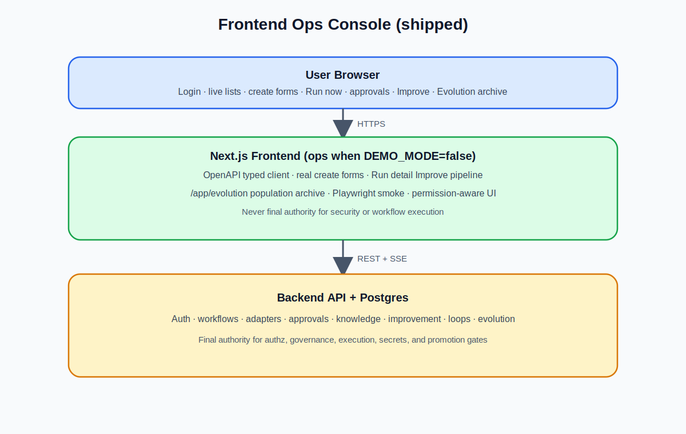
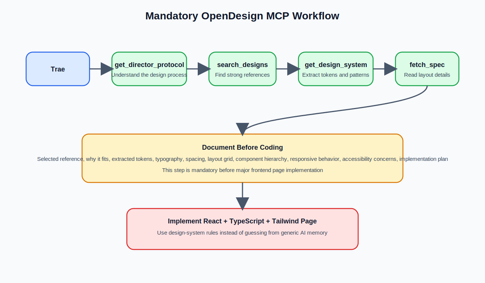
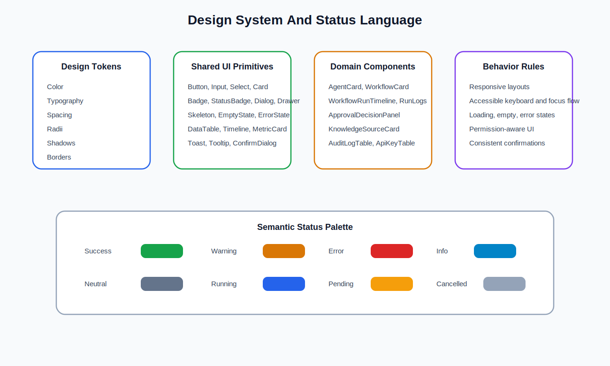
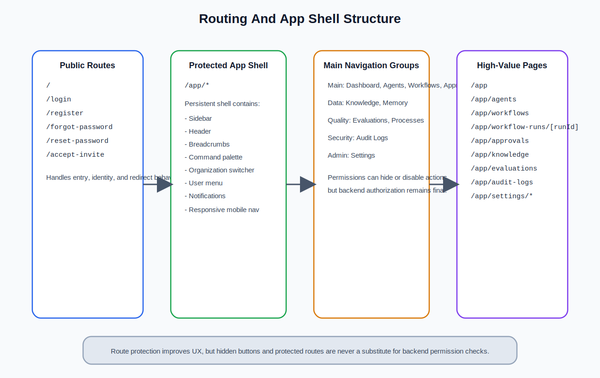
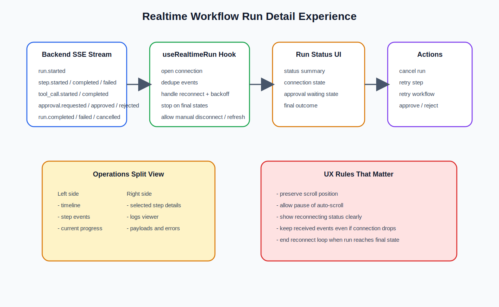
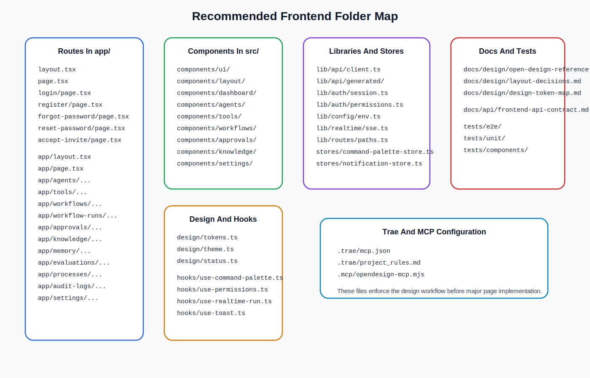
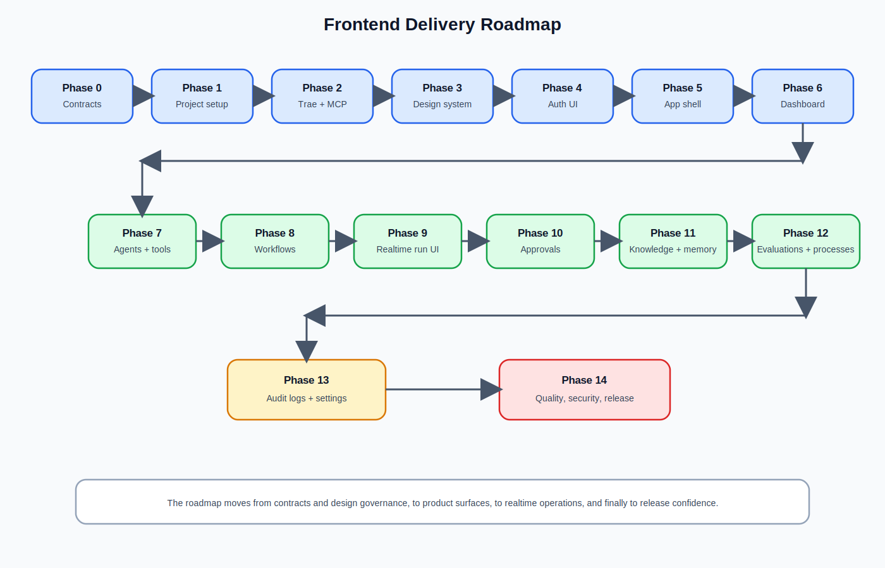

# Frontend Server 說明書

## 一本把 `frontend_hk.md` 講清楚的營運主控台設計書

> **實作現況（mark ~100）：** 本說明書源自 frontend 計劃 `frontend_hk.md`（英文原文 `frontend.md`）。產品標竿已關閉：Next.js ops console、live ops（`NEXT_PUBLIC_DEMO_MODE=false`）、真實 create 表單、OpenAPI 型別、Run now、Improve 管線（Reflect→Propose→Evaluate→Canary）、`/app/evolution` archive、accept-invite 接後端 accept API、使用者邀請／停用、組織 PATCH、run lifecycle（cancel／retry／pause／resume／expire）。  
> **SDD 規格包：** `planning/frontend/`（`requirements.md`／`design.md`／`tasks.md`，**FE-01…20**；tasks **v2.3** 含 Deliverable code paths）。  
> **證據：** `status.md`、`frontend/README.md`、`planning/gap_analysis_for_frontend.md`（100/100）、`planning/frontend/TASK_TO_CODE_TRACEABILITY.md`。  
> **後端契約：** 營運台 **只經** 版本化 `/api/v1` 呼叫 `backend/`（見 `backend_hk.md` §24、`frontend_hk.md` §33.3a）。

**來源文件：** `frontend_hk.md`（frontend 需求、設計與實作計劃；§33 為 as-built 實作對應）  
**英文對照：** `frontend.md`  
**目的：** 把偏工程規格的前端內容，改寫成較容易閱讀、向管理層與跨職能團隊解釋，但仍保留核心技術資訊的說明書。  
**適合讀者：** 產品負責人、設計師、營運團隊、審批人員、前端／全端工程師，以及需要理解「主控台如何落地」的人。

---

## 閱讀指南

這本書主要回答八個問題：

1. 這個 frontend 是平台的哪一部分？它與 backend 如何分工？
2. 產品願景與範圍：應該做甚麼、絕對不做甚麼？
3. 技術棧、渲染策略與執行期邊界如何保證「前端不執行業務」？
4. 資訊架構、導航、角色與 App Shell 如何組織營運體驗？
5. 核心頁面（認證、dashboard、agents、workflows、run、審批、知識、設定）如何運作？
6. Improve 與 Evolution 為甚麼只能經 backend 沙盒 API？
7. API 整合、即時更新、安全、測試如何支撐 ops profile？
8. `planning/frontend/` SDD 規格包與 as-built 程式如何對應 `frontend_hk.md`？

內容順序：

1. 先定位 frontend 的角色與願景  
2. 再講邊界、技術棧、設計方法  
3. 拆開導航、頁面與元件  
4. 最後補安全／測試／完成定義，以及 **§14 實作對應（來源 §33）**

---

## 目錄

1. [Frontend 是甚麼](#chapter-1)
2. [產品願景與範圍](#chapter-2)
3. [技術棧與執行期邊界](#chapter-3)
4. [應用架構與設計流程](#chapter-4)
5. [資訊架構、導航與 App Shell](#chapter-5)
6. [角色、權限與視覺系統](#chapter-6)
7. [核心頁面：認證到 Dashboard](#chapter-7)
8. [Agents、Tools 與 Workflows](#chapter-8)
9. [Run Detail：即時、關卡、Improve 與演化](#chapter-9)
10. [知識、記憶、評估、審計與設定](#chapter-10)
11. [元件、資料夾、環境與 API](#chapter-11)
12. [狀態、無障礙、安全與測試](#chapter-12)
13. [完成定義與操作證明](#chapter-13)
14. [實作對應：SDD 規格包與 as-built](#chapter-14)

---

<a id="chapter-1"></a>
## 1. Frontend 是甚麼

### 1.1 最簡單的定義

Frontend Server 是 Generic Swarm 業務作業系統的 **營運主控台（ops console）**。  
它是使用者入口：登入、查看、管理、觸發與監察——但 **不作最終授權、不執行 workflow／agent／tool**。

簡而言之：

```text
Frontend = 使用者體驗層（呈現與互動）
Backend API = 受治理的智能與控制層
Agents = 專門化工作者
Workflows = 結構化業務執行路徑
Governance = 風險與審批控制
Audit = 信任與可追溯層
```

### 1.2 Frontend 負責甚麼

- 呈現、互動、路由、版面  
- UI 狀態、前端可用性驗證  
- 使用者體驗、客戶端即時更新顯示  
- 設計系統實作  

### 1.3 Frontend 不負責甚麼

- Workflow／agent／tool **執行**  
- 以 client 為唯一授權真相  
- 直接寫資料庫、背景 job、embedding／索引  
- 密鑰儲存、瀏覽器內 provider API key  
- 建立系統 audit 紀錄、計費計算  
- 靜默改 production DNA；host 自我改寫 UI  

**邊界規則：** 前端可以 *請求* 動作；backend *決定* 是否允許。隱藏按鈕不是安全機制。

### 1.4 與其他文件的關係

| 文件 | 角色 |
|------|------|
| `structure_hk.md` | 整體架構願景（權威） |
| `backend_hk.md` | API 控制平面如何落地 |
| `frontend_hk.md`／本書 | 營運台如何 **只經 API** 操作系統 |
| `planning/frontend/` | FE-01…20 子功能 SDD |



---

<a id="chapter-2"></a>
## 2. 產品願景與範圍

### 2.1 願景

Frontend 應感覺像嚴肅的 **企業 SaaS 營運平台**，而不是 generic AI demo。

介面應傳達：信任、可靠、營運清晰、安全、專業、速度、控制、可觀測。

使用者應始終理解：有哪些 agents／workflows、甚麼在跑、甚麼失敗、甚麼待審批、知識與資料從哪來、誰做了甚麼、甚麼需要關注。

### 2.2 範圍內

- 公開 root／認證（含 **accept-invite**）  
- 已驗證 app shell、dashboard  
- Agents、Tools、Workflows、Run detail、Approvals  
- Knowledge、Memory、Evaluations、Processes、Audit  
- **Evolution** archive；run detail 上的 **Improve** 管線  
- Organization／users／API keys／security；billing 佔位  
- 回應式版面；loading／empty／error；權限感知導航  
- 型別化 API；即時 run UI  
- Ops profile：`NEXT_PUBLIC_DEMO_MODE=false` + live backend + Postgres  

### 2.3 範圍外與真相源

範圍外見 §1.3。  
**Backend 是** authn／authz、執行、知識、記憶、評估、治理、audit、組織安全的 **唯一真相源**。

---

<a id="chapter-3"></a>
## 3. 技術棧與執行期邊界

### 3.1 建議技術棧（與 as-built）

```text
Next.js · React · TypeScript · Tailwind CSS
```

```text
Browser → Next.js Frontend → Backend API (FastAPI) → services
```

- Hybrid 渲染：殼／metadata 可用 server components；即時時間軸、表單、command palette、modal 用 client components。  
- Package manager：as-built 使用 **pnpm**。  
- 表單：Zod + react-hook-form（真實 create agent／workflow）。  
- Typed client：**必要**（`pnpm api:generate` → OpenAPI 型別）。  

### 3.2 執行期邊界（再強調一次）

| Frontend | Backend |
|----------|---------|
| 渲染、路由、UX 層路由保護 | 認證驗證、授權、角色 |
| 呼叫 API、UI session | 持久化與執行 |
| 顯示資料／錯誤／即時事件 | 審批狀態、audit 寫入 |
| 角色感知導航 | 知識索引、記憶、評估、密鑰 |

### 3.3 Demo vs Ops

| Profile | 設定 | 用途 |
|---------|------|------|
| Demo | `NEXT_PUBLIC_DEMO_MODE` 未設或 true | UI 預覽、不依賴 live 變更 |
| **Ops（產品真相）** | `false` + live API + Postgres | 產品標竿／E1 操作路徑 |

---

<a id="chapter-4"></a>
## 4. 應用架構與設計流程

### 4.1 高層架構

```text
User Browser --HTTPS--> Next.js --/api/v1--> Backend
  Auth · Agents · Tools · Workflows · Runs · Approvals
  Knowledge · Memory · Evaluation · Audit · Org · Evolution · Improve
```

受保護路由：`/app/*`  
- 未登入 → `/login`  
- 無權限 → 403 Access Denied（UX only）  
- Backend 403 仍是最終依據  

### 4.2 OpenDesign MCP

重大 page layout 應先走 OpenDesign MCP（搜尋參考 → tokens → layout plan → 實作）。  
**As-built：** MCP 不可用時使用 **documented fallback**（`frontend/docs/design/open-design-reference.md`）——這是規格允許的路徑，不是偷懶省略設計紀律。



### 4.3 設計系統

- Tokens：色彩、字型、間距、狀態語義（`src/design/*`）  
- 狀態 badge：running／succeeded／failed／awaiting approval／paused／cancelled／expired  
- 企業營運密度：可掃描表格、克制動效  



---

<a id="chapter-5"></a>
## 5. 資訊架構、導航與 App Shell

### 5.1 主要路由

```text
/  /login  /register  /forgot-password  /reset-password  /accept-invite

/app
/app/agents …  /app/tools …
/app/workflows …  /app/workflow-runs/[runId]
/app/approvals …
/app/knowledge …  /app/memory
/app/evaluations  /app/processes
/app/audit-logs
/app/evolution
/app/settings/…（organization · users · api-keys · security · …）
```

As-built：多數已驗證區可由動態 `/app/[...slug]` 提供；上述路徑仍是 deep link 與導航的 **資訊架構**。

### 5.2 Sidebar 分組

```text
Main: Dashboard · Agents · Workflows · Approvals
Data: Knowledge · Memory
Quality: Evaluations · Processes · Evolution
Security: Audit Logs
Admin: Settings
```

### 5.3 Header 與 Command palette

- Header：breadcrumbs、command、環境指示、org switcher、通知、user menu  
- Command palette：`Cmd/Ctrl+K`（建立、搜尋、最近 run、審批、邀請、API keys 等）  



---

<a id="chapter-6"></a>
## 6. 角色、權限與視覺系統

### 6.1 角色（建議）

Owner · Admin · Developer · Operator · Reviewer · Viewer · Billing Manager · Security Auditor

### 6.2 權限顯示規則

- 前端：依 session／角色 **隱藏或停用** 控制（UX only）  
- 後端：最終允許／403  
- 權限資料缺失時 **fail closed**  

### 6.3 App Shell

Sidebar + Header + 內容區是整個應用骨架；響應式下 sidebar 可收合為 mobile nav。

---

<a id="chapter-7"></a>
## 7. 核心頁面：認證到 Dashboard

### 7.1 登入

- `POST /api/v1/auth/login`  
- 成功：建立 session（token cookie／session 策略依契約）→ `/app`  
- 失敗：顯示 backend message + `request_id`（若有）  

### 7.2 Accept Invite（已出貨）

- 路由：`/accept-invite`（可 `?token=`）  
- `POST /api/v1/users/invitations/accept` `{ token, password, name? }`  
- 公開端點；成功後寫入 session 並進入 `/app`  
- As-built：`AcceptInviteForm` + `backendApi.acceptInvitation`  

### 7.3 Dashboard `/app`

- Metric cards、pending approvals、failed runs  
- Onboarding checklist、quick actions  
- Loading／empty／error 三態  

---

<a id="chapter-8"></a>
## 8. Agents、Tools 與 Workflows

### 8.1 Agents／Tools

- 列表／建立／詳情  
- 真實表單（Zod + RHF）；錯誤含 backend message + `request_id`  
- **不在瀏覽器執行** agent 或 tool  

### 8.2 Workflows

- 列表／建立／詳情  
- **Run Now**：組裝合法 payload → 後端 start run → 導向 run detail  
- As-built：`run-workflow-button` + `workflow-run-payload`  

---

<a id="chapter-9"></a>
## 9. Run Detail：即時、關卡、Improve 與演化

這是營運最重要的畫面之一。

### 9.1 必備區塊

Run header、狀態、timeline、步驟詳情、live logs、tool calls、輸入／輸出、審批狀態、錯誤、audit 元資料、**Improve 面板**。

### 9.2 狀態與動作

狀態（對齊 backend lifecycle）：Queued · Running · Waiting for Approval · **Paused** · Succeeded · Failed · Cancelled · **Expired** …

**As-built 動作（經 backend API）：**

| 動作 | API |
|------|-----|
| Cancel | `POST …/workflow-runs/{id}/cancel` |
| Retry | `POST …/retry` |
| Pause | `POST …/pause` |
| Resume | `POST …/resume` |
| Expire | `POST …/expire` |

UI：`WorkflowRunConsole`（含 SSE 連線狀態指示）。

### 9.3 即時更新

- 優先 SSE；連線中斷時顯示 reconnecting  
- 事件去重；**不**在 client 執行步驟  



### 9.4 人機閘門

- Approvals 列表／詳情；明確 approve／reject  
- 禁止靜默 auto-approve  
- Run 上的待審 callout 連到審批流  

### 9.5 Improve 管線

順序：**Reflect → Propose → Evaluate → Canary**（可逐步或 full pipeline）  
- 每一步顯式操作 + backend 成功  
- **禁止** client 寫 production DNA  

### 9.6 Evolution archive

- 路由：`/app/evolution`  
- 沙盒變體 fitness 列表；evaluate／canary／promote 僅 backend  
- 無 host 自我改寫 UI  

---

<a id="chapter-10"></a>
## 10. 知識、記憶、評估、審計與設定

### 10.1 Knowledge／Memory／Evals／Processes

- 以 backend 讀取為主  
- 搜尋應 debounce  
- 不做瀏覽器內向量庫／索引引擎  

### 10.2 Audit

- **唯讀**列表與篩選  
- 前端 **不** 建立系統 audit 紀錄  

### 10.3 Settings（已出貨核心）

| 功能 | As-built |
|------|----------|
| Users 列表／邀請／停用 | `UserAdminPanel` → invitations + `PATCH /users/{id}` |
| Organization 儲存 | `OrganizationSettingsForm` → `PATCH /organizations/{id}` |
| API keys | 列表／遮罩；建立後一次性密鑰規則 |
| Billing | 佔位（不虛構收費） |

邀請 UX：管理員建立 invitation → 顯示／複製一次性 token → 受邀者 `/accept-invite?token=…`。

---

<a id="chapter-11"></a>
## 11. 元件、資料夾、環境與 API

### 11.1 可重用元件

Button、Input、Card、DataTable、StatusBadge、MetricCard、EmptyState、ErrorState、Skeleton、Timeline、LogViewer、Section、command palette，以及 domain 面板（run console、improve、approvals、evolution、user admin、org form）。

### 11.2 資料夾（as-built）

```text
frontend/
  src/app/          # routes
  src/components/   # ui · layout · domain · auth
  src/lib/          # api · auth · config · realtime · forms
  src/design/
  tests/unit/  e2e/
  docs/api/  docs/design/
  openapi.json
```



### 11.3 環境變數

| 變數 | 用途 |
|------|------|
| `NEXT_PUBLIC_API_BASE_URL` | Backend `/api/v1` base |
| `NEXT_PUBLIC_DEMO_MODE` | `false` = ops；true = demo |

密鑰 **不得** 用 `NEXT_PUBLIC_` 暴露。

### 11.4 API 整合規則

- 只呼叫版本化 `/api/v1/*`  
- `backendApi` facade + OpenAPI 產生型別  
- 錯誤：`AppError` + `request_id`  
- Schema 變更後：`pnpm api:generate`  

主要域：auth、users、invitations、organizations、agents、tools、workflows、runs（含 lifecycle）、approvals、knowledge、memory、evaluations、processes、audit、evolution、improvement。

---

<a id="chapter-12"></a>
## 12. 狀態、無障礙、安全與測試

### 12.1 Loading／Empty／Error

主要資料頁必須三態齊備；error 顯示 `request_id`（若有）。

### 12.2 無障礙

鍵盤可操作、表單標籤、焦點管理；狀態不只靠顏色；目標 WCAG 2.2 AA 實務。

### 12.3 安全

- 無 provider secrets 於 client bundle  
- XSS-safe 渲染  
- 破壞性動作需確認（停用使用者、revoke key 等）  
- 權限 UI 永不取代 backend  

### 12.4 測試與品質閘

- Unit（vitest）、lint、typecheck、build  
- E2E smoke 可在伺服器未啟動時 skip（非 always-on CI 硬性要求）  
- As-built 產品標竿：unit 綠燈、build 通過  

---

<a id="chapter-13"></a>
## 13. 完成定義與操作證明

### 13.1 每頁 DoD

1. 路由可達（IA）  
2. 權限感知  
3. Loading／empty／error  
4. API 已接線或文件化 stub  
5. 無 charter 違規（不執行、不改 DNA、不藏密鑰）  

### 13.2 產品標竿已出貨清單（`frontend_hk.md` §33.7）

```text
- Auth + app shell + 動態 /app domain 表面
- 真實 agent／workflow 建立表單
- Run now + 有效 payload
- Improve 管線於 run detail
- /app/evolution archive
- 型別化 API client + OpenAPI 產生
- Accept-invite → POST invitations/accept
- Settings：邀請／停用使用者 + organization PATCH
- Run detail：cancel／retry／pause／resume／expire
- lint / typecheck / unit / build 綠燈
- planning/frontend FE-01…20 SDD
- gap_analysis_for_frontend 產品標竿 100/100
```

### 13.3 非目標（不阻斷 mark ~100）

- Always-on Playwright 永久伺服器  
- 完整商業 LightRAG／Neo4j 圖探索產品  
- 即時外部 CRM／email／billing SaaS 管理台  
- DGM 式 host 自我改寫 UI  
- 以前端權限取代 backend 授權  

### 13.4 E1 操作路徑（前端視角）

```text
登入 → dashboard → 建立／Run workflow → 人機閘 → Improve →（可選）evolution archive
```

API 端到端證明亦見 backend `test_e1_operator_path`。



---

<a id="chapter-14"></a>
## 14. 實作對應：SDD 規格包與 as-built

### 14.1 文件關係

| 文件 | 角色 |
|------|------|
| `structure.md`／`structure_hk.md` | 架構 SoT |
| `planning/structure/` | 架構 SDD 01–17 |
| `backend.md`／`backend_hk.md` | 控制平面計劃 + §24 |
| `planning/backend/` | BE-01…24 |
| `frontend.md`／`frontend_hk.md` | 前端計劃 + §33 |
| `planning/frontend/` | **FE-01…20** requirements／design／tasks |
| `planning/gap_analysis_for_frontend.md` | 任務 vs 實作（100/100） |
| `frontend/` | As-built Next.js console |

### 14.2 FE 子功能執行順序（摘要）

```text
01 章程 → 02 scaffold → 03 設計系統
→ 07 API client → 05 認證 UI → 06 權限 UI → 04 App shell
→ 08 dashboard → 09 agents/tools → 10 workflows → 11 run realtime
→ 12 approvals → 13 knowledge/memory → 14 evals/processes
→ 15 audit → 16 settings → 17 evolution → 18 improve
→ 19 a11y/states → 20 安全／測試／ops profile
```

完整表見 `planning/frontend/README.md`。

### 14.3 structure 能力閘（前端份額）

| 階段 | 前端 as-built |
|------|----------------|
| A 基礎 | 認證、shell、權限導航、空／錯態 |
| B 影子學習 | Knowledge／memory／process 視圖 |
| C 可控副駕駛 | Live ops 表單、run-now、run detail、人機閘、OpenAPI client |
| D 演化沙盒 | Improve；`/app/evolution`；evaluate／canary 僅 backend |

### 14.4 關鍵 as-built 模組

| 能力 | 代表路徑 |
|------|----------|
| API facade | `src/lib/api/client.ts` |
| Live ops 清單 | `src/lib/api/live-ops-surfaces.ts` |
| Login／accept-invite | `components/auth/*`、`app/accept-invite` |
| Run console | `components/domain/workflow-run-console.tsx` |
| Improve | `components/domain/improve-run-button.tsx` |
| Evolution | `components/domain/evolution-archive-panel.tsx` |
| Users／Org | `user-admin-panel.tsx`、`organization-settings-form.tsx` |
| 建立表單 | `form-route-actions.tsx` |

### 14.5 最終前端規則（總結）

1. Backend 是授權與執行真相源。  
2. 前端不執行 agents／workflows／tools。  
3. 不靜默改 production DNA。  
4. 重大 layout 用 OpenDesign 或 documented fallback。  
5. API 變更後 `pnpm api:generate`。  
6. Ops profile（`DEMO_MODE=false`）才是產品真相路徑。  

---

## 結語

這本說明書把 `frontend_hk.md` 從「工程藍圖」改寫成「可溝通的主控台說明」：  
**清楚、可控、可操作**——而不是把智能與治理搬進瀏覽器。

若要深入規格條目，請讀：

- 需求／設計／任務：`planning/frontend/nn_*/`  
- 差距分析：`planning/gap_analysis_for_frontend.md`  
- 英文原文：`frontend.md`  
- 後端控制平面：`backend_hk.md` 與 `book.backend_hk.md`  

**完。**
