# The Generic Swarm Business Operating System

### A Complete Technical Book

**Project:** `generic-swarm-ops`
**Starter spec:** `1.2.0-trae-only` · **Business spec:** `2.1` (Research-Integrated Edition) · **Product bar:** mark ~100
**Target environment:** Trae IDE + Grok Build (dual-harness)
**Stack:** Node.js 20+ (bootstrap) · Python / FastAPI + Postgres (backend) · Next.js / React / TypeScript / Tailwind (frontend)

---

> This book is the single, exhaustive reference for the `generic-swarm-ops` system. It is compiled
> from the source-of-truth documents in the repository — including `starter.md`, `tasks.md`,
> `status.md`, `structure.md` / `structure_hk.md`, `backend.md` / `backend_hk.md`,
> `frontend.md` / `frontend_hk.md`, `plan_to_mark_100.md`,
> `docs/self-improvement-and-orchestration.md`, and the SDD packs under `planning/structure/`,
> `planning/backend/`, and `planning/frontend/` (with gap analyses for structure, backend, and
> frontend at product-bar 100/100) — and describes every component, workflow, architecture decision,
> and implementation detail so that any reader can achieve a complete, in-depth understanding of
> the system.

---

## Table of Contents

1. [Introduction and Reading Guide](#1-introduction-and-reading-guide)
2. [What This System Is](#2-what-this-system-is)
3. [Core Principles and Design Priorities](#3-core-principles-and-design-priorities)
4. [High-Level Architecture](#4-high-level-architecture)
5. [The Starter Layer: Environment Contract](#5-the-starter-layer-environment-contract)
6. [Layer 1 — Process Intelligence](#6-layer-1--process-intelligence)
7. [Layer 2 — Knowledge, Distillation, and Hybrid Memory](#7-layer-2--knowledge-distillation-and-hybrid-memory)
8. [Layer 3 — Execution: Workflow DNA](#8-layer-3--execution-workflow-dna)
9. [Layer 4 — The Evolution Engine (Sandboxed)](#9-layer-4--the-evolution-engine-sandboxed)
10. [Layer 5 — Governance, Risk, and Compliance](#10-layer-5--governance-risk-and-compliance)
11. [Layer 6 — Security](#11-layer-6--security)
12. [The Evaluation System](#12-the-evaluation-system)
13. [The Agent Roster](#13-the-agent-roster)
14. [Human–AI Interaction Rules](#14-humanai-interaction-rules)
15. [The Backend API Server](#15-the-backend-api-server)
16. [The Frontend Application](#16-the-frontend-application)
17. [Repository Structure and Bootstrap](#17-repository-structure-and-bootstrap)
18. [Implementation Status](#18-implementation-status)
19. [End-to-End Walkthrough: Onboarding a Customer](#19-end-to-end-walkthrough-onboarding-a-customer)
20. [How To: Common Tasks](#20-how-to-common-tasks)
21. [90-Day Rollout Plan](#21-90-day-rollout-plan)
22. [Glossary](#22-glossary)
23. [References](#23-references)

---

## 1. Introduction and Reading Guide

`generic-swarm-ops` is two things fused into one repository.

First, it is an **executable starter repository for Trae IDE**. It knows how to download, audit,
curate, and synchronize a large set of reference sources (skills, agents, commands, MCP
configurations, rules) into a governed Trae workspace. That behavior comes from `starter.md`.

Second, it is a **Generic Swarm Business Operating System** — a governed, self-improving
multi-agent system that learns how a business actually operates, distills that knowledge into
reusable assets, executes work through bounded and auditable agent workflows, and evolves those
workflows in a sandbox rather than in production. That behavior comes from `structure.md`, and it is
exposed through a real FastAPI backend (`backend.md`) and a Next.js frontend (`frontend.md`).

The two halves are intentionally layered. The starter layer is the *environment contract* — the
files, scripts, manifests, and safety rules that make the project a legitimate Trae project. The
business layer is the *domain architecture* — the agents, workflows, memory, governance, and
evaluation machinery that make the project useful. When the two ever appear to conflict, the rule is
simple: **follow the stricter safety, auditability, governance, and security requirement.**

**How to read this book.** Chapters 2–4 give you the mental model. Chapter 5 covers the starter
environment. Chapters 6–14 walk the six architectural layers plus evaluation, the agent roster, and
human interaction. Chapters 15–16 describe the running software (backend and frontend). Chapters
17–18 cover the repository and its current build status. Chapters 19–21 are practical: an end-to-end
walkthrough, how-to recipes, and the rollout plan. Chapters 22–23 close with a glossary and
references.

Throughout, illustrations are embedded as SVG files stored alongside this book in
[`book/assets/`](assets/). Each figure is captioned and referenced from the text.

---

## 2. What This System Is

The Generic Swarm Business Operating System is a governed, self-improving multi-agent system that
does four things:

1. **Learns** how a business actually operates — from documents, from experts, and, critically, from
   real event logs.
2. **Distills** that knowledge into reusable rules, skills, workflows, and playbooks.
3. **Executes** work through bounded, auditable agent workflows.
4. **Evolves** those workflows in a sandbox — never directly in production.

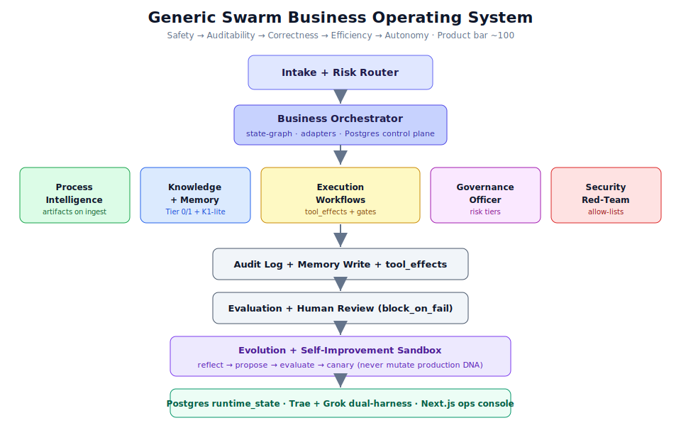

*Figure 2.1 — The system at a glance. Events enter through an intake and risk router, flow to the
Business Orchestrator, and pass through six cooperating layers. Every action is written to an audit
log and to memory, evaluated, reviewed by humans where required, and only then considered for
sandboxed evolution.*

The design is deliberately conservative. Autonomy is not granted by default; it is **earned per
workflow through evidence**. A workflow starts out only allowed to observe, and it climbs the
autonomy ladder (Chapter 10) as it accumulates passing evaluations, rollback plans, and human
sign-off. This is what separates the system from an unconstrained "swarm": the graph, not the model,
holds the authority.

---

## 3. Core Principles and Design Priorities

Seven principles govern every decision in the system:

1. **Evidence over opinion.** Learn from real traces, not only from what people say they do.
2. **Bounded autonomy.** Every action has a risk tier, a permission scope, and — where needed — a
   human gate.
3. **Everything is testable.** No agent, prompt, or workflow reaches production without passing an
   evaluation.
4. **Sandbox evolution.** The evolution engine proposes; it never mutates production directly.
5. **Provenance always.** Every rule, decision, and memory traces back to a source.
6. **Reversibility first.** Prefer reversible actions; require rollback plans for the rest.
7. **Human-centered.** Show confidence, show evidence, and make correction easy.

These principles are expressed as an explicit ordering of priorities:

> **Safety → Auditability → Correctness → Efficiency → Autonomy.**

That ordering is not decoration. It resolves trade-offs. If making a workflow more autonomous would
reduce auditability, auditability wins. If a faster retrieval path would weaken safety, safety wins.
The whole system is built so that the safe, auditable, correct behavior is also the default behavior.

---

## 4. High-Level Architecture

At the top of the system sits an **Intake + Risk Router**. Every event or request — a new ticket, an
API call, a scheduled job — arrives here first, is classified for risk, and is handed to the
**Business Orchestrator**, a state-graph controller that owns the global objective and routes work.

From the orchestrator, work flows through six cooperating layers:

- **Process Intelligence** (Chapter 6) — learns real workflows from event logs.
- **Knowledge + Memory** (Chapter 7) — retrieval-augmented knowledge with a differentiated memory
  system and always-on provenance.
- **Execution Workflows** (Chapter 8) — bounded state graphs described by "Workflow DNA".
- **Governance** (Chapter 10) — risk tiers, approval rules, and audit requirements.
- **Security** (Chapter 11) — adversarial testing, prompt-injection defense, and blast-radius
  control.
- **Evolution** (Chapter 9) — a sandbox that proposes and tests variants.

Everything is wrapped by the **Evaluation** system (Chapter 12). The output of every run is written
to an **audit log** and to **memory**, then evaluated and (where the risk tier requires) reviewed by
a human before any sandboxed evolution is considered.

The key architectural insight is the separation of *authority* from *intelligence*. The language
model provides intelligence inside a node of the graph. The graph — deterministic, inspectable code
— provides authority: it enforces state, permissions, and human-in-the-loop gates. Security and
governance are enforced deterministically, outside the model, because "system prompts are not
security controls."

---

## 5. The Starter Layer: Environment Contract

Before the business system can exist, the repository must be a legitimate, executable Trae project.
That is the job of `starter.md`, and it has already been fully implemented and validated in this
repository (see Chapter 18).

### 5.1 Purpose and Scope

The starter layer builds an executable repository that **downloads, audits, curates, and
synchronizes reference sources** into a Trae IDE workspace, including project rules, custom agents,
skills, commands, MCP configuration, and supporting docs. It is intentionally scoped to **Trae IDE
only** — outputs for other editors (CLAUDE.md, GEMINI.md, `.cursor/`, `.codex/`, Copilot instruction
files) are explicitly out of scope.

The starter supports two modes:

- **Self-bootstrap mode** — implement the starter repository itself in the current repository.
- **Create-new-project mode** — generate a new downstream project from the specification.

### 5.2 The Non-Negotiable Outcome

The starter is "not only documentation." The command `npm run bootstrap` must perform a real flow,
in order:

```text
doctor
→ create required directories
→ validate sources/manifest.json
→ clone/update all enabled GitHub sources
→ write sources/source-lock.json
→ generate docs/source-audit.md
→ run security smoke checks
→ run sync dry-run
→ run tests
```

The project is not complete unless the reference repositories are actually downloaded into
`external/sources/`.

### 5.3 Source Manifest and the Untrusted-Sources Rule

`sources/manifest.json` lists every upstream reference repository — the ECC ("Everything Claude
Code") reference, official Anthropic/OpenAI/Google repositories, Model Context Protocol servers and
registry, the GitHub MCP server, AGENTS.md specification, Karpathy-style behavior rules, memory and
"superpowers" skill references, best-practice and discovery lists, community subagents, and security
rule sets. Each entry carries a `priority`, `tier`, `quarantine` flag, and `import_policy`.

The safety model is strict and central to the whole project:

- Downloaded repositories live only under `external/sources/` and are **git-ignored** — never
  committed.
- They are **untrusted reference inputs**. The downloader clones and inspects metadata only. It must
  never run install scripts, `npm install`, `curl | bash`, or hooks from downloaded repos, and must
  never write outside the project root.
- Only **curated, audited, attributed** material may be copied into first-party directories
  (`rules/`, `skills/`, `hooks/`, `mcp-configs/`, `docs/`), and only after human approval when the
  impact is high.

A required source that fails to clone is fatal; an optional source that fails is recorded but
non-fatal unless `--strict` is passed. Archived sources (`enabled: false`) are never downloaded by
default.

### 5.4 Source Lock and Source Audit

After download, `sources/source-lock.json` records resolved URL, commit, branch, last-commit
metadata, detected license files, package files, quarantine status, and import policy for every
source. `scripts/source-audit.mjs` then reads the manifest and the lock file and generates
`docs/source-audit.md`, a per-source report that marks a source **unsafe for automatic import** when
it has no license, contains remote-executing install scripts, is archived, requires credentials,
modifies global agent configuration, or ships MCP servers needing broad filesystem/network access.
The first audit pass marks most repositories as "bulk import rejected until human review."

### 5.5 The Sync Layer and Generated Files

The sync layer regenerates Trae workspace outputs (`AGENTS.md`, `docs/agents.md`, `docs/trae.md`,
`.trae/settings.json`, `.trae/rules/`, `.trae/agents/`, `.trae/commands/`) from the first-party
`rules/`, `skills/`, `hooks/`, and `mcp-configs/`. Every generated file carries a header:

```text
<!-- AUTO-GENERATED by starter. Do not edit directly.
Source: rules/, skills/, hooks/, mcp-configs/
Run: npm run sync
-->
```

This is why `AGENTS.md` at the repository root should never be edited by hand; it is regenerated by
`npm run sync`.

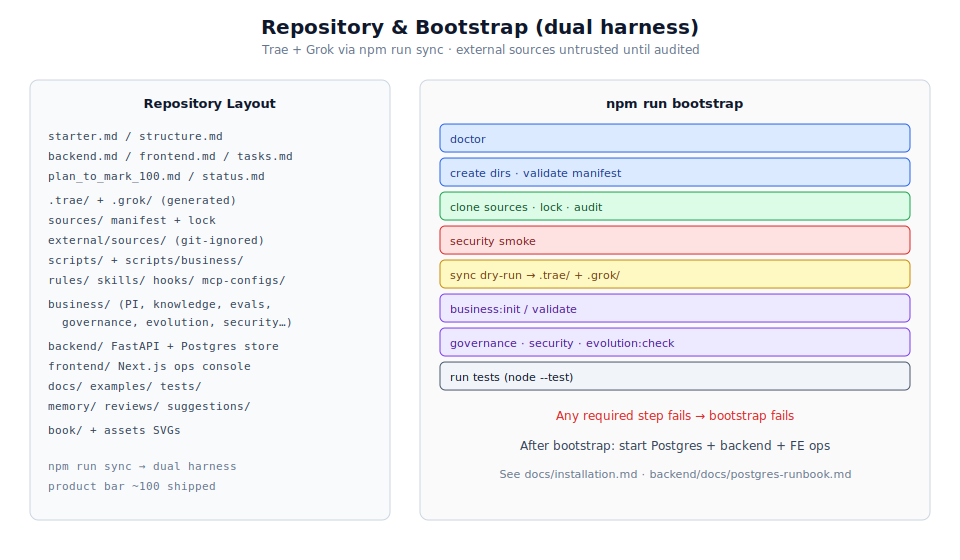

*Figure 5.1 — On the left, the repository layout combining starter, business, backend, frontend, and
book. On the right, the `npm run bootstrap` pipeline. Any required step failing causes the whole
bootstrap to fail.*

---

## 6. Layer 1 — Process Intelligence

Most "swarm" designs learn only from documents and interviews. This system insists on learning from
**actual operational traces**: tickets, CRM/ERP actions, calendar events, emails, approvals, file
edits, API calls, and completion records. Process mining turns these logs into discoverable workflow
models, conformance checks, and bottleneck analysis — the empirical version of "Shadow Mode."

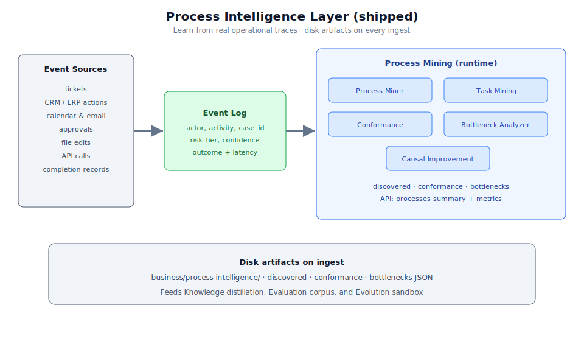

*Figure 6.1 — Raw event sources are normalized into a structured event log, which the process-mining
agents turn into discovered processes, conformance reports, bottleneck analyses, and causal
hypotheses.*

### 6.1 The Process-Mining Agents

Five specialized agents operate in this layer:

- **Process Miner Agent** — discovers real workflows from event logs.
- **Task Mining Agent** — observes UI/human-level steps where permitted.
- **Conformance Agent** — compares actual work against documented SOPs.
- **Bottleneck Analyzer** — finds delays, loops, rework, and handoff failures.
- **Causal Improvement Agent** — proposes interventions likely to improve outcomes.

### 6.2 The Event Log Schema

The event log is the atomic unit of empirical learning. Each event captures who did what, on which
case, with which tools, and with what outcome:

```yaml
event:
  id: "evt_..."
  timestamp: "2026-07-06T14:03:00Z"
  actor_type: "human | agent | system"
  actor_id: "user_or_agent_id"
  process_id: "customer_onboarding"
  case_id: "customer_12345"
  activity: "review_contract"
  input_refs: ["doc_contract_v3"]
  output_refs: ["approval_decision_789"]
  tools_used: ["crm", "email"]
  decision_point: true
  decision_reason_summary: "Contract had non-standard liability clause."
  confidence: 0.82
  risk_tier: "medium"
  human_approved: true
  outcome:
    status: "completed"
    latency_minutes: 42
    quality_score: 0.94
```

The repository ships a machine-readable JSON Schema for this shape
(`business/schemas/event-log.schema.json`) plus a conforming example. Allowed `actor_type` values
are `human`, `agent`, and `system`; allowed risk tiers are the six named tiers
(`tier_0_observe` through `tier_5_restricted`) that mirror the autonomy ladder in Chapter 10.

### 6.3 Where the Output Goes

Discovered processes and conformance reports feed three downstream consumers: the knowledge
distillation pipeline (which turns recurring patterns into rules and playbooks), the evaluation
system (which uses historical cases as replay sets), and the evolution sandbox (which mines failures
and bottlenecks for improvement opportunities). The artifacts live under
`business/process-intelligence/` in `event-logs/`, `discovered-processes/`, `conformance-reports/`,
`bottlenecks/`, and `causal-hypotheses/`.

---

## 7. Layer 2 — Knowledge, Distillation, and Hybrid Memory

Documents and interviews still matter — but expert knowledge is largely **tacit**. Which cues matter,
when to override a rule, when something "feels wrong" — none of that is written down. This layer
captures tacit knowledge, distills it, and stores it in a differentiated memory system with a
cost-tiered retrieval stack.

### 7.1 Elicitation Methods

A single "Expert Shadow" agent is not enough. The system uses a multi-method capture toolkit drawn
from Cognitive Task Analysis and the Critical Decision Method:

| Method | Best For | Output |
|---|---|---|
| Shadow Mode | Real actions | Event logs, action traces |
| Critical Decision Interview | Rare / high-stakes calls | Decision requirement cards |
| Think-Aloud Session | Routine expert work | Step-by-step heuristics |
| Exception Interview | Edge cases | Exception library |
| Retrospective Review | Completed cases | Lessons learned |
| Apprentice Mode | Expert teaches swarm | Skills, playbooks |

### 7.2 The Decision Requirement Card

The Critical Decision Method produces a **Decision Requirement Card** — a structured record of a
high-stakes decision point that names the cues experts notice, the normal action, the exception
paths, the red flags, and the evidence required:

```yaml
decision_requirement:
  id: "drc_contract_exception_001"
  domain: "legal_operations"
  decision_point: "approve_non_standard_clause"
  expert_sources: ["senior_counsel_A", "contract_manager_B"]
  context_signals: ["customer_size", "liability_cap", "jurisdiction", "renewal_value"]
  cues_experts_notice:
    - "Clause shifts uncapped indirect damages to company."
    - "Customer insists on governing law outside approved list."
  normal_action: "route_to_legal_review"
  exception_paths:
    - condition: "enterprise_customer AND pre-approved fallback accepted"
      action: "approve_with_note"
  red_flags: ["unlimited liability", "data protection indemnity"]
  required_evidence: ["contract_diff", "customer_risk_profile", "approval_history"]
  risk_tier: "high"
  human_approval_required: true
  validation_tests:
    - "Does recommendation match senior counsel decision on historical cases?"
  confidence: 0.78
  last_reviewed: "2026-07-06"
```

A JSON Schema (`business/schemas/decision-requirement-card.schema.json`) and example ship with the
repository, and cards are stored under `business/experts/decision-requirement-cards/`.

### 7.3 Hybrid Memory

One generic "knowledge base" is insufficient. Long-running agents need **differentiated memory** —
raw observations, higher-level reflections, and retrievable long-term stores, a pattern proven by
work like Generative Agents and hierarchical-memory agent designs.

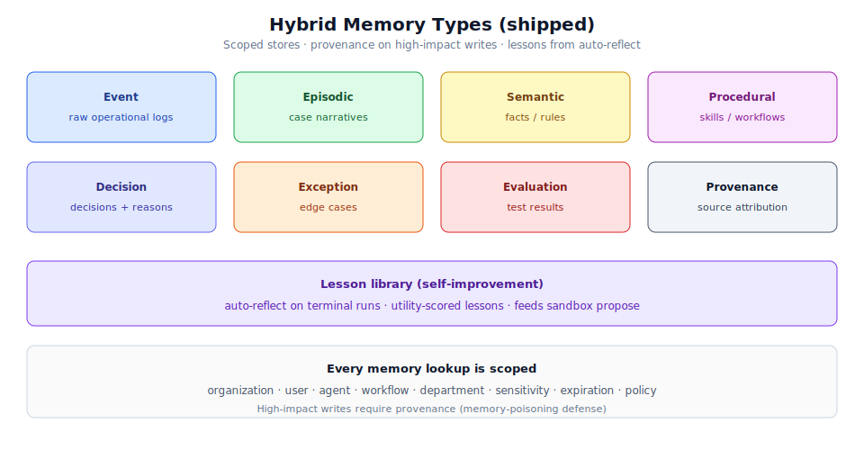

*Figure 7.1 — Eight memory types, each with a distinct role, plus the scoping and provenance rules
that govern every lookup and write.*

| Memory Type | Stores | Example |
|---|---|---|
| Event | Raw operational logs | "Agent sent invoice at 9:42 AM." |
| Episodic | Case narratives | "This renewal almost failed — legal was pulled in late." |
| Semantic | Facts / rules | "Enterprise contracts over 250k need legal review." |
| Procedural | Skills / workflows | "How to onboard a new client." |
| Decision | Decisions + reasons | "We approved exception X because Y." |
| Exception | Edge cases | "If supplier in region Z, use alternate process." |
| Evaluation | Test results | "Workflow v12 failed privacy test." |
| Provenance | Source attribution | "Rule came from SOP v4 and expert Alice." |

Memory is never globally available by default. Every lookup considers organization, user, agent,
workflow, department, sensitivity, expiration, and policy. High-impact writes require provenance and
human review — this is the system's **memory-poisoning defense**, since poisoned memory is a named
agentic risk class.

### 7.4 Tiered Hybrid Retrieval

The retrieval stack deliberately avoids GraphRAG-style community summarization, whose per-chunk
extraction and community-report generation make both initial indexing and re-indexing prohibitively
expensive for a system that ingests documents and event logs continuously. Instead it uses a
**cost-tiered** stack where most queries never touch the expensive tiers.

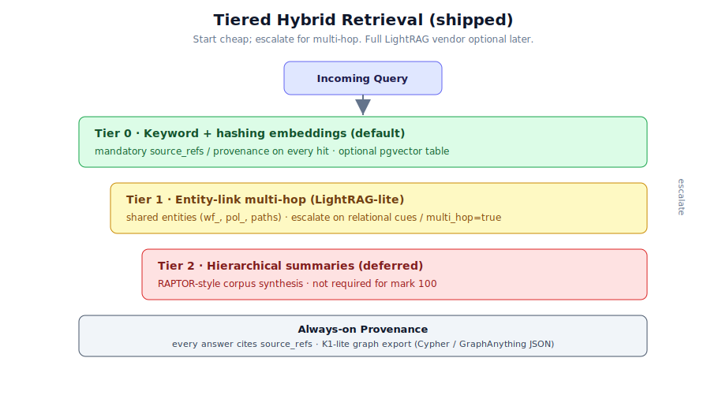

*Figure 7.2 — Queries start at the cheapest tier and escalate only when they need relational
reasoning or corpus-wide synthesis. An always-on provenance layer attaches sources to every answer.*

- **Tier 0 — Vector search** (default, cheapest). Semantic similarity over chunked documents. No
  graph, no extra LLM calls. Handles the majority of "find the relevant passage" queries.
- **Tier 1 — LightRAG graph layer** (relational reasoning). A graph-based text index with dual-level
  retrieval (low-level entity-specific + high-level thematic) and **incremental updates** — new
  documents and events are added without rebuilding the graph. This incremental property is the main
  reason LightRAG was chosen. It answers relational questions such as "which obligations depend on
  this contract?" or "who touched this case and in what order?"
- **Tier 2 — Hierarchical summaries** (RAPTOR-style, optional, on demand). A recursive
  cluster-and-summarize tree, built lazily only for corpora that get frequent corpus-wide questions
  like "recurring root causes across failed onboarding cases."
- **Always-on — Provenance layer.** Every answer cites its source documents, experts, event logs, or
  decisions regardless of which tier served it.

The escalation rule keeps 80%+ of traffic on the cheapest tier: start at Tier 0, escalate to Tier 1
only when the query needs relationships or multi-hop reasoning, and escalate to Tier 2 only for
global synthesis. If a build is not desired, off-the-shelf platforms such as AnythingLLM or RAGFlow
can host the stack with LightRAG behind them. Retrieval is scored separately on context relevance,
answer relevance, and faithfulness, because a weak retriever silently poisons every agent that
depends on it.

### 7.5 Knowledge Folder Structure

The business knowledge lives under `business/` in a fixed structure: `process-intelligence/`,
`knowledge-base/` (rules, decision patterns, exceptions, best practices, tacit knowledge,
provenance), `experts/`, `materials/`, `distilled/` (skills, prompts, workflows, checklists,
playbooks), `memory/`, `evals/`, `governance/`, `security/`, and `evolution/`.

---

## 8. Layer 3 — Execution: Workflow DNA

Execution does not happen in a free-form swarm. It happens inside a **bounded state graph** whose
structure is described by a schema called **Workflow DNA**. Reasoning-and-acting loops (ReAct-style
interleaving of thought, action, and observation) are useful *inside* a node, but the graph itself
enforces state, permissions, and human-in-the-loop gates.

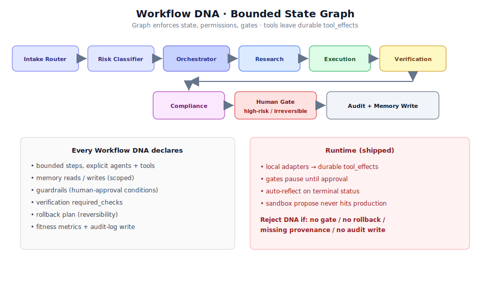

*Figure 8.1 — The execution graph (top), the mandatory declarations every Workflow DNA must carry
(bottom-left), and the conditions under which the validator rejects a production workflow
(bottom-right).*

### 8.1 The Workflow DNA Schema

Every workflow is a complete, self-describing contract:

```yaml
workflow_dna:
  id: "wf_customer_onboarding_v12"
  name: "Customer Onboarding"
  domain: "operations"
  objective: "Onboard customer with minimal delay and compliance risk."
  owner: "business_orchestrator"
  version: "12.0"
  inputs: ["signed_contract", "customer_profile", "billing_details"]
  preconditions:
    - "contract_status == signed"
    - "customer_risk_score <= threshold OR legal_approval == true"
  steps:
    - id: "verify_contract"
      agent: "quality_compliance_agent"
      tools: ["contract_parser", "policy_retriever"]
    - id: "create_customer_record"
      agent: "execution_agent"
      tools: ["crm"]
    - id: "configure_billing"
      agent: "finance_ops_agent"
      tools: ["billing_system"]
    - id: "send_welcome_packet"
      agent: "communications_agent"
      tools: ["email"]
  memory_reads: ["contract_rules", "customer_exceptions", "past_failures"]
  memory_writes: ["event_log", "decision_memory", "lessons_learned"]
  guardrails:
    human_approval_required_if:
      - "risk_tier == high"
      - "contract_exception_detected == true"
      - "tool_action_is_irreversible == true"
  verification:
    required_checks:
      - "crm_record_created"
      - "billing_config_validated"
      - "welcome_packet_sent"
      - "audit_log_complete"
  rollback:
    reversible: true
    rollback_steps: ["disable_customer_record", "void_initial_invoice", "notify_ops_owner"]
  fitness_metrics:
    - "cycle_time"
    - "error_rate"
    - "customer_satisfaction"
    - "compliance_pass_rate"
    - "human_escalation_rate"
    - "cost_per_case"
```

Every Workflow DNA must declare: bounded state-graph steps, explicit agents, explicit tools, memory
read/write declarations, guardrails, verification checks, a rollback plan, fitness metrics, and an
audit-log write requirement. The repository ships
`business/schemas/workflow-dna.schema.json` plus an example, and the validator
(`scripts/business/validate-business.mjs`) **fails any production workflow** that does not include
human gates for high-risk, irreversible, or exception-handling actions, or that lacks a rollback
plan for irreversible actions.

### 8.2 The Execution Pattern

The runtime realizes the DNA as a linear-with-gates state machine:

```text
Event → Intake Router → Risk Classifier → Orchestrator
   → [Research] → [Execution] → [Verification] → [Compliance] → [Human Gate]
   → Audit Log + Memory Write → Evaluation → Evolution Sandbox
```

Each transition is a checkpoint. Before a step runs, the runtime checks cancellation, permissions,
and governance; requests approval if the guardrails require it; executes the agent or tool; saves the
step output; emits a streaming event; and writes an audit log entry. This is exactly how the backend
worker executes a run (Chapter 15).

---

## 9. Layer 4 — The Evolution Engine (Sandboxed)

The evolution engine is what makes the system "generic" and "self-improving." All proposed variants
are **`sandbox_only`** until a gated promote path succeeds. It is also the most
dangerous component, so it is wrapped in the single most important rule in the entire architecture.

### 9.1 The One Non-Negotiable Rule

> **The Evolution Manager must never mutate production directly.**
> It may only: propose variants → test in sandbox → compare to baseline → request approval →
> canary deploy → auto-rollback on failure.

This single constraint converts a risky autonomous swarm into a controlled, auditable system.

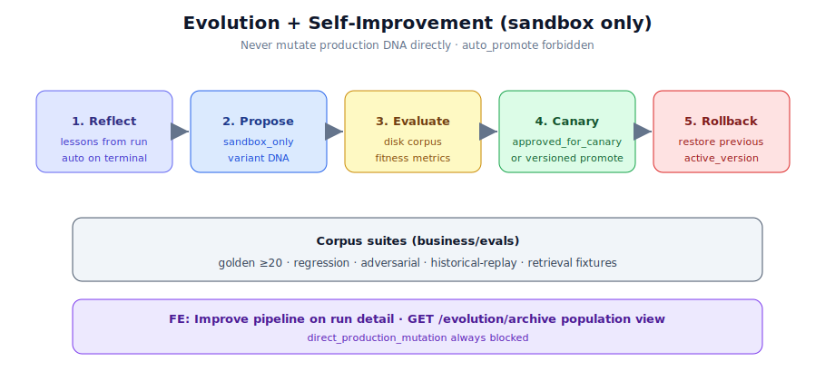

*Figure 9.1 — The twelve-step evolution pipeline runs entirely inside the sandbox. A variant is only
promoted if it passes every promotion requirement shown on the right.*

### 9.2 The Fitness Function

Variants are never scored on subjective preference. Each is scored with an explicit weighted
function:

$$F = w_q Q + w_s S + w_c C + w_e E + w_h H - w_r R - w_l L - w_k K$$

where $Q$ = quality, $S$ = safety, $C$ = compliance, $E$ = efficiency, $H$ = human satisfaction, and
$R$, $L$, $K$ are risk, latency, and cost penalties. For genuinely conflicting objectives the system
uses **Pareto selection** rather than collapsing everything into one scalar.

### 9.3 The Pipeline

1. Observe production / shadow traces.
2. Detect failures, bottlenecks, or opportunities.
3. Generate variants (prompt / workflow / tool-use / role / expert-pattern crossover).
4. Test offline against golden tasks.
5. Run security + adversarial tests.
6. Run compliance checks.
7. Replay on historical cases (simulation).
8. Human review if the risk tier requires it.
9. Canary deploy to a small scope.
10. Monitor metrics.
11. Promote / rollback / retire.
12. Store lessons in evolution memory.

Natural-language reflection is a powerful optimizer here: reflective prompt-evolution methods such as
GEPA show that a *few* trajectories, diagnosed in language, can beat many rounds of scalar-reward
reinforcement learning — a good fit for a data-scarce business setting. These loops always stay
inside the sandbox gates above.

### 9.4 The Promotion Rule

A variant is promoted only if it (1) improves target metrics, (2) does not regress safety or
compliance, (3) passes regression and adversarial tests, (4) has a rollback plan, (5) has complete
audit logs, and (6) has human sign-off when the risk tier requires it. The evolution artifacts are
stored under `business/evolution/` in `workflow-dna/`, `successful-variants/`, `failed-experiments/`,
`mutation-history/`, and `lessons-learned/`. The `business:evolution:check` script enforces that no
promoted production change is implied without a baseline comparison, regression result, adversarial
result, compliance check, rollback plan, and approval record where the risk tier requires it.

---

## 10. Layer 5 — Governance, Risk, and Compliance

Governance anchors to established frameworks rather than inventing a private one:

- **NIST AI RMF (AI 100-1)** — the map/measure/manage risk backbone for trustworthy AI.
- **ISO/IEC 42001** — the world's first AI management system standard, built around the
  Plan-Do-Check-Act methodology for establishing, implementing, maintaining, and continually
  improving an AI management system; it covers risk management, AI system impact assessment,
  lifecycle management, and third-party supplier oversight.
- **EU AI Act** — applies if the system touches EU users, workers, or regulated decisions. The Act
  entered into force on 1 August 2024; prohibited practices and AI-literacy obligations applied from
  2 February 2025, and general-purpose AI model obligations from 2 August 2025. The timeline is
  moving — Annex III high-risk obligations are being postponed from 2 August 2026 to 2 December 2027
  via the Digital Omnibus, though that only takes legal effect upon formal adoption. This matters
  directly because the Act classifies AI used in employment-related decisions — recruitment,
  candidate selection, performance evaluation, task allocation, worker monitoring, promotion, and
  termination — as high-risk. If the swarm ever touches those, expect requirements around risk
  management, data governance, technical documentation, record-keeping, transparency, human
  oversight, accuracy, robustness, cybersecurity, post-market monitoring, and incident reporting.

*(Regulatory summary above is paraphrased for compliance with licensing restrictions; consult the
primary sources cited in `structure.md` for authoritative detail.)*

### 10.1 Autonomy Risk Tiers

Autonomy is earned per workflow, and the ladder has six rungs.

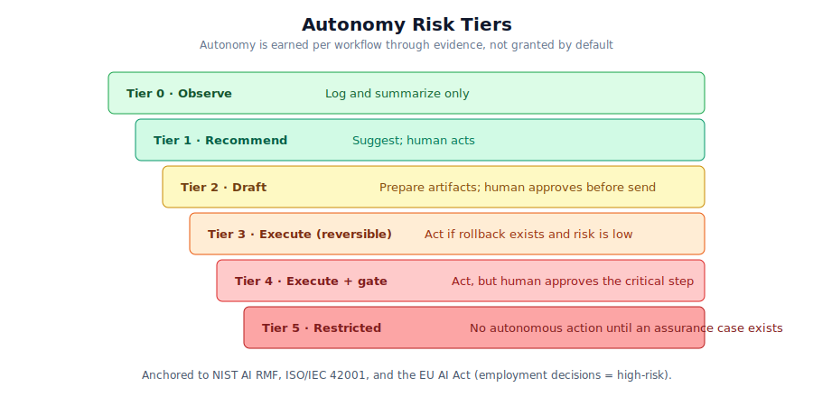

*Figure 10.1 — The autonomy ladder. A workflow begins at Tier 0 and only climbs as it accumulates
evidence; Tier 5 requires a full assurance case before any autonomous action is allowed.*

| Tier | Autonomy | Allowed Behavior |
|---|---|---|
| 0 | Observe | Log and summarize only. |
| 1 | Recommend | Suggest; human acts. |
| 2 | Draft | Prepare artifacts; human approves before send/execute. |
| 3 | Execute (reversible) | Act if rollback exists and risk is low. |
| 4 | Execute + gate | Act, but human approves the critical step. |
| 5 | Restricted | No autonomous action until an assurance case exists. |

### 10.2 Mandatory Artifacts

Governance is document-backed. The mandatory artifacts are: AI inventory, use-case risk tiering,
human-approval policy, audit logs, incident-response plan, rollback plans, data-retention policy,
vendor/model register, tool-permission register, assurance cases, and model cards. The repository
seeds these under `business/governance/` (for example `ai-inventory/`,
`use-case-risk-tiering/risk-tiers.json`, `human-approval-policy/policy.md`, model-card and
assurance-case templates), and the `business:governance` script verifies their presence.

### 10.3 Governance in the Backend

At runtime, governance is enforced by a policy engine in the backend (Chapter 15). Before a workflow
or a step runs, the engine evaluates policies and returns one of: `allow`, `deny`,
`require_approval`, `require_evaluation`, or `require_redaction`. Risk levels are expressed as `low`,
`medium`, `high`, and `critical`, mapping to the tiers above. A high-risk or irreversible action
pauses the run in `waiting_for_approval` until a human decides.

---

## 11. Layer 6 — Security

Agentic systems widen the attack surface far beyond classic application security. Two OWASP
references apply: the **Top 10 for LLM Applications (2025)** for the model layer and the **Top 10 for
Agentic Applications (2026)** for the autonomy layer, whose highlighted threats include Agent
Behavior Hijacking, Tool Misuse and Exploitation, and Identity and Privilege Abuse.

Two design facts anchor the whole security posture. First, **indirect prompt injection** is the key
threat in most agentic systems, and even after alignment and filtering it should be assumed that
injection can still happen — so blast-radius control is critical. Second, **system prompts are not
security controls**; if a secret is in the prompt, it is already gone. Security is therefore enforced
**deterministically, outside the LLM.**

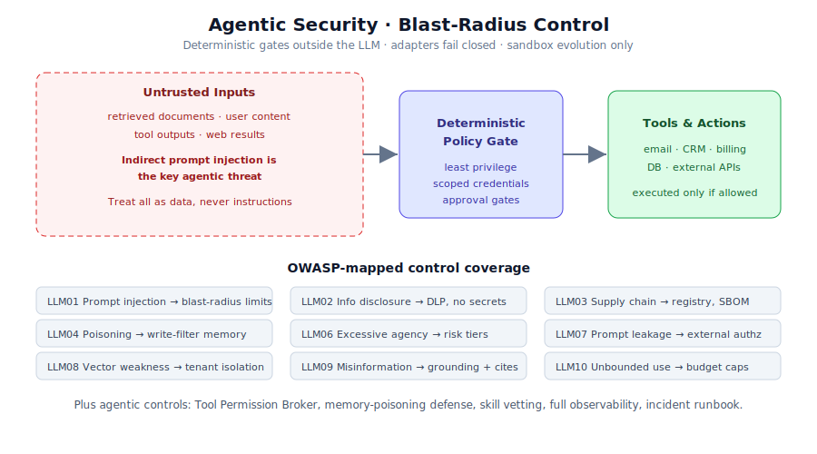

*Figure 11.1 — Untrusted inputs are always treated as data, never as instructions. A deterministic
policy gate — with least privilege, scoped credentials, and approval gates — stands between the model
and any real tool or action. The control matrix maps each control to its OWASP LLM risk.*

### 11.1 The Control Matrix (mapped to OWASP LLM 2025)

| Risk | OWASP | Control |
|---|---|---|
| Prompt injection (esp. indirect) | LLM01 | Treat all retrieved/user content as untrusted; separate instructions from data; blast-radius limits. |
| Sensitive info disclosure | LLM02 | DLP on outputs/logs; secrets never in prompts; retention limits. |
| Supply chain | LLM03 | Model/tool/adapter registry; provenance; dependency + SBOM scanning. |
| Data & model poisoning | LLM04 | Vet fine-tunes/LoRAs; validate retrieval sources; write-filter memory. |
| Improper output handling | LLM05 | Treat model output as untrusted input; sanitize before any execution. |
| Excessive agency | LLM06 | Risk-tiered autonomy; least privilege; approval gates. |
| System prompt leakage | LLM07 | No secrets/roles in prompts; enforce authorization externally. |
| Vector/embedding weaknesses | LLM08 | Tenant isolation on vector stores; poisoned-content detection. |
| Misinformation | LLM09 | Grounding + citations; confidence display; human review on high stakes. |
| Unbounded consumption | LLM10 | Rate limits, timeouts, budget caps ("denial-of-wallet" defense). |

### 11.2 Additional Agentic Controls

Beyond the matrix, five agentic controls apply:

- **Tool Permission Broker** — narrow, temporary, scoped credentials per task.
- **Memory-poisoning defense** — provenance plus human review for high-impact memory writes.
- **Skill/plugin vetting** — third-party agent skills are a live supply-chain vector; scan and pin
  them.
- **Full observability** — one audit trail across model calls, tool calls, and agent-to-agent
  traffic.
- **AI incident response** — a defined runbook for GenAI-specific incidents.

The repository seeds security artifacts under `business/security/` — threat-model and
incident-report templates, a `tool-permission-register.json`, and folders for prompt-injection tests
and red-team results. The `business:security` script scans business artifacts for accidental secrets,
overly broad tool permissions, unsafe tool descriptions, missing human gates for sensitive actions,
and prompt-injection test coverage gaps. It supplements, rather than replaces, the starter-layer
`npm run security` smoke check.

---

## 12. The Evaluation System

Evaluation is the biggest gap in most swarm designs, and here it wraps every other layer. Every
agent, skill, workflow, and prompt must own eight evaluation assets:

1. A golden task set.
2. Regression tests.
3. Adversarial tests.
4. A human-review set.
5. A historical-replay set.
6. A cost/latency benchmark.
7. A business-outcome metric.
8. A safety/compliance score.

Evaluation happens in realistic, multi-step, tool-using environments — the lesson of agent benchmarks
like AgentBench and SWE-bench is that isolated prompt tests do not predict real task performance.

### 12.1 The Evaluation Card

Results are captured in a structured card:

```yaml
evaluation:
  target: "wf_customer_onboarding_v12"
  eval_type: "workflow_regression"
  test_set: "historical_onboarding_cases_q2"
  metrics:
    quality_score: 0.94
    compliance_pass_rate: 0.99
    average_cycle_time_minutes: 38
    escalation_rate: 0.12
    hallucination_rate: 0.01
    unauthorized_tool_attempts: 0
    cost_per_case_usd: 0.42
  result: "pass"
  promotion_decision: "canary_only"
  reviewer: "ops_lead"
```

The repository ships `business/schemas/evaluation-card.schema.json` and an example. The
`business:eval` harness loads evaluation cards, validates the metric fields, and reports
pass/fail/blocked — and it **never promotes a workflow automatically**. The first version runs as a
dry run (`npm run business:eval -- --dry-run`).

Retrieval is evaluated separately from generation on context relevance, answer relevance, and
faithfulness, because a weak retriever silently degrades every downstream agent.

---

## 13. The Agent Roster

The system defines a roster of specialized agents in three groups. Control/meta agents hold
authority; learning agents acquire and curate knowledge; execution/domain agents do the concrete
work.

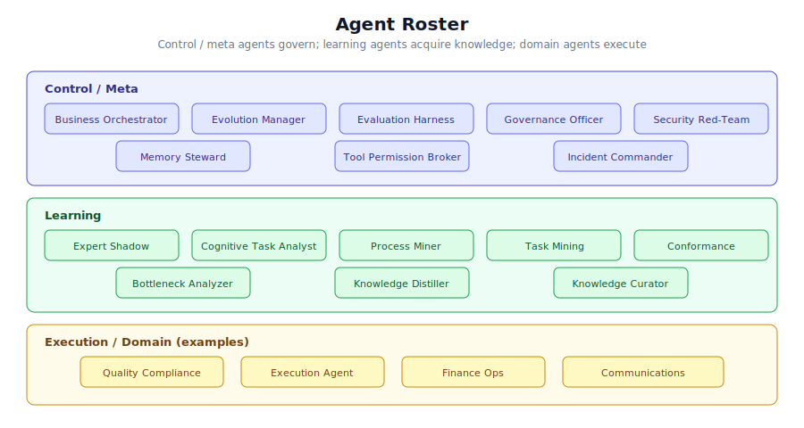

*Figure 13.1 — Control/meta, learning, and execution/domain agents. Each agent document specifies its
purpose, allowed and forbidden actions, risk-tier behavior, required evidence, memory rules, human
approval triggers, and validation commands.*

**Control / Meta**

| Agent | Purpose |
|---|---|
| Business Orchestrator | Routes work, manages state, owns the global objective. |
| Evolution Manager | Proposes and tests variants (sandbox only). |
| Evaluation Harness | Runs golden/regression/adversarial/replay suites. |
| Governance Officer | Applies risk tiers, approval rules, audit requirements. |
| Security Red-Team | Tests injection, tool misuse, leakage, unsafe autonomy. |
| Memory Steward | Maintains memory quality, provenance, expiration. |
| Tool Permission Broker | Grants scoped, temporary tool access. |
| Incident Commander | Handles failures, rollbacks, postmortems. |

**Learning**

| Agent | Purpose |
|---|---|
| Expert Shadow | Observes experts (with permission). |
| Cognitive Task Analyst | Turns interviews into decision cards + heuristics. |
| Process Miner | Discovers workflows from logs. |
| Task Mining Agent | Observes UI/human-level steps where permitted. |
| Conformance Agent | Compares actual work to documented SOPs. |
| Bottleneck Analyzer | Finds delays, loops, rework, handoff failures. |
| Causal Improvement Agent | Proposes interventions likely to improve outcomes. |
| Knowledge Distiller | Converts raw material into rules/skills/playbooks. |
| Knowledge Curator | Validates, deduplicates, organizes. |

**Execution / Domain (examples)**: Quality Compliance Agent, Execution Agent, Finance Ops Agent, and
Communications Agent.

Each agent has a document under `.trae/agents/` describing its purpose, allowed actions, forbidden
actions, risk-tier behavior, required evidence, memory read/write rules, human-approval triggers, and
validation commands.

---

## 14. Human–AI Interaction Rules

Synthesizing more than twenty years of guidance (Microsoft's Guidelines for Human-AI Interaction),
the swarm must: show confidence and uncertainty; explain the evidence used; preview actions before
executing them; make correction one click away; allow override; store rejected suggestions as
training data; ask for clarification when context is thin; and never hide uncertainty behind
confident language.

These rules are not aspirational — they are wired into the product surface. The frontend
(Chapter 16) shows run status, evidence, and approval checkpoints; rejected suggestions become
training signal; and destructive actions are always explicit and confirmed.

---

## 15. The Backend API Server

The backend is not a thin proxy. It is the **governed intelligence and control layer**. The frontend
never touches agents, databases, workflow engines, LLM providers, vector stores, or internal tools
directly — everything goes through the API.

> Frontend = user experience layer  
> Backend API = governed intelligence and control layer  
> Agents = specialized workers  
> Workflows = structured business execution paths  
> Governance = risk and approval control  
> Audit = trust and traceability layer

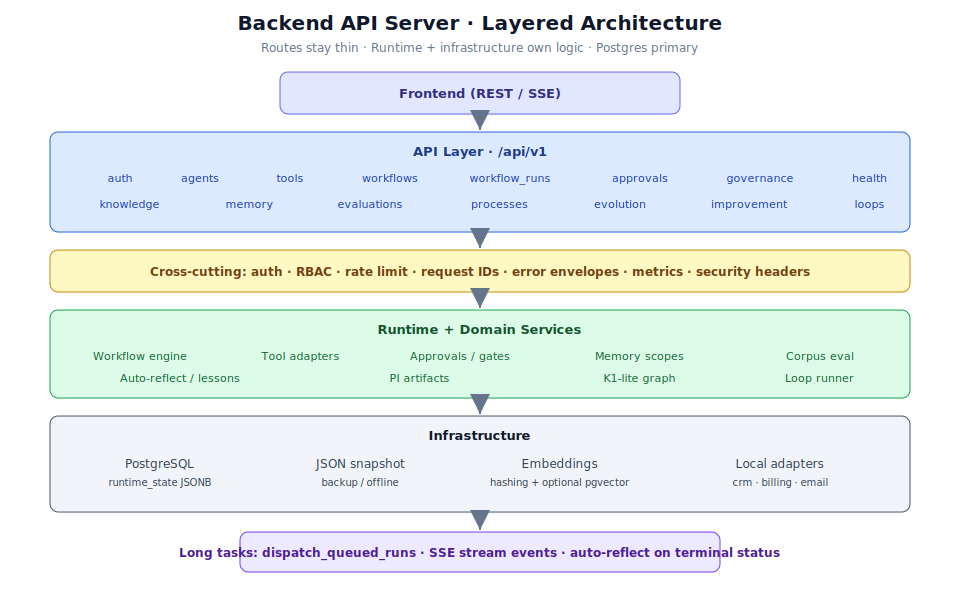

*Figure 15.1 — The four layers: API routes (thin), service + domain logic (rich), and infrastructure
adapters (provider-agnostic). Cross-cutting middleware handles auth, RBAC, rate limits, idempotency,
request IDs, error envelopes, metrics, and security headers.*

### 15.1 Technology Stack

```text
Backend Framework: FastAPI (Python)
Database: PostgreSQL
Vector Search: pgvector / Qdrant / Weaviate / Pinecone
Queue: Redis + Celery/RQ/Arq, or Temporal
Cache: Redis
Object Storage: S3-compatible
LLM Provider Layer: provider-agnostic abstraction
Auth: JWT / OAuth2 / SSO-ready
API Style: REST + SSE for streaming
Documentation: OpenAPI (auto-generated)
Containerization: none (no Docker)
```

**As-built (product bar ~100):** FastAPI + **Postgres** as the primary control-plane store
(`runtime_state` JSONB), JSON file snapshots for backup/seed, **PBKDF2** password hashing,
organization-scoped RBAC, request IDs, metrics, and in-process run advancement with **SSE**
(queue/worker backends remain architecture-compatible). Tool execution uses local adapters that
persist durable `tool_effects`. Evolution and improvement APIs force variants to stay
`sandbox_only` until gated canary/promote. Multi-worker Temporal, always-on Redis/vector mesh at
scale, and live external CRM/email SaaS adapters are product-bar **non-goals**.

### 15.2 Six Core Design Principles

1. **API-first** — all functionality is accessible through documented, versioned APIs.
2. **Secure by default** — every endpoint requires authentication unless explicitly public; every
   sensitive operation checks authorization; every execution is auditable.
3. **Governance-first** — the backend decides whether an action is allowed *before* an agent or
   workflow executes, evaluating user permissions, workflow permissions, data-access permissions,
   risk level, approval requirements, tool-access permissions, and policy compliance.
4. **Human-in-the-loop** — high-risk actions (sending external emails, modifying customer records,
   deleting data, publishing content, approving financial actions, changing workflow definitions or
   governance policies) pause and request human approval.
5. **Audit everything** — every important action generates an audit event; audit logs are
   append-only.
6. **Workers for long tasks** — agent workflows run through a queue, not inside API request threads:
   `Frontend → Backend API → Queue → Worker → Database → stream updates to frontend`.

### 15.3 API Routes

All routes live under `/api/v1/`. The full surface covers: `auth`, `users`, `organizations`,
`agents`, `tools`, `workflows`, `workflow_runs` (including **cancel / retry / pause / resume /
expire**), `approvals`, `governance`, `knowledge`, `memory`, `evaluations`, `audit_logs`,
`processes`, `evolution`, `improvement`, `loops`, `settings`, and `health` (including `/live` and
`/ready` sub-routes). Route files are thin — they validate inputs, call services, and return
responses.

**SDD:** Backend sub-functions are specified under `planning/backend/` as **BE-01…BE-24**
(`requirements.md` / `design.md` / `tasks.md` v2.2 with deliverable code paths). Traceability:
`planning/backend/TASK_TO_CODE_TRACEABILITY.md`. Product-bar gap analysis:
`planning/gap_analysis_for_backend.md` (**100/100**).

### 15.4 Authentication and Authorization

Authentication supports JWT access tokens with refresh-token rotation, API keys for service
integrations, and optional OAuth2/OIDC. Roles include Owner, Admin, Manager, Operator, Reviewer,
Viewer, and ServiceAccount. Permissions are expressed as `resource:action` pairs (e.g.
`workflows:run`, `approvals:approve`). The authorization system is designed to support future ABAC
rules such as `user.department == resource.department` or `workflow.risk_level <= user.max_risk_level`.

Every database query is scoped to `organization_id` — a user from organization A can never access
organization B data. Sensitive resources enforce additional department restrictions, ACL rules, role
permissions, and policy checks.

### 15.5 The Data Model

Twenty core entities: `Organization`, `User`, `Role`, `Permission`, `APIKey`, `Agent`, `Tool`,
`Workflow`, `WorkflowVersion`, `WorkflowRun`, `WorkflowRunStep`, `ApprovalRequest`,
`GovernancePolicy`, `KnowledgeDocument`, `KnowledgeChunk`, `MemoryItem`, `EvaluationRun`,
`AuditLog`, `ProcessMetric`, and `Notification`. Every entity carries `organization_id` for tenant
isolation, even in the current single-tenant build, to make multi-tenancy straightforward later.

Key entity relationships:

- A `Workflow` has many `WorkflowVersion` records; only one is `current_version_id` at a time.
  Versions are immutable after activation.
- A `WorkflowRun` records the exact `workflow_version_id` executed, not just the workflow ID, so
  results are always reproducible.
- Each `WorkflowRun` has many `WorkflowRunStep` records — one per step in the DNA definition.
- An `ApprovalRequest` is tied to a specific `workflow_run_id` and optionally a
  `workflow_run_step_id`.
- A `KnowledgeDocument` has many `KnowledgeChunk` records that hold chunked content and vector
  embedding references.
- A `MemoryItem` carries a `scope` field (`user`, `team`, `department`, `organization`, `agent`,
  `workflow`) that the memory-access policy evaluates on every read.

### 15.6 Workflow Run Lifecycle

The full lifecycle from API call to completion:

```text
1. POST /api/v1/workflows/{id}/runs with Idempotency-Key header
2. Backend validates permissions and governance — deny or require_approval returns immediately
3. WorkflowRun created with status: queued
4. Enqueued to worker queue
5. Worker loads run → marks running
6. For each step:
   a. Check cancellation signal
   b. Check permissions + governance (deny / require_approval)
   c. If approval required → create ApprovalRequest → status: waiting_for_approval
   d. SSE event: approval.requested streamed to frontend
   e. Reviewer approves via POST /approvals/{id}/approve
   f. Worker resumes → executes agent / tool / evaluation / condition
   g. Step output persisted → WorkflowRunStep updated
   h. SSE event: step.completed streamed
   i. Audit log entry written
7. Final evaluation checks run
8. Output persisted → WorkflowRun status: completed
9. SSE event: run.completed streamed
```

Idempotency keys prevent duplicate runs: if the same user sends the same key for the same workflow,
the existing run is returned instead of creating a new one.

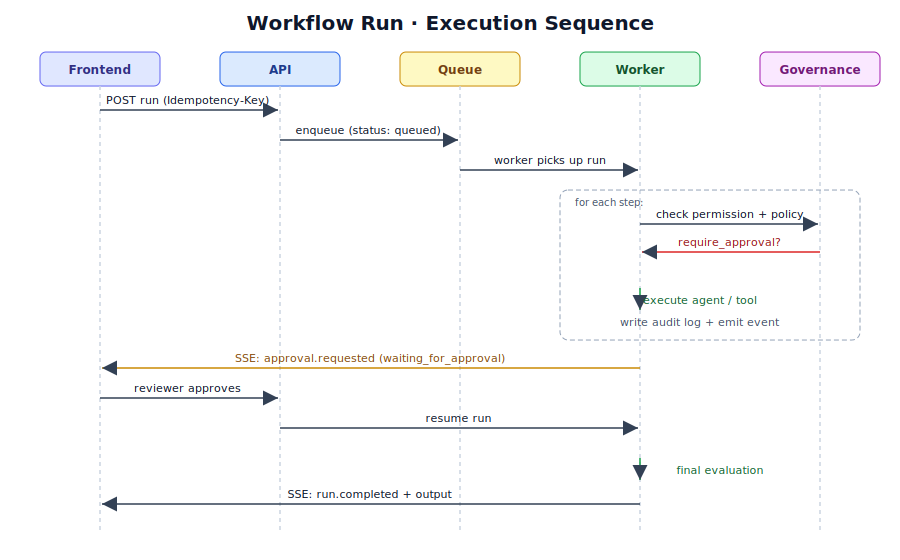

*Figure 15.2 — The complete workflow run sequence, showing API, queue, worker, governance, approval
pause, and SSE streaming back to the frontend.*

### 15.7 Knowledge Ingestion Pipeline

```text
1. User uploads document → stored in object storage
2. KnowledgeDocument created (status: uploaded)
3. Indexing job enqueued (status: processing)
4. Worker: extract text → chunk → embed → store vectors
5. KnowledgeDocument status: indexed
```

Retrieval enforces organization scoping, department restrictions, sensitivity levels, and ACL rules
before returning any results. Every sensitive knowledge access writes an audit event.

### 15.8 Streaming with Server-Sent Events

The backend emits SSE events at `GET /api/v1/workflow-runs/{id}/stream`. Event types include:
`run.started`, `run.status_changed`, `step.started`, `step.completed`, `step.failed`,
`approval.requested`, `approval.approved`, `approval.rejected`, `evaluation.completed`,
`run.completed`, `run.failed`, and `log.message`. Each event carries `workflow_run_id`, `step_id`
(where applicable), `status`, `message`, and `timestamp`.

### 15.9 Security Controls

The backend implements HTTPS in production, password hashing (**PBKDF2** as-built), JWT expiration
and refresh rotation, API key hashing, per-endpoint rate limiting (in-memory, configurable),
file-upload validation, structured error envelopes with request IDs (never leaking internal stack
traces), security headers (Content-Security-Policy, X-Frame-Options, X-Content-Type-Options,
Strict-Transport-Security), and CORS restrictions. Prompt-injection protection separates trusted
system instructions from untrusted retrieved content, prevents retrieved text from granting tool
permissions, and requires policy checks before every tool call. Tool execution uses **local
adapters** that write durable `tool_effects` (fail-closed); live external CRM/email SaaS adapters
are a product-bar **non-goal**.

### 15.10 Observability

Every log record includes `timestamp`, `request_id`, `organization_id` (where available),
`user_id`, `action`, `status`, `duration`, and error code. The `/api/v1/health/live` route checks
whether the API process is running; `/api/v1/health/ready` checks database, Redis, queue, vector
store, and object storage. A protected metrics endpoint aggregates request count, latency, error
rate, workflow run duration, workflow failure rate, queue depth, approval wait time, LLM token
usage, and LLM cost.

### 15.11 Implementation Phases

The backend was built through phased delivery aligned to BE-01…24: project setup and health →
authentication and users/orgs (including invitations) → audit logging → agent and tool registry →
workflow definitions → workflow run engine (lifecycle + SSE) → governance and approvals → knowledge
and memory → evaluation → process intelligence → evolution sandbox and self-improvement → DNA
validators → hardening and production readiness. Each phase has explicit acceptance criteria checked
in `status.md` and `planning/backend/*/tasks.md`.

---

## 16. The Frontend Application

The frontend is a professional enterprise SaaS **ops console**. It must not look like a generic AI
demo. It should communicate trust, reliability, operational clarity, security, professionalism,
speed, control, and observability — at all times. The frontend is presentation and interaction
only: **authorization, execution, and governance remain on the backend.**

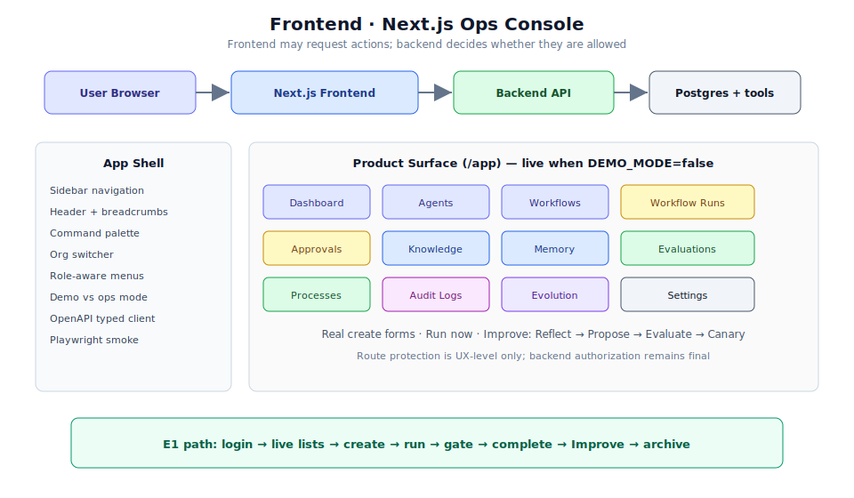

*Figure 16.1 — The Next.js frontend sits between the browser and the backend API. The app shell
(sidebar, header, command palette, org switcher) wraps all authenticated pages. The full product
surface covers 14 route groups.*

### 16.1 Technology Stack

```text
Framework:      Next.js (App Router) + React + TypeScript
Styling:        Tailwind CSS + design tokens
Forms:          React Hook Form + Zod
API client:     Typed client generated from backend OpenAPI schema
Real-time:      Server-Sent Events (SSE) for workflow run timelines
Testing:        Playwright (e2e) + Vitest/Jest (unit) + React Testing Library + axe
Package manager: pnpm
Deployment:     pnpm build + pnpm start (no Docker)
```

The OpenDesign MCP requirement mandates that before any major page layout is created or significantly
changed, Trae calls the `opendesign` MCP server to search design references, extract tokens, and
produce a layout plan. In the current build the OpenDesign MCP was unavailable, so the fallback
workflow was approved and documented in `frontend/docs/design/open-design-reference.md`.

### 16.2 Design System

Token categories cover: Color, Typography, Spacing, Radii, Shadows, Borders, Surfaces, Status
colors, Motion, Z-index, and Breakpoints. Token files are at `frontend/src/design/tokens.ts` and
`frontend/src/design/theme.ts`. Status colors are strictly semantic: Success, Warning, Error, Info,
Neutral, Running, Pending, Paused, Cancelled, Draft, and Published — applied consistently across all
run statuses, agent statuses, and tool statuses.

Monospace typography is used for IDs, logs, API keys, JSON snippets, tool-call payloads, and trace
IDs. Motion is subtle — only for drawer open/close, command palette, toasts, skeleton loading,
status transitions, and timeline updates.

### 16.3 Rendering Strategy

The app uses a hybrid approach. Server components handle static layouts, initial data fetch (where
session cookies can be passed securely), metadata, and basic page composition. Client components
handle the command palette, real-time run timeline, modals, drawers, data tables with filters, the
workflow builder, and the logs viewer.

Route protection is applied at the UX level only: unauthenticated users are redirected to `/login`;
users lacking organization access are redirected to an access-denied page; users lacking permission
for a specific route see a `403 Access Denied`. Backend authorization remains the final authority —
a hidden button is never treated as a security control.

### 16.4 Information Architecture

Public routes: `/`, `/login`, `/register`, `/forgot-password`, `/reset-password`, `/accept-invite`.

Authenticated routes under `/app`:

| Group | Routes |
|---|---|
| Main | `/app` (dashboard), `/app/agents`, `/app/agents/new`, `/app/agents/[agentId]` |
| Tools | `/app/tools`, `/app/tools/[toolId]` |
| Workflows | `/app/workflows`, `/app/workflows/new`, `/app/workflows/[workflowId]` |
| Runs | `/app/workflow-runs/[runId]` |
| Approvals | `/app/approvals`, `/app/approvals/[approvalId]` |
| Knowledge | `/app/knowledge`, `/app/knowledge/sources`, `/app/knowledge/documents`, `/app/knowledge/search` |
| Memory | `/app/memory`, `/app/memory/[memoryId]` |
| Quality | `/app/evaluations`, `/app/processes`, **`/app/evolution`** |
| Security | `/app/audit-logs` |
| Admin | `/app/settings/*` (organization, users, roles, billing, api-keys, security, integrations, profile) |

Sidebar navigation is grouped as: Main (Dashboard, Agents, Workflows, Approvals) → Data (Knowledge,
Memory) → Quality (Evaluations, Processes, **Evolution**) → Security (Audit Logs) → Admin (Settings).

The global header carries breadcrumbs, a global search or command button, an environment indicator,
an organization switcher, notifications, and a user menu. The command palette (`Cmd/Ctrl + K`)
offers quick actions: create agent, create workflow, search knowledge, open recent workflow run,
review approvals, invite user, open API keys, open audit logs, open security settings, start
evaluation, add knowledge source.

### 16.5 Key Pages in Detail

**Dashboard (`/app`)** — operational overview: agent health cards, workflow run activity, pending
approvals, knowledge base health, evaluation summary, recent audit events, process status, and quick
actions. If no agents or workflows exist, an onboarding checklist (create agent → add tool → add
knowledge → create workflow → run → review) is shown.

**Workflow Run Detail (`/app/workflow-runs/[runId]`)** — the most important page. Connects to the
SSE stream on load (`WorkflowRunConsole`). Shows a live timeline, step details, live logs, tool
calls, input/output payloads, approval waiting state, error details (with `request_id` when present),
and operator actions: **cancel, retry, pause, resume, expire** via backend lifecycle routes. Run
statuses include Queued, Running, Waiting for Approval, **Paused**, Succeeded, Failed, Cancelled,
**Expired**, Timed Out, Partially Completed. The same page hosts the **Improve** panel:
Reflect → Propose → Evaluate → Canary (backend sandbox APIs only; no client production DNA writes).

**Approvals (`/app/approvals`)** — reviewers see pending approval requests with risk level, context,
and the workflow run that triggered them. Approve or reject with an optional decision note. Never
auto-approve in the UI.

**Evolution (`/app/evolution`)** — sandbox population / fitness archive; evaluate and canary/promote
actions call backend evolution APIs only.

**Knowledge (`/app/knowledge`)** — upload documents, monitor indexing status, search the indexed
corpus, browse by source type, and view document chunks and sensitivity level.

**Audit Logs (`/app/audit-logs`)** — append-only event stream searchable by actor, action, resource
type, resource ID, and time range. The frontend is **read-only** for system-of-record audit creation.

**Accept invite (`/accept-invite`)** — public form posts `POST /api/v1/users/invitations/accept`
(`token`, `password`, optional `name`); on success stores session and enters `/app`.

**Settings — users & organization** — `UserAdminPanel` invites users (`POST /users/invitations`)
and enable/disable via `PATCH /users/{id}`; `OrganizationSettingsForm` loads and
`PATCH /organizations/{id}` for name/slug/status.

### 16.6 Role-Aware UI

Roles: Owner, Admin, Developer, Operator, Reviewer, Viewer, Billing Manager, Security Auditor.
The frontend hides actions users cannot perform, shows disabled states with explanations for
restricted actions, and displays access-denied pages for forbidden routes. It never relies on hidden
UI as a security control — that responsibility belongs to the backend.

### 16.7 SDD and validation status

**SDD:** Frontend sub-functions live under `planning/frontend/` as **FE-01…FE-20**
(`requirements.md` / `design.md` v2.1 / `tasks.md` v2.3). Indexes:
`planning/frontend/README.md`, `TASK_TO_CODE_TRACEABILITY.md`,
`DESIGN_QUALITY_SCORE.md`, `TASKS_QUALITY_SCORE.md`. Gap analysis:
`planning/gap_analysis_for_frontend.md` (**100/100** product bar).

**Ops profile:** `NEXT_PUBLIC_DEMO_MODE=false` against a live FastAPI backend and Postgres is the
product-truth path; demo mode remains available for UI-only preview.

The frontend was validated with:

```bash
cd frontend && pnpm install   # pass
cd frontend && pnpm lint      # pass (0 errors / 0 warnings after useWatch fix)
cd frontend && pnpm typecheck # pass
cd frontend && pnpm test      # pass (unit suite)
cd frontend && pnpm build     # pass
```

---

## 17. Repository Structure and Bootstrap

The repository is a three-layer cake: the **starter layer** (environment contract for Trae IDE +
Grok Build dual harness), the **business layer** (schemas, validators, governance, security,
evolution), and the **implementation layer** (backend + frontend), plus **planning/** SDD packs.

### 17.1 Top-Level Layout

```text
generic-swarm-ops/
├── starter.md, structure.md, structure_hk.md, tasks.md, status.md
├── backend.md, backend_hk.md, frontend.md, frontend_hk.md
├── package.json, README.md, AGENTS.md
├── .trae/          (Trae — generated by npm run sync)
├── .grok/          (Grok Build — generated/synced dual harness)
├── sources/        (manifest.json, docs-manifest.json, source-lock.json)
├── external/       (sources/ git-ignored — downloaded repos never committed)
├── scripts/        (starter + generators for planning/* SDD packs)
├── rules/, skills/, hooks/, mcp-configs/
├── business/       (PI, knowledge, experts, evals, governance, security, evolution, …)
├── backend/        (FastAPI app/ + unit & e2e tests)
├── frontend/       (Next.js src/, docs/design/, tests/unit/, e2e/)
├── planning/       (structure/ · backend/ · frontend/ SDD + gap_analysis_for_*.md)
├── docs/, examples/, tests/, memory/, reviews/, suggestions/
└── book/           (book.md, book_hk.md, book.*.md handbooks, scripts, assets/)
```

### 17.2 The Bootstrap Pipeline

`npm run bootstrap` orchestrates the full validation sequence. Every required step must pass or the
bootstrap fails.

```text
doctor
→ create required directories
→ validate sources/manifest.json
→ clone/update all enabled GitHub sources
→ write sources/source-lock.json
→ generate docs/source-audit.md
→ run security smoke checks
→ run sync dry-run (generate Trae outputs)
→ run business initialization
→ run business validation
→ run business governance check
→ run business security check
→ run business evolution sandbox check
→ run tests (Node built-in test runner)
```

Optional source failures (priority: optional) are recorded and reported without failing the
bootstrap unless strict mode is enabled. Required source failures are fatal.

### 17.3 Source Download and Audit

`sources/manifest.json` lists 27 upstream repositories — official Anthropic/OpenAI/Google repos, MCP
servers, agent-skills references, Karpathy-style behavior rules, memory architectures, and
best-practice/discovery lists. Every source carries a `priority` (`required` / `optional`), `tier`
(core, official, standard, behavior-rules, memory, skills, best-practices, discovery, security,
cursor, agents, historical), `quarantine` flag, and `import_policy` (curated-only, reference-only,
never-import).

The downloader (`scripts/source-download.mjs`) clones repos shallowly into `external/sources/` and
records resolved URL, commit, branch, last-commit metadata, license files, package files, quarantine
status, and import policy in `sources/source-lock.json`. It never runs install scripts, `npm
install`, `curl | bash`, hooks, or copies repo content into active Trae configuration.

The auditor (`scripts/source-audit.mjs`) marks a source unsafe for automatic import if it has no
license, contains remote-executing install scripts, is archived, requires credentials, modifies
global agent configuration, or ships MCP servers needing broad filesystem/network access. The first
audit pass marks most repositories as "bulk import rejected until human review."

### 17.4 Validation Commands

Every validation command passed in the current build (recorded in `status.md`):

```bash
npm run doctor                      # pass
npm run sources:download            # pass (26 succeeded, 0 failed, 0 skipped)
npm run sources:audit               # pass
npm run security                    # pass
npm run sync -- --dry-run           # pass
npm run business:init               # pass
npm run business:validate           # pass
npm run business:governance         # pass
npm run business:security           # pass
npm run business:evolution:check    # pass
npm run business:eval -- --dry-run  # pass
npm run test                        # pass
npm run bootstrap                   # pass

python -m compileall backend/app                                   # pass
python -m unittest discover -s backend/app/tests/unit -p "test_*.py" # pass
python -c "import fastapi; print(fastapi.__version__)"             # pass
python -c "import sys; sys.path.insert(0, 'backend'); from app.main import app; print({'route_count': len(app.routes), 'title': app.title})" # pass
python -c "import sys; sys.path.insert(0, 'backend'); from app.runtime import runtime; user = runtime.authenticate('admin-token'); run = runtime.start_workflow_run('wf_customer_onboarding_v12', user, {'case_id': 'smoke_case'}); print({'run_status': run['status'], 'approval_request_id': run['approval_request_id']})" # pass

cd frontend && pnpm install     # pass
cd frontend && pnpm lint        # pass (0 errors / 0 warnings)
cd frontend && pnpm typecheck   # pass
cd frontend && pnpm test        # pass
cd frontend && pnpm build       # pass
```

---

## 18. Implementation Status

The repository has closed the **product bar toward mark 100** (`plan_to_mark_100.md` P0–P5) with
E1 operator-path evidence, full backend/frontend SDD packs, and gap analyses at **100/100** for
structure, backend, and frontend product bars.

### 18.1 Current Phase

**Product bar complete** (scorecard 100/100). E1 API path **PASS**. Self-improvement + Loop
Engineering + K1-lite knowledge orchestration **shipped**. Frontend residual admin/lifecycle wiring
(accept-invite, pause/resume/expire, user invite/disable, org PATCH) **shipped**.

### 18.2 What Was Built

- Starter + dual harness: Trae (`.trae/`) and Grok Build (`.grok/`) via `npm run sync`.
- Business OS tree under `business/` with schemas, evals (≥20 golden), governance (inventory, model
  card, tier-4 assurance case), security, evolution, and PI artifact folders.
- FastAPI control plane with **Postgres primary store** (`runtime_state` JSONB), JSON snapshot backup,
  PBKDF2 auth, RBAC, rate limits, request IDs, metrics; invitations + org PATCH + run lifecycle APIs.
- **Real tool adapters** writing durable `tool_effects` and audit `tool.executed` events.
- Workflow DNA execution with tool allow-lists, memory scopes, human gates, eval `block_on_fail`.
- Process intelligence: event ingest → summary + disk artifacts (discovered / conformance /
  bottlenecks).
- Evolution: disk corpus sandbox eval, fitness metrics, canary, versioned promote, rollback, archive;
  variants remain **`sandbox_only`** until gated promotion.
- Self-improvement: auto-reflect, lesson library, auto-propose `sandbox_only` variants, Loop DNA
  runner, optional LLM critic, skill sandbox (no host code self-mod).
- Knowledge: Tier-0 keyword + hashing embeddings + mandatory provenance; Tier-1 entity multi-hop;
  K1-lite graph extract/operators; Cypher/JSON federation export.
- Next.js ops console: live mode, real create forms, OpenAPI types, Run now, Improve pipeline,
  `/app/evolution` archive, accept-invite live accept, user admin invite/disable, org settings PATCH,
  run cancel/retry/pause/resume/expire, lint clean (useWatch), unit + build green.
- **SDD packs:** `planning/structure/` (01–17), `planning/backend/` (BE-01…24),
  `planning/frontend/` (FE-01…20) with task→code indexes.
- **Gap analyses:** `planning/gap_analysis_for_structure.md`, `…_backend.md`, `…_frontend.md`
  (each product-bar **100/100**).
- Verification: unit/e2e suites, `mark_100_verification.md`, `reviews/e1_operator_checklist.md`.

### 18.3 Current Blockers

None for the product bar. Optional UI dogfood and PR merge remain process steps, not product gaps.

### 18.4 Next Steps (non-goals of mark 100)

- Live external CRM/email adapters (local adapters remain default).
- Full LightRAG / Neo4j production mesh; real embedding models + pgvector at scale.
- Playwright CI with always-on servers; DGM-style host code self-rewrite remains **out of scope**.
- Continue domain content growth under `business/` with provenance.
- Optional hygiene: re-run `pnpm api:generate` after backend OpenAPI schema changes.

---

## 19. End-to-End Walkthrough: Onboarding a Customer

This chapter traces a single customer-onboarding request from arrival through every layer, showing
what happens at each stage, which agents are involved, what checks run, and where humans enter the
loop.

### 19.1 The Trigger

A signed contract arrives via the intake endpoint. The request carries a signed PDF, the customer
profile, and billing details:

```json
POST /api/v1/workflows/wf_customer_onboarding_v12/runs
{
  "inputs": {
    "signed_contract": "contract_abc123.pdf",
    "customer_profile": {
      "company_name": "Acme Corp",
      "industry": "manufacturing",
      "employee_count": 850,
      "annual_revenue": 45000000
    },
    "billing_details": {
      "billing_contact": "finance@acmecorp.com",
      "payment_terms": "net_30",
      "currency": "USD"
    }
  }
}
```

The `Idempotency-Key` header ensures that a network retry does not create duplicate onboarding
attempts.

### 19.2 Intake and Risk Classification

The **Intake + Risk Router** receives the request and runs a classification pass:

1. Parse the incoming payload.
2. Check the customer profile against known risk indicators (industry, jurisdiction, size,
   regulatory exposure).
3. Assign a risk tier: `low`, `medium`, `high`, or `critical`.
4. Log the classification decision.

For Acme Corp, the router classifies the request as `medium` risk: the company is an established
manufacturing firm in a standard jurisdiction, with no regulatory flags and a moderate contract
value. The risk tier is written to the audit log and attached to the workflow-run record.

### 19.3 Orchestrator Handoff

The **Business Orchestrator** receives the classified request and loads the Workflow DNA for
`wf_customer_onboarding_v12`. The orchestrator:

1. Verifies preconditions: contract status is `signed`, and the customer risk score is below the
   threshold.
2. Initializes a new `WorkflowRun` record with status `queued`.
3. Enqueues the run to the worker queue.
4. Returns the run ID to the caller with a streaming URL.

### 19.4 Step-by-Step Execution

The worker picks up the run and begins executing the DNA steps.

**Step 1: Verify Contract**

- Agent: `quality_compliance_agent`
- Tools: `contract_parser`, `policy_retriever`
- Actions:
  - Parse the signed PDF and extract key terms.
  - Retrieve contract rules from the knowledge base (Tier 0 vector search).
  - Check for non-standard clauses, unusual liability terms, and missing sections.
  - Compare the contract against the Decision Requirement Cards in
    `business/experts/decision-requirement-cards/`.
- Outcome: The contract contains a standard liability clause with no red flags. The agent records
  a confidence score of `0.91` and logs the verification decision.
- Memory writes: Event log entry, decision memory record.

**Step 2: Create Customer Record**

- Agent: `execution_agent`
- Tool: `crm`
- Actions:
  - Create a new customer record in the CRM system.
  - Link the signed contract to the customer profile.
  - Set the customer status to `onboarding_in_progress`.
- Outcome: Customer record `CUST-2026-7842` created successfully.
- Memory writes: Event log entry, semantic memory update (customer exists).
- Guardrail check: This action is reversible (the record can be disabled), so no human approval
  is required for a medium-risk customer.

**Step 3: Configure Billing**

- Agent: `finance_ops_agent`
- Tool: `billing_system`
- Actions:
  - Create a billing account with the provided payment terms.
  - Generate an initial invoice schedule.
  - Configure tax settings based on the customer jurisdiction.
- Outcome: Billing account `BA-2026-3291` configured with net-30 terms and USD currency.
- Memory writes: Event log entry, procedural memory (billing configuration process).

**Step 4: Send Welcome Packet**

- Agent: `communications_agent`
- Tool: `email`
- Actions:
  - Retrieve the welcome packet template from `business/distilled/playbooks/`.
  - Personalize the email with customer-specific details.
  - Queue the email for delivery.
- Guardrail check: Sending an external email is an irreversible action. The guardrails specify
  `human_approval_required_if: tool_action_is_irreversible == true`. The workflow pauses in
  `waiting_for_approval`.
- Memory writes: Event log entry, approval request creation.

### 19.5 The Human Gate

An approval request is created:

```yaml
approval_request:
  id: "apr_20260708_welcome_001"
  workflow_run_id: "wr_20260708_onboarding_001"
  step_id: "send_welcome_packet"
  risk_tier: "medium"
  context:
    customer_name: "Acme Corp"
    email_recipient: "contact@acmecorp.com"
    email_subject: "Welcome to Our Platform"
    preview_url: "/api/v1/approvals/apr_20260708_welcome_001/preview"
  created_at: "2026-07-08T14:30:00Z"
  status: "pending"
```

The assigned reviewer receives a notification. The reviewer:

1. Opens the approval page in the frontend.
2. Reviews the customer profile, contract verification results, and the draft welcome email.
3. Clicks **Approve** with an optional note: "Standard welcome packet, looks good."

The worker resumes, sends the email, and marks the step as completed.

### 19.6 Verification and Completion

After all steps complete, the orchestrator runs the verification checks:

- ✅ CRM record created
- ✅ Billing config validated
- ✅ Welcome packet sent
- ✅ Audit log complete

The workflow run is marked `completed`. The final output is written:

```json
{
  "status": "completed",
  "customer_id": "CUST-2026-7842",
  "billing_account_id": "BA-2026-3291",
  "welcome_email_sent": true,
  "completed_at": "2026-07-08T14:45:00Z",
  "total_cycle_time_minutes": 15
}
```

### 19.7 Evaluation and Memory

The evaluation harness runs the completed run against the regression test suite:

- Quality score: `0.94`
- Compliance pass rate: `1.0`
- Cycle time: `15 minutes` (below the 30-minute target)
- Human escalation rate: `0.25` (one approval for four steps)

All metrics fall within acceptable ranges. The evaluation result is stored in
`business/evals/benchmark-results/`.

Memory is updated:

- **Event memory**: Full audit trail of every action.
- **Semantic memory**: "Acme Corp is an active customer in manufacturing."
- **Procedural memory**: The onboarding workflow completed successfully with one human gate.
- **Decision memory**: The reviewer approved the welcome email with a standard note.

### 19.8 Evolution Consideration

The evolution sandbox observes the completed run. The cycle time was 15 minutes — well below the
target. No bottlenecks were detected. The workflow is performing within acceptable parameters, so no
variant is proposed.

If the cycle time had been significantly above target, or if the human escalation rate had been
unusually high, the evolution engine might propose a variant that pre-approves standard welcome
emails for low-risk customers. That variant would then enter the sandbox pipeline: generate, test,
run adversarial checks, compare to baseline, and only promote after human sign-off.

---

## 20. How To: Common Tasks

This chapter provides practical recipes for the most common operations.

### 20.1 Add a New Workflow

1. Create a Workflow DNA file in `business/evolution/workflow-dna/`:

   ```yaml
   workflow_dna:
     id: "wf_invoice_processing_v1"
     name: "Invoice Processing"
     domain: "finance"
     objective: "Process incoming invoices with appropriate approvals."
     owner: "finance_ops_agent"
     version: "1.0"
     inputs: ["invoice_document", "vendor_profile"]
     preconditions:
       - "invoice_format == valid"
     steps:
       - id: "extract_invoice_data"
         agent: "finance_ops_agent"
         tools: ["invoice_parser"]
       - id: "match_purchase_order"
         agent: "finance_ops_agent"
         tools: ["erp"]
       - id: "route_for_approval"
         agent: "governance_officer"
         tools: ["approval_system"]
     memory_reads: ["vendor_history", "approval_rules"]
     memory_writes: ["event_log", "decision_memory"]
     guardrails:
       human_approval_required_if:
         - "invoice_amount > 10000"
         - "vendor_risk_tier == high"
     verification:
       required_checks:
         - "invoice_recorded_in_erp"
         - "approval_obtained"
     rollback:
       reversible: true
       rollback_steps: ["void_invoice_entry", "notify_ap_team"]
     fitness_metrics:
       - "processing_time"
       - "approval_accuracy"
       - "vendor_satisfaction"
   ```

2. Validate the schema:

   ```bash
   npm run business:validate
   ```

3. Register the workflow in the backend:

   ```python
   from app.domain.workflows import WorkflowService
   
   workflow_service = WorkflowService()
   workflow_service.register_workflow("wf_invoice_processing_v1")
   ```

4. Create golden tasks in `business/evals/golden-tasks/invoice-processing/`.

5. Run the evaluation harness:

   ```bash
   npm run business:eval
   ```

### 20.2 Capture Expert Knowledge

1. Schedule a Critical Decision Interview with a domain expert.

2. Conduct the interview using the Critical Decision Method:

   - Identify a specific high-stakes decision the expert made.
   - Probe for the cues they noticed, the alternatives they considered, and the reasoning behind
     their choice.
   - Document exception conditions and red flags.

3. Create a Decision Requirement Card in
   `business/experts/decision-requirement-cards/`:

   ```yaml
   decision_requirement:
     id: "drc_payment_exception_001"
     domain: "accounts_payable"
     decision_point: "approve_rush_payment"
     expert_sources: ["senior_ap_manager"]
     context_signals: ["vendor_relationship", "payment_amount", "due_date"]
     cues_experts_notice:
       - "Vendor is a critical supplier with history of on-time delivery."
       - "Rush is due to internal processing delay, not vendor fault."
     normal_action: "process_through_standard_workflow"
     exception_paths:
       - condition: "critical_supplier AND internal_delay_confirmed"
         action: "expedite_with_oversight"
     red_flags: ["vendor_has_pending_disputes", "rush_requested_by_unknown_contact"]
     required_evidence: ["vendor_payment_history", "internal_delay_documentation"]
     risk_tier: "medium"
     human_approval_required: true
     validation_tests:
       - "Does recommendation match senior AP manager on historical rush payments?"
     confidence: 0.85
     last_reviewed: "2026-07-08"
   ```

4. Validate the card:

   ```bash
   npm run business:validate
   ```

5. Add the card to the knowledge distillation queue for conversion into workflow rules.

### 20.3 Propose a Workflow Variant

1. Identify an improvement opportunity through bottleneck analysis or human feedback.

2. Document the proposed change in
   `business/evolution/workflow-dna/wf_variant_proposal.yaml`.

3. Run the evolution sandbox check:

   ```bash
   npm run business:evolution:check
   ```

4. The sandbox will:
   - Generate the variant.
   - Test against golden tasks.
   - Run security and adversarial tests.
   - Compare to the baseline.
   - Request human review if the risk tier requires it.

5. If approved, the variant enters canary deployment to a limited scope.

6. Monitor metrics during the canary period.

7. Promote, rollback, or retire based on results.

### 20.4 Respond to a Security Incident

1. Identify the incident through monitoring, alert, or human report.

2. Trigger the **Incident Commander** agent.

3. Follow the incident response runbook:

   ```text
   1. Contain: Isolate affected systems, revoke compromised credentials.
   2. Communicate: Notify stakeholders, begin incident log.
   3. Investigate: Determine root cause, affected scope, and blast radius.
   4. Remediate: Apply fixes, patch vulnerabilities, update controls.
   5. Recover: Restore services, verify integrity.
   6. Postmortem: Document lessons learned, update security controls.
   ```

4. Create an incident report in `business/security/incident-reports/`.

5. Update the threat model and security controls as needed.

### 20.5 Audit a Completed Workflow Run

1. Navigate to the Audit Logs page in the frontend: `/app/audit-logs`.

2. Filter by workflow run ID or date range.

3. Review the full event trail:

   - Who initiated the run?
   - What steps executed?
   - What decisions were made?
   - Were there any human approvals?
   - What was the final outcome?

4. Export the audit log for compliance reporting.

5. If an anomaly is detected, trigger a governance review.

---

## 21. 90-Day Rollout Plan

This section provides a phased approach to deploying the Generic Swarm Business Operating System.

### 21.1 Phase 1: Foundation (Days 1–14)

**Objectives:**

- Establish the technical foundation.
- Deploy the core infrastructure.
- Initialize governance artifacts.

**Key Activities:**

| Day | Activity |
|---|---|
| 1–2 | Run `npm run bootstrap`, verify all validation checks pass. |
| 3–4 | Configure the backend database, queue, and vector store. |
| 5–6 | Deploy the FastAPI backend to the target environment. |
| 7–8 | Deploy the Next.js frontend. |
| 9–10 | Complete the AI inventory and use-case risk tiering. |
| 11–12 | Define the human-approval policy. |
| 13–14 | Establish audit logging and monitoring. |

**Deliverables:**

- Running backend and frontend.
- Completed `business/governance/ai-inventory/`.
- Risk tier definitions in `business/governance/use-case-risk-tiering/risk-tiers.json`.
- Human-approval policy in `business/governance/human-approval-policy/policy.md`.
- Audit log infrastructure operational.

### 21.2 Phase 2: Shadow Learning (Days 15–30)

**Objectives:**

- Begin capturing real operational data.
- Conduct expert interviews.
- Start building the knowledge base.

**Key Activities:**

| Day | Activity |
|---|---|
| 15–17 | Enable Shadow Mode for selected processes. |
| 18–20 | Configure event-log capture from key systems (CRM, ERP, email). |
| 21–23 | Conduct Critical Decision Interviews with domain experts. |
| 24–26 | Create the first 10 Decision Requirement Cards. |
| 27–28 | Ingest foundational documents into the knowledge base. |
| 29–30 | Validate the retrieval stack with test queries. |

**Deliverables:**

- Event logs flowing into `business/process-intelligence/event-logs/`.
- At least 10 Decision Requirement Cards in `business/experts/decision-requirement-cards/`.
- Initial knowledge base populated with rules, SOPs, and best practices.
- Retrieval accuracy above the defined threshold.

### 21.3 Phase 3: Controlled Co-Pilot (Days 31–60)

**Objectives:**

- Deploy the first bounded workflows.
- Enable co-pilot mode for low-risk and medium-risk tasks.
- Establish the evaluation baseline.

**Key Activities:**

| Day | Activity |
|---|---|
| 31–35 | Design and validate the first Workflow DNA (e.g., customer onboarding). |
| 36–40 | Deploy the workflow to production with Tier 1 (Recommend) autonomy. |
| 41–45 | Create golden tasks and regression tests for the workflow. |
| 46–50 | Gradually increase autonomy to Tier 2 (Draft) after successful evaluations. |
| 51–55 | Deploy additional workflows for medium-risk processes. |
| 56–60 | Establish the evaluation cadence and reporting. |

**Deliverables:**

- At least three workflows in production at Tier 1–2 autonomy.
- Evaluation harness running weekly.
- Regression test suite with >90% coverage on deployed workflows.
- Human escalation rate within target bounds.

### 21.4 Phase 4: Evolution Sandbox (Days 61–90)

**Objectives:**

- Activate the evolution engine.
- Begin systematic improvement of workflows.
- Move selected workflows to Tier 3 autonomy.

**Key Activities:**

| Day | Activity |
|---|---|
| 61–65 | Activate the evolution sandbox. |
| 66–70 | Generate and test the first workflow variants. |
| 71–75 | Promote successful variants after human review. |
| 76–80 | Increase autonomy for proven workflows to Tier 3 (Execute reversible). |
| 81–85 | Expand monitoring to include evolution metrics. |
| 86–90 | Conduct a full system review and plan the next quarter. |

**Deliverables:**

- Evolution engine running in sandbox mode.
- At least one workflow variant promoted to production.
- Selected workflows operating at Tier 3 autonomy.
- Full metrics dashboard covering all six layers.
- Quarterly review document with lessons learned and next steps.

### 21.5 Success Criteria

By the end of 90 days, the system should achieve:

| Metric | Target |
|---|---|
| Bootstrap validation | All checks pass |
| Event log capture | >10,000 events from at least 3 systems |
| Decision Requirement Cards | ≥10 documented high-stakes decisions |
| Workflows in production | ≥3 at Tier 1–2, 1 at Tier 3 |
| Evaluation coverage | >90% on deployed workflows |
| Human escalation rate | <25% for low-risk workflows |
| Cycle time improvement | Measurable improvement on at least one process |
| Security incidents | Zero critical incidents |
| Audit completeness | 100% of actions logged and traceable |

---

## 22. Glossary

**Agent**
A specialized software component that performs specific tasks within the workflow graph. Agents
operate within bounded permissions and are subject to governance controls.

**Audit Log**
An append-only record of all actions, decisions, and events in the system. Audit logs provide
traceability and are essential for compliance and debugging.

**Autonomy Ladder**
The six-tier system for granting increasing levels of autonomy to workflows based on accumulated
evidence: Tier 0 (Observe) through Tier 5 (Restricted).

**Blast Radius**
The potential impact scope of a compromised or malfunctioning agent. Blast-radius control limits
what an agent can access or modify.

**Bounded State Graph**
The execution model where work flows through predefined states with explicit transitions,
permissions, and human gates — as opposed to free-form, unconstrained agent behavior.

**Business Orchestrator**
The control agent that routes work, manages global state, and coordinates the six architectural
layers.

**Canary Deployment**
A deployment strategy where a new variant is released to a small subset of users or cases before
full rollout, allowing for monitoring and quick rollback.

**Decision Requirement Card**
A structured record of a high-stakes decision point, capturing the cues experts notice, normal
actions, exception paths, red flags, and required evidence.

**Evaluation Harness**
The system that runs golden tasks, regression tests, adversarial tests, and historical replay sets
against agents, workflows, and prompts.

**Evolution Sandbox**
The isolated environment where the Evolution Manager proposes, tests, and validates workflow
variants before any production deployment.

**Fitness Function**
The explicit weighted function used to score workflow variants on quality, safety, compliance,
efficiency, human satisfaction, and cost.

**Golden Task Set**
A curated collection of representative tasks used to evaluate agent and workflow performance.

**Governance Officer**
The agent responsible for applying risk tiers, approval rules, and audit requirements.

**Guardrails**
Constraints defined in Workflow DNA that specify when human approval is required, what actions are
forbidden, and what conditions trigger escalation.

**Human Gate**
A checkpoint in a workflow where a human must approve before execution can proceed.

**Hybrid Memory**
The differentiated memory system with eight types: Event, Episodic, Semantic, Procedural, Decision,
Exception, Evaluation, and Provenance.

**Idempotency Key**
A unique identifier included in API requests to prevent duplicate operations on retries.

**Incident Commander**
The agent responsible for handling failures, coordinating rollbacks, and leading postmortems.

**Indirect Prompt Injection**
An attack where malicious instructions are embedded in retrieved content (documents, emails,
database records) that the LLM then interprets as commands.

**Knowledge Distillation**
The process of converting raw material (documents, event logs, expert interviews) into structured
rules, skills, workflows, and playbooks.

**LightRAG**
A graph-based text index with dual-level retrieval and incremental updates, used as the Tier 1
retrieval layer for relational reasoning queries.

**Memory Poisoning**
An attack where adversarial content is injected into the memory system to influence future agent
behavior.

**Process Intelligence**
The layer that discovers real workflows from event logs through process mining, task mining, and
conformance checking.

**Provenance**
The tracking of every rule, decision, and memory back to its source documents, experts, or event
logs.

**ReAct**
A reasoning-and-acting pattern where the model interleaves thought, action, and observation inside
a single execution step.

**Risk Tier**
A classification of the risk level associated with a workflow, action, or decision: low, medium,
high, or critical.

**Rollback Plan**
A documented sequence of steps to reverse an action if it fails or produces undesirable results.

**Shadow Mode**
An observation mode where agents watch human experts perform work and log their actions without
taking any autonomous action.

**SSE (Server-Sent Events)**
A protocol for streaming real-time updates from the backend to the frontend, used for workflow-run
progress.

**Tiered Retrieval**
The cost-tiered retrieval stack: Tier 0 (vector search), Tier 1 (LightRAG graph), Tier 2
(hierarchical summaries), with an always-on provenance layer.

**Tool Permission Broker**
The agent that grants narrow, temporary, scoped credentials for tool access per task.

**Workflow DNA**
The complete, self-describing contract for a workflow, including steps, agents, tools, memory
access, guardrails, verification, rollback, and fitness metrics.

**WorkflowRun**
A single execution instance of a workflow, with its own inputs, state, and outputs.

---

## 23. References

### Standards and Frameworks

- **NIST AI Risk Management Framework (AI 100-1)**. National Institute of Standards and Technology,
  2023. https://www.nist.gov/itl/ai-risk-management-framework

- **ISO/IEC 42001:2023**. Artificial Intelligence — Management System. International Organization
  for Standardization, 2023. https://www.iso.org/standard/42001

- **EU AI Act**. Regulation (EU) 2024/1689 laying down harmonised rules on artificial intelligence.
  European Parliament and Council, 2024. https://digital-strategy.ec.europa.eu/en/policies/regulatory-framework-ai

- **OWASP Top 10 for LLM Applications (2025)**. Open Worldwide Application Security Project.
  https://genai.owasp.org/

- **OWASP Top 10 for Agentic Applications (2026)**. Open Worldwide Application Security Project.
  https://genai.owasp.org/resource/owasp-top-10-for-agentic-applications-for-2026/

### Academic References

- Amershi, S., et al. "Guidelines for Human-AI Interaction." CHI 2019.
  https://www.microsoft.com/en-us/research/publication/guidelines-for-human-ai-interaction/

- Hoffman, R. R., Crandall, B., & Shadbolt, N. "Use of the Critical Decision Method to Elicit
  Expert Knowledge: A Case Study in the Methodology of Cognitive Task Analysis." Human Factors,
  1998.

- Park, J. S., et al. "Generative Agents: Interactive Simulacra of Human Behavior." UIST 2023.
  https://arxiv.org/abs/2304.03442

- Yao, S., et al. "ReAct: Synergizing Reasoning and Acting in Language Models." ICLR 2023.
  https://arxiv.org/abs/2210.03629

- Lewis, P., et al. "Retrieval-Augmented Generation for Knowledge-Intensive NLP Tasks." NeurIPS
  2020. https://arxiv.org/abs/2005.11401

- Liu, X., et al. "AgentBench: Evaluating LLMs as Agents." ICLR 2024.
  https://arxiv.org/abs/2308.03688

- Agrawal, A., et al. "GEPA: Generative Evolution of Prompted Agents." 2024.
  https://arxiv.org/abs/2404.06065

### Process Mining

- IEEE Task Force on Process Mining. "Process Mining Manifesto." 2011.
  https://www.win.tue.nl/ieeetfpm/doku.php?id=shared:process_mining_manifesto

### LightRAG and Retrieval

- LightRAG: Simple and Fast Retrieval-Augmented Generation.
  https://github.com/HKUDS/LightRAG

- RAPTOR: Recursive Abstractive Processing for Tree-Organized Retrieval.
  https://arxiv.org/abs/2401.18059

### Platform References

- AnythingLLM. https://useanything.com/

- RAGFlow. https://ragflow.io/

- Model Context Protocol. https://modelcontextprotocol.io/

- Trae IDE Documentation. https://docs.trae.ai/

### Repository source-of-truth (this project)

- Architecture: `structure.md`, `structure_hk.md`; SDD `planning/structure/`; gap
  `planning/gap_analysis_for_structure.md`
- Backend: `backend.md`, `backend_hk.md`; SDD `planning/backend/` (BE-01…24); gap
  `planning/gap_analysis_for_backend.md`; handbooks `book/book.backend_hk.md`
- Frontend: `frontend.md`, `frontend_hk.md`; SDD `planning/frontend/` (FE-01…20); gap
  `planning/gap_analysis_for_frontend.md`; handbooks `book/book.frontend_hk.md`
- Continuity: `status.md`, `memory/handoff.md`, `mark_100_verification.md`,
  `reviews/e1_operator_checklist.md`

---

*End of Book*
