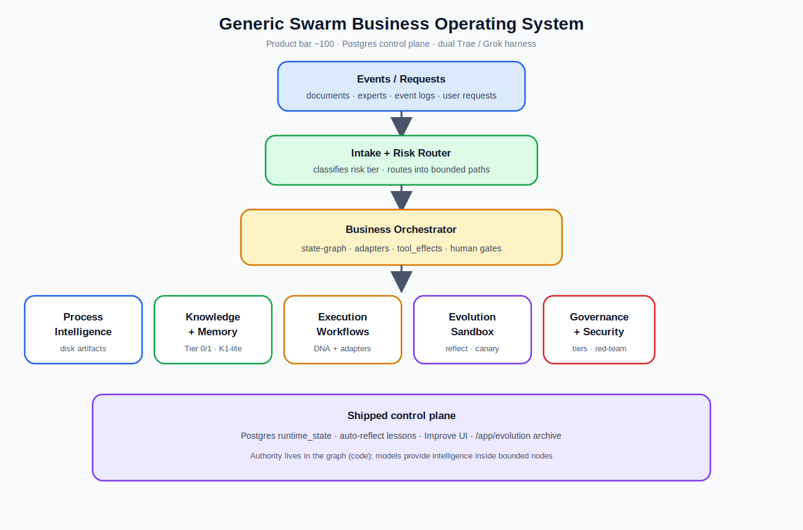
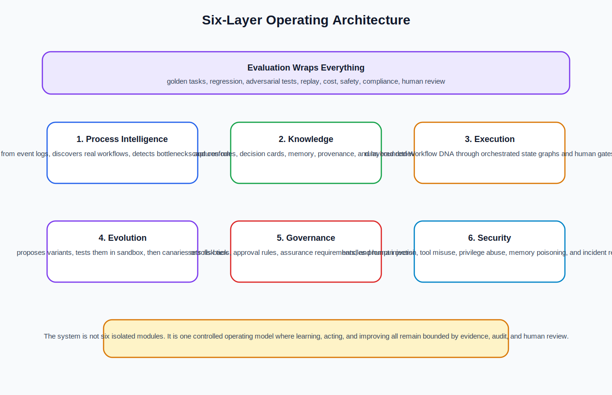
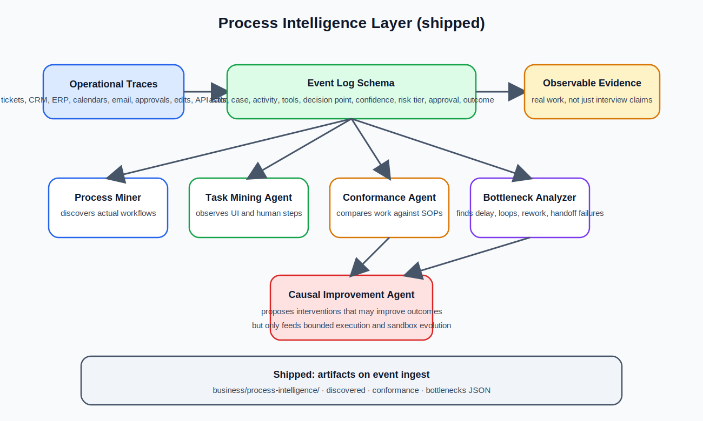
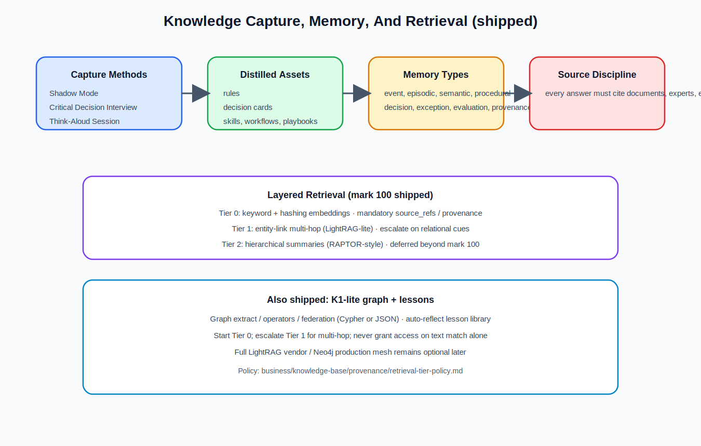
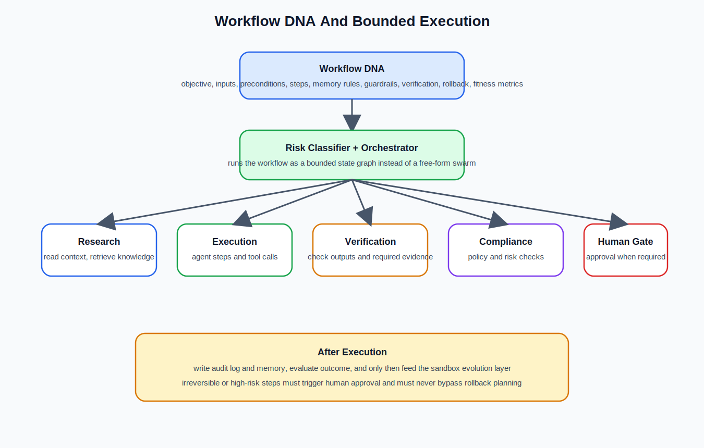
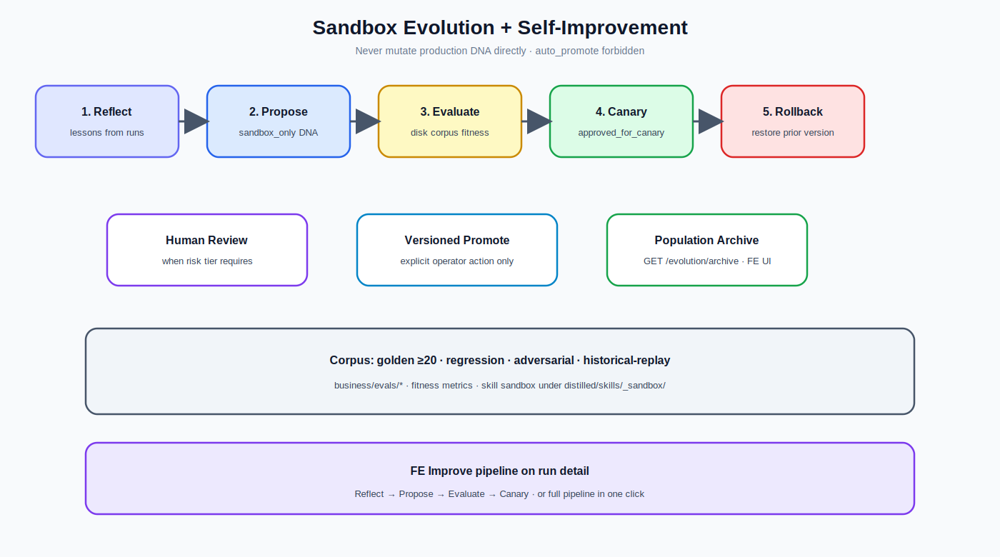
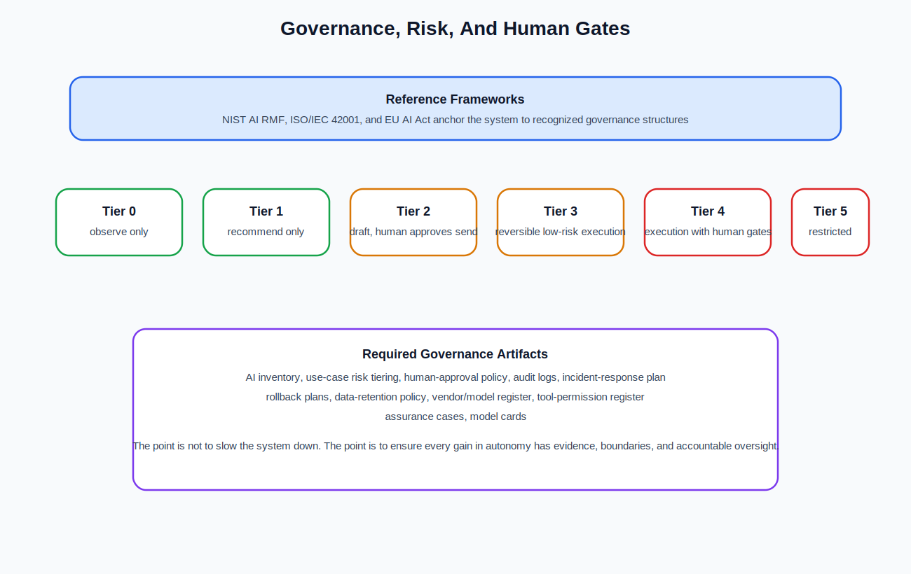
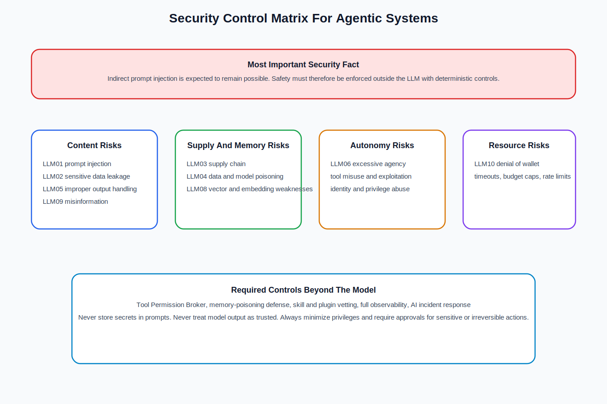
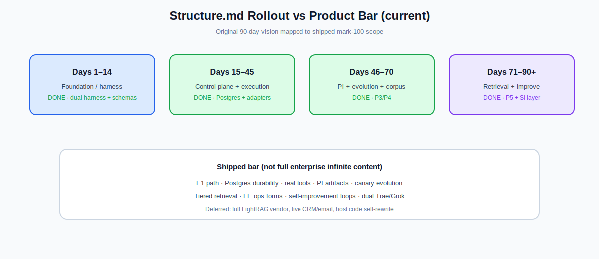

# 通用蜂群商業操作系統說明書

## 一本把 `structure_hk.md` 講清楚的架構書

> **實作現況（mark ~100）：** 本說明書源自架構規格 `structure_hk.md`（與英文 `structure.md` 對齊）。產品標竿已關閉：Postgres 控制平面、tool adapters、PI 產物、演化沙盒、自我改進、K1-lite、雙 harness（Trae + Grok）。  
> **SDD 規格包：** `planning/structure/`（`requirements.md` / `design.md` / `tasks.md`，01–17）。  
> **證據：** `status.md`、`structure_scorecard_100.md`、`mark_100_verification.md`、`planning/gap_analysis_for_structure.md`。  
> **路線圖圖：** `structure-rollout-roadmap.svg`。

**來源文件：** `structure_hk.md`（權威架構願景；§12 為實作對應）  
**目的：** 把原本偏研究與架構規格式的內容，改寫成較容易閱讀、容易向管理層與跨職能團隊解釋、但仍完整保留核心技術資訊的說明書。  
**適合讀者：** 業務負責人、營運主管、架構師、AI 治理人員、安全團隊、工程師，以及任何需要理解整體系統邏輯的人。

---

## 閱讀指南

這本書主要回答八個問題：

1. 這個系統到底是甚麼？
2. 它為甚麼不是一個普通的「AI 群體」？
3. 六個架構層各自做甚麼，又如何互相配合？
4. 系統如何把專家知識、事件日誌與記憶整理成可執行流程？
5. 它如何避免自主系統常見的安全、治理與失控問題？
6. 為甚麼演化只能在沙盒中進行？
7. 如果要落地，90 天內應該先做甚麼？產品標竿實際對應到哪些能力關卡？
8. 本倉庫的規格分解（SDD）與 as-built 實現如何對應 `structure_hk.md`？

原始規格非常濃縮，而且同時混合了架構、治理、研究方法與執行準則。這本書會用更自然的順序重組內容：

1. 先講整個系統的定位
2. 再講核心原則與六層架構
3. 然後拆開知識、記憶、工作流程與演化機制
4. 最後補上治理、安全、評估、推行計劃、以及實作對應（§14 對應來源 §12）

---

## 目錄

1. [這個系統是甚麼](#chapter-1)
2. [核心原則與高層架構](#chapter-2)
3. [流程智能層](#chapter-3)
4. [知識擷取、提煉與記憶](#chapter-4)
5. [執行層：Workflow DNA](#chapter-5)
6. [演化引擎與沙盒機制](#chapter-6)
7. [治理、風險與合規](#chapter-7)
8. [安全控制](#chapter-8)
9. [評估系統](#chapter-9)
10. [代理名冊](#chapter-10)
11. [人機互動規則](#chapter-11)
12. [90 日推行計劃與 as-built 能力關卡](#chapter-12)
13. [實作對應：SDD 規格包與 as-built](#chapter-13)
14. [參考資料與總結](#chapter-14)

---

<a id="chapter-1"></a>
## 1. 這個系統是甚麼

### 1.1 最簡單的定義

這是一個受治理、可自我改進的多代理系統。  
它不只是把多個 AI agent 放在一起，而是把學習、執行、治理、安全、評估和演化全部放進一個有邊界的架構中。

`structure_hk.md`（及英文 `structure.md`）是**架構願景與權威來源**。本說明書與 `planning/structure/` 下的 SDD 規格包是把它講清楚、拆開做的材料——細化架構，而不是改寫架構優先次序。

原始規格對它的定義有四點：

1. 學習一家企業實際如何運作，來源包括文件、專家，以及真實事件日誌
2. 把知識提煉成可重用的規則、技能、工作流程與作業手冊
3. 透過有邊界且可審計的代理工作流程來執行工作
4. 在沙盒中演化這些工作流程，而不是直接在生產環境中修改

### 1.2 它跟一般「AI 自動化」有甚麼不同

很多系統只做其中一部分：

- 有些系統只有聊天和問答
- 有些系統只有 workflow automation
- 有些系統只有 RAG
- 有些系統只有 agent orchestration

這個系統想做的是把整條鏈連起來：

- 從真實工作中學習
- 把知識變成可重用資產
- 以受約束方式執行
- 用評估和治理防止失控
- 只在沙盒中做自我改進

### 1.3 設計優先次序

原始規格把優先次序寫得很清楚：

**安全性 → 可審計性 → 正確性 → 效率 → 自主性**

這句話非常重要，因為它直接回答了一個常見誤區：  
這個系統不是以「盡量自動」作為第一目標，而是以「可控地自動」作為第一目標。

自主性不是預設授予，而是要按每個工作流程以證據逐步取得。



---

<a id="chapter-2"></a>
## 2. 核心原則與高層架構

### 2.1 七條核心原則

原始規格提出七條核心原則：

1. **證據優先於意見**  
   從真實軌跡學習，而不只依賴人們口頭描述工作方式。

2. **有邊界的自主性**  
   每個行動都必須有風險等級、權限範圍，以及在需要時的人類關卡。

3. **一切都必須可測試**  
   任何代理、提示或工作流程，在通過評估前都不得進入生產環境。

4. **沙盒演化**  
   演化引擎只負責提出方案，絕不直接改動生產環境。

5. **全程保留來源**  
   每條規則、每個決策及每段記憶，都必須可追溯到來源。

6. **可逆性優先**  
   優先採用可逆操作；其餘操作必須具備回滾方案。

7. **以人為中心**  
   顯示信心、顯示證據，並讓修正變得容易。

### 2.2 高層架構怎樣運作

原始架構可以讀成一條主流程：

```text
Events / Requests
  -> Intake + Risk Router
  -> Business Orchestrator
  -> 六個層級協同運作
  -> Audit Log + Memory Write
  -> Evaluation + Human Review
  -> Evolution Sandbox
```

### 2.3 六個層級是甚麼

六個層級分別是：

- 流程智能
- 知識
- 執行
- 演化
- 治理
- 安全

而這六層並不是各自獨立。  
它們全部都由 **評估** 包裹與約束。

### 2.4 用簡單方法理解整個架構

可以把整個系統想像成一間有六個專責部門的企業操作中樞：

- 流程智能部門負責理解企業實際怎樣運作
- 知識層負責把資料整理成可找、可用、可追溯的知識
- 執行層負責讓 agent 按規則做事
- 演化層負責提出改良方案
- 治理層負責決定甚麼可以做、甚麼要停
- 安全層負責假設系統會被攻擊，並提前限制爆炸半徑



---

<a id="chapter-3"></a>
## 3. 流程智能層

### 3.1 為甚麼流程智能層是必要的

原始規格指出，蜂群不應只從文件與訪談中學習，而應從 **真實營運軌跡** 中學習。

這些軌跡可以來自：

- 工單
- CRM / ERP 操作
- 行事曆事件
- 電郵
- 審批
- 檔案編輯
- API 呼叫
- 完成紀錄

這代表系統不是只學「人們說自己怎樣做事」，而是學「事情實際怎樣發生」。

### 3.2 這一層的功能

流程探勘會把真實日誌轉化成：

- 可發現的工作流程模型
- 一致性檢查
- 瓶頸分析

原始規格甚至把它形容為「Shadow Mode」的實證版本。

### 3.3 相關新增代理

流程智能層包括五個專責代理：

- **Process Miner Agent**  
  從事件日誌中發掘真實工作流程

- **Task Mining Agent**  
  在獲准情況下觀察 UI 或人類層面的步驟

- **Conformance Agent**  
  比較實際工作與已記錄 SOP 是否一致

- **Bottleneck Analyzer**  
  找出延誤、循環、重工與交接失敗

- **Causal Improvement Agent**  
  提出有機會改善結果的干預措施

### 3.4 事件日誌綱要

原始規格提供了一個事件日誌例子：

```yaml
event:
  id: "evt_..."
  timestamp: "2026-07-06T14:03:00Z"
  actor_type: "human | agent | system"
  actor_id: "user_or_agent_id"
  process_id: "customer_onboarding"
  case_id: "customer_12345"
  activity: "review_contract"
  input_refs: ["doc_contract_v3"]
  output_refs: ["approval_decision_789"]
  tools_used: ["crm", "email"]
  decision_point: true
  decision_reason_summary: "Contract had non-standard liability clause."
  confidence: 0.82
  risk_tier: "medium"
  human_approved: true
  outcome:
    status: "completed"
    latency_minutes: 42
    quality_score: 0.94
```

### 3.5 這個 schema 的意義

這個 schema 告訴我們，系統關心的不只是「做了甚麼」，還包括：

- 是誰做的
- 在哪個案例上做
- 用了哪些工具
- 是不是一個決策點
- 決策原因是甚麼
- 信心有多高
- 風險級別是甚麼
- 有沒有人工批准
- 結果如何

如果沒有這些欄位，後面的流程探勘、治理判斷、評估與演化都會失去根據。



---

<a id="chapter-4"></a>
## 4. 知識擷取、提煉與記憶

### 4.1 不是所有知識都寫在文件裡

原始規格指出，專家知識很多時是隱性知識。  
例如：

- 哪些訊號最重要
- 何時應覆寫規則
- 何時會覺得「不對勁」

因此，系統不能只靠 SOP 或文件。

### 4.2 用甚麼方法擷取知識

文件提出多方法擷取系統，而不是只靠一個 Expert Shadow Agent。

| 方法 | 最適用於 | 輸出 |
|---|---|---|
| Shadow Mode | 真實操作 | 事件日誌、行動軌跡 |
| Critical Decision Interview | 罕見／高風險決策 | 決策需求卡 |
| Think-Aloud Session | 例行專家工作 | 逐步啟發式規則 |
| Exception Interview | 邊界個案 | 例外情況知識庫 |
| Retrospective Review | 已完成個案 | 經驗教訓 |
| Apprentice Mode | 專家教導蜂群 | 技能、作業手冊 |

### 4.3 決策需求卡是甚麼

原始規格提供了 `decision_requirement` 的例子：

```yaml
decision_requirement:
  id: "drc_contract_exception_001"
  domain: "legal_operations"
  decision_point: "approve_non_standard_clause"
  expert_sources: ["senior_counsel_A", "contract_manager_B"]
  context_signals: ["customer_size", "liability_cap", "jurisdiction", "renewal_value"]
  cues_experts_notice:
    - "Clause shifts uncapped indirect damages to company."
    - "Customer insists on governing law outside approved list."
  normal_action: "route_to_legal_review"
  exception_paths:
    - condition: "enterprise_customer AND pre-approved fallback accepted"
      action: "approve_with_note"
  red_flags: ["unlimited liability", "data protection indemnity"]
  required_evidence: ["contract_diff", "customer_risk_profile", "approval_history"]
  risk_tier: "high"
  human_approval_required: true
  validation_tests:
    - "Does recommendation match senior counsel decision on historical cases?"
  confidence: 0.78
  last_reviewed: "2026-07-06"
```

### 4.4 為甚麼這種卡片重要

這類卡片把本來只存在於資深專家腦內的判斷標準，轉成可追蹤、可測試、可重用的知識資產。

它至少包含：

- 決策點是甚麼
- 專家留意哪些訊號
- 正常應該怎樣做
- 有哪些例外路徑
- 哪些是紅旗
- 做判斷前需要哪些證據
- 風險級別
- 是否需要人工批准

### 4.5 混合式記憶

原始規格指出，單一泛用的知識庫並不足夠。  
長時間運行的代理需要分層記憶。

| 記憶類型 | 儲存內容 | 範例 |
|---|---|---|
| Event | 原始營運日誌 | "Agent sent invoice at 9:42 AM." |
| Episodic | 個案敘事 | "This renewal almost failed — legal was pulled in late." |
| Semantic | 事實／規則 | "Enterprise contracts over 250k need legal review." |
| Procedural | 技能／工作流程 | "How to onboard a new client." |
| Decision | 決策與原因 | "We approved exception X because Y." |
| Exception | 邊界個案 | "If supplier in region Z, use alternate process." |
| Evaluation | 測試結果 | "Workflow v12 failed privacy test." |
| Provenance | 來源歸屬 | "Rule came from SOP v4 and expert Alice." |

### 4.6 檢索：分層混合式

原始規格明確選擇避免使用 GraphRAG 式社群摘要作為預設，因為在持續接收事件日誌與文件的系統裡，重建成本太高。

它改用分層檢索堆疊：

**第 0 層：向量搜尋**  
最便宜、預設使用。大部分「找出相關段落」的查詢都在這一層完成。

**第 1 層：LightRAG 圖層**  
做關聯與多跳推理。  
優點是支援增量更新，不用每次重建整個圖。

**第 2 層：階層式摘要（RAPTOR 風格，可選）**  
只在需要處理全語料、全局綜合問題時才建立。

**常駐層：來源層**  
無論答案來自哪一層，每次回應都必須引用來源。

### 4.7 升級規則

查詢應這樣處理：

1. 先從第 0 層開始
2. 需要關聯／多跳推理時，才升級到第 1 層
3. 只有要做全域綜合時，才升級到第 2 層

目的是讓 80% 以上流量停留在最便宜層級。

### 4.8 現成方案與評估

如果不想自行建置，可用：

- AnythingLLM
- RAGFlow

而 LightRAG 可作為它們背後的圖層整合。

檢索評估則應分開看：

- 上下文相關性
- 答案相關性
- 忠實度

因為薄弱的檢索器會默默污染每一個代理。

### 4.9 資料夾結構

原始規格提出以下結構：

```text
business/
├── process-intelligence/
│   ├── event-logs/
│   ├── discovered-processes/
│   ├── conformance-reports/
│   ├── bottlenecks/
│   └── causal-hypotheses/
├── knowledge-base/
│   ├── rules/
│   ├── decision-patterns/
│   ├── exceptions/
│   ├── best-practices/
│   ├── tacit-knowledge/
│   └── provenance/
├── experts/
│   ├── profiles/
│   ├── shadow-logs/
│   ├── decision-requirement-cards/
│   └── interview-transcripts/
├── materials/
│   ├── documents/
│   ├── regulations/
│   └── sops/
├── distilled/
│   ├── skills/
│   ├── prompts/
│   ├── workflows/
│   ├── checklists/
│   └── playbooks/
├── memory/
│   ├── episodic/
│   ├── semantic/
│   ├── procedural/
│   ├── decision-memory/
│   └── evaluation-memory/
├── evals/
│   ├── golden-tasks/
│   ├── regression-tests/
│   ├── adversarial-tests/
│   ├── human-review-sets/
│   └── benchmark-results/
├── governance/
│   ├── ai-inventory/
│   ├── use-case-risk-tiering/
│   ├── risk-assessments/
│   ├── human-approval-policy/
│   ├── audit-logs/
│   ├── model-cards/
│   └── assurance-cases/
├── security/
│   ├── threat-models/
│   ├── tool-permissions/
│   ├── prompt-injection-tests/
│   ├── red-team-results/
│   └── incident-reports/
└── evolution/
    ├── workflow-dna/
    ├── successful-variants/
    ├── failed-experiments/
    ├── mutation-history/
    └── lessons-learned/
```

### 4.10 用一句話總結這一章

這一層的任務，就是把企業現場的混亂訊號，轉成可以被代理理解、檢索、執行、驗證和追溯的知識結構。



---

<a id="chapter-5"></a>
## 5. 執行層：Workflow DNA

### 5.1 甚麼是 Workflow DNA

Workflow DNA 是系統把業務流程表達成可執行結構的方式。  
它不是一段自由文字，而是一份有輸入、前置條件、步驟、記憶讀寫、保護欄、驗證與回滾定義的結構化描述。

### 5.2 原始規格例子

```yaml
workflow_dna:
  id: "wf_customer_onboarding_v12"
  name: "Customer Onboarding"
  domain: "operations"
  objective: "Onboard customer with minimal delay and compliance risk."
  owner: "business_orchestrator"
  version: "12.0"
  inputs: ["signed_contract", "customer_profile", "billing_details"]
  preconditions:
    - "contract_status == signed"
    - "customer_risk_score <= threshold OR legal_approval == true"
  steps:
    - id: "verify_contract"
      agent: "quality_compliance_agent"
      tools: ["contract_parser", "policy_retriever"]
    - id: "create_customer_record"
      agent: "execution_agent"
      tools: ["crm"]
    - id: "configure_billing"
      agent: "finance_ops_agent"
      tools: ["billing_system"]
    - id: "send_welcome_packet"
      agent: "communications_agent"
      tools: ["email"]
  memory_reads: ["contract_rules", "customer_exceptions", "past_failures"]
  memory_writes: ["event_log", "decision_memory", "lessons_learned"]
  guardrails:
    human_approval_required_if:
      - "risk_tier == high"
      - "contract_exception_detected == true"
      - "tool_action_is_irreversible == true"
  verification:
    required_checks:
      - "crm_record_created"
      - "billing_config_validated"
      - "welcome_packet_sent"
      - "audit_log_complete"
  rollback:
    reversible: true
    rollback_steps: ["disable_customer_record", "void_initial_invoice", "notify_ops_owner"]
  fitness_metrics:
    - "cycle_time"
    - "error_rate"
    - "customer_satisfaction"
    - "compliance_pass_rate"
    - "human_escalation_rate"
    - "cost_per_case"
```

### 5.3 這份 DNA 告訴了系統甚麼

它至少回答以下問題：

- 這條 workflow 叫甚麼名字
- 它的目標是甚麼
- 需要哪些輸入
- 甚麼條件下才可以開始
- 每個步驟由哪個 agent 做
- 每步可用哪些工具
- 需要讀取哪些記憶
- 要把甚麼寫回記憶
- 甚麼情況下要人類批准
- 完成後要驗證甚麼
- 如果出錯，怎樣回滾
- 用甚麼指標衡量好壞

### 5.4 執行模式

原始規格明確要求使用 **有邊界的狀態圖**，而不是自由形態的蜂群。

ReAct 風格，即「思考、行動、觀察」的循環，可以放在節點裡面；  
但整張圖本身必須負責：

- 強制狀態
- 強制權限
- 強制人類審批關卡

整體執行路徑如下：

```text
Event → Intake Router → Risk Classifier → Orchestrator
   → [Research] → [Execution] → [Verification] → [Compliance] → [Human Gate]
   → Audit Log + Memory Write → Evaluation → Evolution Sandbox
```

### 5.5 為甚麼這麼強調邊界

因為真正危險的不是 agent 會思考，而是它會在沒有邊界時直接行動。  
這套設計要求：

- agent 可以推理
- 但不可以任意跳過關卡
- 不可以越權使用工具
- 不可以在高風險情境下自動放行



---

<a id="chapter-6"></a>
## 6. 演化引擎與沙盒機制

### 6.1 唯一不可談判的規則

原始規格把這條規則寫得非常直接：

> **Evolution Manager 絕不能直接改動生產環境。**  
> 它只能：提出變體 → 在沙盒中測試 → 與基線比較 → 請求批准 → 金絲雀部署 → 失敗時自動回滾。

這是整份設計最關鍵的保險絲之一。

### 6.2 這條規則的重要性

如果演化引擎可以直接改生產環境，整個系統就會由「受控改進」變成「高風險自我修改」。  
而一旦 workflow 牽涉：

- 合規
- 客戶資料
- 法律風險
- 財務操作
- 不可逆行為

這種失控是不能接受的。

### 6.3 適應度函數

原始規格要求不要靠主觀偏好演化，而是為每個變體評分：

\[
F = w_q Q + w_s S + w_c C + w_e E + w_h H - w_r R - w_l L - w_k K
\]

其中：

- \(Q\) = 品質
- \(S\) = 安全
- \(C\) = 合規
- \(E\) = 效率
- \(H\) = 人類滿意度
- \(R\) = 風險懲罰
- \(L\) = 延遲懲罰
- \(K\) = 成本懲罰

如果目標互相衝突，應用 **Pareto selection**，而不是把所有東西硬壓成一個分數。

### 6.4 流程管道

原始規格的演化流程如下：

```text
1.  Observe production / shadow traces
2.  Detect failures, bottlenecks, or opportunities
3.  Generate variants (prompt / workflow / tool-use / role / expert-pattern crossover)
4.  Test offline against golden tasks
5.  Run security + adversarial tests
6.  Run compliance checks
7.  Replay on historical cases (simulation)
8.  Human review if risk tier requires
9.  Canary deploy to small scope
10. Monitor metrics
11. Promote / rollback / retire
12. Store lessons in evolution memory
```

### 6.5 關於自然語言反思

文件指出，自然語言反思是一種很強的優化器。  
像 GEPA 這類方法顯示，只要有少量以語言診斷的軌跡，就可能勝過多輪只看標量回報的 RL。

但這裡同時加上一個關鍵前提：

**所有這些迴圈，都必須維持在沙盒關卡之內。**

### 6.6 晉升規則

變體只有在以下條件全部滿足時，才可晉升：

1. 改善目標指標
2. 不使安全或合規倒退
3. 通過回歸與對抗測試
4. 具備回滾方案
5. 擁有完整審計日誌
6. 在風險等級要求時已獲得人工簽核



---

<a id="chapter-7"></a>
## 7. 治理、風險與合規

### 7.1 這一層的立場

原始規格強調，治理不應自創一套標準，而應建基於既有框架。

引用的三個主框架是：

- **NIST AI RMF (AI 100-1)**  
  作為 map / measure / manage 的風險骨幹框架

- **ISO/IEC 42001**  
  作為 AI 管理系統層的外框

- **EU AI Act**  
  如果系統觸及歐盟用戶、員工或受規管決策，便要特別留意

### 7.2 為甚麼這些框架與本系統直接相關

因為這不是一個只做內容生成的系統。  
它可能牽涉：

- 招聘
- 候選人篩選
- 績效評估
- 任務分配
- 員工監察
- 晉升或終止僱用

如果蜂群系統觸及這些領域，便可能落入高風險 AI 的監管範圍。

### 7.3 自主性風險分級

| 等級 | 自主性 | 允許行為 |
|---|---|---|
| 0 | 觀察 | 只記錄與摘要 |
| 1 | 建議 | 提出建議；由人類執行 |
| 2 | 草擬 | 準備產出物；發送或執行前由人類批准 |
| 3 | 執行（可逆） | 如存在回滾方案且風險低，可自行行動 |
| 4 | 執行 + 關卡 | 可行動，但關鍵步驟須經人類批准 |
| 5 | 受限制 | 在建立 assurance case 前，不得自主行動 |

### 7.4 這套分級想解決甚麼問題

它不是問「AI 可唔可以做」，而是問：

- 可做到甚麼程度
- 需不需要人類批准
- 可不可以回滾
- 風險是不是仍可接受

### 7.5 必備產出物

原始規格要求至少要有以下治理工件：

- AI inventory
- use-case risk tiering
- human-approval policy
- audit logs
- incident-response plan
- rollback plans
- data-retention policy
- vendor/model register
- tool-permission register
- assurance cases
- model cards

### 7.6 用一句話總結治理層

治理層的任務不是減慢系統，而是確保系統的每一分自主性，都有風險根據、批准條件與責任界線。



---

<a id="chapter-8"></a>
## 8. 安全控制

### 8.1 為甚麼代理式系統的安全更難

原始規格指出，代理式系統把攻擊面擴大到遠超傳統 AppSec。

這裡同時參考兩套 OWASP：

- **Top 10 for LLM Applications (2025)**  
  偏向模型層風險

- **Top 10 for Agentic Applications (2026)**  
  偏向自主代理在工作流程中的風險

### 8.2 最關鍵的安全事實

規格明確指出：

- 間接提示注入是多數代理式系統的關鍵威脅
- 即使模型已做過對齊與過濾，也要假設提示注入仍然可能發生
- 系統提示本身不是安全控制
- 安全必須在 LLM 之外以確定性方式執行

### 8.3 控制矩陣

| 風險 | OWASP | 控制措施 |
|---|---|---|
| Prompt injection（尤其間接） | LLM01 | 把檢索內容／用戶內容都視為不可信；分離指令與資料；限制爆炸半徑 |
| 敏感資訊洩露 | LLM02 | 對輸出／日誌做 DLP；提示中絕不存放秘密；設定保留期限 |
| 供應鏈 | LLM03 | 建立模型／工具／adapter 登記冊；保留來源；執行依賴與 SBOM 掃描 |
| 數據與模型投毒 | LLM04 | 審核 fine-tunes／LoRAs；驗證檢索來源；對記憶寫入做過濾 |
| 不當輸出處理 | LLM05 | 把模型輸出當作不可信輸入；任何執行前都先消毒 |
| 過度代理權限 | LLM06 | 依風險分級授予自主性；採最小權限；設置審批關卡 |
| 系統提示洩露 | LLM07 | 提示中不要放秘密／角色設定；在外部執行授權控制 |
| 向量／嵌入弱點 | LLM08 | 對向量儲存做租戶隔離；偵測被投毒內容 |
| 錯誤資訊 | LLM09 | 做 grounding 與引用來源；顯示信心；高風險情境下安排人工審核 |
| 無界資源消耗 | LLM10 | 設定速率限制、逾時與預算上限 |

### 8.4 額外的代理式控制

除了矩陣外，原始規格還要求：

- **Tool Permission Broker**  
  針對每項任務發放狹窄、臨時且具範圍限制的憑證

- **Memory-poisoning defense**  
  對高影響記憶寫入採用來源追蹤與人工審核

- **Skill/plugin vetting**  
  對第三方代理技能做掃描與版本固定

- **Full observability**  
  對模型呼叫、工具呼叫與代理間通訊維持單一審計軌跡

- **AI incident response**  
  為 GenAI 特有事故建立明確處置 runbook

### 8.5 安全層最重要的精神

不是「相信模型會守規矩」，而是：

- 預設資料可能不可信
- 預設輸出可能有問題
- 預設提示可能被污染
- 因此安全必須在模型外部落實



---

<a id="chapter-9"></a>
## 9. 評估系統

### 9.1 為甚麼評估是整個系統的包裹層

原始規格指出，這是多數「蜂群」設計最大的缺口。  
每個代理、技能、工作流程與提示，都必須有一整套評估機制。

### 9.2 必備八類評估

原始規格要求：

1. Golden task set
2. Regression tests
3. Adversarial tests
4. Human-review set
5. Historical-replay set
6. Cost/latency benchmark
7. Business-outcome metric
8. Safety/compliance score

### 9.3 評估必須在真實情境中做

文件明確指出，像 AgentBench 與 SWE-bench 帶來的教訓是：

**孤立的提示測試，不能預測真實任務表現。**

因此評估要放在：

- 真實
- 多步驟
- 會使用工具

的環境中進行。

### 9.4 評估卡例子

```yaml
evaluation:
  target: "wf_customer_onboarding_v12"
  eval_type: "workflow_regression"
  test_set: "historical_onboarding_cases_q2"
  metrics:
    quality_score: 0.94
    compliance_pass_rate: 0.99
    average_cycle_time_minutes: 38
    escalation_rate: 0.12
    hallucination_rate: 0.01
    unauthorized_tool_attempts: 0
    cost_per_case_usd: 0.42
  result: "pass"
  promotion_decision: "canary_only"
  reviewer: "ops_lead"
```

### 9.5 這張卡的作用

它把「這條 workflow 表現如何」由主觀印象，轉成可比較、可晉升、可回滾的證據。

它至少顯示：

- 測的是哪個對象
- 用哪組測試集
- 品質、合規、延遲、升級率、幻覺率、越權工具嘗試、成本等指標
- 最後結果
- 是否只允許 canary promotion
- 由誰審核

---

<a id="chapter-10"></a>
## 10. 代理名冊

### 10.1 控制／中樞代理

| 代理 | 用途 |
|---|---|
| Business Orchestrator | 路由工作、管理狀態，並持有整體目標 |
| Evolution Manager | 提出並測試變體，只限沙盒 |
| Evaluation Harness | 執行 golden／regression／adversarial／replay 測試 |
| Governance Officer | 套用風險分級、批准規則與審計要求 |
| Security Red-Team | 測試提示注入、工具濫用、洩露與不安全自主行為 |
| Memory Steward | 維護記憶品質、來源追蹤與失效機制 |
| Tool Permission Broker | 授予具範圍限制且臨時的工具存取權 |
| Incident Commander | 處理失敗、回滾與事後檢討 |

### 10.2 學習型代理

| 代理 | 用途 |
|---|---|
| Expert Shadow | 在取得許可下觀察專家 |
| Cognitive Task Analyst | 把訪談轉換成決策卡與啟發式規則 |
| Process Miner | 從日誌中發掘工作流程 |
| Knowledge Distiller | 把原始材料轉化成規則、技能與作業手冊 |
| Knowledge Curator | 驗證、去重與整理知識 |

### 10.3 為甚麼要有名冊

因為這個系統不是一個模糊的 agent pool。  
每個代理都應該有：

- 明確角色
- 明確責任
- 明確權限
- 明確邊界

這樣做才能審計、測試與治理。

---

<a id="chapter-11"></a>
## 11. 人機互動規則

### 11.1 這一章關心的是甚麼

原始規格綜合 Microsoft 多年的 Human-AI Interaction 指引，提出人機互動規則。

### 11.2 系統必須做到的事

蜂群系統必須：

- 顯示信心與不確定性
- 解釋所使用的證據
- 在執行前預覽將採取的行動
- 讓修正只需一下點擊
- 允許覆寫
- 把被拒絕的建議儲存為訓練資料
- 在上下文不足時主動要求澄清
- 絕不能用自信語氣掩飾不確定性

### 11.3 這一章真正想保護甚麼

它不是只為了體驗好看。  
它其實在保護三件事：

- 人類判斷權
- 使用者信任
- 修正成本

如果系統不能清楚說明自己在做甚麼，人就很難批准、糾正或追責。

---

<a id="chapter-12"></a>
## 12. 90 日推行計劃

### 12.1 第 1–14 日：基礎建設

重點：

- 資料夾結構
- 事件日誌綱要
- AI inventory
- 風險分級
- 審計日誌
- 首 20 個 golden tasks

### 12.2 第 15–30 日：Shadow Learning

重點：

- 啟用 Shadow Mode
- 專家訪談
- 收集事件日誌
- 首批決策卡
- 知識擷取管道

### 12.3 第 31–60 日：受控 Co-Pilot

重點：

- RAG + 來源追蹤
- 審批關卡
- 首個 Workflow DNA
- 回歸測試
- 為低／中風險 workflow 啟用 Co-Pilot Mode

### 12.4 第 61–90 日：演化沙盒

重點：

- 變體生成
- 提示／工作流程變異
- 評估 harness
- 金絲雀部署
- 自動回滾
- 只晉升通過安全、品質與商業測試的變體

### 12.5 這個計劃的策略意義

它不是一開始就追求全自動。  
而是按這個節奏走：

1. 先把治理與紀錄底座建好
2. 再開始觀察與學習
3. 然後以受控方式協作
4. 最後才開放沙盒演化

### 12.6 As-built 能力關卡（產品標竿 mark ~100）

`structure_hk.md` §11.1 說明：90 日分帶仍是**願景時間表**；本倉庫交付以**能力關卡**追蹤（不是日曆天數）。

| 階段 | structure 分帶 | As-built（本倉庫） |
|------|----------------|-------------------|
| A 基礎 | 第 1–14 日 | `business/` 樹、事件綱要、inventory、風險分級、審計、≥20 golden |
| B Shadow 學習 | 第 15–30 日 | 事件 ingest + PI 產物；DRC 模板與範例卡 |
| C 受控 co-pilot | 第 31–60 日 | Postgres 控制平面、DNA 執行、人類關卡、Tier-0/1 檢索、FE 營運台 |
| D 演化沙盒 | 第 61–90 日 | Corpus 評估、canary/rollback、自我改進（reflect/propose）、Improve UI |

證據：`status.md`、`structure_scorecard_100.md`、`mark_100_verification.md`、`reviews/e1_operator_checklist.md`、`planning/gap_analysis_for_structure.md`。



---

<a id="chapter-13"></a>
## 13. 實作對應：SDD 規格包與 as-built

本章對應 `structure_hk.md` **§12**，說明架構如何被拆成可執行規格、以及本倉庫今日如何落地。

### 13.1 規格驅動分解（SDD）

可執行子功能規格在 `planning/structure/`（**不可**用其取代架構原文）：

| 路徑 | 內容 |
|------|------|
| `planning/structure/README.md` | 索引、依賴順序、模板 |
| `planning/structure/nn_*/requirements.md` | EARS 需求 |
| `planning/structure/nn_*/design.md` | 完整設計（v2.0） |
| `planning/structure/nn_*/tasks.md` | 實作任務（v2.0，已標記完成） |
| `planning/structure/DESIGN_QUALITY_SCORE.md` | 設計組合分數 |
| `planning/structure/TASKS_QUALITY_SCORE.md` | 任務組合分數 |
| `planning/structure/IMPLEMENTATION_STATUS.md` | 實作矩陣 |
| `planning/gap_analysis_for_structure.md` | 實作對任務落差分數 |

### 13.2 章節 → 子功能規格（01–17）

| structure 章節 | 規格資料夾 |
|----------------|------------|
| §0–1 憲章／原則 | `01_system-charter-and-design-priorities` |
| §3.5 資料夾結構 | `02_business-artifact-repository` |
| §2 Intake + 風險路由 | `03_intake-and-risk-router` |
| §6 治理 | `04_governance-risk-tiers-and-artifacts` |
| §7 安全 | `05_security-controls-and-tool-broker` |
| §2.3 流程智慧 | `06_process-intelligence-layer` |
| §3.1–3.2 擷取 + DRC | `07_knowledge-elicitation-and-decision-cards` |
| §3.3 混合記憶 | `08_hybrid-memory-system` |
| §3.4 分層檢索 | `09_tiered-hybrid-retrieval` |
| §4.1 Workflow DNA | `10_workflow-dna-definition` |
| §4.2 執行模式 | `11_bounded-workflow-execution` |
| §4 護欄 + 審計 | `12_human-gates-and-audit-logging` |
| §8 評估 | `13_evaluation-harness-and-corpus` |
| §5 演化沙盒 | `14_evolution-sandbox-engine` |
| §9 代理名冊 | `15_agent-roster-and-control-roles` |
| §10 人機規則 | `16_human-ai-interaction-rules` |
| §11 推行計劃 | `17_phased-rollout-and-operator-path` |

### 13.3 As-built 實現說明（不削弱架構）

| 主題 | 架構意圖 | As-built 實現 |
|------|----------|---------------|
| Harness | 受治理代理環境 | 雙 harness：Trae（`.trae/`）+ Grok Build（`.grok/`），`npm run sync` |
| 控制平面 | API + 持久狀態 | FastAPI + **Postgres** `runtime_state` JSONB；JSON 檔 = 備份／種子 |
| 工具適配器 | 真實執行 | 本機 adapters + 持久 `tool_effects`；外部 CRM/email = 稍後 |
| 工具中介 | 範圍化權限 | allow-list ∩ DNA tools ∩ RBAC ∩ 關卡 |
| PI 代理 | Miner／合規／瓶頸／因果 | PI **服務 + 磁碟產物**（非五個獨立 LLM agent） |
| 檢索 | Tier 0／1／2 | Tier 0 + 來源；Tier 1 entity multi-hop（LightRAG-lite）；Tier 2／完整 LightRAG = 稍後 |
| 知識圖 | Agent-native graph | K1-lite + 可選 federation 匯出 |
| 演化 | 僅沙盒 | `sandbox_only` 變體；canary；版本化晉升；rollback；**不**改寫 host 程式碼 |
| 自我改進 | 反思迴圈 | Auto-reflect、lessons、auto-propose、Loop runner、FE Improve |
| DNA 生產安全 | 關卡 + 回滾 | `business:validate` + runtime 啟動前生產 DNA 檢查 |
| 前端 | 營運主控台 | Next.js live ops（`DEMO_MODE=false`）；Improve；`/app/evolution` |
| 操作者證明 | 端到端 | E1：login → run → gate → complete → improve |

### 13.4 明確非目標（目前產品標竿）

mark ~100 **不**把下列項目視為未完成的 structure 要求：

- 完整商用 LightRAG／Neo4j 生產 mesh  
- 外部 live CRM／email／billing SaaS adapters  
- DGM 式 host 應用自我改寫  
- 常駐伺服器的全量 Playwright UI CI  
- 填滿 `business/` 每一葉節點的無限企業內容  

### 13.5 Runtime／營運入口

| 層 | 入口 |
|----|------|
| Backend | `backend/` — FastAPI、`runtime.py`、infrastructure/* |
| Frontend | `frontend/` — Next.js 營運主控台 |
| 業務語料 | `business/` |
| 延續性 | `memory/handoff.md`、`memory/project.md`、`status.md` |

---

<a id="chapter-14"></a>
## 14. 參考資料與總結

### 14.1 參考資料

原始規格（`structure_hk.md` §13）列出的參考包括：

- NIST AI RMF 1.0 (AI 100-1)
- ISO/IEC 42001:2023
- EU AI Act + Digital Omnibus (2025–2026)
- OWASP Top 10 for LLM Applications (2025)
- OWASP Top 10 for Agentic Applications (2026)
- OWASP Agentic Security Initiative
- Process Mining Manifesto
- ReAct
- RAG
- Generative Agents
- GEPA
- AgentBench
- Microsoft Guidelines for Human-AI Interaction
- Cognitive Task Analysis / Critical Decision Method

倉庫內延伸閱讀：

- 架構原文：`structure_hk.md`、`structure.md`
- SDD 規格包：`planning/structure/`
- 產品證據：`status.md`、`structure_scorecard_100.md`、`mark_100_verification.md`
- 落差報告：`planning/gap_analysis_for_structure.md`

### 14.2 最後總結

如果要用一句話總結整份 `structure_hk.md`，最接近的說法是：

**這不是一個追求無限制自主的 AI 蜂群，而是一個以治理、安全、評估和可追溯為核心，讓多代理系統可以被企業真正採用的操作架構。**

它的關鍵不在於「agent 有幾聰明」，而在於：

- 系統是否從真實工作學習
- 知識是否有來源
- 行動是否有邊界
- 高風險步驟是否有人類關卡
- 改進是否只能在沙盒中進行
- 每次執行是否可測、可審、可回滾
- 本倉庫是否用 SDD（requirements / design / tasks）把架構拆成可驗證交付

最後，這整套架構的真正精神，可以濃縮成三句話：

1. **從真實世界學，而不是從幻想學**
2. **先證明安全，再談自主**
3. **先在沙盒改進，永不直接進生產**
