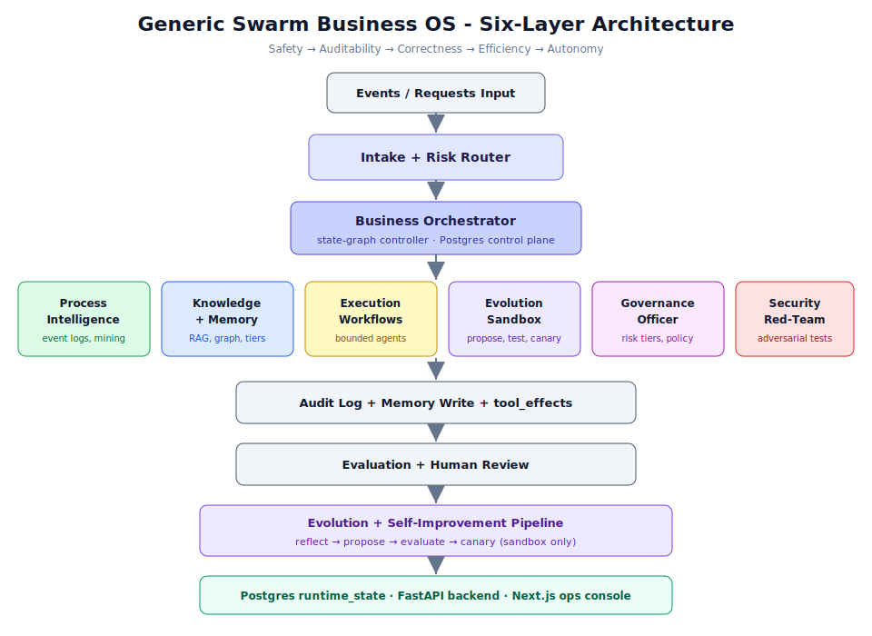

# Chapter 01-01: System Overview



## Learning Objectives

By the end of this chapter, you will be able to:

1. Describe the six-layer architecture of the Generic Swarm Business Operating System
2. Explain the design priority hierarchy (Safety > Auditability > Correctness > Efficiency > Autonomy)
3. Identify the core concepts: Workflow DNA, bounded autonomy, sandbox evolution, and provenance
4. Understand how the Intake Router and Business Orchestrator coordinate work
5. Map each architectural layer to its corresponding role in the system
6. Articulate why autonomy is earned through evidence rather than granted by default

## Prerequisites

- Basic understanding of software architecture concepts (layers, services, APIs)
- Familiarity with the concept of multi-agent systems (helpful but not required)
- Access to a cloned copy of the `generic-swarm-ops` repository

---

## 1. What Is the Generic Swarm Business Operating System?

The Generic Swarm Business Operating System is a governed, self-improving multi-agent system
designed to:

1. **Learn** how a business actually operates -- from documents, experts, AND real event logs
2. **Distill** that knowledge into reusable rules, skills, workflows, and playbooks
3. **Execute** work through bounded, auditable agent workflows
4. **Evolve** those workflows in a sandbox -- never directly in production

> **Note:** This is not a chatbot or a simple automation tool. It is a complete operating
> system for business processes, with built-in governance, security, and self-improvement
> capabilities.

The system is designed for organizations that need to automate complex business processes
while maintaining full auditability, compliance with regulations (including the EU AI Act),
and human oversight at critical decision points.

---

## 2. Design Priority Hierarchy

The system follows a strict priority ordering that governs every design decision:

```
Safety > Auditability > Correctness > Efficiency > Autonomy
```

| Priority | Rank | Meaning |
|----------|------|---------|
| **Safety** | 1st | The system must never cause harm. Irreversible actions require human approval. Rollback plans exist for every execution path. |
| **Auditability** | 2nd | Every action, decision, and data access is logged with full provenance. No black boxes. |
| **Correctness** | 3rd | Outputs must be accurate and grounded in evidence. Hallucinations are treated as failures. |
| **Efficiency** | 4th | The system should be fast and cost-effective, but never at the expense of safety or correctness. |
| **Autonomy** | 5th | Agents can act independently only after earning trust through evidence and evaluation. |

> **Warning:** Autonomy is always the *lowest* priority. The system is designed so that
> autonomous action is earned per workflow through evidence -- it is never granted by default.
> If a conflict arises between efficiency and safety, safety always wins.

### 2.1 Why This Ordering Matters

In practice, this priority hierarchy means:

- A workflow that could execute faster by skipping a human gate will *not* skip it if the
  action is irreversible (Safety > Efficiency)
- An agent that produces correct results but leaves no audit trail is considered *broken*
  (Auditability > Correctness without audit)
- A fully autonomous agent that cannot demonstrate its reliability through evaluation
  results will be restricted to "recommend" mode (Safety > Autonomy)

---

## 3. The Six-Layer Architecture

The system is organized into six functional layers, each with a distinct responsibility.
All six layers work together under the coordination of the Business Orchestrator.

### 3.1 Process Intelligence Layer

**Purpose:** Learn from actual operational traces rather than just documents and interviews.

The Process Intelligence layer discovers how work actually happens by analyzing event logs,
tickets, CRM/ERP actions, calendar events, approvals, and completion records. This provides
the empirical foundation for workflow optimization.

**Key agents:**
- **Process Miner Agent** -- discovers real workflows from event logs
- **Task Mining Agent** -- observes UI/human-level steps where permitted
- **Conformance Agent** -- compares actual work against documented SOPs
- **Bottleneck Analyzer** -- finds delays, loops, rework, and handoff failures
- **Causal Improvement Agent** -- proposes interventions likely to improve outcomes

**Artifact location:** `business/process-intelligence/`

```text
business/process-intelligence/
  event-logs/           # Raw operational event data
  discovered-processes/ # Mined workflow models
  conformance-reports/  # SOP vs actual comparison
  bottlenecks/          # Identified delays and loops
  causal-hypotheses/    # Proposed improvements
```

### 3.2 Knowledge Layer

**Purpose:** Store, organize, and retrieve all business knowledge with full provenance.

The Knowledge layer maintains a tiered retrieval system that combines vector search,
graph-based reasoning, and hierarchical summaries. It supports eight distinct memory types
to handle the full spectrum of business knowledge.

**Memory types:**

| Memory Type | Stores | Example |
|---|---|---|
| Event | Raw operational logs | "Agent sent invoice at 9:42 AM." |
| Episodic | Case narratives | "This renewal almost failed -- legal was pulled in late." |
| Semantic | Facts / rules | "Enterprise contracts over 250k need legal review." |
| Procedural | Skills / workflows | "How to onboard a new client." |
| Decision | Decisions + reasons | "We approved exception X because Y." |
| Exception | Edge cases | "If supplier in region Z, use alternate process." |
| Evaluation | Test results | "Workflow v12 failed privacy test." |
| Provenance | Source attribution | "Rule came from SOP v4 and expert Alice." |

**Retrieval tiers:**

- **Tier 0 (default, cheapest):** Vector search / keyword + hash embeddings. Handles 80%+ of queries.
- **Tier 1 (relational reasoning):** LightRAG-lite graph layer with entity multi-hop. Answers "who touched this case and in what order?"
- **Tier 2 (global synthesis, on demand):** RAPTOR-style hierarchical summaries. Used only for corpus-wide questions.

**Escalation rule:** Start at Tier 0, escalate to Tier 1 only when the query needs
relationships/multi-hop, escalate to Tier 2 only for global synthesis.

**Artifact location:** `business/knowledge-base/`

### 3.3 Execution Layer

**Purpose:** Run bounded, auditable agent workflows defined by Workflow DNA.

The Execution layer uses a bounded state graph (not a free-form swarm) to control
workflow execution. Each step has explicit agents, tools, permissions, and verification
requirements. Tools leave durable `tool_effects` for audit and rollback.

**Execution pattern:**
```text
Event -> Intake Router -> Risk Classifier -> Orchestrator
  -> [Research] -> [Execution] -> [Verification] -> [Compliance]
  -> [Human Gate] -> Audit Log + Memory Write
  -> Evaluation -> Evolution Sandbox
```

**Key concept: Workflow DNA**

Every workflow is defined by a Workflow DNA document that declares:
- Bounded steps with explicit agents and tools
- Memory reads and writes (scoped)
- Guardrails (human-approval conditions)
- Verification required_checks
- Rollback plan (reversibility)
- Fitness metrics and audit-log write requirements

**Artifact location:** `business/evolution/workflow-dna/`

### 3.4 Evolution Layer

**Purpose:** Propose and test improvements in a sandbox, never mutating production directly.

> **Warning:** The Evolution Manager must never mutate production directly.
> It may only: propose variants, test in sandbox, compare to baseline, request approval,
> canary deploy, and auto-rollback on failure.

The Evolution layer implements a controlled improvement pipeline:

1. Observe production/shadow traces
2. Detect failures, bottlenecks, or opportunities
3. Generate variants (prompt / workflow / tool-use / role changes)
4. Test offline against golden tasks
5. Run security + adversarial tests
6. Run compliance checks
7. Replay on historical cases (simulation)
8. Human review if risk tier requires
9. Canary deploy to small scope
10. Monitor metrics
11. Promote / rollback / retire
12. Store lessons in evolution memory

**Fitness function:**

```
F = w_q*Q + w_s*S + w_c*C + w_e*E + w_h*H - w_r*R - w_l*L - w_k*K
```

Where: Q=quality, S=safety, C=compliance, E=efficiency, H=human satisfaction,
R=risk penalty, L=latency penalty, K=cost penalty.

**Artifact location:** `business/evolution/`

### 3.5 Governance Layer

**Purpose:** Apply risk tiers, approval rules, and audit requirements to all operations.

The Governance layer implements a tiered autonomy model aligned with NIST AI RMF,
ISO/IEC 42001, and EU AI Act requirements.

**Autonomy Risk Tiers:**

| Tier | Autonomy Level | Allowed Behavior |
|---|---|---|
| 0 | Observe | Log and summarize only |
| 1 | Recommend | Suggest; human acts |
| 2 | Draft | Prepare artifacts; human approves before send/execute |
| 3 | Execute (reversible) | Act if rollback exists and risk is low |
| 4 | Execute + gate | Act, but human approves the critical step |
| 5 | Restricted | No autonomous action until an assurance case exists |

**Mandatory governance artifacts:**
- AI inventory
- Use-case risk tiering
- Human-approval policy
- Audit logs
- Incident-response plan
- Rollback plans
- Data-retention policy
- Model cards
- Assurance cases

**Artifact location:** `business/governance/`

### 3.6 Security Layer

**Purpose:** Adversarial testing, threat modeling, and blast-radius control.

The Security layer addresses both the OWASP Top 10 for LLM Applications (2025) and the
OWASP Top 10 for Agentic Applications (2026). The primary threat model recognizes that
indirect prompt injection cannot be fully prevented -- so blast-radius control is critical.

**Key controls:**
- **Tool Permission Broker** -- narrow, temporary, scoped credentials per task
- **Memory-poisoning defense** -- provenance + human review for high-impact memory writes
- **Skill/plugin vetting** -- third-party agent skills are scanned and pinned
- **Full observability** -- single audit trail across model calls, tool calls, agent-to-agent traffic
- **AI incident response** -- defined runbook for GenAI-specific incidents

**Core principle:** System prompts are not security controls. Enforce security
deterministically, outside the LLM.

**Artifact location:** `business/security/`

---

## 4. The Intake Router and Business Orchestrator

### 4.1 Intake Router

Every event or request entering the system passes through the Intake Router, which:

1. Classifies the risk level of the incoming request
2. Determines which workflow DNA applies
3. Routes to the appropriate orchestration path
4. Applies initial security screening

The router acts as the single entry point, ensuring that no request bypasses governance
or security controls.

### 4.2 Business Orchestrator

The Business Orchestrator is the central coordinator -- a state-graph controller backed by
a Postgres control plane. It:

- Routes work across the six layers
- Manages workflow state transitions
- Enforces human-in-the-loop gates
- Coordinates tool access through the permission broker
- Triggers evaluation and evolution after workflow completion

**Runtime persistence:** The orchestrator stores all state in a Postgres `runtime_state`
table using JSONB documents. A JSON file backup (`backend/data/runtime.json`) is maintained
for seed/recovery purposes.

```bash
# Health check confirms database connectivity
curl http://127.0.0.1:8000/api/v1/health/ready
# Response: {"database": "postgres", "status": "healthy"}
```

---

## 5. Core Concepts

### 5.1 Workflow DNA

Workflow DNA is the central abstraction for defining executable business processes. Each
Workflow DNA document is a complete, self-contained specification that includes:

```yaml
workflow_dna:
  id: "wf_customer_onboarding_v12"
  name: "Customer Onboarding"
  domain: "operations"
  objective: "Onboard customer with minimal delay and compliance risk."
  owner: "business_orchestrator"
  version: "12.0"
  inputs: ["signed_contract", "customer_profile", "billing_details"]
  preconditions:
    - "contract_status == signed"
    - "customer_risk_score <= threshold OR legal_approval == true"
  steps:
    - id: "verify_contract"
      agent: "governance_officer"
      tools: ["contract_parser", "policy_retriever"]
    - id: "create_customer_record"
      agent: "business_orchestrator"
      tools: ["crm"]
    - id: "configure_billing"
      agent: "tool_permission_broker"
      tools: ["billing_system"]
    - id: "send_welcome_packet"
      agent: "business_orchestrator"
      tools: ["email"]
  guardrails:
    human_approval_required_if:
      - "risk_tier == high"
      - "contract_exception_detected == true"
      - "tool_action_is_irreversible == true"
  verification:
    required_checks:
      - "crm_record_created"
      - "billing_config_validated"
      - "welcome_packet_sent"
      - "audit_log_complete"
  rollback:
    reversible: true
    rollback_steps: ["disable_customer_record", "void_initial_invoice"]
  fitness_metrics:
    - "cycle_time"
    - "error_rate"
    - "customer_satisfaction"
    - "compliance_pass_rate"
```

> **Tip:** The flagship workflow in this system is `wf_customer_onboarding_v12`. Study
> its DNA definition to understand the full pattern before creating your own workflows.

### 5.2 Bounded Autonomy

Bounded autonomy means that every agent action has:
- A **risk tier** (0-5) determining the level of oversight required
- A **permission scope** defining what tools and data the agent can access
- A **human gate** for high-risk or irreversible actions

The system rejects any Workflow DNA that lacks:
- A human gate for high-risk steps
- A rollback plan
- Provenance documentation
- An audit write step

### 5.3 Sandbox Evolution

The evolution engine operates under one non-negotiable rule: it must never mutate production
directly. All improvements go through:

```text
Propose -> Test in sandbox -> Compare to baseline -> Request approval
  -> Canary deploy -> Auto-rollback on failure
```

This ensures that even the system's self-improvement capability is safe and auditable.

### 5.4 Provenance

Every rule, decision, and memory entry traces back to a source. The provenance layer
ensures you can always answer:

- Where did this rule come from? (SOP version, expert interview, event log)
- Who approved this decision?
- What evidence supports this recommendation?
- When was this knowledge last validated?

---

## 6. System Components at a Glance

### 6.1 Backend Runtime

| Component | Location | Purpose |
|-----------|----------|---------|
| FastAPI app | `backend/app/main.py` | Main application, middleware, CORS |
| Runtime engine | `backend/app/runtime.py` | Governed execution, gates, memory |
| Tool adapters | `backend/app/infrastructure/tools/adapters.py` | Real tool execution + effects |
| Self-improvement | `backend/app/infrastructure/self_improvement/` | Reflect, lessons, propose |
| Loop engineering | `backend/app/infrastructure/loop_engineering/` | Loop DNA + runner |
| Knowledge | `backend/app/infrastructure/knowledge/` | Tiered retrieval + embeddings |
| Knowledge orchestration | `backend/app/infrastructure/knowledge_orchestration/` | K1-lite graph ops |
| Process intelligence | `backend/app/infrastructure/process_intelligence/` | PI disk artifacts |
| Evolution | `backend/app/infrastructure/evolution/` | Corpus eval, variants |

### 6.2 Frontend Console

The Next.js ops console (at `http://localhost:3000/`) provides a web interface for:

- Managing agents and workflows
- Running workflows and monitoring execution
- Approving human-gated steps
- Viewing audit logs and memory
- Running the self-improvement pipeline (Reflect, Propose, Evaluate, Canary)
- Browsing the evolution population archive

### 6.3 Business Artifact Layer

```text
business/
  process-intelligence/   # Event logs + PI outputs
  knowledge-base/         # Rules, provenance, retrieval
  experts/                # Profiles, shadow logs, DRCs
  materials/              # Documents, regulations, SOPs
  distilled/              # Skills, prompts, workflows
  memory/                 # Episodic, semantic, procedural
  evals/                  # Golden tasks, regression, adversarial
  governance/             # Inventory, model cards, risk tiers
  security/              # Threat models, red-team results
  evolution/             # DNA, variants, lessons learned
```

---

## 7. Exploring the Architecture (Step-by-Step)

Follow these steps to explore the system architecture on your own machine:

### Step 1: Review the Architecture Source Document

```bash
# Open the architecture source of truth
cat structure.md | head -100
```

The `structure.md` file at the repository root is the definitive architecture document.
It contains 600+ lines covering all six layers in detail.

### Step 2: Examine the Business Artifact Tree

```bash
# List the top-level business folders
ls business/
```

Expected output:
```
evals/  evolution/  governance/  knowledge-base/  materials/
memory/  process-intelligence/  security/  experts/  distilled/
```

### Step 3: Check the Backend API Structure

```bash
# View the main FastAPI application
cat backend/app/main.py | head -50
```

Key API route groups:
- `/api/v1/auth/` -- Authentication endpoints
- `/api/v1/workflows/` -- Workflow CRUD and execution
- `/api/v1/agents/` -- Agent management
- `/api/v1/runs/` -- Run monitoring
- `/api/v1/approvals/` -- Human gate management
- `/api/v1/knowledge/` -- Knowledge retrieval
- `/api/v1/memory/` -- Memory access
- `/api/v1/processes/` -- Process intelligence
- `/api/v1/evolution/` -- Evolution archive
- `/api/v1/improvement/` -- Self-improvement APIs
- `/api/v1/loops/` -- Loop runner
- `/api/v1/health/` -- System health

### Step 4: Inspect the Frontend Navigation

```bash
# List frontend app pages
ls frontend/src/app/
```

The Next.js app router exposes pages for each major system function (agents, workflows,
runs, approvals, knowledge, evaluations, processes, evolution).

### Step 5: Verify the Dual Harness

```bash
# Check the sync command
npm run sync
```

The dual harness generates managed agent/rules files for both the Trae (`.trae/`) and
Grok Build (`.grok/`) development environments.

---

## 8. Real-World Use Cases

### Use Case 1: Automated Customer Onboarding

**Scenario:** A B2B SaaS company needs to onboard enterprise customers with compliance
checks, contract verification, billing setup, and welcome communications.

**How the system handles it:**

1. The **Process Intelligence layer** mines historical onboarding event logs to discover
   the actual steps taken (not just the documented SOP)
2. The **Knowledge layer** stores contract rules, customer exceptions, and past failures
3. A **Workflow DNA** (`wf_customer_onboarding_v12`) defines the bounded steps:
   - Verify contract (Governance Officer + contract_parser tool)
   - Create customer record (Orchestrator + CRM tool)
   - Configure billing (Tool Permission Broker + billing_system)
   - Send welcome packet (Orchestrator + email tool)
4. The **Governance layer** enforces a human gate when risk_tier is high or a contract
   exception is detected
5. The **Evolution layer** continuously improves the workflow by analyzing cycle times,
   error rates, and customer satisfaction scores

**Result:** Onboarding time drops from days to hours while maintaining full compliance
auditability. Human experts intervene only for genuinely complex cases.

### Use Case 2: Regulatory Compliance Monitoring

**Scenario:** A financial services firm needs to track evolving regulations (EU AI Act,
ISO 42001) and ensure all AI-powered processes remain compliant.

**How the system handles it:**

1. The **Knowledge layer** ingests regulatory documents and maintains provenance records
2. The **Governance layer** maps each workflow to applicable regulations and required
   risk assessments
3. The **Conformance Agent** continuously checks actual operations against documented
   compliance requirements
4. When regulations change, the **Evolution layer** proposes updated workflow variants
   that are tested against compliance requirements before deployment
5. **Audit logs** provide complete traceability for regulatory audits

**Result:** The firm maintains continuous compliance without manual tracking spreadsheets.
Auditors can trace any decision back to its regulatory basis and approval chain.

### Use Case 3: Knowledge Worker Augmentation

**Scenario:** A consulting firm wants to capture expert knowledge from senior consultants
and make it available to junior staff as structured guidance.

**How the system handles it:**

1. The **Expert Shadow Agent** observes senior consultants (with permission) and records
   decision patterns
2. The **Cognitive Task Analyst** converts interviews into Decision Requirement Cards
   documenting context signals, cues experts notice, and exception paths
3. The **Knowledge Distiller** converts raw observations into reusable playbooks and
   checklists stored in `business/distilled/`
4. Junior consultants interact with the system in **Recommend mode** (Tier 1), receiving
   suggestions that cite specific expert sources
5. Over time, as evaluation scores improve, some workflows earn higher autonomy tiers

**Result:** Institutional knowledge is preserved and accessible rather than locked in
individual experts' heads. New hires ramp up faster while maintaining quality standards.

---

## 9. Best Practices

### Architecture Understanding

1. **Always start with `structure.md`** -- it is the single source of truth for the system
   architecture. All other documentation refines but does not replace it.

2. **Respect the priority hierarchy** -- when making design decisions, always check whether
   your choice conflicts with a higher-priority concern. Safety trumps everything.

3. **Think in layers** -- each layer has a distinct responsibility. Resist the temptation
   to build cross-cutting features that bypass layer boundaries.

### Operational Awareness

4. **Check health before operating** -- always verify `GET /api/v1/health/ready` returns
   `"database": "postgres"` before running workflows.

5. **Review the governance artifacts** -- before deploying any new workflow, ensure all
   required governance artifacts are in place (`npm run business:governance`).

6. **Trust the evaluation system** -- never promote a workflow variant that has not passed
   golden task evaluation, regression testing, and adversarial testing.

### Development Mindset

7. **Evidence over opinion** -- the system learns from real traces, not assumptions. Always
   ground changes in actual event log data when available.

8. **Bounded is better** -- prefer explicit, bounded workflows over open-ended agent
   freedom. The state graph enforces safety; free-form swarms do not.

9. **Provenance always** -- every rule, decision, or knowledge entry must cite its source.
   Undocumented knowledge is untrusted knowledge.

---

## 10. Chapter Summary

In this chapter, you learned:

- The Generic Swarm Business OS is a governed, self-improving multi-agent system that
  learns from real operations, executes bounded workflows, and evolves safely in a sandbox
- The design priority hierarchy (Safety > Auditability > Correctness > Efficiency > Autonomy)
  governs every decision in the system
- Six layers work together: Process Intelligence, Knowledge, Execution, Evolution,
  Governance, and Security
- The Intake Router and Business Orchestrator coordinate all work through a bounded
  state graph backed by Postgres
- Workflow DNA defines complete, self-contained workflow specifications with built-in
  guardrails, rollback plans, and fitness metrics
- Autonomy is earned through evidence (evaluation results) rather than granted by default
- The evolution engine proposes improvements but never mutates production directly

---

## 11. Knowledge Check Quiz

Test your understanding of the system architecture:

**Question 1:** What is the correct ordering of design priorities in the system?

a) Autonomy > Efficiency > Correctness > Auditability > Safety
b) Safety > Auditability > Correctness > Efficiency > Autonomy
c) Correctness > Safety > Efficiency > Auditability > Autonomy
d) Safety > Correctness > Auditability > Autonomy > Efficiency

<details>
<summary>Answer</summary>
<b>b)</b> Safety > Auditability > Correctness > Efficiency > Autonomy.
Autonomy is always the lowest priority and must be earned through evidence.
</details>

---

**Question 2:** Which layer is responsible for discovering how work actually happens by
analyzing event logs and operational traces?

a) Knowledge Layer
b) Execution Layer
c) Process Intelligence Layer
d) Evolution Layer

<details>
<summary>Answer</summary>
<b>c)</b> Process Intelligence Layer. It uses process mining, task mining, and conformance
checking to learn from actual operational data rather than just documented procedures.
</details>

---

**Question 3:** What is the non-negotiable rule of the Evolution Engine?

a) It must always improve efficiency metrics
b) It must never mutate production directly
c) It must generate at least 10 variants per cycle
d) It must run without human oversight

<details>
<summary>Answer</summary>
<b>b)</b> The Evolution Manager must never mutate production directly. It may only propose
variants, test in sandbox, compare to baseline, request approval, canary deploy, and
auto-rollback on failure.
</details>

---

**Question 4:** At which autonomy tier can an agent execute reversible actions without
human approval?

a) Tier 0 (Observe)
b) Tier 1 (Recommend)
c) Tier 3 (Execute reversible)
d) Tier 5 (Restricted)

<details>
<summary>Answer</summary>
<b>c)</b> Tier 3 (Execute reversible). At this tier, agents can act if a rollback exists
and risk is low. Higher-risk actions require Tier 4 (Execute + gate) with human approval.
</details>

---

**Question 5:** What is the default (cheapest) retrieval tier in the Knowledge layer,
and what percentage of queries does it handle?

a) Tier 1 (graph layer), handling 50% of queries
b) Tier 0 (vector search), handling 80%+ of queries
c) Tier 2 (hierarchical summaries), handling 90% of queries
d) Tier 0 (vector search), handling 40% of queries

<details>
<summary>Answer</summary>
<b>b)</b> Tier 0 (vector search / keyword + hash embeddings) is the default and handles
80%+ of queries. The system only escalates to higher tiers when relational reasoning
or global synthesis is required.
</details>

---

**Question 6:** What happens if a Workflow DNA is submitted without a rollback plan?

a) It runs with a warning
b) It is rejected by the runtime
c) It runs in observe-only mode
d) It is automatically assigned a rollback plan

<details>
<summary>Answer</summary>
<b>b)</b> The runtime rejects DNA that has no gate, no rollback, missing provenance,
or no audit write. This is enforced deterministically by the system, not by the LLM.
</details>

---

**Question 7:** Which Postgres table stores the Business Orchestrator's runtime state?

a) `workflow_state`
b) `runtime_state`
c) `agent_state`
d) `orchestrator_log`

<details>
<summary>Answer</summary>
<b>b)</b> The <code>runtime_state</code> table stores JSONB documents representing the
complete orchestrator state. A JSON file backup at <code>backend/data/runtime.json</code>
serves as a seed source if the database is empty.
</details>

---

## Next Chapter

Continue to [Chapter 01-02: Installation Prerequisites](01-02-installation-prerequisites.md)
to learn how to set up your development environment with all required dependencies.
