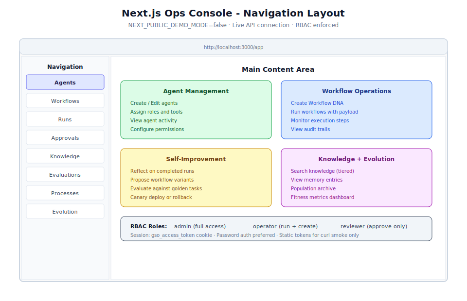

# Chapter 01-05: Basic Navigation & Account Management



## Learning Objectives

By the end of this chapter, you will be able to:

1. Navigate the Next.js ops console and locate all major sections
2. Understand the purpose of each navigation item (agents, workflows, runs, approvals, knowledge, evaluations, processes, evolution)
3. Manage user accounts using RBAC (admin, operator, reviewer roles)
4. Configure session management settings (cookies, tokens, expiration)
5. Perform common account management tasks (create users, assign roles, reset passwords)
6. Use the self-improvement pipeline from the UI (Reflect, Propose, Evaluate, Canary)

## Prerequisites

- Completed [Chapter 01-04](01-04-first-time-configuration.md) with system fully configured
- Backend running at `http://127.0.0.1:8000`
- Frontend running at `http://localhost:3000`
- Logged in with admin credentials (`admin@example.com` / `admin-password`)
- At least one agent and one workflow created

---

## 1. Ops Console Overview

The Generic Swarm Ops console is a Next.js application that provides a complete
operational interface for the multi-agent system. When running with
`NEXT_PUBLIC_DEMO_MODE=false`, it connects to the live FastAPI backend for real-time
data.

### 1.1 Console URL and Access

| Component | URL | Purpose |
|-----------|-----|---------|
| Frontend console | `http://localhost:3000` | Main operational interface |
| Login page | `http://localhost:3000/login` | Authentication entry point |
| App root | `http://localhost:3000/app` | Post-login dashboard |

### 1.2 Console Layout

The ops console uses a standard layout with three main areas:

1. **Sidebar Navigation** (left) -- primary navigation links to all system sections
2. **Main Content Area** (center) -- context-sensitive content for the selected section
3. **Header Bar** (top) -- user info, session status, and global actions

### 1.3 Navigation Structure

The sidebar provides access to eight primary sections:

| Navigation Item | Path | Description |
|----------------|------|-------------|
| **Agents** | `/app/agents` | Create, edit, and monitor agents |
| **Workflows** | `/app/workflows` | Manage Workflow DNA definitions |
| **Runs** | `/app/runs` | View active and completed workflow runs |
| **Approvals** | `/app/approvals` | Manage human-gated approval requests |
| **Knowledge** | `/app/knowledge` | Search and browse the knowledge base |
| **Evaluations** | `/app/evaluations` | View evaluation results and metrics |
| **Processes** | `/app/processes` | Process intelligence dashboards |
| **Evolution** | `/app/evolution` | Population archive and fitness metrics |

---

## 2. Agents Page

**Path:** `/app/agents`

The Agents page is where you create, configure, and monitor all system agents.

### 2.1 Agent List View

When you navigate to the Agents page, you see a list of all configured agents with:

- Agent name and ID
- Assigned role (execution, learning, control)
- Current status (active, inactive, restricted)
- Risk tier assignment
- Assigned tools

### 2.2 Creating an Agent

1. Click the **Create Agent** button
2. Fill in the form fields:
   - **Name:** Descriptive agent identifier
   - **Role:** Agent category (execution, learning, control)
   - **Description:** Clear explanation of the agent's purpose
   - **Tools:** Array of tool identifiers the agent can access
   - **Risk Tier:** Autonomy level (0-5)
   - **Constraints:** Behavioral limits (max actions, memory scope)
3. Click **Save**

The form uses Zod schema validation and React Hook Form for input handling. Validation
errors include the `request_id` for debugging.

### 2.3 Agent Detail View

Click on any agent to see its detail view:

- **Configuration tab:** Current settings, tools, constraints
- **Activity tab:** Recent actions taken by this agent
- **Metrics tab:** Performance data (actions/day, error rate, latency)
- **Audit tab:** Complete audit log of agent operations

### 2.4 Common Agent Operations

```bash
# List all agents via API
curl -b cookies.txt http://127.0.0.1:8000/api/v1/agents

# Get specific agent details
curl -b cookies.txt http://127.0.0.1:8000/api/v1/agents/agent_customer_support_001

# Update agent configuration
curl -X PUT http://127.0.0.1:8000/api/v1/agents/agent_customer_support_001 \
  -H "Content-Type: application/json" \
  -b cookies.txt \
  -d '{"risk_tier": 4, "tools": ["email", "crm", "knowledge_retriever", "escalation"]}'

# Deactivate an agent
curl -X PATCH http://127.0.0.1:8000/api/v1/agents/agent_customer_support_001 \
  -H "Content-Type: application/json" \
  -b cookies.txt \
  -d '{"status": "inactive"}'
```

---

## 3. Workflows Page

**Path:** `/app/workflows`

The Workflows page manages all Workflow DNA definitions in the system.

### 3.1 Workflow List View

The list shows all registered workflows with:

- Workflow ID and human-readable name
- Domain assignment
- Version number
- Number of steps
- Whether human gates are defined
- Current activation status

### 3.2 Creating a Workflow

1. Click **Create Workflow**
2. Fill in the DNA specification (see Chapter 01-04 for the full schema)
3. The form validates against the Workflow DNA schema
4. Click **Save**

> **Warning:** The runtime rejects Workflow DNA that is missing any of these:
> a human gate for high-risk steps, a rollback plan, provenance, or an audit write.
> The form validation catches these before submission.

### 3.3 Running a Workflow

From the workflow detail page:

1. Click **Run Now**
2. Provide the required payload (e.g., `case_id` for the flagship workflow)
3. The system routes the run through the Intake Router
4. Monitor progress on the Runs page

```bash
# Run a workflow via API
curl -X POST http://127.0.0.1:8000/api/v1/runs \
  -H "Content-Type: application/json" \
  -b cookies.txt \
  -d '{
    "workflow_id": "wf_customer_onboarding_v12",
    "payload": {
      "case_id": "customer_12345",
      "signed_contract": "contract_v3",
      "customer_profile": "enterprise_tier",
      "billing_details": "annual_plan"
    }
  }'
```

---

## 4. Runs Page

**Path:** `/app/runs`

The Runs page provides real-time monitoring of all workflow executions.

### 4.1 Run States

| State | Meaning |
|-------|---------|
| `pending` | Run queued, awaiting orchestrator pickup |
| `running` | Active execution in progress |
| `waiting_approval` | Paused at a human gate |
| `completed` | Successfully finished all steps |
| `failed` | Encountered an error |
| `rolled_back` | Failed and successfully rolled back |

### 4.2 Run Detail View

Click on any run to see:

- **Steps timeline:** Visual representation of completed, active, and pending steps
- **Current state:** Where in the workflow the run currently is
- **Tool effects:** All tool actions taken with their effects logged
- **Memory writes:** What was written to memory during execution
- **Audit trail:** Complete log of every action and decision

### 4.3 The Improve Pipeline

On a completed run's detail page, you can access the **Improve** button to trigger
the self-improvement pipeline:

1. **Reflect** -- Analyze what went well and what failed
2. **Propose** -- Generate workflow improvement variants
3. **Evaluate** -- Test variants against golden tasks
4. **Canary** -- Deploy variants to a small scope for validation

Or click **Run full pipeline** to execute all four steps automatically.

```bash
# Trigger reflection on a completed run
curl -X POST http://127.0.0.1:8000/api/v1/improvement/reflect/run_12345 \
  -b cookies.txt

# Generate improvement proposals
curl -X POST http://127.0.0.1:8000/api/v1/improvement/auto-propose \
  -b cookies.txt

# Run the full improvement loop
curl -X POST http://127.0.0.1:8000/api/v1/loops/run \
  -b cookies.txt
```

---

## 5. Approvals Page

**Path:** `/app/approvals`

The Approvals page shows all pending human-gate approval requests.

### 5.1 Understanding Human Gates

Human gates are triggered when a workflow step meets conditions defined in the DNA's
`guardrails.human_approval_required_if` section. Common triggers:

- Risk tier is high
- Action is irreversible
- Contract exception detected
- Value exceeds threshold
- Compliance check flagged an issue

### 5.2 Approval Queue

The approval queue displays:

- Requesting workflow and run ID
- Step requiring approval
- Reason for the gate (which condition triggered)
- Requesting agent
- Supporting evidence/context
- Time waiting for approval

### 5.3 Approving or Rejecting

**As an admin or reviewer:**

1. Click on a pending approval
2. Review the context and evidence provided
3. Click **Approve** to allow the step to proceed
4. Or click **Reject** to halt the run (triggers rollback if defined)

```bash
# List pending approvals via API
curl -b cookies.txt http://127.0.0.1:8000/api/v1/approvals?status=pending

# Approve a specific request
curl -X POST http://127.0.0.1:8000/api/v1/approvals/approval_001/approve \
  -H "Content-Type: application/json" \
  -b cookies.txt \
  -d '{"reason": "Contract reviewed and acceptable", "reviewer_notes": "Standard terms"}'

# Reject a request
curl -X POST http://127.0.0.1:8000/api/v1/approvals/approval_001/reject \
  -H "Content-Type: application/json" \
  -b cookies.txt \
  -d '{"reason": "Non-standard liability clause requires legal review"}'
```

> **Note:** Only users with `admin` or `reviewer` roles can approve or reject
> human-gated steps. Operators can view the queue but cannot take action on approvals.

---

## 6. Knowledge Page

**Path:** `/app/knowledge`

The Knowledge page provides access to the tiered knowledge retrieval system.

### 6.1 Search Interface

The search interface supports three retrieval modes:

| Mode | Tier | Use Case |
|------|------|----------|
| **Keyword/Semantic** | Tier 0 | Find specific passages or concepts |
| **Entity/Relational** | Tier 1 | Multi-hop queries about relationships |
| **Graph Federation** | Tier 1+ | Cross-domain entity exploration |

### 6.2 Searching Knowledge

1. Enter your query in the search box
2. Select the retrieval tier (defaults to Tier 0, auto-escalates if needed)
3. View results with provenance citations
4. Click through to source documents

```bash
# Search knowledge via API
curl -b cookies.txt \
  "http://127.0.0.1:8000/api/v1/knowledge/search?q=contract+review+process&tier=0"

# Entity-based search (Tier 1)
curl -b cookies.txt \
  "http://127.0.0.1:8000/api/v1/knowledge/search?q=who+approved+contract+12345&tier=1"

# Federation export (requires Neo4j)
curl -X POST http://127.0.0.1:8000/api/v1/knowledge/graph/federate \
  -b cookies.txt
```

### 6.3 Memory Browser

The Knowledge page also provides access to the hybrid memory system:

- **Episodic memory:** Case narratives and historical context
- **Semantic memory:** Facts, rules, and knowledge entries
- **Decision memory:** Past decisions with reasoning
- **Evaluation memory:** Test results and metrics

---

## 7. Evaluations Page

**Path:** `/app/evaluations`

The Evaluations page shows evaluation results for workflows, agents, and the system overall.

### 7.1 Evaluation Types

| Type | Purpose | Location |
|------|---------|----------|
| Golden tasks | Core correctness verification | `business/evals/golden-tasks/` |
| Regression tests | Prevent regressions in updated workflows | `business/evals/regression-tests/` |
| Adversarial tests | Security and robustness testing | `business/evals/adversarial-tests/` |
| Historical replay | Validate against past real cases | `business/evals/human-review-sets/` |
| Benchmarks | Performance and cost metrics | `business/evals/benchmark-results/` |

### 7.2 Viewing Results

Each evaluation run shows:

- Target workflow/agent being evaluated
- Test set used
- Metrics (quality score, compliance rate, cycle time, etc.)
- Pass/fail determination
- Promotion decision (canary, promote, reject)
- Reviewer sign-off status

### 7.3 Evaluation Metrics

Key metrics tracked per evaluation:

```json
{
  "quality_score": 0.94,
  "compliance_pass_rate": 0.99,
  "average_cycle_time_minutes": 38,
  "escalation_rate": 0.12,
  "hallucination_rate": 0.01,
  "unauthorized_tool_attempts": 0,
  "cost_per_case_usd": 0.42
}
```

---

## 8. Processes Page

**Path:** `/app/processes`

The Processes page provides access to the Process Intelligence layer outputs.

### 8.1 Process Intelligence Artifacts

| Artifact Type | Purpose |
|---------------|---------|
| Event logs | Raw operational event data |
| Discovered processes | Mined workflow models from actual behavior |
| Conformance reports | SOP vs. actual work comparison |
| Bottlenecks | Identified delays, loops, and handoff failures |
| Causal hypotheses | Proposed improvements with evidence |

### 8.2 Viewing Process Maps

The page displays discovered process maps that show:

- Actual workflow paths taken (not just documented SOPs)
- Frequency of each path
- Average duration per step
- Deviation points from expected behavior
- Bottleneck locations with delay metrics

### 8.3 Conformance Analysis

Compare documented procedures against actual behavior:

- Which steps are skipped in practice?
- Where do people deviate from the SOP?
- What undocumented steps are commonly performed?
- Where do handoff failures occur?

---

## 9. Evolution Page

**Path:** `/app/evolution`

The Evolution page shows the population archive of workflow variants and their fitness.

### 9.1 Population Archive

The evolution population displays:

- All workflow variants (current and historical)
- Fitness scores per variant
- Lineage (which variant derived from which parent)
- Promotion status (canary, promoted, retired, failed)
- Comparison against baseline

### 9.2 Fitness Metrics Dashboard

Each variant is scored on multiple dimensions:

```text
F = w_q*Q + w_s*S + w_c*C + w_e*E + w_h*H - w_r*R - w_l*L - w_k*K
```

The dashboard visualizes:
- Quality score trends over variant generations
- Safety/compliance scores (these must never regress)
- Efficiency improvements (cycle time, cost)
- Human satisfaction ratings
- Pareto frontier for multi-objective optimization

### 9.3 Variant Lifecycle

```text
Proposed -> Testing -> Evaluated -> [Canary | Rejected]
  -> Monitoring -> [Promoted | Rolled Back | Retired]
```

```bash
# View evolution archive via API
curl -b cookies.txt http://127.0.0.1:8000/api/v1/evolution/archive \
  | python3 -m json.tool
```

---

## 10. Account Management

### 10.1 RBAC Model

The system implements Role-Based Access Control with three predefined roles:

| Role | Create | Run | Approve | Configure | Evolve |
|------|--------|-----|---------|-----------|--------|
| `admin` | Yes | Yes | Yes | Yes | Yes |
| `operator` | Yes | Yes | No | No | No |
| `reviewer` | No | No | Yes | No | No |

### 10.2 Creating User Accounts

**As an administrator:**

```bash
# Create an operator account
curl -X POST http://127.0.0.1:8000/api/v1/auth/register \
  -H "Content-Type: application/json" \
  -b cookies.txt \
  -d '{
    "email": "operator@company.com",
    "password": "strong-password-123",
    "role": "operator"
  }'

# Create a reviewer account
curl -X POST http://127.0.0.1:8000/api/v1/auth/register \
  -H "Content-Type: application/json" \
  -b cookies.txt \
  -d '{
    "email": "reviewer@company.com",
    "password": "strong-password-456",
    "role": "reviewer"
  }'
```

### 10.3 Session Management

Sessions are managed through HTTP-only cookies:

| Setting | Value | Purpose |
|---------|-------|---------|
| Cookie name | `gso_access_token` | Authentication token |
| HTTP-only | `true` | Prevents JavaScript access (XSS protection) |
| Secure | `true` (production) | Requires HTTPS |
| SameSite | `Strict` | Prevents CSRF attacks |

**Checking your current session:**

```bash
curl -b cookies.txt http://127.0.0.1:8000/api/v1/auth/me
# Returns: {"email": "admin@example.com", "role": "admin"}
```

**Logging out:**

```bash
curl -X POST http://127.0.0.1:8000/api/v1/auth/logout -b cookies.txt
# Invalidates the session token
```

### 10.4 Password Management

> **Warning:** Always use strong passwords in production. The seed password
> `admin-password` is intentionally weak and must be changed.

```bash
# Change password (as the logged-in user)
curl -X POST http://127.0.0.1:8000/api/v1/auth/change-password \
  -H "Content-Type: application/json" \
  -b cookies.txt \
  -d '{
    "current_password": "admin-password",
    "new_password": "new-strong-password-789"
  }'
```

### 10.5 Static Tokens (Development Only)

Static bearer tokens exist for quick curl testing:

```bash
# Using static token (DEVELOPMENT ONLY)
curl -H "Authorization: Bearer admin-token" \
  http://127.0.0.1:8000/api/v1/workflows
```

> **Warning:** Static tokens (`admin-token`, etc.) bypass proper session management.
> They exist solely for curl smoke testing during development. Never use them in
> production or for automated integrations.

---

## 11. Operator Runtime Flow (E1 Path)

The standard operator runtime flow (E1) demonstrates the full system in action:

### Step 1: Log In

Log in with password authentication (produces session cookie).

### Step 2: List Workflows and Agents

Navigate to Workflows and Agents pages to see available resources.

### Step 3: Create Agent/Workflow

Use real forms (Zod + React Hook Form validation) or use the flagship
`wf_customer_onboarding_v12`.

### Step 4: Run Now

Click **Run Now** with a valid payload (`case_id` required for flagship).

### Step 5: Approve Human-Gated Step

As a reviewer, approve the billing step that triggers the human gate.

### Step 6: Inspect Results

View audit logs, memory writes, evaluations, and process summaries.

### Step 7: Improve

On the run detail page, click **Improve** to enter the self-improvement pipeline:
- Reflect on the run
- Propose workflow variants
- Evaluate against golden tasks
- Canary deploy (or run full pipeline)

### Step 8: View Evolution

Navigate to `/app/evolution` to see the population archive with fitness scores.

---

## 12. Real-World Use Cases

### Use Case 1: Daily Operations Monitoring

**Scenario:** An operations manager wants a morning routine to check system health
and review pending approvals.

**Navigation workflow:**

1. Log in to `http://localhost:3000`
2. Check **Runs** page -- review any failed or stuck runs from overnight
3. Check **Approvals** page -- approve or escalate pending human gates
4. Check **Evaluations** page -- review any regression test failures
5. Check **Processes** page -- look for new bottleneck detections
6. Review **Evolution** page -- check if any variants are ready for promotion

**API equivalent for scripted monitoring:**

```bash
#!/bin/bash
# morning-check.sh

echo "=== System Health ==="
curl -s http://127.0.0.1:8000/api/v1/health/ready | python3 -m json.tool

echo "=== Pending Approvals ==="
curl -s -b cookies.txt \
  "http://127.0.0.1:8000/api/v1/approvals?status=pending" | python3 -m json.tool

echo "=== Failed Runs (last 24h) ==="
curl -s -b cookies.txt \
  "http://127.0.0.1:8000/api/v1/runs?status=failed&since=24h" | python3 -m json.tool

echo "=== Evolution Candidates ==="
curl -s -b cookies.txt \
  http://127.0.0.1:8000/api/v1/evolution/archive | python3 -m json.tool
```

### Use Case 2: Onboarding a Compliance Reviewer

**Scenario:** A new compliance officer needs access to approve workflow steps but
should not be able to create or modify agents/workflows.

**Steps:**

1. As admin, create a reviewer account:
```bash
curl -X POST http://127.0.0.1:8000/api/v1/auth/register \
  -H "Content-Type: application/json" \
  -b cookies.txt \
  -d '{"email": "compliance@company.com", "password": "secure-pwd", "role": "reviewer"}'
```

2. The reviewer can now:
   - View all pages (agents, workflows, runs, etc.)
   - Approve or reject human-gated steps on the Approvals page
   - View audit logs and evaluation results
   - Cannot create or modify agents, workflows, or system configuration

3. Train the reviewer on:
   - How to read the approval context and evidence
   - When to approve vs. escalate vs. reject
   - How to add reviewer notes for audit trail

### Use Case 3: Developer Integration Testing

**Scenario:** A developer wants to test a new workflow end-to-end using both the UI
and API.

**Steps:**

1. Create a new workflow via the Workflows page (UI)
2. Run it with test data via the API:
```bash
curl -X POST http://127.0.0.1:8000/api/v1/runs \
  -H "Content-Type: application/json" \
  -b cookies.txt \
  -d '{"workflow_id": "wf_test_v1", "payload": {"case_id": "test_001"}}'
```
3. Monitor execution on the Runs page (UI)
4. Approve any human gates on the Approvals page (UI)
5. Trigger improvement on the run detail page (UI):
   - Click Improve -> Reflect
   - Review reflection output
   - Click Propose to generate variants
6. Check the Evolution page for new variants
7. Run evaluation from the API:
```bash
curl -X POST http://127.0.0.1:8000/api/v1/loops/run -b cookies.txt
```

---

## 13. Best Practices

1. **Use the sidebar navigation consistently** -- each section maps to a specific
   system function. Avoid bookmarking deep links that bypass context.

2. **Check Approvals daily** -- pending human gates block workflow completion.
   Unattended approvals create bottlenecks.

3. **Review Evaluations after Evolution runs** -- before promoting any variant,
   verify its evaluation scores meet your quality bar.

4. **Use roles appropriately** -- do not give everyone admin access. Separation of
   duties (operator creates, reviewer approves) is a governance requirement.

5. **Monitor the Evolution page** -- it shows the health of your self-improvement
   pipeline. Stale populations indicate the system is not learning.

6. **Leverage Process Intelligence** -- the Processes page reveals how work actually
   happens, often differing from documented procedures. Use this for workflow design.

7. **Keep sessions secure** -- log out when done, use strong passwords, and ensure
   the `Secure` cookie flag is set in production (HTTPS required).

8. **Use API endpoints for automation** -- while the UI is convenient for interactive
   work, repeatable operations should use the API with proper authentication.

---

## 14. Chapter Summary

In this chapter, you learned to navigate the complete ops console:

- **Eight navigation sections:** Agents, Workflows, Runs, Approvals, Knowledge,
  Evaluations, Processes, Evolution
- **Agents page:** Create, configure, and monitor system agents with defined roles
  and tool permissions
- **Workflows page:** Manage Workflow DNA definitions and trigger runs
- **Runs page:** Monitor execution, inspect audit trails, and trigger the Improve pipeline
- **Approvals page:** Process human-gated approval requests (admin/reviewer only)
- **Knowledge page:** Search the tiered retrieval system with provenance
- **Evaluations page:** Review golden task results and regression metrics
- **Processes page:** View discovered processes, conformance, and bottlenecks
- **Evolution page:** Browse the population archive and fitness metrics
- **Account management:** Create users, assign roles (admin/operator/reviewer),
  manage sessions, and understand authentication modes
- **E1 operator flow:** Login, list, create, run, approve, inspect, improve, evolve

---

## 15. Knowledge Check Quiz

**Question 1:** How many primary navigation sections does the ops console have?

a) 5
b) 6
c) 8
d) 10

<details>
<summary>Answer</summary>
<b>c)</b> Eight sections: Agents, Workflows, Runs, Approvals, Knowledge, Evaluations,
Processes, and Evolution.
</details>

---

**Question 2:** Which page shows the self-improvement pipeline (Reflect, Propose, Evaluate, Canary)?

a) Evolution page
b) Run detail page (via the Improve button)
c) Workflows page
d) Evaluations page

<details>
<summary>Answer</summary>
<b>b)</b> The self-improvement pipeline is accessed from a completed run's detail page
by clicking the <b>Improve</b> button. The Evolution page shows the results (population
archive) but the pipeline is triggered from the run detail.
</details>

---

**Question 3:** Which roles can approve human-gated workflow steps?

a) Only admin
b) Admin and operator
c) Admin and reviewer
d) All roles

<details>
<summary>Answer</summary>
<b>c)</b> Only <code>admin</code> and <code>reviewer</code> roles can approve or reject
human-gated steps. The <code>operator</code> role can view the approval queue but cannot
take action.
</details>

---

**Question 4:** What does the Evolution page's population archive show?

a) All pending approvals
b) Workflow variants with fitness scores, lineage, and promotion status
c) Knowledge base entries
d) Agent configuration history

<details>
<summary>Answer</summary>
<b>b)</b> The population archive shows all workflow variants (current and historical)
with their fitness scores, lineage (parent-child relationships), promotion status
(canary, promoted, retired), and comparison against baseline.
</details>

---

**Question 5:** What is the standard operator path (E1) through the system?

a) Create, Run, Complete
b) Login, List, Create, Run, Approve, Inspect, Improve, Evolve
c) Configure, Deploy, Monitor
d) Install, Setup, Run

<details>
<summary>Answer</summary>
<b>b)</b> The E1 operator path is: Log in (password), list workflows/agents, create
agent/workflow, Run Now with payload, approve human-gated step, inspect results
(audit/memory/evals), Improve (reflect/propose/evaluate/canary), and view Evolution.
</details>

---

**Question 6:** Where do you find process mining results (discovered workflows from event logs)?

a) Knowledge page
b) Workflows page
c) Processes page
d) Evolution page

<details>
<summary>Answer</summary>
<b>c)</b> The Processes page (<code>/app/processes</code>) shows Process Intelligence
outputs including discovered processes, conformance reports, and bottleneck analysis.
</details>

---

**Question 7:** What form validation technology does the frontend use for agent/workflow creation?

a) jQuery validate
b) Native HTML5 validation
c) Zod schemas with React Hook Form
d) Formik with Yup

<details>
<summary>Answer</summary>
<b>c)</b> The frontend uses Zod schema validation with React Hook Form (RHF) for all
creation forms. Validation errors include the <code>request_id</code> for debugging.
</details>

---

## Next Section

You have completed **Section 1: Core System Fundamentals**. You now have a solid
understanding of the system architecture, installation, setup, configuration, and
daily operation through the ops console.

Continue to **Section 2: Intermediate Workflows** starting with
[Chapter 02-01: Workflow DNA Authoring](02-01-workflow-dna-authoring.md) to learn
how to create production-grade workflow definitions from scratch.
