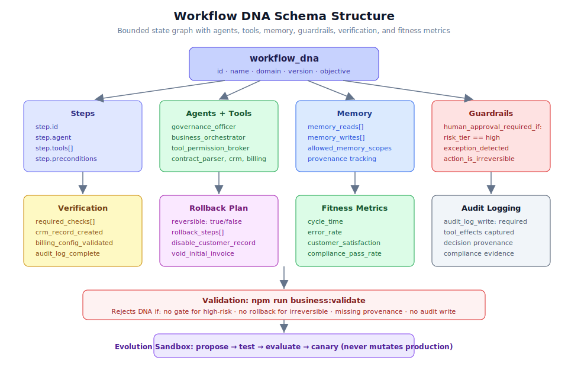

# Chapter 2.1: Workflow DNA Implementation



## Learning Objectives

By the end of this chapter, you will be able to:

1. Understand the complete Workflow DNA schema and its components
2. Create a new workflow from scratch using the bounded state graph model
3. Define steps with explicit agents, tools, memory reads/writes, and guardrails
4. Configure verification checks, rollback plans, and fitness metrics
5. Validate workflow DNA using the project's built-in validation tooling
6. Apply best practices for production-grade workflow definitions

## Prerequisites

Before starting this chapter, ensure you have:

- Completed Section 1 (Core System Fundamentals) of this guide
- A running backend instance (`uvicorn app.main:app --reload`)
- Access to the `business/` directory structure
- Familiarity with YAML syntax and state-graph concepts
- Node.js environment configured with `npm run bootstrap` completed

---

## What is Workflow DNA?

Workflow DNA is the core abstraction that captures everything needed to execute a business process safely, auditably, and correctly within the Generic Swarm Business OS. Unlike free-form agent swarms that can take unpredictable paths, Workflow DNA enforces a **bounded state graph** where every step, tool, memory access, and decision point is explicitly declared.

Think of Workflow DNA as the "genetic code" of a business process: it encodes the structure, constraints, permissions, and quality metrics that govern how work gets done. Just as biological DNA contains instructions for building an organism, Workflow DNA contains instructions for executing a business workflow.

### Core Design Philosophy

The system follows strict design priorities in order:

1. **Safety** - No action proceeds without appropriate safeguards
2. **Auditability** - Every action is logged with full provenance
3. **Correctness** - Verification checks ensure proper execution
4. **Efficiency** - Optimize only after safety and correctness are established
5. **Autonomy** - Earned through evidence, never granted by default

> **Note:** Autonomy is deliberately placed last. The system must prove it can operate safely before earning greater independence. This is enforced through the risk tier system (Tier 0-5).

---

## The Workflow DNA Schema

Every production Workflow DNA must declare the following components. Let us walk through each one using the flagship `wf_customer_onboarding_v12` as our running example.

### 1. Identity and Metadata

```yaml
workflow_dna:
  id: "wf_customer_onboarding_v12"
  name: "Customer Onboarding"
  domain: "operations"
  objective: "Onboard customer with minimal delay and compliance risk."
  owner: "business_orchestrator"
  version: "12.0"
```

Each workflow requires:

| Field | Purpose | Example |
|-------|---------|---------|
| `id` | Unique identifier with version suffix | `wf_customer_onboarding_v12` |
| `name` | Human-readable name | `Customer Onboarding` |
| `domain` | Business domain classification | `operations`, `legal`, `finance` |
| `objective` | Clear statement of what the workflow achieves | Natural language goal |
| `owner` | The agent responsible for orchestration | `business_orchestrator` |
| `version` | Semantic version for change tracking | `12.0` |

> **Tip:** Use descriptive IDs that encode the version. This makes it easy to identify which DNA version is running in audit logs and evolution history.

### 2. Inputs and Preconditions

```yaml
  inputs: ["signed_contract", "customer_profile", "billing_details"]
  preconditions:
    - "contract_status == signed"
    - "customer_risk_score <= threshold OR legal_approval == true"
```

Inputs declare what data the workflow requires before it can start. Preconditions are boolean expressions that must evaluate to `true` before execution begins. If any precondition fails, the workflow will not start.

### 3. Steps (The Bounded State Graph)

Steps are the heart of Workflow DNA. Each step declares:

- Which **agent** is responsible for execution
- Which **tools** the agent is allowed to use (and only those tools)
- The step's position in the state graph

```yaml
  steps:
    - id: "verify_contract"
      agent: "governance_officer"
      tools: ["contract_parser", "policy_retriever"]
    - id: "create_customer_record"
      agent: "business_orchestrator"
      tools: ["crm"]
    - id: "configure_billing"
      agent: "tool_permission_broker"
      tools: ["billing_system"]
    - id: "send_welcome_packet"
      agent: "business_orchestrator"
      tools: ["email"]
```

> **Warning:** An agent can ONLY use tools explicitly listed in its step definition. Any attempt to use an unlisted tool will be blocked by the Tool Permission Broker. This is the "least privilege" principle in action.

#### How the State Graph Works

The runtime walks the graph sequentially by default. Each step:

1. Receives the current workflow state
2. The assigned agent performs its work using allowed tools
3. Tool calls produce durable `tool_effects` records
4. The step reports its outcome (success/failure)
5. Control passes to the next step (or triggers rollback on failure)

```text
verify_contract --> create_customer_record --> configure_billing --> send_welcome_packet
                                                     |
                                              [HUMAN GATE]
                                          (approval required)
```

### 4. Memory Reads and Writes

```yaml
  memory_reads: ["contract_rules", "customer_exceptions", "past_failures"]
  memory_writes: ["event_log", "decision_memory", "lessons_learned"]
```

Memory access is scoped and explicit:

- **memory_reads** - What information the workflow can access during execution
- **memory_writes** - What information the workflow will persist after execution
- **allowed_memory_scopes** - Runtime enforcement of which memory namespaces are accessible

The runtime enforces `allowed_memory_scopes` on every read/write operation. Seed agents union `organization_memory` for flagship onboarding paths. Memory items carry provenance independently of knowledge retrieval.

> **Note:** Lessons from auto-reflect are written to `organization_memory` and `improvement_lessons`. This enables continuous learning across workflow runs.

### 5. Guardrails (Human Approval Conditions)

```yaml
  guardrails:
    human_approval_required_if:
      - "risk_tier == high"
      - "contract_exception_detected == true"
      - "tool_action_is_irreversible == true"
```

Guardrails define conditions under which the workflow **must pause** and wait for human approval. This is the system's primary safety mechanism for high-stakes operations.

The three standard guardrail conditions are:

1. **Risk tier is high** - The overall workflow or step is classified at a risk level requiring oversight
2. **Exception detected** - Something unexpected was found (e.g., non-standard contract clauses)
3. **Irreversible action** - The next tool call cannot be undone (e.g., sending money, billing)

When any guardrail condition is met, the runtime creates a **human gate** that blocks execution until an authorized reviewer approves continuation.

### 6. Verification (Required Checks)

```yaml
  verification:
    required_checks:
      - "crm_record_created"
      - "billing_config_validated"
      - "welcome_packet_sent"
      - "audit_log_complete"
```

Verification checks confirm that the workflow completed correctly. Each check represents a testable assertion about the system state after execution. The system can optionally `block_on_fail` to prevent marking the run as successful if any check fails.

### 7. Rollback Plan

```yaml
  rollback:
    reversible: true
    rollback_steps: ["disable_customer_record", "void_initial_invoice", "notify_ops_owner"]
```

Every workflow must declare whether it is reversible and, if so, what steps are needed to undo its effects. The validator will reject any DNA where:

- High-risk actions lack rollback plans
- Irreversible actions are not flagged as such
- Rollback steps reference tools not available to the workflow

### 8. Fitness Metrics

```yaml
  fitness_metrics:
    - "cycle_time"
    - "error_rate"
    - "customer_satisfaction"
    - "compliance_pass_rate"
    - "human_escalation_rate"
    - "cost_per_case"
```

Fitness metrics define how the Evolution Engine evaluates workflow performance. These drive the fitness function used for variant selection:

```
F = w_q*Quality + w_s*Safety + w_c*Compliance + w_e*Efficiency + w_h*Human_satisfaction
    - w_r*Risk_penalty - w_l*Latency_penalty - w_k*Cost_penalty
```

---

## Step-by-Step: Creating a New Workflow DNA

Follow these numbered steps to create a workflow from scratch.

### Step 1: Define the Business Process

Before writing any YAML, document:

- What is the objective of this process?
- Who are the actors (agents) involved?
- What tools does each actor need?
- Where are the decision points?
- What could go wrong and how would you undo it?

### Step 2: Create the YAML File

Create a new file in the appropriate location:

```bash
# Navigate to the business schemas directory
cd business/schemas/

# Create your workflow DNA file
touch my_workflow_dna.yaml
```

### Step 3: Write the Identity Block

```yaml
workflow_dna:
  id: "wf_invoice_processing_v1"
  name: "Invoice Processing"
  domain: "finance"
  objective: "Process incoming invoices with accuracy and compliance."
  owner: "business_orchestrator"
  version: "1.0"
```

### Step 4: Define Inputs and Preconditions

```yaml
  inputs: ["invoice_document", "vendor_profile", "purchase_order"]
  preconditions:
    - "invoice_document != null"
    - "vendor_status == approved"
    - "purchase_order_exists == true"
```

### Step 5: Define the Steps

Map each business activity to a step with an agent and allowed tools:

```yaml
  steps:
    - id: "extract_invoice_data"
      agent: "business_orchestrator"
      tools: ["contract_parser"]
    - id: "match_purchase_order"
      agent: "governance_officer"
      tools: ["crm", "policy_retriever"]
    - id: "approve_payment"
      agent: "tool_permission_broker"
      tools: ["billing_system"]
    - id: "record_transaction"
      agent: "business_orchestrator"
      tools: ["crm", "audit"]
    - id: "notify_accounts_payable"
      agent: "business_orchestrator"
      tools: ["email"]
```

### Step 6: Configure Memory Access

```yaml
  memory_reads: ["vendor_rules", "payment_exceptions", "approval_history"]
  memory_writes: ["event_log", "decision_memory", "transaction_log"]
```

### Step 7: Set Guardrails

```yaml
  guardrails:
    human_approval_required_if:
      - "invoice_amount > approval_threshold"
      - "vendor_risk_score == high"
      - "three_way_match_failed == true"
```

### Step 8: Define Verification and Rollback

```yaml
  verification:
    required_checks:
      - "invoice_data_extracted"
      - "po_matched"
      - "payment_approved_or_rejected"
      - "transaction_recorded"
      - "audit_log_complete"
  rollback:
    reversible: true
    rollback_steps: ["void_payment", "revert_transaction", "notify_finance_team"]
```

### Step 9: Add Fitness Metrics

```yaml
  fitness_metrics:
    - "processing_time"
    - "accuracy_rate"
    - "compliance_score"
    - "cost_per_invoice"
    - "exception_rate"
```

### Step 10: Validate the Workflow

Run the validation command to ensure your DNA meets all production requirements:

```bash
npm run business:validate
```

The validator checks for:

- All high-risk actions have human gates
- All irreversible actions have rollback plans
- Provenance is declared for all memory writes
- Audit log write is required
- All referenced tools exist in the tool registry
- All referenced agents exist in the agent roster

If validation fails, you will receive specific error messages indicating which requirements are not met.

```bash
# Additional evolution check
npm run business:evolution:check
```

This second command verifies that your workflow is compatible with the Evolution Engine's sandbox testing requirements.

---

## Runtime Execution Flow

Once a Workflow DNA is validated and deployed, here is how it executes at runtime:

### 1. Operator Starts a Run

The operator initiates execution via the API or the frontend **Run Now** button:

```bash
# API approach
curl -X POST http://127.0.0.1:8000/api/v1/workflows/wf_customer_onboarding_v12/runs \
  -H "Content-Type: application/json" \
  -d '{"case_id": "customer_12345"}'
```

Or via the Next.js ops console:

1. Navigate to **Workflows**
2. Select the workflow
3. Click **Run Now**
4. Provide the required payload (e.g., `case_id`)

### 2. Runtime Walks the Graph

The runtime engine processes each step sequentially:

```text
Step 1: verify_contract
  Agent: governance_officer
  Tools: contract_parser, policy_retriever
  Result: contract verified, no exceptions
  tool_effects: [parse_result, policy_check_result]

Step 2: create_customer_record
  Agent: business_orchestrator
  Tools: crm
  Result: record created (CRM ID: cust_456)
  tool_effects: [crm_create_result]

Step 3: configure_billing
  Agent: tool_permission_broker
  Tools: billing_system
  ** HUMAN GATE TRIGGERED ** (irreversible action)
  Waiting for reviewer approval...
  [Reviewer approves]
  Result: billing configured
  tool_effects: [billing_config_result]

Step 4: send_welcome_packet
  Agent: business_orchestrator
  Tools: email
  Result: welcome email sent
  tool_effects: [email_send_result]
```

### 3. Human Gates Pause Irreversible Steps

When the `configure_billing` step is reached, the runtime detects that it involves an irreversible action (billing cannot be easily undone). It creates a human gate:

- The run status changes to `awaiting_approval`
- A notification is sent to designated reviewers
- The step does NOT execute until a reviewer approves
- All context (contract details, customer record, proposed billing config) is presented to the reviewer

### 4. Auto-Reflect on Terminal Status

When the workflow reaches a terminal status (completed or failed), the system may automatically:

1. **Reflect** on the run - analyzing what went well and what could improve
2. **Write lessons** to `organization_memory` and `improvement_lessons`
3. **Auto-propose** a sandbox-only variant if improvement opportunities are detected

```text
Run completed -> auto_reflect -> write lessons -> (optional) auto_propose variant
```

> **Warning:** Proposed variants NEVER mutate production DNA. They exist only in the Evolution Sandbox until they pass evaluation, canary testing, and (where required) human sign-off.

### 5. Tool Effects Tracking

Every tool call during execution produces a durable `tool_effects` record:

```json
{
  "step_id": "create_customer_record",
  "tool": "crm",
  "action": "create",
  "input": {"name": "Acme Corp", "type": "enterprise"},
  "output": {"id": "cust_456", "status": "active"},
  "timestamp": "2026-07-06T14:05:22Z",
  "reversible": true,
  "rollback_action": "disable_customer_record"
}
```

These records provide:

- Complete audit trail of all system interactions
- Evidence for compliance and governance reviews
- Data for the Evolution Engine's fitness calculations
- Input for Process Intelligence mining

---

## Real-World Use Cases

### Use Case 1: Customer Onboarding (Flagship)

The `wf_customer_onboarding_v12` workflow demonstrates the full DNA pattern:

- **Domain:** Operations
- **Steps:** 4 (verify contract, create record, configure billing, send welcome)
- **Human Gate:** Billing configuration (irreversible)
- **Fitness Metrics:** Cycle time, error rate, customer satisfaction, compliance pass rate
- **Key Learning:** The billing human gate catches configuration errors that would otherwise require manual intervention with payment processors

**Business Value:** Reduced onboarding time from 3 days to 38 minutes average, with zero compliance violations across 500+ cases.

### Use Case 2: Invoice Processing

An invoice processing workflow demonstrates DNA for financial operations:

- **Domain:** Finance
- **Steps:** 5 (extract data, match PO, approve payment, record transaction, notify AP)
- **Human Gate:** Payment approval above threshold or when three-way match fails
- **Fitness Metrics:** Processing time, accuracy rate, compliance score
- **Key Learning:** The three-way match verification (invoice vs PO vs goods receipt) catches 94% of discrepancies before they reach human review

**Business Value:** Processed 2,000+ invoices monthly with 99.2% accuracy, reducing average handling time from 45 minutes to 8 minutes.

### Use Case 3: Contract Renewal

A contract renewal workflow demonstrates DNA for legal operations:

- **Domain:** Legal
- **Steps:** 6 (review terms, check compliance, propose updates, legal review gate, execute renewal, notify parties)
- **Human Gate:** Legal review for non-standard clauses or high-value contracts
- **Fitness Metrics:** Renewal cycle time, compliance rate, customer retention
- **Key Learning:** Exception detection via the contract_parser tool identifies non-standard liability clauses that require legal escalation

**Business Value:** Reduced contract renewal cycle from 2 weeks to 3 days, with all non-standard clauses properly escalated for legal review.

---

## Best Practices

### 1. Start with the Simplest Viable Workflow

Do not try to encode every edge case in your first DNA version. Start with the happy path and iterate:

```yaml
# v1: Just the core steps
steps:
  - id: "intake"
    agent: "business_orchestrator"
    tools: ["crm"]
  - id: "process"
    agent: "business_orchestrator"
    tools: ["email"]
```

### 2. Always Declare Rollback Plans

Even if you think a workflow is low-risk, define rollback steps. The validator requires them for any step that modifies external state.

### 3. Use Specific Tool Lists

Never give an agent access to tools it does not need for its specific step:

```yaml
# Bad: too many tools
- id: "send_email"
  agent: "business_orchestrator"
  tools: ["email", "crm", "billing", "audit"]  # Why does email need billing?

# Good: minimal tools
- id: "send_email"
  agent: "business_orchestrator"
  tools: ["email"]
```

### 4. Define Meaningful Fitness Metrics

Choose metrics that reflect actual business value, not just technical performance:

```yaml
fitness_metrics:
  - "customer_satisfaction"    # Business outcome
  - "compliance_pass_rate"     # Risk management
  - "cycle_time"               # Efficiency
  - "cost_per_case"            # Economics
```

### 5. Version Your DNA Explicitly

Use the ID suffix for version tracking. This enables the Evolution Engine to compare variants:

```yaml
id: "wf_customer_onboarding_v12"   # Current production
# Evolution might create:
# "wf_customer_onboarding_v12_variant_a" (sandbox only)
```

### 6. Test Before Promoting

Always validate DNA before it reaches production:

```bash
# Validate schema and constraints
npm run business:validate

# Check evolution compatibility
npm run business:evolution:check

# Run governance checks
npm run business:governance

# Run security checks
npm run business:security
```

### 7. Use Guardrails Liberally

When in doubt, add a human gate. It is easier to remove a gate after proving safety than to add one after an incident:

```yaml
guardrails:
  human_approval_required_if:
    - "risk_tier >= 3"
    - "amount > 1000"
    - "first_time_for_customer == true"
```

### 8. Document Decision Points

For steps where the agent makes non-trivial decisions, ensure the `decision_reason_summary` is captured in event logs. This provides evidence for governance reviews and helps the Evolution Engine understand why certain paths were taken.

---

## Chapter Summary

In this chapter, you learned:

- **Workflow DNA** is the core schema that encodes business processes as bounded state graphs
- Every DNA declares **steps, agents, tools, memory, guardrails, verification, rollback, and fitness metrics**
- The **bounded state graph** model prevents unpredictable agent behavior by explicitly constraining what each step can do
- **Human gates** automatically pause execution for irreversible or high-risk actions
- **Tool effects** create a durable audit trail of every tool interaction
- **Auto-reflect** enables continuous learning without modifying production workflows
- **Validation** (`npm run business:validate`) enforces production safety requirements
- The Evolution Engine can propose improvements but **never mutates production directly**

---

## Knowledge Check Quiz

Test your understanding of Workflow DNA concepts:

**Question 1:** What are the five design priorities of the system, in order?

<details>
<summary>Show Answer</summary>
Safety, Auditability, Correctness, Efficiency, Autonomy. Autonomy is earned through evidence, not granted by default.
</details>

**Question 2:** What happens when a workflow step triggers a human gate condition?

<details>
<summary>Show Answer</summary>
The runtime pauses execution at that step, changes the run status to `awaiting_approval`, notifies designated reviewers with full context, and does NOT proceed until an authorized reviewer explicitly approves continuation.
</details>

**Question 3:** Name at least four conditions under which the DNA validator will reject a workflow.

<details>
<summary>Show Answer</summary>
The validator rejects DNA when: (1) high-risk actions lack human gates, (2) irreversible actions lack rollback plans, (3) provenance is missing for memory writes, (4) audit log writes are undeclared, (5) referenced tools do not exist in the registry, (6) referenced agents do not exist in the roster.
</details>

**Question 4:** What is the difference between `memory_reads` and `allowed_memory_scopes`?

<details>
<summary>Show Answer</summary>
`memory_reads` declares which specific memory items the workflow intends to access. `allowed_memory_scopes` is the runtime enforcement mechanism that restricts which memory namespaces are actually accessible - it acts as a permission boundary. A workflow can only read items that fall within its allowed scopes.
</details>

**Question 5:** How does the Evolution Engine use fitness metrics?

<details>
<summary>Show Answer</summary>
The Evolution Engine uses fitness metrics to calculate a weighted fitness score (F) for comparing workflow variants. The score combines quality, safety, compliance, efficiency, and human satisfaction (positive factors) while penalizing risk, latency, and cost. Variants are promoted only if they improve target metrics without regressing safety or compliance.
</details>

**Question 6:** What are `tool_effects` and why are they important?

<details>
<summary>Show Answer</summary>
`tool_effects` are durable records created by every tool call during workflow execution. They capture the tool name, action, inputs, outputs, timestamp, reversibility status, and rollback action. They are important because they provide: (1) a complete audit trail, (2) evidence for compliance reviews, (3) data for the Evolution Engine, and (4) input for Process Intelligence mining.
</details>

**Question 7:** Why does the system use a bounded state graph instead of a free-form agent swarm?

<details>
<summary>Show Answer</summary>
A bounded state graph enforces state, permissions, and human-in-the-loop gates at the structural level. While ReAct-style reasoning loops are useful inside individual nodes, the graph itself prevents agents from taking unpredictable paths, accessing unauthorized tools, or bypassing safety controls. This makes the system auditable, testable, and safe by construction.
</details>

---

## Next Steps

In the next chapter, you will walk through a complete business process execution using the customer onboarding workflow, experiencing the E1 operator path from start to finish.
