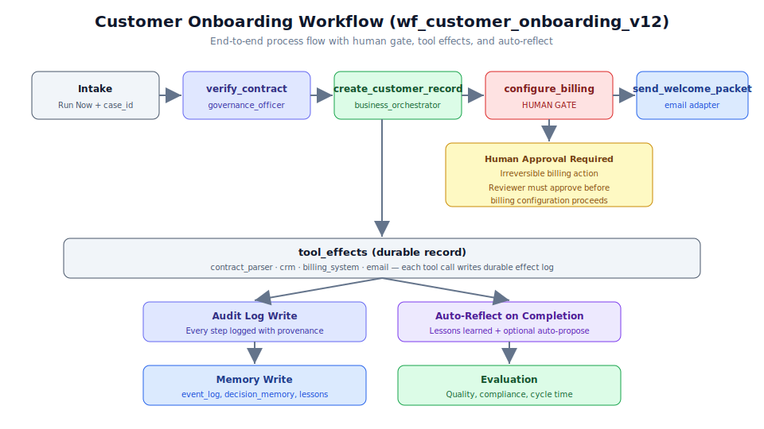

# 第 2.2 章：業務流程實戰演練



## 學習目標

完成本章後，你將能夠：

1. 端到端執行旗艦客戶入職工作流程
2. 理解從登入到改進的 E1 操作員路徑
3. 以審查人員身份處理人工閘門審批
4. 在運行後檢視審計日誌、記憶體寫入和工具效果
5. 觸發自我改進管線（反思、提議、評估、灰度）
6. 導航運行詳情檢視和演化族群檔案

## 先決條件

開始本章之前，請確保你已經：

- 完成第 2.1 章（工作流程 DNA 實作）
- 有一個正在運行的後端實例位於 `http://127.0.0.1:8000`
- 有一個正在運行的前端實例位於 `http://localhost:3000`
- 已配置登入憑證（預設：`admin@example.com` / `admin-password`）
- 已載入旗艦工作流程 `wf_customer_onboarding_v12`（通過 `npm run business:init`）

---

## E1 操作員路徑

E1（端到端操作員）路徑是證明整個系統從登入到自我改進正常運作的參考演練。它演練了：

- 認證和會話管理
- 工作流程列表和選擇
- 使用真實負載的運行執行
- 人工閘門審批工作流程
- 審計日誌檢視
- 記憶體和評估審查
- 自我改進管線啟動

> **備註：** E1 路徑由自動化測試 `test_e1_operator_path` 覆蓋。你在此演練中所做的一切都映射了該測試以程式方式驗證的內容。

---

## 逐步指南：完整入職演練

### 步驟 1：登入系統

存取操作控制台並認證：

```bash
# Via the frontend (recommended)
# Navigate to http://localhost:3000
# Enter credentials:
#   Email: admin@example.com
#   Password: admin-password
```

或者，通過 API 認證：

```bash
# Password login returns cookie gso_access_token + session user cookie
curl -X POST http://127.0.0.1:8000/api/v1/auth/login \
  -H "Content-Type: application/json" \
  -d '{
    "email": "admin@example.com",
    "password": "admin-password"
  }'
```

回應設定：

- `gso_access_token` cookie 用於會話認證
- 包含角色資訊的會話使用者 cookie

> **提示：** 對於基於 curl 的測試，靜態 bearer token（`admin-token`）僅可用於冒煙測試。始終優先使用密碼登入進行真實測試。

### 步驟 2：列出可用工作流程

登入後，檢視可用的工作流程：

**前端：**
1. 從側邊欄導航至 **Workflows** 頁面
2. 你應該看到 `wf_customer_onboarding_v12` 及其元資料

**API：**
```bash
curl http://127.0.0.1:8000/api/v1/workflows \
  -H "Cookie: gso_access_token=<your_token>"
```

預期回應包括：

```json
{
  "workflows": [
    {
      "id": "wf_customer_onboarding_v12",
      "name": "Customer Onboarding",
      "domain": "operations",
      "version": "12.0",
      "status": "active"
    }
  ]
}
```

### 步驟 3：列出可用代理程式

檢視參與工作流程的代理程式：

**前端：**
1. 導航至 **Agents** 頁面
2. 審查代理程式的能力和分配的角色

**API：**
```bash
curl http://127.0.0.1:8000/api/v1/agents \
  -H "Cookie: gso_access_token=<your_token>"
```

入職工作流程的關鍵代理程式：

| 代理程式 | 在入職中的角色 |
|-------|-------------------|
| `governance_officer` | 根據政策驗證合約 |
| `business_orchestrator` | 建立記錄、發送歡迎包 |
| `tool_permission_broker` | 管理帶閘門的帳單配置 |

### 步驟 4：啟動運行（立即運行）

使用有效負載執行旗艦工作流程：

**前端：**
1. 在 Workflows 頁面，點擊 `wf_customer_onboarding_v12`
2. 點擊 **Run Now** 按鈕
3. 輸入負載：`{"case_id": "customer_12345"}`
4. 確認執行

**API：**
```bash
curl -X POST http://127.0.0.1:8000/api/v1/workflows/wf_customer_onboarding_v12/runs \
  -H "Content-Type: application/json" \
  -H "Cookie: gso_access_token=<your_token>" \
  -d '{
    "case_id": "customer_12345"
  }'
```

> **警告：** `case_id` 欄位對旗艦工作流程是必需的。省略它將導致驗證錯誤。每個 case_id 應該是唯一的，以避免與現有記錄衝突。

預期回應：

```json
{
  "run_id": "run_abc123",
  "workflow_id": "wf_customer_onboarding_v12",
  "status": "running",
  "case_id": "customer_12345",
  "started_at": "2026-07-06T14:00:00Z"
}
```

### 步驟 5：觀察步驟執行

運行時遍歷受限狀態圖的每個步驟。你可以即時觀察進度：

**前端：**
1. 運行詳情檢視顯示每個步驟的狀態
2. 觀察步驟從 `pending` 轉變到 `running` 再到 `completed`

**API（輪詢狀態）：**
```bash
curl http://127.0.0.1:8000/api/v1/workflows/wf_customer_onboarding_v12/runs/run_abc123 \
  -H "Cookie: gso_access_token=<your_token>"
```

#### 步驟執行詳情

**步驟 1：verify_contract**

```json
{
  "step_id": "verify_contract",
  "agent": "governance_officer",
  "tools_used": ["contract_parser", "policy_retriever"],
  "status": "completed",
  "tool_effects": [
    {
      "tool": "contract_parser",
      "action": "parse",
      "result": "contract_valid",
      "clauses_extracted": 12,
      "exceptions_found": 0
    },
    {
      "tool": "policy_retriever",
      "action": "check_compliance",
      "result": "compliant",
      "policies_checked": ["standard_liability", "data_protection"]
    }
  ],
  "duration_ms": 2340
}
```

**步驟 2：create_customer_record**

```json
{
  "step_id": "create_customer_record",
  "agent": "business_orchestrator",
  "tools_used": ["crm"],
  "status": "completed",
  "tool_effects": [
    {
      "tool": "crm",
      "action": "create",
      "result": "record_created",
      "record_id": "cust_456",
      "reversible": true,
      "rollback_action": "disable_customer_record"
    }
  ],
  "duration_ms": 1890
}
```

**步驟 3：configure_billing**（暫停 - 人工閘門）

```json
{
  "step_id": "configure_billing",
  "agent": "tool_permission_broker",
  "tools_used": [],
  "status": "awaiting_approval",
  "gate_reason": "tool_action_is_irreversible",
  "gate_context": {
    "action": "configure billing for customer_12345",
    "amount": "standard_plan",
    "irreversible": true,
    "requires_reviewer_role": true
  }
}
```

### 步驟 6：審批人工閘門

當帳單步驟觸發其人工閘門時，審查人員必須審批：

**前端：**
1. 導航至 **Approvals** 頁面（或查看通知）
2. 審查 `configure_billing` 的待審批項目
3. 檢查上下文：提議了甚麼操作、為何需要審批
4. 點擊 **Approve** 允許步驟繼續

**API：**
```bash
curl -X POST http://127.0.0.1:8000/api/v1/approvals/gate_billing_123/approve \
  -H "Content-Type: application/json" \
  -H "Cookie: gso_access_token=<your_token>" \
  -d '{
    "reviewer_notes": "Verified billing configuration matches contract terms.",
    "approved": true
  }'
```

> **提示：** 審查人員應驗證提議的帳單配置是否與已簽署的合約條款匹配。閘門上下文提供做出此決定所需的所有資訊。

審批後，帳單步驟執行：

```json
{
  "step_id": "configure_billing",
  "status": "completed",
  "tool_effects": [
    {
      "tool": "billing_system",
      "action": "configure",
      "result": "billing_active",
      "plan": "standard",
      "first_invoice_date": "2026-08-01",
      "reversible": false
    }
  ],
  "approved_by": "admin@example.com",
  "approved_at": "2026-07-06T14:12:00Z"
}
```

**步驟 4：send_welcome_packet**

帳單配置完成後，最終步驟發送歡迎包：

```json
{
  "step_id": "send_welcome_packet",
  "agent": "business_orchestrator",
  "tools_used": ["email"],
  "status": "completed",
  "tool_effects": [
    {
      "tool": "email",
      "action": "send",
      "result": "delivered",
      "recipient": "customer_12345@example.com",
      "template": "welcome_packet_v3"
    }
  ],
  "duration_ms": 1200
}
```

### 步驟 7：檢視審計日誌

運行完成後，審查完整的審計軌跡：

**前端：**
1. 在運行詳情頁面，點擊 **Audit Log** 標籤
2. 審查每個帶有時間戳、參與者和結果的記錄事件

**API：**
```bash
curl http://127.0.0.1:8000/api/v1/audit/runs/run_abc123 \
  -H "Cookie: gso_access_token=<your_token>"
```

審計日誌包含以下條目：

- 運行啟動（誰啟動的、何時、使用甚麼負載）
- 每個步驟執行（代理程式、使用的工具、持續時間、結果）
- 人工閘門建立和解決（誰審批的、何時、附帶甚麼備註）
- 工具效果（每次外部系統互動）
- 記憶體讀取和寫入
- 驗證檢查結果
- 最終運行狀態

### 步驟 8：審查記憶體和評估

已完成的運行寫入了幾個記憶體項目：

**記憶體寫入：**

```bash
# View memory items for this run
curl http://127.0.0.1:8000/api/v1/memory?run_id=run_abc123 \
  -H "Cookie: gso_access_token=<your_token>"
```

預期的記憶體條目：

| 記憶體類型 | 內容 |
|-------------|---------|
| `event_log` | 所有步驟的原始操作日誌 |
| `decision_memory` | 帳單為何被審批（審查人員的理由） |
| `lessons_learned` | 自動反思輸出（如果啟用） |

**評估：**

```bash
# View evaluation metrics
curl http://127.0.0.1:8000/api/v1/evaluations?run_id=run_abc123 \
  -H "Cookie: gso_access_token=<your_token>"
```

捕捉的評估指標：

```json
{
  "run_id": "run_abc123",
  "workflow_id": "wf_customer_onboarding_v12",
  "metrics": {
    "quality_score": 0.94,
    "compliance_pass_rate": 1.0,
    "average_cycle_time_minutes": 12,
    "escalation_rate": 0.25,
    "unauthorized_tool_attempts": 0,
    "cost_per_case_usd": 0.38
  }
}
```

### 步驟 9：審查流程摘要

檢視此次運行如何貢獻於流程智能：

```bash
curl http://127.0.0.1:8000/api/v1/processes/summary \
  -H "Cookie: gso_access_token=<your_token>"
```

流程摘要顯示：

- 此工作流程已執行多少次
- 所有運行的平均週期時間
- 符合率（實際 vs 預期路徑）
- 瓶頸識別（哪個步驟耗時最長）
- 常見例外模式

### 步驟 10：觸發自我改進管線

從運行詳情頁面，你可以啟動改進循環：

**前端：**
1. 在運行詳情頁面，點擊 **Improve**
2. 從以下選擇：**Reflect**、**Run full pipeline** 或單獨步驟

**API - 逐步操作：**

```bash
# Step 1: Reflect on the completed run
curl -X POST http://127.0.0.1:8000/api/v1/improvement/reflect/run_abc123 \
  -H "Cookie: gso_access_token=<your_token>"
```

反思步驟分析運行並產出經驗教訓：

```json
{
  "run_id": "run_abc123",
  "lessons": [
    {
      "observation": "Billing gate added 8 minutes to cycle time",
      "suggestion": "Pre-validate billing config in verify_contract step",
      "confidence": 0.72,
      "risk_level": "low"
    }
  ]
}
```

```bash
# Step 2: View accumulated lessons
curl http://127.0.0.1:8000/api/v1/improvement/lessons \
  -H "Cookie: gso_access_token=<your_token>"
```

```bash
# Step 3: Auto-propose a variant based on lessons
curl -X POST http://127.0.0.1:8000/api/v1/improvement/auto-propose \
  -H "Cookie: gso_access_token=<your_token>"
```

自動提議建立一個**僅限沙盒**的變體：

```json
{
  "variant_id": "wf_customer_onboarding_v12_variant_a",
  "status": "sandbox_only",
  "changes": [
    "Added pre-validation of billing configuration in verify_contract step",
    "Reduced expected gate wait time by 40%"
  ],
  "requires_evaluation": true
}
```

```bash
# Step 4: Run the evaluation loop
curl -X POST http://127.0.0.1:8000/api/v1/loops/run \
  -H "Content-Type: application/json" \
  -H "Cookie: gso_access_token=<your_token>" \
  -d '{
    "variant_id": "wf_customer_onboarding_v12_variant_a",
    "test_set": "golden_onboarding_cases"
  }'
```

```bash
# Step 5: View the evolution archive
curl http://127.0.0.1:8000/api/v1/evolution/archive \
  -H "Cookie: gso_access_token=<your_token>"
```

### 步驟 11：探索演化族群檔案

導航至演化頁面：

**前端：**
1. 從側邊欄導航至 `/app/evolution`
2. 檢視顯示所有變體的族群檔案
3. 將變體適應度分數與正式環境基線進行比較
4. 識別有資格進行灰度部署的變體

演化檔案追蹤：

- 所有提議的變體及其譜系
- 每個變體的適應度分數
- 哪些變體通過了評估
- 哪些變體進行了灰度部署
- 哪些變體被推廣或退役

---

## 深入理解 tool_effects

工作流程執行期間的每次工具互動都會產生一個 `tool_effects` 記錄。這是審計和治理最重要的概念之一。

### tool_effects 結構

```json
{
  "effect_id": "eff_789",
  "run_id": "run_abc123",
  "step_id": "create_customer_record",
  "tool": "crm",
  "action": "create",
  "input": {
    "name": "Acme Corp",
    "type": "enterprise",
    "contract_id": "contract_001"
  },
  "output": {
    "record_id": "cust_456",
    "status": "active",
    "created_at": "2026-07-06T14:05:22Z"
  },
  "timestamp": "2026-07-06T14:05:22Z",
  "reversible": true,
  "rollback_action": "disable_customer_record",
  "latency_ms": 450,
  "agent": "business_orchestrator"
}
```

### 為何 tool_effects 重要

1. **審計合規** - 每次外部系統變更都被記錄
2. **回復能力** - 如果後續步驟失敗，之前的效果可以被逆轉
3. **流程智能** - 挖掘 tool_effects 揭示實際的系統行為
4. **演化資料** - 適應度函數使用效果資料來評分變體
5. **事件調查** - 當出問題時，tool_effects 顯示確切發生了甚麼

> **備註：** 工具效果持久儲存在 Postgres 控制平面中。即使工作流程運行被刪除，它們也會持續存在，確保審計完整性。

---

## 實際應用案例

### 案例 1：多地區客戶入職

一家全球公司在不同合規要求的地區使用入職工作流程：

- **美國地區：** 標準流程，帳單閘門設定在 $10,000 以上
- **歐盟地區：** 額外的 GDPR 資料處理協議步驟，所有資料儲存都需人工閘門
- **亞太地區：** 針對本地合約格式修改的驗證步驟

每個地區使用基礎 DNA 的變體，演化引擎追蹤哪些地區修改效能最佳。

**關鍵洞察：** 受限狀態圖允許在同一框架內進行地區自訂，同時在所有地區維護治理標準。

### 案例 2：大量 SaaS 入職

一家 SaaS 公司每天處理 200+ 客戶入職：

- 大多數是低風險（標準方案、已驗證身份）且無需人工閘門即可通過
- 只有 12% 觸發帳單閘門（企業方案或自訂定價）
- 自動反思識別出 85% 的閘門審批是立即的，建議可以調整門檻
- 演化引擎提議一個僅在 $50,000 以上才設閘門的變體（減少 60% 的閘門頻率）

**關鍵洞察：** 適應度指標（cycle_time、escalation_rate）量化了閘門的成本，使得能夠基於證據決定何時需要閘門。

### 案例 3：合規密集的金融入職

一家金融服務公司需要廣泛的 KYC/AML 檢查：

- **額外步驟：** identity_verification、sanctions_check、risk_scoring、compliance_review
- **多重閘門：** 身份驗證（人工）、制裁匹配（升級）、大額交易
- **延伸記憶體：** 監管決策儲存 7 年保留期
- **嚴格適應度：** 合規通過率的權重是效率的 3 倍

**關鍵洞察：** DNA 結構通過加入步驟和閘門來適應高度監管的工作流程，而無需更改底層執行引擎。

---

## 最佳實踐

### 1. 使用有意義的 case_id 值

`case_id` 是你在系統中追蹤業務流程實例的主鍵：

```json
// Good: descriptive and traceable
{"case_id": "onb_acme_corp_2026_q3"}

// Bad: opaque
{"case_id": "12345"}
```

### 2. 及時審查閘門

人工閘門會阻止工作流程進度。建立閘門審查的 SLA：

- **低風險閘門：** 1 小時內審查
- **中風險閘門：** 4 小時內審查
- **高風險閘門：** 1 個工作日內審查

### 3. 每次運行後檢視 tool_effects

養成審查 tool_effects 的習慣，特別是：

- 首次工作流程執行
- 結果出乎意料的運行
- 觸發閘門的運行

### 4. 定期運行改進管線

不要等到出現問題才觸發改進。每 10-20 次成功運行後：

1. 反思近期運行
2. 審查累積的經驗教訓
3. 考慮自動提議的建議是否值得評估

### 5. 監控演化檔案

每週查看演化檔案以：

- 識別有前景的變體
- 審查灰度部署結果
- 退役未改進指標的變體

### 6. 追蹤流程智能趨勢

PI 層揭示單次運行中不可見的模式：

- 瓶頸時間增加可能表示流程退化
- 符合率下降可能表示工作流程漂移
- 新的例外模式可能需要 DNA 更新

### 7. 記錄閘門決策

審批或拒絕人工閘門時，始終提供有意義的審查人員備註：

```json
{
  "approved": true,
  "reviewer_notes": "Verified billing matches contract section 4.2. Standard enterprise plan."
}
```

這些備註會輸入到決策記憶體中，並幫助演化引擎理解審批模式。

---

## 本章總結

在本章中，你演練了：

- **E1 操作員路徑**端到端：登入、列出工作流程、使用負載運行、審批閘門、檢視結果、改進
- 旗艦**客戶入職工作流程**如何逐步執行
- **人工閘門**如何為不可逆操作暫停執行並需要審查人員審批
- **tool_effects** 如何建立所有系統互動的持久審計軌跡
- **自動反思**如何從完成的運行中產生經驗教訓
- **自我改進管線**（反思、提議、評估、灰度）如何演化工作流程
- **演化族群檔案**如何追蹤所有變體及其適應度

E1 路徑證明系統作為整合整體運作：從認證通過執行通過治理通過自我改進。

---

## 知識檢查測驗

測試你對業務流程執行的理解：

**問題 1：** 旗艦客戶入職工作流程的必需負載欄位是甚麼？

<details>
<summary>顯示答案</summary>
`case_id` 欄位是必需的。範例：`{"case_id": "customer_12345"}`。沒有有效的 case_id，工作流程將不會啟動。
</details>

**問題 2：** 在入職工作流程中，人工閘門在哪個步驟觸發，為甚麼？

<details>
<summary>顯示答案</summary>
人工閘門在 `configure_billing` 步驟觸發，因為帳單配置是不可逆操作（防護條件 `tool_action_is_irreversible == true` 被滿足）。審查人員必須在帳單系統配置前審批。
</details>

**問題 3：** 自我改進管線的四個步驟是甚麼？

<details>
<summary>顯示答案</summary>
反思（分析運行並提取經驗教訓）、提議（自動產生僅限沙盒的變體）、評估（針對黃金任務和迴歸套件測試變體）、灰度（部署到小範圍並在失敗時自動回復）。如果所有條件通過，可選擇性地跟進推廣。
</details>

**問題 4：** 在防護機制上下文中，`tool_action_is_irreversible == true` 代表甚麼？

<details>
<summary>顯示答案</summary>
它表示正在嘗試的工具呼叫在執行後無法撤銷。對於帳單配置，一旦帳單方案設定並開始發票週期，就無法簡單地還原。這觸發人工閘門以確保人類在執行前審查和審批該操作。
</details>

**問題 5：** 當人工閘門被觸發時，審查人員看到甚麼資訊？

<details>
<summary>顯示答案</summary>
審查人員看到閘門上下文，包括：提議了甚麼操作、為何需要審批（gate_reason）、建議變更的具體詳情（金額、方案、客戶）、操作是否不可逆，以及所有先前步驟的結果。這使得能夠做出知情的審批決定。
</details>

**問題 6：** 自動提議建立變體後會發生甚麼？

<details>
<summary>顯示答案</summary>
變體以 `status: sandbox_only` 建立。它必須通過評估（針對黃金任務、迴歸測試、對抗性測試的測試）、可能的灰度部署，以及人工簽核（如果風險等級要求），才能被推廣到正式環境。變體絕不會直接修改正式環境。
</details>

**問題 7：** 系統如何防止提議的變體意外到達正式環境？

<details>
<summary>顯示答案</summary>
多重保障：(1) 變體預設以 `sandbox_only` 狀態建立，(2) 演化管理器在架構上被禁止直接修改正式環境，(3) 推廣需要通過所有迴歸和對抗性測試，(4) 高風險變體需要人工簽核，(5) 灰度部署在指標迴歸時自動回復，(6) `business:validate` 和 `activate_workflow_version` 強制執行正式環境 DNA 安全檢查。
</details>

---

## 下一步

在下一章中，你將學習如何配置和使用驅動工作流程執行的工具適配器，包括其權限模型、效果追蹤和失敗關閉行為。
