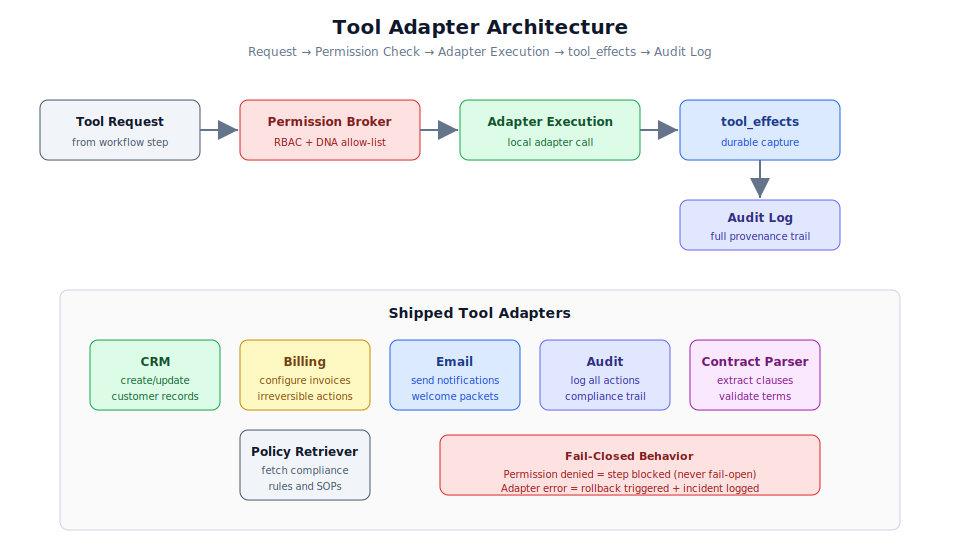

# 第 2.3 章：工具適配器整合



## 學習目標

完成本章後，你將能夠：

1. 理解工具適配器的架構及其在工作流程執行中的角色
2. 配置六個已內建的工具適配器（CRM、billing、email、audit、contract_parser、policy_retriever）
3. 使用工具權限代理實作權限範圍
4. 追蹤和檢視 tool_effects 以用於審計和合規
5. 使用失敗關閉行為模式處理適配器故障
6. 設定適配器與外部系統之間的基本整合

## 先決條件

開始本章之前，請確保你已經：

- 完成第 2.1 和 2.2 章
- 有一個正在運行且具有資料庫連接的後端實例
- 理解工作流程 DNA 步驟定義（代理程式和工具）
- 熟悉 REST API 模式和 JSON 負載

---

## 甚麼是工具適配器？

工具適配器是工作流程代理程式與外部系統之間的介面。它們為代理程式與業務工具（如 CRM 系統、帳單平台、電郵服務和合規資料庫）的互動提供受控、可審計、權限範圍化的機制。

系統中的每個工具適配器都遵循嚴格的執行模式：

```text
Request -> Permission Check -> Adapter Execution -> tool_effects Capture -> Audit Log -> Response
```

此模式確保：

1. **無未授權存取** - 權限代理驗證每個請求
2. **完全可審計** - 每次互動都帶有來源記錄
3. **持久效果** - 所有結果都被捕捉為 tool_effects
4. **失敗關閉安全** - 錯誤阻止執行而非允許靜默失敗

> **警告：** 工具適配器目前實作為具有持久 `tool_effects` 的**本地適配器**。與外部 CRM/email/billing SaaS 平台的即時連接是未來增強功能。無論是本地執行還是對接即時系統，適配器介面都是相同的。

---

## 權限模型

### 工具權限代理

工具權限代理是所有工具存取的守門人。在任何適配器執行之前，代理驗證：

1. **DNA 允許列表** - 此工具是否列在當前步驟的 `tools[]` 陣列中？
2. **RBAC 檢查** - 執行代理程式是否具有所需角色？
3. **閘門檢查** - 此操作是否需要先獲得人工審批？
4. **範圍驗證** - 操作是否在代理程式允許的範圍內？

```text
Agent Request
    |
    v
[DNA Allow-List] -- tool not in step.tools[] --> BLOCKED
    |
    v (tool allowed)
[RBAC Check] -- agent lacks permission --> BLOCKED
    |
    v (role valid)
[Gate Check] -- irreversible/high-risk --> HUMAN GATE
    |
    v (approved or not gated)
[Scope Validation] -- out of scope --> BLOCKED
    |
    v (in scope)
[Adapter Execution]
```

### 權限範圍規則

每個適配器都有定義允許操作的權限範圍：

| 適配器 | 讀取操作 | 寫入操作 | 需要閘門 |
|---------|----------------|------------------|---------------|
| `crm` | 查詢記錄、搜尋 | 建立、更新、停用 | 建立/停用：無閘門（可逆） |
| `billing` | 檢視方案、發票 | 配置、作廢 | 配置：閘門（不可逆） |
| `email` | 檢視模板 | 發送 | 發送到外部：閘門 |
| `audit` | 查詢日誌 | 寫入條目 | 無閘門（僅追加） |
| `contract_parser` | 解析、提取 | 無 | 無閘門（只讀） |
| `policy_retriever` | 查詢政策 | 無 | 無閘門（只讀） |

> **備註：** DNA 工具、RBAC 角色和閘門條件的交集決定了代理程式實際能做甚麼。代理程式必須同時滿足全部三者才能執行工具操作。

---

## 內建工具適配器

### 1. CRM 適配器

CRM 適配器在工作流程生命週期中管理客戶記錄。

**功能：**

```yaml
adapter: crm
operations:
  - create: Create new customer records
  - read: Query existing records by ID or criteria
  - update: Modify record fields
  - disable: Soft-delete (reversible deactivation)
  - search: Full-text search across records
```

**API 範例：**

```bash
# Create a customer record (via workflow step)
# This happens automatically when the step executes
# The tool_effects record shows:
{
  "tool": "crm",
  "action": "create",
  "input": {
    "name": "Acme Corporation",
    "type": "enterprise",
    "contract_id": "contract_001",
    "region": "us-east"
  },
  "output": {
    "record_id": "cust_456",
    "status": "active",
    "created_at": "2026-07-06T14:05:22Z"
  },
  "reversible": true,
  "rollback_action": "disable_customer_record"
}
```

**配置：**

```yaml
# Tool adapter configuration
crm:
  adapter_type: "local"
  storage: "postgres"
  operations_allowed: ["create", "read", "update", "disable", "search"]
  requires_gate_for: []
  reversible_operations: ["create", "update", "disable"]
  rollback_mapping:
    create: "disable"
    update: "restore_previous"
    disable: "enable"
```

### 2. 帳單適配器

帳單適配器管理財務操作，包括方案配置和發票管理。

**功能：**

```yaml
adapter: billing
operations:
  - configure: Set up billing plans and schedules
  - view_plan: Read current plan details
  - view_invoices: List invoice history
  - void: Cancel a pending invoice (limited window)
```

**API 範例：**

```bash
# Configure billing (requires human gate approval first)
{
  "tool": "billing",
  "action": "configure",
  "input": {
    "customer_id": "cust_456",
    "plan": "enterprise_standard",
    "billing_cycle": "monthly",
    "start_date": "2026-08-01"
  },
  "output": {
    "billing_id": "bill_789",
    "status": "active",
    "first_invoice_date": "2026-08-01",
    "amount": 2500.00
  },
  "reversible": false,
  "gate_required": true,
  "approved_by": "admin@example.com"
}
```

> **警告：** 帳單配置被標記為**不可逆**，因為一旦發票週期開始，逆轉它需要與支付處理器進行人工干預。這就是為何它始終觸發人工閘門。

**配置：**

```yaml
billing:
  adapter_type: "local"
  storage: "postgres"
  operations_allowed: ["configure", "view_plan", "view_invoices", "void"]
  requires_gate_for: ["configure"]
  reversible_operations: ["void"]
  irreversible_operations: ["configure"]
  rollback_mapping:
    void: "reinstate_invoice"
```

### 3. 電郵適配器

電郵適配器處理所有對外通訊。

**功能：**

```yaml
adapter: email
operations:
  - send: Send templated emails
  - view_templates: List available templates
  - preview: Generate email preview without sending
```

**API 範例：**

```bash
# Send welcome packet email
{
  "tool": "email",
  "action": "send",
  "input": {
    "recipient": "contact@acme.com",
    "template": "welcome_packet_v3",
    "variables": {
      "customer_name": "Acme Corporation",
      "account_manager": "Jane Smith",
      "portal_url": "https://portal.example.com/acme"
    }
  },
  "output": {
    "message_id": "msg_012",
    "status": "delivered",
    "sent_at": "2026-07-06T14:15:00Z"
  },
  "reversible": false
}
```

**配置：**

```yaml
email:
  adapter_type: "local"
  storage: "postgres"
  operations_allowed: ["send", "view_templates", "preview"]
  requires_gate_for: []
  reversible_operations: []
  templates_path: "business/materials/email-templates/"
```

### 4. 審計適配器

審計適配器為合規和治理提供僅追加式日誌記錄。

**功能：**

```yaml
adapter: audit
operations:
  - write: Append an audit entry
  - query: Search audit history
  - export: Generate audit reports
```

**API 範例：**

```bash
# Write audit entry (happens automatically for every step)
{
  "tool": "audit",
  "action": "write",
  "input": {
    "event_type": "workflow_step_completed",
    "workflow_id": "wf_customer_onboarding_v12",
    "step_id": "verify_contract",
    "actor": "governance_officer",
    "outcome": "success",
    "evidence": ["contract_valid", "policy_compliant"]
  },
  "output": {
    "audit_id": "aud_345",
    "timestamp": "2026-07-06T14:03:00Z",
    "immutable": true
  },
  "reversible": false
}
```

> **備註：** 審計適配器在設計上是僅追加的。一旦條目寫入，就無法修改或刪除。這確保了治理審查的審計軌跡完整性。

**配置：**

```yaml
audit:
  adapter_type: "local"
  storage: "postgres"
  operations_allowed: ["write", "query", "export"]
  requires_gate_for: []
  reversible_operations: []
  retention_days: 2555  # 7 years for compliance
  immutable: true
```

### 5. 合約解析器適配器

合約解析器從合約文件中提取結構化資訊。

**功能：**

```yaml
adapter: contract_parser
operations:
  - parse: Extract clauses and terms from a contract document
  - validate: Check contract against standard templates
  - extract_clauses: Return specific clause types
  - identify_exceptions: Flag non-standard terms
```

**API 範例：**

```bash
# Parse a contract document
{
  "tool": "contract_parser",
  "action": "parse",
  "input": {
    "document_id": "doc_contract_v3",
    "extract_types": ["liability", "data_protection", "termination", "pricing"]
  },
  "output": {
    "clauses_found": 12,
    "exceptions": [],
    "standard_compliance": true,
    "risk_flags": [],
    "parsed_at": "2026-07-06T14:02:00Z"
  },
  "reversible": true
}
```

**配置：**

```yaml
contract_parser:
  adapter_type: "local"
  storage: "memory"
  operations_allowed: ["parse", "validate", "extract_clauses", "identify_exceptions"]
  requires_gate_for: []
  reversible_operations: ["parse", "validate", "extract_clauses", "identify_exceptions"]
  read_only: true
```

### 6. 政策檢索器適配器

政策檢索器查詢合規政策資料庫以獲取相關規則和標準作業程序。

**功能：**

```yaml
adapter: policy_retriever
operations:
  - query: Search policies by topic or keyword
  - check_compliance: Validate an action against applicable policies
  - list_applicable: Return all policies for a given domain/action
```

**API 範例：**

```bash
# Check compliance for a billing action
{
  "tool": "policy_retriever",
  "action": "check_compliance",
  "input": {
    "domain": "billing",
    "action": "configure_enterprise_plan",
    "context": {
      "customer_type": "enterprise",
      "contract_value": 250000,
      "region": "eu"
    }
  },
  "output": {
    "compliant": true,
    "policies_checked": [
      "enterprise_billing_policy_v2",
      "eu_data_protection_billing",
      "financial_controls_sop"
    ],
    "requirements_met": ["legal_review_complete", "risk_score_acceptable"],
    "warnings": []
  },
  "reversible": true
}
```

**配置：**

```yaml
policy_retriever:
  adapter_type: "local"
  storage: "memory"
  operations_allowed: ["query", "check_compliance", "list_applicable"]
  requires_gate_for: []
  reversible_operations: ["query", "check_compliance", "list_applicable"]
  read_only: true
  policy_sources:
    - "business/knowledge-base/rules/"
    - "business/materials/regulations/"
    - "business/materials/sops/"
```

---

## 效果追蹤系統

### tool_effects 如何被捕捉

每次適配器呼叫都會產生一個持久化到 Postgres 控制平面的 `tool_effects` 記錄：

```json
{
  "effect_id": "eff_unique_id",
  "run_id": "run_abc123",
  "step_id": "create_customer_record",
  "workflow_id": "wf_customer_onboarding_v12",
  "tool": "crm",
  "action": "create",
  "input": { },
  "output": { },
  "timestamp": "2026-07-06T14:05:22Z",
  "duration_ms": 450,
  "agent": "business_orchestrator",
  "reversible": true,
  "rollback_action": "disable_customer_record",
  "status": "success"
}
```

### 查詢 tool_effects

```bash
# Get all effects for a run
curl http://127.0.0.1:8000/api/v1/workflows/wf_customer_onboarding_v12/runs/run_abc123/effects \
  -H "Cookie: gso_access_token=<your_token>"

# Get effects for a specific tool
curl "http://127.0.0.1:8000/api/v1/tool-effects?tool=crm&run_id=run_abc123" \
  -H "Cookie: gso_access_token=<your_token>"
```

### 效果生命週期

```text
1. Agent requests tool action
2. Permission Broker validates
3. Adapter executes action
4. Effect record created (status: success/failure)
5. Effect persisted to Postgres
6. Audit log entry appended
7. If step fails later: rollback uses effect records to determine undo actions
```

---

## 失敗關閉行為

工具適配器系統的關鍵設計原則是**失敗關閉行為**：當出錯時，系統阻止進一步執行，而非允許潛在不安全的操作繼續。

### 失敗關閉的含義

| 情境 | 行為 |
|----------|----------|
| 權限拒絕 | 步驟被阻止，運行暫停 |
| 適配器執行錯誤 | 步驟失敗，觸發回復 |
| 超時 | 步驟失敗，記錄事件 |
| 無效輸入 | 執行前步驟被阻止 |
| 外部系統不可達 | 步驟失敗，帶退避重試 |

### 失敗關閉 vs 失敗開放

```text
Fail-Closed (this system):
  Error -> Block execution -> Log incident -> Await human resolution
  Result: No unintended actions ever occur

Fail-Open (NEVER used):
  Error -> Continue with default/empty result -> Risk unintended consequences
  Result: Potentially dangerous state changes
```

> **警告：** 系統絕不會失敗開放。如果工具適配器無法成功且安全地完成其操作，步驟會失敗，工作流程要麼重試（帶退避）要麼暫停等待人工干預。

### 錯誤處理模式

```python
# Conceptual adapter execution pattern
def execute_tool_action(step, action, input_data):
    # 1. Permission check (fail-closed)
    if not permission_broker.validate(step, action):
        raise PermissionDenied(f"Tool {action.tool} not permitted for step {step.id}")

    # 2. Gate check (pause if required)
    if requires_human_gate(step, action):
        pause_for_approval(step, action)
        return  # Execution resumes after approval

    # 3. Execute adapter (fail-closed on error)
    try:
        result = adapter.execute(action, input_data)
    except AdapterError as e:
        log_incident(step, action, e)
        trigger_rollback(step)
        raise StepFailed(f"Adapter error: {e}")

    # 4. Record effect (always, even on failure)
    record_tool_effect(step, action, input_data, result)

    # 5. Audit log (always)
    write_audit_entry(step, action, result)

    return result
```

### 適配器故障的事件回應

當適配器故障時：

1. 步驟被標記為 `failed`
2. 建立包含完整上下文的事件記錄
3. 評估先前已完成步驟的回復步驟
4. 通知事件指揮官代理程式
5. 人類操作員可以審查事件並決定解決方案

---

## 設定基本整合

### 步驟 1：註冊新工具適配器

要向系統加入新的工具適配器：

```yaml
# business/schemas/tool-adapters/my_new_tool.yaml
adapter:
  id: "my_new_tool"
  name: "My New Tool"
  type: "local"
  description: "Integrates with XYZ system"
  operations:
    - id: "action_one"
      description: "Performs action one"
      reversible: true
      rollback: "undo_action_one"
    - id: "action_two"
      description: "Performs action two"
      reversible: false
      requires_gate: true
  permissions:
    roles_required: ["operator", "admin"]
    scopes: ["read", "write"]
```

### 步驟 2：定義權限規則

```yaml
# Permission configuration for the new tool
permissions:
  tool_id: "my_new_tool"
  allowed_agents: ["business_orchestrator", "governance_officer"]
  gate_conditions:
    - "action == 'action_two'"
    - "risk_tier >= 4"
  scope_limits:
    max_records_per_call: 100
    allowed_domains: ["operations"]
```

### 步驟 3：在工作流程 DNA 中參考

```yaml
steps:
  - id: "use_new_tool"
    agent: "business_orchestrator"
    tools: ["my_new_tool"]
```

### 步驟 4：驗證整合

```bash
# Validate that the tool is properly registered
npm run business:validate

# Run security checks on tool permissions
npm run business:security
```

---

## 實際應用案例

### 案例 1：多工具工作流程步驟

一個按順序使用多個工具的合約審查步驟：

```yaml
- id: "comprehensive_contract_review"
  agent: "governance_officer"
  tools: ["contract_parser", "policy_retriever", "crm"]
```

代理程式：
1. 使用 `contract_parser` 提取條款
2. 使用 `policy_retriever` 根據政策檢查每個條款
3. 使用 `crm` 驗證客戶歷史和風險概況
4. 每次工具呼叫產生自己的 tool_effects 記錄

**結果：** 三個 tool_effects 記錄提供了審查流程的完整審計軌跡。

### 案例 2：條件式工具使用

根據合約發現使用不同工具的代理程式：

```yaml
- id: "handle_contract_exceptions"
  agent: "governance_officer"
  tools: ["contract_parser", "policy_retriever", "email", "audit"]
```

如果合約解析器發現例外：
- `policy_retriever` 檢查例外是否已預先批准
- 如果未預先批准：觸發人工閘門
- `email` 通知法律團隊待審查
- `audit` 記錄例外偵測

**結果：** 受限工具列表確保代理程式即使在處理例外時也無法存取未授權的工具。

### 案例 3：部分失敗後的回復

步驟 1 和 2 成功後步驟 3 失敗的工作流程：

```text
Step 1: create_customer_record (CRM) - SUCCESS
Step 2: configure_notifications (email) - SUCCESS
Step 3: configure_billing (billing) - FAILED (external system down)
```

回復流程：
1. 系統讀取步驟 1 和 2 的 tool_effects
2. 執行步驟 2 的回復：取消通知偏好
3. 執行步驟 1 的回復：停用客戶記錄
4. 將所有回復操作記錄為新的 tool_effects
5. 記錄事件以供人工審查

**結果：** 系統回到乾淨狀態，同時擁有原始操作及其回復的完整審計軌跡。

---

## 最佳實踐

### 1. 盡可能使用只讀適配器

優先使用 `contract_parser` 和 `policy_retriever`（只讀）而非具有寫入能力的工具。只讀工具本質上是安全的，絕不需要閘門。

### 2. 定義細粒度的回復操作

每個寫入操作都應有具體的、經過測試的回復：

```yaml
rollback_mapping:
  create: "disable"          # Not "delete" - preserve audit trail
  update: "restore_previous" # Keep history
  configure: "void"          # Explicit cancellation
```

### 3. 設定保守的閘門門檻

從所有寫入操作都設閘門開始，然後根據證據放寬：

```yaml
# Start conservative
requires_gate_for: ["create", "update", "configure", "send"]

# After evidence shows safety (e.g., 100+ successful executions)
requires_gate_for: ["configure"]  # Only irreversible actions
```

### 4. 監控適配器延遲

追蹤 tool_effects 中的 `duration_ms` 以識別效能退化：

- CRM 操作：預期 < 500ms
- 帳單操作：預期 < 2000ms
- 電郵操作：預期 < 1000ms
- 解析器操作：預期 < 3000ms（取決於文件）

### 5. 明確測試適配器故障

在評估測試中包含失敗情境：

```yaml
# Golden task: adapter timeout
test_case:
  scenario: "crm_adapter_timeout"
  expected_behavior: "step_fails_and_triggers_rollback"
  expected_tool_effects: ["timeout_recorded", "rollback_initiated"]
```

### 6. 絕不繞過權限代理

所有工具存取必須通過權限代理，即使是偵錯：

```bash
# Wrong: direct adapter call bypasses permissions
# adapter.execute("crm", "create", {...})

# Correct: go through the workflow execution engine
# which enforces permission broker validation
```

---

## 本章總結

在本章中，你學習了：

- **工具適配器**是代理程式與外部系統之間的受控介面
- **權限代理**根據 DNA 允許列表、RBAC、閘門和範圍驗證每個工具請求
- 內建六個適配器：**CRM、billing、email、audit、contract_parser、policy_retriever**
- **tool_effects** 將每次適配器互動捕捉為持久、可審計的記錄
- 系統使用**失敗關閉行為** - 錯誤阻止執行，絕不靜默失敗
- **回復計劃**使用 tool_effects 在故障發生時逆轉先前的操作
- 適配器目前作為**本地適配器**運行，即時 SaaS 整合是未來增強功能

---

## 知識檢查測驗

測試你對工具適配器整合的理解：

**問題 1：** 權限代理在允許工具操作之前執行哪四項檢查？

<details>
<summary>顯示答案</summary>
(1) DNA 允許列表 - 工具是否列在步驟的 tools[] 陣列中，(2) RBAC 檢查 - 代理程式是否具有所需角色，(3) 閘門檢查 - 操作是否需要人工審批，(4) 範圍驗證 - 操作是否在代理程式允許的範圍內。全部四項都必須通過操作才能繼續。
</details>

**問題 2：** 哪些工具適配器是只讀的，為何這很重要？

<details>
<summary>顯示答案</summary>
`contract_parser` 和 `policy_retriever` 是只讀的。這很重要因為只讀工具本質上是安全的（它們無法修改狀態）、絕不需要人工閘門、始終可逆（無需撤銷）且風險最低。它們可以在沒有治理開銷的情況下自由使用。
</details>

**問題 3：** 在工具適配器的上下文中，「失敗關閉」是甚麼意思？

<details>
<summary>顯示答案</summary>
失敗關閉意味着當任何錯誤發生時（權限拒絕、適配器故障、超時、無效輸入），系統阻止進一步執行而非以預設或空結果繼續。步驟失敗，可能觸發回復，事件被記錄以供人工審查。系統絕不會失敗開放（儘管有錯誤仍繼續）。
</details>

**問題 4：** 為何帳單配置被標記為不可逆？

<details>
<summary>顯示答案</summary>
帳單配置是不可逆的，因為一旦帳單方案啟動並開始發票週期，逆轉它需要與支付處理器的人工干預、潛在的退款和會計調整。這些無法安全地自動化，因此該操作在執行前觸發強制性人工閘門。
</details>

**問題 5：** 當後續步驟失敗時，系統如何處理回復？

<details>
<summary>顯示答案</summary>
系統讀取所有先前已完成步驟的 tool_effects 記錄，然後以相反順序執行每個效果定義的 rollback_action。每個回復操作本身被記錄為新的 tool_effect，建立原始操作及其逆轉的完整審計軌跡。事件指揮官被通知以供人工審查。
</details>

**問題 6：** tool_effects 與演化引擎之間有甚麼關係？

<details>
<summary>顯示答案</summary>
演化引擎使用 tool_effects 資料計算工作流程變體的適應度指標。效果記錄提供延遲、成功率、成本和結果的資料，這些輸入到適應度函數中。這使得能夠基於證據比較變體而非主觀評估。
</details>

---

## 下一步

在下一章中，你將學習如何使用流程智能層來分析事件日誌、發現流程、檢查符合性並識別業務營運中的瓶頸。
