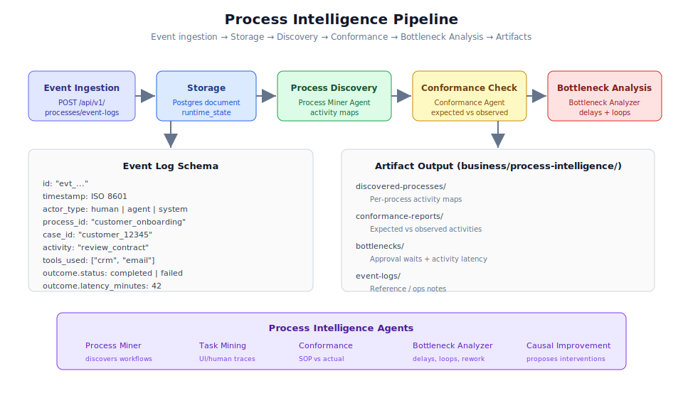

# Chapter 2.4: Process Intelligence Usage



## Learning Objectives

By the end of this chapter, you will be able to:

1. Ingest event logs into the Process Intelligence layer using the API
2. Understand the event log schema and its required fields
3. Use PI APIs to discover processes, check conformance, and analyze bottlenecks
4. Navigate the PI artifact folder structure under `business/process-intelligence/`
5. Work with the PI agents (Process Miner, Conformance, Bottleneck Analyzer)
6. Generate and interpret PI artifacts for operational improvement

## Prerequisites

Before starting this chapter, ensure you have:

- Completed Chapters 2.1 through 2.3
- A running backend instance with Postgres connectivity
- At least one completed workflow run (from Chapter 2.2)
- Understanding of workflow execution and tool_effects

---

## What is Process Intelligence?

Process Intelligence (PI) is the analytical layer that learns from **actual operational traces** rather than documented procedures alone. While Workflow DNA defines how work *should* happen, PI reveals how work *actually* happens by analyzing event logs from real executions.

The PI layer answers critical questions:

- **Discovery:** What processes are actually running? What paths do they take?
- **Conformance:** Do actual executions match the defined workflows?
- **Bottlenecks:** Where are the delays, loops, and handoff failures?
- **Improvement:** What interventions would most improve outcomes?

> **Note:** Process Intelligence is inspired by the Process Mining Manifesto (IEEE Task Force on Process Mining). It applies academic process mining techniques to the agent-driven business operating system.

---

## The PI Pipeline

The Process Intelligence pipeline follows this flow:

```text
POST /api/v1/processes/event-logs
  -> store event in runtime (Postgres document)
  -> recompute discovered processes, conformance, bottlenecks
  -> write JSON under business/process-intelligence/
  -> upsert pi_artifacts collection
```

Each event ingestion triggers a cascade of analytics that updates the PI artifact collection. This means PI insights are always current and reflect the latest operational data.

---

## Event Log Schema

Every event submitted to the PI layer must conform to this schema:

```yaml
event:
  id: "evt_..."
  timestamp: "2026-07-06T14:03:00Z"
  actor_type: "human | agent | system"
  actor_id: "user_or_agent_id"
  process_id: "customer_onboarding"
  case_id: "customer_12345"
  activity: "review_contract"
  input_refs: ["doc_contract_v3"]
  output_refs: ["approval_decision_789"]
  tools_used: ["crm", "email"]
  decision_point: true
  decision_reason_summary: "Contract had non-standard liability clause."
  confidence: 0.82
  risk_tier: "tier_3_execute_reversible"
  human_approved: true
  outcome:
    status: "completed"
    latency_minutes: 42
    quality_score: 0.94
```

### Field Descriptions

| Field | Type | Required | Description |
|-------|------|----------|-------------|
| `id` | string | Yes | Unique event identifier (prefix: `evt_`) |
| `timestamp` | ISO 8601 | Yes | When the event occurred |
| `actor_type` | enum | Yes | Who performed it: `human`, `agent`, or `system` |
| `actor_id` | string | Yes | Identifier of the actor |
| `process_id` | string | Yes | Which process this belongs to |
| `case_id` | string | Yes | Specific case/instance identifier |
| `activity` | string | Yes | What activity was performed |
| `input_refs` | array | No | References to input documents/data |
| `output_refs` | array | No | References to outputs produced |
| `tools_used` | array | No | Tools involved in this activity |
| `decision_point` | boolean | No | Whether this was a decision point |
| `decision_reason_summary` | string | No | Rationale for the decision |
| `confidence` | float | No | Confidence level (0.0-1.0) |
| `risk_tier` | string | No | Risk classification of the action |
| `human_approved` | boolean | No | Whether a human approved this action |
| `outcome.status` | string | Yes | Result: `completed`, `failed`, `pending` |
| `outcome.latency_minutes` | number | No | Time taken for this activity |
| `outcome.quality_score` | float | No | Quality metric (0.0-1.0) |

> **Tip:** Include as many optional fields as possible. The more context each event carries, the richer the PI analytics will be. Decision points and confidence scores are particularly valuable for bottleneck analysis.

---

## Step-by-Step: Ingesting Event Logs

### Step 1: Submit a Single Event

```bash
curl -X POST http://127.0.0.1:8000/api/v1/processes/event-logs \
  -H "Content-Type: application/json" \
  -H "Cookie: gso_access_token=<your_token>" \
  -d '{
    "id": "evt_001",
    "timestamp": "2026-07-06T14:00:00Z",
    "actor_type": "agent",
    "actor_id": "governance_officer",
    "process_id": "customer_onboarding",
    "case_id": "customer_12345",
    "activity": "verify_contract",
    "tools_used": ["contract_parser", "policy_retriever"],
    "decision_point": false,
    "outcome": {
      "status": "completed",
      "latency_minutes": 2,
      "quality_score": 0.98
    }
  }'
```

### Step 2: Submit a Batch of Events (Full Case)

To provide PI with a complete case history, submit events for all steps:

```bash
# Event 1: Contract verification
curl -X POST http://127.0.0.1:8000/api/v1/processes/event-logs \
  -H "Content-Type: application/json" \
  -H "Cookie: gso_access_token=<your_token>" \
  -d '{
    "id": "evt_001",
    "timestamp": "2026-07-06T14:00:00Z",
    "actor_type": "agent",
    "actor_id": "governance_officer",
    "process_id": "customer_onboarding",
    "case_id": "customer_12345",
    "activity": "verify_contract",
    "tools_used": ["contract_parser", "policy_retriever"],
    "outcome": {"status": "completed", "latency_minutes": 2, "quality_score": 0.98}
  }'

# Event 2: Record creation
curl -X POST http://127.0.0.1:8000/api/v1/processes/event-logs \
  -H "Content-Type: application/json" \
  -H "Cookie: gso_access_token=<your_token>" \
  -d '{
    "id": "evt_002",
    "timestamp": "2026-07-06T14:02:00Z",
    "actor_type": "agent",
    "actor_id": "business_orchestrator",
    "process_id": "customer_onboarding",
    "case_id": "customer_12345",
    "activity": "create_customer_record",
    "tools_used": ["crm"],
    "outcome": {"status": "completed", "latency_minutes": 1, "quality_score": 0.95}
  }'

# Event 3: Billing configuration (with human gate)
curl -X POST http://127.0.0.1:8000/api/v1/processes/event-logs \
  -H "Content-Type: application/json" \
  -H "Cookie: gso_access_token=<your_token>" \
  -d '{
    "id": "evt_003",
    "timestamp": "2026-07-06T14:03:00Z",
    "actor_type": "human",
    "actor_id": "reviewer_admin",
    "process_id": "customer_onboarding",
    "case_id": "customer_12345",
    "activity": "configure_billing",
    "tools_used": ["billing_system"],
    "decision_point": true,
    "decision_reason_summary": "Billing config matches contract section 4.2.",
    "human_approved": true,
    "risk_tier": "tier_4_execute_with_gate",
    "outcome": {"status": "completed", "latency_minutes": 8, "quality_score": 0.92}
  }'

# Event 4: Welcome packet
curl -X POST http://127.0.0.1:8000/api/v1/processes/event-logs \
  -H "Content-Type: application/json" \
  -H "Cookie: gso_access_token=<your_token>" \
  -d '{
    "id": "evt_004",
    "timestamp": "2026-07-06T14:11:00Z",
    "actor_type": "agent",
    "actor_id": "business_orchestrator",
    "process_id": "customer_onboarding",
    "case_id": "customer_12345",
    "activity": "send_welcome_packet",
    "tools_used": ["email"],
    "outcome": {"status": "completed", "latency_minutes": 1, "quality_score": 0.99}
  }'
```

### Step 3: Verify Event Storage

```bash
# Retrieve stored events
curl http://127.0.0.1:8000/api/v1/processes/event-logs \
  -H "Cookie: gso_access_token=<your_token>"
```

### Step 4: Trigger Analytics Recomputation

Event ingestion automatically triggers recomputation, but you can also query the current state:

```bash
# View process summary
curl http://127.0.0.1:8000/api/v1/processes/summary \
  -H "Cookie: gso_access_token=<your_token>"
```

---

## PI APIs Reference

### Event Log Management

| Method | Endpoint | Purpose |
|--------|----------|---------|
| `POST` | `/api/v1/processes/event-logs` | Ingest a new event |
| `GET` | `/api/v1/processes/event-logs` | Retrieve stored events |

### Analytics Endpoints

| Method | Endpoint | Purpose |
|--------|----------|---------|
| `GET` | `/api/v1/processes/discovered` | View discovered process models |
| `GET` | `/api/v1/processes/conformance` | View conformance reports |
| `GET` | `/api/v1/processes/bottlenecks` | View bottleneck analysis |
| `GET` | `/api/v1/processes/summary` | View overall PI summary |
| `GET` | `/api/v1/processes/artifacts` | List all generated artifacts |

### Using the Discovery API

```bash
# Discover processes from accumulated event logs
curl http://127.0.0.1:8000/api/v1/processes/discovered \
  -H "Cookie: gso_access_token=<your_token>"
```

Expected response:

```json
{
  "discovered_processes": [
    {
      "process_id": "customer_onboarding",
      "activity_count": 4,
      "case_count": 15,
      "activities": [
        "verify_contract",
        "create_customer_record",
        "configure_billing",
        "send_welcome_packet"
      ],
      "common_paths": [
        {
          "path": ["verify_contract", "create_customer_record", "configure_billing", "send_welcome_packet"],
          "frequency": 0.87
        },
        {
          "path": ["verify_contract", "create_customer_record", "send_welcome_packet"],
          "frequency": 0.13,
          "note": "billing skipped for free-tier customers"
        }
      ]
    }
  ]
}
```

### Using the Conformance API

```bash
# Check conformance against defined workflows
curl http://127.0.0.1:8000/api/v1/processes/conformance \
  -H "Cookie: gso_access_token=<your_token>"
```

Expected response:

```json
{
  "conformance_reports": [
    {
      "process_id": "customer_onboarding",
      "expected_flow": ["verify_contract", "create_customer_record", "configure_billing", "send_welcome_packet"],
      "conformance_rate": 0.87,
      "deviations": [
        {
          "case_id": "customer_678",
          "deviation_type": "skipped_activity",
          "activity_skipped": "configure_billing",
          "reason": "free_tier_customer",
          "severity": "low"
        },
        {
          "case_id": "customer_901",
          "deviation_type": "extra_activity",
          "extra_activity": "escalate_to_legal",
          "reason": "non_standard_contract_clause",
          "severity": "medium"
        }
      ]
    }
  ]
}
```

### Using the Bottleneck API

```bash
# Analyze bottlenecks
curl http://127.0.0.1:8000/api/v1/processes/bottlenecks \
  -H "Cookie: gso_access_token=<your_token>"
```

Expected response:

```json
{
  "bottleneck_analysis": [
    {
      "process_id": "customer_onboarding",
      "bottlenecks": [
        {
          "activity": "configure_billing",
          "type": "approval_wait",
          "avg_latency_minutes": 8.5,
          "p95_latency_minutes": 45,
          "contributing_factors": [
            "human_gate_approval_required",
            "reviewer_availability"
          ],
          "suggested_intervention": "Pre-validate billing in verify_contract step to reduce gate frequency"
        },
        {
          "activity": "verify_contract",
          "type": "activity_latency",
          "avg_latency_minutes": 2.3,
          "p95_latency_minutes": 12,
          "contributing_factors": [
            "complex_contract_parsing",
            "multiple_policy_checks"
          ],
          "suggested_intervention": "Cache frequently-used policy results"
        }
      ]
    }
  ]
}
```

---

## PI Artifact Folders

The PI layer writes durable JSON artifacts to the file system under `business/process-intelligence/`:

| Path | Content |
|------|---------|
| `business/process-intelligence/discovered-processes/` | Per-process activity maps |
| `business/process-intelligence/conformance-reports/` | Expected vs observed activities |
| `business/process-intelligence/bottlenecks/` | Approval waits + activity latency |
| `business/process-intelligence/event-logs/` | Reference / ops notes |

### Example Artifact: Discovered Process

```json
// business/process-intelligence/discovered-processes/customer_onboarding.json
{
  "process_id": "customer_onboarding",
  "discovered_at": "2026-07-06T15:00:00Z",
  "version": 3,
  "activity_map": {
    "nodes": [
      {"id": "verify_contract", "agent": "governance_officer", "avg_duration_min": 2.3},
      {"id": "create_customer_record", "agent": "business_orchestrator", "avg_duration_min": 1.1},
      {"id": "configure_billing", "agent": "tool_permission_broker", "avg_duration_min": 8.5},
      {"id": "send_welcome_packet", "agent": "business_orchestrator", "avg_duration_min": 0.8}
    ],
    "edges": [
      {"from": "verify_contract", "to": "create_customer_record", "frequency": 1.0},
      {"from": "create_customer_record", "to": "configure_billing", "frequency": 0.87},
      {"from": "create_customer_record", "to": "send_welcome_packet", "frequency": 0.13},
      {"from": "configure_billing", "to": "send_welcome_packet", "frequency": 1.0}
    ]
  },
  "total_cases_analyzed": 45,
  "avg_total_cycle_time_min": 12.7
}
```

### Example Artifact: Conformance Report

```json
// business/process-intelligence/conformance-reports/customer_onboarding_2026_q3.json
{
  "process_id": "customer_onboarding",
  "report_period": "2026-Q3",
  "generated_at": "2026-07-06T15:00:00Z",
  "conformance_rate": 0.87,
  "total_cases": 45,
  "conforming_cases": 39,
  "deviation_categories": {
    "skipped_activity": 4,
    "extra_activity": 2,
    "reordered_activities": 0,
    "repeated_activity": 0
  }
}
```

### Example Artifact: Bottleneck Report

```json
// business/process-intelligence/bottlenecks/customer_onboarding_current.json
{
  "process_id": "customer_onboarding",
  "analyzed_at": "2026-07-06T15:00:00Z",
  "cases_analyzed": 45,
  "identified_bottlenecks": [
    {
      "activity": "configure_billing",
      "bottleneck_type": "approval_wait",
      "severity": "medium",
      "avg_wait_minutes": 8.5,
      "impact_on_total_cycle": 0.67,
      "recommendation": "Pre-validate billing config to reduce gate triggers"
    }
  ]
}
```

---

## PI Agents

The Process Intelligence layer is implemented as a set of specialized services (not independent LLM agents) that analyze event data:

### Process Miner Agent

**Purpose:** Discovers real workflows from event log patterns.

- Analyzes event sequences across cases
- Identifies common activity paths
- Detects process variants (alternative paths)
- Updates discovered process models incrementally

### Conformance Agent

**Purpose:** Compares actual work against documented SOPs and Workflow DNA.

- Maps observed paths to expected DNA step sequences
- Identifies deviations: skipped steps, extra steps, reordering
- Classifies deviation severity
- Generates conformance reports per process

### Bottleneck Analyzer Agent

**Purpose:** Finds delays, loops, rework, and handoff failures.

- Calculates activity duration statistics (avg, p50, p95, max)
- Identifies approval waits as bottleneck contributors
- Detects loops (activities repeated within a case)
- Identifies handoff delays between agents
- Proposes interventions ranked by expected impact

### Task Mining Agent

**Purpose:** Observes UI/human-level steps where permitted.

- Captures human interaction patterns
- Identifies manual steps that could be automated
- Measures human task durations for baseline comparison

### Causal Improvement Agent

**Purpose:** Proposes interventions likely to improve outcomes.

- Analyzes correlations between process variations and outcomes
- Generates hypotheses about causal factors
- Proposes sandbox experiments to test interventions
- Tracks experiment results for learning

---

## Step-by-Step: Generating PI Artifacts

### Step 1: Ensure Sufficient Event Data

PI analytics require a minimum number of events to produce meaningful results. For reliable discovery:

- At least 5 cases per process
- At least 3 activities per case
- Events spanning multiple time periods

### Step 2: Ingest Events via API

Use the POST endpoint to submit events (as shown earlier).

### Step 3: Check Discovery Results

```bash
curl http://127.0.0.1:8000/api/v1/processes/discovered \
  -H "Cookie: gso_access_token=<your_token>"
```

### Step 4: Run Conformance Check

```bash
curl http://127.0.0.1:8000/api/v1/processes/conformance \
  -H "Cookie: gso_access_token=<your_token>"
```

### Step 5: Analyze Bottlenecks

```bash
curl http://127.0.0.1:8000/api/v1/processes/bottlenecks \
  -H "Cookie: gso_access_token=<your_token>"
```

### Step 6: Review Generated Artifacts

```bash
# List all PI artifacts
ls business/process-intelligence/

# View discovered processes
cat business/process-intelligence/discovered-processes/customer_onboarding.json

# View conformance reports
cat business/process-intelligence/conformance-reports/

# View bottleneck analysis
cat business/process-intelligence/bottlenecks/
```

### Step 7: Use Artifacts API

```bash
curl http://127.0.0.1:8000/api/v1/processes/artifacts \
  -H "Cookie: gso_access_token=<your_token>"
```

---

## Code Reference

The PI implementation lives in:

| Path | Purpose |
|------|---------|
| `backend/app/infrastructure/process_intelligence/artifacts.py` | Core artifact generation |
| Runtime `_refresh_pi_artifacts` | Triggered on each event ingest |
| `test_p3_pi_evolution.py` | PI evolution integration tests |
| Scorecard event ingest tests | Verify PI pipeline integrity |

---

## Real-World Use Cases

### Use Case 1: Identifying Approval Bottlenecks

A company discovers through PI that the billing human gate adds an average of 8.5 minutes to each onboarding cycle. However, 92% of gates are approved within 30 seconds when the reviewer is available.

**PI Insight:** The bottleneck is not the gate decision itself but reviewer availability. The suggested intervention: implement an auto-escalation that routes to backup reviewers after 5 minutes.

**Result:** After implementing the escalation, p95 gate latency dropped from 45 minutes to 8 minutes.

### Use Case 2: Detecting Process Drift

PI conformance analysis reveals that 13% of onboarding cases skip the billing configuration step. Investigation shows these are free-tier customers being processed through the enterprise workflow.

**PI Insight:** The workflow DNA does not account for the free-tier path. A conformance deviation that looked like an error is actually a legitimate business variant.

**Result:** The team creates a separate DNA variant for free-tier onboarding, improving conformance rate to 98% and reducing cycle time for free-tier cases by 6 minutes.

### Use Case 3: Correlating Quality and Latency

PI analysis shows a correlation: cases where `verify_contract` takes longer than 5 minutes have a 3x higher `quality_score` on the final outcome. The Causal Improvement Agent hypothesizes that thorough contract review catches issues early, preventing downstream problems.

**PI Insight:** The "bottleneck" in contract verification is actually providing value. Optimizing it away would reduce quality.

**Result:** The team adjusts the fitness function to weight quality higher than pure cycle time for the contract verification step.

---

## Best Practices

### 1. Ingest All Available Events

Do not filter events before ingestion. PI works best with complete case histories:

```bash
# Good: submit all activities including minor ones
# Bad: only submit "important" activities
```

### 2. Include Decision Context

Always populate `decision_point`, `decision_reason_summary`, and `confidence` when applicable. These fields enable the Causal Improvement Agent to understand why certain paths are taken.

### 3. Use Consistent process_id and case_id

Ensure all events for the same process use identical `process_id` values and all events for the same case use identical `case_id` values. Inconsistencies will fragment the analytics.

### 4. Review Conformance Reports Regularly

Schedule weekly conformance reviews to catch process drift early:

- Conformance rate dropping? Investigate deviations
- New deviation patterns? Consider DNA updates
- Consistent deviations? May indicate a legitimate variant

### 5. Act on Bottleneck Recommendations

PI bottleneck analysis provides actionable recommendations. Feed these into the Evolution Engine:

```text
PI identifies bottleneck -> Improvement pipeline proposes variant -> 
Sandbox evaluation -> Canary deployment -> Promote if metrics improve
```

### 6. Correlate PI with Evolution Results

Track whether Evolution Engine improvements actually resolve PI-identified bottlenecks:

- Did the proposed variant reduce gate latency?
- Did the new path improve conformance?
- Did optimization affect quality scores?

---

## Chapter Summary

In this chapter, you learned:

- **Process Intelligence** analyzes real operational traces (event logs) to reveal how work actually happens
- Events are ingested via `POST /api/v1/processes/event-logs` with a rich schema covering actor, activity, tools, decisions, and outcomes
- PI provides three core analytics: **process discovery** (what paths exist), **conformance** (actual vs expected), and **bottleneck analysis** (where delays occur)
- Artifacts are written to `business/process-intelligence/` in four subfolders: discovered-processes, conformance-reports, bottlenecks, and event-logs
- Five PI agents collaborate: Process Miner, Task Mining, Conformance, Bottleneck Analyzer, and Causal Improvement
- PI insights feed into the Evolution Engine for evidence-based workflow improvement

---

## Knowledge Check Quiz

Test your understanding of Process Intelligence:

**Question 1:** What are the required fields in the event log schema?

<details>
<summary>Show Answer</summary>
Required fields are: `id`, `timestamp`, `actor_type`, `actor_id`, `process_id`, `case_id`, `activity`, and `outcome.status`. All other fields (tools_used, decision_point, confidence, etc.) are optional but recommended.
</details>

**Question 2:** What happens when an event is ingested via the POST endpoint?

<details>
<summary>Show Answer</summary>
The event is: (1) stored in the Postgres runtime as a document, (2) triggers recomputation of discovered processes, conformance, and bottlenecks, (3) writes updated JSON artifacts under `business/process-intelligence/`, and (4) upserts the pi_artifacts collection.
</details>

**Question 3:** What are the four PI artifact folders and what does each contain?

<details>
<summary>Show Answer</summary>
(1) `discovered-processes/` - per-process activity maps showing common paths and frequencies, (2) `conformance-reports/` - expected vs observed activity comparisons with deviation analysis, (3) `bottlenecks/` - approval waits and activity latency analysis with recommendations, (4) `event-logs/` - reference data and operational notes.
</details>

**Question 4:** Name the five PI agents and their primary purposes.

<details>
<summary>Show Answer</summary>
(1) Process Miner - discovers real workflows from event log patterns, (2) Task Mining Agent - observes UI/human-level steps where permitted, (3) Conformance Agent - compares actual work against SOPs and DNA, (4) Bottleneck Analyzer - finds delays, loops, rework, and handoff failures, (5) Causal Improvement Agent - proposes interventions likely to improve outcomes.
</details>

**Question 5:** How does the PI layer differ from static workflow documentation?

<details>
<summary>Show Answer</summary>
Static documentation describes how work should happen (the intended process). PI analyzes how work actually happens by examining real event logs from completed cases. PI can discover undocumented paths, identify deviations between intended and actual processes, reveal bottlenecks invisible in documentation, and provide quantitative evidence for improvement decisions.
</details>

**Question 6:** What is the relationship between PI bottleneck analysis and the Evolution Engine?

<details>
<summary>Show Answer</summary>
PI identifies bottlenecks with specific metrics (latency, frequency, impact) and suggests interventions. These suggestions feed into the self-improvement pipeline: the Evolution Engine can auto-propose variants that address PI-identified bottlenecks, then test those variants in the sandbox against golden tasks. If the variant improves the bottleneck metric without regressing other metrics, it can be promoted through the canary process.
</details>

---

## Next Steps

In the next chapter, you will learn how the Knowledge and Memory collaboration layer provides tiered retrieval, multiple memory types, and graph orchestration for intelligent information access.
