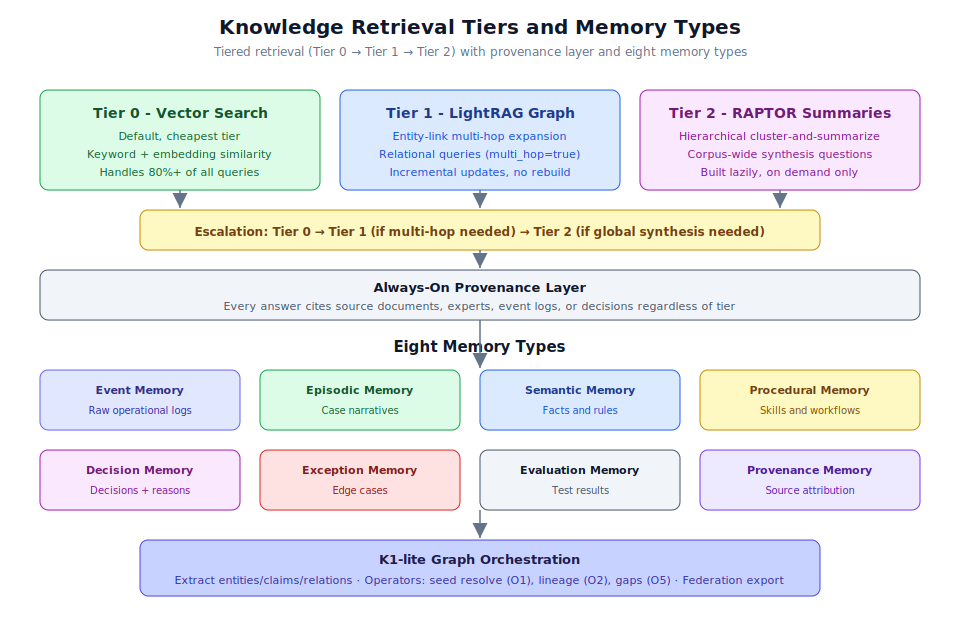

# 第 2.5 章：知識與記憶體協作



## 學習目標

完成本章後，你將能夠：

1. 理解分層檢索架構（第 0 層、第 1 層、第 2 層）
2. 使用知識搜尋 API 進行簡單和關聯查詢
3. 使用所有八種記憶體類型及其範圍規則
4. 執行文件索引以填充知識庫
5. 使用 K1-lite 圖形操作進行實體提取和聯邦
6. 在工作流程上下文中應用記憶體範圍強制執行

## 先決條件

開始本章之前，請確保你已經：

- 完成第 2.1 至 2.4 章
- 有一個正在運行且具有 Postgres 連接的後端實例
- 理解工作流程執行和記憶體讀寫
- 熟悉 RAG（檢索增強生成）概念

---

## 知識層架構

Generic Swarm Business OS 中的知識層分離了兩個不同的關注點：

1. **知識** - 規則、最佳實踐、隱性專業知識、政策和文件化程序
2. **記憶體** - 營運狀態：發生了甚麼、做了甚麼決定、學到了甚麼

它們協同工作但服務不同目的。知識相對穩定（政策不常更改）。記憶體是動態的（每次工作流程運行都會產生新的記憶體）。

> **備註：** 設計刻意避免了 GraphRAG 風格的社群摘要。其每個塊提取加上社群報告生成使得初始索引和每次新文件的重新索引對於持續匯入事件日誌和文件的系統來說都過於昂貴。相反，系統使用成本分層的檢索堆疊。

---

## 分層檢索架構

檢索系統使用三個層級，每個層級逐漸更昂貴但更強大。升級規則將查詢路由到能夠滿足它們的最便宜層級。

### 第 0 層 - 向量搜尋（預設）

**行為：** 通過嵌入的關鍵字搜尋與語義相似性。每個命中都包含 `source_refs` 和 `provenance.retrieval_tier`。

**使用時機：** 始終（所有查詢的預設層級）。

**成本：** 最低 - 無圖形遍歷，無額外 LLM 呼叫。

**處理：** 80%+ 的所有查詢（「找到相關段落」類型）。

```bash
# Basic Tier 0 query
curl "http://127.0.0.1:8000/api/v1/knowledge?query=billing+gate" \
  -H "Cookie: gso_access_token=<your_token>"
```

回應範例：

```json
{
  "results": [
    {
      "content": "Billing configuration requires human gate approval when the action is irreversible.",
      "source_refs": ["business/knowledge-base/rules/billing-policy.md"],
      "provenance": {
        "retrieval_tier": 0,
        "confidence": 0.89,
        "source_type": "policy_document"
      },
      "relevance_score": 0.92
    }
  ],
  "tier_used": 0,
  "query_time_ms": 45
}
```

### 第 1 層 - LightRAG 圖形層（關聯）

**行為：** 具有雙層檢索（低層實體特定 + 高層主題）的實體鏈接多跳擴展。

**使用時機：** 關聯查詢或指定 `multi_hop=true` 時。

**成本：** 中等 - 圖形遍歷但無昂貴的社群生成。

**關鍵優勢：** 增量更新。新文件/事件可以加入而無需重建整個圖形。

```bash
# Tier 1 query with multi-hop
curl "http://127.0.0.1:8000/api/v1/knowledge?query=which+policy+is+related&multi_hop=true" \
  -H "Cookie: gso_access_token=<your_token>"
```

回應範例：

```json
{
  "results": [
    {
      "content": "The billing gate policy (billing-policy.md) is connected to the enterprise contract review policy through the 'financial_controls' entity.",
      "source_refs": [
        "business/knowledge-base/rules/billing-policy.md",
        "business/knowledge-base/rules/enterprise-contracts.md"
      ],
      "provenance": {
        "retrieval_tier": 1,
        "confidence": 0.84,
        "hops": 2,
        "entities_traversed": ["billing_gate", "financial_controls", "enterprise_contract_review"]
      },
      "relevance_score": 0.87
    }
  ],
  "tier_used": 1,
  "query_time_ms": 230
}
```

第 1 層回答關聯問題如：
- 「哪些義務依賴於此合約？」
- 「誰接觸了這個案例，按甚麼順序？」
- 「哪些政策與帳單閘門有關？」

### 第 2 層 - RAPTOR 階層摘要（按需）

**行為：** 為語料庫範圍綜合而建構的遞歸聚類和摘要樹。

**使用時機：** 僅全域綜合問題（延遲/可選層級）。

**成本：** 最高 - 需要建構階層摘要樹。

**關鍵限制：** 延遲建構，非用於整個知識庫。只有經常收到語料庫範圍問題的語料庫才會獲得第 2 層處理。

第 2 層處理如：
- 「所有失敗入職案例中的重複根本原因是甚麼？」
- 「摘要 Q3 授予的所有政策例外」
- 「100+ 決策卡中存在甚麼常見模式？」

> **提示：** 在當前實作中，第 2 層是延遲的。第 0 層和第 1 層處理絕大多數營運查詢。第 2 層將按需為接收頻繁綜合查詢的特定語料庫建構。

### 升級規則

```text
Query arrives
  -> Try Tier 0 (vector search)
  -> If query needs relationships/multi-hop -> Escalate to Tier 1
  -> If query needs global synthesis -> Escalate to Tier 2
```

這保持 80%+ 的流量在最便宜的層級上，控制延遲和成本。

### 始終開啟：來源層

無論哪個層級提供結果，**每個答案都引用其來源**：

- 來源文件（檔案路徑、版本）
- 專家來源（誰提供了知識）
- 事件日誌（如果知識來自營運資料）
- 決策記錄（如果知識來自過去的決策）

```json
{
  "provenance": {
    "retrieval_tier": 0,
    "source_refs": ["business/knowledge-base/rules/billing-policy.md"],
    "source_type": "policy_document",
    "last_updated": "2026-06-15T10:00:00Z",
    "authored_by": "compliance_team",
    "confidence": 0.89
  }
}
```

---

## 知識搜尋 API

### 基本搜尋（第 0 層）

```bash
# Simple keyword/semantic search
curl "http://127.0.0.1:8000/api/v1/knowledge?query=billing+gate" \
  -H "Cookie: gso_access_token=<your_token>"
```

### 多跳搜尋（第 1 層）

```bash
# Relational query with graph traversal
curl "http://127.0.0.1:8000/api/v1/knowledge?query=which+policy+is+related&multi_hop=true" \
  -H "Cookie: gso_access_token=<your_token>"
```

### 使用 POST 的進階搜尋

```bash
# Full search with options
curl -X POST http://127.0.0.1:8000/api/v1/knowledge/search \
  -H "Content-Type: application/json" \
  -H "Cookie: gso_access_token=<your_token>" \
  -d '{
    "query": "What are the approval requirements for enterprise billing?",
    "multi_hop": true,
    "limit": 10
  }'
```

### 文件索引

要將新文件加入知識庫並為第 1 層建構實體鏈接：

```bash
# Index a document (builds entity_links for Tier-1 edges)
curl -X POST http://127.0.0.1:8000/api/v1/knowledge/documents/doc_123/index \
  -H "Content-Type: application/json" \
  -H "Cookie: gso_access_token=<your_token>"
```

索引提取：
- 實體（人員、流程、政策、工具）
- 宣稱（事實或規則的陳述）
- 關係（實體之間的連接）
- 證據跨度（支持每個宣稱的文字）

這些提取的元素形成第 1 層圖形邊緣，使多跳查詢成為可能。

### 圖形聯邦

匯出知識圖形以與外部圖形系統整合：

```bash
# Federation export (Cypher + GraphAnything-compatible JSON)
curl -X POST http://127.0.0.1:8000/api/v1/knowledge/graph/federate \
  -H "Content-Type: application/json" \
  -H "Cookie: gso_access_token=<your_token>"
```

---

## 八種記憶體類型

系統使用八種差異化的記憶體類型，每種在營運生命週期中服務特定目的：

### 1. 事件記憶體

**儲存：** 原始營運日誌 - 發生甚麼的未處理記錄。

```json
{
  "type": "event",
  "content": "Agent sent invoice at 9:42 AM to customer_12345.",
  "timestamp": "2026-07-06T09:42:00Z",
  "actor": "business_orchestrator",
  "run_id": "run_abc123"
}
```

**用途：** 系統活動的事實真相。事件記憶體是僅追加的，提供輸入流程智能的原始資料。

### 2. 情景記憶體

**儲存：** 案例敘事 - 特定案例中發生甚麼的高層級故事。

```json
{
  "type": "episodic",
  "content": "This renewal almost failed - legal was pulled in late because the non-standard clause was not detected until billing configuration.",
  "case_id": "renewal_789",
  "lessons": ["Detect non-standard clauses in verify_contract step"],
  "outcome": "completed_with_delay"
}
```

**用途：** 為類似的未來案例提供上下文。當新案例匹配先前的情景記憶體時，系統可以主動應用學到的教訓。

### 3. 語義記憶體

**儲存：** 事實和規則 - 關於事物如何運作的穩定知識。

```json
{
  "type": "semantic",
  "content": "Enterprise contracts over $250,000 require legal review before billing configuration.",
  "domain": "legal_operations",
  "confidence": 0.95,
  "source": "SOP v4 + expert Alice confirmation"
}
```

**用途：** 系統的「一般知識」- 適用於各案例且不常更改的事實。

### 4. 程序記憶體

**儲存：** 技能和工作流程 - 如何做事情。

```json
{
  "type": "procedural",
  "content": "How to onboard a new client: 1. Verify contract, 2. Create record, 3. Configure billing (gate), 4. Send welcome.",
  "workflow_id": "wf_customer_onboarding_v12",
  "version": "12.0"
}
```

**用途：** 編碼營運的「如何做」。當工作流程 DNA 通過演化引擎演變時更新。

### 5. 決策記憶體

**儲存：** 決策及其原因 - 為何做出特定選擇。

```json
{
  "type": "decision",
  "content": "Approved exception for customer X because: pre-approved fallback clause was accepted, enterprise customer, and liability cap within standard range.",
  "decision_id": "dec_456",
  "decision_point": "approve_non_standard_clause",
  "factors": ["customer_size", "liability_cap", "pre_approved_fallback"],
  "outcome": "approved"
}
```

**用途：** 使決策保持一致。當類似的決策點出現時，系統可以參考過去的決策作為指導。

### 6. 例外記憶體

**儲存：** 邊緣案例 - 偏離正常處理的情況。

```json
{
  "type": "exception",
  "content": "If supplier is in region Z, use alternate billing process due to local tax regulations.",
  "trigger_condition": "supplier.region == 'Z'",
  "alternate_path": "use_regional_billing_adapter",
  "discovered_from": "case_exception_2026_03"
}
```

**用途：** 捕捉罕見但重要的偏差。防止系統被相同的邊緣案例第二次驚到。

### 7. 評估記憶體

**儲存：** 測試結果 - 工作流程和代理程式的表現如何。

```json
{
  "type": "evaluation",
  "content": "Workflow v12 failed privacy test: customer PII was included in welcome packet subject line.",
  "eval_id": "eval_789",
  "target": "wf_customer_onboarding_v12",
  "test_type": "privacy_scan",
  "result": "fail",
  "severity": "medium"
}
```

**用途：** 防止迴歸。演化引擎在推廣變體前檢查評估記憶體。

### 8. 來源記憶體

**儲存：** 來源歸屬 - 知識和規則從哪裏來。

```json
{
  "type": "provenance",
  "content": "The $250K legal review rule came from SOP v4 (section 3.2) and was confirmed by expert Alice during cognitive task analysis session on 2026-03-15.",
  "rule_id": "rule_enterprise_legal_review",
  "sources": [
    {"type": "document", "ref": "sop_v4_section_3.2"},
    {"type": "expert", "ref": "alice_cta_session_20260315"}
  ]
}
```

**用途：** 使信任和驗證成為可能。任何規則或事實都可以追溯到其來源，支持治理審查和爭議解決。

---

## 記憶體範圍強制執行

工作流程執行在每次讀寫操作中強制執行 `allowed_memory_scopes`。這防止代理程式存取其允許範圍之外的記憶體。

### 範圍如何運作

```yaml
# In Workflow DNA
memory_reads: ["contract_rules", "customer_exceptions", "past_failures"]
memory_writes: ["event_log", "decision_memory", "lessons_learned"]
```

在運行時，系統驗證：

1. 請求的記憶體項目是否在工作流程的 `allowed_memory_scopes` 內？
2. 代理程式是否有權限讀寫此記憶體類型？
3. 範圍是否適合當前步驟？

### 範圍強制執行範例

```text
Agent: business_orchestrator
Step: create_customer_record
Allowed scopes: ["contract_rules", "customer_exceptions", "organization_memory"]

Attempt: Read "security_red_team_results"
Result: DENIED - not in allowed scopes

Attempt: Read "contract_rules"
Result: ALLOWED - within scope
```

### 記憶體寫入來源

每次記憶體寫入都包含自動來源：

```json
{
  "memory_write": {
    "type": "decision",
    "content": "Approved billing for standard plan",
    "provenance": {
      "workflow_id": "wf_customer_onboarding_v12",
      "run_id": "run_abc123",
      "step_id": "configure_billing",
      "agent": "tool_permission_broker",
      "timestamp": "2026-07-06T14:10:00Z"
    }
  }
}
```

> **警告：** 沒有來源的記憶體寫入會被系統拒絕。這確保每條儲存的資訊都可以追溯到其來源。

### 組織記憶體和經驗教訓

種子代理程式為旗艦入職路徑聯合 `organization_memory`。關鍵行為：

- 自動反思的經驗教訓寫入 `organization_memory`
- 改進教訓進入 `improvement_lessons` 命名空間
- 兩者都可跨工作流程運行存取（不限於單一案例）
- 這使持續的組織學習成為可能

---

## K1-lite 圖形操作

K1-lite 是驅動第 1 層檢索的輕量級知識圖形實作。

### 實體提取

當文件被索引時，K1-lite 提取：

| 元素 | 描述 | 範例 |
|---------|-------------|---------|
| 實體 | 命名概念、人員、流程、工具 | "billing_gate"、"governance_officer" |
| 宣稱 | 事實或規則的陳述 | "Billing requires human approval" |
| 關係 | 實體之間的連接 | "billing_gate" --requires--> "human_approval" |
| 證據跨度 | 支持每個宣稱的文字 | "...human gate approval for irreversible..." |

### 圖形運算子

K1-lite 提供三個核心運算子：

**O1 - 種子解析：**
從查詢實體開始，通過直接連接解析相關實體。

```bash
# Find all entities directly connected to "billing_gate"
# Returns: human_approval, irreversible_action, financial_controls
```

**O2 - 譜系：**
追蹤特定事實或規則的來源鏈。

```bash
# Trace where the "$250K legal review" rule came from
# Returns: SOP v4 -> expert Alice -> CTA session -> semantic memory
```

**O5 - 缺口：**
識別被參考但尚未文件化的實體或關係。

```bash
# Find knowledge gaps in the onboarding domain
# Returns: ["regional_tax_rules" (referenced but not documented),
#           "partner_integration" (entity with no relations)]
```

### 聯邦匯出

匯出 K1-lite 圖形以與外部系統整合：

```bash
curl -X POST http://127.0.0.1:8000/api/v1/knowledge/graph/federate \
  -H "Content-Type: application/json" \
  -H "Cookie: gso_access_token=<your_token>"
```

產出 Cypher 相容和 GraphAnything 相容的 JSON：

```json
{
  "format": "cypher_compatible",
  "nodes": [
    {"id": "billing_gate", "type": "process_control", "properties": {...}},
    {"id": "human_approval", "type": "requirement", "properties": {...}}
  ],
  "edges": [
    {"from": "billing_gate", "to": "human_approval", "type": "requires", "evidence": "..."}
  ],
  "export_timestamp": "2026-07-06T15:00:00Z"
}
```

---

## 逐步指南：知識庫填充

### 步驟 1：準備文件

將文件放置在適當的知識庫資料夾中：

```text
business/knowledge-base/
  rules/           <- Policy rules and constraints
  decision-patterns/ <- Common decision templates
  exceptions/      <- Edge case documentation
  best-practices/  <- Operational best practices
  tacit-knowledge/ <- Expert insights
  provenance/      <- Source attribution records
```

### 步驟 2：索引文件

```bash
# Index a specific document
curl -X POST http://127.0.0.1:8000/api/v1/knowledge/documents/billing-policy/index \
  -H "Cookie: gso_access_token=<your_token>"
```

### 步驟 3：驗證索引

```bash
# Search for content from the indexed document
curl "http://127.0.0.1:8000/api/v1/knowledge?query=billing+approval+requirements" \
  -H "Cookie: gso_access_token=<your_token>"
```

### 步驟 4：測試多跳查詢

```bash
# Verify Tier 1 graph edges were created
curl -X POST http://127.0.0.1:8000/api/v1/knowledge/search \
  -H "Content-Type: application/json" \
  -H "Cookie: gso_access_token=<your_token>" \
  -d '{
    "query": "What policies are related to billing approval?",
    "multi_hop": true,
    "limit": 5
  }'
```

### 步驟 5：審查實體提取

索引後，通過檢查圖形狀態驗證實體、宣稱和關係是否正確提取。

### 步驟 6：檢查來源

```bash
# Verify provenance is attached to all results
curl "http://127.0.0.1:8000/api/v1/knowledge?query=enterprise+contract+review" \
  -H "Cookie: gso_access_token=<your_token>"

# Every result should include provenance with source_refs and retrieval_tier
```

---

## 評估和測試

知識和記憶體系統有自己的評估框架：

### 單元測試

- `test_retrieval.py` - 測試來源附加和多跳檢索
- 驗證每個結果都包含 `source_refs` 和 `provenance.retrieval_tier`

### 評估固件

| 固件 | 用途 |
|---------|---------|
| `business/evals/retrieval/tier0-provenance.json` | 驗證第 0 層返回來源 |
| `business/evals/retrieval/tier1-multi-hop-entity.json` | 驗證第 1 層實體擴展 |

### 檢索品質指標

在三個維度上分別評分檢索：

1. **上下文相關性** - 檢索的段落是否與查詢相關？
2. **答案相關性** - 答案是否回答了所問的問題？
3. **忠實性** - 答案是否基於檢索的來源？

> **警告：** 弱檢索器會靜默毒害每個代理程式。如果檢索返回不相關的上下文，代理程式將生成看似合理但不正確的答案。始終獨立評估檢索品質。

---

## 檢索層級政策

系統在以下位置維護正式的檢索層級政策：

```
business/knowledge-base/provenance/retrieval-tier-policy.md
```

此政策定義：

- 何時使用每個層級
- 每個層級的成本預算
- 升級規則
- 每個層級的品質門檻
- 層級使用的監控和警報

---

## 實際應用案例

### 案例 1：跨領域知識發現

一個法律營運團隊需要理解帳單政策如何影響合約續期。

**查詢：** 「企業合約續期適用哪些帳單限制？」

**第 0 層結果：** 找到帳單政策文件但無法將其與合約續期規則連接。

**第 1 層結果（multi_hop=true）：** 從 "billing_constraints" 通過 "enterprise_contracts" 遍歷到 "contract_renewal_process"，揭示：
- 超過 $250K 的合約在帳單變更前需要法律審查
- 續期帳單必須匹配原始合約條款，除非簽署了修正案
- 地區稅務規則可能覆蓋標準帳單配置

**價值：** 沒有多跳，法律團隊需要人工搜尋多個政策文件。

### 案例 2：例外模式學習

一位營運經理注意到入職流程中反覆出現的例外。

**查詢例外記憶體：** 「Q3 客戶入職中發生了哪些例外？」

**結果：**
- 4 個案例有非標準責任條款（全部升級到法律）
- 2 個案例有地區稅務例外（需要替代帳單）
- 1 個案例的企業客戶堅持自訂資料駐留

**行動：** 團隊建立新的例外規則：「地區 Z 中責任條款超過 $1M 的客戶需要高級顧問的預批准。」

**記憶體更新：** 新規則寫入語義記憶體，來源鏈接到原始的 4 個案例。

### 案例 3：決策一致性驗證

一位治理審查人員想要驗證類似案例是否得到類似處理。

**查詢決策記憶體：** 「過去一年我們如何處理非標準責任條款？」

**結果：** 12 個決策記錄顯示：
- 8 個以標準條件批准
- 3 個升級到法律
- 1 個被拒絕（無上限責任，無後備）

**洞察：** 模式揭示「企業客戶且接受預批准的後備條款」一致地導致批准。這驗證了決策需求卡中的例外路徑。

---

## 最佳實踐

### 1. 從第 0 層開始並升級

不要預設使用多跳查詢。大多數營運問題可用第 0 層回答：

```bash
# Start here (fast, cheap)
curl "http://127.0.0.1:8000/api/v1/knowledge?query=billing+approval"

# Only escalate if relationships needed
curl "http://127.0.0.1:8000/api/v1/knowledge?query=related+policies&multi_hop=true"
```

### 2. 始終維護來源

絕不在沒有歸屬的情況下寫入知識或記憶體：

```json
// Good: full provenance
{
  "content": "Enterprise contracts need legal review",
  "provenance": {"source": "SOP v4", "expert": "Alice", "date": "2026-03-15"}
}

// Bad: no provenance (will be rejected)
{
  "content": "Enterprise contracts need legal review"
}
```

### 3. 使用適當的記憶體類型

不要將所有內容傾倒到一個記憶體類型中：

| 情況 | 正確的記憶體類型 |
|-----------|-------------------|
| 發生甚麼的原始日誌 | 事件 |
| 案例的故事 | 情景 |
| 始終適用的規則 | 語義 |
| 如何做某事 | 程序 |
| 為何選擇 X | 決策 |
| 正常規則失效時 | 例外 |
| 測試結果 | 評估 |
| 資訊從哪來 | 來源 |

### 4. 增量索引文件

在文件到達時即索引而非批次重建：

```bash
# Index immediately when a new policy is added
curl -X POST http://127.0.0.1:8000/api/v1/knowledge/documents/new_policy_v1/index
```

K1-lite 支持增量更新 - 無需重建整個圖形。

### 5. 尊重記憶體範圍邊界

設計工作流程時，選擇所需的最小記憶體範圍：

```yaml
# Good: minimal scopes
memory_reads: ["contract_rules", "customer_exceptions"]

# Bad: overly broad scopes
memory_reads: ["all_rules", "all_exceptions", "all_decisions", "all_evaluations"]
```

### 6. 監控檢索品質

使用內建固件定期評估檢索品質：

- 任何知識庫變更後運行 `test_retrieval.py`
- 檢查所有結果是否附有來源
- 驗證多跳查詢是否返回相關的實體鏈

### 7. 使用聯邦進行外部整合

如果你的組織使用 Neo4j 或其他圖形資料庫，使用聯邦端點匯出 K1-lite 資料：

```bash
curl -X POST http://127.0.0.1:8000/api/v1/knowledge/graph/federate
```

這使得能夠與企業知識管理系統整合。

---

## 本章總結

在本章中，你學習了：

- **分層檢索架構**使用三個層級（第 0 層向量、第 1 層圖形、第 2 層 RAPTOR）並基於成本升級
- **第 0 層**通過關鍵字/嵌入搜尋以低成本處理 80%+ 的查詢
- **第 1 層（LightRAG-lite）**通過增量更新啟用關聯多跳查詢
- **第 2 層**為語料庫範圍綜合提供階層摘要（延遲建構，按需）
- **八種記憶體類型**（事件、情景、語義、程序、決策、例外、評估、來源）服務不同的營運目的
- **記憶體範圍強制執行**防止工作流程執行期間的未授權記憶體存取
- **K1-lite 圖形操作**（種子解析、譜系、缺口）驅動基於實體的推理
- **來源**始終開啟：每個答案無論檢索層級都追溯到其來源
- **聯邦匯出**使與外部圖形系統整合成為可能（Cypher/GraphAnything JSON）

---

## 知識檢查測驗

測試你對知識和記憶體協作的理解：

**問題 1：** 三個檢索層級是甚麼，每個何時使用？

<details>
<summary>顯示答案</summary>
第 0 層（向量搜尋）：所有查詢的預設 - 關鍵字/嵌入相似性，最便宜，處理 80%+ 的流量。第 1 層（LightRAG 圖形）：用於關聯查詢或 multi_hop=true 時 - 具有增量更新的實體鏈接多跳擴展。第 2 層（RAPTOR 摘要）：僅用於全域綜合問題 - 階層聚類和摘要，按需延遲建構。
</details>

**問題 2：** 為何刻意避免了 GraphRAG 風格的社群摘要？

<details>
<summary>顯示答案</summary>
GraphRAG 的每個塊提取加上社群報告生成使得初始索引和每次新文件的重新索引對於持續匯入事件日誌和文件的系統來說都過於昂貴。選擇了 LightRAG 因為它支持增量更新而無需重建圖形。
</details>

**問題 3：** 列舉所有八種記憶體類型並各用一句話描述。

<details>
<summary>顯示答案</summary>
(1) 事件 - 原始營運日誌，(2) 情景 - 案例敘事，(3) 語義 - 事實和規則，(4) 程序 - 技能和工作流程，(5) 決策 - 決策及其原因，(6) 例外 - 邊緣案例和偏差，(7) 評估 - 測試結果和效能資料，(8) 來源 - 所有知識的來源歸屬。
</details>

**問題 4：** 來源層保證甚麼？

<details>
<summary>顯示答案</summary>
來源層保證每個答案都引用其來源文件、專家、事件日誌或決策，無論哪個檢索層級提供了結果。這通過使所有知識可追溯到其來源來實現信任、驗證、治理審查和爭議解決。
</details>

**問題 5：** 三個 K1-lite 圖形運算子是甚麼，每個做甚麼？

<details>
<summary>顯示答案</summary>
O1（種子解析）：從查詢實體開始，通過直接連接解析相關實體。O2（譜系）：追蹤特定事實或規則的來源鏈回到其來源。O5（缺口）：識別被參考但尚未文件化的實體或關係，揭示知識缺口。
</details>

**問題 6：** 記憶體範圍強制執行在工作流程執行期間如何運作？

<details>
<summary>顯示答案</summary>
工作流程 DNA 宣告 allowed_memory_scopes。在運行時，每次記憶體讀寫都針對這些範圍進行驗證。如果代理程式嘗試存取其允許範圍之外的記憶體，請求會被拒絕。這防止代理程式存取其需要知道邊界之外的資訊。種子代理程式為旗艦路徑聯合 organization_memory。
</details>

**問題 7：** 檢索層級選擇的升級規則是甚麼？

<details>
<summary>顯示答案</summary>
從第 0 層（向量搜尋）開始。如果查詢需要關係或多跳推理，升級到第 1 層（圖形層）。如果查詢需要跨整個語料庫的全域綜合，升級到第 2 層（RAPTOR 摘要）。這保持 80%+ 的流量在最便宜的層級上，控制延遲和成本。
</details>

---

## 下一步

恭喜你完成第 2 節！你現在具有 Generic Swarm Business OS 核心工作流程的中級知識。在第 3 節中，你將進階到建立自訂工作流程、構建領域套件和實施進階演化策略。
