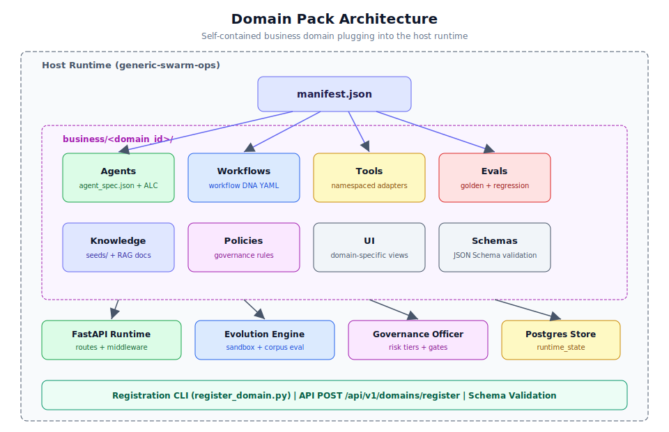

# 第 3.1 章：自訂 Domain Pack 開發

## 學習目標

完成本章後，你將能夠：

1. 理解 Domain Pack 架構以及 Pack 如何接入主機運行時環境
2. 從 `example_research` 骨架建立新的 Domain Pack
3. 定義包含 ALC（自主學習能力）欄位的 `manifest.json` 和 `agent_spec.json`
4. 透過 CLI 和 API 註冊 Domain Pack
5. 配置 Wave 進程（0-4）並理解啟動閘門
6. 驗證 Pack 結構描述並執行清單檢查
7. 為你的領域設定評估語料庫覆蓋層

## 先決條件

- 已完成第 1 節（核心系統基礎）和第 2 節（中級工作流程）
- 可存取運行中的 Generic Swarm Ops 實例（後端 + 前端）
- 熟悉 JSON Schema 驗證
- 理解基於代理的工作流程概念
- 開發環境中已安裝 Node.js 和 Python

---

## 架構概覽



**Domain Pack** 是一個自包含的多模型代理（MMA）系統，位於 `business/<domain_id>/` 路徑下，接入主機運行時環境而無需分叉 FastAPI 後端、運行時服務、治理或進化引擎。此架構讓多個業務領域能夠共享同一基礎設施，同時維持嚴格的隔離邊界。

### 不可違反的設計規則

Domain Pack 架構強制執行三條不可違反的規則：

| 編號 | 規則 | 理由 |
|----|------|-----------|
| **N1** | 領域業務邏輯留在 Pack 路徑中；代理獲得 ALC 以實現自主學習 | 關注點分離；主機保持通用性 |
| **N2** | 任何領域透過 manifest + 構件上線；主機保持通用性 | 防止主機分叉碎片化 |
| **N3** | Video Pack 保留全部 114 個 va 代理 + 流程索引；清單 CI 強制執行 | 參考實作完整性 |

> **備註：** 這些規則在 CI 時（透過清單檢查和結構描述驗證）和運行時（透過註冊 API）均會強制執行。

---

## 逐步指南：建立自訂 Domain Pack

### 步驟 1：理解目錄佈局

每個 Domain Pack 都遵循標準化的目錄結構：

```text
business/<domain_id>/
  manifest.json            # Pack 身份、版本、依賴項
  agents/
    <pack_id>/
      agent_spec.json      # 包含 ALC 欄位的代理定義
      SPEC.md              # 人類可讀的代理規格說明
      ...
  workflows/               # 工作流程 DNA YAML 檔案
  tools/                   # 領域專用工具適配器
  evals/                   # 評估語料庫（黃金、回歸、對抗）
  knowledge/seeds/         # 初始知識庫文件
  policies/                # 領域治理覆寫
  ui/                      # 領域專用前端元件
```

> **提示：** 使用 `example_research` 骨架作為起點。它提供所有必需檔案及正確的結構，包含你可以自訂的佔位值。

### 步驟 2：複製骨架 Pack

首先複製範例骨架以建立你的新領域：

```bash
# 從骨架建立新的 Domain Pack
cp -r business/example_research/ business/my_domain/

# 驗證結構
tree business/my_domain/
```

預期輸出：

```text
business/my_domain/
├── manifest.json
├── agents/
│   └── my_domain/
│       ├── agent_spec.json
│       └── SPEC.md
├── workflows/
├── tools/
├── evals/
├── knowledge/
│   └── seeds/
├── policies/
└── ui/
```
### 步驟 3：定義領域 Manifest

`manifest.json` 是領域註冊的入口點。它宣告 Pack 身份、版本、代理名冊和運行時需求。

**結構描述參考：** `business/schemas/domain-manifest.schema.json`

```json
{
  "$schema": "../schemas/domain-manifest.schema.json",
  "domain_id": "my_domain",
  "display_name": "My Custom Domain",
  "version": "1.0.0",
  "description": "A custom domain pack for [your use case]",
  "owner": "team@example.com",
  "wave": 1,
  "agents": {
    "roster_count": 5,
    "roster": [
      "intake_agent",
      "analysis_agent",
      "synthesis_agent",
      "review_agent",
      "orchestrator"
    ]
  },
  "workflows": [
    "wf_primary_process_v1"
  ],
  "tools": {
    "namespace": "my_domain",
    "adapters": [
      "my_domain.search",
      "my_domain.analyze",
      "my_domain.generate"
    ]
  },
  "knowledge": {
    "seed_documents": 3,
    "embedding_tier": 0
  },
  "evals": {
    "golden_tasks": 10,
    "regression_tests": 5
  },
  "dependencies": {
    "min_host_version": "1.0.0",
    "required_services": ["postgres", "knowledge_store"]
  }
}
```

> **警告：** `domain_id` 必須是有效的 Python/JavaScript 識別符（小寫字母、底線、無連字號）。它會成為 Pack 內所有工具、記憶體範圍和代理識別符的命名空間前綴。

### 步驟 4：建立包含 ALC 欄位的代理規格

Pack 中的每個代理都需要一個 `agent_spec.json`，定義其能力、角色和自主學習能力（ALC）配置。

**結構描述參考：** `business/schemas/agent-spec.schema.json`

```json
{
  "$schema": "../../schemas/agent-spec.schema.json",
  "agent_id": "my_domain.analysis_agent",
  "pack_id": "my_domain",
  "display_name": "Analysis Agent",
  "role": "analyzer",
  "description": "Performs deep analysis on incoming data and generates structured insights",
  "status": "draft",
  "requires_alc": true,
  "alc_version": "1.0.0",
  "alc_config": {
    "allowed_memory_scopes": ["agent", "organization"],
    "learning_rate": "conservative",
    "max_lessons_per_run": 3,
    "lesson_retention_days": 90
  },
  "hooks": {
    "reflect": true,
    "pre_execute": false,
    "post_execute": true
  },
  "tools": [
    "my_domain.search",
    "my_domain.analyze",
    "knowledge.search"
  ],
  "risk_tier": 2,
  "capabilities": [
    "data_analysis",
    "pattern_recognition",
    "report_generation"
  ],
  "constraints": {
    "max_tokens_per_turn": 4096,
    "max_tool_calls_per_step": 5,
    "timeout_seconds": 120
  }
}
```

#### ALC 欄位參考

| 欄位 | 類型 | 必填 | 說明 |
|-------|------|----------|-------------|
| `requires_alc` | boolean | 是 | 代理是否需要自主學習 |
| `alc_version` | string | 若啟用 ALC | ALC 配置的語意版本 |
| `alc_config.allowed_memory_scopes` | array | 若啟用 ALC | 至少必須包含 `"agent"` |
| `alc_config.learning_rate` | string | 否 | `"conservative"`、`"moderate"` 或 `"aggressive"` |
| `alc_config.max_lessons_per_run` | integer | 否 | 每次工作流程執行中提取的經驗上限 |
| `hooks.reflect` | boolean | 若啟用 ALC | ALC 啟動時必須為 `true` |

> **備註：** 除非以下條件成立，否則 ALC 啟動閘門將拒絕 `PATCH /api/v1/agents/{id}` 至 `active` 狀態：(1) `requires_alc` 為 false，或 (2) `alc_version` 已設定、`allowed_memory_scopes` 包含 `"agent"`，且 `hooks.reflect` 為 `true`。

### 步驟 5：定義工作流程 DNA

在 `workflows/` 目錄中建立工作流程定義。工作流程 DNA 檔案定義執行圖、代理分配和治理控制：

```yaml
# business/my_domain/workflows/wf_primary_process_v1.yaml
workflow_id: wf_primary_process_v1
domain: my_domain
version: 1
display_name: "Primary Analysis Process"
description: "End-to-end analysis workflow for incoming data"
risk_tier: 2

steps:
  - id: intake
    agent: my_domain.intake_agent
    action: receive_and_classify
    risk_tier: 0
    outputs: [classification, priority]

  - id: analyze
    agent: my_domain.analysis_agent
    action: deep_analysis
    risk_tier: 2
    inputs: [classification]
    outputs: [analysis_report]
    requires_approval: false

  - id: synthesize
    agent: my_domain.synthesis_agent
    action: generate_summary
    risk_tier: 2
    inputs: [analysis_report]
    outputs: [summary, recommendations]

  - id: review
    agent: my_domain.review_agent
    action: quality_check
    risk_tier: 3
    inputs: [summary, recommendations]
    outputs: [final_report]
    requires_approval: true
    approval_role: reviewer

orchestrator: my_domain.orchestrator
evaluation:
  golden_task_set: "evals/golden-tasks/"
  regression_set: "evals/regression/"
```

### 步驟 6：建立評估語料庫

評估語料庫對於進化沙盒驗證變更至關重要。至少建立黃金任務：

```json
// business/my_domain/evals/golden-tasks/task_001.json
{
  "task_id": "golden_001",
  "description": "Standard analysis of quarterly report data",
  "input": {
    "case_id": "test_quarterly_q2",
    "data_type": "financial_report",
    "priority": "normal"
  },
  "expected_output": {
    "classification": "financial_analysis",
    "analysis_complete": true,
    "recommendations_count_min": 3
  },
  "evaluation_criteria": {
    "quality_score_min": 0.85,
    "compliance_pass": true,
    "max_steps": 10,
    "max_duration_seconds": 300
  }
}
```

> **提示：** 目標為至少 10 個黃金任務涵蓋主要成功路徑、5 個回歸測試覆蓋已知邊界情況，以及 3 個對抗測試用於錯誤處理。

### 步驟 7：透過 CLI 註冊 Domain Pack

CLI 註冊工具會針對所有結構描述驗證你的 Pack，並可選擇性地產生收據：

```bash
# 乾跑 - 驗證但不註冊
python scripts/business/register_domain.py \
  --manifest business/my_domain/manifest.json \
  --dry-run

# 完整註冊
python scripts/business/register_domain.py \
  --manifest business/my_domain/manifest.json
```

成功乾跑的預期輸出：

```text
[VALIDATE] Loading manifest: business/my_domain/manifest.json
[VALIDATE] Schema check: PASS
[VALIDATE] Agent specs (5): ALL VALID
[VALIDATE] ALC fields: 3 agents require ALC, all properly configured
[VALIDATE] Workflow DNA: 1 workflow validated
[VALIDATE] Eval corpus: 10 golden, 5 regression
[DRY-RUN] Registration would succeed. Agents loaded as draft/registered.
```

### 步驟 8：透過 API 註冊（Wave 1+）

對於程式化註冊，使用 REST API：

```bash
# 透過 manifest 路徑註冊
curl -X POST http://127.0.0.1:8000/api/v1/domains/register \
  -H "Authorization: Bearer admin-token" \
  -H "Content-Type: application/json" \
  -d '{
    "manifest_path": "business/my_domain/manifest.json"
  }'

# 或使用內嵌 manifest 註冊
curl -X POST http://127.0.0.1:8000/api/v1/domains/register \
  -H "Authorization: Bearer admin-token" \
  -H "Content-Type: application/json" \
  -d '{
    "manifest": {
      "domain_id": "my_domain",
      "display_name": "My Custom Domain",
      "version": "1.0.0",
      "agents": { "roster_count": 5, "roster": ["..."] }
    }
  }'
```

**回應：**

```json
{
  "status": "registered",
  "domain_id": "my_domain",
  "agents_loaded": 5,
  "agents_status": "draft",
  "message": "Domain registered. Agents in draft state. Use PATCH /agents/{id} to activate."
}
```

> **警告：** 註冊會將代理載入為 `draft/registered` 狀態。它不會自動啟動代理。你必須在驗證 ALC 配置後明確啟動每個代理。

### 步驟 9：啟動代理（ALC 閘門）

註冊後，逐一啟動代理：

```bash
# 啟動代理（將通過 ALC 閘門檢查）
curl -X PATCH http://127.0.0.1:8000/api/v1/agents/my_domain.analysis_agent \
  -H "Authorization: Bearer admin-token" \
  -H "Content-Type: application/json" \
  -d '{"status": "active"}'
```

ALC 啟動閘門驗證：

1. 若 `requires_alc` 為 `false`：立即進行啟動
2. 若 `requires_alc` 為 `true`：檢查 `alc_version` 已設定、`allowed_memory_scopes` 包含 `"agent"`，且 `hooks.reflect` 為 `true`

若驗證失敗：

```json
{
  "error": "alc_activation_denied",
  "detail": "Agent requires ALC but hooks.reflect is not enabled",
  "request_id": "req_abc123"
}
```

### 步驟 10：透過清單檢查驗證

執行清單檢查以確認你的 Pack 已正確註冊：

```bash
# 檢查領域清單
python scripts/business/inventory_check.py

# 針對 video pack（N3 強制執行）
# 若代理目錄 != 114 則失敗
```

---

## Wave 進程

Domain Pack 透過 Wave 進程推進，每個 Wave 解鎖額外功能：

| Wave | 功能 | 需求 |
|------|-------------|--------------|
| **Wave 0** | 結構描述驗證、結構設定 | manifest.json + 骨架 |
| **Wave 1** | ALC 啟動、API 註冊、記憶體範圍 | 包含 ALC 的有效 agent_spec、評估 |
| **Wave 2** | 進化提案、語料庫評估 | 黃金 + 回歸評估集 |
| **Wave 3** | 共同進化、經驗效用、治理審查 | 完整評估語料庫、政策 |
| **Wave 4** | 多 Pack 證明、跨領域實驗 | 隔離的多個 Pack |

### Wave 3 功能

Wave 3 解鎖進階 Pack 功能：

```bash
# 執行共同進化實驗
curl -X POST http://127.0.0.1:8000/api/v1/evolution/coevolution/run \
  -H "Authorization: Bearer admin-token" \
  -H "Content-Type: application/json" \
  -d '{
    "generations": 5,
    "domain_id": "my_domain",
    "agent_ids": ["my_domain.analysis_agent", "my_domain.synthesis_agent"],
    "base_workflow_id": "wf_primary_process_v1"
  }'

# 檢查經驗效用
curl http://127.0.0.1:8000/api/v1/improvement/lesson-utility?agent_id=my_domain.analysis_agent&limit=20 \
  -H "Authorization: Bearer admin-token"

# 查看治理審查佇列
curl http://127.0.0.1:8000/api/v1/evolution/governance/review \
  -H "Authorization: Bearer admin-token"
```

### 適應度複合公式

進化評估使用確定性適應度公式：

```
fitness = 0.6 * suite_pass_rate + 0.2 * knowledge_growth_norm + 0.2 * lesson_reuse_norm
```

其中：
- `suite_pass_rate`：評估語料庫任務通過的比例
- `knowledge_growth_norm`：知識庫擴展的標準化度量
- `lesson_reuse_norm`：經驗庫利用的標準化頻率
---

## 真實使用案例

### 使用案例 1：法律合規 Domain Pack

一家法律事務所為合約審查自動化建立 Domain Pack：

```json
{
  "domain_id": "legal_compliance",
  "display_name": "Legal Compliance Pack",
  "version": "1.0.0",
  "agents": {
    "roster_count": 8,
    "roster": [
      "contract_intake",
      "clause_analyzer",
      "risk_assessor",
      "compliance_checker",
      "redline_drafter",
      "approval_router",
      "audit_logger",
      "legal_orchestrator"
    ]
  },
  "tools": {
    "namespace": "legal",
    "adapters": [
      "legal.clause_search",
      "legal.precedent_lookup",
      "legal.risk_score",
      "legal.redline_generate"
    ]
  }
}
```

關鍵決策：
- `redline_drafter` 的 `risk_tier: 4`（不可逆的外部操作）
- 所有代理需要 ALC 以從已審查合約中持續學習
- 黃金任務包含具有已知合規問題的範例合約
- 任何面向客戶的輸出前都有人工閘門進行最終審批

### 使用案例 2：醫療營運 Domain Pack

一個醫院系統自動化病人接收和排程：

```json
{
  "domain_id": "healthcare_ops",
  "display_name": "Healthcare Operations",
  "version": "1.0.0",
  "agents": {
    "roster_count": 12,
    "roster": [
      "patient_intake",
      "triage_classifier",
      "schedule_optimizer",
      "insurance_verifier",
      "referral_coordinator",
      "discharge_planner",
      "follow_up_scheduler",
      "quality_monitor",
      "compliance_auditor",
      "patient_communicator",
      "staff_notifier",
      "ops_orchestrator"
    ]
  }
}
```

關鍵決策：
- 任何臨床決策代理的 `risk_tier: 5`（受限），直到保證案例獲批
- `policies/hipaa_controls.json` 中的 HIPAA 合規政策
- 對抗評估測試包含 PHI 洩漏情境
- 具有嚴格記憶體範圍隔離的工具命名空間 `healthcare.*`

### 使用案例 3：電子商務履約 Domain Pack

一個線上零售商自動化訂單處理和客戶支援：

```json
{
  "domain_id": "ecommerce_fulfillment",
  "display_name": "E-commerce Fulfillment",
  "version": "2.0.0",
  "wave": 2,
  "agents": {
    "roster_count": 6,
    "roster": [
      "order_processor",
      "inventory_checker",
      "shipping_coordinator",
      "customer_support",
      "return_handler",
      "fulfillment_orchestrator"
    ]
  }
}
```

關鍵決策：
- `shipping_coordinator` 的 `risk_tier: 3`（可逆：可取消發貨）
- `customer_support` 的 `risk_tier: 2`（起草回覆，人工審查）
- 支援代理啟用 ALC 以從已解決工單中學習
- 評估語料庫包含季節性需求高峰情境

---

## 最佳實踐

### Pack 設計

1. **從小規模開始，逐步增長。** 從 3-5 個代理和一個主要工作流程開始。只在 Wave 1 驗證通過後才增加複雜度。

2. **為所有內容加上命名空間。** 每個工具、記憶體範圍和代理 ID 都應帶有領域前綴（例如 `legal.clause_search`，而非僅 `clause_search`）。

3. **為隔離而設計。** 你的 Pack 不應引用另一個領域的工具或記憶體。主機會強制執行此規則，但從一開始就為此進行設計。

4. **投資於評估語料庫。** 進化沙盒無法改善無法度量的內容。在嘗試 Wave 2 之前，目標為 20 個以上的黃金任務。

### ALC 配置

5. **從保守的學習速率開始。** 初始設定 `learning_rate: "conservative"`。只在審查了 50 次以上運行的經驗品質後才升級至 `"moderate"`。

6. **適當確定記憶體範圍。** 使用 `"agent"` 範圍用於代理特定的學習。僅對所有代理都應存取的跨代理知識使用 `"organization"`。

7. **設定經驗保留限制。** 配置 `lesson_retention_days` 以防止無限制的記憶體增長。90 天是合理的預設值。

### 註冊和部署

8. **始終先乾跑。** 在任何註冊前使用 `--dry-run` 以及早發現結構描述問題。

9. **逐步啟動代理。** 不要同時啟動所有代理。先從編排器開始，然後逐一添加下游代理。

10. **監控 ALC 指標。** 啟動後，透過 `GET /api/v1/improvement/lessons?agent_id=...` 追蹤經驗產生率，以及透過儀表板追蹤經驗效用。

---

## 驗證命令

使用以下命令在任何階段驗證你的 Domain Pack：

```bash
# 驗證業務構件（結構描述、manifests）
npm run business:validate

# 執行治理檢查
npm run business:governance

# 對業務構件執行安全掃描
npm run business:security

# 檢查進化就緒狀態
npm run business:evolution:check

# 執行評估語料庫
npm run business:eval

# 完整領域初始化
npm run business:init
```

---

## 進階：結構描述深入探討

### Domain Manifest 結構描述欄位

完整的 `domain-manifest.schema.json` 支援以下欄位：

```json
{
  "type": "object",
  "required": ["domain_id", "display_name", "version", "agents"],
  "properties": {
    "domain_id": {
      "type": "string",
      "pattern": "^[a-z][a-z0-9_]*$",
      "description": "Unique identifier, valid Python/JS identifier"
    },
    "display_name": {
      "type": "string",
      "maxLength": 100
    },
    "version": {
      "type": "string",
      "pattern": "^\\d+\\.\\d+\\.\\d+$",
      "description": "Semantic version"
    },
    "description": {"type": "string"},
    "owner": {"type": "string", "format": "email"},
    "wave": {"type": "integer", "minimum": 0, "maximum": 4},
    "agents": {
      "type": "object",
      "required": ["roster_count", "roster"],
      "properties": {
        "roster_count": {"type": "integer", "minimum": 1},
        "roster": {
          "type": "array",
          "items": {"type": "string"},
          "uniqueItems": true
        }
      }
    },
    "workflows": {
      "type": "array",
      "items": {"type": "string"}
    },
    "tools": {
      "type": "object",
      "properties": {
        "namespace": {"type": "string"},
        "adapters": {"type": "array", "items": {"type": "string"}}
      }
    },
    "knowledge": {
      "type": "object",
      "properties": {
        "seed_documents": {"type": "integer"},
        "embedding_tier": {"type": "integer", "minimum": 0, "maximum": 3}
      }
    },
    "evals": {
      "type": "object",
      "properties": {
        "golden_tasks": {"type": "integer"},
        "regression_tests": {"type": "integer"},
        "adversarial_tests": {"type": "integer"}
      }
    },
    "dependencies": {
      "type": "object",
      "properties": {
        "min_host_version": {"type": "string"},
        "required_services": {"type": "array", "items": {"type": "string"}}
      }
    }
  }
}
```

### Agent Spec 結構描述 - ALC 部分詳情

ALC（自主學習能力）部分有特定的驗證需求：

```json
{
  "alc_config": {
    "type": "object",
    "required": ["allowed_memory_scopes"],
    "properties": {
      "allowed_memory_scopes": {
        "type": "array",
        "items": {"enum": ["agent", "organization"]},
        "minItems": 1,
        "description": "Must include 'agent' for ALC activation"
      },
      "learning_rate": {
        "enum": ["conservative", "moderate", "aggressive"],
        "default": "conservative"
      },
      "max_lessons_per_run": {
        "type": "integer",
        "minimum": 1,
        "maximum": 10,
        "default": 3
      },
      "lesson_retention_days": {
        "type": "integer",
        "minimum": 7,
        "maximum": 365,
        "default": 90
      },
      "reflection_depth": {
        "enum": ["shallow", "standard", "deep"],
        "default": "standard",
        "description": "How deeply the agent reflects on run outcomes"
      },
      "cross_agent_learning": {
        "type": "boolean",
        "default": false,
        "description": "Whether lessons can be shared with other agents in the same domain"
      }
    }
  }
}
```

> **提示：** `cross_agent_learning` 欄位是 Wave 3+ 功能。啟用後，來自一個代理的高效用經驗可以推薦給同一 Domain Pack 內的其他代理（絕不會跨 Pack）。

### 學習日誌結構描述

`learning-log.schema.json` 定義經驗的儲存方式：

```json
{
  "type": "object",
  "required": ["lesson_id", "agent_id", "content", "source_run"],
  "properties": {
    "lesson_id": {"type": "string"},
    "agent_id": {"type": "string"},
    "domain_id": {"type": "string"},
    "content": {"type": "string", "maxLength": 2000},
    "type": {"enum": ["optimization", "error_pattern", "compliance", "preference", "capability"]},
    "confidence": {"type": "number", "minimum": 0, "maximum": 1},
    "utility_score": {"type": "number", "minimum": 0, "maximum": 1},
    "source_run": {"type": "string"},
    "applicable_steps": {"type": "array", "items": {"type": "string"}},
    "times_reused": {"type": "integer", "default": 0},
    "created_at": {"type": "string", "format": "date-time"},
    "expires_at": {"type": "string", "format": "date-time"}
  }
}
```

---

## 疑難排解

### 常見註冊錯誤

| 錯誤 | 原因 | 解決方案 |
|-------|-------|----------|
| `schema_validation_failed` | Manifest 不符合結構描述 | 執行 `npm run business:validate` 並修正報告的問題 |
| `duplicate_domain_id` | Domain ID 已註冊 | 選擇不同的 `domain_id` 或使用版本控制 |
| `roster_count_mismatch` | `roster_count` 與 `roster` 陣列長度不符 | 確保計數與陣列長度完全一致 |
| `invalid_agent_spec` | 代理規格未通過結構描述驗證 | 檢查必填欄位：`agent_id`、`pack_id`、`role` |
| `alc_validation_failed` | `requires_alc: true` 的 ALC 欄位不完整 | 確保 `alc_version`、`allowed_memory_scopes`（包含 "agent"）和 `hooks.reflect: true` |
| `namespace_conflict` | 工具命名空間與現有 Pack 衝突 | 使用與你的 `domain_id` 相符的唯一命名空間前綴 |

### 啟動失敗

```bash
# 診斷 ALC 啟動失敗
curl -X PATCH http://127.0.0.1:8000/api/v1/agents/my_domain.agent_name \
  -H "Authorization: Bearer admin-token" \
  -H "Content-Type: application/json" \
  -d '{"status": "active"}'
```

若你收到 `alc_activation_denied`，請檢查 `agent_spec.json` 中的以下欄位：

```bash
# 驗證 ALC 就緒狀態
jq '{requires_alc, alc_version, "memory_scopes": .alc_config.allowed_memory_scopes, "reflect": .hooks.reflect}' \
  business/my_domain/agents/my_domain/agent_spec.json
```

有效 ALC 配置的預期輸出：

```json
{
  "requires_alc": true,
  "alc_version": "1.0.0",
  "memory_scopes": ["agent", "organization"],
  "reflect": true
}
```

### 清單檢查失敗

若 `python scripts/business/inventory_check.py` 失敗：

1. **缺少代理目錄：** 驗證 `manifest.json` 名冊中列出的所有代理在 `agents/` 下都有對應目錄
2. **規格不完整：** 每個代理目錄必須包含 `agent_spec.json` 和 `SPEC.md`
3. **狀態問題：** 代理必須處於 `registered` 或 `active` 狀態（非 `draft` 或 `inactive`）
4. **DNA 缺失：** `workflows/` 中必須存在至少一個工作流程 DNA 檔案

```bash
# 快速診斷清單問題
echo "=== Roster vs. Directories ==="
ROSTER=$(jq -r '.agents.roster[]' business/my_domain/manifest.json)
for AGENT in $ROSTER; do
  if [ -d "business/my_domain/agents/my_domain/$AGENT" ]; then
    echo "OK: $AGENT"
  else
    echo "MISSING: $AGENT"
  fi
done
```

### 進化語料庫問題

若 `npm run business:eval` 報告問題：

```bash
# 驗證評估語料庫結構
find business/my_domain/evals/ -name "*.json" | head -20

# 驗證黃金任務檔案
jq '.' business/my_domain/evals/golden-tasks/task_001.json

# 檢查每個任務中的必填欄位
jq 'keys' business/my_domain/evals/golden-tasks/task_001.json
# 必須包含：task_id、description、input、expected_output、evaluation_criteria
```

---

## 參考：Wave 進程詳情

### Wave 0：基礎

**解鎖：** 結構描述驗證、目錄結構驗證

**需求：**
- 具有效結構描述的 `manifest.json`
- 至少一個包含 `agent_spec.json` 的代理目錄
- 目錄結構遵循標準佈局

**驗證：**
```bash
npm run business:validate
```

### Wave 1：啟動

**解鎖：** ALC 啟動、API 註冊、記憶體範圍、基本經驗

**需求（超出 Wave 0）：**
- 所有代理具有有效的 ALC 欄位（若 `requires_alc: true`）
- 至少 5 個黃金評估任務
- 工具命名空間已定義且不衝突
- ALC 代理上的 `hooks.reflect: true`

**驗證：**
```bash
python scripts/business/register_domain.py --manifest business/my_domain/manifest.json
curl -X PATCH http://127.0.0.1:8000/api/v1/agents/my_domain.agent_name \
  -H "Authorization: Bearer admin-token" -d '{"status": "active"}'
```

### Wave 2：進化

**解鎖：** 進化提案、語料庫評估、適應度評分

**需求（超出 Wave 1）：**
- 至少 10 個黃金任務 + 5 個回歸測試
- 至少一個對抗測試
- 工作流程 DNA 中 domain 欄位正確設定
- 每個任務中定義了評估標準

**驗證：**
```bash
npm run business:eval
npm run business:evolution:check
```

### Wave 3：進階學習

**解鎖：** 共同進化、經驗效用儀表板、治理審查、技能沙盒

**需求（超出 Wave 2）：**
- 完整評估語料庫（黃金 + 回歸 + 對抗 + 歷史）
- 包含治理規則的政策目錄
- 多個啟用 ALC 的代理（用於共同進化）
- 至少 50 次已完成的運行以達統計顯著性

**驗證：**
```bash
curl -X POST http://127.0.0.1:8000/api/v1/evolution/coevolution/run \
  -H "Authorization: Bearer admin-token" \
  -d '{"generations": 3, "domain_id": "my_domain", "base_workflow_id": "..."}'
```

### Wave 4：多 Pack 證明

**解鎖：** 多領域部署、跨領域隔離驗證、完整生產就緒

**需求（超出 Wave 3）：**
- 至少註冊兩個 Domain Pack
- 所有 Pack 對之間的隔離驗證通過
- 紅隊安全證據已記錄
- N3 清單檢查通過（若包含 video pack）
- 多 Pack 負載下的效能基準

**驗證：**
```bash
python scripts/business/inventory_check.py
npm run business:security
# 多 Pack 隔離測試
python scripts/business/isolation_verify.py --domains my_domain,example_research
```

---

## 本章摘要

在本章中，你學會了如何：

- 按照標準化的 `business/<domain_id>/` 佈局組織 Domain Pack
- 建立包含所有必填欄位的 `manifest.json`，包括代理名冊和工具命名空間
- 定義包含 ALC（自主學習能力）配置的 `agent_spec.json` 檔案
- 撰寫工作流程 DNA，將代理分配至具有適當風險層級的步驟
- 為進化沙盒建立評估語料庫
- 透過 CLI（`register_domain.py --dry-run`）和 API（`POST /api/v1/domains/register`）註冊 Pack
- 透過 ALC 閘門啟動代理並進行適當驗證
- 透過 Wave 0-4 進程在每個階段解鎖功能
- 應用隔離規則防止跨 Pack 污染

Domain Pack 是 Generic Swarm Ops 中業務自訂的基本單元。透過遵循標準化的結構和註冊流程，你可以確保你的領域邏輯與共享主機運行時環境乾淨整合，同時維持與其他 Pack 的嚴格隔離。

---

## 知識檢查

1. **Domain Pack 架構的三條不可違反規則（N1、N2、N3）是甚麼？**

2. **ALC 啟動閘門允許代理從 `draft` 轉換至 `active` 狀態需要滿足甚麼條件？**

3. **撰寫透過 manifest 路徑註冊 Domain Pack 的 API 呼叫。註冊後代理將處於甚麼狀態？**

4. **進化沙盒使用的適應度複合公式是甚麼？列出所有三個組成部分。**

5. **解釋 Wave 1 和 Wave 3 功能之間的差異。Wave 3 額外解鎖了哪些功能？**

6. **為甚麼 `domain_id` 必須是有效的 Python/JavaScript 識別符？哪些系統將其用作命名空間前綴？**

7. **描述 Domain Pack 的目錄結構。Wave 0 驗證所需的最少檔案集是甚麼？**

8. **甚麼命令驗證 video pack 保留全部 114 個代理？它具體檢查甚麼？**

9. **Domain Pack 之間的記憶體範圍隔離如何運作？允許哪些範圍，甚麼防止跨 Pack 洩漏？**

10. **配置醫療 Domain Pack 時，為甚麼要為臨床決策代理設定 `risk_tier: 5`？需要哪些額外構件？**
