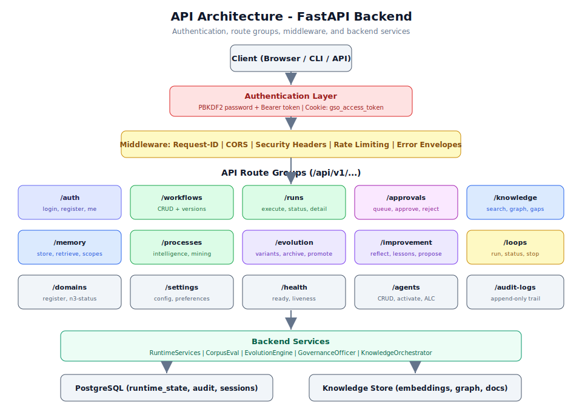

# 第 3.2 章：API 整合與擴展

## 學習目標

完成本章後，你將能夠：

1. 瀏覽完整的 FastAPI API 介面並理解路由組織結構
2. 實作基於密碼的登入和 Bearer Token 的驗證流程
3. 執行工作流程 CRUD 操作、執行運行和審批佇列管理
4. 整合知識搜尋、記憶體操作和流程智能 API
5. 處理包含請求 ID 的結構化錯誤信封以便除錯
6. 使用適當的中介軟件模式擴展 API 自訂整合
7. 實作速率限制和安全標頭最佳實踐

## 先決條件

- 已完成第 3.1 章（自訂 Domain Pack 開發）
- 運行中的 Generic Swarm Ops 後端（`uvicorn app.main:app --reload`）
- 熟悉 RESTful API 概念和 HTTP 方法
- 已安裝 `curl` 或 API 用戶端（Postman、HTTPie）
- 理解 JWT/Bearer Token 驗證模式

---

## 架構概覽



Generic Swarm Ops API 建基於 FastAPI，按邏輯路由組織。每個請求都經過驗證、中介軟件（請求 ID 注入、CORS、安全標頭、速率限制）和結構化錯誤處理後才到達後端服務。

### API 基礎 URL

```
http://127.0.0.1:8000/api/v1
```

### 健康檢查

```bash
# 驗證後端是否運行中
curl http://127.0.0.1:8000/api/v1/health/ready
```

**回應：**

```json
{
  "status": "healthy",
  "database": "postgres",
  "timestamp": "2024-01-15T10:30:00Z"
}
```

---

## 逐步指南：驗證

### 步驟 1：基於密碼的登入

主要驗證方法使用 PBKDF2 密碼雜湊配合工作階段 Cookie：

```bash
# 使用電郵和密碼登入
curl -X POST http://127.0.0.1:8000/api/v1/auth/login \
  -H "Content-Type: application/json" \
  -d '{
    "email": "admin@example.com",
    "password": "admin-password"
  }' \
  -c cookies.txt
```

**回應：**

```json
{
  "user": {
    "id": "usr_001",
    "email": "admin@example.com",
    "role": "admin",
    "organization_id": "org_default"
  },
  "message": "Login successful"
}
```

回應會設定 `gso_access_token` Cookie 和工作階段用戶 Cookie。後續請求應包含這些 Cookie。

### 步驟 2：Bearer Token 驗證

對於程式化/CLI 存取，使用 Bearer Token：

```bash
# 使用 Bearer Token
curl http://127.0.0.1:8000/api/v1/workflows \
  -H "Authorization: Bearer admin-token"
```

> **警告：** 靜態 Bearer Token（`admin-token`）僅用於開發和 curl 煙霧測試。在生產環境中，始終使用基於密碼的登入配合工作階段 Cookie 或實作適當的 OAuth2 流程。

### 步驟 3：基於 Cookie 的工作階段流程

登入後，使用工作階段 Cookie 進行後續請求：

```bash
# 使用登入時的 Cookie
curl http://127.0.0.1:8000/api/v1/auth/me \
  -b cookies.txt
```

**回應：**

```json
{
  "id": "usr_001",
  "email": "admin@example.com",
  "role": "admin",
  "organization_id": "org_default",
  "permissions": ["workflows:read", "workflows:write", "runs:execute", "approvals:manage"]
}
```

---

## 逐步指南：工作流程操作

### 步驟 4：列出工作流程

```bash
curl http://127.0.0.1:8000/api/v1/workflows \
  -H "Authorization: Bearer admin-token"
```

**回應：**

```json
{
  "workflows": [
    {
      "id": "wf_customer_onboarding_v12",
      "display_name": "Customer Onboarding",
      "version": 12,
      "status": "active",
      "risk_tier": 3,
      "domain": "ops",
      "created_at": "2024-01-10T08:00:00Z"
    }
  ],
  "total": 1,
  "page": 1,
  "per_page": 20
}
```

### 步驟 5：建立工作流程

```bash
curl -X POST http://127.0.0.1:8000/api/v1/workflows \
  -H "Authorization: Bearer admin-token" \
  -H "Content-Type: application/json" \
  -d '{
    "workflow_id": "wf_data_analysis_v1",
    "display_name": "Data Analysis Pipeline",
    "domain": "my_domain",
    "risk_tier": 2,
    "steps": [
      {
        "id": "intake",
        "agent": "my_domain.intake_agent",
        "action": "classify_input",
        "risk_tier": 0
      },
      {
        "id": "analyze",
        "agent": "my_domain.analysis_agent",
        "action": "deep_analysis",
        "risk_tier": 2
      },
      {
        "id": "report",
        "agent": "my_domain.synthesis_agent",
        "action": "generate_report",
        "risk_tier": 2,
        "requires_approval": true
      }
    ]
  }'
```

**回應：**

```json
{
  "id": "wf_data_analysis_v1",
  "status": "created",
  "version": 1,
  "created_at": "2024-01-15T11:00:00Z"
}
```

### 步驟 6：執行工作流程運行

```bash
# 啟動新的運行
curl -X POST http://127.0.0.1:8000/api/v1/runs \
  -H "Authorization: Bearer admin-token" \
  -H "Content-Type: application/json" \
  -d '{
    "workflow_id": "wf_customer_onboarding_v12",
    "payload": {
      "case_id": "case_2024_001",
      "customer_name": "Acme Corp",
      "tier": "enterprise"
    }
  }'
```

**回應：**

```json
{
  "run_id": "run_abc123",
  "workflow_id": "wf_customer_onboarding_v12",
  "status": "running",
  "started_at": "2024-01-15T11:05:00Z",
  "current_step": "intake"
}
```

> **備註：** 旗艦工作流程 `wf_customer_onboarding_v12` 要求 payload 中包含 `case_id` 欄位。其他工作流程可能有在其 DNA 中定義的不同必填 payload 欄位。

### 步驟 7：檢查運行狀態

```bash
# 取得運行狀態和詳情
curl http://127.0.0.1:8000/api/v1/runs/run_abc123 \
  -H "Authorization: Bearer admin-token"
```

**回應：**

```json
{
  "run_id": "run_abc123",
  "workflow_id": "wf_customer_onboarding_v12",
  "status": "awaiting_approval",
  "started_at": "2024-01-15T11:05:00Z",
  "current_step": "billing_setup",
  "steps_completed": 3,
  "steps_total": 5,
  "pending_approval": {
    "step_id": "billing_setup",
    "approval_type": "human_gate",
    "reason": "Tier 4 irreversible action requires human approval"
  }
}
```

---

## 逐步指南：審批佇列

### 步驟 8：列出待審批項目

```bash
curl http://127.0.0.1:8000/api/v1/approvals \
  -H "Authorization: Bearer admin-token"
```

**回應：**

```json
{
  "approvals": [
    {
      "id": "appr_xyz789",
      "run_id": "run_abc123",
      "step_id": "billing_setup",
      "workflow_id": "wf_customer_onboarding_v12",
      "risk_tier": 4,
      "requested_at": "2024-01-15T11:06:00Z",
      "sla_deadline": "2024-01-15T12:06:00Z",
      "context": {
        "action": "create_billing_account",
        "customer": "Acme Corp",
        "amount": "enterprise_tier"
      }
    }
  ],
  "total_pending": 1
}
```

### 步驟 9：批准或拒絕

```bash
# 批准
curl -X POST http://127.0.0.1:8000/api/v1/approvals/appr_xyz789/approve \
  -H "Authorization: Bearer admin-token" \
  -H "Content-Type: application/json" \
  -d '{
    "decision": "approved",
    "reviewer_notes": "Customer verified, billing details confirmed"
  }'

# 拒絕
curl -X POST http://127.0.0.1:8000/api/v1/approvals/appr_xyz789/reject \
  -H "Authorization: Bearer admin-token" \
  -H "Content-Type: application/json" \
  -d '{
    "decision": "rejected",
    "reviewer_notes": "Customer credit check failed",
    "escalation": false
  }'
```

---

## 逐步指南：知識與記憶體

### 步驟 10：搜尋知識庫

```bash
# 關鍵詞 + 語意搜尋
curl -X POST http://127.0.0.1:8000/api/v1/knowledge/search \
  -H "Authorization: Bearer admin-token" \
  -H "Content-Type: application/json" \
  -d '{
    "query": "customer onboarding best practices",
    "limit": 10,
    "tier": 0
  }'
```

**回應：**

```json
{
  "results": [
    {
      "document_id": "doc_001",
      "title": "Enterprise Onboarding SOP",
      "snippet": "Step 1: Verify customer identity...",
      "score": 0.92,
      "source": "knowledge/seeds/onboarding_sop.md"
    }
  ],
  "total": 5,
  "search_tier": 0
}
```

### 步驟 11：查詢知識圖譜

```bash
# 種子 + 鄰域圖譜查詢
curl "http://127.0.0.1:8000/api/v1/knowledge/graph/query?seed=customer_onboarding&depth=2" \
  -H "Authorization: Bearer admin-token"
```

**回應：**

```json
{
  "nodes": [
    {"id": "n_001", "type": "process", "label": "Customer Onboarding"},
    {"id": "n_002", "type": "entity", "label": "KYC Verification"},
    {"id": "n_003", "type": "entity", "label": "Account Setup"}
  ],
  "edges": [
    {"source": "n_001", "target": "n_002", "relation": "REQUIRES"},
    {"source": "n_001", "target": "n_003", "relation": "INCLUDES"}
  ]
}
```

### 步驟 12：偵測知識缺口

```bash
curl http://127.0.0.1:8000/api/v1/knowledge/graph/gaps \
  -H "Authorization: Bearer admin-token"
```

**回應：**

```json
{
  "gaps": [
    {
      "type": "missing_relation",
      "entity": "Compliance Check",
      "expected_connections": ["KYC Verification", "Risk Assessment"],
      "actual_connections": ["KYC Verification"],
      "recommendation": "Add BUILD_ON relation to Risk Assessment"
    }
  ],
  "total_gaps": 3
}
```

### 步驟 13：記憶體操作

```bash
# 儲存記憶體（代理範圍）
curl -X POST http://127.0.0.1:8000/api/v1/memory \
  -H "Authorization: Bearer admin-token" \
  -H "Content-Type: application/json" \
  -d '{
    "agent_id": "my_domain.analysis_agent",
    "scope": "agent",
    "content": "Customer Acme Corp prefers PDF reports over HTML",
    "category": "preference",
    "provenance": {
      "source_run": "run_abc123",
      "confidence": 0.95
    }
  }'

# 擷取代理記憶體
curl "http://127.0.0.1:8000/api/v1/memory?agent_id=my_domain.analysis_agent&scope=agent&limit=20" \
  -H "Authorization: Bearer admin-token"
```

> **備註：** 對高影響範圍的記憶體寫入需要來源元資料以防禦投毒。`provenance` 欄位記錄資訊來源及其信心程度。

---

## 逐步指南：流程智能

### 步驟 14：查詢流程挖掘資料

```bash
# 取得流程摘要
curl http://127.0.0.1:8000/api/v1/processes \
  -H "Authorization: Bearer admin-token"
```

**回應：**

```json
{
  "processes": [
    {
      "process_id": "proc_onboarding",
      "display_name": "Customer Onboarding",
      "total_runs": 142,
      "avg_cycle_time_minutes": 45,
      "completion_rate": 0.94,
      "bottleneck_step": "billing_setup",
      "last_run": "2024-01-15T10:00:00Z"
    }
  ]
}
```

---

## 中介軟件與錯誤處理

### 請求 ID 追蹤

每個 API 回應都包含唯一的 `X-Request-ID` 標頭用於追蹤：

```bash
curl -v http://127.0.0.1:8000/api/v1/workflows \
  -H "Authorization: Bearer admin-token" 2>&1 | grep -i x-request-id
```

```
< X-Request-ID: req_f47ac10b-58cc-4372-a567-0e02b2c3d479
```

### 結構化錯誤信封

所有錯誤遵循一致的結構：

```json
{
  "error": "validation_error",
  "detail": "Field 'case_id' is required for workflow wf_customer_onboarding_v12",
  "request_id": "req_f47ac10b-58cc-4372-a567-0e02b2c3d479",
  "timestamp": "2024-01-15T11:10:00Z",
  "path": "/api/v1/runs"
}
```

常見錯誤碼：

| HTTP 狀態 | 錯誤類型 | 說明 |
|-------------|-----------|-------------|
| 400 | `validation_error` | 無效的請求 payload |
| 401 | `authentication_required` | 缺少或無效的憑證 |
| 403 | `permission_denied` | 角色/權限不足 |
| 404 | `not_found` | 資源不存在 |
| 409 | `conflict` | 狀態衝突（例如已批准） |
| 422 | `unprocessable_entity` | 語意驗證失敗 |
| 429 | `rate_limited` | 敏感路由請求過多 |
| 500 | `internal_error` | 非預期的伺服器錯誤 |

### 速率限制

敏感路由強制執行速率限制：

```
POST /api/v1/auth/login         - 每個 IP 每分鐘 5 次請求
POST /api/v1/runs               - 每個用戶每分鐘 30 次請求
POST /api/v1/evolution/variants - 每個用戶每分鐘 10 次請求
POST /api/v1/improvement/*      - 每個用戶每分鐘 20 次請求
```

被速率限制時：

```json
{
  "error": "rate_limited",
  "detail": "Rate limit exceeded. Retry after 32 seconds.",
  "retry_after": 32,
  "request_id": "req_123"
}
```

> **提示：** 以程式化方式整合 API 時，始終為被速率限制的回應實作指數退避加抖動。從回應中提取 `retry_after` 值並添加隨機抖動（0-5 秒），以避免多個用戶端同時重試時的驚群問題。

### 安全標頭

API 在所有回應上設定以下安全標頭：

```
X-Content-Type-Options: nosniff
X-Frame-Options: DENY
X-XSS-Protection: 1; mode=block
Strict-Transport-Security: max-age=31536000; includeSubDomains
Content-Security-Policy: default-src 'self'
```

### CORS 配置

CORS 為前端來源進行配置：

```python
# 後端 CORS 設定
origins = [
    "http://localhost:3000",      # Next.js dev server
    "http://127.0.0.1:3000",
    os.getenv("FRONTEND_URL", "")
]
```

---

## 完整 API 參考

### 驗證路由

| 方法 | 路徑 | 說明 |
|--------|------|-------------|
| POST | `/api/v1/auth/login` | 密碼登入，設定工作階段 Cookie |
| POST | `/api/v1/auth/register` | 註冊新用戶 |
| GET | `/api/v1/auth/me` | 當前用戶個人檔案 |
| POST | `/api/v1/auth/logout` | 使工作階段失效 |

### 工作流程路由

| 方法 | 路徑 | 說明 |
|--------|------|-------------|
| GET | `/api/v1/workflows` | 列出所有工作流程 |
| POST | `/api/v1/workflows` | 建立工作流程 |
| GET | `/api/v1/workflows/{id}` | 取得工作流程詳情 |
| PUT | `/api/v1/workflows/{id}` | 更新工作流程 |
| DELETE | `/api/v1/workflows/{id}` | 刪除工作流程 |

### 運行路由

| 方法 | 路徑 | 說明 |
|--------|------|-------------|
| POST | `/api/v1/runs` | 執行工作流程運行 |
| GET | `/api/v1/runs/{id}` | 取得運行狀態/詳情 |
| GET | `/api/v1/runs` | 列出運行（可篩選） |

### 審批路由

| 方法 | 路徑 | 說明 |
|--------|------|-------------|
| GET | `/api/v1/approvals` | 列出待審批項目 |
| POST | `/api/v1/approvals/{id}/approve` | 批准閘門 |
| POST | `/api/v1/approvals/{id}/reject` | 拒絕閘門 |

### 知識路由

| 方法 | 路徑 | 說明 |
|--------|------|-------------|
| POST | `/api/v1/knowledge/search` | 關鍵詞 + 語意搜尋 |
| POST | `/api/v1/knowledge/graph/extract/{document_id}` | 從文件建立圖譜 |
| GET | `/api/v1/knowledge/graph/query` | 種子 + 鄰域查詢 |
| GET | `/api/v1/knowledge/graph/gaps` | 缺口偵測 |
| POST | `/api/v1/knowledge/graph/federate` | 匯出至 Neo4j/JSON |

### 記憶體路由

| 方法 | 路徑 | 說明 |
|--------|------|-------------|
| POST | `/api/v1/memory` | 儲存記憶體條目 |
| GET | `/api/v1/memory` | 擷取記憶體（已篩選） |

### 流程智能路由

| 方法 | 路徑 | 說明 |
|--------|------|-------------|
| GET | `/api/v1/processes` | 列出流程摘要 |

### 進化路由

| 方法 | 路徑 | 說明 |
|--------|------|-------------|
| POST | `/api/v1/evolution/variants` | 提出進化變體 |
| POST | `/api/v1/evolution/variants/{id}/evaluate` | 語料庫評估 |
| POST | `/api/v1/evolution/variants/{id}/promote` | 金絲雀或晉升 |
| POST | `/api/v1/evolution/variants/{id}/rollback` | 回滾變體 |
| GET | `/api/v1/evolution/archive` | 按適應度排名的群體 |
| POST | `/api/v1/evolution/coevolution/run` | 多領域共同進化 |
| GET | `/api/v1/evolution/governance/review` | 治理審查佇列 |

### 改善路由

| 方法 | 路徑 | 說明 |
|--------|------|-------------|
| POST | `/api/v1/improvement/reflect/{run_id}` | 從運行中提取經驗 |
| GET | `/api/v1/improvement/lessons` | 列出經驗庫 |
| POST | `/api/v1/improvement/auto-propose` | 從失敗自動提出變體 |
| GET | `/api/v1/improvement/lesson-utility` | 經驗效用儀表板 |
| GET | `/api/v1/improvement/metrics` | 代理改善指標 |
| POST | `/api/v1/improvement/skills/propose` | 提出技能沙盒變更 |

### 迴圈工程路由

| 方法 | 路徑 | 說明 |
|--------|------|-------------|
| POST | `/api/v1/loops/run` | 啟動受治理的改善迴圈 |
| GET | `/api/v1/loops/{id}` | 迴圈運行狀態 |

### 領域路由

| 方法 | 路徑 | 說明 |
|--------|------|-------------|
| POST | `/api/v1/domains/register` | 註冊 Domain Pack |
| GET | `/api/v1/domains/video/n3-status` | N3 清單狀態 |

### 代理路由

| 方法 | 路徑 | 說明 |
|--------|------|-------------|
| GET | `/api/v1/agents` | 列出代理 |
| GET | `/api/v1/agents/{id}` | 取得代理詳情 |
| PATCH | `/api/v1/agents/{id}` | 更新代理（啟動） |

### 設定和健康路由

| 方法 | 路徑 | 說明 |
|--------|------|-------------|
| GET | `/api/v1/settings` | 取得系統設定 |
| PUT | `/api/v1/settings` | 更新設定 |
| GET | `/api/v1/health/ready` | 就緒檢查 |
---

## 真實使用案例

### 使用案例 1：建立自訂儀表板整合

一個團隊建立聚合運行指標的外部儀表板：

```python
import requests
import time

BASE_URL = "http://127.0.0.1:8000/api/v1"
HEADERS = {"Authorization": "Bearer admin-token"}

def get_dashboard_metrics():
    """Aggregate metrics for external dashboard."""
    # Get all runs from the last 24 hours
    runs = requests.get(
        f"{BASE_URL}/runs?since=24h&status=completed",
        headers=HEADERS
    ).json()

    # Get process intelligence summaries
    processes = requests.get(
        f"{BASE_URL}/processes",
        headers=HEADERS
    ).json()

    # Get pending approvals count
    approvals = requests.get(
        f"{BASE_URL}/approvals",
        headers=HEADERS
    ).json()

    # Get evolution archive fitness
    archive = requests.get(
        f"{BASE_URL}/evolution/archive",
        headers=HEADERS
    ).json()

    return {
        "runs_completed_24h": len(runs.get("runs", [])),
        "avg_cycle_time": processes["processes"][0]["avg_cycle_time_minutes"],
        "pending_approvals": approvals["total_pending"],
        "top_variant_fitness": archive[0]["fitness"] if archive else None
    }
```

### 使用案例 2：自動化 CI/CD 整合

CI 管線在工作流程變更後觸發評估：

```bash
#!/bin/bash
# ci-evaluate.sh - Run after workflow DNA changes

WORKFLOW_ID="wf_customer_onboarding_v12"
BASE_URL="http://127.0.0.1:8000/api/v1"
AUTH="Authorization: Bearer admin-token"

# 1. Propose evolution variant
VARIANT=$(curl -s -X POST "$BASE_URL/evolution/variants" \
  -H "$AUTH" \
  -H "Content-Type: application/json" \
  -d "{\"workflow_id\": \"$WORKFLOW_ID\", \"source\": \"ci_pipeline\"}" \
  | jq -r '.variant_id')

echo "Proposed variant: $VARIANT"

# 2. Evaluate against corpus
EVAL=$(curl -s -X POST "$BASE_URL/evolution/variants/$VARIANT/evaluate" \
  -H "$AUTH" \
  | jq -r '.fitness')

echo "Fitness score: $EVAL"

# 3. Check fitness threshold
if (( $(echo "$EVAL > 0.85" | bc -l) )); then
  echo "PASS: Fitness $EVAL exceeds threshold 0.85"
  exit 0
else
  echo "FAIL: Fitness $EVAL below threshold 0.85"
  exit 1
fi
```

### 使用案例 3：Webhook 驅動的運行自動化

外部系統透過 Webhook 觸發工作流程運行：

```python
from fastapi import FastAPI, Request
import httpx

webhook_app = FastAPI()

GSO_BASE = "http://127.0.0.1:8000/api/v1"
GSO_TOKEN = "admin-token"

@webhook_app.post("/webhooks/new-customer")
async def handle_new_customer(request: Request):
    """Webhook handler that triggers GSO workflow on new customer signup."""
    payload = await request.json()

    async with httpx.AsyncClient() as client:
        # Trigger onboarding workflow
        response = await client.post(
            f"{GSO_BASE}/runs",
            headers={
                "Authorization": f"Bearer {GSO_TOKEN}",
                "Content-Type": "application/json"
            },
            json={
                "workflow_id": "wf_customer_onboarding_v12",
                "payload": {
                    "case_id": f"case_{payload['customer_id']}",
                    "customer_name": payload["name"],
                    "tier": payload.get("tier", "standard")
                }
            }
        )

        result = response.json()
        return {
            "status": "triggered",
            "run_id": result["run_id"],
            "message": f"Onboarding initiated for {payload['name']}"
        }
```

---

## 最佳實踐

### 驗證

1. **為瀏覽器用戶端使用基於 Cookie 的工作階段。** `gso_access_token` Cookie 提供安全的 httpOnly 工作階段管理。

2. **Bearer Token 僅用於開發/測試。** 靜態 Token 不應出現在生產程式碼中或跨環境共享。

3. **實作 Token 輪替。** 對於長期存在的整合，實作刷新流程而非使用永久 Token。

### 錯誤處理

4. **始終擷取 `request_id`。** 在支援工單和除錯日誌中包含它。它與後端追蹤條目相關聯。

5. **為 429 回應實作指數退避。** 尊重 `retry_after` 欄位並實作抖動以避免驚群問題。

6. **優雅處理 409 衝突。** 狀態衝突（例如批准已批准的閘門）應觸發狀態刷新，而非重試。

### 整合模式

7. **使用退避輪詢運行狀態。** 對於非同步運行，從 2 秒間隔開始，30 秒後增加至 10 秒間隔。

8. **批次處理知識查詢。** 若需要多個圖譜查詢，使用 federate 端點匯出子圖，而非進行多個個別查詢。

9. **使用請求 ID 關聯。** 傳遞你自己的 `X-Request-ID` 標頭以將你的用戶端日誌與 GSO 後端日誌關聯。

10. **用戶端驗證 payload。** 發送前檢查必填欄位以降低 400 錯誤率並改善用戶體驗。

### 安全

11. **絕不記錄 Bearer Token 或密碼。** 在應用程式日誌中遮罩敏感欄位。

12. **在生產環境中驗證 CORS 來源。** 配置 `FRONTEND_URL` 環境變數以限制跨來源存取。

13. **在生產環境中使用 HTTPS。** 安全標頭假定 TLS 終止；不使用 HTTPS 運行會使 HSTS 保護失效。

---

## 本章摘要

在本章中，你學會了如何：

- 使用基於密碼的登入（Cookie 工作階段）和 Bearer Token 進行驗證
- 瀏覽涵蓋 12 個以上路由組的完整 API 介面
- 使用適當的 payload 執行工作流程運行並監控其狀態
- 管理閘門式工作流程步驟的人工審批佇列
- 查詢知識庫（搜尋、圖譜、缺口偵測）並管理代理記憶體
- 處理包含請求 ID 追蹤的結構化錯誤信封
- 實作速率限制意識和安全標頭最佳實踐
- 建立整合，包括儀表板、CI/CD 管線和 Webhook 處理器

API 設計為可組合性：每個路由組乾淨地處理一個關注點，中介軟件層在所有端點上提供一致的安全、追蹤和錯誤處理。

---

## 知識檢查

1. **API 支援哪兩種驗證方法？哪一種建議用於生產瀏覽器用戶端？**

2. **撰寫 curl 命令以啟動 `wf_customer_onboarding_v12` 的工作流程運行。payload 中需要哪個欄位？**

3. **描述結構化錯誤信封格式。錯誤回應中始終包含哪些欄位？**

4. **`/api/v1/auth/login` 端點適用甚麼速率限制？超出限制時會發生甚麼？**

5. **審批佇列如何運作？審查者在做決定前可以取得哪些資訊？**

6. **解釋 `/api/v1/knowledge/search` 和 `/api/v1/knowledge/graph/query` 之間的差異。何時使用每一個？**

7. **API 在所有回應上設定哪些安全標頭？每一個為甚麼重要？**

8. **如何將用戶端請求與後端日誌關聯？哪個標頭啟用此功能？**

9. **註冊 Domain Pack、啟動代理並驗證它可以接收經驗的正確順序是甚麼？**

10. **描述如何建立一個提出進化變體、針對語料庫評估並以適應度分數作為閘門的 CI 管線。**
